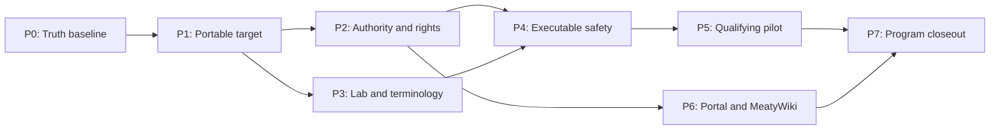

# ARC Clinical Council Adoption v1 — Decisions Block

Date: 2026-07-19
Status: binding planning scaffold
Owner: program owner

## 1. Outcome boundary

The project needs a governed path from the completed pediatric ARC council to repeatable project use.
The outcome is a qualifying, exact-candidate council review workflow with machine-verifiable evidence,
owner-held approvals, local laboratory applicability, and truthful certification state.

This work does not make the pediatric CDS clinically validated or authorize patient care. ARC remains
review and certification infrastructure. Credentialed humans, institutional authorities, and the
applicable V1-V6 validation gates remain external release authorities.

## 2. Source-of-truth inputs

- `docs/project_plans/expansion/00-expansion-plan.md`
- `docs/project_plans/expansion/01-platform-expansion-roadmap.md`
- `docs/project_plans/expansion/02-evidence-foundry-on-research-foundry.md`
- `docs/project_plans/expansion/03-arc-clinical-council-handoff.md`
- ARC PRD, implementation plan, evidence SPIKE, completed readiness-audit bundle, and deferred specs
- ARC commit `72ab6f69bcfd31f5221ff598f4649b21e2f0e06a`
- AOS commit `99d7ee03d2a8c8e584115cf44106b195c3222210`

## 3. Fixed phase boundaries

| Phase | Name | Scope | Points | Exit gate |
|---|---|---|---:|---|
| P0 | Truth reconciliation and adoption baseline | Reconcile master plan, RF results, git/AOS/IntentTree state; pin ARC/AOS revisions and define one project invocation contract. | 3 | All status surfaces agree and a dry-run contract is reproducible without claiming a completed review. |
| P1 | Portable target and evidence consumption | Design and implement a fail-closed, content-addressed way for ARC to review an exact pediatric-project repository artifact or synthetic scenario specification. | 5 | External target resolution is repository-root allowlisted, digest-bound, path-safe, non-patient, and covered by negative tests. |
| P2 | Authority and rights attachments | Add authenticated evidence-rights and credentialed-human approval records with identity, scope, independence, conflicts, signature, revocation, expiry, and exact-digest binding. | 6 | Missing, stale, wrong-scope, duplicate, conflicted, revoked, or wrong-digest records cannot authorize dispatch or certification. |
| P3 | Local laboratory and terminology profiles | Add signed tenant/site laboratory profiles and terminology/FHIR applicability contracts for population, specimen, analyzer/method, units, ranges, critical values, result status, and local mappings. | 7 | Unknown or incompatible applicability fails closed; the first site profile is approved by its laboratory and informatics owners. |
| P4 | Executable safety and validation dependencies | Convert DM-CBC-001 through DM-WORKFLOW-010 into executable fixtures and bind V3/V4/V5 protocol-through-adjudication artifacts as release dependencies. | 7 | Every hazard has an exact fixture, expected output, trace, owner, rollback signal, and protocol-bound result state. |
| P5 | Qualifying pilot and certification | Run the exact candidate through AOS and ARC with policy-clean inputs, independent reviewers, adjudication, credentialed approvals, and exact-tree rereview. | 5 | Bundle validates; runtime qualification is true; certification reflects real gates; clinical release remains separate. |
| P6 | Governed authoring and knowledge access | Add exact-round-trip clinical Portal authoring and a metadata-only MeatyWiki evidence adapter after P2 rights/identity controls exist. | 6 | No field flattening, no source-body retrieval, deterministic projection hashes, access control, rights, freshness, and retraction checks pass. |
| P7 | Program integration and closeout | Wire recurring council gates into P1-P6 execution, document operation, update trackers, and obtain exact-tree technical and clinical-safety review. | 2 | Project agents have one maintained handoff, commands are smoke-tested, accepted findings map to owned work, and all states remain truthful. |
| **Total** | — | — | **41** | Tier 3 |

## 4. Dependency map

Critical path:

`P0 -> P1 -> {P2 + P3} -> P4 -> P5 -> P7`

P6 depends on P2. It may run alongside later P3/P4 work but must not delay P5 because raw YAML and
the repository manifest remain authoritative. P3 also depends on the product program selecting a real
first-site profile and named owners. P4 may author synthetic specifications before P3 completes, but
local-profile execution cannot pass until P3 does.

## 5. Agent routing and write ownership

| Phase | Primary | Independent gates | Write boundary |
|---|---|---|---|
| P0 | program/integration owner | evidence scribe, correctness reviewer | Pediatric repo planning/tracking only |
| P1 | ARC platform engineer | security-governance, correctness, test reviewer | ARC target resolution, schemas, tests; pediatric RunSpec fixtures only |
| P2 | security/governance engineer | clinical governance owner, evidence-rights owner, red team | ARC attachment schemas/runtime; no credential fabrication |
| P3 | lab-profile/informatics engineer | local laboratory director, terminology authority, privacy/security | Target profile contracts plus generic ARC import/validation |
| P4 | safety/test engineer | pediatric heme, lab medicine, general pediatrics, informatics, methods, human factors, equity | Synthetic specifications and validation harness only; no patient records |
| P5 | council coordinator | exact-tree correctness and clinical-safety reviewers; credentialed owners | Run artifacts under ARC; signed attachments in approved owner store |
| P6 | Portal/integration engineers | security-governance, UX workflow, source-rights owner | ARC Portal and metadata adapter; no source bodies |
| P7 | integration owner | task-completion validator and clinical adjudicator | Documentation, trackers, changelog, final run bundle |

Only one integration owner may modify shared ARC runtime/schema files at a time. Parallel agents may
own distinct project fixtures, clinical role content, or sibling AOS adapter tests. Every handoff must
identify exact files, tree, tests, and unresolved owner-held state.

## 6. Risk hotspots

| Risk | Severity | Required mitigation |
|---|---|---|
| Synthetic ARC output is presented as clinical approval | Critical | Schema- and UI-level state separation; authenticated human attachment required for certification; release remains external. |
| External project resolution permits path escape or reviews mutable bytes | Critical | Approved-root allowlist, commit/tree/path/digest binding, no symlinks, immutable materialization, pre-dispatch revalidation. |
| PHI or clinical-record bodies enter prompts, logs, traces, or fixtures | Critical | Explicit artifact class, deidentification-attestation adapter remains absent, negative leakage tests, bounded errors. |
| Restricted evidence is uploaded without rights | Critical | Per-source policy compiler plus authenticated rights receipts; metadata-only local lane remains available. |
| Published ranges are treated as site-applicable | Critical | Signed site/analyzer/method/specimen/unit profile; unknown/mismatch blocks activation. |
| FHIR result state loses corrected/amended/stale provenance | High | Versioned terminology/profile fixtures and fail-closed result lifecycle tests. |
| Passing repository tests is mislabeled as V3/V4/V5 evidence | Critical | Protocol and adjudication artifacts are first-class dependencies; distinguish build, study, certification, and release. |
| Portal or wiki silently flattens governed fields | High | Exact round-trip and deterministic projection tests; raw YAML/manifest remains authoritative until proven. |
| AOS correlation leaks clinical content | High | UUID-only envelope; no target/evidence bodies in correlation metadata. |
| Post-review edits retain stale approval | Critical | Every approval binds candidate digest; material change invalidates prior review and requires exact-tree rerun. |

## 7. Acceptance-contract rules

- Every cross-repository acceptance criterion names exact target surfaces.
- Every introduced field has a missing/null/unknown behavior.
- Every shared file has one integration owner and an explicit seam test.
- Every clinical assertion preserves source locator, applicability, authority, and current status.
- Every release-relevant result records `executed`, `not_executed`, `not_applicable`, or a more specific
  truthful disposition; structural validation alone never upgrades execution state.
- P1 supports only `repository_artifact` and `synthetic_scenario_specification` targets. It must continue
  rejecting `unclassified` and `clinical_record_body`.
- P2-P6 never store patient records, credentials, restricted full text, or raw MeatyWiki bodies in ARC
  run artifacts.

## 8. Phase gate policy

Each phase requires focused tests, full affected-repository validation, task-completion review, and an
exact-tree decision. P1, P2, P3, P5, and P6 additionally require security/governance review. P3, P4,
and P5 require the applicable credentialed human owners; absent owner data yields `not_executed_owner_held`,
not a synthetic pass. Any material edit after approval invalidates that approval.

## 9. Estimation sanity

- H1: no CRUD-with-RBAC product tables are assumed; attachment/profile records still need schema,
  storage boundary, validation, and revocation behavior.
- H2: work spans pediatric, ARC, and AOS repos, but phases budget sibling seams separately rather than
  applying an opaque multiplier.
- H3: P1 target resolution, P2 approval evaluation, P3 applicability matching, and P6 projection/diff
  are algorithmic and receive at least five points each.
- H4: 41 points is the sum of eight independently estimated capability phases.
- H5: the completed ARC pediatric council was a 45-point cross-repository feature; adoption retains
  many governance/runtime seams but reuses its council, roles, schemas, and evidence manifest, so a
  slightly smaller estimate is credible.
- H6: P0/P7 plus validation tasks in every phase cover cross-repo plumbing, inventories, docs, and
  closeout rather than hiding them.

## 10. Open questions for plan expansion

- OQ-1: Which exact approved-root/checkout mechanism should P1 use: managed workspace registration,
  immutable import, or an AOS-resolved snapshot? The phase must SPIKE and choose one before coding.
- OQ-2: Which identity provider, credential authority, signing mechanism, and revocation source can
  produce owner-held P2 records?
- OQ-3: Which institution, analyzers/methods, specimens, units, ranges, critical-value policy, and
  terminology server define the first P3 profile?
- OQ-4: Which intended use, candidate version, datasets, endpoints, and statistical analysis plan bind
  the first V3 protocol?
- OQ-5: Where may rights-protected metadata projections live, and which MeatyWiki vault/ACL model is
  approved for P6?
- OQ-6: Which artifact system is authoritative for signed human approvals and study adjudication?

## 11. Plan expansion target

Expand this decisions block into:

`docs/project_plans/implementation_plans/enhancements/arc-clinical-council-adoption-v1.md`

The plan must remain under 800 lines, include the mandatory phase summary, concrete tasks and structured
acceptance contracts, owner-held entry/exit gates, validation commands or command classes, deferred-item
policy, and explicit cross-repository write ownership.
