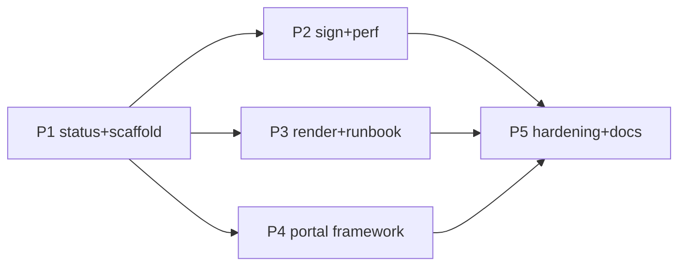

# Decisions Block — clinical-review-workflow (DF-E1-01 v1)

Author: Opus orchestrator (Fable 5) · Date: 2026-07-22 · Tier: 3 · Category: infrastructure
Feature slug: `clinical-review-workflow`
SPIKE-equivalent (waives separate SPIKE): ADR-0004 + `docs/project_plans/design-specs/clinical-review-portal-workflow.md` + shipped `evidence-foundry-e1-v1` Phase 2 + `.claude/worknotes/evidence-foundry-e1-v1/dryrun-friction.md`

## 0. Scope framing (the load-bearing decision)

ADR-0004 (status: **proposed**, G0-gated) chose **append-only git-signed review files** for v1;
the portal is explicitly declined. The file substrate is **already shipped** in
`tools/review-record/` (5 verbs, 2 schemas, roster, Ed25519 lib, dry-run fixtures) by
evidence-foundry-e1-v1 Phase 2. **This feature is NOT a rebuild.** It is the v1 reviewer
*workflow layer* on that substrate:

1. `status` verb — derived review-state + per-module queue/turn-state (friction #4, #5).
2. Scaffold ergonomics — auto-derive `subjectContentHash` (friction #2); scaffold writes a
   record file for the real-identity kind (friction #1).
3. `sign` verb — general-purpose, gate-aware, **fail-closed**: real (`synthetic:false`)
   signing remains structurally impossible until G1/G2; only the dry-run/TESTKEY path is live.
4. `validate` performance — scoped/incremental validation (friction #3), fail-closed caching.
5. Reviewer runbook — guided git workflow for non-engineer clinicians (ADR-0004's admitted
   ergonomic weakness), plus clearer "structurally non-qualifying" messaging.
6. Render queue view — cross-record turn state in the existing static HTML render
   (no server, no auth, no `<script>` — render constraints unchanged).
7. OQ-8 portal-promotion framework — measurable friction metrics, threshold, authorized
   decision owner, decision-record template; portal **concept mockups** (labeled concept-only)
   attached to the design spec to inform the future decision.
8. Tests + `npm run check` integration + docs (`docs/architecture.md` §11 update).

**Out of scope (hard):** the portal application; any real-reviewer signing or roster
`synthetic:false` entries (G1/G2 human acts); ADR-0004 acceptance (G0 human act); any change
to `clinicalApprovers[]`/`approvedBy[]` schema-forced-empty posture; any weakening of D-4
(ARC/council output never populates reviewer/approver fields).

## 1. Phase Boundaries

| Phase | Name | Scope | Success criteria | Exit gate |
|-------|------|-------|------------------|-----------|
| 1 | Derived status & scaffold ergonomics | `status` verb (derived state machine over `reviews/` files, queue/turn output, human + `--json` forms) consuming ONE structured `computeDerivedReviewState` result (see R2), redaction-by-default on independence-sensitive siblings (Rev1/F7), fail-closed `invalid` state (Rev1/F8), terminal all-real state named `acts-complete-unauthorized` — never `release-ready`-like (Rev1/F4); scaffold auto-derives `subjectContentHash` via `subject.mjs` AND (when `--subject` supplied) compares it to `computeModuleContentHash`, `--allow-historical-subject` to override (Rev1/F5); scaffold builds file for real identity kind (still unsigned/`signature: null`); new named task reconciles ADR-0004 conditional-adjudication policy in `lib/adjudication.mjs` (Rev1/F2) | `status` and `validate` both derive from the one `computeDerivedReviewState` result on the committed `cbc_suite_v1` dry-run set + adversarial fixtures; adjudication policy passes on both agree/disagree fixtures; redaction + `invalid` fail-closed proven; zero new deps | task-completion-validator |
| 2 | Sign verb & validate performance | `sign` verb operating on a STAGED DRAFT outside `reviews/` (never opens/rewrites a committed record — Rev1/F1), using `signature.mjs`/ADR-0005 custody seams, gate-aware refusal on `synthetic:false`; scoped `validate --record`/`--module` incremental path with a persistent, COMPOSITE-keyed ({record, complete predecessor-set, roster, schema, validator-policy version, history-mode}), fail-closed reuse outside the repo tree (Rev1/F3) | scaffold-draft→sign→validate round-trips on the synthetic path with exactly one new `reviews/` write and no existing-record rewrite; sign on real path refuses with G1/G2 message; validate wall-time on 5-record module measurably reduced across two processes; 5 fresh-process composite-key invalidation tests prove fail-closed | task-completion-validator |
| 3 | Render queue view & reviewer runbook | Queue/turn-state section in static render; `docs/governance/reviewer-runbook.md` (non-engineer git walkthrough, five-role sequence, correction-via-supersedes, what "non-qualifying" means); improved CLI messaging | render remains `<script>`-free/static; runbook covers all 5 roles end-to-end against the dry-run fixture set | task-completion-validator |
| 4 | Portal-promotion framework & concept assets | OQ-8 answer: friction-metric definitions (manual observation log format — **zero telemetry/network**), promotion threshold, named decision owner role, decision-record template; portal concept mockup images committed under `docs/project_plans/design-specs/assets/`; design-spec update (maturity stays `shaping` for portal section) | framework names metric + threshold + owner; mockups labeled CONCEPT-ONLY; no portal code | task-completion-validator + **karen** (Tier 3 milestone) |
| 5 | Hardening, docs & deferred items | Full test sweep incl. adversarial (transposed hash, out-of-order seq, superseded chains); `npm run check` green; `docs/architecture.md` §11 update; `tools/review-record/README.md` update; deferred-items design-spec stubs (DOC-006) | `npm run check` green; deferred table fully covered | task-completion-validator + **karen** (end of feature) |

## 2. Agent Routing

| Phase | Primary | Secondary | Parallelizable? |
|-------|---------|-----------|-----------------|
| 1 | general-purpose (sonnet) node/CLI engineer | Explore (read-only substrate recon) | status verb ∥ scaffold fixes (distinct files) |
| 2 | general-purpose (sonnet) — crypto/gate-sensitive, single owner | task-completion-validator | sign ∥ validate-perf only after shared-lib seams agreed |
| 3 | general-purpose (sonnet) render; documentation-writer-style (haiku) runbook draft → sonnet clinical-honesty pass | — | render ∥ runbook fully parallel |
| 4 | Opus/orchestrator judgment for threshold+owner framing; codex gpt-5.6 native image tool (mockups) | design-spec edit: sonnet | mockups ∥ framework text |
| 5 | general-purpose (sonnet) tests; haiku docs | karen (gate) | tests ∥ docs |

ICA offload rule (per delegation-router): bounded, ≤2–3-file, non-taste waves MAY go to ICA
`claude-sonnet-5[1m]` (`--bare` + CLAUDE.md injection); gates re-run in-session afterward
(ICA delegates cannot be trusted to have run them — memory: acceptEdits vs execution).
Phase 2 (sign verb) stays in-session: fail-closed crypto-adjacent logic is taste/risk work.

## 3. Risk Hotspots

| ID | Risk | Sev | Mitigation |
|----|------|-----|------------|
| R1 | `sign` verb creates a path to real signatures pre-G1/G2 | **High** | Schema keeps forcing `signature: null` on `synthetic:false`; sign verb refuses real-identity records with explicit gate message; negative tests are acceptance criteria; `verify-d4-built.mjs` untouched |
| R2 | `status` reimplements derived-state logic and drifts from `validate` | High | ONE structured pure assessment result in `lib/derived-state.mjs` — `computeDerivedReviewState(...) -> { state, nextExpectedRole, eligibility, blockers: string[] }` (machine-readable blockers) — that BOTH `status` and `validate` consume; `evaluateReleaseAuthorization` becomes its release-auth sub-check (violations map 1:1 onto `blockers[]`), not a parallel path `status` merely "equals" (Rev1/F6); matrix test over every state × blocker combination |
| R3 | Ergonomic changes weaken reviewer-2 structural independence | High | `nextChainLink` read-scope semantics untouched; independence tests (existing + new) must stay green; explicit AC on every scaffold change |
| R4 | Runbook/docs language implies clinical validity or real sign-off exists | Med | Honesty language mandatory ("unvalidated research prototype", roster synthetic-only); reviewer gate checks wording |
| R5 | Validate caching introduces stale-pass (fail-open) | Med | Cache keyed on canonical content hash; on any miss/uncertainty recompute; dedicated stale-cache test |
| R6 | Portal mockups read as a commitment / second trust boundary creep | Low | CONCEPT-ONLY watermark/labels; design spec stays `maturity: shaping`; no code |
| R7 | Plan tasks accidentally "accept" ADR-0004 or add roster entries | High | Explicit non-goals in every phase prompt; no task may edit ADR status or `governance/reviewer-roster.yaml` real entries |

## 4. Estimation Anchors

- **Anchor (H5):** evidence-foundry-e1-v1 Phase 2 (P2-T1…P2-T8) built the whole substrate
  (~5 verbs, 11 libs, 2 schemas) — larger than this feature. This layer is additive verbs +
  docs + framework on existing libs.
- H1 nouns: 2 new verbs + 2 verb mods + 1 runbook + 1 framework + render section ≈ 12 pts base.
- H3 algorithmic flag: derived-state computation + incremental validation → +3 pts (Phase 1/2).
- H6 hidden plumbing (~18%): tests, README, architecture §11, check-gate wiring → +3 pts.
- H4 bundle-vs-sum floor: 5 phases ≈ 5+4+4+3+3 = **19 pts** (Tier 3 holds).
- Points: P1=5, P2=4, P3=4, P4=3, P5=3.

## 5. Dependency Map

Critical path: P1 (shared derived-state lib) → P2 (sign + perf consume it) → P5 (hardening).
P3 and P4 hang off P1's lib but not P2 → **P3 ∥ P4 may run parallel to P2** after P1.

## 6. Model Routing (per delegation-router registry chains)

| Phase | Model | Effort | Notes |
|-------|-------|--------|-------|
| 1 | sonnet (ICA `claude-sonnet-5[1m]` offload eligible) | adaptive | bounded CLI work; gates re-run in-session |
| 2 | sonnet, **in-session only** | extended | fail-closed crypto-adjacent; no offload |
| 3 | haiku (runbook draft, ICA free) + sonnet (honesty pass, render) | adaptive | documentation chain → ICA Haiku |
| 4 | opus/orchestrator (framework) + codex `gpt-5.6-terra` native image tool (mockups) | adaptive / medium | user directive: image gen on the gpt-5.6/codex lane (codex has a native image tool); concept asset v2 already committed during planning |
| 5 | sonnet (tests) + haiku (docs) | adaptive | — |
| Review gates | task-completion-validator per phase; karen at P4 milestone + end; **codex `gpt-5.6-terra` read-only second-opinion diff review per wave** (memory: catches fail-closed gaps) | high (codex) | second_opinion pinned to codex per user directive |

## 7. Open Questions for Expansion (implementation-planner)

- OQ-1: `sign` verb key source on the synthetic path — reuse dry-run ephemeral TESTKEY flow
  or accept a keyfile arg (custody seam per ADR-0005)? Planner: default TESTKEY-only; keyfile
  behind explicit flag design note, no real-key handling.
- OQ-2: `status --json` output schema — planner to define minimal stable shape (module,
  subjectContentHash, per-role act presence, derived disposition, next-expected-role).
- OQ-3: Runbook location `docs/governance/reviewer-runbook.md` vs `tools/review-record/docs/` —
  planner picks; must be linked from README + architecture §11.
- OQ-4: Friction-metric capture mechanism — must be a committed markdown observation log
  (zero network/telemetry constraint); planner defines the log format + where it lives.
- OQ-5: `changelog_required` — internal tooling, default false; planner may confirm.
- OQ-6: Whether `validate --history` interacts with incremental path (fail-closed union).

## 8. Deferred Items (plan must carry DOC-006 rows)

| Item | Disposition |
|------|-------------|
| Portal implementation (auth/hosting/second trust boundary + its security review) | Deferred; design spec exists (`clinical-review-portal-workflow.md`), stays `shaping`; promotion governed by P4 framework |
| Real-reviewer onboarding (G1 roster entries, out-of-band credential verification) | Owner-blocked human act; runbook prepares for it, never performs it |
| DF-E1-04 retrospective-validation linkage (needs named identity + signed release candidate) | Deferred; note in plan's deferred table, cross-ref ADR-0004 `unblocks` |

## 9. Plan Skeleton Pointer

- Template: `.claude/skills/planning/templates/implementation-plan-template.md`
- Output: `docs/project_plans/implementation_plans/infrastructure/clinical-review-workflow-v1.md`
- PRD: `docs/project_plans/PRDs/infrastructure/clinical-review-workflow-v1.md`
- Frontmatter: `schema_version: 2`, `doc_type: implementation_plan`, `feature_slug: clinical-review-workflow`,
  `risk_level: high`, `deferred_items_spec_refs: []`, `findings_doc_ref: null`, `changelog_required` unset.
- Reading list for planner = digest §G list (PRD will restate it in related_documents).

## 10. Revision History

- **Revision 1 (2026-07-22): applied 10 adversarial-review findings.** R2 restated onto a single
  structured `computeDerivedReviewState` result (F6); Phase 1 success criteria now cover the
  `acts-complete-unauthorized` naming (F4), redaction-by-default `status` output (F7), the fail-closed
  `invalid` state (F8), the `--subject`↔content-hash comparison (F5), and the new named
  conditional-adjudication reconciliation task in `lib/adjudication.mjs` (F2, ADR-0004 stays
  `proposed`); Phase 2 success criteria now cover the staged-draft `sign` lifecycle that never
  rewrites a committed record (F1) and the persistent composite-keyed fail-closed `validate` cache
  (F3). CLI-signature freezing (F9) and non-recursive test-discovery constraint (F10) are carried in
  the implementation plan. Scope, phase boundaries, and the 19-pt estimate anchor are unchanged.
