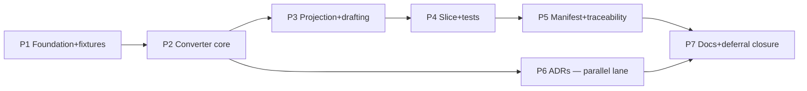

# Decisions Block — evidence-foundry-buildout (Tier 3)

**Author**: Opus orchestrator (direct) · **Date**: 2026-07-19
**Feature slug**: `evidence-foundry-buildout`
**Source docs**: `docs/project_plans/expansion/02-evidence-foundry-on-research-foundry.md` (the spec),
`docs/project_plans/expansion/rf-handoff/RESULTS.md` (upstream completion record),
`docs/project_plans/expansion/rf-handoff/README.md`, `docs/project_plans/expansion/00-expansion-plan.md` §2–§5.
**SPIKE status**: waived-by-equivalence — the 02 doc is a full design spec and the completed rf-handoff
(7/7 verified runs, 576 claims, cross-model fidelity audit) is the research foundation. No separate SPIKE.

## 1. Scope Decision (the load-bearing call)

The EF track spans three increments (E0/E1/E2, 02 §7). **This plan executes E0 (deterministic
wire-up, 02 §7.2) plus drafting the 8 pre-E1 ADRs (02 §8.5).** E1 and E2 are explicitly deferred:

- **In scope (v1)**: module envelope, evidence-registry unification, the `rf-bundle-to-kb-pack`
  converter (EF-WP0 — the central build), vertical-slice migration (4 named rules), generated test
  corpus for the slice, unsigned manifest + conversion report, 8 ADR drafts (`status: proposed`),
  deferred-item design-spec stubs, doc finalization.
- **Deferred to E1 plan (design-spec stubs authored in final phase)**: clinical review portal (L),
  full CBC 12-angle research operation, upstream rf validators, retrospective validation harness (L),
  FHIR/terminology emitters (L), signed release + key custody, property/mutation CI expansion.
- **Deferred to E2 plan**: surveillance/update/registry engine, monitoring, withdraw/rollback.
- **External (not tasks here)**: the 7 RFUP upstream-rf enhancements live in the rf repo
  (route via `op story` per rf-handoff README §6) — model them as external dependencies only.
- **Non-goals (02 §6.4 won't-build)**: restate verbatim in PRD; violations are review-blockers.

**Rationale**: E0 is the only increment whose inputs exist today (verified bundles), it is fully
deterministic (no clinical sign-off needed to build — output is a *proposal*, release authority
none), and it de-risks every E1 item. E1's L-sized items each warrant their own plan.

## 2. Stale-Path Hazard (correct before any task executes)

The 02 doc predates the P0 module-package refactor (commit ff4b519). It cites `data/rules.json`,
`data/evidence.json`, `data/candidates.json`, `src/evidence.js`. Current truth: KB lives at
`modules/anemia/{rules.json,candidates.json,evidence.json,reference-ranges.json}`; `src/facts.js`
is a shim over `modules/anemia/facts.anemia.js`. **Phase 1 must produce a path-mapping note**
(worknotes) reconciling every 02-doc path to the current tree, and every later task cites current
paths. The converter's output layout (`build/kb-pack/<module_id>/<pack_version>/`, 02 §4.4) is new
ground — keep as specified. New projections (`evidence-assertions.json`) land under
`modules/<module_id>/`, not `data/` (OQ-3 for planner to confirm against module contract in
`docs/architecture.md`).

## 3. Phase Boundaries

| # | Phase | Scope | Exit gate |
|---|-------|-------|-----------|
| 1 | Foundation & fixtures | `modules/cbc_suite_v1/module.yaml` envelope (02 §3.2); evidence-registry unification (kill `src/evidence.js` duplication); JSON-Schema validation in `scripts/validate-kb.mjs`; **sanitized in-repo fixture bundle** (from one verified rf run, with hash provenance note); path-mapping note | `npm run check` green; fixture loads; validator rejects a seeded-bad KB |
| 2 | Converter core (EF-WP0) | `tools/rf-bundle-to-kb-pack/` Node ESM scaffold; read-only bundle loader; run/bundle/ledger/source hash pinning; converter-eligibility checks (02 §3.7); `inspect` + `verify` verbs; fail-closed error taxonomy mapped to rf exit codes (02 §5.2) | 15 seam invariants (02 §2.3) each covered by ≥1 executable test; converter refuses non-`verified` bundle |
| 3 | Projection & drafting | Evidence projections (`evidence.json` enrich + `evidence-assertions.json` exact-passage, 02 §4.9–4.10); claim-ledger mapping (02 §4.11); candidate + rule-proposal drafting (02 §4.13); `authoring-decisions.yaml` join (02 §4.12); `propose` verb; stable IDs (02 §4.7) | `propose` on fixture yields schema-valid pack; `mixed`/`contradicted` claims emit conflict-visible objects, never one-sided rules |
| 4 | Vertical slice + test corpus | Migrate the 4-rule slice (young-infant abstention, local-range precedence, iron-deficiency pattern, marrow red-flag safety); strict current-schema rules + rule-provenance; generated positive/negative/boundary/missingness/dangerous-miss tests | Slice rules pass engine tests; dangerous-miss set covers the slice-relevant subset of the 11 named hazards (02 §5.4); no invented thresholds (every value → exact passage) |
| 5 | Manifest & traceability | Unsigned release manifest (02 §4.18 minus signature); conversion report; semantic-diff (minimal: added/removed/changed rules vs active KB); traceability index (claim→passage→rule→test) | Manifest content-hash reproducible across two runs (determinism proof); conversion report enumerates every exclusion with reason |
| 6 | Pre-E1 ADRs | Draft all 8 ADRs (02 §8.5) at `status: proposed` — authoring model/rule-schema v2, passage storage/licensing, terminology ownership, approval identity, KB serialization/signing, validation data boundary, surveillance cadence, Path-B vs native adapter | 8 ADRs exist, each names its decision, options, and the E1 items it unblocks; none marked accepted |
| 7 | Docs & deferral closure | Design-spec stubs for every deferred E1/E2 item (deferred-items policy); CHANGELOG `[Unreleased]`; `docs/architecture.md` converter section; CLAUDE.md pointer; plan status updates | Deferred-items triage table fully mapped to spec stubs; `npm run check` green |

## 4. Agent Routing

- **Phases 1–5 (code)**: sonnet engineer executors per `.claude/skills/planning/references/subagent-assignments.md`
  (Node/ESM backend work; no UI, no DB, no Python). Converter tasks: backend-architect-class agent
  for Phase 2 design tasks, engineer-class for the rest. Test-corpus tasks (Phase 4): testing
  specialist.
- **Phase 6 (ADRs)**: documentation-writer-class agent, sonnet (ADRs carry architectural judgment;
  do not route to haiku). Use `create-adr` skill if its template fits.
- **Phase 7**: documentation-writer, haiku for CHANGELOG/README-ish tasks, sonnet for design-spec stubs.
- **Reviewer gates (Tier 3)**: `task-completion-validator` per phase; `karen` at milestones —
  end of Phase 2 (converter core), end of Phase 5 (E0 functionally complete), end of Phase 7 (feature end).
- **Parallelism**: Phase 6 is independent of Phases 3–5 (docs-only) — run as a parallel lane after
  Phase 2. Phases 1→2→3→4→5 are strictly sequential (each consumes the prior's artifacts).
  Within Phase 3, projection tasks parallelize per output file.

## 5. Risk Hotspots

| Risk | Sev | Mitigation |
|------|-----|------------|
| Seam-invariant regression (converter silently accepts bad input) | **High** | Phase 2 exit gate: 1:1 executable test per invariant (02 §2.3); fail-closed default in error taxonomy; no network/no LLM asserted in tests |
| Invented-threshold leak via drafting phases | **High** | Every numeric in generated rules must carry a passage locator resolvable in `evidence-assertions.json`; Phase 4 gate rejects rules with unresolved evidence refs |
| Stale 02-doc paths executed literally | Med | §2 path-mapping note is a Phase 1 blocking task; planner cites current paths in every task row |
| Fixture provenance/content-rights (verbatim passages committed to repo) | Med | Sanitized fixture task documents source licensing; prefer REG-001-class public-domain or open-access passages; flag any restricted passage to ADR-2 rather than committing it |
| Rule-schema v2 scope creep into E0 | Med | E0 emits **strict current 5-field schema** (`schemas/rule.schema.json`, `additionalProperties: false`); v2 lives in ADR-1 + deferred spec only |
| Determinism drift (hashes differ across runs/machines) | Med | Phase 5 double-run reproducibility gate; sorted serialization; pinned Node ≥20; no timestamps in hashed content |
| Guardrail breach (autonomous clinical output, confidence %) | High | PRD restates hard guardrails + won't-build list as review-blockers; karen milestones check them explicitly |

## 6. Estimation Anchors

- **H5 anchor**: `platform-foundation-p0` (Tier 3, 7-phase squash ff4b519) — comparable multi-phase
  contract-driven refactor in this repo. EF-E0 is similar breadth, more algorithmic depth (converter).
- **H1**: ~6 new artifact classes (envelope, fixture, converter, projections, test corpus, manifest) ≥ 2 pts each.
- **H3 fires**: converter is transform/join/diff/graph — algorithmic flag ≥3 pts per such service;
  test scenarios ARE enumerable from 02 §4.6's 11 phases, so no further SPIKE needed.
- **H4 floor**: per-phase bottom-up: P1=5, P2=8, P3=8, P4=8, P5=5, P6=5, P7=3 → **42 pts**.
- **H6**: hidden plumbing (schema wiring, `npm run check` integration, CI, CHANGELOG) ~15% already
  inside phase numbers; do not add on top.
- **H2**: n/a (no dual local/enterprise implementation).
- Tier 3 confirmed (≥13 pts by 3×).

## 7. Dependency Map

Critical path: **P1 → P2 → P3 → P4 → P5 → P7**. P6 (ADRs) branches after P2, merges before P7.

External inputs (never tasks): verified rf bundles (node `10.42.10.76` / local `research-foundry`
mirror — only the sanitized fixture crosses into this repo); RFUP enhancements (rf upstream repo).

## 8. Model Routing

| Phase | Agent class | Model | Effort |
|-------|------------|-------|--------|
| 1 | engineer | sonnet | adaptive |
| 2 | architect (design tasks), engineer (build) | sonnet | extended for seam-invariant tasks, else adaptive |
| 3 | engineer | sonnet | adaptive |
| 4 | engineer + testing specialist | sonnet | adaptive |
| 5 | engineer | sonnet | adaptive |
| 6 | documentation-writer | sonnet | adaptive |
| 7 | documentation-writer | haiku (CHANGELOG/pointers), sonnet (design-spec stubs) | adaptive |

No external models (offline deterministic work; no UI, no image, no web research).

## 9. Open Questions for implementation-planner (OQ-*)

- **OQ-1**: Module identity for the slice — E0 item 1 says create `modules/cbc_suite_v1/` envelope,
  but the 4-rule vertical slice migrates anemia-scope rules. Confirm from 02 §3.2/§7.2 + module
  contract whether the slice lands in `cbc_suite_v1` or stays in `anemia` with the envelope created
  empty-but-valid. Decide in plan; do not leave to execution.
- **OQ-2**: Which verified run seeds the fixture (prefer public-domain-heavy REG-001 vs clinically
  richer RF-CBC-001) — weigh content-rights vs test realism.
- **OQ-3**: Landing path for `evidence-assertions.json` under the module package contract
  (`modules/<id>/` vs pack-only) — check `docs/architecture.md` module subsection.
- **OQ-4**: Semantic-diff minimal scope for E0 (rule add/remove/change only?) — keep small; full
  impact-graph is E2.

## 10. Plan Skeleton Pointer

- Template: `.claude/skills/planning/templates/implementation-plan-template.md`
- Output: `docs/project_plans/implementation_plans/infrastructure/evidence-foundry-buildout-v1.md`
  (break out phase files if >800 lines; suggested grouping: phase-1-2, phase-3-5, phase-6-7)
- PRD: `docs/project_plans/PRDs/infrastructure/evidence-foundry-buildout-v1.md`
- Progress: `.claude/progress/evidence-foundry-buildout/` (via artifact-tracking skill, one file per phase)
- Human brief: `docs/project_plans/human-briefs/evidence-foundry-buildout.md` (Tier 3 → required;
  migrate §6 above into its Estimation Sanity Check)
- Frontmatter: `changelog_required: true` (new tooling + KB pipeline is user/dev-facing);
  `findings_doc_ref: null`; `deferred_items_spec_refs: []` initialized.

## 11. Addendum — rulings on PRD-discovered OQs (binding)

- **OQ-5 (test layout)**: generated corpus lands flat in `tests/` with prefix naming
  `ef-<module>-<category>.test.mjs` — do NOT change the `npm test` glob (the check gate is
  load-bearing; touching it is out of scope).
- **OQ-6 (build output)**: add `build/` to `.gitignore` (Phase 1 task). `build/kb-pack/` output is
  generated, never committed. Committed golden outputs for converter tests live under
  `tests/fixtures/` instead.
- **OQ-7 (schemas)**: yes — new artifact types (`evidence-assertions`, `rule-provenance`,
  `authoring-decisions`, pack `release-manifest`) each get a `schemas/*.schema.json`, wired into
  `scripts/validate-kb.mjs`. JSON Schema is the repo idiom; hand-rolled structural checks are not.
