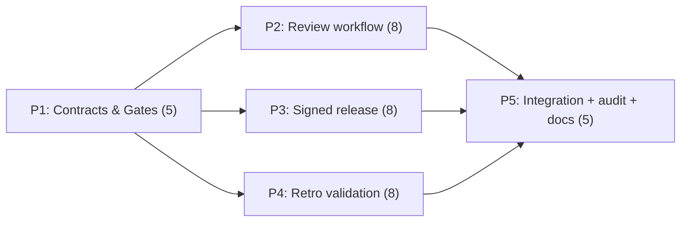

# Decisions Block: Evidence Foundry E1 (triad scope)

**Feature Goal**: Deliver the software machinery for E1's clinical-governance triad — append-only git-signed clinical review workflow (ADR-0004), Ed25519 sign/verify release-candidate tooling with a flat release registry (ADR-0005), and a fixtures-only retrospective validation harness behind the ADR-0006 de-identification boundary — with every human act (review sign-off, signing, adjudication, DUA) modeled as an external gate, never a task.

**This Decisions Block** captures phase boundaries, agent routing, risk hotspots, estimation anchors, and model routing. Binding rulings R1–R6 are recorded in the PRD; this block assumes them.

---

## 1. Phase Boundaries

| Phase | Name | Scope | Success Criteria | Exit Gate |
|-------|------|-------|------------------|-----------|
| P1 | Contracts & Gates | Review-record schema v1 (ADR-0004 five-role model); wave0 `review-record.schema.json` compat mapping + migration test; release-manifest + `releases/registry.json` schema (ADR-0005); gates registry doc (G0 ADR acceptance, human roster, DUA) | All schemas validate; migration test green; gates registry enumerates every human gate with owner=human | `npm run check` green + task-completion-validator |
| P2 | Review workflow machinery | Append-only review-record store layout; CLI for record lifecycle (create → role sign-offs → adjudication → disposition); git-signature verification; minimal read-only static rendering; synthetic end-to-end dry-run | Full five-role cycle executable with synthetic identities clearly marked non-credentialed; append-only enforced by tests; render output carries unvalidated-prototype banner | `npm run check` + validator |
| P3 | Signed release machinery | Release-candidate builder over E0 canonical bytes; manifest w/ content hashes; Ed25519 sign/verify CLI (verify-only in CI); registry seed; signature slot schema-forced empty absent a human custodian; throwaway-key dry-run | Deterministic manifest reproducible byte-for-byte; CI verifies but can never sign; test asserts no key material in repo/CI env | `npm run check` + validator |
| P4 | Retrospective validation harness | Synthetic + de-identified fixture corpus format; harness runner (replay cases → engine outputs vs adjudicated reference labels); independent-adjudication record format; software-agreement metrics report; author the retrospective data-source SPIKE charter | Harness refuses input not marked synthetic/de-identified; metrics labeled software-agreement (never clinical performance); SPIKE charter committed | `npm run check` + validator |
| P5 | Integration, honesty audit, docs | Cross-workstream dry-run (review cycle → release candidate → harness report); honesty-language audit across all new outputs; docs + CHANGELOG; deferred-item design-spec updates (portal, real-data run) | End-to-end dry-run green; audit finds zero validity-implying language; deferred items each have an updated design spec | karen (end-of-feature) + validator |

**Boundary Rationale**:
- P1 first: all three workstreams consume the schemas/contracts; the wave0-vs-ADR-4 model unification (R5) must land before any machinery is built on either model.
- P2 ∥ P3 ∥ P4: disjoint file ownership (review store/CLI vs release builder/signing vs harness/fixtures); all depend only on P1 contracts.
- P5 last: integration and the honesty audit require all three outputs to exist.

---

## 2. Agent Routing

| Phase | Primary Agent(s) | Secondary Agent | Notes |
|-------|------------------|-----------------|-------|
| P1 | backend-architect | general-purpose (sonnet) | Architect owns schema/contract design; engineer writes JSON Schemas + migration + tests |
| P2 | general-purpose (sonnet, Node) | documentation-writer | CLI + store + render; docs agent only for the static-render banner copy |
| P3 | general-purpose (sonnet, Node) | — | Crypto surface is small (Node `crypto` Ed25519); no external deps without justification |
| P4 | general-purpose (sonnet, Node) | spike-writer-style general agent | Harness engineer + separate agent authoring the data-source SPIKE charter |
| P5 | general-purpose (sonnet) | documentation-writer, karen | Integration dry-run owner + docs; karen is the end-of-feature reality gate |

**Parallel Opportunities**:
- P2, P3, P4 run in parallel after P1 (file-ownership disjoint: `tools/review/` vs `tools/release/` vs `tools/validation/` or per-planner layout).
- P5 strictly after all three.
- Tier 3 reviewer cadence: task-completion-validator per phase; karen at the P1-exit milestone (contract sanity) and end of feature.

---

## 3. Risk Hotspots

### Risk 1: Signing custody misdesign (violating SPIKE-006 NO-GO)
- **Severity**: high
- **Rationale**: SPIKE-006 rejected both browser and server-resident signing (signer=author custody collapse). Any design where an agent, CI job, or repo holds a private key recreates the rejected posture and poisons the release trust chain.
- **Mitigation**: Verify-only in CI; signature slots schema-forced empty (wave0 `clinicalApprovers[]` pattern); tests assert absence of key material; throwaway test keys generated ephemerally per test run, never written to the tree; custody remains ADR-0005's human-custodian act, gated.

### Risk 2: Implied clinical validity leakage
- **Severity**: high
- **Rationale**: A "signed release" + "validation harness" + "review records" reads like clinical sign-off. Any output implying validity crosses the repo's hard honesty guardrail.
- **Mitigation**: P5 honesty audit task over every new artifact/output string; metrics named "software agreement," never sensitivity/specificity-as-performance; synthetic identities labeled non-credentialed; validator gate checks language per phase.

### Risk 3: Dual review-record models diverge (wave0 vs ADR-0004)
- **Severity**: medium
- **Rationale**: Two competing contracts (wave0 5-state schema vs ADR-4 five-role signed files) already exist; building machinery on one without mapping strands the other.
- **Mitigation**: P1 delivers the canonical mapping + migration test before any P2 machinery; ADR-0004 model is canonical per ruling R5.

### Risk 4: ADR churn — all 8 pre-E1 ADRs are `proposed`
- **Severity**: medium
- **Rationale**: Building on unaccepted ADRs risks rework if a human edit changes a decision; DF-E1-06's promotion trigger is literally "ADR-5 accepted."
- **Mitigation**: G0 gate recorded in the gates registry at P1; all schemas carry explicit versions; each phase exit includes an ADR-delta check; anything triggered by acceptance stays gated, not built.

### Risk 5: Retrospective harness scope creep toward real data
- **Severity**: medium
- **Rationale**: The data-source SPIKE is unrun and no DUA exists; touching real data would breach ADR-0006's boundary and PHI guardrails.
- **Mitigation**: Harness rejects inputs lacking a synthetic/de-identified provenance marker (enforced in code + test); real-data run is a deferred item gated on DUA + SPIKE verdict.

### Risk 6: E0 canonical-bytes interface drift
- **Severity**: low
- **Rationale**: P3's manifest determinism depends on E0's canonical serialization staying byte-stable.
- **Mitigation**: P3 pins a golden-bytes regression fixture from E0 output; failure blocks the phase, not a silent re-baseline.

---

## 4. Estimation Anchors

### Total: 34 points

| Phase | Points | Reasoning Anchor |
|-------|--------|------------------|
| P1 | 5 | E0 Phase 1 schema/contract work (~5 pts); H1 noun-count: 3 schemas + mapping + gates registry |
| P2 | 8 | E0 converter CLI phases (~8 pts for CLI + store + tests); five-role state machine is H3-flagged (state transitions enumerable, so no SPIKE) |
| P3 | 8 | No direct in-repo anchor for crypto tooling; SPIKE-006 + ADR-5 de-risked design; Node-native Ed25519 keeps surface small; +1 pt H6 plumbing for CI verify wiring |
| P4 | 8 | cbc_suite_v1 vertical-slice fixture work (~6 pts) + adjudication record format + SPIKE charter authoring (~2 pts) |
| P5 | 5 | E0 Phase 6-7 docs/ADR phase (~5 pts); includes honesty audit + deferred-spec updates + CHANGELOG |

**Estimation Notes**:
- Anchor (H5): evidence-foundry-buildout-v1 E0 = 42 pts across 7 phases; this triad is narrower (no converter, no vertical slice) → 34 pts is a defensible −20% delta.
- H4 bundle-vs-sum: three capability areas (review, release, validation) estimated independently and summed; treat 34 as the floor.
- Unknown that could inflate: registry.json E2-seed fields (keep to seed-only to cap scope).

---

## 5. Dependency Map

**Critical Path**: P1 → (longest of P2/P3/P4) → P5

**Parallelizable Slices**: P2 ∥ P3 ∥ P4 after P1 exit — disjoint file ownership; each has its own validator gate so a lagging workstream doesn't block the others' review.

External human gates (never tasks, may overlap any phase): G0 ADR ratification; G1 named reviewer roster; G2 signing custodian + key ceremony; G3 data-partner DUA; G4 release authorizer. No phase exit depends on a human gate; gated behaviors ship schema-forced inert.

---

## 6. Model Routing

| Phase | Agent | Model | Effort | Rationale |
|-------|-------|-------|--------|-----------|
| P1 | backend-architect | sonnet | high | Contract unification (R5) is the highest-leverage design call |
| P1 | engineer | sonnet | medium | Schema + test implementation is mechanical once designed |
| P2 | engineer | sonnet | medium | CLI/state machine; enumerable transitions |
| P3 | engineer | sonnet | high | Crypto-adjacent code + determinism; correctness over speed |
| P4 | engineer | sonnet | medium | Harness + fixtures; boundary enforcement tests |
| P4 | SPIKE charter author | sonnet | medium | Charter authoring from ADR-0006 + brief |
| P5 | integrator + docs | sonnet / haiku | medium / adaptive | Dry-run wiring sonnet; doc mechanics haiku |

**Model Routing Notes**:
- No external models needed; no UI beyond static render (no gemini wireframing).
- Reviewers: task-completion-validator (sonnet) per phase; karen at P1-exit milestone + end of feature (Tier 3 cadence).

---

## 7. Open Questions for Expansion

- **OQ-1**: CLI shape — single `ef`-style entry with subcommands vs separate npm scripts; follow E0's converter convention (planner: check E0 plan's tooling layout and match it).
- **OQ-2**: Review-record store layout — directory scheme, filename convention, and whether signatures are git commit signatures, detached sig files, or both (ADR-0004 constrains; planner picks the concrete layout).
- **OQ-3**: Static render target — where rendered review/release views land (docs/ vs build output) given the no-server, no-PHI, no-third-party-script constraints.
- **OQ-4**: `releases/registry.json` — which E2-seed fields (surveillance/withdraw hooks) are included as inert placeholders vs omitted entirely; keep to the minimum that avoids an E2 schema break.
- **OQ-5**: Retrospective metrics set — which software-agreement measures the harness reports (per-pattern agreement, flag coverage, missing-data prompt rate) and the report file format.
- **OQ-6**: Throwaway-key ergonomics — ephemeral in-memory generation per test run vs a `--test-keys` CLI flag; must satisfy Risk 1 mitigations either way.

---

## 8. Plan Skeleton Pointer

- **Location**: `.claude/skills/planning/templates/implementation-plan-template.md`
- **Process**: `implementation-planner` (sonnet) expands this block + the PRD into the full plan (detailed phases, task tables with IDs/ACs/estimates/agents/models, batch definitions, R-P1..R-P4 compliance, Deferred Items triage table with design-spec tasks).
- **Output path**: `docs/project_plans/implementation_plans/infrastructure/evidence-foundry-e1-v1.md` (phase breakout files under `evidence-foundry-e1-v1/` if >800 lines).
- **Opus review**: sanity check post-expansion — phase boundaries, gate modeling (gates never tasks), honesty language, R1–R6 fidelity.
