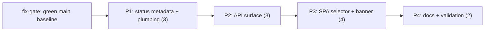

# Decisions Block: Module Switcher (DEF-6)

**Feature Goal**: Expose `moduleId` as a client-settable surface (API + SPA selector) so any registered module renders, with every unsigned module gated behind an unmissable, fail-closed "unsigned implementation proposal — not clinically reviewed" banner and a machine-readable equivalent in API responses.

**Trigger state**: The design spec's own promotion trigger ("a second registered module") is met — the registry now holds multiple modules (anemia + E1-converted scaffolds). The spec's 2026-07-21 deferral re-confirmation predates the E1 multi-bundle merge and is superseded by current registry state.

**Non-negotiable constraints** (restate in every phase): unvalidated research prototype; `approvedBy[]`/`clinicalApprovers[]` stay empty; no generative model in the decision path; no invented thresholds; zero clinical-content changes — this feature is pure platform plumbing + UI. Ranking score stays ordinal-only in all new UI copy.

---

## 1. Phase Boundaries

| Phase | Name | Scope | Success Criteria | Exit Gate |
|-------|------|-------|------------------|-----------|
| P1 | Registration gap (FR-0) + status accessor + tripwire retirement | **FR-0 first**: register `kidney_suite_v1`/`growth_suite_v1` in `src/units.js` (zero-analyte path) and `src/evidence/registry.js` (citation-layer accessors mirroring `modules/cbc_suite_v1/evidence.js`) — without this, `assess()` throws for 2 of 4 modules. Then: shared signing-status accessor per PRD FR-9 rule (`status === 'integrity-recorded' AND approvedBy.length > 0` ⇒ signed; ANY deviation ⇒ `unsigned-proposal`, fail-closed — today no module qualifies, including anemia); correct the two tripwire comments (`src/modules/registry.js:39-50`, `tests/module-registry.test.mjs:20-26` — assertion may stay per FR-11/FR-13); verify all 4 modules assess end-to-end via `assess(input, moduleId, …)` (`src/engine.js:19`), incl. kidney/growth empty-rules path | FR-0 plumbing lands with zero clinical content; accessor unit-tested incl. fail-closed unknown-enum default; per-module assess smoke incl. empty-rules modules | `npm test` green on new suites; no clinical JSON touched |
| P2 | Public API surface | `POST /api/v1/assess` optional `moduleId` body field (default `DEFAULT_MODULE_ID`); `isRegisteredModule()` validation → structured 4xx per existing `{error, code?, details?}` contract (`src/serverErrors.js`); per-request module resolution from the already-loaded `modulesById` (`server.mjs:123-124` startup map); unsigned-proposal flag in assess response (KB endpoint already discloses per-module `status`/`approvedBy` — reuse, don't duplicate); retire AC-5 guardrail comment (`server.mjs:126-134`) deliberately; decide non-servable-module assess behavior (honest 4xx, mirroring startup servability policy `server.mjs:104-121`); `openapi.yaml` + `schemas/patient-input.schema.json` updated | API tests cover default, explicit valid, unknown, non-string, non-servable moduleId; openapi validates | `npm test` + `npm run validate` green |
| P3 | SPA module selector + unsigned banner | Selector control in `index.html` + moduleId state in `src/app.js`; parameterize the hardcoded `./modules/anemia/*` fetches at the single KB-load seam (`app.js:553-564`); switch `assessPediatricAnemia` → `assess(input, moduleId, rules, candidates)`; persistent unmissable per-module banner adjacent to the existing global `safety-banner` (`index.html:41-43`), driven by the P1 accessor over bundled module metadata (build already ships all `modules/` into dist — `scripts/build-static.mjs:84-86`), never a hardcoded id list; honest empty-state for zero-rule modules (kidney/growth) | Browser smoke passes; banner shown for every non-signed module; no new network calls; `check:imports` passes (new fetch specifiers must resolve in dev + dist layouts) | `npm run build` + `npm run smoke:browser` + `npm run check:imports` green |
| P4 | Docs, doc-truth, validation sweep | `openapi.yaml` final, `docs/architecture.md` module-status table touch-up (must not affirm any clearance — `tests/notice-architecture-no-clearance.test.mjs`), design-spec `maturity: promoted` + prd_ref, deferred-items table, full gate | Full `npm run check` green (on a green baseline — see Risk 1) | task-completion-validator per phase already run; karen end-of-feature |

**Boundary Rationale**:
- P1–P2: the fail-closed status accessor is the load-bearing safety artifact; API and UI must consume it, never re-derive it. It lands first, alone, and gets its own tests.
- P2–P3: API contract (incl. the machine-readable unsigned flag) is frozen before UI consumes it; SPA is browser-local so it consumes the bundled equivalent of the same metadata.
- P3–P4: docs/doc-truth last so they describe what actually shipped.

---

## 2. Agent Routing

Session reality: the specialist roster (`python-backend-engineer`, `ui-engineer-enhanced`, …) is **not registered** in this environment. Route execution through `phase-owner` (per phase) dispatching `general-purpose` (sonnet) executors. **Pre-launch probe required**: verify `task-completion-validator` and `karen` resolve before starting any wave (known failure mode: unregistered reviewer → silent review skip).

| Phase | Primary Agent(s) | Secondary Agent | Notes |
|-------|------------------|-----------------|-------|
| P1 | general-purpose (sonnet) | — | Registry/engine plumbing; small blast radius, test-first |
| P2 | general-purpose (sonnet) | codex gpt-5.6-terra (read-only diff review) | Public contract change — per-wave second-opinion gate per project memory |
| P3 | general-purpose (sonnet) | codex gpt-5.6-terra (read-only diff review) | SPA is vanilla JS; banner is safety-relevant UI |
| P4 | general-purpose (haiku ok for docs) | task-completion-validator + karen | Doc-truth test edits stay sonnet |

**Parallel Opportunities**: P2 and P3 could parallelize on file ownership (server.mjs vs app.js) but **sequence them anyway** — P3 consumes P2's frozen contract, and the repo's parallel-PR schema-drift incident (project memory) argues for serial here. P1 is strictly first. Offload: bounded P2/P3 code waves are ICA-eligible (`claude-sonnet-5[1m]` via delegation-router) **only with bypassPermissions** so gates actually run; otherwise keep in-session.

---

## 3. Risk Hotspots

### Risk 1: `npm run check` is RED on main
- **Severity**: high (execution blocker, not a planning blocker)
- **Rationale**: 25 pre-existing failing subtests (of 2412) at `263120b` — E1 baseline/hash-pin drift (`ef-anemia-backfill-integrity`, `ef-p4-t8-honesty-ac`, cbc converter suites) + rights gates + `notice-architecture-no-clearance`. Green-gate-before-commit is unfalsifiable on a red baseline.
- **Mitigation**: Plan declares a hard entry dependency: execution starts only after the fix-gate lands (candidate branches exist: `fix/d4-dist-order` et al.) and records the green baseline SHA before P1. No phase commits on a red baseline. Module-switcher work must NOT "fix" the drifted hash pins itself — that's the fix-gate's scope.

### Risk 2: Banner keying and fail-closed semantics
- **Severity**: high (drives P1's existence)
- **Rationale**: a trustworthy status field EXISTS (`module.json.status`, closed enum, all non-anemia = `unsigned-stub`), but executors will still be tempted to hardcode `moduleId !== 'anemia'` — which silently rots when module #5 lands and inverts the safety default. Also the enum will grow (e.g. `release-ready`); unknown values must not be treated as signed.
- **Mitigation**: P1 accessor keys on status enum with explicit fail-closed semantics (any unrecognized/absent value ⇒ `unsigned-proposal`) + unit test proving it. AC per R-P2: UI handles missing status. Anemia (`integrity-recorded`, `approvedBy:[]`, `validationRunId:"local-dev:unattested"`) is ALSO not clinically signed — banner logic keys on signing state, not module identity: anemia keeps its existing global unvalidated-prototype banner; every `unsigned-proposal`-status module additionally gets the stronger per-module unsigned-proposal banner. No status value existing today qualifies as "signed".

### Risk 3: Public API contract change rigor (design-spec OQ-5)
- **Severity**: medium
- **Rationale**: `openapi.yaml` + assess contract is a public surface; the repo treats contract changes as review-worthy even when non-clinical.
- **Mitigation**: additive-only, backward-compatible change (absent `moduleId` ⇒ exact current behavior, byte-identical for anemia); codex read-only diff review on P2; doc-truth test pins the contract.

### Risk 4: SPA bundling of all modules (browser-local, no PHI egress)
- **Severity**: medium
- **Rationale**: SPA is fully browser-local; selector must not introduce any network fetch or third-party asset. Bundling 4 modules grows the bundle; build/smoke behavior may shift.
- **Mitigation**: keep static bundling of all registered modules at build time; smoke:browser asserts no new requests; size delta recorded in P3 completion note.

### Risk 5: Scaffold modules ARE structurally incomplete (confirmed)
- **Severity**: medium
- **Rationale**: `kidney_suite_v1` and `growth_suite_v1` ship literally empty `rules.json` (`[]`) and `candidates.json` (`{}`); `cbc_suite_v1` has drafted content and delegates facts derivation to anemia's facts module (`MODULE_CODE_LOADERS`, `registry.js:68-73` — intentional OQ-1 delegation). An empty module renders a blank/misleading assessment view.
- **Mitigation**: P1 verifies each registered module loads and assesses in tests (`tests/empty-rules-regression.test.mjs` is prior art); SPA renders an honest empty-state ("this proposal module contains no rules yet") rather than a blank result — never fabricating content. Zero-rule tolerance already exists in `verify:d4`.

---

## 4. Estimation Anchors

### Total: 13 points

| Phase | Points | Reasoning Anchor |
|-------|--------|------------------|
| P1 | 4 | Comparable to P0's registry refactor slices (platform-foundation-p0), +1 for FR-0 registration-gap plumbing across `src/units.js` + `src/evidence/registry.js` (two modules, mirrored pattern) |
| P2 | 3 | Additive body field + validation + error contract; anchored to prior server.mjs endpoint work in wave0; H6 plumbing (openapi, doc-truth) counted in P4 |
| P3 | 4 | Largest: selector UI + banner + bundling in a no-framework SPA; anchored to prior app.js result-rendering changes; UI + safety copy review overhead |
| P4 | 2 | Docs/doc-truth/design-spec promotion; mechanical but gate-heavy |

**Estimation Notes**: H5 anchor = platform-foundation-p0 refactor (same files, similar shape, completed). H4 floor check: 4 capability areas (registry, API, UI, docs) ≥ 10 pts — 12 is consistent. No dual-implementation multiplier (single runtime). Unknown that could inflate: Risk 2 (if manifest schema needs a new non-clinical field + schema validation update, P1 → 4–5 pts).

---

## 5. Dependency Map

**Critical Path**: fix-gate green baseline → P1 → P2 → P3 → P4 (fully serial by design; see §2).

**Parallelizable Slices**: within P2, openapi.yaml authoring ∥ server.mjs implementation (distinct files, same owner-phase); within P3, banner CSS ∥ selector wiring.

---

## 6. Model Routing

| Phase | Agent | Model | Effort | Rationale |
|-------|-------|-------|--------|-----------|
| P1 | general-purpose | sonnet | adaptive | Bounded plumbing, clear spec |
| P2 | general-purpose | sonnet | adaptive | Contract precision matters; not conceptually hard |
| P2 review | codex | gpt-5.6-terra | medium | Read-only diff second opinion (project-memory gate) |
| P3 | general-purpose | sonnet | adaptive | Vanilla-JS UI; safety copy reviewed by validator |
| P3 review | codex | gpt-5.6-terra | medium | Banner fail-closed check is the review focus |
| P4 | general-purpose | haiku (docs) / sonnet (doc-truth tests) | adaptive | Mechanical finalization |

**Model Routing Notes**: ICA offload (`claude-sonnet-5[1m]`) permitted for P2/P3 code waves per delegation-router, bypassPermissions required (gates must run); never offload the karen/validator gates themselves. No image/UI-mockup model work needed.

---

## 7. Open Questions for Expansion

- **OQ-1**: **Resolved (PRD FR-1)** — body field on `POST /api/v1/assess`; additive, backward-compatible; no route-matching machinery in the hand-rolled server.
- **OQ-2**: **Resolved (PRD FR-5/FR-6)** — knowledge-base keeps returning all modules unconditionally; the real work is documenting the already-returned `modules` field in `openapi.yaml` (pre-existing drift) + the additive signing-status flag. No filter param.
- **OQ-3** (from design spec): array `moduleId` / multi-module assessment. **Resolved: out of scope.** Single-select only; record as deferred item with design-spec pointer.
- **OQ-4**: **Resolved by recon** — reuse the existing `{error, code?, details?}` envelope (`src/serverErrors.js`, `openapi.yaml components.schemas.Error`); unknown moduleId gets a 400 with a `code`; planner defines the exact `code` string and whether `details[]` lists registered ids.
- **OQ-5**: **Resolved by recon** — display names come from `modules/<id>/module.json` `title`; no invented naming. Planner decides how the browser SPA reads it (module.json is already copied into dist by the build).
- **OQ-6** (new): non-servable-module assess behavior — server startup tolerates non-default modules failing servability (`server.mjs:104-121`); if a module is registered but failed to load, does POST assess return 400 or 503? Planner grounds in the existing servability policy; must be honest, never silent fallback to anemia.

---

## 8. Plan Skeleton Pointer

- **Template**: `.claude/skills/planning/templates/implementation-plan-template.md`
- **Output path**: `docs/project_plans/implementation_plans/features/module-switcher-v1.md`
- **PRD**: `docs/project_plans/PRDs/features/module-switcher-v1.md` (authored in parallel; planner reads it first and reconciles — PRD wins on product intent, this block wins on phase/agent/model structure).
- **Opus review**: sanity pass post-expansion before progress files are generated.

## Notes for implementation-planner

- Apply R-P1..R-P4: the banner AC needs `target_surfaces` (app.js render sites), a propagation contract (registry status → API flag → UI banner), resilience (missing status ⇒ banner), and a runtime-smoke verification task referencing every surface.
- Every phase's task table must carry the constraint line: "no clinical JSON edits; approvedBy[]/clinicalApprovers[] untouched".
- P4 must include the DOC-006 deferred-items rows (multi-module assessment view, KB filtering if skipped) and design-spec promotion task.
