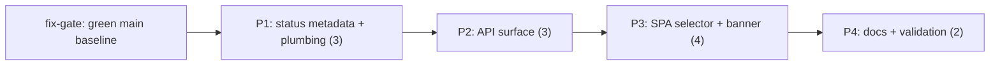

# Decisions Block: Module Switcher (DEF-6)

**Feature Goal**: Expose `moduleId` as a client-settable surface (API + SPA selector) so any registered module renders, with every unsigned module gated behind an unmissable, fail-closed "unsigned implementation proposal — not clinically reviewed" banner and a machine-readable equivalent in API responses.

**Trigger state**: The design spec's own promotion trigger ("a second registered module") is met — the registry now holds multiple modules (anemia + E1-converted scaffolds). The spec's 2026-07-21 deferral re-confirmation predates the E1 multi-bundle merge and is superseded by current registry state.

**Non-negotiable constraints** (restate in every phase): unvalidated research prototype; `approvedBy[]`/`clinicalApprovers[]` stay empty; no generative model in the decision path; no invented thresholds; zero clinical-content changes — this feature is pure platform plumbing + UI. Ranking score stays ordinal-only in all new UI copy.

---

## 1. Phase Boundaries

| Phase | Name | Scope | Success Criteria | Exit Gate |
|-------|------|-------|------------------|-----------|
| P1 | Module status metadata + engine plumbing | Registry-level per-module signing/release status accessor (derived from existing manifest/schema state, fail-closed: absent/unknown → `unsigned-proposal`); confirm assess path is fully module-parameterized (facts, rules, candidates, ranges resolved by moduleId) | Status accessor unit-tested incl. fail-closed default; engine assess runs end-to-end for a non-anemia module in tests | `npm test` green on new suites; no clinical JSON touched |
| P2 | Public API surface | `POST /api/v1/assess` optional `moduleId` body field (default `DEFAULT_MODULE_ID`); `isRegisteredModule()` validation → structured 4xx; unsigned-proposal flag in assess + knowledge-base responses; KB scoping decision implemented; remove/replace the AC-5 guardrail comment deliberately; `openapi.yaml` updated | API tests cover default, explicit valid, unknown, non-string moduleId; openapi validates | `npm test` + `npm run validate` green; error contract documented |
| P3 | SPA module selector + unsigned banner | Module selector UI in `src/app.js`; selection drives derivation/rules/candidates/ranges; persistent unmissable banner for any module whose status ≠ clinically-signed (today: all; practically: styling emphasis on non-anemia), derived from P1 metadata, never a hardcoded id list; browser-local bundle carries all modules | Browser smoke passes; banner visible in every non-signed module state incl. default; no network calls added | `npm run build` + `npm run smoke:browser` green |
| P4 | Docs, doc-truth, validation sweep | `openapi.yaml` final, README/architecture touch-ups, design-spec `maturity: promoted` + prd_ref, doc-truth tests, deferred-items table, full gate | Full `npm run check` green (on a green baseline — see Risk 1) | task-completion-validator per phase already run; karen end-of-feature |

**Boundary Rationale**:
- P1–P2: the fail-closed status accessor is the load-bearing safety artifact; API and UI must consume it, never re-derive it. It lands first, alone, and gets its own tests.
- P2–P3: API contract (incl. the machine-readable unsigned flag) is frozen before UI consumes it; SPA is browser-local so it consumes the bundled equivalent of the same metadata.
- P3–P4: docs/doc-truth last so they describe what actually shipped.

---

## 2. Agent Routing

Session reality: the specialist roster (`python-backend-engineer`, `ui-engineer-enhanced`, …) is **not registered** in this environment. Route execution through `phase-owner` (per phase) dispatching `general-purpose` (sonnet) executors. **Pre-launch probe required**: verify `task-completion-validator` and `karen` resolve before starting any wave (known failure mode: unregistered reviewer → silent review skip).

| Phase | Primary Agent(s) | Secondary Agent | Notes |
|-------|------------------|-----------------|-------|
| P1 | general-purpose (sonnet) | — | Registry/engine plumbing; small blast radius, test-first |
| P2 | general-purpose (sonnet) | codex gpt-5.6-terra (read-only diff review) | Public contract change — per-wave second-opinion gate per project memory |
| P3 | general-purpose (sonnet) | codex gpt-5.6-terra (read-only diff review) | SPA is vanilla JS; banner is safety-relevant UI |
| P4 | general-purpose (haiku ok for docs) | task-completion-validator + karen | Doc-truth test edits stay sonnet |

**Parallel Opportunities**: P2 and P3 could parallelize on file ownership (server.mjs vs app.js) but **sequence them anyway** — P3 consumes P2's frozen contract, and the repo's parallel-PR schema-drift incident (project memory) argues for serial here. P1 is strictly first. Offload: bounded P2/P3 code waves are ICA-eligible (`claude-sonnet-5[1m]` via delegation-router) **only with bypassPermissions** so gates actually run; otherwise keep in-session.

---

## 3. Risk Hotspots

### Risk 1: `npm run check` is RED on main
- **Severity**: high (execution blocker, not a planning blocker)
- **Rationale**: green-gate-before-commit is unfalsifiable on a red baseline; "my change didn't break it" claims become unverifiable.
- **Mitigation**: Plan declares a hard entry dependency: execution branches from the fix-gate merge (or cherry-picks it) and records the green baseline SHA before P1 starts. No phase commits on a red baseline.

### Risk 2: No trustworthy per-module signing-status field exists yet
- **Severity**: high (drives P1's existence)
- **Rationale**: banner must derive from module metadata, fail closed. If the manifest lacks a status field, executors will be tempted to hardcode `moduleId !== 'anemia'` — which silently rots when a fifth module lands, and inverts the safety default.
- **Mitigation**: P1 builds the accessor with explicit fail-closed semantics (`unknown → unsigned-proposal`) + unit test proving absence ⇒ banner. AC wording per R-P2: UI must handle missing status. Anemia itself is ALSO unsigned today (0/91 rules grounded; clinicalApprovers empty by design) — the banner logic must key on signing state, not module identity, so anemia keeps its existing unvalidated-prototype framing and non-anemia modules get the stronger unsigned-proposal banner.

### Risk 3: Public API contract change rigor (design-spec OQ-5)
- **Severity**: medium
- **Rationale**: `openapi.yaml` + assess contract is a public surface; the repo treats contract changes as review-worthy even when non-clinical.
- **Mitigation**: additive-only, backward-compatible change (absent `moduleId` ⇒ exact current behavior, byte-identical for anemia); codex read-only diff review on P2; doc-truth test pins the contract.

### Risk 4: SPA bundling of all modules (browser-local, no PHI egress)
- **Severity**: medium
- **Rationale**: SPA is fully browser-local; selector must not introduce any network fetch or third-party asset. Bundling 4 modules grows the bundle; build/smoke behavior may shift.
- **Mitigation**: keep static bundling of all registered modules at build time; smoke:browser asserts no new requests; size delta recorded in P3 completion note.

### Risk 5: Scaffold modules may be structurally incomplete
- **Severity**: medium
- **Rationale**: E1 conversion produced scaffolds with "zero new clinical rules" — a module lacking candidates/rules may render an empty or misleading assessment view.
- **Mitigation**: P1 verifies each registered module loads and assesses in tests; SPA renders an honest empty-state ("no rules in this proposal module yet") rather than a blank result — never fabricating content.

---

## 4. Estimation Anchors

### Total: 12 points

| Phase | Points | Reasoning Anchor |
|-------|--------|------------------|
| P1 | 3 | Comparable to P0's registry refactor slices (platform-foundation-p0): single-file registry surface + tests |
| P2 | 3 | Additive body field + validation + error contract; anchored to prior server.mjs endpoint work in wave0; H6 plumbing (openapi, doc-truth) counted in P4 |
| P3 | 4 | Largest: selector UI + banner + bundling in a no-framework SPA; anchored to prior app.js result-rendering changes; UI + safety copy review overhead |
| P4 | 2 | Docs/doc-truth/design-spec promotion; mechanical but gate-heavy |

**Estimation Notes**: H5 anchor = platform-foundation-p0 refactor (same files, similar shape, completed). H4 floor check: 4 capability areas (registry, API, UI, docs) ≥ 10 pts — 12 is consistent. No dual-implementation multiplier (single runtime). Unknown that could inflate: Risk 2 (if manifest schema needs a new non-clinical field + schema validation update, P1 → 4–5 pts).

---

## 5. Dependency Map

**Critical Path**: fix-gate green baseline → P1 → P2 → P3 → P4 (fully serial by design; see §2).

**Parallelizable Slices**: within P2, openapi.yaml authoring ∥ server.mjs implementation (distinct files, same owner-phase); within P3, banner CSS ∥ selector wiring.

---

## 6. Model Routing

| Phase | Agent | Model | Effort | Rationale |
|-------|-------|-------|--------|-----------|
| P1 | general-purpose | sonnet | adaptive | Bounded plumbing, clear spec |
| P2 | general-purpose | sonnet | adaptive | Contract precision matters; not conceptually hard |
| P2 review | codex | gpt-5.6-terra | medium | Read-only diff second opinion (project-memory gate) |
| P3 | general-purpose | sonnet | adaptive | Vanilla-JS UI; safety copy reviewed by validator |
| P3 review | codex | gpt-5.6-terra | medium | Banner fail-closed check is the review focus |
| P4 | general-purpose | haiku (docs) / sonnet (doc-truth tests) | adaptive | Mechanical finalization |

**Model Routing Notes**: ICA offload (`claude-sonnet-5[1m]`) permitted for P2/P3 code waves per delegation-router, bypassPermissions required (gates must run); never offload the karen/validator gates themselves. No image/UI-mockup model work needed.

---

## 7. Open Questions for Expansion

- **OQ-1** (from design spec): body field vs `/api/v1/assess/:moduleId` path segment. **Opus lean: body field** — additive, backward-compatible, matches "assess this payload with this engine" semantics, and avoids route-matching machinery in the hand-rolled server. Planner: confirm against server.mjs routing reality; if the PRD recommends otherwise with grounded rationale, PRD wins.
- **OQ-2** (from design spec): knowledge-base scoping. **Opus lean: keep returning all modules** (harmless, SPA is bundle-local anyway) + optional `?moduleId=` filter only if the SPA actually needs it — do not build speculative filtering.
- **OQ-3** (from design spec): array `moduleId` / multi-module assessment. **Resolved: out of scope.** Single-select only; record as deferred item with design-spec pointer.
- **OQ-4**: exact error body shape for unknown moduleId — planner must ground in server.mjs's existing 4xx convention (recon brief has anchors) rather than inventing a new envelope.
- **OQ-5**: where module display names come from (registry metadata vs derived from id) — planner resolves from actual registry fields; no invented clinical naming.

---

## 8. Plan Skeleton Pointer

- **Template**: `.claude/skills/planning/templates/implementation-plan-template.md`
- **Output path**: `docs/project_plans/implementation_plans/features/module-switcher-v1.md`
- **PRD**: `docs/project_plans/PRDs/features/module-switcher-v1.md` (authored in parallel; planner reads it first and reconciles — PRD wins on product intent, this block wins on phase/agent/model structure).
- **Opus review**: sanity pass post-expansion before progress files are generated.

## Notes for implementation-planner

- Apply R-P1..R-P4: the banner AC needs `target_surfaces` (app.js render sites), a propagation contract (registry status → API flag → UI banner), resilience (missing status ⇒ banner), and a runtime-smoke verification task referencing every surface.
- Every phase's task table must carry the constraint line: "no clinical JSON edits; approvedBy[]/clinicalApprovers[] untouched".
- P4 must include the DOC-006 deferred-items rows (multi-module assessment view, KB filtering if skipped) and design-spec promotion task.
