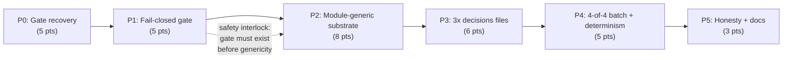

# Decisions Block: Multi-Bundle Conversion E1 — Finish the Converter Pass

**Feature Goal**: Make `tools/rf-bundle-to-kb-pack` genuinely module-generic and genuinely decision-driven, so that all four verified `rf` evidence bundles (`rf-ev-001`, `rf-cbc-002`, `rf-kid-001`, `rf-gro-002`) project into their target modules reproducibly through the real committed converter — while a newly-enforced fail-closed gate guarantees that the three previously-bespoke modules emit **zero** new clinical rules.

**This Decisions Block** captures phase boundaries, agent routing, risk hotspots, estimation anchors, and model routing to guide expansion into a full PRD + Implementation Plan. Opus authors this; `implementation-planner` expands it.

---

## 0. Premise Correction (binding — read before anything else)

The originating request assumed the blocker was *"the missing per-module `authoring-decisions.yaml`"*. SPIKE-009 disproved this empirically. **Authoring three YAML files alone accomplishes nothing.** Two independent code-level blockers sit behind the missing files:

1. **Hard-coded module gate.** `lib/rule-candidate-drafts.mjs:75` pins `MODULE_ID = 'cbc_suite_v1'`; `lib/verbs/propose.mjs:568-575` throws `UsageError` for any other module. All three target modules pass `inspect` (exit 0) and die here.
2. **The decisions file is never actually read.** `propose.mjs` consumes only the *raw bytes* of `authoring-decisions.yaml` (path-equality check + `traceabilityHash`). Its parsed content is never used. Rule content comes from hard-coded arrays (`RULE_PROPOSALS` → `PARTIAL_STRICT_RULES` → `STAGED_STRICT_RULES`), and `writeStagedRulesAndProvenance()` writes `rules.json` + `rule-provenance.json` **unconditionally**, with no branch on any decision's `status`.

**Consequence (governance):** the E1 PRD's **FR-9** fail-closed property — *"no approved `authoring-decisions.yaml` ⇒ `propose` must never emit `rules.json`/`rule-provenance.json`"* — is **documented but not enforced in code**. The `status` enum (`approved_for_rule_draft | rejected | withdrawn`) is presently inert documentation. This plan treats closing that hole as a **first-class deliverable, not a side effect**. Making the converter module-generic *without* first making the gate real would take a latent guardrail hole and arm it across four modules.

**Locked scope decision (Opus, not delegable):** once module-generic, the converter emits for `anemia`/`kidney_suite_v1`/`growth_suite_v1`:
- ✅ `evidence.json`, `evidence-assertions.json`, conflict objects, `unresolved.json`, `pack-provenance.json`, `conversion-report.json`, `semantic-diff.json`, and **inert** `rule-proposals.json`
- ❌ **never** `rules.json` or `rule-provenance.json`

This satisfies the originating goal (reproducibility through the real converter) while honoring CLAUDE.md's *"No AI-published rule changes"* and the prior PRD's **FR-22** (authoring-decision approval is an explicit human act). `cbc_suite_v1`'s existing emission behavior is preserved bit-for-bit — this plan must not regress it.

---

## 1. Phase Boundaries

| Phase | Name | Scope | Success Criteria | Exit Gate |
|-------|------|-------|------------------|-----------|
| P0 | Gate recovery — green `npm run check` | 35 ungoverned sources get the schema's honest-`unknown` rights block + matching `rights-records.json`/`rights-ledger.json` join entries; regenerate stale `p4-t1-pre-merge-snapshot.json.txt`; fix `notice-architecture-no-clearance` negation-marker regex; resolve `dist/` build-ordering artifact | `npm run check` exits 0 from a clean tree | Full `npm run check` green; **zero** field moved off `overall_status: "UNKNOWN"` / `judgment_basis: "unassessed"`; every new record carries an agent-attribution marker |
| P1 | Fail-closed emission gate (schema + engine) | Add a non-approving `status` value; make `status` a **live** runtime gate in `propose`; `writeStagedRulesAndProvenance()` becomes conditional; add `RuleEmissionRefusedError` taxonomy entry | FR-9 is enforced by code, not prose | Negative-control test: a decisions file with no `approved_for_rule_draft` decision **cannot** produce `rules.json`, proven by assertion on file absence + non-zero refusal reason in `conversion-report.json` |
| P2 | Module-generic drafting substrate | Replace hard-coded `MODULE_ID` with a per-module drafting registry keyed by `moduleId`; generalize `rule-candidate-drafts` / `rule-provenance-drafts` / `govern-staged-rules`; drafting content becomes *derived from the parsed decisions file* rather than hard-coded arrays | `propose` runs for any registered module | `cbc_suite_v1` output is **SHA-256 byte-identical** to its pre-change output (the regression anchor); the other 3 modules reach the emission gate instead of `UsageError` |
| P3 | Author 3 × `authoring-decisions.yaml` | Hand-author decisions files for `anemia`, `kidney_suite_v1`, `growth_suite_v1`, binding real `clm_*` / `evas_*` IDs; **all** decisions carry the non-approving status; all four `review.*` roles stay `pending` | Files are schema-valid and ID-resolvable | Schema validation + cross-file ID resolution test; negative-control asserting no file contains `approved_for_rule_draft`; **zero** numeric threshold appears that is not traceable to a cited claim |
| P4 | 4-of-4 batch + determinism | `batch` completes all four `BATCH_PAIRS`; `aggregate` emits a real 4-module `multi-bundle-conversion-report.json`; triple-run byte-identity across all four | Reproducibility claim is true for 4/4 | 3× independent `batch` runs produce SHA-256-identical bytes for all four packs; committed generator scripts replace the bespoke uncommitted ones (closes finding #3) |
| P5 | Honesty reconciliation + docs | Update `docs/architecture.md` §2a inventory, converter runbook, `CLAUDE.md` if the check-gate string changes; amend the P1-T7 rights-gate AC overstatement (finding #4); fix the shared-mutable-state test hazard (finding #1); update DF-E1-M1/M3 design specs; write findings doc | No doc claims more than the code does | Doc-truth tests green; `tests/claudemd-check-gate.test.mjs` green; a reviewer can trace every honesty claim to a test |

**Boundary Rationale**:
- **P0 must come first and alone.** The tree is red for reasons this feature owns. Building on a red gate makes every later phase's "tests pass" claim unverifiable. P0 also touches only data/fixtures — zero converter code — so it is cleanly separable and independently mergeable.
- **P1 before P2 — this is the single most important ordering decision in the plan.** P2 unlocks three new modules for rule emission. If P2 landed first, the window between P2 and P1 would be one in which the converter can emit AI-drafted `rules.json` for three clinical modules with nothing but an inert documentation field standing in the way. Arm the safety interlock before removing the mechanical stop.
- **P2 before P3** because P3's decisions files are only meaningfully testable once parsed content actually drives behavior. Authoring them against a converter that ignores them would produce unfalsifiable artifacts — exactly the failure mode (unverifiable provenance) this whole feature exists to correct.
- **P3 before P4** — trivially, batch cannot complete without the files.
- **P5 last** because the honesty claims can only be written once the code's actual behavior is known and pinned by tests. Writing docs earlier is how the P6-T3 AC/reality mismatch (finding #2) happened the first time.

---

## 2. Agent Routing

| Phase | Primary Agent(s) | Secondary Agent | Notes |
|-------|------------------|-----------------|-------|
| P0 | `ica-executor` (rights-field plumbing, ledger/record minting) | `codex-executor` (fixture regen + regex fix) | Pure mechanical data work; high existing test coverage acts as the oracle |
| P1 | `native` (primary Claude) | `codex-executor` (negative-control tests only) | **MUST-stay-primary.** Fail-closed gating semantics — a subtle bug here silently defeats the guardrail |
| P2 | `native` (primary Claude) | `codex-executor` (byte-identity regression tests) | **MUST-stay-primary.** Touches `tools/` + `schemas/`; the `cbc_suite_v1` byte-identity anchor is the safety net |
| P3 | `native` (primary Claude) | — | **MUST-stay-primary, no delegation of any kind.** Content shapes what may eventually become executable clinical rules |
| P4 | `codex-executor` (determinism harness) | `native` (adjudication of any diff) | Deterministic, spec-bounded, verifiable — ideal codex leg |
| P5 | `ica-executor` (docs/runbook) | `native` (findings doc + honesty claims) | Docs are free-tier eligible; honesty claims are not |

**Parallel Opportunities**:
- **P0 splits into two file-disjoint slices** that can run concurrently: (a) `modules/*/evidence.json` + `scripts/evidence/lib/*-projection.mjs`, (b) `rights/rights-records.json` + `rights/rights-ledger.json` + `tests/fixtures/p4-t1-pre-merge-snapshot.json.txt` + the negation-regex fix. Verify disjointness mechanically before batching — per memory, wave-plan batches in this repo have violated file-disjointness before (CRW batch_2).
- **P1 and P2 must sequence** (P2 depends on P1's gate existing) and both touch `lib/verbs/propose.mjs` — **not parallelizable**, file collision guaranteed.
- **P3's three decisions files are file-disjoint** and could parallelize, but should **not**: they are the highest-judgment artifacts in the plan and benefit from one author holding cross-module consistency of `prohibited_effects[]` vocabulary.
- **P5 doc slices are file-disjoint** and safely parallel.

---

## 3. Risk Hotspots

### Risk 1: Making the converter module-generic arms rule emission across three clinical modules
- **Severity**: **high**
- **Rationale**: This is the defining risk of the feature. Today the hard-coded `MODULE_ID` gate is, accidentally, the *only* thing preventing AI-drafted rule emission for `anemia`/`kidney`/`growth` — because the `status` field that was *supposed* to prevent it is inert. Removing the accidental protection before installing the intentional one would directly violate CLAUDE.md's "No AI-published rule changes." Failure looks like: a green build that has quietly published 200+ AI-drafted clinical rules into three modules.
- **Mitigation**: Hard phase ordering P1 → P2 (non-negotiable, encoded as a plan dependency, not a suggestion). P1 ships a negative-control test asserting `rules.json` **absence** under a non-approving decisions file. P2's exit gate requires that test to still be green. Add a repo-level invariant test that fails if any module other than `cbc_suite_v1` has a committed `rules.json` traceable to converter output.

### Risk 2: Regressing `cbc_suite_v1`'s existing verified output
- **Severity**: **high**
- **Rationale**: `cbc_suite_v1` is the one module with a real, verified, byte-identity-proven conversion. Generalizing the single-module code paths it depends on (`rule-candidate-drafts`, `rule-provenance-drafts`, `govern-staged-rules`) risks silently changing its output. Because its rules are already committed into the KB, a regression is a *clinical content change*, not just a build break.
- **Mitigation**: Capture a SHA-256 manifest of `cbc_suite_v1`'s current `propose` output **before** P2 begins (a P2-T1 prerequisite task). Make byte-identity against that manifest a hard exit gate for P2. Existing `tests/ef-converter-determinism.test.mjs` provides the harness shape to copy.

### Risk 3: Honest-`unknown` rights placeholders being mistaken for rights determinations
- **Severity**: **medium**
- **Rationale**: P0 mints 35 rights records with every field `unknown`/`null`. Precedent exists (`RR-AAP2026_IDA`, `assessed_by_agent: "epr0-t4-triage-seed"`) and `validate-rights.mjs` D7 explicitly permits `overall_status: "UNKNOWN"`. But a future reader — or a future automated consumer — could read a *populated* rights record as a *cleared* one. This repo has already been burned by exactly this class of error (ARC output mistaken for clinical sign-off).
- **Mitigation**: Every new record carries a distinct `review.assessed_by_agent` marker naming this feature and `review_status: "agent_triage_only"`. Add a negative-control test asserting no record minted by this feature has `overall_status !== "UNKNOWN"`. P5 documents the boundary explicitly in the runbook.

### Risk 4: Decisions-file ID resolution is enforced only by tests, not by schema or runtime
- **Severity**: **medium**
- **Rationale**: SPIKE-009 found that `rf_claim_ids[]` / `exact_assertion_ids[]` are pattern-checked but never cross-resolved against the real `claim_ledger.yaml` / `evidence-assertions.json` at runtime. A decisions file can cite a `clm_*` ID that does not exist and still validate. Once P2 makes decisions content drive output, this becomes a fabrication vector: an invented claim ID would yield a rule proposal with fake provenance.
- **Mitigation**: P1 adds runtime cross-resolution with a typed error (`UnresolvedClaimReferenceError`) — this is arguably more important than the status gate and must not be deferred to "tests will catch it." P3's files are then validated by the engine itself, not by a bespoke test.

### Risk 5: Scope creep into actual clinical authoring
- **Severity**: **medium**
- **Rationale**: P3 authors decisions files whose `basis.reasoning`, `clinical_effect.intended_output`, and `prohibited_effects[]` fields are genuine clinical judgment. SPIKE-009 estimates ~85% of P3's effort is judgment, not mechanics, and the `cbc_suite_v1` precedent required a real re-scoping correction (FR-16(c) iron-deficiency → neutropenia identity). An agent authoring these can drift into inventing clinical intent.
- **Mitigation**: Every P3 decision must be traceable to a cited `clm_*` whose claim text supports it; `reasoning` must paraphrase the cited claim and nothing more. No numeric threshold may appear that is not present in a cited claim. All decisions ship non-approving with all four `review.*` roles `pending`. A dedicated adversarial review pass (gpt-5.6) specifically hunts for invented thresholds and unsupported clinical intent.

### Risk 6: Prior E1 plan's progress artifacts are stale and will mislead
- **Severity**: **low**
- **Rationale**: The prior plan's per-phase progress files still read `in_progress`/`not_started` for phases whose deliverables are committed. An executing agent consulting them will misjudge state. This is a known repeat pattern in this repo.
- **Mitigation**: P5 includes an explicit task to resync the prior plan's progress metadata, or mark it superseded by this plan. Do not silently leave two contradictory trackers.

---

## 4. Estimation Anchors

### Total: 32 points

| Phase | Points | Reasoning Anchor |
|-------|--------|------------------|
| P0 | 5 | Comparable to Wave-0 EP3/EP4 evidence-governance data plumbing. 35 sources × 2 files + 35 ledger/record pairs is bulk-mechanical, but the schema surface is wide (10 required fields across source + passage levels) and the test oracle is strict. |
| P1 | 5 | Comparable to the Wave-0 tri-state fact-model fail-closed work. Small code surface (`propose.mjs` + schema + error taxonomy) but high care factor; the negative-control tests are the bulk of the effort. |
| P2 | 8 | The largest single phase. Three hard-coded single-module modules must become registry-driven *and* decisions-driven, with byte-identity preservation for the incumbent. Anchor: the original converter build (E1 P1–P2) was comparably sized, and this is a re-architecture of its core. |
| P3 | 6 | SPIKE-009 estimated 5–8 pts (~2/module), dominated by judgment. Taking 6 as the midpoint; kidney (87 claims) and growth (92 claims) are larger evidence bases than cbc. |
| P4 | 5 | Comparable to E1's existing determinism + multi-bundle-report phase, but now over 4 packs instead of 1, plus committing the generator scripts that were previously bespoke (closes finding #3). |
| P5 | 3 | Docs, runbook, findings doc, three design-spec updates, two AC amendments, one test-hazard fix, one tracker resync. Broad but shallow. |

**Estimation Notes**:
- **P2 is the schedule risk.** If the byte-identity anchor for `cbc_suite_v1` cannot be preserved, P2 inflates substantially (it becomes a negotiation about which output difference is acceptable, which pulls in clinical review). Budget a contingency; do not let P2 silently absorb it.
- **P0 may finish faster than estimated** — it is highly parallel and the failing tests give an exact, enumerable target list.
- **Tech-debt payoff**: this feature retires finding #1 (test hazard), finding #3 (unreproducible provenance), finding #4 (rights-gate AC overstatement), and the FR-9 enforcement hole. That is unusually high debt payoff for a 32-pt feature and should be stated as a benefit in the PRD.
- **Unknown that could inflate**: whether the three modules' `evidence-assertions.json` files are complete enough to satisfy runtime ID cross-resolution (Risk 4). SPIKE-009 confirmed `anemia`'s has real `evas_anemia_*` records; kidney/growth were not verified to the same depth. **P2 should front-load a spike-let on this.**

---

## 5. Dependency Map

**Critical Path**: P0 → P1 → P2 → P3 → P4 → P5 (fully serial at the phase level)

**Parallelizable Slices**:
- Inside **P0**: slice (a) evidence projections ∥ slice (b) rights ledger/records + fixtures + regex — file-disjoint, verify mechanically before batching.
- Inside **P5**: doc slices are file-disjoint and parallel.
- **P1 and P2 must NOT parallelize** — both own `lib/verbs/propose.mjs`, and the ordering is a safety interlock.

---

## 6. Model Routing

Resolved via `delegation-router`; source of truth `agentic_meta_dev/docs/agentic-operator/MODEL-ROUTING.md` §1.5 + `~/.claude/config/model-registry.yaml`.

| Phase | Agent | Model | Effort | Rationale |
|-------|-------|-------|--------|-----------|
| P0 | `ica-executor` | `claude-haiku-4-5` (ICA free) → primary haiku fallback | low | Mechanical data plumbing, `mechanical` task_class, strict test oracle. Free-first. |
| P0 | `codex-executor` | `gpt-5.6-luna` | low | Fixture regen + regex fix — small, deterministic, verifiable. |
| P1 | `native` | `claude-sonnet-5` | high | **MUST-stay-primary.** Fail-closed gating semantics; blast radius equals the guardrail itself. |
| P2 | `native` | `claude-sonnet-5` | high | **MUST-stay-primary.** `tools/` + `schemas/` re-architecture with byte-identity constraint. |
| P3 | `native` | `claude-sonnet-5` draft → `claude-opus-4-8` verdict pass | high → xhigh | **MUST-stay-primary, zero delegation.** Opus sign-off pass confirms zero invented thresholds and zero approver-field population before the wave closes. |
| P4 | `codex-executor` | `gpt-5.6-terra` | medium | Determinism/byte-identity harness — spec-bounded, pass/fail verifiable. Escalate to `gpt-5.6-sol` on the two-failure rule. |
| P5 | `ica-executor` | `claude-haiku-4-5` (ICA free) | low | `documentation` task_class, free-first chain. |
| P5 | `native` | `claude-sonnet-5` | medium | Findings doc + honesty claims only — these assert what the code does and must not overstate. |
| all | second-opinion | `gemma-4-26b-a4b-it` → `gemini-3.5-flash[1m]` → `claude-haiku-4-5` | low–medium | Registered `second_opinion` chain; diversity-of-lens is the point. |
| P1–P3 | adversarial review | `gpt-5.6-terra` (read-only diff review) | medium | Per project memory, per-wave codex diff reviews caught 9 real fail-closed gaps validators approved. Mandatory for P1/P2/P3. |

**Model Routing Notes**:
- **Adjudication is always MUST-stay-primary.** Second-opinion and codex reviewers *flag*; they never approve or auto-apply. Any finding touching P1/P2/P3 content is resolved by primary Claude.
- Rows P1–P3 carry **no fallback chain by design** — MUST-stay forces `claude` regardless of availability. If primary is unavailable, the phase blocks; it does not downgrade.
- Per project memory: ICA delegates need `bypassPermissions` to actually execute (not just `acceptEdits`), or gates go unverified. Encode this in the P0/P5 dispatch.
- Per project memory: workflow/subagent prompts must anchor shell commands with **absolute worktree paths** — agents otherwise resolve "repo root" to the main checkout and gates silently misfire.

---

## 7. Open Questions for Expansion

- **OQ-A**: What exact `status` value names the non-approving state? Candidates: `drafted_pending_human_approval`, `proposed`, `agent_drafted`. It must be visibly distinct from `approved_for_rule_draft` and must sort as clearly *not* an approval to a human skimming the YAML. Adding an enum value to `authoring-decisions.schema.json` is a schema change — confirm no existing consumer breaks. *(Planner should also decide whether `rejected`/`withdrawn` should equally block emission — they almost certainly should.)*
- **OQ-B**: Should the per-module drafting registry live as code (a `lib/drafting-registry.mjs` keyed by `moduleId`) or as data derived wholly from the parsed decisions file? Strong prior: **derive from the decisions file** — a code registry recreates the hard-coding problem one level up and keeps drafting content unreviewable. The planner must justify any deviation.
- **OQ-C**: Does runtime ID cross-resolution (Risk 4) belong in P1 (with the gate) or P2 (with genericity)? Prior: **P1**, because it is a fabrication guard, and fabrication guards ship with the other guards.
- **OQ-D**: How do the previously-bespoke evidence projections reconcile with converter output? If the converter now produces `evidence.json` for kidney/growth, does it *replace* the committed bespoke output, and is that a semantic diff requiring review? This is the P4 landmine — resolve it explicitly. Relates to prior **OQ-1** (anemia dual-pipeline), whose E1 resolution was "leave both pipelines permanently separate"; this plan may supersede that.
- **OQ-E**: Prior PRD **FR-22** states no task authors a new `authoring-decisions.yaml`. This plan deliberately does exactly that. The planner must record this as an **explicit, documented supersession** of FR-22 scoped to non-approving decisions only — not silently contradict it.
- **OQ-F**: Does `npm run check`'s script string change (e.g. a new converter batch step)? If so, `CLAUDE.md` must be updated in the same commit or `tests/claudemd-check-gate.test.mjs` fails on drift.

---

## 7a. Opus Resolutions (post-PRD, binding — supersede the corresponding OQs)

The PRD-authoring pass surfaced three underspecifications. Resolved here so the implementation plan is not blocked:

- **R-1 (corrects §0 `related_documents` and the P5 scope): the DF-E1-M1 and DF-E1-M3 design specs do NOT exist.** Only `docs/project_plans/design-specs/df-e1-04-retrospective-validation-linkage.md` is present. Treat both as **create, not update**. The decisions-block frontmatter reference to `df-e1-m1-rule-authoring-workflow.md` is aspirational, not a live path — do not read it, author it.

- **R-2 (resolves OQ-A): the non-approving status value is `drafted_pending_human_approval`.** Rationale: it is impossible to misread as an approval when skimming YAML, it names the missing party (human) rather than a process stage, and it sorts adjacent to `approved_for_rule_draft` alphabetically so the contrast is visible in a diff. Add it to `authoring-decisions.schema.json`'s enum. **`rejected` and `withdrawn` must equally block emission** — the gate is an allowlist (`status === 'approved_for_rule_draft'` permits; everything else refuses), never a denylist. An allowlist fails closed when a future enum value is added; a denylist fails open. This is the single most important implementation detail in P1.

- **R-3 (resolves OQ-D's missing fallback): converter output does NOT overwrite committed bespoke evidence in this plan.** If P4's semantic diff between converter-produced and committed-bespoke `evidence.json` for `kidney_suite_v1`/`growth_suite_v1` is anything other than empty, the default is fail-closed: write converter output to `build/` only, commit the `semantic-diff.json` as the evidence of divergence, and defer replacement to a follow-on increment with that diff as its input. **P4 does not block on resolving the diff** — it blocks on *producing and committing* it. Replacing committed evidence projections is a content change that deserves its own review, not a side effect of a reproducibility fix. If the diff *is* empty, note that as the strongest possible confirmation that the bespoke scripts and the real converter agree, and the replacement becomes trivial.

---

## 8. Plan Skeleton Pointer

This decisions block expands into a full **PRD + Implementation Plan**:

- **PRD template**: `.claude/skills/planning/templates/prd-template.md` → `docs/project_plans/PRDs/infrastructure/multi-bundle-conversion-e1-finish.md`
- **Plan template**: `.claude/skills/planning/templates/implementation-plan-template.md` → `docs/project_plans/implementation_plans/infrastructure/multi-bundle-conversion-e1-finish.md`
- **Process**: `prd-writer` then `implementation-planner` read this block plus SPIKE-009 and expand.
- **Opus review**: sanity check post-expansion; verify the P1→P2 safety interlock survived expansion intact, and that no phase's ACs promise verification this zero-dependency repo cannot build (per memory: karen caught exactly this failure on a prior plan).

---

## Notes for implementation-planner

- **Section 0 is binding, not context.** If any expanded phase ordering breaks P1 → P2, the expansion is wrong.
- **Every phase's exit gate must be executable.** This repo has zero test dependencies beyond `node:test`; do not write ACs requiring DOM tests, snapshot libraries, or browser drivers. Prior planning was rejected for exactly this.
- **Estimates must not be back-fitted to the 32-pt anchor.** If honest per-phase estimates total something else, report the real number.
- **Deferred items**: scan for anything this plan defers and give each a design-spec authoring task in P5 (DOC-006 pattern). DF-E1-M2 (clinical-review-portal intake) and DF-EXT-M1 (legal sign-off routing) remain out of scope and must stay explicitly listed as such.
- **Findings doc is lazy**: initialize `findings_doc_ref: null`; populate only on first real finding during execution.
- **Never** author a task that populates `approvedBy[]` or `clinicalApprovers[]`. These are schema-forced empty and no agent output may fill them.
