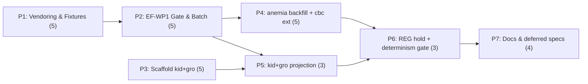

# Decisions Block: E1 Multi-Bundle Conversion Pass

**Feature Goal**: Run the existing `tools/rf-bundle-to-kb-pack` converter over the 6 remaining verified `rf` evidence bundles into their target CDS modules — producing honest, deterministic *evidence projections* (not clinical rules), scaffolding two greenfield modules, and holding the two legal-flagged regulatory bundles — while every clinical-authoring and legal-sign-off step remains an explicit, un-skipped human gate.

**Role of this block**: Captures phase boundaries, agent routing, risk hotspots, estimation anchors, dependency map, and model routing. `implementation-planner` (sonnet) expands it into the full plan. **SPIKE is waived** (user decision) — the 8 pre-E1 ADRs (`docs/adr/0001..0008`) are the de-risking substrate; E0 (`evidence-foundry-buildout-v1`) is the direct anchor.

**Two locked decisions** (user, this session): (1) Tier 3, SPIKE waived. (2) RF-CBC-002 **extends `modules/cbc_suite_v1/`** — it does not get a new module.

**The central truth every phase must respect**: `propose` MUST NOT infer clinical Boolean logic from prose (02 §4.5). It drafts rules ONLY where an approved `authoring-decisions.yaml` exists. Only `cbc_suite_v1` has one. So the E1 *mechanical* pass emits evidence/assertion projections, conflict-visible objects, candidate scaffolds, `unresolved.json`, and a conversion report — and **essentially zero new clinical rules**. Rule authoring / clinical review / legal sign-off are downstream HUMAN GATES, deferred and visible, never silently skipped. Every module produced stays `status: unsigned-stub`, `approvedBy: []`, `clinicalContentHash: null`.

---

## 1. Phase Boundaries

| Phase | Name | Scope | Success Criteria | Exit Gate |
|-------|------|-------|------------------|-----------|
| P1 | Rights-aware vendoring & fixtures | Generalize `scripts/evidence/vendor-rf-bundle.mjs` into a bundle-parametrized, rights-aware, converter-shaped fixture generator; produce committed `tests/fixtures/rf-{ev-001,cbc-002,kid-001,gro-002}/` (each with `HASH-PROVENANCE.md`), mirroring `tests/fixtures/rf-cbc-001/`. Rights-stripping (quote withholding per ADR-0002 / D-EP3-4) preserved per bundle. | 4 fixtures committed; each `inspect`s clean; no rights-restricted verbatim in any committed byte; generator is deterministic + fails-closed on unmatched cards. | `node tools/rf-bundle-to-kb-pack/cli.mjs inspect` exits 0 for all 4 fixtures; vendor generator unit-tested. |
| P2 | EF-WP1 eligibility gate & batch orchestration | Add EF-WP1 enforcement (pediatric_cds extension present per card ⇒ converter-eligible; absent ⇒ fail-closed). Build a batch runner (`inspect`→`verify`→`propose` over N bundles) emitting a per-bundle + roll-up **multi-bundle conversion report**. | EF-WP1 gate rejects a synthetic card missing the extension; batch runner drives all fixtures; conversion report enumerates eligible/rejected claims + rule-vs-projection counts per bundle. | Batch runner green over the 5 fixtures (incl. rf-cbc-001); EF-WP1 test passes. |
| P3 | Greenfield module scaffolds (kidney, growth) | Scaffold `modules/kidney_v1/` and `modules/growth_v1/` packages mirroring `cbc_suite_v1` (module.json `unsigned-stub`, index.js delegating facts, empty-but-valid evidence/candidates/reference-ranges/units, registry wiring in `src/modules/registry.js` + `src/facts/registry.js`). NO rules, NO authoring-decisions. | Both modules load, validate (`npm run validate`), and register without a clinical claim; `approvedBy: []`, null hashes. | `npm run check` green with 4 modules registered; no rule/candidate implies diagnosis. |
| P4 | Existing-module projections (anemia backfill, cbc extension) | Run `propose` for RF-EV-001 → `modules/anemia/` exact-passage **backfill** (evidence-assertions only; DO NOT clobber the hand-authored 91-rule evidence.json — additive/reconciled per OQ-1); and RF-CBC-002 → **extend** `cbc_suite_v1` evidence/assertions/candidate-scaffolds (second-bundle-into-populated-module). | anemia gains `evidence-assertions.json` + reconciled `evidence.json` with existing rules intact and all tests green; cbc_suite_v1 carries CBC-002 projections with provenance separable by `rfRunId`; conflicts preserved. | `npm run check` green; anemia's 91 rules + existing tests unchanged in behavior; determinism holds. |
| P5 | Greenfield projections (kidney, growth) | Run `propose` for RF-KID-001 → `kidney_v1`, RF-GRO-002 → `growth_v1`: evidence.json + evidence-assertions.json + candidate scaffolds + `unresolved.json`; conflicts (WHO vs CDC growth; pediatric vs adult proteinuria) as conflict-visible objects, never averaged. NO rules. | Both modules carry exact-passage projections + conflict objects; `unresolved.json` lists every claim that could not become a converter-eligible fact; zero rules emitted. | `npm run check` green; conflict objects present + validated; no rule without an authoring decision. |
| P6 | REG hold, determinism & validation gate | Author explicit rights-posture **HOLD records** for REG-001 & REG-004 (not converter targets; `not_executed_owner_held`; legal-review-required); add determinism tests across all bundles (double-run byte-identity); finalize multi-bundle conversion report. | REG hold records committed + validated (never clinical evidence); determinism test passes for every bundle; conversion report is the single source of truth for E1 output state. | Full `npm run check` green; determinism suite green; karen mid/near-end review. |
| P7 | Docs & deferred-items design specs | Author design specs for the 4 deferred items; update `docs/architecture.md` (module inventory), CHANGELOG `[Unreleased]`; close the human brief; update EF-WP1 IntentTree node + RESULTS.md §7 status. | 4 design specs exist + linked in plan frontmatter; CHANGELOG entry present; docs reflect 4 modules + REG hold. | `npm run check` green; karen end-of-feature sign-off. |

**Boundary Rationale**:
- **P1–P2**: Input fixtures must exist and pass `inspect` before an eligibility gate + batch runner can be built against them. Vendoring is the *input side*; orchestration is the *drive side*.
- **P2–P3**: Orchestration is bundle-agnostic; scaffolding is target-specific and can proceed in parallel (no file overlap).
- **P3–P4–P5**: Projection phases split by **risk asymmetry** — P4 mutates *existing* modules (anemia's 91 rules; a populated cbc_suite_v1) and is the highest-risk work; P5 writes only into fresh P3 scaffolds. Separate so a P4 regression cannot masquerade as P5 greenfield noise.
- **P5–P6**: All projections must land before a cross-bundle determinism gate and the report can close.
- **P6–P7**: Docs/deferrals close only after the mechanical output is frozen and gated.

---

## 2. Agent Routing

> Environment note: this repo's execution convention (per E0 `wave_plan`) is `provider: claude`, `model: sonnet`, `effort: adaptive`. Specialized engineer agent types (python-backend-engineer, documentation-writer, prd-writer) are NOT registered in this session — the orchestrator routes to `general-purpose` (sonnet) as the executor for every implementation phase, with `Explore` for read-only discovery. Names below are the *roles*; map each to `general-purpose`/`claude` at execution.

| Phase | Primary Agent(s) | Secondary Agent | Notes |
|-------|------------------|-----------------|-------|
| P1 | node-tooling engineer (general-purpose) | Explore (read the ev-001 vendor + cbc-001 fixture) | Rights-aware, fail-closed byte handling — extended effort. |
| P2 | node-tooling engineer (general-purpose) | — | Eligibility gate + batch runner + report schema. |
| P3 | module engineer (general-purpose) | Explore (cbc_suite_v1 pattern) | Two greenfield packages; mechanical, mirror the exemplar. |
| P4 | module engineer (general-purpose) | task-completion-validator | **Highest risk** — touches anemia (91 rules) + populated cbc; extended effort; reconciliation logic. |
| P5 | module engineer (general-purpose) | — | Greenfield projection; conflict-object correctness. |
| P6 | validation engineer (general-purpose) | karen | REG hold records + determinism suite + report close. |
| P7 | documentation writer (general-purpose) | karen | 4 design specs + CHANGELOG + architecture + brief close. |

**Parallel Opportunities**:
- **P3 ∥ (P1→P2)** — scaffolding shares no files with vendoring/orchestration; run concurrently.
- **P4 ⇸ P5 must sequence relative to their deps** but P4 and P5 touch disjoint modules (anemia+cbc vs kid+gro) → they may run in parallel *after* P2 (and P3 for P5), with distinct file ownership. Keep P4 first-attention due to risk.

---

## 3. Risk Hotspots

### Risk 1: anemia backfill clobbers the hand-authored 91-rule KB
- **Severity**: high
- **Rationale**: RF-EV-001 projects exact-passage assertions into `modules/anemia/`, which already has a large hand-authored `evidence.json`, 91 rules, 26 candidates, and passing tests. A naive `propose --out` overwrite or an evidence.json regeneration would silently destroy curated content or break rule→evidence references.
- **Mitigation**: Treat P4 anemia as **additive backfill only** — new `evidence-assertions.json`, reconciled (not replaced) `evidence.json`; assert rule→evidence reference integrity before/after; gate on the full existing anemia test suite staying green. Resolve OQ-1 in the plan before writing. task-completion-validator required on P4.

### Risk 2: second-bundle-into-populated-module (cbc_suite_v1) is an unproven converter path
- **Severity**: high
- **Rationale**: E0 only exercised single-bundle → fresh-slice. Merging RF-CBC-002 into an already-populated `cbc_suite_v1` risks ID collisions (passage/assertion/source IDs), provenance ambiguity, and non-deterministic merge ordering.
- **Mitigation**: Require provenance separability by `rfRunId`; deterministic merge/sort keyed on stable IDs (02 §4.7, never array position); collision detection in `scripts/validate-kb.mjs`; decide the `knowledgeBaseVersion` bump policy (OQ-2). If the converter cannot merge deterministically, escalate as a finding rather than hand-merging.

### Risk 3: silent rule fabrication / guardrail erosion under "make progress" pressure
- **Severity**: high
- **Rationale**: The honest output of this pass is "lots of evidence, ~no rules." A well-meaning executor may be tempted to hand-author rules or authoring-decisions to make a module "look complete," crossing the no-invented-thresholds / no-AI-published-rule-changes guardrails.
- **Mitigation**: Acceptance criteria explicitly assert **zero new rules** in anemia-backfill/kid/gro; `approvedBy: []` and null clinicalContentHash enforced by schema; conversion report must show rule-count deltas; karen checks that no artifact is described as validated/approved. Authoring-decisions authoring is OUT of scope (deferred human gate).

### Risk 4: rights leakage from REG / restricted-quote bundles
- **Severity**: medium
- **Rationale**: REG-001/REG-004 carry legal-review banners; several clinical bundles have rights-restricted verbatim (AAP/WHO). A generic vendor step could copy restricted text into committed fixtures.
- **Mitigation**: P1 generalizes the *existing* fail-closed quote-withholding (ADR-0002, vendor-rf-bundle.mjs D-EP3-4/EP3-T5) per bundle; REG bundles get HOLD records only (P6), never a fixture or converter run; grep-gate the committed fixtures for restricted spans.

### Risk 5: non-determinism across the 6-bundle batch
- **Severity**: medium
- **Rationale**: Seam invariant 13 (byte-identical output) is E0-proven for one bundle; batch ordering, filesystem read order, and merge steps can reintroduce nondeterminism.
- **Mitigation**: P6 double-run determinism suite over every bundle; canonical sort/serialize everywhere; stable iteration order in the batch runner.

---

## 4. Estimation Anchors

### Total: 30 points

| Phase | Points | Reasoning Anchor |
|-------|--------|------------------|
| P1 | 5 | Generalizing a 35KB rights-aware script + 4 committed fixtures + provenance. Comparable to E0's Phase 1 (Foundation & Fixtures) which built the rf-cbc-001 fixture + gitignore + validators. |
| P2 | 5 | Eligibility gate + batch runner + report schema. Comparable to E0 Phase 2 converter-core sub-slices (a bounded new verb-adjacent surface, not the whole converter). |
| P3 | 5 | Two greenfield module packages + dual registry wiring. H1 noun-count: 2 modules × (~2 pts scaffold each) + plumbing; anchor = E0 Phase 4 vertical-slice module creation (one module ≈ 3–4 pts). |
| P4 | 5 | Highest-risk: additive backfill into a 91-rule module + second-bundle merge into a populated module + reconciliation + validator work. |
| P5 | 3 | Greenfield projection into fresh scaffolds; mostly running `propose` + conflict-object validation. |
| P6 | 3 | REG hold records + determinism suite + report close. |
| P7 | 4 | 4 deferred-item design specs + CHANGELOG + architecture + brief close (H6 doc/plumbing budget). |

**Estimation Notes**:
- H5 anchor: E0 was 42 pts *including* building the converter from scratch + 8 ADRs. E1 **reuses** the converter (0 converter-core cost) but adds 4 bundle conversions, 2 greenfield modules, and REG handling → ~30 pts is a ~30% reduction from E0's build, justified by converter reuse. A from-scratch reading would be suspect in the other direction.
- H4 bundle-vs-sum: 4 capability areas (vendoring, orchestration, module-scaffolding, projection) summed ≥ the top-down intuition; trust bottom-up 30.
- H3 algorithmic flag: the cbc merge + anemia reconciliation involve *merge/diff/transform* → the +2 risk weighting already sits in P4.

---

## 5. Dependency Map

**Critical Path**: P1 → P2 → P4 → P6 → P7  (P5 rejoins before P6; P3 feeds P5).

**Parallelizable Slices**:
- P3 (scaffolds) runs concurrently with P1→P2 (disjoint files).
- After P2 (+P3 for P5): P4 (anemia+cbc) ∥ P5 (kid+gro) — disjoint module ownership; P4 gets first attention (risk).

---

## 6. Model Routing

| Phase | Agent | Model | Effort | Rationale |
|-------|-------|-------|--------|-----------|
| P1 | node-tooling (general-purpose) | sonnet | extended | Fail-closed rights handling + determinism — reasoning-heavy. |
| P2 | node-tooling (general-purpose) | sonnet | adaptive | Bounded new surface over existing converter. |
| P3 | module (general-purpose) | sonnet | adaptive | Mechanical mirror of a known exemplar. |
| P4 | module (general-purpose) | sonnet | extended | Existing-module mutation + reconciliation — highest care. |
| P5 | module (general-purpose) | sonnet | adaptive | Greenfield projection; conflict-object correctness. |
| P6 | validation (general-purpose) | sonnet | adaptive | Determinism suite + hold records. |
| P7 | documentation (general-purpose) | sonnet | adaptive | Design specs + docs (haiku unavailable as a registered type; sonnet). |
| Reviews | task-completion-validator (per phase) + karen (P3-mid, P6, P7) | sonnet | adaptive | Mandatory Tier-3 gates. |

**Model Routing Notes**:
- No external-model tasks. All-Claude, matching E0's `provider: claude` convention.
- Opus authors this decisions block + does the ~3K post-expansion sanity review; it does not execute phases.

---

## 7. Open Questions for Expansion

- **OQ-1**: How does the RF-EV-001 backfill reconcile with `modules/anemia/`'s existing hand-authored `evidence.json` (91-rule KB) without clobbering it or orphaning rule→evidence references? (Additive `evidence-assertions.json` + a reconciliation/merge policy; the planner must specify the exact non-destructive procedure and its verification.)
- **OQ-2**: Does `cbc_suite_v1` receive a `knowledgeBaseVersion` bump when RF-CBC-002 evidence is merged, or does it stay `0.1.0` with per-`rfRunId` provenance? (Bounds the second-bundle-merge semantics.)
- **OQ-3**: For a bundle whose projection yields evidence + conflicts but **no rules**, what is committed into `modules/<id>/` vs left in gitignored `build/kb-pack/`? (E0 committed the projection for cbc_suite_v1; confirm the same for rule-less modules, and where `unresolved.json` lives.)
- **OQ-4**: Does EF-WP1's eligibility gate live in the converter (`lib/eligibility.mjs` extension) or as a standalone pre-flight validator, and how does it report per-card rejection reasons into the conversion report?

---

## 8. Plan Skeleton Pointer

This decisions block expands into a full **Implementation Plan** using:
- **Template**: `.claude/skills/planning/templates/implementation-plan-template.md`
- **Process**: `implementation-planner` (routed to `general-purpose`/sonnet here) reads this block + the PRD (`docs/project_plans/PRDs/infrastructure/multi-bundle-conversion-e1.md`) and expands each phase into full scope/task-tables/ACs (apply R-P1..R-P4 AC rules; every new backend field ⇒ "handles missing X" AC).
- **Output path**: `docs/project_plans/implementation_plans/infrastructure/multi-bundle-conversion-e1.md` (+ phase breakout files if >800 lines: `.../multi-bundle-conversion-e1/phase-*.md`).
- **Opus review**: ~3K-token sanity check post-expansion — phase boundaries, agent routing, zero-rule ACs, and the four risk mitigations must survive.

---

## Addendum A1 — P1 Exit-Gate Scoping Correction (recorded 2026-07-22)

**Trigger**: Phase 1's implementation-plan exit gate (`phase-1-2-vendoring-batch-orchestration.md`,
Exit gate line + Phase 1 Quality Gates checklist) stated `inspect` exits 0 for **all 4** new
fixtures. Verified directly post-execution: `node tools/rf-bundle-to-kb-pack/cli.mjs inspect` exits
`0` only for `tests/fixtures/rf-cbc-002` (target module `modules/cbc_suite_v1/` — per "The central
truth" above, the *only* module with an `authoring-decisions.yaml`). It exits `1` with
`DecisionsNotFoundError` for `rf-ev-001` (→ `modules/anemia`), `rf-kid-001` (→
`modules/kidney_suite_v1`), and `rf-gro-002` (→ `modules/growth_suite_v1`) — pre-existing E0-era
converter behavior (`tools/rf-bundle-to-kb-pack/lib/loader.mjs`), because those 3 target modules
have no `authoring-decisions.yaml`, not something P1's fixture-generation work regressed.

**Decision**: This is not a P1 defect, and it is **not** to be closed by authoring
`authoring-decisions.yaml` for the 3 unqualified modules inside this feature — that is explicitly
out of scope per line 190 ("Notes for implementation-planner" below: "Do not plan any task that
authors `authoring-decisions.yaml` clinical content... those are human gates outside this
feature"), and is exactly the gap named by **Deferred Item DF-E1-M1** (rule-authoring workflow per
module; § Deferred Items Triage Table, parent plan). Accordingly:

- P1's exit gate is corrected/scoped to: `inspect` exits 0 for `rf-cbc-002` only. `inspect`'s
  `DecisionsNotFoundError` exit for the other 3 fixtures is the *expected*, correct result under the
  current authoring-decisions posture and is **not** a P1 blocker or a regression to fix.
- The other 3 fixtures (`rf-ev-001`, `rf-kid-001`, `rf-gro-002`) remain fully valid, complete P1
  deliverables — rights-aware, deterministic, fail-closed, each with its own `HASH-PROVENANCE.md`.
  Their `inspect`-against-a-decisions-file gap is a downstream (P4/P5, ultimately DF-E1-M1) concern,
  never a P1 regression.
- `docs/project_plans/implementation_plans/infrastructure/multi-bundle-conversion-e1/phase-1-2-vendoring-batch-orchestration.md`
  (Exit gate line + Phase 1 Quality Gates checklist) and
  `.claude/progress/multi-bundle-conversion-e1/phase-1-progress.md` (Exit Criteria / Quality Gates)
  are updated to reflect this scoping.
- No `authoring-decisions.yaml` was, or will be, authored under P1 to force a pass on the other 3
  fixtures.

---

## Addendum A2 — P2 Exit-Gate Scoping Correction (recorded 2026-07-22)

**Trigger**: Phase 2's implementation-plan exit gate (`phase-1-2-vendoring-batch-orchestration.md`,
Exit gate line + P2-GATE row + Phase 2 Quality Gates checklist) stated "batch runner green over the
5 fixtures (incl. `rf-cbc-001`)". Verified directly post-execution, live: `node
tools/rf-bundle-to-kb-pack/cli.mjs batch` **exits non-zero immediately at pair 0**
(`{tests/fixtures/rf-ev-001, modules/anemia}`) with `DecisionsNotFoundError` — the exact same
Addendum A1 / DF-E1-M1 blocker (no `authoring-decisions.yaml` on `modules/anemia`), which the batch
runner's own halt-on-first-failure contract (P2-T3) guarantees will always be hit first, given
`BATCH_PAIRS`' mandated order. `node cli.mjs aggregate` correspondingly reports all 4 named pairs as
`bundlesNotAvailable: 4` / `bundlesReported: 0`. Run in isolation (`propose --run-dir
tests/fixtures/rf-cbc-002 --module modules/cbc_suite_v1/module.json --decisions
modules/cbc_suite_v1/authoring-decisions.yaml --out <dir>`, bypassing the batch runner), only
`rf-cbc-002 → cbc_suite_v1` completes `propose` end to end; `rf-ev-001`, `rf-kid-001`, and
`rf-gro-002` remain blocked on the same DF-E1-M1 gap Addendum A1 already scoped Phase 1 around. As
literally written, "batch runner green over the 5 fixtures" is **false** today.

**Decision**: This is not a P2 defect, and — per Addendum A1's same reasoning — it is **not** to be
closed by authoring `authoring-decisions.yaml` for the 3 unqualified modules inside this feature.
Accordingly:

- P2's exit gate is corrected/scoped to: the batch-orchestration **machinery** (literal
  `BATCH_PAIRS` enumeration, fixed `inspect → verify → propose` per-pair pipeline, fail-closed
  halt-on-first-failure naming the failing pair, per-pair output isolation, run-to-run determinism,
  and the `aggregate` roll-up's explicit 0/`[]`/`not_available` field semantics) is proven and green —
  exercised directly via `runBatch`'s pairs-parameterized signature in
  `tests/ef-converter-batch.test.mjs` and `tests/ef-batch-runner.test.mjs` (a synthetic 4-pair batch
  with a seeded corruption, so the halt/isolation contract is verified independent of DF-E1-M1) — not
  that `node cli.mjs batch` currently exits 0 end-to-end over all 5 fixtures. It does not, and is
  **expected** not to, until DF-E1-M1 closes for the 3 modules without an `authoring-decisions.yaml`.
- The `rf-cbc-002 → cbc_suite_v1` pair — the one fixture with an `authoring-decisions.yaml` — is
  confirmed to complete `inspect → verify → propose` end to end (27 eligible, 0 conflicts, 61
  rejected per its own `conversion-report.json`), consistent with Addendum A1's P1 scoping.
- The **`rf-cbc-001` regression check** clause is satisfied by the pre-existing E0-era `rf-cbc-001`
  test coverage (`tests/ef-converter-*.test.mjs`) continuing to pass under `npm run check`
  (confirmed 1302/1302 green after all 6 P2 commits) — none of the 6 new P2 tests
  (`tests/ef-converter-batch.test.mjs`, `tests/ef-wp1-eligibility.test.mjs`,
  `tests/ef-converter-multi-bundle-report.test.mjs`, `tests/ef-batch-runner.test.mjs`,
  `tests/ef-batch-reg-exclusion.test.mjs`) reference `rf-cbc-001` directly; the regression guarantee
  is "the existing suite still passes," never "a new P2 test exercises rf-cbc-001." This linkage is
  now stated explicitly here, in `tools/rf-bundle-to-kb-pack/lib/batch.mjs`'s header, and in the
  phase-2 exit gate/quality-gate text — not left implicit.
- `EF-WP1`'s structural pre-flight (`pediatric_cds` extension check, `lib/eligibility.mjs`) is
  unaffected by this scoping — it is a per-bundle structural gate, independent of
  `authoring-decisions.yaml`, and is confirmed passing for all 5 fixtures (P2-T1) as originally
  written.
- `docs/project_plans/implementation_plans/infrastructure/multi-bundle-conversion-e1/phase-1-2-vendoring-batch-orchestration.md`
  (Phase 2 exit gate line, P2-GATE row, Phase 2 Quality Gates checklist) and
  `.claude/progress/multi-bundle-conversion-e1/phase-2-progress.md` (Exit Criteria / Quality Gates)
  are updated to reflect this scoping.
- No `authoring-decisions.yaml` was, or will be, authored under P2 to force a full end-to-end batch
  pass over all 5 fixtures.

---

## Notes for implementation-planner

- **Honesty ACs are load-bearing**: every projection phase (P4/P5) must carry an explicit AC asserting **zero new clinical rules** and `approvedBy: []` / null clinicalContentHash. Do not let "module complete" imply clinical readiness.
- **R-P2**: every new artifact field (e.g. `unresolved.json` entries, conversion-report fields, per-`rfRunId` provenance) introduces an implicit "consumer handles missing/empty X" AC — write them.
- **R-P3**: P4 has ≥2 concerns over a shared module dir; declare an `integration_owner` + a seam task verifying rule→evidence reference integrity survives the backfill.
- **Deferred items** (each ⇒ a design-spec task in P7 / DOC row): (1) per-module rule-authoring workflow; (2) clinical-review-portal intake of proposals; (3) REG legal sign-off routing; (4) anemia backfill reconciliation procedure (if not fully resolved in-phase).
- **Do not** plan any task that authors `authoring-decisions.yaml` clinical content, mints clinical rules, or sets `approvedBy` — those are human gates outside this feature.
