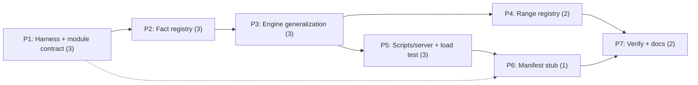

# Decisions Block: Platform Foundation P0

**Feature Goal**: Extract a module-agnostic rules runtime and per-module KB package structure out of the anemia-specific code (`modules/anemia/` as the first registered module) with **zero clinical behavior change** — byte-for-byte output equivalence (modulo `generatedAt`) for all six `examples/`, `npm run check` green throughout.

**This Decisions Block** captures phase boundaries, agent routing, risk hotspots, estimation anchors, and model routing to guide expansion into a full Implementation Plan. Opus authors this; sonnet `implementation-planner` expands it.

**Program context** (paths, do not restate content): roadmap Phase 0 spec `docs/project_plans/expansion/01-platform-expansion-roadmap.md` (lines ~121–146, seed §E ~470–498, file map ~596–607); SPIKE-001 `docs/project_plans/SPIKEs/spike-001-module-package-boundary.md`; SPIKE-002 `docs/project_plans/SPIKEs/spike-002-multi-module-loader.md`; hard guardrails in `CLAUDE.md`.

---

## 1. Phase Boundaries

| Phase | Name | Scope (roadmap WP) | Success Criteria | Exit Gate |
|-------|------|--------------------|------------------|-----------|
| P1 | Equivalence harness + module package contract | Golden-output baseline capture for all 6 examples + static build hash baseline; define `modules/<id>/` contract; move anemia KB into `modules/anemia/` unchanged (P0-WP1) | Anemia loads from new location; contract documented in code | `npm run check` green + golden outputs byte-identical |
| P2 | Fact-derivation registry | Split `src/facts.js` → `src/facts/core.js` + module facts; `deriveFacts(input, module)` registry (P0-WP2) | Core/module fact split matches SPIKE-001; no derivation change | check green + golden outputs identical |
| P3 | Engine generalization | `assess(input, moduleId)`; per-module summarize/limitations hooks; `src/ruleEngine.js` untouched (P0-WP3) | Engine has no anemia literals; hooks per SPIKE-001 contract | check green + golden outputs identical |
| P4 | Reference-range registry | Registry keyed by (module, analyte, age, sex); AAP-fallback + local-override semantics preserved (P0-WP4) | Range lookups routed through registry; same resolved values | check green + golden outputs identical |
| P5 | Multi-module scripts/server + load test | `validate-kb`/`build-static`/`smoke-test`/`server.mjs` iterate registered modules; new module-load test; cache-busting preserved per SPIKE-002 (P0-WP5) | Scripts module-driven; static build hash-stable for single module | check (incl. new test) green + built asset byte-compare |
| P6 | Module manifest stub | Per-module unsigned KB manifest; `KNOWLEDGE_BASE_VERSION`/`REVIEWED_THROUGH` → `module.json` (P0-WP6) | Version metadata read from manifest; UI/API strings unchanged | check green + golden outputs identical |
| P7 | Verification, docs & closeout | Full V2 technical gate re-run; `docs/architecture.md` + CLAUDE.md orientation updates; CHANGELOG; deferred-items design-spec tasks (DOC-006) | All ACs verified; docs reflect module architecture | karen milestone review + full gate |

**Boundary Rationale**:
- P1 first because the equivalence harness must exist **before** anything moves — it is the safety net every later phase's exit gate depends on; and WP1's package contract is the substrate WP2–WP6 build on (roadmap sequencing: WP1→WP2→WP3 serial).
- P2–P3 split: facts and engine change different call-graph layers; keeping them separate keeps each diff reviewable against the golden outputs.
- P4/P5/P6 are roadmap-parallel after WP1, but run as separate phases (single-builder repo, shared files with P2/P3 — see §5 for what may actually interleave).
- P7 is the only phase allowed to touch docs/CHANGELOG — keeps refactor diffs clean.

---

## 2. Agent Routing

| Phase | Primary Agent(s) | Secondary Agent | Notes |
|-------|------------------|-----------------|-------|
| P1 | general-purpose (sonnet) executor | — | Harness + mechanical relocation; SPIKE-001 §layout is the spec |
| P2 | general-purpose (sonnet) executor | — | facts.js split per SPIKE-001 fact-registry API |
| P3 | general-purpose (sonnet) executor | — | Engine hooks per SPIKE-001; `ruleEngine.js` is read-only |
| P4 | general-purpose (sonnet) executor | — | Range registry; may parallelize with P5 (disjoint files) |
| P5 | general-purpose (sonnet) executor | — | Scripts/server per SPIKE-002; owns `scripts/*`, `server.mjs`, `tests/` |
| P6 | general-purpose (sonnet) executor | — | Small (S effort); may batch with P5 owner |
| P7 | documentation-writer role (haiku/sonnet) | karen reviewer | Docs + CHANGELOG + gate re-run |
| all | task-completion-validator per phase | karen at P4 (mid-milestone) and P7 | Tier 3 reviewer cadence |

**Parallel Opportunities**:
- P4 ∥ P5 after P3: file ownership is disjoint (`src/ranges/*` vs `scripts/*`+`server.mjs`); both gate on the same golden-output harness.
- P2→P3 must sequence (both touch the engine call path); P6 depends on P1's `module.json` location but not on P2–P5 — it can slot anywhere after P1, scheduled last-but-one to keep version-metadata churn out of earlier diffs.

---

## 3. Risk Hotspots

### Risk 1: Silent clinical-output drift during refactor
- **Severity**: high
- **Rationale**: The whole phase is "move everything, change nothing." A subtle re-ordering of rule evaluation, fact derivation, or candidate merge changes ranked output without failing any existing test.
- **Mitigation**: P1 builds the golden-output equivalence harness **before any move**; every phase's exit gate re-runs it; the six `examples/` byte-compare (modulo `generatedAt`) is the go/no-go per roadmap V2 gate.

### Risk 2: Content-hash cache-busting breakage in the static build
- **Severity**: medium
- **Rationale**: Commit 240e314 stamps built asset URLs with content hashes; restructuring what feeds the bundle can silently change hash inputs or break stamping, causing stale-cache mismatches for deployed users.
- **Mitigation**: SPIKE-002 governs the design; P5 exit gate byte-compares built assets for the single-module case and asserts stamping still varies when content varies.

### Risk 3: Clinical scope creep disguised as refactor
- **Severity**: high (low likelihood, high impact)
- **Rationale**: "While we're in here" edits to `data/*.json` or thresholds would violate the no-AI-published-rule-changes guardrail and invalidate the zero-behavior-change claim.
- **Mitigation**: Hard rule in every task prompt: KB JSON files may be **relocated, never edited** (content diff must be empty); reviewer gates check `git diff` on relocated data files.

### Risk 4: API surface drift on `server.mjs` generalization
- **Severity**: medium
- **Rationale**: Introducing moduleId to `GET /api/v1/knowledge-base` / `POST /api/v1/assess` can break the mirror-API contract and `openapi.yaml` sync.
- **Mitigation**: Default module = anemia, existing request/response shapes unchanged (backward compatible); smoke test asserts legacy call shapes; `openapi.yaml` touched only in P7 docs if at all (OQ-2).

---

## 4. Estimation Anchors

### Total: 17 points

| Phase | Points | Reasoning Anchor |
|-------|--------|------------------|
| P1 | 3 | Comparable: content-hash stamping change (240e314) was ~1 pt across 2 scripts; this adds harness + directory contract + relocation across ~6 data/src files |
| P2 | 3 | facts.js is the densest derivation file; split + registry is algorithm-adjacent (H3 flag) but behavior-frozen |
| P3 | 3 | engine.js orchestrates merge/rank + audit; hook extraction with zero drift is the riskiest single diff |
| P4 | 2 | referenceRanges.js is self-contained; keyed-registry wrap preserving fallback semantics |
| P5 | 3 | Four surfaces (3 scripts + server) + new test; anchored to smoke/build script work in recent commits |
| P6 | 1 | S-effort per roadmap seed; manifest stub + metadata move |
| P7 | 2 | Docs (architecture.md §, CLAUDE.md orientation), CHANGELOG, gate re-run, deferred-items specs |

**Estimation Notes**:
- Bottom-up (17) > roadmap "effort L" intuition mapped naively; trust bottom-up (H4/H5) — the equivalence gating adds per-phase verification cost that pure size metrics miss.
- H6 hidden plumbing (~15%) is embedded in P1 (harness) and P5 (test wiring) rather than a separate line item.
- No dual-implementation multiplier (H2): single runtime, no enterprise variant.

---

## 5. Dependency Map

**Critical Path**: P1 → P2 → P3 → P5 → P7

**Parallelizable Slices**: P4 ∥ P5 (disjoint file ownership after P3); P6 anywhere after P1 (scheduled after P5).

---

## 6. Model Routing

| Phase | Agent | Model | Effort | Rationale |
|-------|-------|-------|--------|-----------|
| P1 | executor | sonnet | adaptive | Mechanical relocation + harness; spec fully written in SPIKE-001 |
| P2 | executor | sonnet | extended | Densest derivation logic; drift risk justifies extended thinking |
| P3 | executor | sonnet | extended | Riskiest diff (engine hooks); extended thinking |
| P4 | executor | sonnet | adaptive | Self-contained wrap |
| P5 | executor | sonnet | adaptive | Script iteration per SPIKE-002 recipe |
| P6 | executor | sonnet | adaptive | Small manifest stub |
| P7 | doc tasks | haiku | adaptive | Docs/CHANGELOG mechanical; karen review stays claude-primary |
| gates | task-completion-validator / karen | sonnet / opus-class | adaptive | Review is MUST-stay-primary (council-review class) |

**Model Routing Notes**:
- Delegation-router records (2026-07-17): execution legs → `claude` primary; ICA sonnet-5[1m] is the fallback chain for doc-authoring legs; mechanical scaffolding may cost-shift to ICA haiku free-tier. MUST-stay: orchestration, verdicts, reviews.
- No external models (Gemini/Codex) needed — no UI design, no web research in this phase.

---

## 7. Open Questions for Expansion

- **OQ-1** (RESOLVED per SPIKE-002): static registry at `src/modules/registry.js` — literal `MODULE_IDS`/`DEFAULT_MODULE_ID` + explicit `MODULE_CODE_LOADERS` map; single source of truth for all consumers.
- **OQ-2** (RESOLVED, Opus arbitration): **no public `moduleId` on the API in P0.** SPIKE-001 and SPIKE-002 conflicted here; SPIKE-001's no-surface-change position wins (zero-behavior-change guardrail). Scripts/server iterate modules internally per SPIKE-002; public request/response shapes and `openapi.yaml` are untouched until Phase 1.
- **OQ-3** (RESOLVED per SPIKE-001): golden fixtures committed at `tests/golden/*.json`, captured pre-refactor in P1; permanent `tests/module-equivalence.test.mjs` auto-picked up by `npm test` — the harness is a lasting regression net, not P0-only tooling.
- **OQ-4** (RESOLVED per SPIKE-001): `examples/` and `data/algorithm-explainers.json` stay top-level in P0; relocation deferred.
- **OQ-6** (new, from SPIKE-001): `assess(input, moduleId, rules, candidates)` 4-arg signature supersedes the roadmap's literal 2-arg sketch (KB JSON is always caller-loaded; browser has no fs). `assessPediatricAnemia` and `src/facts.js`/`src/referenceRanges.js` become 1-line re-export shims so unbundled browser imports keep working — planner must carry the shim strategy into P2/P3 tasks and add an explicit app-surface smoke check (shim breakage is invisible to `npm run check`).
- **OQ-7** (new, from both spikes): `src/evidence.js` vs `data/evidence.json` / `module.json` version-const duplication — P0 mitigates with a validate-kb drift check (SPIKE-001 OQ-3, SPIKE-002 OQ-001); real unification deferred to Phase 1 signed manifest. Needs a DOC-006 deferred-item row.
- **OQ-5**: Deferred-items sweep — roadmap defers tri-state model, exact-passage evidence, and signing to P1+; confirm each gets a design-spec authoring task row (DOC-006) in P7 rather than silent omission.

---

## 8. Plan Skeleton Pointer

- **Template**: `.claude/skills/planning/templates/implementation-plan-template.md`
- **Process**: `implementation-planner` (sonnet) expands each section into the full plan (detailed phases, task tables with Model/Effort columns, batch definitions, success criteria, Deferred Items policy section).
- **Output path**: `docs/project_plans/implementation_plans/refactors/platform-foundation-p0-v1.md` (category: refactors; split into phase files only if >800 lines).
- **Opus review**: sanity check post-expansion — phase boundaries, agent routing propagation, no dropped risks.
