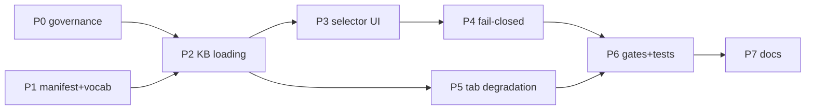

# Decisions Block — SPA Module Switcher

> Opus-authored architectural scaffold for `implementation-planner`. Tier 3.
> Feature slug: `spa-module-switcher`. Authored 2026-07-22.
> Seeded evidence: `.claude/worknotes/spa-module-switcher/exploration-findings.md` +
> `spike-leg-sq{1,2,3,4}-*.md`. **Do not restate those files in the plan — cite them.**

---

## 0. The four decisions that bind everything downstream

These are settled. The plan implements them; it does not reopen them.

### D-1 — Selectability predicate: `status === 'integrity-recorded'`, evaluated in the UI before `assess()`

Only `anemia` is selectable today. `cbc_suite_v1`, `growth_suite_v1`, `kidney_suite_v1` are listed,
visible, labelled with their real status, and **inert**.

Why the alternatives are unacceptable:
- Making all four runnable violates `schemas/module-manifest.schema.json:23` (`integrity-recorded`
  "is the only status the server/build/browser will serve") and `src/kbVerify.js:43` `READY_STATUS`.
- `cbc_suite_v1` specifically: `modules/cbc_suite_v1/index.js:35-38` delegates all four hooks to the
  **anemia** module, so it returns anemia's classification shape under `engineLabel: "Pediatric CBC
  Suite Deterministic CDSS"`. Worse, SQ-3 F9 proved all 7 of its rule evidence IDs resolve to nothing
  (`src/evidence.js:9,22` holds anemia's 6 only) — citations silently vanish. That breaches the
  CLAUDE.md guardrail "every clinical statement ties to a source." Non-selectable closes this.
- Hiding the three (integrity-recorded-only listing) forfeits the feature's actual value and leaves
  `docs/architecture.md:38-39`'s "these are not peers — read each row" invisible to the clinician.

**Implementation constraint**: the predicate must reference `READY_STATUS` imported from
`src/kbVerify.js:43`, never a hardcoded `'integrity-recorded'` literal. Eligibility is decided from
the manifest **before** any `assess()` call — never by catching an engine throw (see D-4).

**Consequence to state plainly in the PRD**: this ships a switcher that today switches between one
selectable and three inert modules. That is the honest state of the platform, and making it
perceivable *is* the deliverable. The plumbing is what makes module #2 cheap.

### D-2 — Banner truth source: static JSON import of each `module.json`; the browser verifies nothing

Per SQ-2, runtime `verifyManifest()` in the browser is **impossible in `dist/`** — `clinicalContentHash`
is computed over raw bytes of `ranges.js`/`facts.anemia.js` (`kbVerify.js:60-68`), and
`build-static.mjs:139-153` rewrites every `.js` to append `?v=`, so the digest can never match
(verified: `49a597cb…` dev vs `d154a20c…` dist). `dist/build-info.json` fails in dev (no `dist/`)
and fails `check-app-imports.mjs:137-141`.

New `src/moduleManifests.js`: four literal `import m from '../modules/<id>/module.json' with { type: 'json' }`
lines → frozen moduleId-keyed map. Registered in `APP_SURFACE_FILES` (`check-app-imports.mjs:48`).

**Load-bearing honesty boundary — must appear in the UI, not a tooltip:**

> Status shown is read from this module's published manifest. The browser has not verified it — no
> content digest was recomputed, no schema was validated, and no check confirms the loaded rules are
> the rules that were signed.

**Hard prohibition**: the UI must **not** surface any hash, `hashes.recomputed`, or the phrases
"integrity verified" / "content unmodified". `scripts/sign-kb.mjs:58-73` hardcodes anemia's file list
and `build-static.mjs:54-55` calls it per-module with no module id, so every module's
`clinicalContentHash` is computed over **anemia's** files. Currently masked (non-anemia hashes are
`null`, so `kbVerify.js:240` short-circuits), but surfacing hash-derived status would render a false
attestation. Fixing `sign-kb.mjs` is **out of scope** here and a **prerequisite for any future
integrity-hash UI**. Record it as a finding.

### D-3 — Status vocabulary: schema enum verbatim + universal not-reviewed clause

The requested phrase "unsigned proposal · not clinically reviewed" is **partially adopted**.
"unsigned proposal" is not in the closed enum (`schemas/module-manifest.schema.json:22`) and would
invent a fifth token implying a pipeline toward release that `gates-registry.md:130-132` makes
schema-impossible. Resolution:

- **Primary chip** = `manifest.status` rendered **verbatim** from the closed enum.
- **Universal second clause**, every module including anemia: `approvedBy` is empty → *"no
  credentialed clinician has reviewed or approved this module."* Derived from `approvedBy.length === 0`
  (schema-pinned `maxItems: 0`), not hardcoded.
- **"unsigned proposal · not clinically reviewed"** is retained as the human-readable subtitle **only
  where `status === 'unsigned-stub'`**, where it is accurate.
- **There is no green state.** `integrity-recorded` reads "content hashes recorded only" — the
  sentence that follows is identical to the scaffolds'. The word *only* is load-bearing.
- Panel header, all statuses: *"These modules are not peers. Read each row."*
- Where `evidenceReviewedThrough` is shown, the adjacent non-enforcement disclosure is mandatory
  (`docs/architecture.md:385-390`; `src/evidenceStalenessPolicy.js:11-14` already returns the string):
  *"Evidence-staleness expiry is not enforced — no governance window has been set. This date is
  declared by the module, not checked."*

All strings live in **one exported constant module**, pinned by a new doc-truth test. No per-DOM
hardcoding.

### D-4 — Fail-closed: refusal is a distinct third state, decided before `assess()`

SQ-3 proved the current failure mode is actively dangerous: growth/kidney fail at `src/units.js:167`
(not the evidence registry), throw `UnitRejectionError`, and `src/app.js:693` renders **"Check the
entered units"** — an unimplemented module masquerading as a clinician data-entry error. That is a
live `docs/architecture.md:391` violation (a state *is* produced, but misattributed).

The eligibility gate (D-1) makes this unreachable through the UI, but the refusal state is built
anyway as defence-in-depth, as a **third** state alongside success and input-rejection — never a
reuse of `showInputRejection`.

Shared invariants for every refusal: `currentAudit = null`; `#results` hidden; `#results-placeholder`
shown; `refreshAuditView()`; submit disabled; module selector stays usable. **Must not happen**:
prior module's result left on screen, audit JSON still downloadable, or any silent fallback to `anemia`.

### D-6 — Verification ceiling: source-assertion only. State the gap; do not paper over it.

Added 2026-07-22 after the `karen` planning gate. **This repo has no browser automation and no test
dependencies** — `package.json` declares no `dependencies` and no `devDependencies` at all, and
`scripts/smoke-browser-unit-rejection.mjs:4-15` states the posture verbatim: *"This repository
deliberately has no browser automation dependency… It does not claim to paint or inspect a real
browser DOM."* Every P6 acceptance criterion phrased as *spy*, *call count*, *renders*, *executes*
was therefore unwritable as specified.

**Decision: (a) accept the source-assertion ceiling.** Do **not** add jsdom as a side effect of a UI
feature. The zero-dependency posture is load-bearing for a clinical prototype that promises no
third-party code (CLAUDE.md), and changing it is its own decision, not a line item in this plan.

Consequences the plan must carry, all three mandatory:

1. **Rewrite every behavioral P6 AC into what a text assertion can actually prove.** `functionBody()`
   + regex over source can prove a handler *contains* the right guard; it cannot prove the state
   machine *behaves*. Say which is which, per AC.
2. **Add an explicit PRD section — "What automation does not verify."** It must state plainly that
   behavioral fail-closure, banner rendering, and refusal-state transitions are verified by source
   inspection and human review, **not** by executed browser tests. For a product whose entire value
   proposition is honest self-description, silently over-claiming test coverage would be the exact
   failure the feature exists to prevent.
3. **`visual_evidence_required` is a human step, not an automated one.** Screenshots are captured and
   reviewed by a person; P6-GATE must say so. As written the gate was unpassable — no task provisioned
   any capture mechanism.

Escalation path, deferred not dropped: author **ADR-0010 — browser test capability for the SPA**
(`status: proposed`) as a P7 deferred-item spec. If the SPA keeps growing safety-critical UI, the
zero-dependency posture will need revisiting deliberately, with evidence, on its own merits.

**Corollary — D-2 hardening.** `karen` found AC-8 (no hash surfacing) bypassable: `modules/anemia/module.json`
carries a real `clinicalContentHash: sha256:97e65556a42dbd7a…`, D-2 imports it into the browser graph
by design, and a renderer doing `JSON.stringify(manifest)` into a row or `data-*` attribute would emit
it while passing a prohibited-*token* scan of source text. **Replace the prohibition with an
allow-list**: the row/banner renderer may emit only an explicitly enumerated set of manifest fields
(`id`, `title`, `status`, `knowledgeBaseVersion`, `evidenceReviewedThrough`, `approvedBy.length`).
Everything else is structurally unreachable rather than merely forbidden.

Same class of defect: FR-11's "no green state" was checked by token *name*, not value — a
`--stub-warn: #2e7d32` would pass. Assert on resolved colour values.

---

## 1. Phase Boundaries

| Phase | Name | Scope | Exit gate |
|---|---|---|---|
| **P0** | Governance & paperwork prerequisites | ADR-0009 (module eligibility policy, `status: proposed`); reconcile `public-moduleid-api-surface.md` stale deferral; record that this feature *is* the "UI/API decision" FR-14/R-8 were waiting on | ADR file exists; design-spec dated re-confirmation added; no status flipped anywhere |
| **P1** | Manifest surface + status vocabulary | `src/moduleManifests.js` (D-2); `src/moduleStatusVocabulary.js` (D-3) single-constant strings; register both in `check-app-imports.mjs` `APP_SURFACE_FILES` | `npm run check:imports` green; unit test on vocabulary map |
| **P2** | Generic KB loading + engine call | `MODULE_KB_LOADERS` literal-specifier map (SQ-3 §6 pattern); `assessModule(moduleId, …)` alongside retained `assessPediatricAnemia`; eligibility predicate from `READY_STATUS` | `check:imports` per-file verification of all 8 specifiers; `?v=` stamping verified in `dist/` |
| **P3** | Selector UI + status banner | `index.html` selector markup; `styles.css` tokens reuse; `src/app.js` render of banner + rows; `?module=<id>` URL state incl. the `history.replaceState` query-preservation fix (`app.js:457`) | Banner renders all 4 statuses; a11y `role="alert"`; keyboard-navigable |
| **P4** | Fail-closed states + capability gating | Third refusal state (D-4); 4 refusal cases from SQ-3 §4; result/audit reset ordering | Each of the 4 refusal cases has a test; no path reaches `assess()` for ineligible module |
| **P5** | Module-scoped tab degradation | `#evidence`, `#rules`, `#algorithm` tabs and `examples` picker degrade explicitly per module; nav counts; `index.html` anemia copy → `manifest.title` | No tab renders anemia data under a non-anemia module label |
| **P6** | Gates & test harness | `smoke-browser-unit-rejection.mjs` extension (not rewrite); new `tests/module-switcher-status-labels.test.mjs` + `tests/module-switcher-eligibility.test.mjs`; deliberate flip of `tests/module-registry.test.mjs:24` tripwire | Full `npm run check` green |
| **P7** | Docs finalization | `docs/architecture.md` §2a/§6/§10; `CLAUDE.md` orientation diagram; CHANGELOG; deferred-items design specs (DOC-006) | Doc-truth tests green; `tests/claudemd-check-gate.test.mjs` green |

**P0 must land first** — it records the authority under which the E1 FR-14/R-8 prohibition is lifted.
Shipping the UI before that paperwork inverts the governance order this repo exists to protect.

## 2. Agent Routing

| Phase | Primary | Secondary | Parallelizable with |
|---|---|---|---|
| P0 | `documentation-writer` | — | P1 |
| P1 | `frontend-developer` | — | P0 |
| P2 | `frontend-developer` | `backend-architect` (registry/predicate seam) | — |
| P3 | `ui-engineer-enhanced` | `ui-designer` | P4 (after P2) |
| P4 | `frontend-developer` | — | P3 |
| P5 | `frontend-developer` | — | — |
| P6 | `task-completion-validator` drives; `frontend-developer` implements | — | — |
| P7 | `documentation-writer` | — | — |

**`integration_owner` (rule R-P3)**: P3+P4 share `src/app.js` and `index.html` — declare
`integration_owner: frontend-developer` and one seam task verifying banner state ↔ refusal state
do not race (selecting an ineligible module must swap the banner *and* clear results atomically).

## 3. Risk Hotspots

| ID | Risk | Sev | Mitigation |
|---|---|---|---|
| R-1 | Switcher presents 4 modules as peers → E1 R-4 realized (`multi-bundle-conversion-e1.md:523`) | **High** | D-1 grouping is structural, not a footnote; doc-truth test pins group headers |
| R-2 | Banner implies verification the browser never performed | **High** | D-2 honesty-boundary sentence is a pinned constant; hash surfacing prohibited |
| R-3 | `smoke-browser-unit-rejection.mjs` greps `app.js` source text (`:132,134,179,188,216-223`) — a refactor silently breaks the gate | **High** | Extend, don't rewrite: retain `assessPediatricAnemia` export and its call shape; add sibling assertions |
| R-4 | Template-literal fetch specifiers defeat `?v=` stamping → stale KB served (`build-static.mjs:100-106`) | **High** | Literal-map pattern from SQ-3 §6, verified against all three regexes |
| R-5 | `sign-kb.mjs` anemia hardcode becomes user-visible false attestation | Med | Out of scope + hash-surfacing prohibition (D-2); record as finding |
| R-6 | Flipping `DEFAULT_MODULE_ID` tripwire mechanically instead of deliberately | Med | P6 task must cite FR-14/R-8 and ADR-0009 in the commit and the test comment |
| R-7 | `history.replaceState` in `switchTab` (`app.js:457`) drops `?module=` | Med | Explicit task in P3 |
| R-8 | Scope creep into `algorithmExplorer.js` generalization | Med | Explicit non-goal; P5 degrades the tab, does not generalize it |

## 4. Estimation Anchors

| Phase | Pts | Anchor |
|---|---|---|
| P0 | 3 | ADR-0004/0005 authoring precedent |
| P1 | 3 | `src/evidence/registry.js` P0 registry addition |
| P2 | 5 | P0 platform-foundation registry seam work |
| P3 | 6 | No in-repo UI anchor — SPA has had no new panel since v0.1; +30% for the a11y/URL-state surface |
| P4 | 5 | `showInputRejection` + `AGE_OUT_OF_SUPPORTED_RANGE` handling as the shape anchor |
| P5 | 4 | Tab-scoping across 4 panels |
| P6 | 5 | E1 conversion's test-harness work (#22) |
| P7 | 3 | E1 doc finalization |
| **Total** | **34** | Tier 3 confirmed |

H1 noun-count: 2 new modules (`moduleManifests`, `moduleStatusVocabulary`) + 1 UI panel + 1 refusal
state. H2 dual-implementation: **N/A** (browser-only; no server change — D-5 below). H3 algorithmic:
no. H4 bundle-vs-sum: per-area sum = 34, matches. H6 hidden plumbing ~18% is inside the phase numbers
(CHANGELOG, `check:imports` registration, nav counts, `index.html` copy).

## 5. Dependency Map

Critical path: **P0 → P1 → P2 → P3 → P4 → P6 → P7**. P5 hangs off P2 and merges before P6.

Parallel slices: (P0 ‖ P1) at the start; (P3 ‖ P5) mid-plan once P2 lands.

## 6. Model Routing

Per `.claude/worknotes/spa-module-switcher/routing-records.md`. Session default is the resolved
session model; overrides below only where justified.

| Phase | Model | Effort | Note |
|---|---|---|---|
| P0 | sonnet | adaptive | doc authoring |
| P1–P2 | sonnet | adaptive | seam correctness matters; do not downgrade |
| P3 | sonnet | adaptive | mockups already generated (gpt-5.6-terra, operator override) |
| P4 | sonnet | extended | fail-closed logic is the safety-critical slice |
| P5 | sonnet | adaptive | |
| P6 | sonnet | extended | gate surgery on a source-grepping smoke test |
| P7 | haiku | adaptive | mechanical doc edits |

**Routing finding to carry forward**: `task_class: documentation` resolves to free-tier Haiku
regardless of requested model. PRD authoring must explicitly pin `provider: claude` or it silently
lands on Haiku.

## 7. Non-goals (state explicitly in the PRD)

- **D-5** — No `server.mjs` / `openapi.yaml` change. Verified: `src/app.js` makes zero `/api/` calls;
  the SPA is fully browser-local. `server.mjs`'s `// no moduleId request surface exists, AC-5`
  comment remains accurate and stays.
- No `scripts/sign-kb.mjs` per-module fix (R-5).
- No `src/algorithmExplorer.js` generalization (R-8) — degrade only.
- No per-module `examples/` authoring.
- No rule authoring for `growth_suite_v1` / `kidney_suite_v1`.
- No status change to any module manifest. Nothing here flips `unsigned-stub` → anything.
- No `localStorage` persistence (a stale persisted module id is a fail-closed hazard).

## 8. Open Questions for `implementation-planner`

- **OQ-1** — Should the selector be the sidebar rail (mockup variant A) or the interstitial card
  picker (variant C)? Recommendation: **A's persistent rail**, because C's one-time gate leaves no
  in-session reminder. Note both mockups render CBC as selectable — **superseded by D-1**; the
  implemented UI must show it inert.
- **OQ-2** — Does the `#evidence` tab degrade to "unavailable for this module" or render the module's
  own `evidence.json`? Every module has one, but growth/kidney lack loaders in
  `src/evidence/registry.js:39-50`. Recommend degrade in P5; per-module evidence view is a deferred item.
- **OQ-3** — Exact empty-state copy for `#rules` when `rules.length === 0`.
- **OQ-4** — Does ADR-0009 need G0 ratification before merge, or does shipping `status: proposed`
  suffice? SQ-4 says `proposed` suffices (matches ADR-0004/0005/0006). Confirm in PRD.

## 9. Deferred Items (feed DOC-006 in P7)

| Item | Why deferred | Spec to author |
|---|---|---|
| `sign-kb.mjs` per-module content hashing | Prerequisite for integrity-hash UI, not for the switcher | design-spec |
| Per-module evidence view + growth/kidney evidence loaders | Needs registry additions | design-spec |
| `algorithmExplorer` module generalization | Anemia-shaped walkthrough; large | design-spec |
| Server `moduleId` API param | Deferral re-confirmed by SQ-4 for a *corrected* reason | update existing design-spec |
| `cbc_suite_v1` evidence-ID resolution gap (SQ-3 F9) | Unreachable while CBC is inert; live bug if it ever becomes selectable | finding |

## 10. Plan Skeleton Pointer

- Template: `.claude/skills/planning/templates/implementation-plan-template.md`
- PRD output: `docs/project_plans/PRDs/features/spa-module-switcher-v1.md`
- Plan output: `docs/project_plans/implementation_plans/features/spa-module-switcher-v1.md`
- Phase files expected (plan will exceed 800 lines): `spa-module-switcher-v1/phase-{0-2,3-5,6-7}-*.md`
