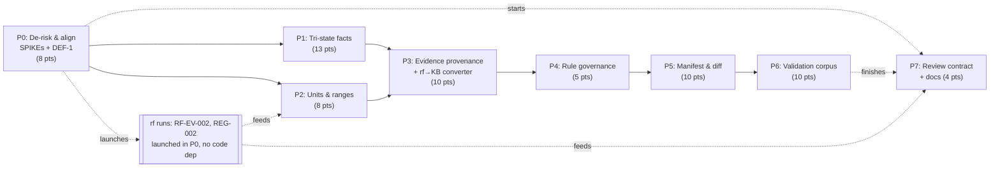

# Decisions Block: Wave-0 Safety & Defensibility Foundation

**Feature Goal**: Install the safety and provenance contract that every future clinical rule must satisfy — tri-state facts, fail-closed units, exact-passage evidence, governed rule metadata, a verifiable KB manifest with semantic diff, and an adversarial validation corpus — using the anemia module as the guinea pig, with **zero new clinical modules and zero new clinical claims**.

**This Decisions Block** captures phase boundaries, agent routing, risk hotspots, estimation anchors, and model routing. `implementation-planner` (sonnet) expands it into the full Implementation Plan. Grounding evidence lives in two sibling worknotes — read those, not the source docs:
- `.claude/worknotes/wave0-safety-foundation/repo-current-state.md` (code/schema/test surface, exact line refs)
- `.claude/worknotes/wave0-safety-foundation/aos-asset-inventory.md` (what `rf`/ARC/IntentTree actually deliver today)

---

## 0. Binding Framing Decisions (read before anything else)

These five decisions constrain every phase. They are not open for re-litigation during expansion.

**D-1 — Phase 1 introduces no new clinical claims.** Like P0, this is substrate. The only clinical content that changes is *provenance metadata about existing claims* and *the honest representation of missingness*. If a task would add, remove, or retune a threshold, it is out of scope and belongs to P2. The one permitted exception is a rule whose behavior changes **because** tri-state exposed a latent missingness bug — those must be enumerated, reviewed, and approved individually (see D-3).

**D-2 — Evidence must become single-source before it can be signed.** P0 left DEF-1 unresolved: `src/evidence.js` and `modules/anemia/evidence.json` are two independently-maintained copies of the same 6 records. Hashing a knowledge base whose evidence lives in two files that can drift is security theater — the manifest would attest to one copy while the engine reads the other. **DEF-1 resolution is a Phase 0 prerequisite, not a Phase 5 cleanup.**

**D-3 — Golden-output equivalence is a review gate, not a pass/fail gate.** P0's rule was "any anemia output change = no-go," which was correct for a pure refactor. Phase 1 *intends* to change some outputs: a field that was silently falsy becomes `not-assessed`, which must narrow rather than clear. So the gate becomes: **every golden diff is enumerated, classified (expected-from-tri-state / unexpected), and each expected diff carries a written clinical rationale.** Zero unexplained diffs. A diff that clears a differential branch on `not-assessed` is an automatic no-go.

**D-4 — ARC output may never populate `clinicalApprovers[]` or `approvedBy[]`.** ARC's pediatric council is repository-ready and its readiness audit is complete, but that audit is **synthetic and explicitly non-qualifying**. Phase 1 builds these fields structurally ready for a real credentialed human identity and leaves them empty, with release state honestly recorded as `not_executed_owner_held`. Wiring a synthetic council verdict into an approval field would manufacture exactly the false assurance this repo's guardrails exist to prevent. This is the single most important honesty constraint in the phase.

**D-5 — The repo stays zero-runtime-dependency; build-time deps require an explicit decision.** The repo today has no `dependencies`, no `devDependencies`, and no lockfile. WP6 (property/mutation testing) and WP2 (UCUM) are the two places tempted to add one. Default: **hand-roll against `node:test` with seeded deterministic generators and a closed unit table.** The roadmap already names `scripts/mutation-run.mjs`, implying hand-rolled intent. Adopting a dependency is permitted only with a recorded rationale in the plan; it is never the silent default.

---

## 1. Phase Boundaries

Phases break where the *shape of the work product* changes: de-risk → semantics → provenance → governance → attestation → adversarial validation → contract/docs.

| Phase | Name | Scope | Success Criteria | Exit Gate |
|-------|------|-------|------------------|-----------|
| **P0** | De-risk & align | Execute SPIKE-003..006; resolve DEF-1 (evidence single-source); sync IntentTree to real state; launch outstanding `rf` runs (RF-EV-002 CALIPER, REG-002 content-rights) | 4 SPIKE findings docs with decisions; one evidence source of truth; tracker reflects reality; 2 `rf` runs launched | `npm run check` green after DEF-1 refactor; each SPIKE has a recorded decision + fallback; no golden output changed by DEF-1 |
| **P1** | Tri-state fact model | `triState` in patient-input schema; 4 new `ruleEngine` operators; migrate 56 fact fields + 9 `countTrue` aggregates; migrate the 33/91 rules referencing boolean paths | `not-assessed` provably cannot satisfy any rule-out branch; all 6 golden diffs enumerated + rationalized per D-3 | Safety `council-review` on the tri-state invariant **before merge**; dangerous-miss smoke passes; zero unexplained golden diffs |
| **P2** | Units & range registry | `src/units.js` closed UCUM table; `schemas/reference-range.schema.json`; formalize `src/ranges/registry.js`; fail-closed unit-mismatch rejection wired at the decided boundary | Unit mismatch rejects rather than converts; missing-unit policy implemented per SPIKE-004; CALIPER-shaped partitions accepted | Safety `council-review` on the fail-closed unit invariant; rejection path tested at API + browser; no silent conversion anywhere |
| **P3** | Evidence provenance | `schemas/evidence.schema.json`; **`rf`-bundle → KB-pack converter**; backfill all 6 anemia sources from the verified RF-EV-001 bundle with `sourceLocator`/`exactPassage`/`evidenceGrade`/`applicability`/`surveillanceQuery` | Every evidence record traces to a locatable passage or is flagged `implementation-proposal`; converter is re-runnable and deterministic | Passage fidelity spot-audit (cross-family lens); `validate-kb` extended and green; no claim without locator or explicit proposal flag |
| **P4** | Rule governance metadata | Extend `rule.schema.json` (`additionalProperties:false` → all 91 rules migrate atomically); add `version`/`effectiveDate`/`retireDate`/`owner`/`safetyClass`/`requiredTestCaseIds`/`changeRationale`/`sourcePassageId`; `clinicalApprovers[]` built-but-empty per D-4 | All 91 rules carry governance metadata; every rule links to a passage ID from P3 or is proposal-flagged | Schema validation green across all 91; V1-content criterion measurable; `clinicalApprovers[]` empty and documented as owner-held |
| **P5** | Manifest & semantic diff | `scripts/sign-kb.mjs`, `scripts/kb-diff.mjs`; `schemas/kb-manifest.schema.json`; fill `module.json` stub; flip `server.mjs` from manifest-tolerant to manifest-required + verified (fail-closed) | Manifest verifies; unverifiable/expired KB is refused at startup; semantic diff correctly classifies a seeded change set | Adversarial diff pass — a seeded safety-relevant change must NOT classify as cosmetic; fail-closed paths tested; browser-mode verification story implemented per SPIKE-006 |
| **P6** | Adversarial validation corpus | `tests/property.test.mjs`, `boundary.test.mjs`, `mutation.test.mjs`, `dangerous-miss.test.mjs`; `scripts/mutation-run.mjs`; encode ARC's `DM-CBC-001..DM-WORKFLOW-010`; harden CI (add `check:imports`, add PR trigger) | 4 suites green; mutation-score baseline defined and met; 10 DM families executable; CI gates PRs | Dangerous-miss adversarial review (highest-stakes gate in the phase); mutation score ≥ recorded baseline; CI blocks on `npm run check` |
| **P7** | Review contract & docs | `schemas/review-record.schema.json` + change-proposal→dual-review→conflict-resolution→approval design (paper only); update CLAUDE.md / README / architecture; fix stale `data/*.json` paths; author design specs for deferred items | Review-record contract emits `approvedBy[]` shape; all stale doc claims corrected; deferred items each have a spec | `karen` end-of-feature review; docs accurate to shipped state; no stale path or count remains |

**Boundary Rationale**:
- **P0↔P1**: SPIKE-003's tri-state decisions (default state, aggregate semantics, wire-compat) *determine* P1's implementation. Building before deciding means rework across 56 fields. DEF-1 also lands here because P3/P5 both assume one evidence source.
- **P1↔P2**: Both are "safety invariants" but touch disjoint files (`ruleEngine.js`/`facts.anemia.js` vs `units.js`/`ranges/registry.js`). They parallelize — but both feed one combined council review, so they must *converge* before P3.
- **P2↔P3**: Provenance work is content-shaped, not engine-shaped. It consumes an external artifact (the RF-EV-001 bundle) rather than refactoring code.
- **P3↔P4**: Rule metadata's `sourcePassageId` must point at passage IDs that exist. P3 mints them; P4 references them. Strict serial edge.
- **P4↔P5**: The manifest hashes and attests to the output of P3+P4. Signing an unfinished KB is meaningless.
- **P5↔P6**: Deliberate. The validation corpus is what *proves* the substrate; running it against a KB that isn't yet manifest-verified would leave the fail-closed paths untested.
- **P6↔P7**: P7 is paper design plus documentation truth-up. Independent of the code work; it is the only phase that can start early and finish last.

---

## 2. Agent Routing

| Phase | Primary Agent(s) | Secondary Agent | Notes |
|-------|------------------|-----------------|-------|
| P0 | `general-purpose` (SPIKE execution, 1 per SPIKE, parallel) | `backend-architect` (DEF-1 refactor) | SPIKE-005 and SPIKE-006 get a cross-family second lens; DEF-1 is a small surgical refactor with golden-equivalence proof |
| P1 | `backend-architect` (design) → `python-backend-engineer`-equivalent JS executor (migration) | `code-reviewer` | Design and execution split deliberately: the 9 `countTrue` aggregates need judgment; the 33-rule edit is mechanical once the mapping table exists |
| P2 | `backend-architect` | `code-reviewer` | Greenfield — no refactor risk, but the fail-closed boundary decision comes from SPIKE-004 |
| P3 | `general-purpose` (converter build) | `documentation-writer` (evidence content QA) | Converter is net-new tooling; backfill is content transformation from a verified bundle |
| P4 | `general-purpose` (codemod over 91 rules) | `artifact-validator` | Highly mechanical — explicitly routed cheap (see §6) |
| P5 | `backend-architect` (diff design) | `code-reviewer` (fail-closed paths) | Semantic diff design is the hard part; the manifest plumbing is routine |
| P6 | `general-purpose` (suite authoring) | adversarial reviewer (cross-family) | Dangerous-miss encoding consumes ARC DM-* families; adversarial pass is the gate |
| P7 | `documentation-writer` | `artifact-tracker` | Paper design + doc truth-up; cheapest phase |

**Parallel Opportunities**:
- **P1 ∥ P2** — disjoint file ownership (`ruleEngine.js`/`facts.anemia.js`/`patient-input.schema.json` vs `units.js`/`ranges/registry.js`/`reference-range.schema.json`). One shared touchpoint: `modules/anemia/ranges.js:42` has a `=== true` that P1's migration also wants. **`integration_owner` = P1 owner**; P2 must not edit that line. Per R-P3, a seam task verifies range lookups still behave after the tri-state migration.
- **P7 ∥ everything** — paper design and doc updates have no code dependency. Start the review-record contract during P0; finish docs after P6 when the shipped truth is known.
- **P0's `rf` runs ∥ everything** — RF-EV-002 and REG-002 are external research with no code dependency. Launch them in P0 so results land before P2 (ranges) and P7 (rights review) need them. Per the roadmap's own guidance, evidence runs start a phase ahead of the build that consumes them.
- **Strictly serial**: P3 → P4 → P5 → P6. Each consumes the prior's output artifact.

---

## 3. Risk Hotspots

### Risk 1: Tri-state migration silently changes clinical behavior
- **Severity**: **high**
- **Rationale**: 56 boolean fact fields, 9 `countTrue()` aggregates, and 33 of 91 rules all change meaning at once. "2 of 5 present" and "2 present, 3 not-assessed" are different clinical statements that the current code cannot distinguish. A careless migration either over-narrows (noise) or, far worse, lets `not-assessed` satisfy a rule-out branch and clears a differential that should stay open.
- **Mitigation**: SPIKE-003 decides aggregate semantics before any code moves. A written migration table maps all 33 rules before editing. D-3's enumerate-and-rationalize gate catches every golden diff. A dedicated invariant test asserts no rule-out branch is satisfiable by `not-assessed`. Safety `council-review` before merge.

### Risk 2: Semantic diff under-reports a safety-relevant change
- **Severity**: **high**
- **Rationale**: This is a false-negative risk with clinical consequences. A threshold buried deep in a nested `all`/`any` tree that changes from 20 to 30 ng/mL, classified as "cosmetic," ships without re-review. The diff tool becomes the thing that *certifies* changes are safe, so its blind spots become the system's blind spots.
- **Mitigation**: SPIKE-005 enumerates change classes and explicitly hunts the under-reporting mode. Seeded-change corpus: a fixture set of known-safety-relevant mutations that the diff MUST flag, run as a test. Cross-family adversarial lens (see §6) tasked specifically with "find a safety-relevant change this classifier misses."

### Risk 3: Evidence dual-source drift defeats manifest integrity
- **Severity**: **high**
- **Rationale**: `src/evidence.js` and `modules/anemia/evidence.json` hold the same 6 records independently. If P5 hashes one while the engine reads the other, the manifest attests to something that isn't running.
- **Mitigation**: D-2 — resolved in P0 before anything downstream. Golden-equivalence proof that de-duplication changed no output. A validate-kb assertion that no second evidence source can reappear.

### Risk 4: Overclaiming clinical approval
- **Severity**: **high** (reputational + safety)
- **Rationale**: ARC's pediatric council is genuinely impressive and its readiness audit is complete — which makes it *tempting* to treat as sign-off. It is synthetic and explicitly non-qualifying. Populating `clinicalApprovers[]` from it would produce a KB manifest that claims clinical approval that never happened.
- **Mitigation**: D-4 is binding. Fields built, left empty. Release state records `not_executed_owner_held`. A test asserts `approvedBy[]` is empty in any unsigned/pre-validation build so the honest state can't silently drift. Documented in both the manifest schema and CLAUDE.md.

### Risk 5: Duplicated dangerous-miss work with the ARC Adoption plan
- **Severity**: medium
- **Rationale**: ARC Adoption plan P4-T1 converts `DM-CBC-001..DM-WORKFLOW-010` into synthetic scenario specs. P1-WP6 needs executable fixtures for the same 10 families. Two approved Tier 3 plans, one body of work, no coordination edge — classic duplicate-or-drop.
- **Mitigation**: **Phase 1 owns the executable fixture conversion**, because P6 is where they must actually run. The ARC Adoption plan's P4-T1 consumes P1's fixtures rather than re-deriving them. Recorded as an explicit cross-plan dependency in both plans' related_documents.

### Risk 6: Atomic 91-rule schema migration
- **Severity**: medium
- **Rationale**: `rule.schema.json` is `additionalProperties: false`. Adding governance fields means all 91 rules must gain them in one commit or validation fails wholesale. No incremental path.
- **Mitigation**: Schema-first, then codemod, then validate — single commit, mechanically generated, reviewed as a diff of *generated* content. Fields default to explicit nulls rather than being omitted, so absence is representable.

### Risk 7: First external dependency in a zero-dep repo
- **Severity**: medium
- **Rationale**: WP6 (property/mutation) and WP2 (UCUM) both invite a dependency. This repo has zero and no lockfile — a deliberate posture for a clinical tool, even for build-time deps.
- **Mitigation**: D-5 — hand-roll by default with seeded deterministic generators and a closed unit table. Any dependency requires written rationale in the plan.

### Risk 8: Stale IntentTree misleads execution
- **Severity**: low-medium
- **Rationale**: The tracker shows merged P0 work and all 7 verified `rf` runs as `not_started`. An executor trusting it would redo finished work or re-run completed research.
- **Mitigation**: P0 syncs the tracker to real state before any build task. Standing rule added to CLAUDE.md: verify node status against git log and `rf-handoff/RESULTS.md` before trusting `itt`.

---

## 4. Estimation Anchors

### Total: **68 points** (Tier 3, XL — consistent with the roadmap's XL designation)

| Phase | Points | Reasoning Anchor |
|-------|--------|------------------|
| P0 | 8 | 4 SPIKEs (~1.5 each) + DEF-1 surgical refactor (2) + tracker sync and `rf` launches (~1). Anchor: P0's SPIKE-001/002 pair ran ~3 pts combined; these are 4 and two are harder. |
| P1 | 13 | Largest single unit of semantic risk in the phase. Anchor: P0-WP2 (fact-derivation registry extraction) was ~5 pts and touched the same file *structurally*; this touches it *semantically* across 56 fields + 9 aggregates + 33 rules. H3 fires (migration/inference logic) → floor of 8, and breadth pushes to 13. |
| P2 | 8 | Greenfield service + schema + fail-closed wiring at two surfaces (API, browser). H1: one new subsystem (`units.js`) + one formalized registry + one new schema. No refactor risk offsets breadth. |
| P3 | 10 | Net-new converter tooling (~5) + 6-source content backfill against a 48-claim bundle (~5). H3 fires on the converter (transform/mapping). The research half is already done, which is why this isn't 15. |
| P4 | 5 | Mechanical breadth, low judgment: one schema edit + codemod over 91 rules. Anchor: P0-WP1's content relocation was similar shape at ~4 pts. All-or-nothing risk adds 1. |
| P5 | 10 | Semantic diff is genuinely algorithmic (H3 → ≥3 floor, realistically 6) + manifest plumbing (2) + server fail-closed flip (2). |
| P6 | 10 | 4 new suites + bespoke mutation runner + 10 DM families + CI hardening. H1: 4 new test surfaces. First-of-kind in this repo — no prior art to copy. |
| P7 | 4 | Paper design + doc truth-up. Cheapest phase; no code risk. |

**Estimation Notes**:
- **H2 (dual-implementation) does not apply** — single runtime, no local/enterprise split.
- **H4 (bundle-vs-sum)**: per-phase sum = 68; treat as the floor, not the target. Phases 1, 3, 5, 6 are the ones that historically inflate.
- **H5 (anchor) — CORRECTED 2026-07-19 post-expansion.** This block originally assumed P0 cost ~40 pts and derived 68 as a ~1.7× multiple. **That baseline was wrong.** P0 (`platform-foundation-p0-v1`, `status: completed`) records an actual cost of **17 pts**, bottom-up, no compression. The multiplier reasoning is therefore void and is withdrawn.
  **68 nonetheless holds**, but on different grounds: it is the independent bottom-up sum of all 54 task-level estimates across the 8 phase files (verified to total exactly 68.0, with no back-solving to a predetermined figure). Per H4, that sum is the floor.
  The real justification for a ~4× delta over the corrected 17-pt anchor is **scope, not arithmetic**: P0 was a pure structural relocation with zero semantic change and a mechanical equivalence proof. P1 adds 4 SPIKEs, 6 new or extended schemas, a from-scratch adversarial test corpus, a net-new `rf`-bundle converter, and a semantic migration across 91 rules and 56 fact fields where the *meaning* of existing content changes. Those are different kinds of work, not more of the same work — which is exactly why a multiple off P0 was the wrong instrument.
- **H6 (hidden plumbing, 15–20%) — measured at ~8.8%, below norm.** Dedicated plumbing/resilience tasks came in at roughly half the expected share. This is a known thinness, not a saving: **read 68 as a floor, not a padded estimate.** Expansion did not surface a separate plumbing line item; if schema-validation wiring, `validate-kb` extensions, and CI work overrun during execution, the total should move rather than the phases silently absorbing it.
- **Deliberate unknowns**: P5's signing scope depends on SPIKE-006's recommendation (full crypto signing vs hash+manifest chain with signing deferred). If SPIKE-006 recommends deferral, P5 drops ~3 pts.

---

## 5. Dependency Map

**Critical Path**: `P0 → P1 → P3 → P4 → P5 → P6` (P2 rejoins before P3; P7 floats)

**Parallelizable Slices**:
- P1 ∥ P2 — disjoint file ownership; `integration_owner` = P1 owner; seam task required (R-P3)
- P7 ∥ all — paper design starts in P0, docs finish after P6
- P0's `rf` runs (RF-EV-002, REG-002) ∥ all — external, no code dependency

---

## 6. Model Routing

Routing principle per `delegation-router`: **pick the highest-Cost model that clears the task's intelligence bar.** Premium reasoning (Fable 5, gpt-5.6-sol) is reserved for a small number of genuinely hard judgment calls and is **never** used for mechanical or token-heavy work. Orchestration, verdicts, and `council-review` **must stay on primary Claude** and are never offloaded.

| Phase | Agent / Task | Model | Effort | Rationale |
|-------|--------------|-------|--------|-----------|
| P0 | SPIKE-003 (tri-state) | sonnet | high | Well-scoped; DEF-2 design spec already at `shaping` maturity does much of the thinking |
| P0 | SPIKE-004 (units) | sonnet | high | Bounded decision space; ARCH §8 already dictates reject-not-convert |
| P0 | **SPIKE-005 (semantic diff)** | **fable** | max | Hardest reasoning in the phase. The failure mode is a subtle false negative that the tool itself would certify as safe. Worth the premium. |
| P0 | SPIKE-005 adversarial second lens | **gpt-5.6-sol** (`codex exec`) | xhigh | Cross-family lens hunting the under-report mode. Precedent: a gpt-5.6 cross-model audit already caught 3 passage-fidelity gaps in the `rf` bundles. |
| P0 | **SPIKE-006 (key custody)** | **gpt-5.6-sol** (`codex exec`) | xhigh | Security threat-modeling that must be willing to conclude "signing is theater at this trust boundary." Cross-family skepticism is the point. |
| P0 | DEF-1 evidence de-dup refactor | sonnet | medium | Surgical, golden-proven refactor |
| P0 | IntentTree sync, `rf` run launches | haiku | low | Pure mechanical state reconciliation |
| P1 | Tri-state **design** (9 aggregates, 33-rule mapping table) | opus | xhigh | Clinical-semantic judgment; the highest-consequence design call in the phase. Stays on primary. |
| P1 | Tri-state **execution** (schema, operators, field migration) | sonnet | high | Mechanical once the mapping table exists |
| P1 | Golden-diff classification + rationale | opus | high | Each diff is a clinical judgment under D-3 |
| P2 | Units service + range registry | sonnet | high | Greenfield, well-specified by SPIKE-004 |
| P3 | `rf`-bundle → KB-pack converter | sonnet | high | Net-new tooling, deterministic transform |
| P3 | 6-source evidence backfill | sonnet | medium | Content transformation from a verified bundle |
| P3 | Passage-fidelity audit | **gpt-5.6-terra** (`codex exec`) | high | Cross-family verification of passage↔claim fidelity; proven pattern on this exact corpus |
| P4 | 91-rule codemod + schema | **haiku** | medium | Explicitly cheap: high-token, near-zero judgment. Never route this to a premium model. |
| P5 | Semantic diff **implementation** | sonnet | xhigh | Implements SPIKE-005's design |
| P5 | Manifest, signing, server fail-closed | sonnet | high | Routine plumbing against a decided design |
| P5 | Seeded-change adversarial diff pass | **gpt-5.6-sol** (`codex exec`) | xhigh | "Find a safety-relevant change this classifier misses" — adversarial by construction |
| P6 | Property/boundary/mutation suites + runner | sonnet | high | Substantial but well-specified authoring |
| P6 | DM-* fixture encoding | sonnet | medium | Transformation of ARC's 10 named families |
| P6 | **Dangerous-miss adversarial review** | **fable** | max | Highest-stakes reasoning in the whole plan: "what would this engine miss that harms a child?" Premium is unambiguously justified. |
| P6 | CI hardening | haiku | low | Mechanical YAML |
| P7 | Review-record contract design | sonnet | high | Paper design against a known shape |
| P7 | Docs, README, stale-path fixes | haiku | low | Mechanical, token-heavy — never premium |
| All | Phase orchestration, gates, `council-review` | opus | xhigh | MUST-stay-primary per routing rules; never offloaded |

**Model Routing Notes**:
- **Fable 5 used exactly twice** (SPIKE-005 design, dangerous-miss adversarial review) — both are open-ended safety reasoning where a missed insight has clinical consequence and there is no verifier downstream.
- **gpt-5.6 used four times**, always as a *cross-family adversarial or verification lens*, never as the primary author. Invoked via `codex exec --model gpt-5.6-sol|terra`.
- **Haiku carries the token-heavy mechanical load** (91-rule codemod, docs, CI, tracker sync) — the largest line counts in the phase sit on the cheapest model, by design.
- **Two-failure escalation**: if a model fails the same leg twice, escalate up the intelligence column rather than retrying at tier.
- `council-review` (safety council, P1/P2 gates) and all phase verdicts stay on primary Claude — offloading these is an explicit anti-pattern.

---

## 7. Open Questions for Expansion

- **OQ-1**: Does `booleanMap`'s open-ended `additionalProperties` shape survive as `triState`, or do the 56 known fact fields become an enumerated allow-list? Enumeration catches typo'd field names (a real safety issue — a misspelled path silently reads as absent today) but couples the schema to the anemia module's vocabulary just as the platform goes multi-module. *Lean: enumerate per-module via the module package, not globally.*
- **OQ-2**: Where does the `rf`-bundle → KB-pack converter live — this repo or `research-foundry`? The seam doc says `rf` stops at the verified bundle, which argues for this repo. But IntentTree tracks it as `EF-WP0` under the Evidence Foundry work area. *Lean: build it here, register it as satisfying EF-WP0.*
- **OQ-3**: Does P5 ship real cryptographic signing, or a hash + manifest chain with signing deferred until there is a credentialed approver whose signature would mean something? SPIKE-006 decides. Note D-4's logic applies: a signature attesting to approvals that never happened is worse than no signature.
- **OQ-4**: What is the mutation-score baseline, and is it measured over rules, facts, or both? A baseline set too low is decorative; set too high it blocks the phase. Must be defined *in* P6, from measurement, not guessed in advance.
- **OQ-5**: What is the missing-unit policy — reject, or accept with an explicit `unitAssumed` provenance flag? Rejection is safer but may make the browser SPA unusable for clinicians typing quick values. SPIKE-004 decides; the answer must not silently convert.
- **OQ-6**: Should P1 also fix the CI gaps (no `check:imports`, no PR trigger) in P0 rather than P6? Arguably the gate should exist *before* the risky migrations, not after. *Lean: move CI hardening to P0.*

---

## 8. Plan Skeleton Pointer

This decisions block expands into a **PRD** and a full **Implementation Plan**:

- **PRD template**: `.claude/skills/planning/templates/prd-template.md` → `docs/project_plans/PRDs/infrastructure/wave0-safety-foundation-v1.md`
- **Plan template**: `.claude/skills/planning/templates/implementation-plan-template.md` → `docs/project_plans/implementation_plans/infrastructure/wave0-safety-foundation-v1.md`
- **Phase files** (plan will exceed 800 lines): `wave0-safety-foundation-v1/phase-[N]-[name].md`
- **Human brief**: `docs/project_plans/human-briefs/wave0-safety-foundation.md` (qualifies: 68 pts, 8 phases, multi-plan coordination)
- **Opus review**: sanity check post-expansion — verify phase boundaries, D-1..D-5 propagated as hard constraints, risk mitigations survived, and model routing reached the task table.

---

## Notes for implementation-planner

- **D-1 through D-5 are binding constraints, not suggestions.** Propagate each into the plan as an explicit constraint with its own acceptance criterion. D-4 in particular must appear as a testable AC, not prose.
- **Per R-P2**: every new field introduced in P3/P4/P5 needs a companion AC covering "consumer handles the field being absent." Evidence records, rule metadata, and manifest fields all qualify.
- **Per R-P3**: P1∥P2 have overlapping ownership at `modules/anemia/ranges.js:42`. Declare `integration_owner` and at least one seam task.
- **Per R-P1**: the roadmap's phrasing ("every anemia rule has an exact source passage") is exactly the "all X" pattern that needs an enumerated target list — expand it to the concrete 91-rule set with a per-rule status.
- **Deferred items**: P0 left DEF-6, DEF-7, DEF-8 out of Phase 1 scope. Carry them forward in the plan's deferred-items triage table with a DOC-006 spec task each; do not silently drop them.
- **Cross-plan edge**: record the dangerous-miss fixture-ownership dependency with `arc-clinical-council-adoption-v1` in `related_documents` on both sides.
- Do not re-derive the code surface — `.claude/worknotes/wave0-safety-foundation/repo-current-state.md` has exact counts and line refs. Cite it.
