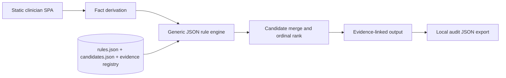
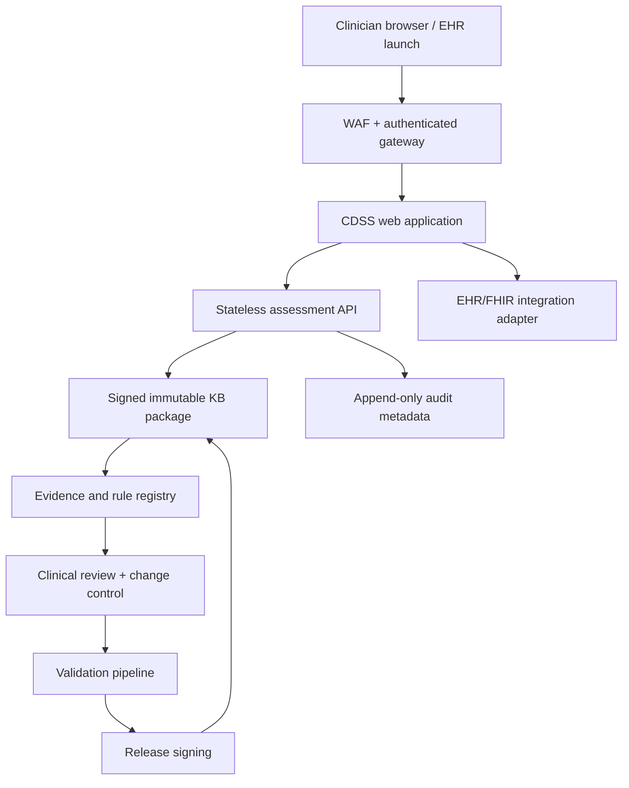

# Production Architecture

## 1. Design goals

- deterministic clinical inference;
- transparent source and rule provenance;
- clinician independent review;
- no generative model in the decision path;
- reproducible versioned outputs;
- local/laboratory-specific reference ranges;
- privacy-by-default and no unnecessary PHI;
- clean separation of content, engine, UI, and audit.

## 2. Prototype architecture



The browser runs the full assessment locally. The included API mirrors the engine for integration testing but is not called by the UI.

## 2a. Module package architecture (Phase 0)

Each module (e.g., `modules/anemia/`) is a self-contained package holding rules.json, candidates.json, evidence.json, reference-ranges.json, module.json (unsigned-stub manifest), and index.js (hook descriptor). The hook descriptor exports: module id, manifest reference, deriveFacts function, summarize function, and limitations. Supporting code (facts.anemia.js, ranges.js) lives in the package.

Three registries dispatch module behavior: `src/facts/registry.js` (fact-derivation by moduleId), `src/ranges/registry.js` (reference-range bands and threshold rules), and `src/modules/registry.js` (getModule/listModules; MODULE_IDS and loadModuleCode enumeration). A shim strategy ensures zero-edit backwards compatibility: `src/facts.js`, `src/referenceRanges.js`, and assessPediatricAnemia() in `src/engine.js` are thin re-export/wrapper shims bound to the 'anemia' module so existing callers need no updates.

`modules/anemia/module.json` is no longer a stub: Wave-0 (EP-5) shipped the two-part signed-manifest scheme described in §6, and the anemia module's manifest is currently `status: "integrity-recorded"` — its `clinicalContentHash`/`governanceHash` are populated and verified at server startup. Its `approvedBy` is still schema-forced to `[]`: no credentialed clinical approver has signed off on this content.

## 3. Recommended production deployment



### Components

| Component | Responsibility |
|---|---|
| Clinician SPA | Questionnaire, source display, warnings, independent-review view |
| Assessment API | Schema validation, fact derivation, rule execution, versioned response |
| KB package | Rules, candidate definitions, references, ranges, release manifest |
| Evidence registry | Source metadata, exact supporting passage, status, supersession |
| Audit store | Minimal immutable metadata; PHI only when required and governed |
| FHIR adapter | Pulls reviewed labs/demographics and writes a non-authoritative CDS result |
| Clinical governance portal | Proposed rule changes, dual review, conflict resolution, approval |
| CI/CD validation | Unit, regression, traceability, security, and clinical scenario suites |

## 4. Data boundaries

### Recommended default

Do not collect names, addresses, medical-record numbers, free-text notes, or exact dates of birth. Use age in months and a locally generated encounter correlation ID only when integration requires it.

### Browser-only mode

- All calculation local.
- No analytics containing form values.
- No third-party scripts, fonts, error trackers, or session replay.
- Audit export is user initiated.

### Server mode

- TLS 1.2+; encryption at rest.
- Strong authentication and RBAC.
- BAA and HIPAA security/privacy controls when acting for a covered entity/business associate.
- No request-body logging.
- Separate security telemetry from clinical payloads.
- Explicit retention and deletion policy.
- Tenant isolation and regional data residency where required.

## 5. API contract

`POST /api/v1/assess` accepts the JSON schema in `schemas/patient-input.schema.json` and returns `schemas/assessment-output.schema.json`.

Recommended headers:

```http
Content-Type: application/json
X-Knowledge-Base-Version: 0.1.0-2026-07-15
Idempotency-Key: <client-generated UUID>
```

The server should reject a requested KB version it cannot execute. Responses must include the actual version, reviewed-through date, generated timestamp, and complete matched-rule trace.

## 6. Knowledge-base release manifest

**Shipped (Wave-0, EP-5).** Every module carries a `module.json` manifest validated against
`schemas/module-manifest.schema.json` and verified by `src/kbVerify.js#verifyManifest`, which
`server.mjs` calls at startup — an unverifiable manifest makes the server refuse to start (§10).
`scripts/sign-kb.mjs` computes and writes the manifest at release time; `--check` mode verifies
without writing (CI). `scripts/kb-diff.mjs` classifies rule/candidate/evidence changes between two
KB snapshots into a severity tier, failing closed (`block`) on any unresolved change class.

The manifest is a **two-part SHA-256 digest**, not a cryptographic signature over a private key:

- `clinicalContentHash` — over the four KB JSON files' parsed values plus raw-byte hashes of the
  two source files that still hard-code clinical thresholds (`ranges.js`, `facts.anemia.js`).
- `governanceHash` — over the manifest's own governance fields (`status`, `knowledgeBaseVersion`,
  `evidenceReviewedThrough`, `approvedBy`, `validationRunId`, `supersedes`, `supportedAgeMonths`).

`status` is a closed lifecycle enum: `unsigned-stub` → `integrity-recorded` → `superseded`/
`revoked`. Only `integrity-recorded` is servable (`src/kbVerify.js#READY_STATUS`); a matching hash
proves content-provenance consistency with a prior release, never clinical validity.

```json
{
  "id": "anemia",
  "schemaVersion": 1,
  "status": "integrity-recorded",
  "knowledgeBaseVersion": "0.1.0-2026-07-15",
  "evidenceReviewedThrough": "2026-07-15",
  "engineLabel": "Pediatric Anemia Deterministic CDSS",
  "clinicalContentHash": "sha256:...",
  "governanceHash": "sha256:...",
  "approvedBy": [],
  "validationRunId": "local-dev:unattested",
  "supersedes": null,
  "releasedAt": null
}
```

`approvedBy` is schema-forced to `[]` (`maxItems: 0`, mirroring `clinicalApprovers` in §7) — no
credentialed clinical approver has signed off on this knowledge base, and ARC/council-review/`rf`
output is explicitly not an eligible source for one. Raising that cap is the deliberate, reviewable
act by which this project would first claim clinical sign-off; it must never be done to make a
build pass. Evidence staleness has a disclosed but **not yet enforced** expiry policy
(`src/evidenceStalenessPolicy.js`): `maxAgeDays` is `null` until a human makes that governance
decision, and every consumer must disclose non-enforcement rather than imply the check passed.

## 7. Rule-authoring model

The current JSON DSL supports:

- `all`, `any`, and `not` groups;
- equality and numeric comparisons;
- existence/missing checks;
- **tri-state checks** (`is-present`/`is-absent`/`is-unknown`/`is-not-assessed`, `src/ruleEngine.js`
  via `src/facts/tristate.js#toTri` — Wave-0/EP-1, SPIKE-003): a missing path, `null`, and `''` all
  resolve to `unknown` the same way an explicit `unknown` value does, so missingness can never be
  read as normal;
- candidate, alert, question, and note outputs;
- evidence IDs and fixed explanatory text.

**Shipped (Wave-0, EP-3/EP-4).** Every rule is validated against `schemas/rule.schema.json`, which
requires (with `additionalProperties: false`, so nothing can be silently omitted):

- `version`, `effectiveDate` — semver-shaped rule version and the date its content took effect;
- `retireDate` — `null` while active, populated on retirement (never repurposed as "unknown");
- `owner` — a `role:`/`team:` string, schema-pattern-enforced so a person's name cannot be
  substituted for an accountable role;
- `safetyClass` — closed enum `safety-critical`/`diagnostic`/`informational`, derived
  deterministically from the rule's `category`;
- `requiredTestCaseIds` — mechanically populated fixture-path linkage from
  `scripts/rule-coverage.mjs`'s activation-witness mapping; legitimately `[]` (no linkage yet),
  never "exempt from testing";
- `sourcePassageId` — names one exact passage record in `modules/anemia/evidence.json#sources[].passages[]`
  (nullable only for a not-yet-backfilled rule; `scripts/validate-kb.mjs` is the stricter policy
  layer for the shipped KB);
- `changeRationale` — required, non-empty; for the EP-4 backfill this is a uniform string that
  explicitly disclaims any clinical re-review, never an invented per-rule rationale;
- `clinicalApprovers` — schema-forced to `[]` (`maxItems: 0`). **No credentialed clinical
  approver has approved any rule in this knowledge base**, and ARC/council-review/`rf` output is
  explicitly not an eligible source for one; raising the cap is a deliberate governance act, never
  a build-passing shortcut (D-4).

**Not yet shipped:** rule-level supersession links (only the module manifest's `supersedes` exists
today, §6) and a distinct impact-analysis field beyond `changeRationale`.

Avoid executable code inside clinical rules. Calculated facts should be a small, reviewed, unit-tested library.

### Rights and evidence provenance (Phase EP-R0)

**Shipped (Phase EP-R0).** The repository's rights position is machine-checkable via a dedicated,
top-level `rights/` tree — a rights record is never inlined into any clinical KB JSON file
(`rules.json`, `candidates.json`, `evidence.json`, `reference-ranges.json`); the only link between a
clinical identifier and a rights record is the join ledger below (D4 of this feature's decisions
block). The tree holds addressable provenance and structured locators only — never third-party full
text, tables, figures, or brand assets (D1).

- `rights/release-context.json` — the single declared scope of what this platform currently claims
  for itself: `commercial: false`, `use_type: internal_research`, US-only, internal-engineering-
  channel-only. Every future requested use is checked for *containment* within this declared scope;
  the file is never widened to fit a request.
- `rights/rights-records.json` — one `rights_record` per cited source (today: 6, one per
  `modules/anemia/evidence.json` source), each seeded at `overall_status: UNKNOWN` and
  `review.review_status: agent_triage_only`. No source in this knowledge base has been cleared,
  licensed, or approved for any use; no agent-writable path may ever assign a `CLEARED_*` status,
  and `review.human_reviewer`/`review.counsel_reviewer` are schema-forced `null` (D6 — no clinical
  or rights sign-off exists in this project and none may be manufactured).
- `rights/rights-failures.json` — cross-linked, pre-existing open rights problems (the REG-002
  content-rights review, and the EP3-T5 passage-fidelity audit's near-verbatim-span and
  source-unretrievable findings), never a newly agent-invented finding; every `review.reviewed_by`
  stays schema-forced empty.
- `rights/rights-ledger.json` — the sole bidirectional join between a clinical KB identifier and a
  `rights/` record.
- `schemas/rights/*.schema.json` — the five Research Foundry Rights Governance Spec v1.0 schemas,
  vendored byte-for-byte, with every subsequent divergence recorded as a **declared amendment**
  (`schemas/rights/VENDORING.md`) rather than a silent edit.

`scripts/validate-rights.mjs` (wired into `npm run validate`) ships four gates: bidirectional
clinical-identifier ↔ rights-record coverage, closed-enum membership on the fields that govern
release-blocking behaviour, open-failure cross-link presence, and release-context set-containment.
Every gate is **coverage- or consistency-shaped only** (D7) — none of them reads *which* legitimate
value a clearance-relevant field holds and fails because of it; a record sitting at
`overall_status: UNKNOWN` passes every gate exactly as a record at `PROHIBITED` would. No gate in
this repository ever approves, licenses, or clears a source — that determination has no automated
path here and requires a named human rights owner who does not yet exist (open question OQ-2).

**Residual gap R-1 (open, not closed).** Prohibited-excerpt detection — proving no restricted
source text has entered the repository — is **not fully deterministic**: a sound comparison would
require holding the restricted source text in-repo, which the no-third-party-text rule (D1) forbids
doing in the first place. The interim substitute is the existing `passageFidelity !== 'verbatim'`
policy check plus a structural negative-asset check over the working tree (no reproduced table,
figure, image, or brand asset). That substitute is a *positive* structural proof, not a guarantee
that every possible verbatim reuse is caught, and is recorded here as an open gap, not a closed one
(`.claude/findings/rights-governance-spec-v1.0-review-findings.md` §5).

## 8. FHIR integration proposal

Potential read resources:

- `Patient`: age/administrative sex only as needed;
- `Observation`: CBC, reticulocytes, ferritin, CRP, iron studies, hemolysis labs, lead, nutrients;
- `Condition`: chronic renal/inflammatory/hemoglobinopathy context;
- `MedicationStatement`: exposures relevant to macrocytosis/hemolysis;
- `DiagnosticReport`: smear and hemoglobin-analysis results.

Potential output:

- a transient CDS Hooks card or a versioned `GuidanceResponse`/`DetectedIssue` style artifact;
- do not write a final diagnosis automatically;
- include source links and matched-rule explanation;
- require clinician acceptance before any problem-list or order action.

FHIR mapping requires local code-system governance (LOINC/SNOMED CT/UCUM) and should reject unit mismatches rather than silently convert ambiguous values.

## 9. Security controls

- Content Security Policy and no third-party runtime dependencies.
- Software composition analysis and signed builds.
- SBOM for every release.
- Static analysis, dependency scanning, secret scanning, and container scanning.
- Rate limiting, authentication, authorization, and abuse monitoring for API mode.
- Threat model covering input tampering, rule-package substitution, stale KB, audit manipulation, tenant crossover, and denial of service.
- Cryptographic signature verification for KB packages.
- Reproducible builds and rollback.

## 10. Availability and failure modes

**Shipped (Wave-0).** The application fails closed today when:

- a supplied analyte unit is unrecognized or incompatible with the registered canonical unit
  (`src/units.js#validateUnits`/`classifyUnit`) — a unit is never silently converted, only accepted
  or rejected;
- age is outside a supported range and local limits are missing (`facts.js` `scope.*`; rules
  `SCOPE-001`/`002`/`003`);
- the module manifest fails schema validation, hash verification, or has an unsupported
  `schemaVersion` (`src/kbVerify.js#verifyManifest`, `SUPPORTED_SCHEMA_VERSIONS`) — `server.mjs`
  throws at startup and refuses to serve that module; this is "the UI/engine-version-incompatible"
  condition applied to the manifest shape itself: a matching content hash says nothing about
  whether the running code understands the shape it just verified.

**Disclosed but not yet enforced:** evidence-staleness expiry
(`src/evidenceStalenessPolicy.js`) has a fail-closed design and a `checkEvidenceExpiry` code path
in `src/kbVerify.js`, but `maxAgeDays` is `null` — no human has made the governance decision that
sets the staleness window. Every consumer of the expiry verdict must disclose "not enforced"
loudly (`server.mjs` logs a warning at startup); `null` must never be read as "checked and passed"
or as "never expires."

A failed system displays a clear "no assessment produced"/refusal-to-start state, not stale or partially calculated advice.
