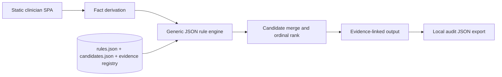
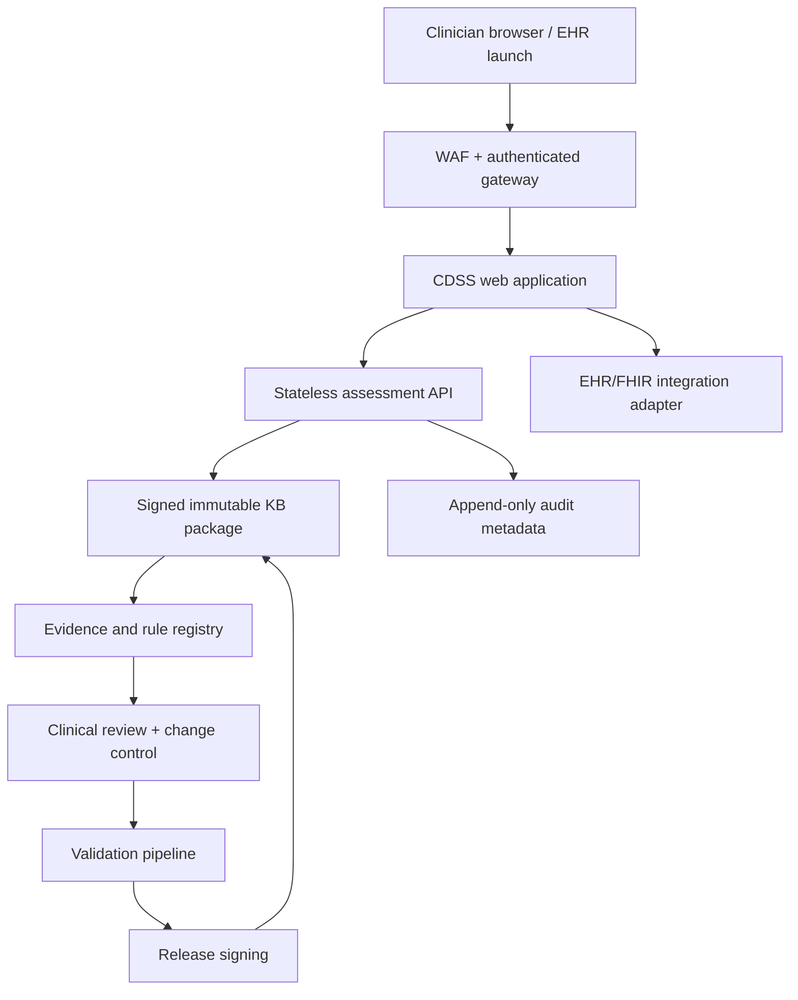

# Production Architecture

## 1. Design goals

- deterministic clinical inference;
- transparent source and rule provenance;
- clinician independent review;
- no generative model in the decision path;
- reproducible versioned outputs;
- local/laboratory-specific reference ranges;
- privacy-by-default and no unnecessary PHI;
- clean separation of content, engine, UI, and audit.

## 2. Prototype architecture



The browser runs the full assessment locally. The included API mirrors the engine for integration testing but is not called by the UI.

## 2a. Module package architecture (Phase 0)

Each module (e.g., `modules/anemia/`) is a self-contained package holding rules.json, candidates.json, evidence.json, reference-ranges.json, module.json (unsigned-stub manifest), and index.js (hook descriptor). The hook descriptor exports: module id, manifest reference, deriveFacts function, summarize function, and limitations. Supporting code (facts.anemia.js, ranges.js) lives in the package.

Three registries dispatch module behavior: `src/facts/registry.js` (fact-derivation by moduleId), `src/ranges/registry.js` (reference-range bands and threshold rules), and `src/modules/registry.js` (getModule/listModules; MODULE_IDS and loadModuleCode enumeration). A shim strategy ensures zero-edit backwards compatibility: `src/facts.js`, `src/referenceRanges.js`, and assessPediatricAnemia() in `src/engine.js` are thin re-export/wrapper shims bound to the 'anemia' module so existing callers need no updates.

`modules/anemia/module.json` is no longer a stub: Wave-0 (EP-5) shipped the two-part signed-manifest scheme described in §6, and the anemia module's manifest is currently `status: "integrity-recorded"` — its `clinicalContentHash`/`governanceHash` are populated and verified at server startup. Its `approvedBy` is still schema-forced to `[]`: no credentialed clinical approver has signed off on this content.

### Module inventory (as of `multi-bundle-conversion-e1` Phase 7)

Four modules are registered under `modules/` today. Their `module.json.status` values are **not**
uniform — read each row rather than assuming parity across modules:

| Module | `module.json.status` | `clinicalContentHash` / `governanceHash` | `approvedBy` | Evidence-layer provenance |
|---|---|---|---|---|
| `anemia` | `integrity-recorded` (Wave-0/EP-5) | populated, verified at server startup | `[]` (no clinical sign-off) | **Bespoke evidence projection** — `evidence-assertions.json` was hand-authored against the verified `RF-EV-001` bundle by a one-off generator script, not the converter's `propose` verb (see below). The generator is committed (`scripts/evidence/oneoff/gen-anemia-evidence-assertions.py`) and manually verified to reproduce this file byte-for-byte, but it is not wired into `npm run check` or any test. Its pre-existing `evidence.json` (EP-3/EP-4 pipeline) is a separate, parallel provenance view; see `modules/anemia/EVIDENCE-PROVENANCE-NOTE.md` and `docs/project_plans/design-specs/anemia-backfill-reconciliation-procedure.md` |
| `cbc_suite_v1` | `unsigned-stub` | `null` / `null` | `[]` | **Converter-derived, end-to-end.** The only module whose evidence-layer artifacts (`evidence-assertions.json`, `rule-provenance.json`, and the drafted `rules.json`/`candidates.json` content) were produced by `tools/rf-bundle-to-kb-pack/`'s `propose` verb against the verified `RF-CBC-002` bundle, per §2b. It is also the only module with a hand-authored `authoring-decisions.yaml` (DF-E1-M1 dependency), which is what lets the converter's rule/candidate-drafting stage run for it at all |
| `kidney_suite_v1` | `unsigned-stub` | `null` / `null` | `[]` | **Bespoke evidence projection**, not converter output — `evidence.json`/`evidence-assertions.json`/`unresolved.json` were hand-derived against the verified `RF-KID-001` bundle by an uncommitted one-off generator, because `propose.mjs` is hardwired to `cbc_suite_v1`'s own drafting content (FR-14) and no `authoring-decisions.yaml` exists yet for this module (Deferred Item DF-E1-M1) |
| `growth_suite_v1` | `unsigned-stub` | `null` / `null` | `[]` | **Bespoke evidence projection**, not converter output — `evidence.json`/`evidence-assertions.json`/`unresolved.json` were hand-derived against the verified `RF-GRO-002` bundle by an uncommitted one-off generator, for the same DF-E1-M1 reason as `kidney_suite_v1` |

**Converter-vs-bespoke-projection distinction (binding).** Only `RF-CBC-002` → `cbc_suite_v1` has
ever completed the converter's `inspect -> verify -> propose` pipeline end-to-end and had its
output copied into a committed module package. `anemia`, `kidney_suite_v1`, and `growth_suite_v1`
all carry evidence-layer artifacts that trace to a verified `rf` bundle, but each was produced by a
**bespoke, module-specific generator script**, not by running the converter's `propose` verb —
`propose.mjs` cannot yet run generically against a module that lacks its own
`authoring-decisions.yaml` (Deferred Item DF-E1-M1; design spec
`docs/project_plans/design-specs/rule-authoring-workflow-per-module.md`). Of the three
bespoke-generator scripts for `anemia`/`kidney_suite_v1`/`growth_suite_v1`, only the `anemia`
one is committed — `scripts/evidence/oneoff/gen-anemia-evidence-assertions.py`. Its committed
form had a path-resolution bug (a wrong repo-root computation) that made every invocation fail;
this has been fixed, and running the corrected script now reproduces
`modules/anemia/evidence-assertions.json` byte-for-byte (verified manually). Unlike
`cbc_suite_v1`'s converter-produced script, `scripts/evidence/backfill-cbc-002-evidence.mjs`
(whose `run()` is imported and exercised by the test suite `npm run check` runs), the anemia
generator is **not** wired into `npm run check` or any test — it is a manual, standalone script
whose reproducibility is not continuously enforced. `kidney_suite_v1`'s and `growth_suite_v1`'s
generators remain uncommitted and unrecoverable from this repository or its history, so those two
modules' evidence-layer files are not regenerable from committed code at all today (tracked in
`.claude/findings/multi-bundle-conversion-e1-findings.md`, Phase 6
"Unreproducible-provenance gap" finding). Whichever module a future pass converts next, describe it
as converter-derived **only** once it has an actual `propose` run behind it and its own
`authoring-decisions.yaml` — never by analogy to another module's posture.

### The `REG-001`/`REG-004` HOLD-record convention

`multi-bundle-conversion-e1` Phase 6 (row P6-T1) introduced a durable pattern for handling any
upstream `rf` run whose subject matter is flagged for legal review rather than cleared as clinical
evidence: a standalone **HOLD record** at `docs/legal/reg-001-reg-004-hold.md`
(`doc_type: legal_hold`). For `REG-001`/`REG-004` specifically — the program's two
regulatory · **LEGAL** runs (as opposed to the 5 clinical runs that feed this platform's modules) —
the HOLD record states plainly that an `rf verify`-passed bundle is a *structural/governance*
verification only, never a legal or clinical sign-off; enumerates a binding, repo-wide exclusion
(no fixture, no converter invocation, no module artifact, no clinical-drafting pathway, no upstream
reads); and names the regression test that enforces it in code
(`tests/ef-batch-reg-exclusion.test.mjs`, asserting the converter's `BATCH_PAIRS` list names exactly
the 4 clinical bundles and scanning for either run's identifiers anywhere in the converter's own
source). The forward-looking routing procedure for *lifting* such a hold — how an eventual legal
sign-off would be captured and acted upon — is a separate design spec, not the HOLD record itself:
`docs/project_plans/design-specs/reg-001-004-legal-signoff-routing.md`.

**Apply this same pattern to any future bundle flagged for legal (or similarly non-clinical)
review**: author a standalone HOLD record cross-referencing the flagging source (here,
`docs/project_plans/expansion/rf-handoff/RESULTS.md` §5) and the owner action item that would lift
it (§7); state explicitly that the flag is not itself a sign-off; enumerate the binding exclusion in
the same shape as §4 of `reg-001-reg-004-hold.md`; and add a regression test asserting the exclusion
holds against the converter's own batch list and source, not only against this document's prose.

## 2b. Converter (`rf-bundle-to-kb-pack`)

`tools/rf-bundle-to-kb-pack/` is the deterministic, offline seam between a **verified** Research
Foundry (`rf`) evidence bundle and a staged CDS knowledge-base authoring proposal ("kb-pack"). It
is EF-WP0 of the Evidence Foundry buildout. The full contract — bundle schema, per-field
converter-eligibility rules, the 15 seam invariants, and the exact output file list — is specified
in `docs/project_plans/expansion/02-evidence-foundry-on-research-foundry.md` §4 (the "02 doc"); this
subsection only orients where the seam sits in this repo's architecture and does not restate that
contract. Tool-level detail (module boundary, error taxonomy, design decisions) lives in
`tools/rf-bundle-to-kb-pack/README.md`.

**Input contract**: a read-only `rf` run directory (e.g. `tests/fixtures/rf-cbc-001/`) whose
`evidence_bundle.yaml` reports `status: verified`. The converter never writes into the run
directory (seam invariant 6) and never opens a network socket or calls a generative model —
structurally true by import surface, asserted by `tests/ef-converter-invariants.test.mjs`.

**Verb sequence**: `inspect` -> `verify` -> `propose`, each running the same
`loader.loadBundle() -> hashing.pinArtifacts() -> checkEligibility()` pipeline before diverging:

- `inspect` — read-only eligibility/hash summary; emits no pack output.
- `verify` — structural pre-check of loader output or a staged pack.
- `propose` — the only verb that writes a kb-pack: it continues past eligibility through
  claim-routing and rule/candidate drafting to assemble the full staged pack described in 02 §4.4.

**Output staging**: `propose` writes exclusively under `build/kb-pack/<module_id>/<pack_version>/`
(e.g. `build/kb-pack/cbc_suite_v1/0.1.0-proposal/`). `build/` is git-ignored — nothing under it is
ever committed; golden/fixture outputs for converter tests live under `tests/fixtures/` instead.

**Module-package vs. staging distinction (OQ-1/OQ-3)**: the converter's `build/kb-pack/` output is
an ephemeral *proposal* — ordinary generated build output, ungoverned and never authoritative. The
committed module package under `modules/cbc_suite_v1/` (§2a's package shape: `rules.json`,
`candidates.json`, `evidence.json`, `evidence-assertions.json`, `rule-provenance.json`,
`authoring-decisions.yaml`, `reference-ranges.json`, `module.json`, `index.js`) is a *separate*,
hand-reviewed, version-controlled artifact that a human copies content into after inspecting a
`propose` run — the converter does not write into `modules/` and no `build/kb-pack/` path is ever a
runtime load path. New per-module projections introduced by this seam (`evidence-assertions.json`,
`rule-provenance.json`) land under `modules/<module_id>/` once accepted, not under `data/` and not
directly out of `build/kb-pack/` — matching this section's existing rule that a module is "a
self-contained package" resolved exclusively under `modules/<id>/`. Nothing this tool produces is
signed, released, or clinically approved; its only output authority is a proposal (02 §4.1,
"Release authority: None").

## 3. Recommended production deployment



### Components

| Component | Responsibility |
|---|---|
| Clinician SPA | Questionnaire, source display, warnings, independent-review view |
| Assessment API | Schema validation, fact derivation, rule execution, versioned response |
| KB package | Rules, candidate definitions, references, ranges, release manifest |
| Evidence registry | Source metadata, exact supporting passage, status, supersession |
| Audit store | Minimal immutable metadata; PHI only when required and governed |
| FHIR adapter | Pulls reviewed labs/demographics and writes a non-authoritative CDS result |
| Clinical governance portal | Proposed rule changes, dual review, conflict resolution, approval |
| CI/CD validation | Unit, regression, traceability, security, and clinical scenario suites |

## 4. Data boundaries

### Recommended default

Do not collect names, addresses, medical-record numbers, free-text notes, or exact dates of birth. Use age in months and a locally generated encounter correlation ID only when integration requires it.

### Browser-only mode

- All calculation local.
- No analytics containing form values.
- No third-party scripts, fonts, error trackers, or session replay.
- Audit export is user initiated.

### Server mode

- TLS 1.2+; encryption at rest.
- Strong authentication and RBAC.
- BAA and HIPAA security/privacy controls when acting for a covered entity/business associate.
- No request-body logging.
- Separate security telemetry from clinical payloads.
- Explicit retention and deletion policy.
- Tenant isolation and regional data residency where required.

## 5. API contract

`POST /api/v1/assess` accepts the JSON schema in `schemas/patient-input.schema.json` and returns `schemas/assessment-output.schema.json`.

Recommended headers:

```http
Content-Type: application/json
X-Knowledge-Base-Version: 0.1.0-2026-07-15
Idempotency-Key: <client-generated UUID>
```

The server should reject a requested KB version it cannot execute. Responses must include the actual version, reviewed-through date, generated timestamp, and complete matched-rule trace.

## 6. Knowledge-base release manifest

**Shipped (Wave-0, EP-5).** Every module carries a `module.json` manifest validated against
`schemas/module-manifest.schema.json` and verified by `src/kbVerify.js#verifyManifest`, which
`server.mjs` calls at startup — an unverifiable manifest makes the server refuse to start (§10).
`scripts/sign-kb.mjs` computes and writes the manifest at release time; `--check` mode verifies
without writing (CI). `scripts/kb-diff.mjs` classifies rule/candidate/evidence changes between two
KB snapshots into a severity tier, failing closed (`block`) on any unresolved change class.

The manifest is a **two-part SHA-256 digest**, not a cryptographic signature over a private key:

- `clinicalContentHash` — over the four KB JSON files' parsed values plus raw-byte hashes of the
  two source files that still hard-code clinical thresholds (`ranges.js`, `facts.anemia.js`).
- `governanceHash` — over the manifest's own governance fields (`status`, `knowledgeBaseVersion`,
  `evidenceReviewedThrough`, `approvedBy`, `validationRunId`, `supersedes`, `supportedAgeMonths`).

`status` is a closed lifecycle enum: `unsigned-stub` → `integrity-recorded` → `superseded`/
`revoked`. Only `integrity-recorded` is servable (`src/kbVerify.js#READY_STATUS`); a matching hash
proves content-provenance consistency with a prior release, never clinical validity.

```json
{
  "id": "anemia",
  "schemaVersion": 1,
  "status": "integrity-recorded",
  "knowledgeBaseVersion": "0.1.0-2026-07-15",
  "evidenceReviewedThrough": "2026-07-15",
  "engineLabel": "Pediatric Anemia Deterministic CDSS",
  "clinicalContentHash": "sha256:...",
  "governanceHash": "sha256:...",
  "approvedBy": [],
  "validationRunId": "local-dev:unattested",
  "supersedes": null,
  "releasedAt": null
}
```

`approvedBy` is schema-forced to `[]` (`maxItems: 0`, mirroring `clinicalApprovers` in §7) — no
credentialed clinical approver has signed off on this knowledge base, and ARC/council-review/`rf`
output is explicitly not an eligible source for one. Raising that cap is the deliberate, reviewable
act by which this project would first claim clinical sign-off; it must never be done to make a
build pass. Evidence staleness has a disclosed but **not yet enforced** expiry policy
(`src/evidenceStalenessPolicy.js`): `maxAgeDays` is `null` until a human makes that governance
decision, and every consumer must disclose non-enforcement rather than imply the check passed.

## 7. Rule-authoring model

The current JSON DSL supports:

- `all`, `any`, and `not` groups;
- equality and numeric comparisons;
- existence/missing checks;
- **tri-state checks** (`is-present`/`is-absent`/`is-unknown`/`is-not-assessed`, `src/ruleEngine.js`
  via `src/facts/tristate.js#toTri` — Wave-0/EP-1, SPIKE-003): a missing path, `null`, and `''` all
  resolve to `unknown` the same way an explicit `unknown` value does, so missingness can never be
  read as normal;
- candidate, alert, question, and note outputs;
- evidence IDs and fixed explanatory text.

**Shipped (Wave-0, EP-3/EP-4).** Every rule is validated against `schemas/rule.schema.json`, which
requires (with `additionalProperties: false`, so nothing can be silently omitted):

- `version`, `effectiveDate` — semver-shaped rule version and the date its content took effect;
- `retireDate` — `null` while active, populated on retirement (never repurposed as "unknown");
- `owner` — a `role:`/`team:` string, schema-pattern-enforced so a person's name cannot be
  substituted for an accountable role;
- `safetyClass` — closed enum `safety-critical`/`diagnostic`/`informational`, derived
  deterministically from the rule's `category`;
- `requiredTestCaseIds` — mechanically populated fixture-path linkage from
  `scripts/rule-coverage.mjs`'s activation-witness mapping; legitimately `[]` (no linkage yet),
  never "exempt from testing";
- `sourcePassageId` — names one exact passage record in `modules/anemia/evidence.json#sources[].passages[]`
  (nullable only for a not-yet-backfilled rule; `scripts/validate-kb.mjs` is the stricter policy
  layer for the shipped KB);
- `changeRationale` — required, non-empty; for the EP-4 backfill this is a uniform string that
  explicitly disclaims any clinical re-review, never an invented per-rule rationale;
- `clinicalApprovers` — schema-forced to `[]` (`maxItems: 0`). **No credentialed clinical
  approver has approved any rule in this knowledge base**, and ARC/council-review/`rf` output is
  explicitly not an eligible source for one; raising the cap is a deliberate governance act, never
  a build-passing shortcut (D-4).

**Not yet shipped:** rule-level supersession links (only the module manifest's `supersedes` exists
today, §6) and a distinct impact-analysis field beyond `changeRationale`.

Avoid executable code inside clinical rules. Calculated facts should be a small, reviewed, unit-tested library.

## 8. FHIR integration proposal

Potential read resources:

- `Patient`: age/administrative sex only as needed;
- `Observation`: CBC, reticulocytes, ferritin, CRP, iron studies, hemolysis labs, lead, nutrients;
- `Condition`: chronic renal/inflammatory/hemoglobinopathy context;
- `MedicationStatement`: exposures relevant to macrocytosis/hemolysis;
- `DiagnosticReport`: smear and hemoglobin-analysis results.

Potential output:

- a transient CDS Hooks card or a versioned `GuidanceResponse`/`DetectedIssue` style artifact;
- do not write a final diagnosis automatically;
- include source links and matched-rule explanation;
- require clinician acceptance before any problem-list or order action.

FHIR mapping requires local code-system governance (LOINC/SNOMED CT/UCUM) and should reject unit mismatches rather than silently convert ambiguous values.

## 9. Security controls

- Content Security Policy and no third-party runtime dependencies.
- Software composition analysis and signed builds.
- SBOM for every release.
- Static analysis, dependency scanning, secret scanning, and container scanning.
- Rate limiting, authentication, authorization, and abuse monitoring for API mode.
- Threat model covering input tampering, rule-package substitution, stale KB, audit manipulation, tenant crossover, and denial of service.
- Cryptographic signature verification for KB packages.
- Reproducible builds and rollback.

## 10. Availability and failure modes

**Shipped (Wave-0).** The application fails closed today when:

- a supplied analyte unit is unrecognized or incompatible with the registered canonical unit
  (`src/units.js#validateUnits`/`classifyUnit`) — a unit is never silently converted, only accepted
  or rejected;
- age is outside a supported range and local limits are missing (`facts.js` `scope.*`; rules
  `SCOPE-001`/`002`/`003`);
- the module manifest fails schema validation, hash verification, or has an unsupported
  `schemaVersion` (`src/kbVerify.js#verifyManifest`, `SUPPORTED_SCHEMA_VERSIONS`) — `server.mjs`
  throws at startup and refuses to serve that module; this is "the UI/engine-version-incompatible"
  condition applied to the manifest shape itself: a matching content hash says nothing about
  whether the running code understands the shape it just verified.

**Disclosed but not yet enforced:** evidence-staleness expiry
(`src/evidenceStalenessPolicy.js`) has a fail-closed design and a `checkEvidenceExpiry` code path
in `src/kbVerify.js`, but `maxAgeDays` is `null` — no human has made the governance decision that
sets the staleness window. Every consumer of the expiry verdict must disclose "not enforced"
loudly (`server.mjs` logs a warning at startup); `null` must never be read as "checked and passed"
or as "never expires."

A failed system displays a clear "no assessment produced"/refusal-to-start state, not stale or partially calculated advice.
