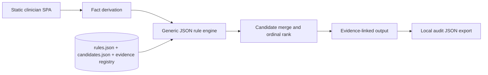
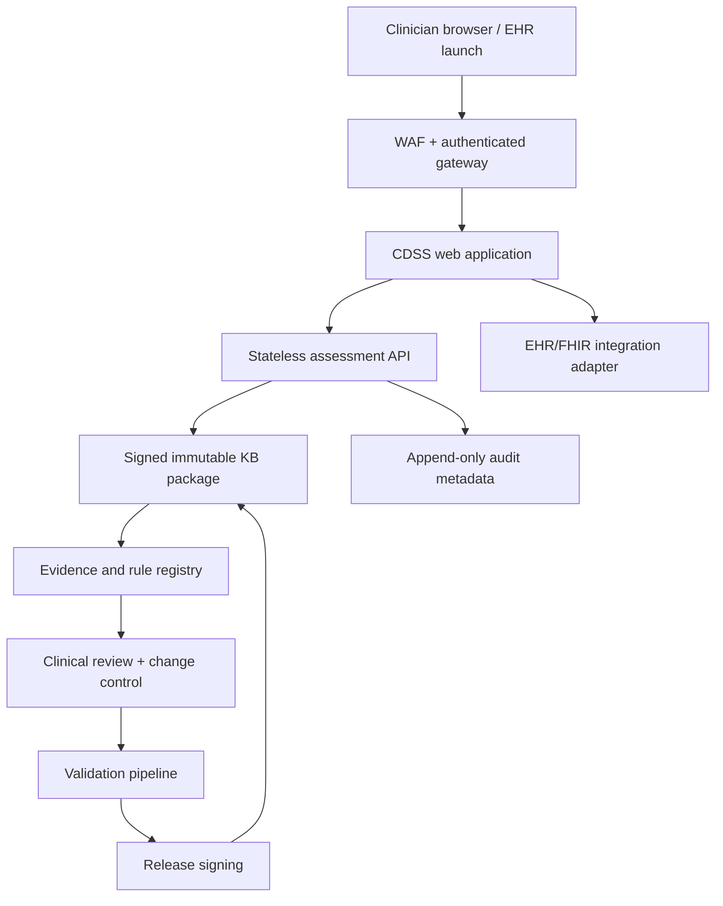

# Production Architecture

## 1. Design goals

- deterministic clinical inference;
- transparent source and rule provenance;
- clinician independent review;
- no generative model in the decision path;
- reproducible versioned outputs;
- local/laboratory-specific reference ranges;
- privacy-by-default and no unnecessary PHI;
- clean separation of content, engine, UI, and audit.

## 2. Prototype architecture



The browser runs the full assessment locally. The included API mirrors the engine for integration testing but is not called by the UI.

## 3. Recommended production deployment



### Components

| Component | Responsibility |
|---|---|
| Clinician SPA | Questionnaire, source display, warnings, independent-review view |
| Assessment API | Schema validation, fact derivation, rule execution, versioned response |
| KB package | Rules, candidate definitions, references, ranges, release manifest |
| Evidence registry | Source metadata, exact supporting passage, status, supersession |
| Audit store | Minimal immutable metadata; PHI only when required and governed |
| FHIR adapter | Pulls reviewed labs/demographics and writes a non-authoritative CDS result |
| Clinical governance portal | Proposed rule changes, dual review, conflict resolution, approval |
| CI/CD validation | Unit, regression, traceability, security, and clinical scenario suites |

## 4. Data boundaries

### Recommended default

Do not collect names, addresses, medical-record numbers, free-text notes, or exact dates of birth. Use age in months and a locally generated encounter correlation ID only when integration requires it.

### Browser-only mode

- All calculation local.
- No analytics containing form values.
- No third-party scripts, fonts, error trackers, or session replay.
- Audit export is user initiated.

### Server mode

- TLS 1.2+; encryption at rest.
- Strong authentication and RBAC.
- BAA and HIPAA security/privacy controls when acting for a covered entity/business associate.
- No request-body logging.
- Separate security telemetry from clinical payloads.
- Explicit retention and deletion policy.
- Tenant isolation and regional data residency where required.

## 5. API contract

`POST /api/v1/assess` accepts the JSON schema in `schemas/patient-input.schema.json` and returns `schemas/assessment-output.schema.json`.

Recommended headers:

```http
Content-Type: application/json
X-Knowledge-Base-Version: 0.1.0-2026-07-15
Idempotency-Key: <client-generated UUID>
```

The server should reject a requested KB version it cannot execute. Responses must include the actual version, reviewed-through date, generated timestamp, and complete matched-rule trace.

## 6. Knowledge-base release manifest

A production release should add a signed manifest:

```json
{
  "knowledgeBaseVersion": "1.0.0-2027-01-15",
  "clinicalContentHash": "sha256:...",
  "engineCompatibility": ">=1.0.0 <2.0.0",
  "evidenceReviewedThrough": "2027-01-15",
  "approvedBy": [
    { "role": "pediatric hematologist", "approvalId": "..." },
    { "role": "general pediatrician", "approvalId": "..." },
    { "role": "laboratory medicine", "approvalId": "..." }
  ],
  "validationRunId": "...",
  "supersedes": "0.9.4-2026-11-01",
  "releasedAt": "2027-01-15T18:00:00Z"
}
```

## 7. Rule-authoring model

The current JSON DSL supports:

- `all`, `any`, and `not` groups;
- equality and numeric comparisons;
- existence/missing checks;
- candidate, alert, question, and note outputs;
- evidence IDs and fixed explanatory text.

Production additions should include:

- JSON Schema validation for every rule;
- typed facts registry with units and allowed values;
- exact source passage/section locator per rule;
- effective and retirement dates;
- supersession links;
- rule owner and clinical approvers;
- safety classification;
- required test-case IDs;
- change rationale and impact analysis.

Avoid executable code inside clinical rules. Calculated facts should be a small, reviewed, unit-tested library.

## 8. FHIR integration proposal

Potential read resources:

- `Patient`: age/administrative sex only as needed;
- `Observation`: CBC, reticulocytes, ferritin, CRP, iron studies, hemolysis labs, lead, nutrients;
- `Condition`: chronic renal/inflammatory/hemoglobinopathy context;
- `MedicationStatement`: exposures relevant to macrocytosis/hemolysis;
- `DiagnosticReport`: smear and hemoglobin-analysis results.

Potential output:

- a transient CDS Hooks card or a versioned `GuidanceResponse`/`DetectedIssue` style artifact;
- do not write a final diagnosis automatically;
- include source links and matched-rule explanation;
- require clinician acceptance before any problem-list or order action.

FHIR mapping requires local code-system governance (LOINC/SNOMED CT/UCUM) and should reject unit mismatches rather than silently convert ambiguous values.

## 9. Security controls

- Content Security Policy and no third-party runtime dependencies.
- Software composition analysis and signed builds.
- SBOM for every release.
- Static analysis, dependency scanning, secret scanning, and container scanning.
- Rate limiting, authentication, authorization, and abuse monitoring for API mode.
- Threat model covering input tampering, rule-package substitution, stale KB, audit manipulation, tenant crossover, and denial of service.
- Cryptographic signature verification for KB packages.
- Reproducible builds and rollback.

## 10. Availability and failure modes

The application must fail closed when:

- reference units are absent or incompatible;
- age is outside a supported range and local limits are missing;
- the KB package signature/hash is invalid;
- the UI and engine versions are incompatible;
- evidence version is expired under governance policy.

A failed system should display a clear “no assessment produced” state, not stale or partially calculated advice.
