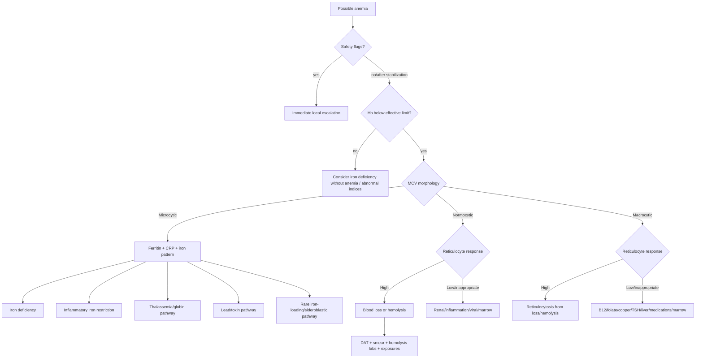

# Clinical Algorithm and Adaptive Questionnaire

This document describes the deterministic reasoning encoded in `modules/anemia/rules.json`. It is a design specification for clinical review, not a validated standard of care.

## 1. Intended output

The engine returns:

- anemia status relative to the effective reference limit;
- morphology and RDW interpretation;
- urgent safety flags;
- an ordinal, ranked differential of diagnostic patterns;
- supporting findings, cautions, and confirmatory steps;
- highest-yield missing questions;
- complete matched-rule and evidence provenance.

The engine never returns a probability or a guaranteed diagnosis. “Meets defined pattern” means that the input satisfies a criterion explicitly encoded from the cited source; it does not mean every competing diagnosis has been excluded.

## 2. Knowledge graph



Sources: [AAP2026_IDA], [BLOOD2022_PED_ANEMIA], [WHO2024_HB].

## 3. Step-by-step deterministic logic

### Step 0 — Scope

1. Obtain age in months and sex assigned at birth, or supply local reference intervals.
2. If age <6 months, do not use the built-in CBC ranges. Route to neonatal/young-infant logic.
3. If age ≥18 years, require local/adult limits.
4. Local hemoglobin, MCV, and RDW limits always override built-in values.
5. Flag recent transfusion and high altitude as interpretation limitations.

### Step 1 — Safety screen

The engine raises an emergency or urgent flag when any of the following are supplied:

- hemodynamic instability, respiratory distress, syncope, altered mental status, chest pain, or heart-failure signs;
- active major bleeding;
- fever with laboratory-reported neutropenia;
- blasts on peripheral smear;
- anemia with another cytopenia;
- schistocytes with thrombocytopenia, renal, or neurologic findings;
- blood lead level 20–44 or ≥45 µg/dL;
- hemoglobin <7 g/dL, presented as the AAP severe-IDA category and an urgent assessment signal—not a universal transfusion threshold. [AAP2026_IDA; CDC2025_LEAD; BLOOD2022_PED_ANEMIA]

Safety rules do not stop the software from showing other patterns, because transparent coexisting findings may be clinically useful. They must be visually dominant.

### Step 2 — Confirm anemia

```text
if hemoglobin < effective lower limit:
    anemia = present
else if hemoglobin and lower limit are both available:
    anemia = absent
else:
    anemia = indeterminate
```

The effective lower limit is local when supplied; otherwise it is the AAP fallback for age/sex in the supported age range. [AAP2026_IDA]

### Step 3 — Classify morphology

```text
if MCV < effective MCV lower limit: microcytic
else if MCV > effective MCV upper limit: macrocytic
else if MCV and both limits supplied: normocytic
else: indeterminate
```

RDW is classified with the local upper limit or AAP fallback. Recent transfusion triggers a mixed-population caution. [AAP2026_IDA; BLOOD2022_PED_ANEMIA]

### Step 4 — Reticulocyte response

The clinician selects the laboratory-context interpretation:

- low;
- inappropriately normal for the degree of anemia;
- appropriate but not elevated;
- high;
- unknown.

This avoids a false universal cutoff. High response shifts toward loss/destruction; low/inappropriate response shifts toward impaired production. [BLOOD2022_PED_ANEMIA]

## 4. Microcytic branch

### 4.1 Iron deficiency

Strongest rule:

```text
anemia present AND ferritin <= age/menstrual AAP threshold
→ iron deficiency anemia pattern: meets defined pattern
```

The threshold is ≤20 ng/mL for 6 months to <12 years and ≤30 ng/mL for 12 to <18 years or any menstruating patient. [AAP2026_IDA]

Supporting but less specific pattern:

- microcytosis;
- elevated RDW;
- dietary risk, excessive cow milk, pica, prematurity, malabsorption, or bleeding history;
- locally low transferrin saturation.

If ferritin is not low and CRP is elevated, iron deficiency remains not excluded. sTfR/log10(ferritin) >2 increases support; <1 with inflammation supports anemia of inflammation. [AAP2026_IDA]

### 4.2 Anemia of inflammation

Strong rule:

```text
anemia + elevated CRP + non-low ferritin + low TSAT + low/normal TIBC
→ inflammatory iron-restriction pattern
```

A chronic inflammatory condition with low reticulocyte response is supportive but less specific. [AAP2026_IDA; BLOOD2022_PED_ANEMIA]

### 4.3 Thalassemia/globin pathway

Support increases with:

- persistent microcytosis and non-low ferritin;
- RBC count relatively high for age/microcytosis;
- target cells;
- family history or newborn-screen evidence;
- elevated HbA2 after infancy;
- positive alpha- or beta-globin testing;
- Hb Bart’s on newborn screen. [AAP2026_IDA]

A normal HbA2 during iron deficiency does not definitively exclude beta-thalassemia trait. Alpha-thalassemia may require molecular testing outside the newborn period. [AAP2026_IDA]

### 4.4 Lead

- BLL ≥3.5 µg/dL enters a lead exposure pathway.
- Elevated capillary screens require venous confirmation.
- 20–44 and ≥45 µg/dL trigger urgent/emergency action tiers.
- Microcytosis, pica, older housing/exposure, and basophilic stippling are supportive prompts, not diagnostic substitutes for a BLL. [CDC2025_LEAD]

### 4.5 Rare microcytic processes

High iron or ferritin plus microcytosis and basophilic stippling raises a sideroblastic/iron-loading pathway, with lead and thalassemia retained as alternatives. Persistent microcytic iron-restricted anemia despite a clinician-verified adequate trial raises a rare iron-handling pathway only after adherence, blood loss, malabsorption, inflammation, and hemoglobinopathy are re-evaluated. [BLOOD2022_PED_ANEMIA; AAP2026_IDA]

## 5. Normocytic branch

### 5.1 High reticulocyte response

1. Ask about overt/occult bleeding.
2. Evaluate indirect bilirubin, LDH, haptoglobin, DAT, urinalysis, and smear.
3. A general biochemical hemolysis pattern in this implementation requires at least two of:
   - indirect bilirubin high;
   - LDH high;
   - haptoglobin low.
4. Apply specific patterns:
   - DAT positive → immune hemolysis pathway;
   - spherocytes + DAT negative → hereditary spherocytosis pathway;
   - bite/blister cells + oxidant trigger → G6PD pathway;
   - schistocytes → microangiopathic/mechanical pathway;
   - sickling hemoglobin/newborn-screen/sickle cells → sickling hemoglobinopathy pathway;
   - fever + malaria exposure → urgent infectious pathway. [BLOOD2022_PED_ANEMIA; BSH2020_G6PD]

### 5.2 Low or inappropriately normal reticulocyte response

- Renal dysfunction + normocytic anemia → renal/EPO-limited pattern.
- Chronic inflammation → inflammatory production-limited pattern.
- Young child, isolated normocytic anemia, recent viral illness, no selected organomegaly/lymphadenopathy/blasts → transient erythroblastopenia **possible**, diagnosis of exclusion.
- Chronic hemolytic disease + abrupt reticulocytopenic anemia after viral illness → parvovirus aplastic crisis pattern.
- Additional cytopenias, blasts, organomegaly, lymphadenopathy, petechiae, or bruising → marrow failure/infiltration pathway with urgent escalation. [BLOOD2022_PED_ANEMIA]

## 6. Macrocytic branch

1. High reticulocytes can cause macrocytosis and redirect to loss/hemolysis.
2. Low/inappropriate reticulocytes plus low B12/folate or hypersegmented neutrophils support a megaloblastic pathway.
3. Check TSH, liver tests, and medication exposures for non-megaloblastic macrocytosis.
4. Low copper, especially with neutropenia, supports a copper-deficiency pathway.
5. Congenital anomalies, short stature, pigmentation, limb/radius findings, early-onset macrocytic reticulocytopenia, or progressive cytopenias trigger an inherited marrow-failure pathway; syndrome-specific diagnosis requires hematology/genetics confirmation. [BLOOD2022_PED_ANEMIA]

## 7. Complete adaptive questionnaire

The web form captures all fields, but the engine prioritizes missing questions by branch.

### Tier 1 — mandatory classification and safety

| Question/input | Reason | Evidence |
|---|---|---|
| Age in months | Selects age-specific range and differential | AAP2026; WHO2024 |
| Sex assigned at birth or local limits | AAP fallback is sex stratified in older age bands | AAP2026 |
| Hemoglobin and local lower limit | Confirms anemia | AAP2026; WHO2024 |
| MCV and local lower/upper limits | Morphology | AAP2026; Blood2022 |
| Instability, respiratory/cardiac/neurologic symptoms | Immediate escalation | Blood2022 |
| Active major bleeding | Immediate escalation and loss branch | Blood2022 |
| WBC/ANC/platelets and lab flags | Detects multi-lineage cytopenia | Blood2022 |
| Blasts/schistocytes if known | High-risk marrow or microangiopathic pathway | Blood2022 |

### Tier 2 — highest diagnostic information gain

| Branch | Question/input | Reason |
|---|---|---|
| Any anemia | Reticulocyte response | Production failure vs loss/destruction |
| Microcytic | Ferritin | Strongest iron-deficiency discriminator |
| Microcytic + non-low ferritin | CRP and inflammatory history | Detect ferritin confounding/inflammation |
| Microcytic + non-low ferritin | Newborn screen, HbA2, hemoglobin/globin testing | Thalassemia/globin pathway |
| Microcytic + lead risk | BLL and specimen type | Direct lead assessment |
| High retic | Bleeding history | Loss vs hemolysis |
| High retic | Bilirubin, LDH, haptoglobin, DAT, smear | Hemolysis and etiology |
| Low retic | Kidney, inflammation, viral history, other cell lines | Production causes |
| Macrocytic | B12, folate, retic, smear | Megaloblastic vs reticulocytosis |

### Tier 3 — etiologic refinement

**Demographics and birth**

- gestational age/prematurity, birth weight;
- neonatal jaundice or transfusion history;
- newborn-screen results;
- ethnicity/ancestry only where clinically relevant and never as a substitute for testing.

**Diet and iron balance**

- breast/formula/fortification history for infants;
- cow milk before 12 months and >24 oz/day;
- iron-rich foods and supplements;
- vegetarian/vegan diet;
- food insecurity;
- pica;
- celiac/malabsorption symptoms;
- menstrual, GI, nasal, urinary, donation-related, procedural, or other blood loss. [AAP2026_IDA]

**Hemolysis and inherited disease**

- jaundice, dark urine, gallstones, splenomegaly;
- family history of anemia, jaundice, gallstones, splenectomy, hemoglobinopathy;
- oxidant drugs/fava beans/mothball exposure;
- transfusion timing;
- known sickle, thalassemia, membrane, or enzyme disorder;
- travel/residence and malaria risk. [BLOOD2022_PED_ANEMIA; BSH2020_G6PD]

**Production failure/systemic disease**

- renal, inflammatory, rheumatologic, GI, endocrine, liver, infectious, or malignant disease;
- recent viral illness;
- medication list;
- weight/growth and congenital anomalies;
- recurrent infections, bruising, petechiae, lymphadenopathy, hepatosplenomegaly. [BLOOD2022_PED_ANEMIA]

**Laboratory refinement**

- absolute/percent reticulocytes and local interpretation;
- ferritin, CRP/ESR, TSAT/TIBC, sTfR/ferritin index;
- bilirubin, LDH, haptoglobin, DAT, urinalysis;
- B12, folate, copper, TSH, renal and liver tests;
- blood lead level/specimen;
- hemoglobin analysis, alpha/beta globin testing;
- G6PD assay timing;
- expert smear findings;
- specialized membrane/enzyme/marrow/genetic testing when indicated.

## 8. Ordinal ranking model

Candidates merge evidence from multiple rules. The highest evidence label wins; deterministic points sort candidates within a label.

| Label | Meaning |
|---|---|
| Meets defined pattern | An explicit biochemical/molecular/source-defined criterion was met |
| Strongly supported | A high-specificity combination of findings was met |
| Supported | Multiple compatible findings, but meaningful alternatives remain |
| Possible | A lower-specificity pattern that warrants a question/test |
| Not excluded | A known confounder prevents exclusion |

The point total is intentionally visible in the JSON audit only as a software sorting mechanism. It has no probabilistic interpretation.

## 9. Rule traceability

Every rule in `modules/anemia/rules.json` contains:

```json
{
  "id": "ID-001",
  "category": "differential",
  "when": {
    "all": [
      { "fact": "anemia.present", "op": "eq", "value": true },
      { "fact": "ferritin.low", "op": "eq", "value": true }
    ]
  },
  "evidence": ["AAP2026_IDA"],
  "output": {
    "type": "candidate",
    "candidateId": "iron-deficiency-anemia",
    "level": "meets-defined-pattern",
    "points": 110
  }
}
```

The runtime records every rule as matched or not matched, making the result reproducible for a fixed KB version and input.

## References

See [`research-and-evidence.md`](research-and-evidence.md) for full citations and source links.
