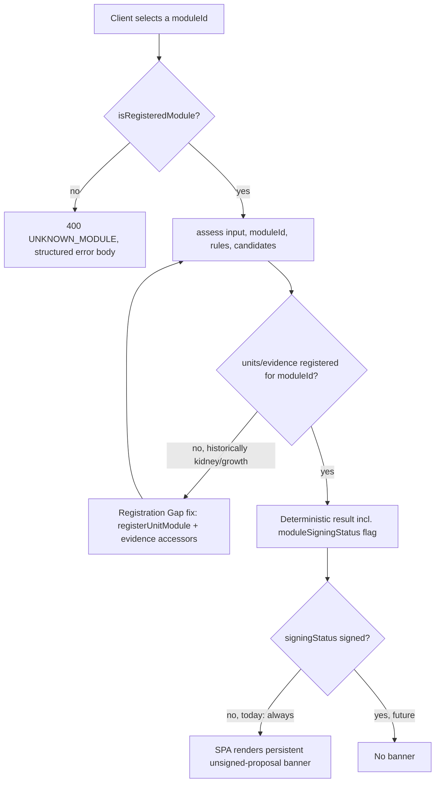

# Feature Brief & Metadata

**Feature Name:**

> Module Switcher — Public `moduleId` API Surface + SPA Module Selector (DEF-6)

**Filepath Name:**

> `module-switcher-v1` (kebab-case)

**Date:**

> 2026-07-22

**Author:**

> prd-writer (Claude, Sonnet 5)

**Related Epic(s)/PRD ID(s):**

> DEF-6 (Deferred Items Triage Table, `platform-foundation-p0-v1` plan). Design-spec promotion
> trigger: "a second registered module needs client-selectable targeting" — met (registry now
> holds 4 modules: `anemia`, `cbc_suite_v1`, `kidney_suite_v1`, `growth_suite_v1`).

**Related Documents:**

> - `docs/project_plans/design-specs/public-moduleid-api-surface.md` — the DEF-6 design spec this
>   PRD promotes; its 5 Open Questions are resolved below (see §12).
> - `.claude/worknotes/module-switcher/decisions-block.md` — Opus planning scaffold (phase
>   boundaries, agent routing, risk hotspots, estimation). Per that document's own instruction,
>   this PRD wins on product intent where it conflicts; the decisions block wins on
>   phase/agent/model execution structure. This PRD's OQ resolutions mostly confirm the block's
>   leans, with one material addition (§2's "Registration Gap" finding) it did not have evidence
>   for at write time.
> - `docs/architecture.md` §2a (module package architecture), §6/§7/§10 (Wave-0 safety substrate:
>   `clinicalApprovers[]`/`approvedBy[]` stay schema-forced empty).
> - `schemas/module-manifest.schema.json` — the manifest shape this feature's signing-status logic
>   reads from (no schema change proposed by this PRD).

---

## 1. Executive Summary

Today `moduleId` is a fully-wired *internal* dispatch key — the registry, fact derivation, unit
validation, and evidence lookups all take it as a parameter — but no client (browser SPA or API
caller) can ever set it. Four modules are registered (`anemia`, `cbc_suite_v1`, `kidney_suite_v1`,
`growth_suite_v1`), yet every request is silently served against `anemia` alone. This feature
exposes `moduleId` as a validated, backward-compatible, additive `POST /api/v1/assess` request
field and adds a module selector to the browser SPA, so a caller can choose which registered
module's deterministic engine evaluates their input. Because none of the four modules carries
credentialed clinical sign-off today (`approvedBy: []` on every `module.json`, enforced by D-4),
every module — driven by that same manifest metadata, never a hardcoded module-id check — renders
behind a persistent, fail-closed "unsigned implementation proposal, not clinically reviewed, not
for clinical use" banner in the SPA and an equivalent machine-readable flag in every API response.
This is pure platform plumbing: zero new clinical rules, thresholds, or evidence records.

**Priority:** HIGH

**Key Outcomes:**
- A client (SPA user or API integrator) can select any of the 4 registered modules and receive a
  correctly-scoped assessment (facts, rules, candidates, reference ranges, evidence) for that
  module — the platform's stated multi-module direction becomes reachable, not just internally
  wired.
- No module's unsigned status can be silently misrepresented as reviewed: the banner/flag is
  derived from manifest state and fails closed on missing/unknown data, closing the exact "banner
  rots the day a fifth module lands" risk the planning scaffold flagged.
- A pre-existing latent defect is fixed as a load-bearing prerequisite: `kidney_suite_v1` and
  `growth_suite_v1` currently **throw** (do not just return empty) when `assess()` is called with
  their `moduleId` — see §2's Registration Gap finding — so this feature cannot ship without first
  closing that gap.

---

## 2. Context & Background

### Current State

**Registry (fully wired internally, zero external surface).** `src/modules/registry.js:6-11`
registers four modules in a `Map`; `MODULE_IDS` (`src/modules/registry.js:37`) is derived from
that map (never hand-maintained — the file's own comment calls a hand-maintained literal a
"silent drift" risk); `DEFAULT_MODULE_ID = 'anemia'` (`src/modules/registry.js:51`) is documented
as a "deliberate tripwire" pending "the day a client-selectable moduleId surface actually ships —
a UI control, an API parameter, a CDS Hooks card selector, etc." — this feature is that trigger.
`isRegisteredModule()` (`src/modules/registry.js:75-77`) already exists and is unused by any
external-input path today.

**Server (loads all 4, serves only 1).** `server.mjs:104-121` loads every registered module's KB
and manifest verdict at startup unconditionally, and fails closed only for `DEFAULT_MODULE_ID`
(`server.mjs:113-119`) — a non-servable `anemia` manifest refuses to start the server; a
non-servable `cbc_suite_v1`/`kidney_suite_v1`/`growth_suite_v1` manifest is disclosed, not fatal.
`server.mjs:123-124` hardcodes `rules`/`candidates` to `modulesById.anemia`. The guardrail comment
directly above the knowledge-base handler is explicit: `server.mjs:127` `// present, not
conditional on any request param (no moduleId request surface exists, AC-5)`. `POST
/api/v1/assess` (`server.mjs:247-254`) reads no `moduleId` from the request body at all and calls
`assessPediatricAnemia(input, rules, candidates)` — a thin wrapper (`src/engine.js:98-100`) that
hardcodes `assess(input, 'anemia', rules, candidates)`.

**The engine is already module-parameterized.** `src/engine.js:19` — `export function
assess(input, moduleId, rules, candidates)` — already resolves the module's hook descriptor via
`getModule(moduleId)`, runs `prepareUnitValidatedInput(moduleId, input)`, calls
`module.deriveFacts`/`module.assertInScope`/`module.summarize`/`module.limitations`, and resolves
per-rule evidence passages through `src/evidence/registry.js`'s moduleId-scoped accessors. This
feature's job is almost entirely to *reach* this existing parameterized entry point from the
outside — not to build it.

**`GET /api/v1/knowledge-base` already returns all 4 modules.** `server.mjs:135-161`
(`modulesSummary`) already iterates every entry in `MODULE_IDS` and returns each module's rule
count, pattern count, evidence count, and manifest summary (`status`, `knowledgeBaseVersion`,
`evidenceReviewedThrough`, `validationRunId`, `approvedBy`, `supersedes`) — served "as-is, never as
an error" per the comment at `server.mjs:130-134`. **This is undocumented**: `openapi.yaml:36-44`'s
response schema for this endpoint lists only `knowledgeBaseVersion`, `evidenceReviewedThrough`,
`ruleCount`, `diagnosticPatternCount`, `evidence` — the `modules` field the server actually returns
today is entirely absent from the contract. This is pre-existing doc/implementation drift this
feature closes (§6, FR-6), not new speculative scope.

**Manifest-driven signing status already exists as data, unused as a UI/API signal.** Every
`modules/<id>/module.json` carries `status` (closed enum: `unsigned-stub` | `integrity-recorded` |
`superseded` | `revoked`, `schemas/module-manifest.schema.json`) and `approvedBy` (schema-forced
`maxItems: 0` — "no credentialed human clinician has approved this knowledge base"). Today:
`anemia` is `status: "integrity-recorded"` (content-hash verified, servable) but `approvedBy: []`;
`cbc_suite_v1`/`kidney_suite_v1`/`growth_suite_v1` are all `status: "unsigned-stub"`, also
`approvedBy: []`. **No module has ever had a non-empty `approvedBy`** — by design (D-4). A
module-level precedent already exists at the *rule* level:
`src/governance.js#hasCredentialedClinicalApproval`/`clinicalApprovalStatus` implement exactly
this "empty array is a real, non-approved state — never branch on truthiness" pattern for
`rule.clinicalApprovers`; this feature's module-level signing-status derivation follows the same
shape at the manifest level (new code, no existing module-level equivalent).

**The SPA has zero module awareness.** `src/app.js:554-557` fetches
`'./modules/anemia/rules.json'`/`'./modules/anemia/candidates.json'` as **hardcoded literal
paths** — the only two files the running SPA ever reads. There is no selector UI anywhere in
`index.html`/`src/app.js`. The existing `.safety-banner` (`index.html:41`) is a single,
page-level, always-present "Not clinically validated" notice — general to the whole prototype, not
scoped to a selected module's signing status. `scripts/build-static.mjs:14` already copies the
entire `modules/` directory into `dist/` (all 4 modules' JSON, including `module.json`, ship to
the browser today with zero code changes) — the SPA has the data it needs; it just never reads it.

**Registration Gap — a real defect this feature must fix as a prerequisite, not a hypothetical.**
Verified by driving `assess()` directly against every `MODULE_IDS` entry:

```
anemia            OK
cbc_suite_v1       OK
kidney_suite_v1    THROW UnitRejectionError
growth_suite_v1    THROW UnitRejectionError
```

`kidney_suite_v1` and `growth_suite_v1` were registered in `src/modules/registry.js` and
`src/facts/registry.js` (E1 multi-bundle conversion, commit `263120b`) but **never registered in
`src/units.js`** (only `anemia` and `cbc_suite_v1` call `registerUnitModule`/hold a `MODULE_ID`
constant — `modules/anemia/units.js:4`, `modules/cbc_suite_v1/units.js:20`) **or in
`src/evidence/registry.js`** (its `REGISTRY` Map, `src/evidence/registry.js:35-49`, has entries
only for `anemia` and `cbc_suite_v1`; `accessorsFor()` throws loudly for any other moduleId).
`src/engine.js#assess()` calls `prepareUnitValidatedInput(moduleId, input)` *before*
`deriveFacts()` — so any assessment request against `kidney_suite_v1`/`growth_suite_v1`, even with
a fully empty patient input, throws a `UnitRejectionError` today. Both modules' `rules.json` is
`[]` and `candidates.json` is `{}` (deliberately inert scaffolds — see each module's `index.js`
header comment), so once units/evidence registration exists, `assess()` returns a well-formed
"not yet implemented" result for them rather than throwing. This is pure plumbing (mirrors the
existing `registerUnitModule(moduleId)` "zero unit-bearing fields" path the file's own comment at
`src/units.js:20` already documents, and mirrors `cbc_suite_v1`'s existing `evidence.js` shape at
`modules/cbc_suite_v1/evidence.js`) — it adds zero clinical thresholds, rules, or evidence content.

**Test tripwire that this feature is the trigger for.** `tests/module-registry.test.mjs:20-26`'s
assertion 1 comment reads: *"Deliberate tripwire: today there is exactly one registered module, so
`DEFAULT_MODULE_ID` is a hardcoded literal. This assertion must be updated/deleted the day a second
module registers — its failure is the signal that `DEFAULT_MODULE_ID` needs a real (non-hardcoded)
selection decision instead of an assumed constant."* The registry already has 4 modules (the
comment is stale on that count), and this PRD *is* the "client-selectable moduleId surface actually
ships" trigger both this comment and `src/modules/registry.js:39-50`'s own tripwire comment name
explicitly. The literal assertion (`DEFAULT_MODULE_ID === 'anemia'`) is kept as a product decision
(§4, FR-11) but the surrounding comment claiming no client-facing surface exists becomes false and
must be corrected (§6, FR-13).

### Problem Space

A clinician or integrator who wants to run the CBC/kidney/growth suites' deterministic engines
(even in their current inert-scaffold state, to see the "not yet implemented" honesty posture in
practice, or the fully-wired `cbc_suite_v1` slice) has no way to reach them — every request is
silently coerced to `anemia`. There is no signal anywhere in the API response or SPA UI that would
tell a caller "you got the anemia engine because there was no other option," which is honest today
(there is no other option) but becomes a silent, confusing default the moment `moduleId` selection
exists without also exposing *which* module actually ran and *whether it is safe to treat that
output as anything more than a scaffold*.

### Current Alternatives / Workarounds

None client-facing. A developer can call `assess(input, moduleId, rules, candidates)` directly in
Node (bypassing the server/SPA entirely), which is how this PRD's grounding investigation
discovered the Registration Gap — that is a debugging workaround, not a supported integration path.

### Market / Competitive Notes (Optional)

Not applicable — internal research-prototype platform, no external competitive positioning claim
made or implied by this feature.

### Architectural Context

This repo does not use a router/service/repository layered architecture (single hand-rolled Node
`http` server, `server.mjs`, no ORM, no framework). The relevant architecture is:

```
client (SPA / HTTP caller)
  → POST /api/v1/assess { ..., moduleId? }
  → server.mjs: validate moduleId (isRegisteredModule) → select modulesById[moduleId]
  → src/engine.js#assess(input, moduleId, rules, candidates)
      → src/modules/registry.js#getModule(moduleId)          (hook descriptor)
      → src/units.js#prepareUnitValidatedInput(moduleId, ..)  (Registration Gap fix required here)
      → module.deriveFacts / module.assertInScope
      → src/ruleEngine.js#runRules
      → src/evidence/registry.js#passageByIdForModule(moduleId, ..) (Registration Gap fix required here)
      → module.summarize / module.limitations
  → response { ..., meta: { moduleSigningStatus: "unsigned-proposal" | ... } }
```

Response envelope for errors: `{ error: string, code?: string, details?: [...] }`
(`src/serverErrors.js:10-24`, established by `UnitRejectionError`/`RangeUnitMismatchError`/
`AgeOutOfSupportedRangeError` — see `tests/server-error-contract.test.mjs` for the pinned shape).
Every response carries `X-Request-Id` (`server.mjs:183-190`), including error responses.

---

## 3. Problem Statement

> "As an integrator or clinician-researcher evaluating this platform, when I want to assess a case
> against the CBC suite, kidney suite, or growth suite engine instead of the anemia engine, I get
> silently routed to the anemia engine instead — with no way to select otherwise and no signal in
> the response about which engine actually ran or whether its output carries any clinical review."

**Technical Root Cause:**
- No client-facing `moduleId` request surface exists on `POST /api/v1/assess` (`server.mjs:247-254`
  ignores any such field even if a caller sent one).
- `GET /api/v1/knowledge-base`'s existing all-modules `modules` field is undocumented in
  `openapi.yaml`, so an integrator reading the contract would not discover the other 3 modules
  exist at all.
- The SPA hardcodes the anemia module's file paths (`src/app.js:554-557`) with no selector.
- No per-module "is this clinically signed" signal is surfaced anywhere a client can read it.
- `kidney_suite_v1`/`growth_suite_v1` cannot be assessed at all today without first fixing the
  Registration Gap (§2).

---

## 4. Goals & Success Metrics

### Primary Goals

**Goal 1: Reachability — every registered module is client-selectable**
- A caller can set `moduleId` on `POST /api/v1/assess` and the response reflects that module's
  engine, facts, rules, candidates, and evidence — not `anemia`'s, regardless of which module was
  requested.
- Success criteria: all 4 `MODULE_IDS` entries produce a well-formed (non-throwing) `assess()`
  result via the public API and the SPA selector.

**Goal 2: Honesty — unsigned status is unmissable, metadata-driven, and fails closed**
- Every module's real signing status (today: none are signed) is visible in both the API response
  and the SPA, derived only from manifest fields, never a hardcoded module-id list.
- Success criteria: a synthetic manifest missing/malformed `status`/`approvedBy` still renders the
  banner (unit-tested); no code path special-cases `moduleId === 'anemia'` to suppress it.

**Goal 3: Backward compatibility — zero behavior change for existing callers**
- Any caller that omits `moduleId` gets byte-identical output to today's `anemia`-only behavior.
- Success criteria: a regression test asserts identical `assess()` output for a fixed input with
  `moduleId` omitted vs. `moduleId: 'anemia'` explicit, both pre- and post-change.

### Success Metrics

| Metric | Baseline | Target | Measurement Method |
|--------|----------|--------|-------------------|
| Registered modules reachable via API `moduleId` | 0 of 4 | 4 of 4 | Integration test: `POST /api/v1/assess` with each `MODULE_IDS` value returns 200, not a throw |
| Registered modules reachable via SPA selector | 0 of 4 | 4 of 4 | Browser smoke: selecting each module in the UI and submitting the form does not error |
| Unsigned-proposal banner fail-closed coverage | untested (does not exist) | 100% (incl. missing/malformed manifest fixture) | Unit test over the signing-status derivation function with valid, missing, and malformed manifest fixtures |
| Backward-compat regression | n/a | 0 diffs | `assess()` output diff test, `moduleId` omitted vs. `'anemia'` explicit |
| Clinical JSON files touched | n/a | 0 | `git diff --name-only` scoped review against `modules/*/rules.json`, `candidates.json`, `evidence.json` |
| `openapi.yaml` / server response drift | 1 known gap (`modules` field undocumented) | 0 | Doc-truth test asserting response shape against schema |

---

## 5. User Personas & Journeys

### Personas

**Primary Persona: Platform integrator / API caller**
- Role: developer wiring this prototype's API into a research or demo harness.
- Needs: discover which modules exist, select one explicitly, get a clear signal (not a silent
  anemia fallback, not a crash) for a module with no clinical content yet.
- Pain Points: today, cannot select anything but `anemia`; has no way to know a `moduleId`
  concept even exists from `openapi.yaml` alone.

**Secondary Persona: Clinician-researcher using the SPA**
- Role: reviews the tool's assessment/algorithm/evidence/rule-catalog tabs in-browser.
- Needs: a clear, unmissable warning before treating any non-anemia module's output as anything
  beyond an unreviewed scaffold; still wants to explore what each module currently does (even if
  that's "nothing yet").
- Pain Points: today has no way to reach any module but anemia in the browser at all.

### High-level Flow



---

## 6. Requirements

### 6.1 Functional Requirements

| ID | Requirement | Priority | Notes |
| :-: | ----------- | :------: | ----- |
| FR-0 | Close the Registration Gap: register `kidney_suite_v1` and `growth_suite_v1` in `src/units.js` (`registerUnitModule(moduleId)`, zero analytes — mirrors the file's own documented "modules with zero unit-bearing fields" path) and in `src/evidence/registry.js` (own `evidence.js`-shaped accessors over each module's own `evidence.json`, mirroring `modules/cbc_suite_v1/evidence.js`'s shape). | Must | Blocking prerequisite — without this, `assess()` throws for 2 of 4 registered modules; no other requirement below can be truthfully satisfied until this lands. Zero clinical content: empty unit specs, citation-layer evidence accessors only. |
| FR-1 | `POST /api/v1/assess` accepts an optional `moduleId` (string) field in the request body. Absent ⇒ `DEFAULT_MODULE_ID` (`'anemia'`), byte-identical to current behavior. | Must | Body field, not query param or path segment (§12, resolved OQ). |
| FR-2 | Server validates `moduleId` (when present) via `isRegisteredModule()` *before* any module-scoped work (file lookup, `assess()` call). A non-string or unregistered value returns `400` with a structured error: `{ error, code: 'UNKNOWN_MODULE', details: [{ field: 'moduleId', providedValue, knownModuleIds }] }`. | Must | New typed error class following the `UnitRejectionError`/`RangeUnitMismatchError` precedent (`src/serverErrors.js:14-21`); `shapeServerError` extended to special-case it for `code`/`details`. |
| FR-3 | `server.mjs`'s assess handler selects `rules`/`candidates` from `modulesById[resolvedModuleId]` (not the hardcoded `modulesById.anemia`, `server.mjs:123-124`) and calls `assess(input, resolvedModuleId, rules, candidates)` (`src/engine.js:19`) directly, retiring the `assessPediatricAnemia` server-side call site. | Must | The `assessPediatricAnemia` wrapper (`src/engine.js:98-100`) may stay for other call sites (§7 Out of Scope) but the server must not special-case anemia. |
| FR-4 | Every `assess()` response includes a machine-readable module signing-status field (e.g. `meta.moduleSigningStatus: 'unsigned-proposal' | 'clinically-signed'`) for the *assessed* module, derived per FR-9's rule. | Must | Additive to the existing `meta` object (`src/engine.js:37-44`). |
| FR-5 | `GET /api/v1/knowledge-base` keeps returning all 4 modules' summaries unconditionally (no filtering/scoping query param) — confirms the endpoint's existing, already-implemented behavior (`server.mjs:135-161`). Each module entry in `modules` gains the same signing-status field as FR-4. | Must | No behavior change to *what* is returned, only documentation (FR-6) and one additive field. |
| FR-6 | `openapi.yaml` is updated to: (a) document `moduleId` in the `POST /api/v1/assess` request body schema; (b) document the `UNKNOWN_MODULE` 400 error variant; (c) document the `modules` field (incl. the signing-status flag) in the `GET /api/v1/knowledge-base` response schema — closing the pre-existing drift identified in §2, not only documenting new surface. | Must | Public-contract change; non-clinical (§12 OQ-5 resolution). |
| FR-7 | SPA (`src/app.js`) renders a module selector populated from the registered modules' `module.json` `title`/`id` fields (already bundled to `dist/modules/<id>/module.json` via `scripts/build-static.mjs:14` — no new network origin). | Must | Display names come from existing `title` field (already present on all 4 manifests) — no invented naming. |
| FR-8 | Selecting a module re-derives that module's `rules.json`/`candidates.json` (already statically bundled) and every subsequent assessment (form submit, "load example," algorithm-explorer use-case) in that session calls `assess(input, selectedModuleId, rules, candidates)` against them. | Must | `src/app.js:554-557`'s hardcoded literal fetch paths must become moduleId-driven (see §9 Risk R-3 for the `check-app-imports.mjs` static-analysis interaction). |
| FR-9 | SPA renders a persistent, unmissable "unsigned implementation proposal — not clinically reviewed — not for clinical use" banner whenever the *currently selected* module's derived signing status is not `'clinically-signed'`. Signing status = `manifest.status === 'integrity-recorded' AND Array.isArray(manifest.approvedBy) AND manifest.approvedBy.length > 0`. Any deviation (missing manifest, missing/unknown `status`, non-array or empty `approvedBy`) ⇒ not signed ⇒ banner shown. | Must | Fail-closed by construction; never a hardcoded `moduleId !== 'anemia'` check. Because every module's `approvedBy` is `[]` today (D-4), this **also** renders for the currently-selected `anemia` module — a deliberate, correct consequence (§9 Risk R-1), not a bug. |
| FR-10 | For a structurally empty module (`rules.length === 0 && Object.keys(candidates).length === 0`), the SPA renders an explicit "this module carries zero clinical rules yet" empty-state on assessment run, distinct from (and in addition to) the unsigned-proposal banner — never a blank or misleadingly-successful-looking result. | Must | Applies to `kidney_suite_v1`/`growth_suite_v1` today; naturally stops applying the day either gains real rules. |
| FR-11 | `DEFAULT_MODULE_ID` stays `'anemia'`. The SPA defaults to the anemia module on every page load; module selection is session-only (in-memory), never persisted (no `localStorage`/cookie/URL-param carry-over) — consistent with the app's existing zero-persistence, no-PHI posture. | Must | Resolves decisions-block OQ-5 (no new persistence mechanism to design). |
| FR-12 | No new code (server validation, SPA selector population, banner logic) hand-maintains a module-id list; all read `MODULE_IDS` / manifest data from the existing registries (`src/modules/registry.js`). | Must | Mirrors the registry's own "derived, not restated" rationale (`src/modules/registry.js:32-36`). |
| FR-13 | `tests/module-registry.test.mjs:20-26`'s "deliberate tripwire" comment is corrected: the literal assertion (`DEFAULT_MODULE_ID === 'anemia'`) may remain (FR-11), but the comment's claim that no client-facing surface exists is updated to state that one now does and record why the assertion still holds as a product decision. `src/modules/registry.js:39-50`'s matching tripwire comment gets the same correction. | Should | Documentation-truth hygiene; not behavior-affecting. |
| FR-14 | `moduleId` request-body validation happens before any dynamic file path, `import()`, or object-key lookup is constructed from the client-supplied string (mirrors the existing literal-enumerated-map precedent at `src/modules/registry.js:53-55`, written explicitly to prevent path injection from an untrusted `moduleId`). | Must | Security requirement — `isRegisteredModule()` gate must run first on every new code path, not only the happy path. |

### 6.2 Non-Functional Requirements

**Performance:**
- SPA bundle grows by 3 additional modules' `rules.json`/`candidates.json`/`module.json` — already
  copied into `dist/` today (`scripts/build-static.mjs:14`); this feature only changes what the
  SPA *reads*, not what ships. `kidney_suite_v1`/`growth_suite_v1` are near-empty (`[]`/`{}`); the
  measurable delta is `cbc_suite_v1` (4 rules, 1 candidate) plus 4 `module.json` files — expected
  to be negligible (low tens of KB uncompressed). Record the actual `dist/` size delta in the
  implementation plan's completion note (per decisions-block Risk R-4).

**Security:**
- `moduleId` is validated against `isRegisteredModule()` before touching `modulesById[moduleId]`
  or any file/import path (FR-14). No dynamic `import()` specifier or filesystem path is ever
  constructed by string-concatenating unvalidated client input (existing precedent:
  `src/modules/registry.js:53-55`'s literal enumerated `MODULE_CODE_LOADERS` map).
- A non-string `moduleId` (array, object, number) is rejected with the same `UNKNOWN_MODULE` 4xx
  as an unrecognized string — never an unhandled `TypeError` reaching the client.
- No change to `server.mjs:175-181`'s security headers (CSP, no-referrer, etc.); no new external
  origin is introduced by the SPA selector (all module data is same-origin, already bundled).

**Accessibility:**
- The new unsigned-proposal banner uses an ARIA live-region role (`role="alert"` or `role="status"`
  as appropriate to its persistence), matching the existing `.safety-banner` pattern
  (`index.html:41`) — not color-only, keyboard-reachable, announced on module switch.
- The module selector is a native, keyboard-operable form control (e.g., `<select>`), consistent
  with the rest of the form (`src/app.js`'s existing `form.elements`-based field access pattern).

**Reliability:**
- An unregistered/invalid `moduleId` never reaches `deriveFacts()`/`runRules()` — validation
  happens strictly before any module-scoped engine work (FR-2, FR-14).
- The SPA never silently falls back to `anemia` on a failed module-data fetch/parse; it surfaces
  an explicit error via the existing `showFatalError` pattern (`src/app.js:668-671`).

**Observability:**
- No OpenTelemetry/structured-log framework exists in this codebase (single hand-rolled `http`
  server); the applicable observability primitive is the existing per-response `X-Request-Id`
  header (`server.mjs:183-190`) — `UNKNOWN_MODULE` 400 responses carry it exactly like every other
  response (verify via `tests/server-error-contract.test.mjs`-style assertion).
- No PHI/patient data is newly logged; `moduleId` itself carries no patient meaning and is safe to
  include in any future diagnostic logging, consistent with the existing "no request bodies are
  logged" posture (`server.mjs:284`).

---

## 7. Scope

### In Scope

- Registration Gap fix for `kidney_suite_v1`/`growth_suite_v1` (units + evidence accessors only —
  FR-0).
- `POST /api/v1/assess` optional `moduleId` body field, validation, structured 4xx (FR-1, FR-2,
  FR-14).
- `server.mjs` module-scoped dispatch replacing the hardcoded `anemia` selection (FR-3).
- Machine-readable signing-status flag on `assess` and `knowledge-base` responses (FR-4, FR-5).
- `openapi.yaml` updates, including closing the pre-existing `modules` field documentation gap
  (FR-6).
- SPA module selector, module-driven data loading, unsigned-proposal banner, empty-state handling
  (FR-7 – FR-10).
- Doc-truth / tripwire-comment corrections (FR-13).
- Regression test proving byte-identical `anemia`-only behavior when `moduleId` is omitted.

### Out of Scope

- Any new clinical rule, threshold, reference range, or evidence record in any module (zero
  clinical-content changes, per CLAUDE.md's guardrails and the decisions-block's non-negotiable
  constraints).
- Authoring real clinical logic for `kidney_suite_v1`/`growth_suite_v1` (their `deriveFacts` stays
  the existing "not yet implemented" posture — FR-0 only registers plumbing, never invents facts).
- Multi-module / array-valued `moduleId` or a combined cross-module assessment view (design-spec
  OQ-3 — resolved out of scope, §12).
- Query-param or URL-path-segment (`/api/v1/assess/:moduleId`) variants of the request surface
  (§12, resolved OQ-1 — body field chosen).
- A `?moduleId=` filtering param on `GET /api/v1/knowledge-base` (§12, resolved OQ-2 — no
  consumer need identified; would be speculative).
- Adding a new dedicated schema field to `module.json` for signing status (this feature derives it
  from existing `status` + `approvedBy` fields only — §12 OQ-M1).
- Persisting module selection across page loads/sessions (FR-11 — explicitly rejected).
- CDS Hooks / SMART on FHIR module-selection integration (named in `module.json`'s
  `integration_targets` as a future target, not this feature).
- The clinical-review-workflow / signing process itself that would eventually populate a real
  `approvedBy` entry (separate program track — commits `e8fd5dd`, `28c9633`; this feature only
  *reads* that eventual state, never creates it).
- Any change to `DEFAULT_MODULE_ID`'s value.

---

## 8. Dependencies & Assumptions

### External Dependencies

- None (no new third-party library, service, font, or script — the CLAUDE.md "no third-party
  scripts/fonts/analytics" guardrail is unaffected).

### Internal Dependencies

- **`src/modules/registry.js`** (`MODULE_IDS`, `DEFAULT_MODULE_ID`, `isRegisteredModule`,
  `getModule`) — ready, no changes needed beyond FR-13's comment fix.
- **`src/engine.js#assess(input, moduleId, rules, candidates)`** — ready, already fully
  module-parameterized; the server just needs to call it correctly (FR-3).
- **`src/units.js`** — needs FR-0's registration additions before FR-1/FR-2 can be truthfully
  exercised end-to-end for `kidney_suite_v1`/`growth_suite_v1`.
- **`src/evidence/registry.js`** — same dependency as above (FR-0).
- **`schemas/module-manifest.schema.json`** — read-only dependency; no schema change proposed.
- **`scripts/build-static.mjs`** — already copies all of `modules/` to `dist/`; no change needed
  for data availability, but see §9 Risk R-3 for its interaction with `check-app-imports.mjs`.

### Assumptions

- The Registration Gap fix (FR-0) is genuinely non-clinical plumbing (empty unit specs, existing
  evidence data exposed via a new accessor file) and does not require the clinical-review workflow
  gate — consistent with how `cbc_suite_v1`'s equivalent registration was treated.
- `module.json`'s `title` field is a safe, already-reviewed, non-clinical display string for every
  registered module (verified: all 4 manifests carry one — §12 OQ-M2 resolution).
- The execution-time green-gate baseline (Risk R-2, below) is established before implementation
  starts; this PRD's scope does not include fixing unrelated `npm run check` failures.

### Feature Flags

- None. The module selector and banner ship unconditionally — there is no "hide the switcher"
  flag, because hiding it would not change the underlying honesty requirement (every module is
  unsigned regardless of whether a selector exists to reach it).

---

## 9. Risks & Mitigations

| Risk | Impact | Likelihood | Mitigation |
| ----- | :----: | :--------: | ---------- |
| R-1: Banner also renders for the `anemia` module (since its `approvedBy` is `[]` too), which could read as a UX regression or redundant with the existing page-level `.safety-banner`. | Medium | High (certain, given today's data) | Deliberate design choice (FR-9), documented as such. The module-specific banner is additive to, not a replacement for, the existing general safety banner — they communicate different things (general "not clinically validated" vs. module-specific "not signed"). Flagged as OQ-M3 for product/UX sign-off on copy differentiation, not mechanism. |
| R-2: `npm run check` is RED on `main` today (per task brief; independently attempted and timed out during this PRD's grounding pass rather than completing). | High | Certain | Execution dependency, not a planning blocker: implementation must branch from (or record) a green baseline SHA before Phase 1 starts; no phase commits against a red baseline. This PRD does not attempt to diagnose or fix the red gate. |
| R-3: `scripts/check-app-imports.mjs` statically resolves literal `fetch(...)` specifiers in `src/app.js` (`src/app.js`'s hardcoded `'./modules/anemia/rules.json'` today) — a templated path (e.g. `` `./modules/${moduleId}/rules.json` ``) would not resolve under its current static-parsing pass, silently defeating part of `npm run check`'s coverage. | Medium | High (mechanical, given FR-8) | Implementation must either (a) enumerate all `MODULE_IDS` as literal fetch specifiers the static parser can already resolve (a small `switch`/lookup, not a template string), or (b) extend `check-app-imports.mjs` itself to loop registered moduleIds for specifier resolution. Left as an explicit open question for the implementation plan (§12 OQ-1-tech) rather than pre-decided here, since it is an implementation-plan-level technical choice, not a product requirement. |
| R-4: FR-0's plumbing fix (units/evidence registration for kidney/growth) is easy to under-scope as "just the switcher" and get silently dropped, leaving 2 of 4 modules perpetually throwing. | High | Medium | FR-0 is explicitly marked as a blocking prerequisite with its own acceptance criterion (§11) and its own regression test (all 4 `MODULE_IDS` produce a non-throwing `assess()` result) — not folded silently into FR-1/FR-2's test coverage where it could be missed. |
| R-5: A future fifth module registers without a valid `module.json`/`status`/`approvedBy`, and the banner-derivation function throws instead of failing closed to "show the banner." | Medium | Low | FR-9's derivation must be implemented as a pure, non-throwing function returning `false` (not signed) on any malformed input — unit-tested against a missing-manifest fixture and a malformed-`approvedBy` fixture, not only the 4 real modules. |
| R-6: `openapi.yaml`'s public-contract change is treated with less rigor than a clinical-content change, on the mistaken belief that "non-clinical" means "no review needed." | Low | Low | §12 OQ-5 explicitly resolves this: non-clinical does not mean unreviewed — standard code review + doc-truth tests + the backward-compatibility regression test (Goal 3) are the required rigor; the clinical-review-workflow gate (git-signed review, ARC clinical council) is correctly *not* triggered because no rule/threshold/evidence content changes. |

---

## 10. Target State (Post-Implementation)

**User Experience:**
- An SPA visitor sees a module selector (e.g., in the header or assessment tab) listing all 4
  registered modules by their manifest `title`. Selecting a non-default module immediately shows
  the unsigned-proposal banner (and, for `kidney_suite_v1`/`growth_suite_v1`, the empty-state
  notice on any assessment attempt). Switching back to `anemia` still shows the unsigned-proposal
  banner too (§9 R-1) alongside the existing general safety banner — both correctly reflect the
  platform's actual, current review state.
- An API integrator can `POST /api/v1/assess` with `{ "moduleId": "cbc_suite_v1", ... }` and
  receive a `200` response scoped to that module, including a `meta.moduleSigningStatus` field; an
  unrecognized `moduleId` gets a clean `400 UNKNOWN_MODULE` instead of an opaque 500 or silent
  `anemia` fallback.

**Technical Architecture:**
- `server.mjs` no longer hardcodes `anemia`; it resolves `moduleId` → `modulesById[moduleId]` for
  every assess request, defaulting only when the field is absent.
- `src/units.js` and `src/evidence/registry.js` have entries for all 4 `MODULE_IDS`, closing the
  Registration Gap; `assess()` never throws for a registered module id given well-formed input.
- `openapi.yaml` matches what `server.mjs` actually returns/accepts, including the previously
  undocumented `modules` field.

**Observable Outcomes:**
- 4 of 4 registered modules reachable end-to-end via both API and SPA (was 1 of 4).
- 0 clinical JSON files (`rules.json`, `candidates.json`, `evidence.json` content) touched by this
  feature's diff.
- The unsigned-proposal banner's fail-closed property is provable by a fixture-driven unit test,
  not just true "by inspection" of the 4 current modules.

---

## 11. Overall Acceptance Criteria (Definition of Done)

### Functional Acceptance

- [ ] FR-0: `assess()` returns a non-throwing, well-formed result for all 4 `MODULE_IDS` given a
      minimal/empty patient input (regression test).
- [ ] FR-1/FR-2/FR-3: `POST /api/v1/assess` accepts optional `moduleId`, validates it, dispatches
      to the correct module's `rules`/`candidates`, and rejects unknown values with the
      `UNKNOWN_MODULE` structured error.
- [ ] FR-4/FR-5: `assess` and `knowledge-base` responses carry the signing-status flag for every
      module they report on.
- [ ] FR-6: `openapi.yaml` validates against, and accurately documents, actual server behavior
      (incl. the `modules` field and the new `moduleId`/`UNKNOWN_MODULE` surface).
- [ ] FR-7/FR-8: SPA module selector drives facts/rules/candidates/reference-range selection for
      all subsequent assessment actions in the session.
- [ ] FR-9: banner unit-tested fail-closed against valid, missing, and malformed manifest
      fixtures — not only the 4 real modules.
- [ ] FR-10: empty-state message renders for `kidney_suite_v1`/`growth_suite_v1` assessment runs.
- [ ] FR-11: no new persistence mechanism introduced; default is `anemia` on every load.
- [ ] Regression: `assess()` output for a fixed input is byte-identical with `moduleId` omitted vs.
      `moduleId: 'anemia'` explicit, pre- and post-change.

### Technical Acceptance

- [ ] `moduleId` validated via `isRegisteredModule()` before any module-scoped work on every new
      code path (server and SPA).
- [ ] No hand-maintained module-id list introduced anywhere in new code (FR-12).
- [ ] `X-Request-Id` present on `UNKNOWN_MODULE` 400 responses.
- [ ] Zero diffs in `modules/*/rules.json`, `modules/*/candidates.json`, `modules/*/evidence.json`
      content (FR-0's units/evidence *accessor* files are new/plumbing, not content edits).
- [ ] `approvedBy[]`/`clinicalApprovers[]` remain untouched and empty everywhere.

### Quality Acceptance

- [ ] `npm run check` green on the branch, against a recorded green baseline SHA (§9 R-2).
- [ ] `npm run coverage:rules --require-all --min=91` unaffected (no rule count change).
- [ ] `npm run check:imports` passes with whatever fetch-specifier resolution approach is chosen
      for FR-8 (§9 R-3).
- [ ] `npm run smoke:browser` covers selecting a non-default module and confirms the banner
      renders and no unexpected network request fires.
- [ ] Accessibility: banner and selector are keyboard-operable and screen-reader-announced (manual
      or automated a11y check, per the existing `.safety-banner` precedent).

### Documentation Acceptance

- [ ] `openapi.yaml` complete and accurate (FR-6).
- [ ] `docs/project_plans/design-specs/public-moduleid-api-surface.md` promoted (`maturity:
      promoted`, `prd_ref` set to this document) once implementation lands.
- [ ] `tests/module-registry.test.mjs` and `src/modules/registry.js` tripwire comments corrected
      (FR-13).
- [ ] Deferred items recorded for: multi-module/array `moduleId`, `knowledge-base` filtering
      param, dedicated `module.json` signing-status schema field (§12 OQ-M1).

---

## 12. Assumptions & Open Questions

### Design-Spec Open Questions — Resolved

The originating design spec (`docs/project_plans/design-specs/public-moduleid-api-surface.md`)
posed 5 open questions. All 5 are resolved by this PRD (not carried forward as open):

- **Spec-Q1 (body field vs. query param vs. path segment):** **Resolved — request body field**
  (FR-1). `server.mjs` has no router/path-param machinery (flat `if (method && pathname)`
  dispatch); a path segment (`/api/v1/assess/:moduleId`) would require adding routing
  infrastructure for a single field. A body field is additive, backward-compatible by construction
  (absence ⇒ current behavior), and matches "assess this payload with this engine" semantics.
- **Spec-Q2 (does `GET /api/v1/knowledge-base` need module-scoping?):** **Resolved — no filtering
  param.** The endpoint already returns all modules unconditionally (`server.mjs:135-161`, §2) and
  that is the correct discovery source for the SPA's own selector (FR-7) — filtering would be
  speculative with no identified consumer need. The real gap was documentation, not behavior
  (FR-6).
- **Spec-Q3 (single-select vs. array/multi-module):** **Resolved — single-select `moduleId` string
  only** for v1. A combined multi-module assessment view is recorded as a deferred item, not
  designed here.
- **Spec-Q4 (exact error contract for unknown `moduleId`):** **Resolved** — `400`, `code:
  'UNKNOWN_MODULE'`, `details: [{ field: 'moduleId', providedValue, knownModuleIds }]`, following
  the established `src/serverErrors.js` typed-error convention (FR-2).
- **Spec-Q5 (does exposing `moduleId` require `openapi.yaml` updates and equivalent review
  rigor?):** **Resolved — yes to both, with a clarification.** `openapi.yaml` must be updated
  (FR-6). It *is* a public API contract change requiring standard rigor (code review + doc-truth
  tests + the backward-compatibility regression, §11), but it is explicitly **not** a clinical
  content change and therefore does **not** trigger the clinical-review-workflow gate (git-signed
  review, ARC clinical council sign-off) — that gate is reserved for rule/threshold/evidence
  changes, none of which this feature makes.

### Assumptions

- FR-0's units/evidence registration for `kidney_suite_v1`/`growth_suite_v1` is uncontroversial
  plumbing, not itself a decision requiring separate sign-off (mirrors `cbc_suite_v1`'s already-
  accepted equivalent).
- The SPA's existing `.safety-banner` and this feature's new module-specific banner are additive,
  not mutually exclusive — no requirement to remove or merge the existing banner.
- `module.json`'s `title` field is safe, reviewed, non-clinical text suitable for direct display
  (true for all 4 current manifests; would need re-verification if a future module's `title` were
  ever auto-generated from unreviewed source text).

### Open Questions

- [ ] **OQ-M1**: Should a future clinical-review-workflow deliverable define a *dedicated*
      `module.json` field for "clinically signed for display" (e.g., a boolean or enum distinct
      from the content-integrity `status` field and the D-4 `approvedBy` array), rather than this
      feature's derived-from-existing-fields approach (FR-9)? Deriving avoids a schema change now,
      but risks a second, independently-maintained "is this signed" computation diverging from
      whatever the clinical-review-workflow program (commits `e8fd5dd`/`28c9633`) eventually
      builds.
  - **A**: TBD — recommend the clinical-review-workflow program's owner confirm at that program's
    next planning pass whether it intends to supersede this feature's derivation function, and if
    so, that this feature's derivation lives in one clearly-named, easily-redirectable module
    (e.g. `src/moduleSigningStatus.js`) so a future swap is a single-file change.
- [ ] **OQ-M2** (was decisions-block OQ-5): Where do module display names come from? **Largely
      resolved** — `manifest.title` already exists on all 4 modules and is the answer (FR-7). Open
      remainder: should the selector also surface `manifest.status` (e.g., "unsigned-stub") next
      to the title, or is that redundant with the banner? Left to implementation-time UI judgment;
      not product-blocking.
  - **A**: Recommend showing it — cheap, reinforces the fail-closed signal, no downside identified.
- [ ] **OQ-M3**: Should the unsigned-proposal banner's copy/visual weight differ between a module
      with substantial-but-unsigned content (`anemia`: 91 rules; `cbc_suite_v1`: 4 rules) and a
      fully inert scaffold (`kidney_suite_v1`/`growth_suite_v1`: 0 rules) — even though the
      underlying `moduleSigningStatus` boolean is identical for both? A single uniform banner is
      the simplest, least-hardcoded design (avoids anything resembling an id-based special case,
      which FR-9 explicitly forbids); a severity-differentiated banner risks reintroducing exactly
      that kind of module-specific logic.
  - **A**: TBD — recommend uniform banner text for v1 (simplest, safest against FR-9's
    anti-hardcoding intent), with the FR-10 empty-state message carrying the "zero rules yet"
    distinction instead of the banner itself. Revisit only if user testing shows the uniform
    banner under-communicates the difference.
- [ ] **OQ-1-tech** (implementation-plan level, flagged here per §9 R-3): does `src/app.js`'s
      module-driven data loading (FR-8) enumerate `MODULE_IDS` as literal fetch specifiers (so
      `scripts/check-app-imports.mjs`'s existing static parser resolves them unmodified), or does
      that script itself get extended to loop registered moduleIds? Either is acceptable; the
      implementation plan must pick one and both `npm run check:imports` and the actual runtime
      behavior must agree.
  - **A**: TBD at implementation-plan time.

---

## 13. Appendices & References

### Related Documentation

- **Design Spec**: `docs/project_plans/design-specs/public-moduleid-api-surface.md` (this PRD's
  origin; promoted per §11 Documentation Acceptance).
- **Planning Scaffold**: `.claude/worknotes/module-switcher/decisions-block.md` (phase/agent/model
  structure; this PRD resolves product-intent questions the scaffold left to "planner confirms").
- **Architecture**: `docs/architecture.md` §2a (module package architecture), §6/§7/§10 (Wave-0
  safety substrate).
- **Manifest Schema**: `schemas/module-manifest.schema.json` (status enum, `approvedBy` D-4
  constraint — read, not modified, by this feature).
- **Governance precedent**: `src/governance.js` (`hasCredentialedClinicalApproval`,
  `clinicalApprovalStatus`) — the rule-level pattern this feature's module-level signing-status
  derivation follows.

### Symbol References

- **API**: `server.mjs#handleRequest` (`POST /api/v1/assess`, `GET /api/v1/knowledge-base`),
  `src/engine.js#assess`, `src/serverErrors.js#shapeServerError`.
- **Registry**: `src/modules/registry.js` (`MODULE_IDS`, `DEFAULT_MODULE_ID`, `isRegisteredModule`,
  `getModule`), `src/units.js` (`registerUnitModule`, `validateUnits`), `src/evidence/registry.js`
  (`accessorsFor`).
- **UI**: `src/app.js` (`initialize`, `buildInput`, `renderResult`, `showFatalError`),
  `index.html` (`.safety-banner`).

### Prior Art

- `modules/cbc_suite_v1/units.js` and `modules/cbc_suite_v1/evidence.js` — the exact plumbing
  shape FR-0 replicates for `kidney_suite_v1`/`growth_suite_v1`.
- `tests/module-registry.test.mjs` — existing module-registry test suite this feature extends
  (new assertions for FR-0/FR-2) and partially corrects (FR-13).

---

## Implementation

This PRD intentionally does not prescribe phase-by-phase task breakdown or agent/model routing —
that structure already exists in `.claude/worknotes/module-switcher/decisions-block.md` §1–§6
(phase boundaries, agent routing, risk hotspots, estimation, dependency map, model routing) and is
the input the implementation plan should expand from, reconciled against this PRD's resolved
requirements (§6) and Open Questions (§12) where the two differ. Per that document's own framing:
this PRD wins on product intent (what ships and why); the decisions block wins on execution
structure (phase order, agent/model assignment). Notably, this PRD adds one material input the
decisions block did not have: **FR-0's Registration Gap finding**, which the decisions block's own
Phase 1 success criteria already anticipated in spirit ("confirm assess path is fully
module-parameterized") but could not confirm as a concrete defect without the direct `assess()`
probe this PRD's grounding pass performed (§2).

**Progress Tracking:**

See progress tracking once an implementation plan exists:
`.claude/progress/module-switcher/all-phases-progress.md`
