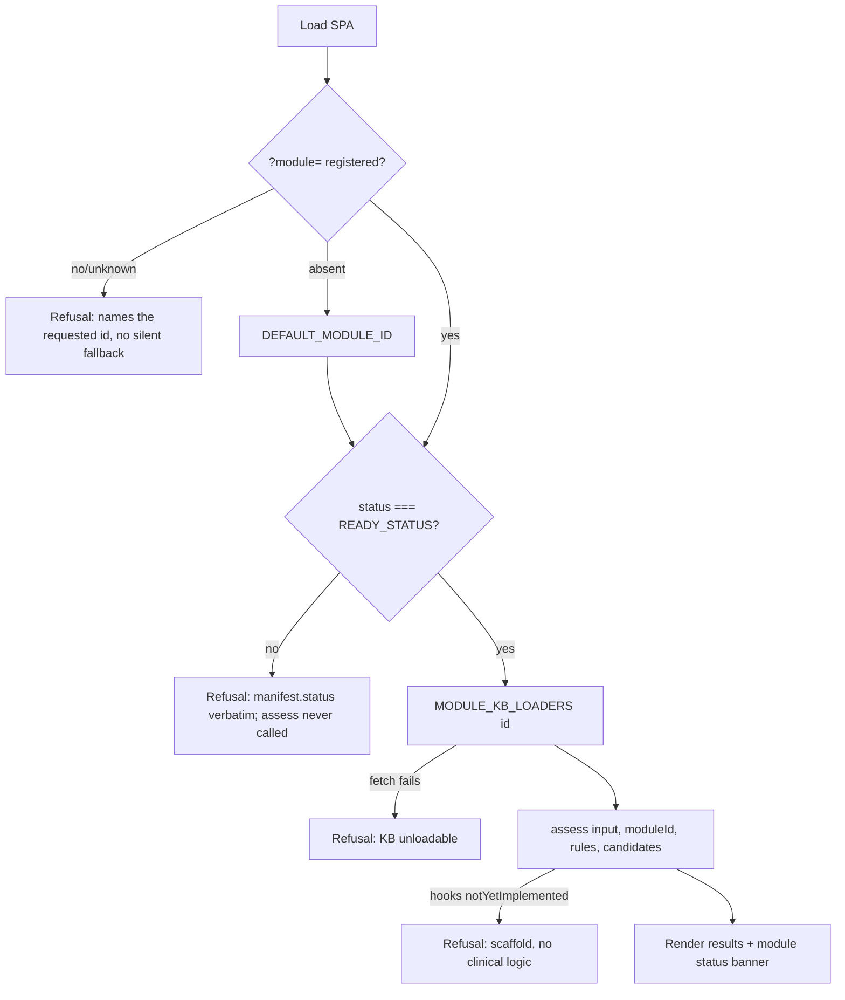

# Feature Brief & Metadata

**Feature Name:** SPA Module Switcher · **Filepath Name:** `spa-module-switcher-v1` ·
**Date:** 2026-07-22 (revised 2026-07-22 after the `karen` planning gate) ·
**Author:** `prd-writer` (Opus-scaffolded; D-1..D-6 pre-settled)

**Related Epic(s)/PRD ID(s):** E1 multi-bundle conversion (`docs/project_plans/PRDs/infrastructure/multi-bundle-conversion-e1.md`, FR-14 / R-8)

**Related Documents:** see frontmatter `related_documents`. The four SPIKE legs
(`spike-leg-sq{1,2,3,4}-*.md`) and `decisions-block.md` (**authoritative**; D-1..D-6 settled,
**D-6 governs §11a**) are the evidence base; mockups are **exploratory only, non-binding** (§14).

**Status honesty:** this is an unvalidated research prototype. Nothing in this PRD describes a
clinically validated, clinically reviewed, or released capability. No module in this repository has
clinical sign-off, and this feature creates none.

---

## 1. Executive Summary

The rule engine has been module-agnostic since P0 — `assess(input, moduleId, rules, candidates)`
(`src/engine.js:19`) over moduleId-keyed registries, with four registered module packages in
`modules/` — and the browser has never used any of it; `src/app.js` hardcodes `anemia` at every entry
point. This feature wires the SPA to that registry and, in doing so, makes the platform's **module
inventory and its non-parity** perceivable to a clinician for the first time.

State it plainly: **today exactly one module is selectable and three are inert.** `anemia` is
`integrity-recorded`; `cbc_suite_v1`, `growth_suite_v1` and `kidney_suite_v1` are `unsigned-stub`.
Two of the three have zero rules and every engine hook returns `notYetImplemented`; the third
delegates all four hooks to the anemia module and would render anemia's classification under a CBC
label with seven evidence IDs that resolve to nothing (SQ-3 F9). **That is the honest state of the
platform, not a shortfall of this feature.** The deliverable is the honest inventory — a switcher
that shows what exists, refuses what cannot run, and never lets a scaffold read as a working
assessment. The plumbing is what makes module #2 cheap when a module #2 actually earns selectability.

**Priority:** HIGH

**Key Outcomes:**
- A clinician can see all four registered modules, each labelled with its real `module.json.status`,
  grouped so that non-parity is structural rather than a footnote.
- Exactly one module can be run. The other three are visibly listed, inert, and explain *why* in the
  repository's own words — never "coming soon", never a maturity ladder.
- The dangerous current failure mode is closed: selecting a scaffold today would throw
  `UnitRejectionError` and render **"Check the entered units"** — an unimplemented module
  masquerading as a clinician data-entry error (`src/app.js:691-693`; SQ-3 F1/F2). A distinct
  refusal state replaces it.
- The browser tells the truth about what it has and has not verified: it has verified *nothing*.

**And this PRD tells the truth about its own verification.** The properties above are established by
source inspection plus human review, **not** by executed browser tests — this repository has no
browser automation. §11a states exactly where that line falls. For a feature whose value proposition
is honest self-description, over-claiming coverage would be the failure it exists to prevent.

---

## 2. Context & Background

### Current State

- Static SPA, no bundler, **no dependencies of any kind**. `index.html:583` → `src/app.js` (native
  ESM). `npm run build` (`scripts/build-static.mjs`) copies `modules/` wholesale into `dist/` and
  rewrites relative `import`/`fetch` specifiers with a content-hash `?v=` stamp.
- `src/app.js:555-556` fetches `./modules/anemia/{rules,candidates}.json` literally; `src/app.js:1`
  imports `assessPediatricAnemia`; `index.html` hardcodes anemia copy and the counts `91`/`26` (`:66`).
- The runtime is module-agnostic and browser-safe: `src/modules/registry.js` (`getModule`,
  `listModules`, `MODULE_IDS`, `DEFAULT_MODULE_ID`, `isRegisteredModule`, `loadModuleCode`) plus
  moduleId-keyed registries in `src/facts/`, `src/ranges/`, `src/units.js`, `src/evidence/`. All four
  modules' fact code is already in the browser import graph. **Loadability is not the blocker.**
- `docs/architecture.md:36-46` publishes the module inventory table and states verbatim that statuses
  "are **not** uniform — read each row rather than assuming parity across modules." Nothing in the
  browser surfaces that.

### Problem Space

The repository already carries the risk this feature addresses: `multi-bundle-conversion-e1.md:523`
(R-4) names it — a scaffold module "could be misread by a future contributor as 'kidney/growth
assessment works.'" Today that misreading is *invisible-by-omission*; the moment a switcher exists it
becomes *presentational* — four rows read as four peers. The feature must earn its own safety.

Three concrete gaps, all verified by execution (SQ-3):
1. **Misattributed refusal.** Growth/kidney fail at `src/units.js:167`, throw `UnitRejectionError`
   (`code: 'UNIT_REJECTED'`), which is in `src/app.js:20 INPUT_REJECTION_CODES` → the clinician is
   told their units are wrong. A live `docs/architecture.md:391` violation: a state *is* produced,
   but misattributed.
2. **Anemia-shaped render on non-anemia data.** `renderClassification` (`app.js:267-307`) guards on
   `=== null` while stub fields are `undefined` → renders `"undefined g/dL"`, `"undefined fL"`, and
   `humanize(undefined) → 'Indeterminate'`, reading as "anemia status was evaluated and is
   indeterminate". It was never evaluated (F6/F7).
3. **Silent citation loss.** All 7 `cbc_suite_v1` rule evidence IDs resolve to nothing against
   `src/evidence.js` (anemia's 6 only) — citations vanish from alerts, notes and candidates (F9),
   breaching the CLAUDE.md guardrail "every clinical statement ties to a source."

### Current Alternatives / Workarounds

None. There is no module-selection surface anywhere — not in the SPA, not in the HTTP API
(`server.mjs` still carries `// no moduleId request surface exists, AC-5`). The only way to observe a
non-anemia module today is to read `dist/build-info.json` or the repo. `public-moduleid-api-surface.md`
sketched a *server* `moduleId` parameter, mentions the SPA once as an undesigned downstream
consequence (`:72-73`), and carries a factually stale deferral re-confirmation (it asserts no second
module directory exists; commit `263120b` invalidated that). P0 reconciles it without promoting it.

### Architectural Context

The end-to-end flow is drawn once, in §5's mermaid diagram. The template's MeatyPrompts
layered-architecture checklist (routers/services/repositories/cursor pagination/OpenTelemetry)
**does not apply**: this is a browser-local static SPA with no bundler, no backend call and no
telemetry. §6.2 substitutes the constraints that do apply, and §11a states the verification ceiling
that follows from having no test dependencies at all.

---

## 3. Problem Statement

**User Story:**
> "As a clinician evaluating this prototype, when I open the SPA, I see a single anemia tool and no
> indication that three other modules ship in the same bundle — and if a switcher were added naively,
> I would see four apparently equivalent choices, two of which contain no clinical logic at all,
> instead of an honest inventory that tells me exactly which one can produce an assessment and why
> the others cannot."

**Technical Root Cause:** `src/app.js` hardcodes `anemia` at ~10 sites, and eligibility is not
represented in the client at all — browser-path enforcement of `READY_STATUS` (`src/kbVerify.js:43`)
is *nonexistent*, while `build-static.mjs:73-77` warns instead of exiting for non-default modules,
leaving the browser as the only remaining enforcement point. Files: `src/app.js`, `index.html`,
`src/modules/registry.js`, `src/kbVerify.js`, `src/units.js`, `src/evidence/registry.js`,
`scripts/check-app-imports.mjs`, `scripts/smoke-browser-unit-rejection.mjs`.

---

## 4. Goals & Success Metrics

**Goal 1 — Make the inventory and its non-parity perceivable.** All four registered modules listed
with their real status, grouped structurally, under a header echoing `docs/architecture.md:38-39`.

**Goal 2 — Make ineligibility structurally unreachable, not caught.** No code path reaches `assess()`
for a module whose `manifest.status !== READY_STATUS`; all four SQ-3 §4 refusal cases covered.

**Goal 3 — Never claim verification, review, or approval that does not exist.** No hash, no
"integrity verified", no approval badge, no green state anywhere in the UI; the honesty-boundary and
staleness-non-enforcement disclosures pinned by a doc-truth test.

**Goal 4 — Never over-claim what the gate proves.** §11a exists so that a green `npm run check` is
not read, later, as evidence of behavioral fail-closure it does not establish.

### Success Metrics

**Measurement-method honesty:** every `tests/*.test.mjs` row below is a **source-text assertion over
the app surface**, not an executed browser run — see §11a.

| Metric | Baseline | Target | Measurement Method |
|--------|----------|--------|-------------------|
| Registered modules named in the app-surface row renderer | 1 of 4 | 4 of 4 | `module-switcher-status-labels.test.mjs` (source assertion) |
| `assess()`/`assessModule()` call sites reachable without the eligibility guard | 1 (unguarded) | 0 | `module-switcher-eligibility.test.mjs` (source assertion) |
| SQ-3 §4 refusal cases with a distinct reason string + the FR-19 invariant sequence in source | 0 of 4 | 4 of 4 | Per-case source assertions + smoke-script extension |
| Banner/disclaimer strings pinned by a test | 0 (convention only) | all enum values + 2 disclosures | Doc-truth test over `src/moduleStatusVocabulary.js` (**executed** — non-DOM module) |
| UI source/`dist/` surfaces emitting hash/approval tokens or non-allow-listed manifest fields | 0 | 0 (regression-guarded) | Allow-list assertion (FR-31/32, AC-8) |
| Screenshots of every `visual_evidence_required` surface, reviewed by a named person | 0 | all | **Human step** — P6-011, not automation |
| `npm run check` | green | green | CI gate |

---

## 5. User Personas & Journeys

**Primary — Evaluating clinician (prototype reviewer).** Pediatrician / hematologist assessing
whether this prototype is honest about its limits, and needing to know what the tool can and cannot do
*before* trusting any output. A naive switcher would imply four working tools.

**Secondary — Contributor / governance reviewer.** Needs a client surface whose eligibility rule is
the same constant the build and server use, and needs the E1 FR-14/R-8 prohibition lifted with a
recorded authority. Two **separate** tripwire comments bear on this, and the plan must not merge them
(see §14 Prior Art): the one in `tests/module-registry.test.mjs:20-24` fired at commit `263120b` and
was never actioned; the one in `src/modules/registry.js:39-50` is what *this* feature fires.

### High-level Flow

---

## 6. Requirements

### 6.1 Functional Requirements

Priority column: **Must** = required for this feature to ship honestly; **Should** = required for
completeness but a documented degradation is acceptable if a phase is split.

#### A. Module inventory & selection

| ID | Requirement | Priority | Notes |
| :-: | ----------- | :------: | ----- |
| FR-1 | The SPA renders **all four** registered modules, sourced from `listModules()` / `MODULE_IDS` (`src/modules/registry.js`). No registered module is hidden. | Must | Hiding forfeits the feature's value and leaves `docs/architecture.md:38-39` invisible (SQ-1 option (a)). |
| FR-2 | Modules are rendered in **two labelled structural groups** — selectable, and not-selectable-with-reason — with the panel header rendered verbatim: `These modules are not peers. Read each row.` | Must | D-1/D-3. Grouping is what stops "disabled" reading as "temporarily unavailable" (SQ-1 §5). |
| FR-3 | Each row shows: `manifest.title`, `manifest.engineLabel` verbatim, the module's own rule/candidate counts, and its status chip. For scaffolds the row also shows the module's own `limitations()` notice text. | Must | All existing repo strings; **no new prose invented for any module's capability**. |
| FR-4 | The selectability predicate is `manifest.status === READY_STATUS`, where `READY_STATUS` is **imported from `src/kbVerify.js`** — never a hardcoded `'integrity-recorded'` literal in the UI. | Must | D-1. Same constant the build and server enforce (`src/kbVerify.js:43`). |
| FR-5 | Ineligible modules are inert: they cannot be activated, cannot initiate a KB load, and carry **no maturity-ladder vocabulary** ("preview", "beta", "coming soon", "temporarily unavailable"). | Must | `gates-registry.md:130-132` makes `unsigned-stub → release-ready` schema-impossible; "preview" implies a transition that cannot occur. |
| FR-6 | Eligibility is decided from the manifest **before** any `assess()` call. Eligibility must never be inferred by catching an engine throw. | Must | D-1/D-4. Catching produces a refusal, but a misattributed one (SQ-1 §3). |

#### B. Status banner & vocabulary

| ID | Requirement | Priority | Notes |
| :-: | ----------- | :------: | ----- |
| FR-7 | The primary status chip renders `manifest.status` **verbatim** from the closed enum (`schemas/module-manifest.schema.json:22`). | Must | No paraphrase, no synonym, no fifth token. |
| FR-8 | Each enum value maps to exactly one canonical sentence, exported from a **single constant module** (`src/moduleStatusVocabulary.js`). No per-DOM hardcoding. | Must | Strings in §6.1.B-1 below; pinned by `tests/module-switcher-status-labels.test.mjs`. |
| FR-9 | The universal second clause — *"`approvedBy` is empty: no credentialed clinician has reviewed or approved this module."* — renders for **every** module including `anemia`, and is **derived from `approvedBy.length === 0`**, not hardcoded. | Must | D-3; `approvedBy` is `maxItems: 0` (schema `:22-23` block). |
| FR-10 | The human-readable subtitle `unsigned proposal · not clinically reviewed` renders **only** where `status === 'unsigned-stub'`. | Should | D-3: accurate there, inaccurate elsewhere. Mockups apply it more broadly — non-binding. |
| FR-11 | There is **no green / success / approved visual state**. `integrity-recorded` uses the same severity treatment as the scaffolds; the word *only* in its sentence is load-bearing. **Verified on resolved colour *values*, not token names** — every custom property reachable from a module-row, status-chip or banner selector is resolved to its literal `#rrggbb`/`rgb()`/`hsl()` declaration and rejected if its hue falls in the green band at any meaningful saturation. A token merely *named* `--stub-warn` whose value is `#2e7d32` must fail. | Must | D-3 + the D-6 corollary: the previous name-only check was bypassable. |

**§6.1.B-1 — Exact status sentences** (copy verbatim into `src/moduleStatusVocabulary.js`):

- `integrity-recorded` — `Manifest status: integrity-recorded — content hashes recorded only. approvedBy is empty: no credentialed clinician has reviewed or approved this module. Unvalidated research prototype; not for clinical use.`
- `unsigned-stub` — `Manifest status: unsigned-stub — no content hash recorded; not servable. approvedBy is empty: no credentialed clinician has reviewed or approved this module. No assessment can be produced from this module.`
- `superseded` — `Manifest status: superseded — replaced by a later module release; retained for audit only. approvedBy is empty: no credentialed clinician has reviewed or approved this module. No assessment can be produced from this module.`
- `revoked` — `Manifest status: revoked — withdrawn; retained for audit only. approvedBy is empty: no credentialed clinician has reviewed or approved this module. No assessment can be produced from this module.`
- Panel header (all statuses) — `These modules are not peers. Read each row.`

> **Source-variance note (resolve as written, do not rediscover):** SQ-1 §4 says "content hashes
> **verified** only"; D-3 says "**recorded** only". D-3 is authoritative, and "recorded" is the only
> reading compatible with FR-31 and with the browser verifying nothing (FR-12). **Use "recorded".**

#### C. Manifest truth source & honesty boundary

| ID | Requirement | Priority | Notes |
| :-: | ----------- | :------: | ----- |
| FR-12 | Banner truth comes from a new `src/moduleManifests.js` holding four **literal** `import m from '../modules/<id>/module.json' with { type: 'json' }` statements exported as a frozen moduleId-keyed map. The browser performs **no** verification step — `verifyManifest()` is not called client-side. | Must | D-2 / SQ-2 §5. In `dist/`, `clinicalContentHash` can never match: `build-static.mjs:139-153` rewrites every `.js` to append `?v=` (verified `49a597cb…` dev vs `d154a20c…` dist). `dist/build-info.json` fails in dev and fails `check-app-imports.mjs:137-141`. |
| FR-13 | The honesty-boundary disclosure renders **in the panel, not in a tooltip**, verbatim: *"Status shown is read from this module's published manifest. The browser has not verified it — no content digest was recomputed, no schema was validated, and no check confirms the loaded rules are the rules that were signed."* | Must | D-2. Pinned by the same doc-truth test as FR-8. |

#### D. Fail-closed refusal (distinct third state)

| ID | Requirement | Priority | Notes |
| :-: | ----------- | :------: | ----- |
| FR-14 | Refusal is a **distinct third state** alongside success and input-rejection. It must not reuse `showInputRejection` (`src/app.js:686-699`) — that path prints "Check the entered units". | Must | D-4. Reusing it re-creates SQ-3 F2, the single worst current failure. |
| FR-15 | **Case 1 — evidence registry has no entry for the module** (`src/evidence/registry.js:52-62` throws): refuse with "No assessment produced — evidence not available for module *X*"; disable submit; keep the module selector usable. | Must | SQ-3 §4.1. |
| FR-16 | **Case 2 — module hooks report not-implemented**: detected **before** render, preferentially from the module descriptor at selection time; fallback detection on `summarize()` returning `notYetImplemented === true` / `status === 'not_yet_implemented'`. `renderClassification` must not run at all. | Must | SQ-3 §4.2; prevents F6/F7 (`"undefined g/dL"`, false `Indeterminate`). |
| FR-17 | **Case 3 — manifest status is not `READY_STATUS`**: refuse to load the module and state the actual status verbatim from the closed enum. Must **not** downgrade to a warning. | Must | SQ-3 §4.3. `build-static.mjs:73-77` warns instead of exiting for non-default modules, so the browser is the only enforcement point. |
| FR-18 | **Case 4 — module KB fetch fails / 404**: "Unable to load module *X*'s knowledge base." `rules` and `candidates` must be reset to `[]` / `{}` **before** the fetch, never left holding the previous module's data. | Must | SQ-3 §4.4. |
| FR-19 | Every refusal enforces the shared invariants: `currentAudit = null`; `#results` hidden; `#results-placeholder` shown; `refreshAuditView()` called; submit disabled; module selector still usable. It must **not** be possible to leave the prior module's result on screen, to download the audit JSON, or to fall back silently to `anemia`. | Must | D-4 / SQ-3 §4. |

#### E. URL state

| ID | Requirement | Priority | Notes |
| :-: | ----------- | :------: | ----- |
| FR-20 | `?module=<id>` is read on load and validated with `isRegisteredModule()` (`src/modules/registry.js:75`). Absent → `DEFAULT_MODULE_ID`. | Must | SQ-3 §5. A module id is not PHI and nothing on the page joins it to patient data. |
| FR-21 | A `?module=` value that is unregistered, or registered but ineligible, produces an **explicit refusal naming the requested id** — never a silent substitution of another module. | Must | D-4 "no silent fallback to `anemia`". |
| FR-22 | Selecting a module writes `?module=<id>` via `history.replaceState`, preserving the current `#tab` hash. | Must | |
| FR-23 | `switchTab`'s existing `history.replaceState(null,'',`#${tab}`)` (`src/app.js:457`) is rewritten to **preserve the query string**; today it silently drops `?module=`. | Must | R-7; concrete required edit named in SQ-3 §5. |
| FR-24 | No `localStorage`, `sessionStorage`, or cookie persistence of the selected module. | Must | D-5 non-goal; a stale persisted id silently switching modules on next visit is a fail-closed hazard. Nothing in the repo reads any of these today. |

#### F. Module-scoped surfaces

| ID | Requirement | Priority | Notes |
| :-: | ----------- | :------: | ----- |
| FR-25 | The `#algorithm` tab degrades explicitly for non-anemia modules (hidden or disabled with a "not available for this module" state). It is **not** generalized. | Must | `src/algorithmExplorer.js` is anemia-shaped (`anemiaWalkthrough`, `facts.cbc.hb`) and will throw on stub facts. R-8 non-goal. |
| FR-26 | The `#evidence` tab degrades explicitly for modules without a registered evidence loader (growth, kidney — `src/evidence/registry.js:39-50`). | Should | OQ-2: degrade in this version; per-module evidence view is a deferred item. |
| FR-27 | The `#rules` tab renders an explicit empty state when `rules.length === 0`. The panel is otherwise already module-generic. | Must | OQ-3 owns the exact copy. |
| FR-28 | The `examples` picker is emptied/disabled for non-anemia modules; it must never offer anemia cases under another module's label. | Must | `examples/` is anemia-only (`index.html:101-108`, `app.js:525`). |
| FR-29 | `#nav-rule-count` / `#nav-pattern-count` are module-derived, and the hardcoded `91`/`26` fallback in `index.html:66` is neutralized. | Must | Counts are already set dynamically at `app.js:563-564`; only the static fallback lies. |
| FR-30 | Module-identifying page copy is derived from `manifest.title` — `document.title`, the `<h1>`, brand and footer copy in `index.html` (`:6,11,19,24,76,416,435,577`). `document.title` must not carry anemia's `KNOWLEDGE_BASE_VERSION` for another module (F11). | Must | |

#### G. Safety & governance requirements (first-class, not an afterthought)

| ID | Requirement | Priority | Notes |
| :-: | ----------- | :------: | ----- |
| FR-31 | The UI must **not** surface any hash, `hashes.recomputed`, or the phrases "integrity verified" / "content unmodified". | Must | D-2. `scripts/sign-kb.mjs:58-73` hardcodes anemia's file list and `build-static.mjs:54-55` calls it per-module with no module id, so **every** module's `clinicalContentHash` is computed over anemia's files. Currently masked (non-anemia hashes are `null`, `kbVerify.js:240` short-circuits). Surfacing hash-derived status would render a false attestation. |
| FR-32 | The UI must not imply that any clinical approval, clinical review, validation, or release exists — for any module, including `anemia`. No approval badge, no checkmark affordance, no "verified"/"approved"/"released" wording. | Must | `docs/governance/gates-registry.md:130-132` (G4) blocks "any claim that a knowledge-base module is clinically released", and `approvedBy` is schema-forced `maxItems: 0`. |
| FR-33 | Status text is rendered verbatim from the closed enum only. Inventing a fifth token, or any word implying a pipeline stage toward release, is prohibited. | Must | `schemas/module-manifest.schema.json:22-23`: the enum is closed and `integrity-recorded` "is the only status the server/build/browser will serve". Schema `:5`: "Structural validity here never implies clinical validity, safety, or that a named human clinician reviewed anything." |
| FR-34 | Wherever `evidenceReviewedThrough` is displayed, the non-enforcement disclosure renders **adjacent to the date, not in a tooltip**, verbatim: *"Evidence-staleness expiry is not enforced — no governance window has been set. This date is declared by the module, not checked."* | Must | `docs/architecture.md:385-391`: `maxAgeDays` is `null`, every consumer "must disclose 'not enforced' loudly", and `null` must never read as "checked and passed". `src/evidenceStalenessPolicy.js:11-14` already returns the string. |
| FR-35 | This feature changes **no module's manifest status** and signs nothing. No `unsigned-stub` becomes anything else. | Must | D-5 non-goal; G4 entry criteria are untouched and unmet. |
| FR-36 | Module KB loading uses a **literal-specifier** `MODULE_KB_LOADERS` map (SQ-3 §6). Template-built specifiers (`` fetch(`./modules/${id}/rules.json`) ``) are prohibited. | Must | `check-app-imports.mjs:121-132` only prefix-checks template fetches, and `build-static.mjs:148`'s regex would not stamp them — serving unstamped, cacheable KB JSON. That is the stale-rules hazard `build-static.mjs:100-106` exists to prevent. |
| FR-37 | Ineligible rows are made inert by **two independent mechanisms**, and the accessible name carries the reason. (a) The row's interactive element is **programmatically disabled** (a real `disabled`/`aria-disabled` + non-focusable-activation state), not merely dimmed, so assistive technology reports it as unavailable. (b) The row's **accessible name includes its refusal reason text** — the state is never conveyed by colour, hatching or opacity alone. The `disabled` attribute is a **presentation** guarantee only and is explicitly **not** the security boundary: FR-6's predicate inside the handlers is (see AC-11). | Must | Previously stated only as an Accessibility NFR that no AC pointed at. D-6 §corollary: an attribute a devtools user can delete is not a gate. **`verified_by: P6-011` — item (9), the human keyboard/accessible-name pass; it is FR-37's ONLY verifier. No automated task verifies FR-37, and AC-11/P6-012 explicitly disclaim it (they cover FR-6, the security boundary).** |

The FR-36 reference pattern (four frozen thunks, 8 literal specifiers, verified against all three
build/gate regexes) is written out in the phase file: `spa-module-switcher-v1/phase-0-2-foundation.md`
→ P2-01.

### 6.2 Non-Functional Requirements

**Performance:** static JSON imports add four already-parsed manifests to the initial graph. No
runtime digesting, no `verifyManifest()` — the rejected in-browser-verification option cost 24 fetches
plus 6 WebCrypto digests per load (SQ-2 §1).

**Security / integrity:** import and fetch specifiers stay **literal** — for `?v=` stamping and for
the stated path-injection guard (`src/modules/registry.js:66-68`, `src/facts/registry.js:9-11`). New
app-surface files (`src/moduleManifests.js`, `src/moduleStatusVocabulary.js`) must be registered in
`APP_SURFACE_FILES` (`scripts/check-app-imports.mjs:48`) — pass (a) is explicitly non-transitive, so
an unregistered new file goes unchecked.

**Privacy:** no PHI leaves the browser; the SPA makes zero `/api/` calls. `?module=<id>` is the only
new URL state and is not patient data.

**Accessibility:** the status banner uses the existing `role="alert"` pattern (`.safety-banner`,
`index.html:41-43`); the module list is keyboard-navigable; focus is not trappable inside an inert
row. Programmatic disabling and reason-in-accessible-name are **normative** and carried as **FR-37**,
not NFR prose — they were previously stated only here, with no AC pointing at them.

**Reliability / fail-closed:** every failure path resolves to a refusal state with the FR-19
invariants; no partial render, no fallback module. **Verifiability:** see §11a — none of the above is
established by an executed browser test. **Observability:** none, and none added
(`design-specs/production-monitoring-telemetry.md` remains deferred).

---

## 7. Scope

### In Scope

- `src/moduleManifests.js`, `src/moduleStatusVocabulary.js`, `src/moduleKbLoaders.js`,
  `src/moduleEligibility.js` (new; all registered in `APP_SURFACE_FILES`); `MODULE_KB_LOADERS` + an
  `assessModule(moduleId, …)` seam alongside the retained `assessPediatricAnemia` export; the module
  selector UI + status banner in `index.html` / `styles.css` / `src/app.js`; the third fail-closed
  refusal state and the four SQ-3 §4 cases.
- `?module=` URL state and the `history.replaceState` query-preservation fix; per-module degradation
  of `#algorithm`, `#evidence`, `#rules` and the examples picker; nav counts; module-derived copy.
- Governance paperwork: ADR-0009 (`status: proposed`), the `public-moduleid-api-surface.md` deferral
  re-confirmation, **both** `DEFAULT_MODULE_ID`-adjacent tripwire comments actioned (§14 Prior Art),
  `docs/architecture.md` §2a/§6/§10 and CLAUDE.md updates, CHANGELOG, and ADR-0010 as a deferred spec.

### Out of Scope — explicit Non-Goals (decisions-block §7)

- **D-5 — No `server.mjs` / `openapi.yaml` change.** Verified: `src/app.js` makes zero `/api/` calls;
  the SPA is fully browser-local. `server.mjs`'s `// no moduleId request surface exists, AC-5`
  comment remains accurate and **stays**.
- **No `scripts/sign-kb.mjs` per-module fix** (R-5) — a prerequisite for any future integrity-hash
  UI, not for this switcher; FR-31 keeps the defect off screen. **No `algorithmExplorer`
  generalization** (R-8) — P5 degrades the tab. **No per-module `examples/` authoring**; **no rule
  authoring** for `growth_suite_v1` / `kidney_suite_v1`; **no status change to any module manifest**;
  **no `localStorage` persistence** (a stale persisted module id is a fail-closed hazard).
- **No new test dependency, test runner, or browser automation (D-6).** Adding jsdom or a headless
  browser as a side effect of a UI feature is out of scope; the zero-dependency posture is load-bearing
  and changing it is its own decision. The escalation path is ADR-0010 (`status: proposed`), authored
  as a P7 deferred-item spec, not implemented here. §11a states what that costs.

---

## 8. Dependencies & Assumptions

**External — none.** No new libraries; native ESM, no bundler. The repository declares **no
`dependencies` and no `devDependencies` at all**, and this feature does not change that (see §11a).

**Internal — all shipped.** `src/modules/registry.js` (`listModules`, `MODULE_IDS`,
`DEFAULT_MODULE_ID`, `isRegisteredModule`); `src/kbVerify.js:43` `READY_STATUS`;
`src/evidenceStalenessPolicy.js:11-14` (already returns the FR-34 string); `src/engine.js:19`
`assess(…)`. Plus ADR-0009 (P0), which must land before the UI ships (§9).

### Assumptions

- ADR-0009 shipping as `status: proposed` suffices to merge; G0 ratification follows later, matching
  ADR-0004/0005/0006 (SQ-4 §4). Recorded as OQ-4 and answered.
- E1's FR-14 / R-8 prohibition is **scope-bounded to E1** and conditioned on "ahead of any UI/API
  decision to support it". This PRD *is* that decision, and says so (SQ-1 correction 4).
- `renderCandidates`/`renderAlerts`/`renderQuestions`/`renderNotes`/`renderLimitations` are already
  module-agnostic; only `renderClassification` (`app.js:267-307`) is anemia-shaped (SQ-3 §2).

### Feature Flags — none. A flag would create a state in which the SPA runs a module without its
status banner.

---

## 9. Risks & Mitigations

R-1..R-8 with impact/likelihood and per-task mitigations: see the implementation plan's **Risk
Mitigation** table (the maintained copy, naming the task that discharges each). In brief — R-1 four
modules read as four peers (High); R-2 banner implies verification the browser never performed (High);
R-3 the smoke gate greps `src/app.js` source text, so a refactor silently disables it (High/High);
R-4 template-literal fetch specifiers defeat `?v=` stamping (High); R-5 `sign-kb.mjs`'s anemia
hardcode becomes a visible false attestation (Med); R-6 the tripwire flipped mechanically rather than
deliberately (Med); R-7 `switchTab`'s `replaceState` drops `?module=` (Med/High); R-8 scope creep into
`algorithmExplorer` generalization (Med). **R-9, added by the `karen` planning gate:** §11a's ceiling
is quietly forgotten and a green `npm run check` is later read as evidence of behavioral fail-closure
— mitigated by §11a, each AC's `verification_ceiling`, and P6-011 being human with a named reviewer.

**Governance ordering (binding):** ADR-0009 and the design-spec reconciliation must land **before**
the UI ships — they record the authority lifting E1's FR-14/R-8 prohibition. Shipping the UI first
inverts the governance order this repository exists to protect.

---

## 10. Target State (Post-Implementation)

**User Experience:** a persistent module surface listing four modules in two labelled groups under
*"These modules are not peers. Read each row."* One is selectable; three are inert and state, in the
repository's own words, that no assessment can be produced from them. The active module's banner
carries the verbatim enum status, the empty-`approvedBy` clause, the browser-verified-nothing
sentence, and — beside `evidenceReviewedThrough` — the non-enforcement disclosure. Selecting an
ineligible module (reachable only via a hand-edited `?module=`) yields a refusal, never a broken
render and never "Check the entered units".

**Technical Architecture:** manifests enter as static JSON imports; eligibility is a single
`READY_STATUS` comparison decided before `assess()` is reachable; KB loading goes through a
literal-specifier map; the engine is reached via a module-generic `assessModule` seam while
`assessPediatricAnemia` stays exported for the existing smoke gate. **Observable outcomes:** 4 of 4
modules visible (from 1); one eligible module reachable only through a guarded path; 4 of 4 refusal
cases correctly attributed (from 0); the repo's first harness pinning clinician-facing disclaimer
strings — plus one human review pass establishing what no automation here can. **Read §11a first.**

---

## 11a. What automation does not verify

**Read this before §11.** It is not a caveat; it is a scope boundary on every AC below.

**This repository has no browser automation and no test dependencies.** `package.json` declares no
`dependencies` and no `devDependencies` at all — zero third-party packages, by design (CLAUDE.md: no
third-party scripts/fonts/analytics). `scripts/smoke-browser-unit-rejection.mjs:4-15` states it in the
repo's own words: *"This repository deliberately has no browser automation dependency. The app entry
point is DOM-dependent, so Node cannot execute it as a browser would… It does not claim to paint or
inspect a real browser DOM."*

Per **D-6** that ceiling is **accepted, not worked around**: no jsdom, no headless browser, no test
runner added as a side effect of a UI feature. The escalation path — ADR-0010, *browser test
capability for the SPA*, `proposed` — is a P7 deferred-item spec decided on its own merits.

### The three verification tiers this feature actually has

| Tier | What it is | What it can establish | What it cannot |
| ---- | ---------- | --------------------- | -------------- |
| **Executed** | `node:test` over **non-DOM** modules only: `src/moduleStatusVocabulary.js`, `src/moduleEligibility.js`, `src/engine.js`, and the built non-DOM graph the smoke script already imports from `dist/src/` | Real behaviour of pure functions — that `isModuleSelectable('cbc_suite_v1')` returns `false`, that an unknown status yields the refusal sentinel, that `assessModule` produces the same output as `assessPediatricAnemia` for anemia | Anything involving `src/app.js`, `index.html`, the DOM, events, focus, paint, or CSS resolution |
| **Source-asserted** | `functionBody()` extraction + regex over `src/app.js`, `index.html`, `styles.css` and their `dist/` copies — the technique the existing smoke gate already uses | That a handler's source *contains* a guard, in the right order, referencing the right identifier; that a prohibited token or a non-allow-listed field emission is *absent from the source* | That the state machine **behaves** — that the guard is reached, that the branch is taken, that the DOM ends up in the asserted state, that the banner paints where the source says it does |
| **Human** | A person opens the page, drives it, captures the `visual_evidence_required` screenshots, and reviews them (**P6-011**) | Rendering, layout, focus order, screen-reader announcement, and that the honesty disclosures are actually *in the panel* rather than in a `title=` tooltip | Regression protection — nothing re-runs it in CI |

### Stated plainly, without softening

- **Behavioral fail-closure is not verified by an executed test.** No test in this feature clicks an
  ineligible module and observes that `assess()` did not run. What the gate proves is that
  `src/app.js`'s selection, KB-load and submit handler bodies each contain the FR-6 eligibility guard
  ahead of any loader or engine call, and that no unguarded call site exists in the source. A defect
  that leaves the guard textually present but runtime-unreachable would pass.
- **Banner rendering is not verified by an executed test.** The gate proves the vocabulary constants
  exist and are referenced by identifier from the renderer, and that no status text is inlined. It
  does not prove a banner appears, or that it appears in the panel rather than a tooltip. That is
  P6-011's human review, and it is the *only* thing that establishes it.
- **Refusal-state transitions are not verified by an executed test.** The gate proves
  `showModuleRefusal`'s body contains the six FR-19 invariant statements in the specified order and
  does not reference `showInputRejection` or `INPUT_REJECTION_CODES`. It does not prove the prior
  result is gone from the screen, or that the audit download is disabled in the same tick. P4-06's
  atomicity seam is likewise a source-order assertion, not an observed interleaving.
- **A green `npm run check` therefore does not mean the UI behaves correctly.** It means the source
  says the right things and the non-DOM units do the right things. The rest is closed by a human,
  once, at P6-011 — and not closed again on any later change unless a human repeats it.

**Why this section rather than a quieter footnote.** A PRD claiming executed behavioral coverage it
does not have would be committing, about itself, precisely the error the switcher exists to prevent in
the UI. Every `verified_by` reference in §11 must be read against this section.

---

## 11. Overall Acceptance Criteria (Definition of Done)

`verified_by` IDs refer to P6 tasks. **Every AC below is bounded by §11a** — where an AC says
"renders", read "the source of the renderer asserts", unless it says `executed` or names P6-011.
R-P1 is satisfied by enumerating `target_surfaces`; R-P4 by AC-9 (no `*.tsx` here, so R-P4's trigger
reads as "any UI-touching file" — `index.html`, `styles.css`, `src/app.js`).

**`visual_evidence_required` is a human step.** Every such block is captured **by a person** and
**reviewed by a person** under **P6-011** — no task automates capture, because nothing here can drive
a browser. It is satisfied only when P6-011 records the capture and the reviewer's name.

Each AC's `propagation_contract` and `resilience` clauses live in
`spa-module-switcher-v1/phase-6-7-gates-docs.md` § "Acceptance-criteria contracts (AC-1..AC-11)".
What stays here: the statement, its surfaces, its **verification ceiling**, and who signs off.

#### AC-1: All four registered modules are rendered, grouped by selectability
- target_surfaces: [index.html, src/app.js, src/moduleManifests.js, styles.css]
- verification_ceiling: >
    Source-asserted (§11a). Establishes that the row renderer's source is driven by MODULE_IDS (count
    derived, not hardcoded 4), that the header string is referenced by identifier, and that the two
    resilience branches exist. Does NOT establish that four rows paint, or that the grouping is
    visually legible — that is P6-011.
- visual_evidence_required: >
    **Human step (P6-011).** Module panel at ≥1440px **and** at 375px, showing both groups, all four
    rows, and no clipping of the rail at 375px.
- verified_by: [P6-001, P6-011]

#### AC-2: Selectability predicate is imported, never a literal, and gates before `assess()`
- target_surfaces: [src/app.js, src/moduleEligibility.js, src/kbVerify.js, tests/module-switcher-eligibility.test.mjs]
- verification_ceiling: >
    Mixed (§11a). The predicate's behaviour is **executed** — src/moduleEligibility.js is non-DOM, so
    a real node:test proves `isModuleSelectable` returns false for each unsigned-stub id and for
    absent/out-of-enum status. The claim that it is the *sole* gate is **source-asserted** only: see
    AC-11, which carries the handler-level half and its own ceiling.
- visual_evidence_required: false
- verified_by: [P6-002, P6-003, P6-012]

#### AC-3: Status vocabulary and disclosures live in one constant and are pinned by test
- target_surfaces: [src/moduleStatusVocabulary.js, src/app.js, index.html, tests/module-switcher-status-labels.test.mjs]
- verification_ceiling: >
    Mixed (§11a). The vocabulary map itself is **executed** (non-DOM module): enum coverage, byte-match
    against §6.1.B-1, the derived FR-9 clause, and the sentinel are all really run. That the strings
    are *referenced by identifier* and not inlined is **source-asserted**. That the honesty-boundary
    sentence and staleness disclosure end up **in the panel rather than a `title=` tooltip** is NOT
    established by any test — a tooltip implementation would pass a "string exists in source" check.
    P6-011 is the only thing that establishes placement.
- visual_evidence_required: >
    **Human step (P6-011).** Banner for `integrity-recorded` and for `unsigned-stub` at ≥1440px,
    showing no green/approved state (FR-11) and both disclosures in-panel, not on hover.
- verified_by: [P6-004, P6-011]

#### AC-4: Fail-closed refusal is a distinct third state covering all four SQ-3 §4 cases
- target_surfaces: [src/app.js, index.html, scripts/smoke-browser-unit-rejection.mjs]
- verification_ceiling: >
    **Source-asserted (§11a) — read this before treating AC-4 as covered.** functionBody() over
    src/app.js establishes that `showModuleRefusal` exists, is not `showInputRejection`, contains the
    six FR-19 invariant statements **in the specified order**, references neither
    INPUT_REJECTION_CODES nor the heading "Check the entered units", and that each of the four cases
    routes to it. It does NOT establish that the DOM reaches that state, that the prior result is gone
    from the screen, or that the audit download is disabled in the same tick. **Behavioral
    fail-closure is not proven by any executed test here**; P4-06's atomicity claim is likewise a
    source-order assertion, not an observed interleaving.
- visual_evidence_required: >
    **Human step (P6-011).** Refusal state at ≥1440px for the scaffold case: no results panel, audit
    download disabled, no "Check the entered units" heading, no `undefined` anywhere on screen.
- verified_by: [P6-005, P6-011]

#### AC-5: `?module=` URL state round-trips and survives tab switching
- target_surfaces: [src/app.js]
- verification_ceiling: >
    Source-asserted (§11a), with one genuinely strong part: the grep for the three storage APIs across
    app-surface files is a **complete** check of its own claim — absence in source is absence. The
    query-preservation claim is weaker: functionBody('switchTab') establishes that the bare
    `` replaceState(null,'',`#${tab}`) `` form is gone and that `location.search` is referenced. It
    does NOT establish that a real tab click preserves the query string. **Optional strengthening,
    not mandated:** if P3-06 factors the URL construction into a pure exported helper in a non-DOM
    module, that helper becomes executable and this AC gains a real behavioral test.
- visual_evidence_required: false
- verified_by: [P6-006]

#### AC-6: Module-scoped surfaces degrade explicitly; no anemia data under another label
- target_surfaces: [index.html, src/app.js, src/algorithmExplorer.js]
- verification_ceiling: >
    Mixed (§11a). The `index.html` scan for the literals `91`/`26` is a **complete** file check.
    Everything else is source-asserted: that a moduleId-conditioned branch exists for each of the four
    surfaces and that the empty-state strings are referenced by identifier. It does NOT establish what
    any tab renders under a scaffold module, nor that `src/algorithmExplorer.js` never executes — only
    that its invocation sits behind a branch. P6-011 walks the tabs by hand.
- visual_evidence_required: >
    **Human step (P6-011).** #algorithm, #evidence and #rules under a non-anemia module at ≥1440px.
- verified_by: [P6-007, P6-011]

#### AC-7: Page copy is module-derived
- target_surfaces: [index.html, src/app.js]
- verification_ceiling: >
    Source-asserted (§11a). Establishes that all eight index.html sites are populated from
    `manifest.title` in source and that no anemia literal remains at those sites. Does NOT establish
    what the rendered title, header or footer say under a non-anemia module. P6-011 reads them.
- visual_evidence_required: >
    **Human step (P6-011).** Header and footer under a non-anemia module at ≥1440px, plus the browser
    tab title.
- verified_by: [P6-007, P6-011]

#### AC-8: The renderer can emit only allow-listed manifest fields; no integrity, approval or release claim appears
- target_surfaces:
    - index.html
    - src/app.js
    - src/moduleStatusVocabulary.js
    - styles.css
    - dist/src/app.js
- verification_ceiling: >
    Source-asserted (§11a). Establishes that the renderer's SOURCE reads/emits only allow-listed
    fields in src/app.js and dist/src/app.js. Does NOT establish that the painted DOM contains no
    hash — an injection path outside the scanned functionBody(), or a file not in target_surfaces,
    would not be caught. The painted-output check is human: P6-011.
- visual_evidence_required: >
    **Human step (P6-011).** Screenshot of the anemia banner at ≥1440px showing the only
    `integrity-recorded` module carrying the same severity treatment as the scaffolds (FR-11), with
    no hash on screen.
- verified_by:
    - P6-008
    - P6-011

#### AC-9: Runtime smoke over every UI surface this feature touches (R-P4)
- target_surfaces:
    - index.html
    - styles.css
    - src/app.js
    - src/moduleManifests.js
    - src/moduleStatusVocabulary.js
    - src/algorithmExplorer.js
- verification_ceiling: >
    Mixed (§11a). The engine/predicate assertions are EXECUTED and prove real behaviour of non-DOM
    code. The app-surface assertions are SOURCE-ASSERTED and prove only what the source contains.
    Nothing here loads index.html, dispatches an event, switches a tab, or renders a refusal — the
    script says so itself at :4-15 and must keep saying so. The previously-claimed "smoke run
    exercises default load, module switch, refusal render and tab switch" was not writable as
    specified; it is removed, not softened.
- visual_evidence_required: >
    **Human step (P6-011).** Screenshots for default load and refusal state at ≥1440px. The smoke
    script does not and cannot capture them.
- verified_by:
    - P6-009-smoke
    - P6-011

#### AC-10: Full gate suite green, with per-file import verification for the new surfaces
- target_surfaces:
    - scripts/check-app-imports.mjs
    - scripts/build-static.mjs
    - tests/module-registry.test.mjs
- visual_evidence_required: false
- verified_by:
    - P6-010

#### AC-11: Forced activation is refused — the predicate gates inside the handlers, not via `disabled`
- target_surfaces:
    - src/app.js
    - src/moduleEligibility.js
    - tests/module-switcher-eligibility.test.mjs
- verification_ceiling: >
    **Source-asserted (§11a) — and this is AC-11's load-bearing limitation.** functionBody() over
    src/app.js establishes that each handler CONTAINS the guard ahead of any loader/engine reference
    and that no unguarded call site exists in source. It does NOT establish that a directly-invoked
    handler refuses at runtime: src/app.js is DOM-dependent and node cannot import or execute it.
    The runtime half is closed only by P6-011's human step — a person deletes the `disabled`
    attribute, activates the row, and records what happens. Record it that way; not as a passing test.
    The predicate itself IS executed (src/moduleEligibility.js is non-DOM): `isModuleSelectable`
    returns false for all three unsigned-stub ids and for an absent/out-of-enum status. FR-37's
    presentation half is out of this AC's scope and is verified ONLY by P6-011 item (9).
- visual_evidence_required: >
    **Human step (P6-011).** Screenshot of removing the `disabled` attribute from an ineligible row
    and activating it: the refusal state, not an assessment.
- verified_by:
    - P6-012
    - P6-011

### Documentation Acceptance

- [ ] ADR-0009 `docs/adr/0009-module-eligibility-policy-for-clinician-facing-surfaces.md`, `proposed`.
- [ ] ADR-0010 *browser test capability for the SPA*, `proposed` — the D-6 escalation path, authored
      as a deferred-item spec. It must record the ceiling §11a documents, and must **not** claim the
      capability exists.
- [ ] `public-moduleid-api-surface.md` — stale fact corrected, dated "Deferral re-confirmation (SQ-4,
      2026-07-22)" section added, `updated: 2026-07-22`, this PRD cross-referenced as answering its
      `:93` open question; `maturity` unchanged.
- [ ] `docs/architecture.md` §2a (client-facing selection control), §6 (browser surfaces
      `manifest.status`, verifies nothing), §10 (new fail-closed entry).
- [ ] `CLAUDE.md` orientation diagram generalized to `deriveFacts(input, moduleId)` /
      `modules/<moduleId>/rules.json`, cross-referencing §2a instead of restating anemia-only counts;
      `tests/claudemd-check-gate.test.mjs` green.
- [ ] CHANGELOG `[Unreleased]` entry (`changelog_required: true`); deferred-item specs authored (§12).

---

## 12. Deferred Items (feed DOC-006)

Six items with categories, promotion triggers and target spec paths: see the plan's **Deferred Items
Triage Table** (`DF-SMS-01`..`DF-SMS-06`) — `sign-kb.mjs` per-module content hashing; per-module
evidence view + growth/kidney loaders; `algorithmExplorer` generalization; the server `moduleId` API
param (SQ-4 re-confirmed the deferral for a *corrected* reason — the switcher never calls the HTTP
API); the `cbc_suite_v1` evidence-ID gap (SQ-3 F9 — a finding); and **DF-SMS-06, browser test
capability for the SPA** (D-6 → ADR-0010, `proposed`).

---

## 13. Assumptions & Open Questions

### Open Questions

All four **resolved**; the binding wording lives in the plan's "Decisions & OQ Resolutions".

| ID | Question | Resolution |
| :-: | -------- | ---------- |
| OQ-1 | Selector as persistent sidebar rail (mockup A) or interstitial card picker (mockup C)? | **A's persistent rail** — C's one-time gate leaves no in-session reminder of which module is active. Both mockups render CBC Suite as selectable: **superseded by D-1 / FR-4**, it must ship inert. **REVISED 2026-07-22 (decisions block §11, D-7 operator override): header dropdown, mockup B** — the collapsed control keeps the active module + status chip persistently visible, satisfying the same FR-30/AC-7 requirement; all structural-grouping and inertness constraints unchanged. |
| OQ-2 | Does `#evidence` degrade, or render the module's own `evidence.json`? | **Degrade** (FR-26). Every module has an `evidence.json`, but growth/kidney lack loaders (`src/evidence/registry.js:39-50`); a per-module view is a deferred item (§12). |
| OQ-3 | Exact `#rules` empty-state copy when `rules.length === 0`? | `This module contains no rules. No assessment can be produced from it.` — authored into `src/moduleStatusVocabulary.js`, pinned by the FR-8 test. It states the module *contains* no rules; never "not yet loaded" (implies a load failure) and never "not yet available" (implies a pipeline toward release). |
| OQ-4 | Does ADR-0009 need G0 ratification before merge? | `status: proposed` suffices, matching ADR-0004/0005/0006 (SQ-4 §4). No G0–G4 gate blocks the switcher: it flips no status, signs nothing, touches no reviewer roster. The standing G4 principle — no claim that a module is clinically released — is discharged by FR-32/FR-33. |

---

## 14. Appendices & References

### Related Documentation

- **ADRs**: ADR-0009 (P0, `proposed`); ADR-0010 *browser test capability for the SPA* (P7 deferred
  spec, `proposed`, per D-6). ADR-0001 is **not** tripped — its trigger is rule-schema authoring, not
  UI selection (SQ-4 §3). **Design spec**: `public-moduleid-api-surface.md` (server-side, deferred).
- **Governance**: `gates-registry.md:130-132` (G4); `schemas/module-manifest.schema.json:22-23`
  (closed enum, `approvedBy: maxItems: 0`); `docs/architecture.md:385-391` (staleness
  non-enforcement; refusal-to-start). **SPIKE**: `SPIKEs/spike-008-spa-module-switcher.md` (SQ-1..4).

### Prior Art — and two separate tripwires, not one

`docs/project_plans/SPIKEs/spike-002-multi-module-loader.md:121,184` — P0 deliberately shipped no
client-side switcher and flagged "client-side module selection … behind a real UI control" as an
explicit unclaimed marker. This feature claims it.

Two distinct comments in the repo mark two distinct triggers, and merging them is an error:

1. **`tests/module-registry.test.mjs:20-24`** — its own comment says the assertion "must be
   updated/deleted **the day a second module registers**", and still asserts "today there is exactly
   one registered module". **Four are registered.** That trigger fired at commit `263120b` and was
   never actioned; **the comment is stale as of today**, independently of this feature.
2. **`src/modules/registry.js:39-50`** — a *different* trigger: "the day a **client-selectable
   moduleId surface** actually ships (a UI control, an API parameter, a CDS Hooks card selector)".
   That is the one **this** feature fires.

P6-010 must action both, and say which is which.

### Design Mockups — exploratory only

`docs/dev/designs/mockups/spa-module-switcher/` holds three PNG variants (A sidebar rail, B header
dropdown, C interstitial card picker) from `gpt-5.6-terra`. **Non-normative, non-binding, not an
implementation contract** — layout and `:root` token exploration only, never behavior. Two divergences
must not be copied: A and C render **CBC Suite as selectable** (superseded by D-1 / FR-4 — it is
`unsigned-stub` and ships inert), and they over-apply the FR-10 `unsigned-stub`-only subtitle.

---

## Implementation

Phase structure, agent routing, estimation anchors and the dependency graph are owned by
`decisions-block.md` §1–§5 and expanded in
`docs/project_plans/implementation_plans/features/spa-module-switcher-v1.md` plus its phase files
`spa-module-switcher-v1/phase-{0-2,3-5,6-7}-*.md`. Orientation only (**41 pts**, Tier 3):

| Phase | Name | Pts |
|---|---|---|
| P0 | Governance & paperwork prerequisites (ADR-0009, design-spec reconciliation) — **must land first** | 3 |
| P1 | Manifest surface + status vocabulary (`src/moduleManifests.js`, `src/moduleStatusVocabulary.js`) | 3 |
| P2 | Generic KB loading + `assessModule` seam + eligibility predicate | 5 |
| P3 | Selector UI + status banner + `?module=` URL state | 8 |
| P4 | Fail-closed refusal state + capability gating | 5 |
| P5 | Module-scoped tab degradation, nav counts, module-derived copy | 5 |
| P6 | Gates & test harness (owns every `verified_by` ID above, **incl. the human step P6-011**) | 9 |
| P7 | Docs finalization (architecture, CLAUDE.md, CHANGELOG, DOC-006 deferred specs, ADR-0010) | 3 |

**Re-estimated 2026-07-22 after the `karen` planning gate**, 34 → 41 pts: P3 6→8 (FR-37's
programmatic-inertness work is real, not incidental), P5 4→5, P6 5→9 (two new tasks — the human
visual-evidence step P6-011 and the forced-activation assertion P6-012 — plus every behavioral AC
rewritten into what a source assertion can carry). The original 34 was a top-down anchor; 41 is the
arithmetic sum of the three revised phases with the five unchanged ones.

P3 and P4 share `src/app.js` and `index.html` → the plan declares **`integration_owner: phase-owner`**
on both, plus seam task P4-06 (banner swap and result clear are atomic, rule R-P3). `phase-owner` is
used because the decisions block's specialist agent names (`frontend-developer` and siblings) are
**not registered in this project** — see the plan's Phase Summary footnote ¹.

**Progress Tracking:** `.claude/progress/spa-module-switcher/` — **one file per phase**
(`context.md` plus `phase-0-progress.md` .. `phase-7-progress.md`, 8 phase files). There is no
`all-phases-progress.md`.
