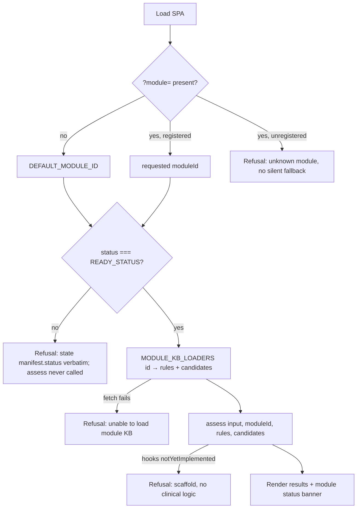

# Feature Brief & Metadata

**Feature Name:** SPA Module Switcher

**Filepath Name:** `spa-module-switcher-v1` (kebab-case)

**Date:** 2026-07-22

**Author:** `prd-writer` (Opus-scaffolded; decisions D-1..D-5 pre-settled)

**Related Epic(s)/PRD ID(s):** E1 multi-bundle conversion (`docs/project_plans/PRDs/infrastructure/multi-bundle-conversion-e1.md`, FR-14 / R-8)

**Related Documents:** see frontmatter `related_documents`. The four SPIKE legs
(`spike-leg-sq{1,2,3,4}-*.md`) and `decisions-block.md` (**authoritative**; D-1..D-5 settled) are the
evidence base; mockups under `docs/dev/designs/mockups/spa-module-switcher/` are **exploratory only,
non-binding** (see §14).

**Status honesty:** this is an unvalidated research prototype. Nothing in this PRD describes a
clinically validated, clinically reviewed, or released capability. No module in this repository has
clinical sign-off, and this feature creates none.

---

## 1. Executive Summary

The rule engine has been module-agnostic since P0 — `assess(input, moduleId, rules, candidates)`
(`src/engine.js:19`), moduleId-keyed registries for facts, ranges, units and evidence, and four
registered module packages in `modules/` — and the browser has never used any of it. `src/app.js`
hardcodes `anemia` at every entry point. This feature wires the SPA to the registry that already
exists and, in doing so, makes the platform's **module inventory and its non-parity** perceivable to
a clinician for the first time.

State it plainly: **today exactly one module is selectable and three are inert.** `anemia` is
`integrity-recorded`; `cbc_suite_v1`, `growth_suite_v1` and `kidney_suite_v1` are `unsigned-stub`.
Two of the three have zero rules and every engine hook returns `notYetImplemented`; the third
delegates all four hooks to the anemia module and would render anemia's classification under a CBC
label with seven evidence IDs that resolve to nothing (SQ-3 F9). **That is the honest state of the
platform, not a shortfall of this feature.** The deliverable is the honest inventory — a switcher
that shows what exists, refuses what cannot run, and never lets a scaffold read as a working
assessment. The plumbing is what makes module #2 cheap when a module #2 actually earns selectability.

**Priority:** HIGH

**Key Outcomes:**
- A clinician can see all four registered modules, each labelled with its real `module.json.status`,
  grouped so that non-parity is structural rather than a footnote.
- Exactly one module can be run. The other three are visibly listed, inert, and explain *why* in the
  repository's own words — never "coming soon", never a maturity ladder.
- The dangerous current failure mode is closed: selecting a scaffold today would throw
  `UnitRejectionError` and render **"Check the entered units"** — an unimplemented module
  masquerading as a clinician data-entry error (`src/app.js:691-693`; SQ-3 F1/F2). A distinct
  refusal state replaces it.
- The browser tells the truth about what it has and has not verified: it has verified *nothing*.

---

## 2. Context & Background

### Current State

- Static SPA, no bundler. `index.html:583` → `src/app.js` (native ESM). `npm run build`
  (`scripts/build-static.mjs`) copies `modules/` wholesale into `dist/` and rewrites relative
  `import`/`fetch` specifiers with a content-hash `?v=` stamp.
- `src/app.js:555-556` fetches `./modules/anemia/{rules,candidates}.json` literally; `src/app.js:1`
  imports `assessPediatricAnemia`; `index.html` hardcodes anemia copy and the counts `91`/`26` (`:66`).
- The runtime, by contrast, is module-agnostic and browser-safe: `src/modules/registry.js`
  (`getModule`, `listModules`, `MODULE_IDS`, `DEFAULT_MODULE_ID`, `isRegisteredModule`,
  `loadModuleCode` via a literal-specifier `import()` map) plus sibling moduleId-keyed registries in
  `src/facts/registry.js`, `src/ranges/registry.js`, `src/units.js`, `src/evidence/registry.js`. All
  four modules' fact code is already in the browser import graph. **Loadability is not the blocker.**
- `docs/architecture.md:36-46` publishes the module inventory table and states verbatim that statuses
  "are **not** uniform — read each row rather than assuming parity across modules." Nothing in the
  browser surfaces that.

### Problem Space

The repository already carries the risk this feature addresses: `multi-bundle-conversion-e1.md:523`
(R-4) names it — a scaffold module "could be misread by a future contributor as 'kidney/growth
assessment works.'" Today that misreading is *invisible-by-omission* (the SPA shows one module and
never mentions the others). The moment a switcher exists, the misreading becomes *presentational* —
four rows in a dropdown read as four peers. The feature therefore has to earn its own safety.

Three concrete gaps, all verified by execution (SQ-3):
1. **Misattributed refusal.** Growth/kidney fail at `src/units.js:167`, throw `UnitRejectionError`
   (`code: 'UNIT_REJECTED'`), which is in `src/app.js:20 INPUT_REJECTION_CODES` → the clinician is
   told their units are wrong. A live `docs/architecture.md:391` violation: a state *is* produced,
   but misattributed.
2. **Anemia-shaped render on non-anemia data.** `renderClassification` (`app.js:267-307`) guards on
   `=== null` while stub fields are `undefined` → renders `"undefined g/dL"`, `"undefined fL"`, and
   `humanize(undefined) → 'Indeterminate'`, reading as "anemia status was evaluated and is
   indeterminate". It was never evaluated (F6/F7).
3. **Silent citation loss.** All 7 `cbc_suite_v1` rule evidence IDs resolve to nothing against
   `src/evidence.js` (anemia's 6 only) — citations vanish from alerts, notes and candidates (F9),
   breaching the CLAUDE.md guardrail "every clinical statement ties to a source."

### Current Alternatives / Workarounds

None. There is no module-selection surface anywhere — not in the SPA, not in the HTTP API
(`server.mjs` still carries `// no moduleId request surface exists, AC-5`). The only way to observe a
non-anemia module today is to read `dist/build-info.json` or the repo. `public-moduleid-api-surface.md`
sketched a *server* `moduleId` parameter and mentions the SPA once, as a downstream consequence never
designed (`:72-73`); its 2026-07-21 deferral re-confirmation is factually stale (it asserts no second
module directory exists — commit `263120b` invalidated that). P0 reconciles it without promoting it.

### Architectural Context

```
?module=<id> / selector  →  src/moduleManifests.js (static JSON imports, no verification)
                         →  eligibility predicate (status === READY_STATUS, src/kbVerify.js:43)
        eligible ────────→  MODULE_KB_LOADERS[<id>]() → assess(input, moduleId, rules, candidates)
        ineligible ──────→  refusal state (third state; assess() never called)
```

The template's MeatyPrompts layered-architecture checklist (routers/services/repositories/cursor
pagination/OpenTelemetry) **does not apply** here: this is a browser-local static SPA with no
bundler, no backend call, and no telemetry. §6.2 substitutes the constraints that do apply.

---

## 3. Problem Statement

**User Story:**
> "As a clinician evaluating this prototype, when I open the SPA, I see a single anemia tool and no
> indication that three other modules ship in the same bundle — and if a switcher were added naively,
> I would see four apparently equivalent choices, two of which contain no clinical logic at all,
> instead of an honest inventory that tells me exactly which one can produce an assessment and why
> the others cannot."

**Technical Root Cause:**
- `src/app.js` hardcodes `anemia` at ~10 sites (fetch specifiers, engine import, classification
  render, nav counts, document title).
- Eligibility is not represented anywhere in the client; the only enforcement of
  `READY_STATUS = 'integrity-recorded'` (`src/kbVerify.js:43`) in the browser path is *nonexistent* —
  `build-static.mjs:76-79` warns instead of exiting for non-default modules, so the browser is the
  only remaining enforcement point.
- Files involved: `src/app.js`, `index.html`, `src/modules/registry.js`, `src/kbVerify.js`,
  `src/units.js`, `src/evidence/registry.js`, `scripts/check-app-imports.mjs`,
  `scripts/smoke-browser-unit-rejection.mjs`.

---

## 4. Goals & Success Metrics

**Goal 1 — Make the inventory and its non-parity perceivable.** All four registered modules listed
with their real status, grouped structurally, under a header echoing `docs/architecture.md:38-39`.
Success: a reader of the SPA can state, without opening the repo, which modules can produce an
assessment and which cannot.

**Goal 2 — Make ineligibility structurally unreachable, not caught.** No code path reaches `assess()`
for a module whose `manifest.status !== READY_STATUS`. Success: `tests/module-switcher-eligibility.test.mjs`
proves it; each of the four SQ-3 §4 refusal cases has a test.

**Goal 3 — Never claim verification, review, or approval that does not exist.** Success: no hash, no
"integrity verified", no approval badge, no green state anywhere in the UI; the honesty-boundary
sentence and the evidence-staleness non-enforcement disclosure are pinned by a doc-truth test.

### Success Metrics

| Metric | Baseline | Target | Measurement Method |
|--------|----------|--------|-------------------|
| Registered modules visible in the SPA | 1 of 4 | 4 of 4 | `tests/module-switcher-status-labels.test.mjs` + runtime smoke |
| Modules reachable by `assess()` from the UI | 1 (anemia, unguarded) | 1 (anemia, guarded by `READY_STATUS`) | `tests/module-switcher-eligibility.test.mjs` |
| SQ-3 §4 refusal cases with a distinct, correctly-attributed state | 0 of 4 | 4 of 4 | Per-case tests + `smoke-browser-unit-rejection.mjs` extension |
| Banner/disclaimer strings pinned by a test | 0 (convention only) | 100% of enum values + 2 disclosures | Doc-truth test over `src/moduleStatusVocabulary.js` |
| UI surfaces claiming hash/integrity/approval | 0 | 0 (regression-guarded) | Negative-assertion test (FR-31, FR-32) |
| `npm run check` | green | green | CI gate |

---

## 5. User Personas & Journeys

**Primary — Evaluating clinician (prototype reviewer).** Pediatrician / hematologist assessing
whether this prototype is honest about its limits. Needs to know what the tool can and cannot do
*before* trusting any output. Today the SPA presents one module with no context about the bundle it
ships in; a naive switcher would imply four working tools.

**Secondary — Contributor / governance reviewer.** Needs a client surface whose eligibility rule is
the same constant the build and server use. The `DEFAULT_MODULE_ID` tripwire
(`tests/module-registry.test.mjs:24`) has been waiting for exactly this event, and the E1 FR-14/R-8
prohibition needs a recorded lifting authority.

### High-level Flow



---

## 6. Requirements

### 6.1 Functional Requirements

Priority column: **Must** = required for this feature to ship honestly; **Should** = required for
completeness but a documented degradation is acceptable if a phase is split.

#### A. Module inventory & selection

| ID | Requirement | Priority | Notes |
| :-: | ----------- | :------: | ----- |
| FR-1 | The SPA renders **all four** registered modules, sourced from `listModules()` / `MODULE_IDS` (`src/modules/registry.js`). No registered module is hidden. | Must | Hiding forfeits the feature's value and leaves `docs/architecture.md:38-39` invisible (SQ-1 option (a)). |
| FR-2 | Modules are rendered in **two labelled structural groups** — selectable, and not-selectable-with-reason — with the panel header rendered verbatim: `These modules are not peers. Read each row.` | Must | D-1/D-3. Grouping is what stops "disabled" reading as "temporarily unavailable" (SQ-1 §5). |
| FR-3 | Each row shows: `manifest.title`, `manifest.engineLabel` verbatim, the module's own rule/candidate counts, and its status chip. For scaffolds the row also shows the module's own `limitations()` notice text. | Must | All existing repo strings; **no new prose invented for any module's capability**. |
| FR-4 | The selectability predicate is `manifest.status === READY_STATUS`, where `READY_STATUS` is **imported from `src/kbVerify.js`** — never a hardcoded `'integrity-recorded'` literal in the UI. | Must | D-1. Same constant the build and server enforce (`src/kbVerify.js:43`). |
| FR-5 | Ineligible modules are inert: they cannot be activated, cannot initiate a KB load, and carry **no maturity-ladder vocabulary** ("preview", "beta", "coming soon", "temporarily unavailable"). | Must | `gates-registry.md:130-132` makes `unsigned-stub → release-ready` schema-impossible; "preview" implies a transition that cannot occur. |
| FR-6 | Eligibility is decided from the manifest **before** any `assess()` call. Eligibility must never be inferred by catching an engine throw. | Must | D-1/D-4. Catching produces a refusal, but a misattributed one (SQ-1 §3). |

#### B. Status banner & vocabulary

| ID | Requirement | Priority | Notes |
| :-: | ----------- | :------: | ----- |
| FR-7 | The primary status chip renders `manifest.status` **verbatim** from the closed enum (`schemas/module-manifest.schema.json:22`). | Must | No paraphrase, no synonym, no fifth token. |
| FR-8 | Each enum value maps to exactly one canonical sentence, exported from a **single constant module** (`src/moduleStatusVocabulary.js`). No per-DOM hardcoding. | Must | Strings in §6.1.B-1 below; pinned by `tests/module-switcher-status-labels.test.mjs`. |
| FR-9 | The universal second clause — *"`approvedBy` is empty: no credentialed clinician has reviewed or approved this module."* — renders for **every** module including `anemia`, and is **derived from `approvedBy.length === 0`**, not hardcoded. | Must | D-3; `approvedBy` is `maxItems: 0` (schema `:22-23` block). |
| FR-10 | The human-readable subtitle `unsigned proposal · not clinically reviewed` renders **only** where `status === 'unsigned-stub'`. | Should | D-3: accurate there, inaccurate elsewhere. Mockups apply it more broadly — non-binding. |
| FR-11 | There is **no green / success / approved visual state**. `integrity-recorded` uses the same severity treatment as the scaffolds; the word *only* in its sentence is load-bearing. | Must | D-3. |

**§6.1.B-1 — Exact status sentences** (copy verbatim into `src/moduleStatusVocabulary.js`):

- `integrity-recorded` — `Manifest status: integrity-recorded — content hashes recorded only. approvedBy is empty: no credentialed clinician has reviewed or approved this module. Unvalidated research prototype; not for clinical use.`
- `unsigned-stub` — `Manifest status: unsigned-stub — no content hash recorded; not servable. approvedBy is empty: no credentialed clinician has reviewed or approved this module. No assessment can be produced from this module.`
- `superseded` — `Manifest status: superseded — replaced by a later module release; retained for audit only. approvedBy is empty: no credentialed clinician has reviewed or approved this module. No assessment can be produced from this module.`
- `revoked` — `Manifest status: revoked — withdrawn; retained for audit only. approvedBy is empty: no credentialed clinician has reviewed or approved this module. No assessment can be produced from this module.`
- Panel header (all statuses) — `These modules are not peers. Read each row.`

> **Source-variance note (must be resolved as written, not rediscovered):** SQ-1 §4 renders the
> first string as "content hashes **verified** only". `decisions-block.md` D-3 renders it as
> "content hashes **recorded** only". D-3 is authoritative, and "recorded" is also the only reading
> compatible with FR-31 (no "integrity verified" language) and with the fact that the browser
> verifies nothing (FR-12). **Use "recorded".**

#### C. Manifest truth source & honesty boundary

| ID | Requirement | Priority | Notes |
| :-: | ----------- | :------: | ----- |
| FR-12 | Banner truth comes from a new `src/moduleManifests.js` holding four **literal** `import m from '../modules/<id>/module.json' with { type: 'json' }` statements exported as a frozen moduleId-keyed map. The browser performs **no** verification step — `verifyManifest()` is not called client-side. | Must | D-2 / SQ-2 §5. In `dist/`, `clinicalContentHash` can never match: `build-static.mjs:139-153` rewrites every `.js` to append `?v=` (verified `49a597cb…` dev vs `d154a20c…` dist). `dist/build-info.json` fails in dev and fails `check-app-imports.mjs:137-141`. |
| FR-13 | The honesty-boundary disclosure renders **in the panel, not in a tooltip**, verbatim: *"Status shown is read from this module's published manifest. The browser has not verified it — no content digest was recomputed, no schema was validated, and no check confirms the loaded rules are the rules that were signed."* | Must | D-2. Pinned by the same doc-truth test as FR-8. |

#### D. Fail-closed refusal (distinct third state)

| ID | Requirement | Priority | Notes |
| :-: | ----------- | :------: | ----- |
| FR-14 | Refusal is a **distinct third state** alongside success and input-rejection. It must not reuse `showInputRejection` (`src/app.js:686-699`) — that path prints "Check the entered units". | Must | D-4. Reusing it re-creates SQ-3 F2, the single worst current failure. |
| FR-15 | **Case 1 — evidence registry has no entry for the module** (`src/evidence/registry.js:52-62` throws): refuse with "No assessment produced — evidence not available for module *X*"; disable submit; keep the module selector usable. | Must | SQ-3 §4.1. |
| FR-16 | **Case 2 — module hooks report not-implemented**: detected **before** render, preferentially from the module descriptor at selection time; fallback detection on `summarize()` returning `notYetImplemented === true` / `status === 'not_yet_implemented'`. `renderClassification` must not run at all. | Must | SQ-3 §4.2; prevents F6/F7 (`"undefined g/dL"`, false `Indeterminate`). |
| FR-17 | **Case 3 — manifest status is not `READY_STATUS`**: refuse to load the module and state the actual status verbatim from the closed enum. Must **not** downgrade to a warning. | Must | SQ-3 §4.3. `build-static.mjs:76-79` warns instead of exiting for non-default modules, so the browser is the only enforcement point. |
| FR-18 | **Case 4 — module KB fetch fails / 404**: "Unable to load module *X*'s knowledge base." `rules` and `candidates` must be reset to `[]` / `{}` **before** the fetch, never left holding the previous module's data. | Must | SQ-3 §4.4. |
| FR-19 | Every refusal enforces the shared invariants: `currentAudit = null`; `#results` hidden; `#results-placeholder` shown; `refreshAuditView()` called; submit disabled; module selector still usable. It must **not** be possible to leave the prior module's result on screen, to download the audit JSON, or to fall back silently to `anemia`. | Must | D-4 / SQ-3 §4. |

#### E. URL state

| ID | Requirement | Priority | Notes |
| :-: | ----------- | :------: | ----- |
| FR-20 | `?module=<id>` is read on load and validated with `isRegisteredModule()` (`src/modules/registry.js:74`). Absent → `DEFAULT_MODULE_ID`. | Must | SQ-3 §5. A module id is not PHI and nothing on the page joins it to patient data. |
| FR-21 | A `?module=` value that is unregistered, or registered but ineligible, produces an **explicit refusal naming the requested id** — never a silent substitution of another module. | Must | D-4 "no silent fallback to `anemia`". |
| FR-22 | Selecting a module writes `?module=<id>` via `history.replaceState`, preserving the current `#tab` hash. | Must | |
| FR-23 | `switchTab`'s existing `history.replaceState(null,'',`#${tab}`)` (`src/app.js:457`) is rewritten to **preserve the query string**; today it silently drops `?module=`. | Must | R-7; concrete required edit named in SQ-3 §5. |
| FR-24 | No `localStorage`, `sessionStorage`, or cookie persistence of the selected module. | Must | D-5 non-goal; a stale persisted id silently switching modules on next visit is a fail-closed hazard. Nothing in the repo reads any of these today. |

#### F. Module-scoped surfaces

| ID | Requirement | Priority | Notes |
| :-: | ----------- | :------: | ----- |
| FR-25 | The `#algorithm` tab degrades explicitly for non-anemia modules (hidden or disabled with a "not available for this module" state). It is **not** generalized. | Must | `src/algorithmExplorer.js` is anemia-shaped (`anemiaWalkthrough`, `facts.cbc.hb`) and will throw on stub facts. R-8 non-goal. |
| FR-26 | The `#evidence` tab degrades explicitly for modules without a registered evidence loader (growth, kidney — `src/evidence/registry.js:39-50`). | Should | OQ-2: degrade in this version; per-module evidence view is a deferred item. |
| FR-27 | The `#rules` tab renders an explicit empty state when `rules.length === 0`. The panel is otherwise already module-generic. | Must | OQ-3 owns the exact copy. |
| FR-28 | The `examples` picker is emptied/disabled for non-anemia modules; it must never offer anemia cases under another module's label. | Must | `examples/` is anemia-only (`index.html:101-108`, `app.js:525`). |
| FR-29 | `#nav-rule-count` / `#nav-pattern-count` are module-derived, and the hardcoded `91`/`26` fallback in `index.html:66` is neutralized. | Must | Counts are already set dynamically at `app.js:563-564`; only the static fallback lies. |
| FR-30 | Module-identifying page copy is derived from `manifest.title` — `document.title`, the `<h1>`, brand and footer copy in `index.html` (`:6,11,19,24,76,416,435,577`). `document.title` must not carry anemia's `KNOWLEDGE_BASE_VERSION` for another module (F11). | Must | |

#### G. Safety & governance requirements (first-class, not an afterthought)

| ID | Requirement | Priority | Notes |
| :-: | ----------- | :------: | ----- |
| FR-31 | The UI must **not** surface any hash, `hashes.recomputed`, or the phrases "integrity verified" / "content unmodified". | Must | D-2. `scripts/sign-kb.mjs:58-73` hardcodes anemia's file list and `build-static.mjs:54-55` calls it per-module with no module id, so **every** module's `clinicalContentHash` is computed over anemia's files. Currently masked (non-anemia hashes are `null`, `kbVerify.js:240` short-circuits). Surfacing hash-derived status would render a false attestation. |
| FR-32 | The UI must not imply that any clinical approval, clinical review, validation, or release exists — for any module, including `anemia`. No approval badge, no checkmark affordance, no "verified"/"approved"/"released" wording. | Must | `docs/governance/gates-registry.md:130-132` (G4) blocks "any claim that a knowledge-base module is clinically released", and `approvedBy` is schema-forced `maxItems: 0`. |
| FR-33 | Status text is rendered verbatim from the closed enum only. Inventing a fifth token, or any word implying a pipeline stage toward release, is prohibited. | Must | `schemas/module-manifest.schema.json:22-23`: the enum is closed and `integrity-recorded` "is the only status the server/build/browser will serve". Schema `:5`: "Structural validity here never implies clinical validity, safety, or that a named human clinician reviewed anything." |
| FR-34 | Wherever `evidenceReviewedThrough` is displayed, the non-enforcement disclosure renders **adjacent to the date, not in a tooltip**, verbatim: *"Evidence-staleness expiry is not enforced — no governance window has been set. This date is declared by the module, not checked."* | Must | `docs/architecture.md:385-391`: `maxAgeDays` is `null`, every consumer "must disclose 'not enforced' loudly", and `null` must never read as "checked and passed". `src/evidenceStalenessPolicy.js:11-14` already returns the string. |
| FR-35 | This feature changes **no module's manifest status** and signs nothing. No `unsigned-stub` becomes anything else. | Must | D-5 non-goal; G4 entry criteria are untouched and unmet. |
| FR-36 | Module KB loading uses a **literal-specifier** `MODULE_KB_LOADERS` map (SQ-3 §6). Template-built specifiers (`` fetch(`./modules/${id}/rules.json`) ``) are prohibited. | Must | `check-app-imports.mjs:121-132` only prefix-checks template fetches, and `build-static.mjs:148`'s regex would not stamp them — serving unstamped, cacheable KB JSON. That is the stale-rules hazard `build-static.mjs:100-106` exists to prevent. |

```js
// FR-36 reference pattern (SQ-3 §6; verified against all three build/gate regexes)
const MODULE_KB_LOADERS = Object.freeze({
  anemia: () => Promise.all([fetch('./modules/anemia/rules.json'), fetch('./modules/anemia/candidates.json')]),
  cbc_suite_v1: () => Promise.all([fetch('./modules/cbc_suite_v1/rules.json'), fetch('./modules/cbc_suite_v1/candidates.json')]),
  growth_suite_v1: () => Promise.all([fetch('./modules/growth_suite_v1/rules.json'), fetch('./modules/growth_suite_v1/candidates.json')]),
  kidney_suite_v1: () => Promise.all([fetch('./modules/kidney_suite_v1/rules.json'), fetch('./modules/kidney_suite_v1/candidates.json')]),
});
```

### 6.2 Non-Functional Requirements

**Performance:** static JSON imports add four already-parsed manifests to the initial graph (anemia's
is already there). No runtime digesting, no `verifyManifest()` — the rejected in-browser-verification
option cost 24 fetches plus 6 WebCrypto digests per load (SQ-2 §1).

**Security / integrity:** import and fetch specifiers stay **literal** — both for `?v=` stamping and
for the stated path-injection guard (`src/modules/registry.js:66-68`, `src/facts/registry.js:9-11`).
New app-surface files (`src/moduleManifests.js`, `src/moduleStatusVocabulary.js`) must be registered
in `APP_SURFACE_FILES` (`scripts/check-app-imports.mjs:48`) — pass (a) is explicitly
non-transitive, so an unregistered new file goes unchecked.

**Privacy:** no PHI leaves the browser; the SPA makes zero `/api/` calls. `?module=<id>` is the only
new URL state and is not patient data.

**Accessibility:** the status banner uses the existing `role="alert"` pattern (`.safety-banner`,
`index.html:41-43`); the module list is keyboard-navigable; ineligible rows are programmatically
disabled (not merely dimmed) so assistive technology reports them as unavailable, and their reason
is in the accessible name, not colour or hatching alone.

**Reliability / fail-closed:** every failure path resolves to a refusal state with the FR-19
invariants. There is no partial render and no fallback module.

**Observability:** none. This SPA has no telemetry, no logging backend, and none is added
(`docs/project_plans/design-specs/production-monitoring-telemetry.md` remains deferred).

---

## 7. Scope

### In Scope

- `src/moduleManifests.js`, `src/moduleStatusVocabulary.js` (new; both registered in `APP_SURFACE_FILES`).
- `MODULE_KB_LOADERS` + an `assessModule(moduleId, …)` seam alongside the retained
  `assessPediatricAnemia` export.
- Module selector UI + status banner in `index.html` / `styles.css` / `src/app.js`.
- Third fail-closed refusal state and the four SQ-3 §4 cases.
- `?module=` URL state and the `history.replaceState` query-preservation fix.
- Per-module degradation of `#algorithm`, `#evidence`, `#rules`, and the examples picker; nav counts;
  module-derived page copy.
- Governance paperwork: ADR-0009 (`status: proposed`), the `public-moduleid-api-surface.md` deferral
  re-confirmation, the deliberate `DEFAULT_MODULE_ID` tripwire decision, `docs/architecture.md`
  §2a/§6/§10 and CLAUDE.md updates, CHANGELOG.

### Out of Scope — explicit Non-Goals (decisions-block §7)

- **D-5 — No `server.mjs` / `openapi.yaml` change.** Verified: `src/app.js` makes zero `/api/` calls;
  the SPA is fully browser-local. `server.mjs`'s `// no moduleId request surface exists, AC-5`
  comment remains accurate and **stays**.
- **No `scripts/sign-kb.mjs` per-module fix** (R-5). It is a prerequisite for any future
  integrity-hash UI, not for this switcher; FR-31 keeps the defect off the screen.
- **No `src/algorithmExplorer.js` generalization** (R-8). P5 degrades the tab; it does not generalize it.
- **No per-module `examples/` authoring.**
- **No rule authoring for `growth_suite_v1` / `kidney_suite_v1`.**
- **No status change to any module manifest.** Nothing here flips `unsigned-stub` → anything.
- **No `localStorage` persistence.** A stale persisted module id is a fail-closed hazard.

---

## 8. Dependencies & Assumptions

### External Dependencies — none. No new libraries; native ESM, no bundler.

### Internal Dependencies

- `src/modules/registry.js` — `listModules`, `MODULE_IDS`, `DEFAULT_MODULE_ID`, `isRegisteredModule`. Shipped.
- `src/kbVerify.js:43` `READY_STATUS`. Shipped.
- `src/evidenceStalenessPolicy.js:11-14` — already returns the FR-34 disclosure string. Shipped.
- `src/engine.js:19` `assess(input, moduleId, rules, candidates)` — already generic. Shipped.
- ADR-0009 (P0 of the implementation plan) — must land before the UI ships (see §9 governance ordering).

### Assumptions

- ADR-0009 shipping as `status: proposed` is sufficient to merge; G0 ratification follows later,
  matching ADR-0004/0005/0006 (SQ-4 §4). Recorded as OQ-4 and answered.
- E1's FR-14 / R-8 prohibition on a client-selectable `moduleId` surface is **scope-bounded to E1**
  and conditioned on "ahead of any UI/API decision to support it". This PRD *is* that decision, and
  says so explicitly (SQ-1 correction 4).
- Rule and candidate rendering (`renderCandidates`, `renderAlerts`, `renderQuestions`,
  `renderNotes`, `renderLimitations`) is already module-agnostic and needs no change; only
  `renderClassification` (`app.js:267-307`) is anemia-shaped (SQ-3 §2).

### Feature Flags — none. A flag would create a state in which the SPA runs a module without its
status banner.

---

## 9. Risks & Mitigations

| ID | Risk | Impact | Likelihood | Mitigation |
| :-: | ---- | :----: | :--------: | ---------- |
| R-1 | Switcher presents 4 modules as peers → E1 R-4 realized (`multi-bundle-conversion-e1.md:523`) | High | Med | D-1 grouping is structural, not a footnote; doc-truth test pins the group headers (FR-2) |
| R-2 | Banner implies verification the browser never performed | High | Med | D-2 honesty-boundary sentence is a pinned constant (FR-13); hash surfacing prohibited (FR-31) |
| R-3 | `scripts/smoke-browser-unit-rejection.mjs` greps `app.js` source text (`:132,134,179,188,216-223`) — a refactor silently breaks the gate | High | High | Extend, don't rewrite: retain the `assessPediatricAnemia` export and its call shape; add sibling assertions for `assessModule` and the refusal state |
| R-4 | Template-literal fetch specifiers defeat `?v=` stamping → stale KB served (`build-static.mjs:100-106`) | High | Med | Literal-map pattern (FR-36), verified against all three regexes |
| R-5 | `sign-kb.mjs` anemia hardcode becomes a user-visible false attestation | Med | Low | Out of scope + hash-surfacing prohibition (FR-31); recorded as a finding and a deferred item |
| R-6 | Flipping the `DEFAULT_MODULE_ID` tripwire (`tests/module-registry.test.mjs:24`) mechanically instead of deliberately | Med | Med | The task must cite E1 FR-14/R-8 and ADR-0009 in both the commit message and the test comment |
| R-7 | `history.replaceState` in `switchTab` (`app.js:457`) drops `?module=` | Med | High | Explicit requirement FR-23 with its own AC |
| R-8 | Scope creep into `src/algorithmExplorer.js` generalization | Med | Med | Explicit non-goal (§7); FR-25 degrades the tab, does not generalize it |

**Governance ordering (binding):** the ADR-0009 / design-spec-reconciliation work must land **before**
the UI ships. It records the authority under which the E1 FR-14/R-8 prohibition is lifted. Shipping
the UI first inverts the governance order this repository exists to protect.

---

## 10. Target State (Post-Implementation)

**User Experience:** the clinician sees a persistent module surface listing four modules in two
labelled groups under the header *"These modules are not peers. Read each row."* One is selectable;
three are inert and state, in the repository's own words, that no assessment can be produced from
them. The active module's status banner carries the verbatim enum status, the empty-`approvedBy`
clause, the browser-verified-nothing sentence, and — beside `evidenceReviewedThrough` — the
non-enforcement disclosure. Selecting an ineligible module (only reachable via a hand-edited
`?module=`) yields a refusal, never a broken render and never "Check the entered units".

**Technical Architecture:** manifests enter as static JSON imports; eligibility is a single
`READY_STATUS` comparison in the UI layer; KB loading goes through a literal-specifier map; the
engine is called through a module-generic `assessModule` seam while `assessPediatricAnemia` remains
exported for the existing smoke gate. **Observable outcomes:** 4 of 4 modules visible (from 1); the
one eligible module reachable only through a guarded path; 4 of 4 refusal cases correctly attributed
(from 0); the repo's first test harness pinning clinician-facing disclaimer strings.

---

## 11. Overall Acceptance Criteria (Definition of Done)

`verified_by` IDs refer to tasks in the verification phase (P6 — gates & test harness) of the
implementation plan. R-P1 is satisfied by enumerating `target_surfaces` for every AC that would
otherwise say "across"/"all"/"everywhere". R-P4 is satisfied by AC-9 (runtime smoke); this repo has
no `*.tsx`, so R-P4's trigger is read as "any UI-touching file" — `index.html`, `styles.css`,
`src/app.js`.

#### AC-1: All four registered modules render, grouped by selectability
- target_surfaces:
    - index.html
    - src/app.js
    - src/moduleManifests.js
    - styles.css
- propagation_contract: >
    `listModules()`/`MODULE_IDS` (src/modules/registry.js) supplies the row set; each row's
    display fields come from the frozen map in src/moduleManifests.js; group membership is computed
    once by the FR-4 predicate and passed to the row renderer in src/app.js; index.html supplies the
    static container and the verbatim panel header; styles.css supplies the group and inert-row
    treatment using existing `:root` tokens only.
- resilience: >
    If a module.json is missing an optional envelope field, the row renders the required fields and
    omits the optional line — it never renders an empty label, `undefined`, or a placeholder that
    could read as a value. A module present in MODULE_IDS but absent from the manifest map is
    rendered in the not-selectable group with the FR-17 refusal reason, never dropped.
- visual_evidence_required: >
    Screenshot of the module panel at desktop ≥1440px and at 375px width, showing both groups and
    all four rows.
- verified_by:
    - P6-001
    - P6-009-smoke

#### AC-2: Selectability predicate is imported, never a literal, and gates before `assess()`
- target_surfaces:
    - src/app.js
    - src/kbVerify.js
    - tests/module-switcher-eligibility.test.mjs
- propagation_contract: >
    `READY_STATUS` is imported from src/kbVerify.js into src/app.js and compared against
    `moduleManifests[id].status`. The comparison result is the sole gate on (a) whether a row is
    activatable and (b) whether MODULE_KB_LOADERS and assess() are ever invoked.
- resilience: >
    A manifest whose `status` is absent or not in the closed enum is treated as ineligible and
    routed to the FR-17 refusal — never defaulted to eligible.
- visual_evidence_required: false
- verified_by:
    - P6-002
    - P6-003

#### AC-3: Status vocabulary and disclosures live in one constant and are pinned by test
- target_surfaces:
    - src/moduleStatusVocabulary.js
    - src/app.js
    - tests/module-switcher-status-labels.test.mjs
- propagation_contract: >
    Every clinician-facing status string, the panel header, the honesty-boundary sentence (FR-13)
    and the evidence-staleness disclosure (FR-34) are exported from src/moduleStatusVocabulary.js
    and referenced by identifier in src/app.js. No status text is written inline in index.html or
    src/app.js.
- resilience: >
    A status value with no vocabulary entry renders the not-selectable refusal plus the raw enum
    value, and the test fails the build — a missing entry must never fall back to friendlier text.
- visual_evidence_required: >
    Screenshot of the banner for `integrity-recorded` and for `unsigned-stub` at desktop ≥1440px,
    demonstrating no green/approved state (FR-11).
- verified_by:
    - P6-004
    - P6-009-smoke

#### AC-4: Fail-closed refusal is a distinct third state covering all four SQ-3 §4 cases
- target_surfaces:
    - src/app.js
    - index.html
    - scripts/smoke-browser-unit-rejection.mjs
- propagation_contract: >
    A `showModuleRefusal(moduleId, reason)` path independent of `showInputRejection` sets
    currentAudit = null, hides #results, shows #results-placeholder, calls refreshAuditView(), and
    disables submit while leaving the module selector interactive. Each of FR-15..FR-18 supplies a
    distinct reason string; none routes through INPUT_REJECTION_CODES.
- resilience: >
    If the refusal is triggered while a previous module's result is displayed, the prior result is
    cleared before the refusal renders; the audit download control is disabled in the same tick.
    rules/candidates are reset to []/{} before any new fetch (FR-18).
- visual_evidence_required: >
    Screenshot of the refusal state at desktop ≥1440px for the scaffold case, showing no results
    panel, no downloadable audit, and no "Check the entered units" heading.
- verified_by:
    - P6-005
    - P6-009-smoke

#### AC-5: `?module=` URL state round-trips and survives tab switching
- target_surfaces:
    - src/app.js
- propagation_contract: >
    On load, `?module=` is read, validated with isRegisteredModule(), and drives initial selection;
    selection writes it back with history.replaceState preserving the `#tab` hash; switchTab's
    replaceState (app.js:457) is rewritten to preserve the query string.
- resilience: >
    Absent param → DEFAULT_MODULE_ID. Unregistered or ineligible param → explicit refusal naming the
    requested id (FR-21); no silent substitution. No localStorage/sessionStorage/cookie is written
    or read (FR-24).
- visual_evidence_required: false
- verified_by:
    - P6-006
    - P6-009-smoke

#### AC-6: Module-scoped surfaces degrade explicitly; nothing renders anemia data under another label
- target_surfaces:
    - index.html
    - src/app.js
    - src/algorithmExplorer.js
- propagation_contract: >
    The active moduleId is the single input to the degradation decision for the #algorithm tab
    (FR-25), the #evidence tab (FR-26), the #rules empty state (FR-27), and the examples picker
    (FR-28). Nav counts (#nav-rule-count/#nav-pattern-count) are set from the loaded module's own
    rules/candidates, and index.html's static 91/26 fallback is neutralized (FR-29).
- resilience: >
    A module with zero rules renders the explicit #rules empty state, not a blank panel. A module
    with no registered evidence loader renders "no evidence view for this module", not an empty
    source list. The examples picker is empty and disabled rather than offering anemia cases.
- visual_evidence_required: >
    Screenshots of the #algorithm, #evidence and #rules tabs under a non-anemia module at desktop
    ≥1440px.
- verified_by:
    - P6-007
    - P6-009-smoke

#### AC-7: Page copy is module-derived
- target_surfaces:
    - index.html
    - src/app.js
- propagation_contract: >
    `manifest.title` drives document.title, the <h1>, brand and footer copy (index.html
    :6,11,19,24,76,416,435,577). document.title must not carry anemia's KNOWLEDGE_BASE_VERSION under
    another module (SQ-3 F11).
- resilience: >
    If manifest.title is missing (schema-impossible; defence-in-depth) the surface renders the
    moduleId verbatim, never a generic "Assessment" that hides which module is active.
- visual_evidence_required: >
    Screenshot of the header and footer under a non-anemia module at desktop ≥1440px.
- verified_by:
    - P6-007

#### AC-8: No integrity, approval, or release claim appears anywhere in the UI
- target_surfaces:
    - index.html
    - src/app.js
    - src/moduleStatusVocabulary.js
    - styles.css
- propagation_contract: >
    A negative-assertion test scans the three UI-surface files plus the built dist/ HTML for the
    prohibited tokens: any `sha256:` fragment, `hashes.recomputed`, "integrity verified", "content
    unmodified", "approved", "clinically reviewed" other than in the negating phrases, "released",
    "validated" other than in "not clinically validated", and any success/green status class.
- resilience: >
    If a future manifest field carries a hash into the manifest map, the renderer must still not
    emit it; the assertion is on rendered output and source text, not on data availability.
- visual_evidence_required: >
    Screenshot of the anemia banner at desktop ≥1440px showing that the only `integrity-recorded`
    module uses the same severity treatment as the scaffolds (FR-11).
- verified_by:
    - P6-008

#### AC-9: Runtime smoke over every UI surface this feature touches (R-P4)
- target_surfaces:
    - index.html
    - styles.css
    - src/app.js
    - src/moduleManifests.js
    - src/moduleStatusVocabulary.js
    - src/algorithmExplorer.js
- propagation_contract: >
    `scripts/smoke-browser-unit-rejection.mjs` is **extended, not rewritten** (R-3): it retains the
    existing assertions at :132,:134,:179,:188,:216-223 by keeping assessPediatricAnemia exported and
    its call shape intact, and adds sibling assertions for the assessModule call shape and for the
    module-refusal UI, mirroring the existing AGE_OUT_OF_SUPPORTED_RANGE block. The smoke run
    exercises: default load, module switch to an ineligible module, refusal render, and tab switch
    with ?module= present.
- resilience: >
    The dist/ scan for unstamped fetch specifiers must pass against the FR-36 literal map
    (`?v=` stamping breaks the scan's `[^'"`?]+` class, as verified in SQ-3 §6).
- visual_evidence_required: >
    Smoke-run screenshots for default load and refusal state at desktop ≥1440px.
- verified_by:
    - P6-009-smoke

#### AC-10: Full gate suite green, with per-file import verification for the new surfaces
- target_surfaces:
    - scripts/check-app-imports.mjs
    - scripts/build-static.mjs
    - tests/module-registry.test.mjs
- propagation_contract: >
    src/moduleManifests.js and src/moduleStatusVocabulary.js are added to APP_SURFACE_FILES
    (check-app-imports.mjs:48) — pass (a) is non-transitive, so an unregistered new file goes
    unchecked. All 8 MODULE_KB_LOADERS specifiers resolve in both dev and dist layouts and are
    `?v=`-stamped. The tests/module-registry.test.mjs:24 DEFAULT_MODULE_ID tripwire is decided
    deliberately, with E1 FR-14/R-8 and ADR-0009 cited in both the test comment and the commit.
- resilience: >
    If any of the 8 specifiers fails dev-or-dist resolution, check:imports exits non-zero — the
    prefix-only path for template fetches must not be reachable from this feature.
- visual_evidence_required: false
- verified_by:
    - P6-010

### Documentation Acceptance

- [ ] ADR-0009 `docs/adr/0009-module-eligibility-policy-for-clinician-facing-surfaces.md`, `status: proposed`.
- [ ] `public-moduleid-api-surface.md` — stale fact corrected, dated "Deferral re-confirmation (SQ-4,
      2026-07-22)" section added, `updated: 2026-07-22`, this PRD cross-referenced as the doc that
      answers its `:93` open question; `maturity` unchanged.
- [ ] `docs/architecture.md` §2a (client-facing selection control), §6 (browser now surfaces
      `manifest.status`), §10 (new fail-closed entry).
- [ ] `CLAUDE.md` orientation diagram generalized to `deriveFacts(input, moduleId)` /
      `modules/<moduleId>/rules.json`, cross-referencing §2a's inventory table instead of restating
      anemia-only counts; `tests/claudemd-check-gate.test.mjs` green.
- [ ] CHANGELOG `[Unreleased]` entry (`changelog_required: true`); deferred-item specs authored (§12).

---

## 12. Deferred Items (feed DOC-006)

| Item | Why deferred | Artifact to author |
|---|---|---|
| `scripts/sign-kb.mjs` per-module content hashing | Prerequisite for any integrity-hash UI, not for the switcher; FR-31 keeps it off-screen | design-spec |
| Per-module evidence view + growth/kidney evidence loaders | Needs `src/evidence/registry.js` additions | design-spec |
| `src/algorithmExplorer.js` module generalization | Anemia-shaped walkthrough; large | design-spec |
| Server `moduleId` API param | Deferral re-confirmed by SQ-4 for a *corrected* reason (the switcher never calls the HTTP API) | update existing design-spec |
| `cbc_suite_v1` evidence-ID resolution gap (SQ-3 F9) | Unreachable while CBC is inert; a live bug the moment it becomes selectable | finding |

---

## 13. Assumptions & Open Questions

### Open Questions

- [ ] **OQ-1** — Selector as a persistent sidebar rail (mockup variant A) or an interstitial card
      picker (variant C)?
  - **A**: Recommend **A's persistent rail** — C's one-time gate leaves no in-session reminder of
    which module is active. Note that both mockups render CBC Suite as selectable; that is
    **superseded by D-1** and the implemented UI must show it inert.
- [ ] **OQ-2** — Does `#evidence` degrade to "unavailable for this module", or render the module's own
      `evidence.json`?
  - **A**: Degrade (FR-26). Every module has an `evidence.json`, but growth/kidney lack loaders in
    `src/evidence/registry.js:39-50`; a per-module evidence view is a deferred item (§12).
- [ ] **OQ-3** — Exact empty-state copy for `#rules` when `rules.length === 0`.
  - **A**: TBD — must be authored into `src/moduleStatusVocabulary.js` and pinned by the FR-8 test.
    It must state that the module contains no rules, not that rules "are not yet loaded".
- [ ] **OQ-4** — Does ADR-0009 need G0 ratification before merge, or does `status: proposed` suffice?
  - **A**: `proposed` suffices, matching ADR-0004/0005/0006 (SQ-4 §4). No G0–G4 gate blocks shipping
    the switcher: it flips no status, signs nothing, and touches no reviewer roster. The standing G4
    principle — no claim that a module is clinically released — is discharged by FR-32/FR-33.

---

## 14. Appendices & References

### Related Documentation

- **ADRs**: ADR-0009 (to be authored, `proposed`). ADR-0001 is **not** tripped — its trigger concerns
  rule-schema authoring, not UI selection (SQ-4 §3); do not conflate them.
- **Design Specifications**: `public-moduleid-api-surface.md` (server-side, stays deferred).
- **Governance**: `docs/governance/gates-registry.md:130-132` (G4);
  `schemas/module-manifest.schema.json:22-23` (closed status enum, `approvedBy: maxItems: 0`);
  `docs/architecture.md:385-391` (staleness non-enforcement; refusal-to-start).
- **SPIKE**: `docs/project_plans/SPIKEs/spike-008-spa-module-switcher.md` (authored concurrently with
  this PRD; legs SQ-1..SQ-4 are the worknotes listed in the frontmatter).

### Prior Art

- `docs/project_plans/SPIKEs/spike-002-multi-module-loader.md:121,184` — P0 deliberately shipped no
  client-side switcher and flagged "client-side module selection … behind a real UI control" as an
  explicit unclaimed marker. This feature claims it.
- `src/modules/registry.js:38-50` — names the exact trigger: "the day a client-selectable moduleId
  surface actually ships".

### Design Mockups — exploratory only

`docs/dev/designs/mockups/spa-module-switcher/` holds three PNG variants (A sidebar rail, B header
dropdown + banner, C interstitial card picker), generated by `gpt-5.6-terra` via Codex's native image
tool. They are **non-normative, non-binding, and not an implementation contract** — useful for layout
and token exploration (they correctly source `styles.css` `:root` tokens and the existing
`.safety-banner` / `.tab-nav` structure), not for behavior. Two known divergences: (1) the sidebar
and card-picker variants render **CBC Suite as selectable**, **superseded by D-1 / FR-4** — CBC Suite
is `unsigned-stub` and must be inert; (2) they apply `unsigned proposal · not clinically reviewed` as
a general device, whereas FR-10 restricts it to `unsigned-stub` modules and FR-7 makes the verbatim
enum value the primary chip.

---

## Implementation

Phase structure, agent routing, estimation anchors and the dependency graph are owned by
`decisions-block.md` §1–§5 and will be expanded by the implementation planner into
`docs/project_plans/implementation_plans/features/spa-module-switcher-v1.md` (expected >800 lines →
phase files `spa-module-switcher-v1/phase-{0-2,3-5,6-7}-*.md`). Orientation only (34 pts, Tier 3):

| Phase | Name | Pts |
|---|---|---|
| P0 | Governance & paperwork prerequisites (ADR-0009, design-spec reconciliation) — **must land first** | 3 |
| P1 | Manifest surface + status vocabulary (`src/moduleManifests.js`, `src/moduleStatusVocabulary.js`) | 3 |
| P2 | Generic KB loading + `assessModule` seam + eligibility predicate | 5 |
| P3 | Selector UI + status banner + `?module=` URL state | 6 |
| P4 | Fail-closed refusal state + capability gating | 5 |
| P5 | Module-scoped tab degradation, nav counts, module-derived copy | 4 |
| P6 | Gates & test harness (verification phase — owns every `verified_by` ID above) | 5 |
| P7 | Docs finalization (architecture, CLAUDE.md, CHANGELOG, DOC-006 deferred specs) | 3 |

P3 and P4 share `src/app.js` and `index.html` → the plan must declare
`integration_owner: frontend-developer` and at least one seam task verifying that selecting an
ineligible module swaps the banner **and** clears results atomically (rule R-P3).

**Progress Tracking:** `.claude/progress/spa-module-switcher/all-phases-progress.md`
