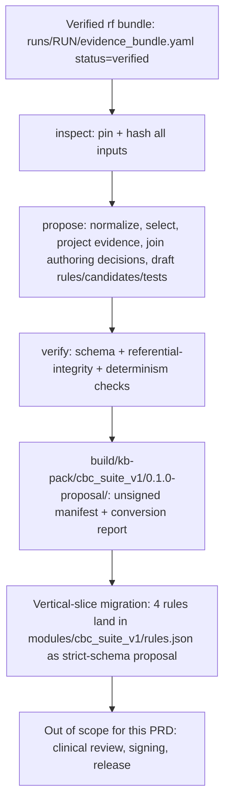
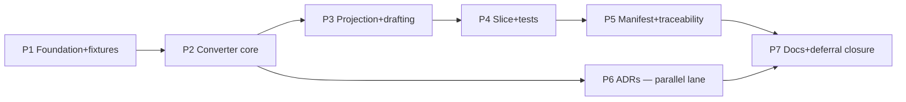

# Feature Brief & Metadata

**Feature Name:**

> Evidence Foundry Buildout — E0 (deterministic wire-up) + pre-E1 ADR drafts

**Filepath Name:**

> `evidence-foundry-buildout-v1`

**Date:**

> 2026-07-19

**Author:**

> Opus orchestrator (decisions block); PRD authored by `prd-writer` agent (sonnet)

**Related Epic(s)/PRD ID(s):**

> Evidence Foundry track (`docs/project_plans/expansion/00-expansion-plan.md` §2–§3); IntentTree
> work-area `EF` in tree `tree_01KXQ7WC1HQE2GKZSCNDVXA9G7` (node `EF-WP0` is the central deliverable
> of this PRD). Depends on `platform-foundation-p0` (module package contract, already landed —
> commit `ff4b519`).

**Related Documents:**

> - `docs/project_plans/expansion/02-evidence-foundry-on-research-foundry.md` — the full design spec;
>   every functional requirement below cites a section anchor in this document.
> - `docs/project_plans/expansion/rf-handoff/RESULTS.md` — completion record: 7/7 `rf` evidence runs
>   verified (576 claims, cross-model fidelity audit), the upstream input this PRD converts.
> - `docs/project_plans/expansion/rf-handoff/README.md` — run registry, converter-eligibility
>   contract, RFUP external-enhancement list (§6).
> - `docs/project_plans/expansion/00-expansion-plan.md` §2–§3 — program sequencing; this PRD executes
>   the "E0 wire-up" cell of the P0–P6 × E0–E2 matrix.
> - `.claude/worknotes/evidence-foundry-buildout/decisions-block.md` — binding scope, phase
>   boundaries, risk hotspots, and agent routing (Opus-authored; this PRD does not contradict it).
> - `CLAUDE.md` "Hard guardrails" — restated verbatim in §2 below; every guardrail is a review-blocker.

---

## 1. Executive Summary

This PRD scopes **E0** of the Evidence Foundry track (design spec §7.2): building the deterministic,
offline `rf-bundle → kb-pack` converter (`tools/rf-bundle-to-kb-pack/`, IntentTree node `EF-WP0`) that
turns a **verified** Research Foundry evidence bundle into a schema-valid, traceable rule-*proposal*
package, and migrating a 4-rule vertical slice through it end to end. In parallel it drafts the **8
pre-E1 ADRs** (design spec §8.5) that unblock live discovery, dual clinical review, and signed release
in the next increment. Nothing produced by this feature is clinically released, patient-facing, or
autonomously published — the converter's entire output is an unsigned, reviewable proposal, and every
numeric constant it emits must resolve to an exact source passage or an explicit, human-authored
implementation decision.

**Priority:** HIGH — this is the only increment whose inputs already exist (the 7 verified `rf`
bundles landed 2026-07-18 per `rf-handoff/RESULTS.md`), it is fully deterministic (no clinical
sign-off gates the *build*, only the eventual *release*), and it de-risks every E1 item (design spec
§7.1, §7.3) before that larger, clinician-review-gated increment is planned.

**Key Outcomes:**
- Outcome 1: A working, tested `rf-bundle → kb-pack` converter exists in this repository, proven
  against a real verified bundle and a real 4-rule clinical vertical slice — not a hypothetical.
- Outcome 2: The `source → passage → claim → decision → rule → test → output` traceability chain
  (design spec §4.16) is provably intact end to end for that slice, with zero invented thresholds.
- Outcome 3: The 8 ADRs that currently block E1 planning (rule-schema v2, passage licensing,
  terminology ownership, approval identity, KB signing, validation-data boundary, surveillance
  cadence, Path-B hardening) exist as `status: proposed` decision records with named options.

---

## 2. Context & Background

### Current State

- **Upstream evidence is ready.** All 7 `rf` evidence runs registered for this program are `verified`
  (`rf verify` exit 0, 0 unsupported claims): 576 claims total (485 supported / 50 inference / 31
  speculation), cross-model fidelity-audited (`rf-handoff/RESULTS.md` §1, §4). Two runs (`REG-001`,
  `REG-004`) additionally carry a legal-review flag and are excluded from clinical rule drafting until
  that review completes.
- **Nothing downstream of "verified bundle" exists yet.** There is no `tools/rf-bundle-to-kb-pack/`
  converter, no `modules/cbc_suite_v1/` package, no evidence-assertion (exact-passage) registry, and
  no rule-provenance sidecar anywhere in this repository. The 91 rules / 26 candidates / 6 evidence
  sources currently in `modules/anemia/` were hand-authored before the `rf` seam existed and carry no
  claim lineage.
- **The evidence registry is duplicated.** `src/evidence.js` hand-maintains `KNOWLEDGE_BASE_VERSION`,
  `REVIEWED_THROUGH`, and an `EVIDENCE` const map that can drift from `modules/anemia/evidence.json`
  (design spec §4.19; confirmed present in the current tree).
- **The KB validator is structural, not schema-complete.** `scripts/validate-kb.mjs` checks rule IDs,
  evidence references, candidate references, and condition evaluability, but does not run
  `schemas/rule.schema.json` as a JSON Schema validator directly (confirmed by reading the script).

### SPIKE Waiver Rationale

No separate SPIKE was authored for this feature despite Tier 3 sizing (42 pts, per decisions block
§6). The binding decisions block (§ header) records this as **waived-by-equivalence**: the design spec
(`02-evidence-foundry-on-research-foundry.md`) is itself a full architectural design document — seam
invariants, converter phases, stable-ID rules, gate architecture, and an explicit build-vs-reuse
ledger — and the completed `rf-handoff` (7/7 verified runs, 576 claims, independent gpt-5.6 fidelity
audit) constitutes the research foundation a SPIKE would otherwise have to produce. Test scenarios are
enumerable directly from design spec §4.6's 11 converter phases and §2.3's 15 seam invariants, which
satisfies the H3 "algorithmic service" SPIKE-avoidance condition in the planning skill's estimation
heuristics. No further research investigation is required before implementation planning.

### Problem Space

Without this feature, the only way to add a second module's clinical content is to hand-author rules
directly into `modules/<id>/rules.json` the way `modules/anemia/` was built — with no deterministic
link back to a verified source claim, no exact-passage requirement, and no reviewable proposal state
before a rule becomes "live" in the KB the engine reads. That is the exact failure mode the hard
guardrails prohibit ("No invented thresholds," "No AI-published rule changes") and the exact scaling
bottleneck the Evidence Foundry track exists to remove (00-expansion-plan.md §3).

### Current Alternatives / Workarounds

The only current alternative is continued hand-authoring against the existing 91-rule anemia KB
pattern — insufficient for the CBC Suite (P2) and every subsequent module, because it has no
machine-checkable link between a clinical numeric constant and the passage that supports it, and no
proposal/review state distinct from "in the runtime KB."

### Stale-Path Hazard (read before authoring any requirement below)

The design spec (`02-evidence-foundry-on-research-foundry.md`) was authored before the P0
module-package refactor (commit `ff4b519`) landed. It cites `data/rules.json`, `data/evidence.json`,
`data/candidates.json`, and `src/evidence.js` as the bridge targets (§4.1, §4.4, §4.19, §6.4). **These
paths no longer exist as canonical KB locations.** Current truth, per `docs/architecture.md` §2a and
the live tree:

| Design-spec path (stale) | Current path |
|---|---|
| `data/rules.json` | `modules/anemia/rules.json` (91 rules) |
| `data/evidence.json` | `modules/anemia/evidence.json` (6 sources) |
| `data/candidates.json` | `modules/anemia/candidates.json` (26 patterns) |
| `src/evidence.js` (canonical registry) | `src/evidence.js` still exists as a **hand-maintained duplicate**; `modules/anemia/evidence.json` is the module-package copy — FR-2 below eliminates this duplication |
| implicit `src/facts.js` logic | `src/facts.js` is a thin shim over `modules/anemia/facts.anemia.js`, dispatched via `src/facts/registry.js` |

Every functional requirement in §6 below cites the **current** path. Phase 1 of the implementation
must produce a standalone path-mapping worknote reconciling every remaining design-spec path
reference before any Phase 2+ task executes (this is a blocking Phase 1 deliverable, not optional
cleanup) — see FR-5.

### Architectural Context

This is not a MeatyPrompts-style layered web application; it is a deterministic content-build pipeline
feeding a static/mirror clinical assessment engine. The relevant architecture (`docs/architecture.md`
§2a "Module package architecture") is:

- Each module is a self-contained package at `modules/<id>/` holding `rules.json`, `candidates.json`,
  `evidence.json`, `reference-ranges.json`, `module.json` (unsigned-stub manifest), and `index.js`
  (hook descriptor: module id, manifest ref, `deriveFacts`, `summarize`, limitations).
- Three registries dispatch module behavior: `src/facts/registry.js`, `src/ranges/registry.js`,
  `src/modules/registry.js`.
- This feature's output (`tools/rf-bundle-to-kb-pack/`) is a **build-time** producer that emits
  candidate module-package content into a staging area (`build/kb-pack/<module_id>/<pack_version>/`,
  design spec §4.4) — it never writes directly into a `modules/<id>/` package that the runtime loads.
  Only a separate, out-of-scope release-assembly step (E1+) performs that merge.

---

## 3. Problem Statement

**User Story Format:**

> As a platform engineer with 7 verified `rf` evidence bundles and no deterministic path from
> "verified claim" to "candidate rule," I currently have no way to produce a reviewable rule proposal
> without hand-writing JSON that carries no claim lineage, instead of a repeatable, auditable,
> fail-closed converter that a clinical reviewer can independently trace from rendered output back to
> the exact source passage.

**Technical Root Cause:**

- No `tools/rf-bundle-to-kb-pack/` converter exists anywhere in the repository.
- No `modules/cbc_suite_v1/` package exists; the CBC Suite has no module envelope to converge on.
- `modules/anemia/evidence.json` and `src/evidence.js` are two independently maintained sources of
  the same evidence-registry content (design spec §4.19, §8.3 "Two sources of KB truth").
- `scripts/validate-kb.mjs` does not run `schemas/rule.schema.json` as a JSON Schema validator, so a
  converter-emitted rule that violates the strict 5-field contract would not be caught by `npm run
  validate` today.
- No `evidence-assertions.json` (exact-passage projection) or `rule-provenance.json` (sidecar
  metadata) file type exists yet — the current schema (`schemas/rule.schema.json`,
  `additionalProperties: false`) has no room for provenance metadata inside `rules.json` itself
  (design spec §4.13).

---

## 4. Goals & Success Metrics

### Primary Goals

**Goal 1: Prove the deterministic seam end to end**
- Convert one verified `rf` bundle through `inspect → propose → verify` into a schema-valid KB-pack
  proposal for a real 4-rule clinical vertical slice, with zero manual JSON hand-editing of the
  proposal output.
- Measurable: `node tools/rf-bundle-to-kb-pack/cli.mjs propose ...` run twice against the same fixture
  produces byte-identical output (SHA-256 equality) on both runs.

**Goal 2: Preserve the invariant chain with zero invented thresholds**
- Every numeric constant in the 4 migrated rules resolves to an exact passage in
  `evidence-assertions.json` or an explicit `authoring-decisions.yaml` implementation-proposal record.
- Measurable: a trace-graph query (source → passage → claim → decision → rule → test → output)
  succeeds for all 4 slice rules with zero dangling edges.

**Goal 3: Unblock E1 planning**
- All 8 ADRs from design spec §8.5 exist as reviewable `status: proposed` records.
- Measurable: each ADR names its decision, ≥2 options considered, a recommended default, and the
  specific E1/E2 backlog item(s) it unblocks (traceable to design spec §6.1's capability ledger).

### Success Metrics

| Metric | Baseline | Target | Measurement Method |
|--------|----------|--------|-------------------|
| Converter seam invariants covered by an executable test (design spec §2.3, 15 total) | 0 | 15/15 | Test count in Phase 2's converter test suite |
| Slice rules with complete positive/negative/boundary/missingness test coverage | 0 of 4 | 4 of 4 | `npm test` pass + manual trace-graph review |
| Dangerous-miss test coverage for the marrow-red-flag slice rule | 0 | ≥1 passing dangerous-miss case | `npm test` |
| Evidence-registry sources of truth | 2 (`src/evidence.js`, `modules/anemia/evidence.json`) | 1 (generated/shared) | Static check: no independent hand-maintained duplicate |
| `scripts/validate-kb.mjs` JSON-Schema coverage | Structural checks only | Full `schemas/rule.schema.json` validation | Seeded-bad-KB test fails the validator |
| Pre-E1 ADRs drafted | 0 | 8 | File count at `status: proposed` |
| Reproducibility (two clean converter runs → identical bytes) | N/A (tool doesn't exist) | Pass | Phase 5 double-run hash comparison |

---

## 5. User Personas & Journeys

### Personas

**Primary Persona: Platform/backend engineer (this feature's direct user)**
- Role: implements and runs the converter; authors the vertical-slice migration.
- Needs: a fail-closed CLI that never silently accepts a non-`verified` bundle or an unresolved
  numeric threshold; clear error taxonomy mapped to `rf verify` exit codes (design spec §5.2).
- Pain Points today: no tooling exists; the only precedent (`modules/anemia/`) was hand-authored with
  no reusable pattern for claim-to-rule traceability.

**Secondary Persona: Future clinical reviewer (E1, not this feature's user, but its consumer)**
- Role: will eventually review the `rule-proposals.json` / `evidence-assertions.json` output this
  feature produces, once E1 builds the review workflow.
- Needs: every rule proposal traceable to an exact passage or a labeled implementation-proposal
  decision, with conflicts (`mixed`/`contradicted` claims) visibly preserved, never silently resolved.
- Pain Points this feature must not create: a converter that guesses clinical logic from prose, or
  that hides a `mixed`/`contradicted` claim behind a single confident-looking rule.

### High-level Flow

---

## 6. Requirements

### 6.1 Functional Requirements

| ID | Requirement | Priority | Notes |
| :-: | ----------- | :------: | ----- |
| FR-1 | Create `modules/cbc_suite_v1/module.json` following the `modules/anemia/module.json` unsigned-stub shape (`id`, `title`, `schemaVersion`, `status`, `knowledgeBaseVersion`, `evidenceReviewedThrough`, `engineLabel`, `supportedAgeMonths`, `clinicalContentHash`, `approvedBy`, `validationRunId`, `supersedes`, `releasedAt`), plus the design-spec §3.2 module variable envelope fields (`module_topic`, `intended_hcp_users`, `patient_population`, `intended_output`, `explicit_exclusions`, `jurisdictions`, `integration_targets`, `evidence_policy`). | Must | 02 §3.2, §7.2 item 1 |
| FR-2 | Eliminate the evidence-registry duplication between `src/evidence.js` (hand-maintained `KNOWLEDGE_BASE_VERSION`/`REVIEWED_THROUGH`/`EVIDENCE` consts) and `modules/anemia/evidence.json`. Generate `src/evidence.js`'s exports from the module's `evidence.json` at build time, or replace both with a single injected immutable registry consumed identically in browser and server modes. | Must | 02 §4.19; decisions block Phase 1 |
| FR-3 | Add JSON Schema validation of every module's `rules.json` against `schemas/rule.schema.json` to `scripts/validate-kb.mjs`, in addition to its existing ID/evidence/candidate/condition checks. A seeded-invalid rule (e.g., an extra property, given `additionalProperties: false`) MUST fail `npm run validate`. | Must | 02 §4.19; decisions block Phase 1 exit gate |
| FR-4 | Produce one sanitized, in-repo fixture bundle derived from a single verified `rf` run (candidate: `REG-001` or `RF-CBC-001`; final selection resolved by OQ-2), with a hash-provenance note recording the source `run_id`, bundle SHA-256, and content-rights disposition of every included passage. | Must | 02 §3.9; decisions block Phase 1 |
| FR-5 | Produce a path-mapping worknote reconciling every design-spec path reference (`data/rules.json`, `data/evidence.json`, `data/candidates.json`, `src/evidence.js` as sole registry) to its current-tree equivalent, **before** any Phase 2+ task begins. | Must | decisions block §2 (blocking) |
| FR-6 | Build `tools/rf-bundle-to-kb-pack/` as a Node.js ESM CLI implementing `inspect` and `verify` verbs (Phase 2) and `propose` (Phase 3), reading only from a read-only `rf` run directory (`evidence_bundle.yaml`, `claims/claim_ledger.yaml`, `reviews/verification.yaml`, `sources/src_*.md`, `extractions/ext_*.yaml`) plus `modules/cbc_suite_v1/module.json` and `modules/cbc_suite_v1/authoring-decisions.yaml`. | Must | 02 §4.1, §4.3, §4.5 |
| FR-7 | The converter MUST resolve and SHA-256-hash every input artifact (`run_id`, bundle ID, bundle bytes, claim-ledger bytes, every referenced source-card's bytes) before any transformation step ("Pin" phase). | Must | 02 §4.6 Phase 1 |
| FR-8 | The converter MUST implement all 15 seam invariants enumerated in design spec §2.3 as executable, individually testable checks (bundle-`verified`-only admission; YAML-only reads; exit-code + artifact-status reconciliation; run-directory immutability; hash pinning; `supported`/`mixed`/`contradicted`/`inference`/`speculation`/`unsupported` claim-eligibility routing; no confidence-to-probability translation; no absence-as-normal inference; byte-deterministic output; proposal-not-release status; reviewer approval of interpretations not citations). | Must | 02 §2.3; decisions block Phase 2 exit gate (central risk hotspot) |
| FR-9 | The converter MUST reject, fail-closed, any bundle whose `evidence_bundle.yaml.status` is not exactly `verified` — no partial output, non-zero exit. | Must | 02 §2.3 invariant 1 |
| FR-10 | The converter MUST perform zero network calls and invoke zero generative/LLM models in any verb (`inspect`, `verify`, `propose`). | Must | 02 §4.1 "Determinism" row |
| FR-11 | The converter MUST map its internal `rf verify` / `rf council` exit-code awareness to the fail-closed error taxonomy in design spec §5.2 (0 ok · 1 usage · 2 schema · 3 governance · 4 unsupported · 5 budget · 6 adapter · 7 human-review), never bypassing exit 3 or exit 7 as if they were ordinary failures. | Must | 02 §5.2 |
| FR-12 | `propose` MUST project evidence into `modules/cbc_suite_v1/evidence.json` (enriched per 02 §4.9) and a new `modules/cbc_suite_v1/evidence-assertions.json` (exact-passage assertion records per the 02 §4.10 schema) — landed under `modules/cbc_suite_v1/`, not `data/` (per the stale-path hazard above; final confirmation against the module contract is OQ-3). | Must | 02 §4.9, §4.10 |
| FR-13 | `propose` MUST map every `claim_ledger.yaml` claim per the eligibility table in design spec §4.11: `status=supported` → `source_supported_fact`, eligible only with a resolved exact passage; `status=mixed` → conflict-visible authoring object only, never a one-sided rule; `status=contradicted` → never the sole positive basis for a rule; `status=inference` → implementation-proposal input requiring a populated `inference_basis.from_claims`; `status=speculation` or `status=unsupported` → never emitted as rule evidence at all. | Must | 02 §4.11; hard-guardrail-adjacent |
| FR-14 | `propose` MUST require an explicit, matching `authoring-decisions.yaml` record (02 §4.12 schema) before drafting any rule or candidate. It MUST NOT infer clinical Boolean logic from prose without that matching decision record. | Must | 02 §4.12, §4.5 "propose … MUST NOT infer clinical Boolean logic" |
| FR-15 | `propose` MUST emit both a rich `rule-proposals.json` (authoring metadata) and a strict runtime projection at `modules/cbc_suite_v1/rules.json` containing only the 5 fields `schemas/rule.schema.json` permits (`id`, `category`, `when`, `evidence`, `output`, `additionalProperties: false`). Metadata not permitted by that schema MUST be emitted to `modules/cbc_suite_v1/rule-provenance.json`, joined to the runtime rule by `id`. | Must | 02 §4.13 |
| FR-16 | Migrate exactly these 4 named rules into the vertical slice: (a) young-infant/age-under-6-months scope-abstention rule, (b) local-lab-range-precedence-over-universal-threshold rule, (c) iron-deficiency-anemia candidate pattern rule, (d) marrow-red-flag safety rule. No additional rules are in scope for this migration. | Must | decisions block Phase 4; 02 §7.2 item 6 |
| FR-17 | For each of the 4 slice rules, generate: ≥1 positive case, ≥1 negative case, a boundary case for every numeric threshold/age partition it contains, and a missingness case for every clinically required input it reads. For rule (d) (marrow-red-flag), additionally generate ≥1 dangerous-miss case proving the safety alert activates and dominates ranking even when a co-occurring benign high-scoring candidate is present. | Must | 02 §4.15; 02 §5.4 dangerous-miss list |
| FR-18 | Emit an unsigned release manifest at `release-manifest.unsigned.json` matching the design-spec §4.18 shape minus the `signature` block, binding `rfInputs[].{runId,bundleSha256,claimLedgerSha256,verificationExitCode}` and `converter.{name,version,configSha256}` plus `testCorpusHash`/`traceabilityHash`. | Must | 02 §4.18 (minus signature) |
| FR-19 | Emit `conversion-report.json` enumerating every excluded or rejected claim, source, or candidate item together with its specific exclusion reason — not a pass/fail summary alone. | Must | decisions block Phase 5 exit gate |
| FR-20 | Prove determinism: two independent `propose` runs against byte-identical inputs on the same converter version MUST produce byte-identical output files across every emitted artifact (content-hash equality). | Must | 02 §2.3 invariant 13; decisions block Phase 5 exit gate |
| FR-21 | Emit a minimal `semantic-diff.json` limited to added/removed/changed rule IDs between the proposed pack and the active `modules/anemia/rules.json` — full impact-graph diffing is out of scope (E2; see OQ-4). | Must | 02 §4.4; decisions block OQ-4 |
| FR-22 | Draft all 8 ADRs listed in design spec §8.5 at `status: proposed` (canonical CDS authoring model/rule-schema v2; exact-passage storage/licensing; terminology/local-lab-profile ownership; clinical approval identity/adjudication; KB serialization/signing/key custody; validation-data boundary; surveillance cadence/materiality; Path-B hardening vs. native adapter install). Each names its decision, ≥2 options, and the specific E1/E2 item(s) it unblocks. None may be marked `accepted`. | Must | 02 §8.5; decisions block Phase 6 |
| FR-23 | Author a design-spec stub (per `.claude/skills/planning/references/deferred-items-and-findings.md`) for every item listed in §7 "Deferred Items" below, one stub per item. | Must | decisions block Phase 7 |
| FR-24 | Add a `CHANGELOG.md` `[Unreleased]` entry describing the new `tools/rf-bundle-to-kb-pack/` converter and the `cbc_suite_v1` module scaffold (this repo introduces user/developer-facing tooling; `changelog_required: true`). | Must | `.claude/specs/changelog-spec.md` |
| FR-25 | Add a "Converter" subsection to `docs/architecture.md` documenting the `rf-bundle-to-kb-pack` seam and pointing to design spec §4 for the full contract. | Must | decisions block Phase 7 |

### 6.2 Non-Functional Requirements

**Performance:**
- The converter runs fully offline against a fixture bundle in well under one minute on a standard
  developer machine — this is a build-time tool, not a request-serving service; no latency SLO
  applies.

**Security:**
- Zero network calls, zero LLM/generative-model invocations, zero shelling out to `rf` itself from
  inside the converter (FR-10). Pinned YAML parser and JSON Schema validator dependencies
  (`tools/rf-bundle-to-kb-pack/package.json` or root `package.json` dependency addition), no
  unreviewed transitive dependency surface expansion beyond what's needed for YAML parsing and schema
  validation.
- The converter reads `runs/<RUN>/` as **read-only** and never mutates it (design spec §2.3 invariant
  6).

**Reliability:**
- Fail-closed on every ambiguous condition: unresolved reference, ambiguous unit, missing exact
  passage, bad claim status, schema failure, or hash drift all produce a non-zero exit and no partial
  output file (design spec §4.1 "Failure posture").
- No silent fallback to an approximate or default value anywhere in the converter's numeric/threshold
  path.

**Observability:**
- `conversion-report.json` is the audit surface for this feature (FR-19) — structured JSON, not free
  text, enumerating every accept/reject decision with its reason.
- No OpenTelemetry/trace-id requirement applies; this is an offline CLI tool, not a running service.

**Plan Generator Rule Compliance Notes** (for the downstream `implementation-planner`):

- **R-P1** (no vague "all/across" without enumerated targets): every FR above enumerates concrete
  file paths, rule names, or a bounded list (e.g., FR-16's 4 named rules, FR-22's 8 named ADRs)
  instead of an unbounded "all rules"/"across the KB" phrasing.
- **R-P2** (new backend field → implicit "FE handles missing X" AC): does not apply. This feature adds
  zero fields to any runtime-consumed API response or patient-input schema; all new artifacts
  (`evidence-assertions.json`, `rule-provenance.json`, manifest, report) are build-time proposal files
  the deployed engine never reads until a future, out-of-scope release-assembly step.
- **R-P3** (≥2 owner specialties + overlapping `files_affected` → `integration_owner` + seam task):
  **applies** to Phase 2 (backend-architect-class design tasks + engineer-class build tasks both touch
  `tools/rf-bundle-to-kb-pack/**`) and to Phase 4 (engineer + testing-specialist both touch
  `modules/cbc_suite_v1/rules.json` and the generated test files). The implementation-planner must
  declare an `integration_owner` and at least one seam task for each of these two phases.
- **R-P4** (UI-touching phases need a runtime-smoke task referencing `target_surfaces`): does not
  apply. No `*.tsx` file appears in any phase's `files_affected`; this feature makes zero changes to
  the clinician SPA.

---

## 7. Scope

### In Scope (v1 — E0 per decisions block §1)

- `modules/cbc_suite_v1/module.json` envelope (FR-1).
- Evidence-registry unification, killing the `src/evidence.js` / `modules/anemia/evidence.json`
  duplication (FR-2).
- The `rf-bundle-to-kb-pack` converter (`tools/rf-bundle-to-kb-pack/`, IntentTree `EF-WP0`) — the
  central build of this feature (FR-6 through FR-15, FR-18 through FR-21).
- Vertical-slice migration: exactly the 4 named rules in FR-16.
- Generated test corpus for the slice only (FR-17) — not the full CBC Suite.
- Unsigned manifest + conversion report (FR-18, FR-19).
- 8 pre-E1 ADR drafts at `status: proposed` (FR-22).
- Deferred-item design-spec stubs for every item in the Deferred Items table below (FR-23).
- Documentation finalization: CHANGELOG entry, `docs/architecture.md` converter section (FR-24, FR-25).

### Deferred Items

Every item below is explicitly **out of scope for this PRD**. Each is tagged with the increment
(design-spec §7) it belongs to. A design-spec stub for each (FR-23) is the only artifact this PRD
produces for these items — no implementation.

**Deferred to E1** (design spec §7.3, §6.1 capability ledger):

| Item | Effort | Design-spec anchor |
|---|---|---|
| Clinical review portal / workflow UI | L | 02 §6.1 "Clinical review portal/workflow" |
| Full CBC 12-angle research operation (live discovery, parameterized Path-B) | — | 02 §3.8, §7.3 items 1–3 |
| Upstream `rf` validators (pediatric extraction-completeness validator, exact-passage hard-gate) | M | 02 §6.1 "Pediatric extraction extension," "Exact-passage eligibility check" |
| Retrospective validation harness (version-pinned replay + adjudication) | L | 02 §6.1 "Retrospective validation harness" |
| FHIR/terminology emitters (Questionnaire/PlanDefinition/ActivityDefinition/CDS Hooks service) | L | 02 §6.1 "FHIR/terminology emitters" |
| Signed release + key custody | M | 02 §6.1 "Signed KB registry" |
| Property/mutation/semantic-diff CI expansion (beyond the E0 minimal semantic diff) | M | 02 §6.1 "Property/mutation/semantic-diff CI" |

**Deferred to E2** (design spec §7.4):

| Item | Design-spec anchor |
|---|---|
| Surveillance/update/registry engine (scheduled queries, retraction triggers, impact graph) | 02 §7.4 items 1–7 |
| Production monitoring (activation/abstention/alert-burden telemetry) | 02 §7.4 item 10 |
| Withdraw/rollback machinery | 02 §7.4 item 11 |

**External — not tasks in this repository (RFUP, routed to the `rf` upstream repo):**

Seven enhancements live in the Research Foundry project itself, not this repository and not this
PRD's scope: parameterize the Path-B workflow, a governed URL/PDF extraction adapter, upstream
exact-passage hard-gating, stable schema versioning + machine contract, council-result normalization,
native adapter install/evaluation, and run-immutability/lineage guarantees (`rf-handoff/README.md`
§6, IntentTree work-area `RFUP`, node `node_01KXRTYKKW9ECTF9MCBQ8JV1EB`). Route these via `op story` /
feature requests into the `agentic_meta_dev` repo. This PRD only models RFUP items as **external
dependencies** (§8 below) — never as work items here.

### Non-Goals (verbatim from design spec §6.4 — violations are review-blockers)

> - A second evidence crawler or source-card database in the CDS repository.
> - A generative rule-writing service that publishes to `data/rules.json`.
> - A patient-specific LLM inference path.
> - A universal pediatric threshold service that ignores local methods and intervals.
> - A converter that guesses LOINC/UCUM codes from labels.
> - A release shortcut that treats `rf verify` or council approval as clinical validation.
> - A single "confidence score" combining evidence confidence, rule points, and patient likelihood.

*(Note: the second bullet's literal path `data/rules.json` is quoted verbatim from the source
document per instruction; per the Stale-Path Hazard in §2, the current equivalent is
`modules/<module_id>/rules.json` — the prohibition applies identically to that current path.)*

---

## 8. Dependencies & Assumptions

### External Dependencies

- **Verified `rf` evidence bundles** (7 available: `RF-EV-001`, `REG-001`, `RF-CBC-001`, `RF-CBC-002`,
  `RF-KID-001`, `RF-GRO-002`, `REG-004`) — hosted on the agentic node (`10.42.10.76`) and a local
  `research-foundry` mirror. Only the sanitized fixture derived from one of these (FR-4) crosses into
  this repository; the converter never reads the node or the mirror directly at runtime.
- **RFUP enhancements** (external, `rf` upstream repo) — not required for E0; modeled as external
  dependency only, never a blocking task (see Deferred Items above).
- **Legal review of `REG-001`/`REG-004`** — both regulatory runs are flagged "research input only,
  not legal advice" pending qualified review (`rf-handoff/RESULTS.md` §5); neither may seed a
  clinical-rule fixture until that review clears, though either may still inform the ADR drafts.

### Internal Dependencies

- **Module package contract** (`docs/architecture.md` §2a, delivered by `platform-foundation-p0`,
  commit `ff4b519`) — `modules/cbc_suite_v1/` must conform to this contract's package shape.
- **`schemas/rule.schema.json`** — the strict 5-field target every generated `rules.json` projection
  must validate against.
- **`scripts/validate-kb.mjs`** and the `npm run check` gate — every phase must keep this green.
- **`modules/anemia/`** — the migration source for the 4 slice rules and the comparison target for
  the minimal semantic diff (FR-21).

### Assumptions

- Node.js ≥20 is pinned for the converter, matching the root `package.json` `engines` constraint.
- The fixture bundle selected under OQ-2 is public-domain-heavy enough that its exact-passage content
  can be committed to this repository without a rights violation; if not, the fixture uses hash +
  selector references only, per design spec §4.10's rights-restricted fallback.
- `build/kb-pack/` is not currently listed in `.gitignore`; whether E0's proposal output under this
  path is committed or generated-and-discarded is resolved by OQ-6, not assumed here.

### Feature Flags

None. E0's entire output is a build-time proposal artifact staged under `build/kb-pack/`; the
deployed clinician SPA and API are unmodified by this feature until a human-gated, out-of-scope
release-assembly step (E1+) merges an approved pack into a `modules/<id>/` package the runtime loads.

---

## 9. Risks & Mitigations

| Risk | Impact | Likelihood | Mitigation |
| ----- | :----: | :--------: | ---------- |
| Seam-invariant regression — converter silently accepts bad input | High | Medium | Phase 2 exit gate requires 1 executable test per each of the 15 seam invariants (02 §2.3); fail-closed default in the error taxonomy; converter tests assert no network/no LLM calls occur |
| Invented-threshold leak via drafting phases | High | Medium | Every numeric literal in a generated rule must carry a passage locator resolvable in `evidence-assertions.json`; Phase 4 exit gate rejects any rule with an unresolved evidence reference |
| Stale design-spec paths executed literally | Medium | Medium | §2's path-mapping table is authoritative; FR-5's worknote is a Phase 1 blocking deliverable; every FR above already cites the current path |
| Fixture provenance / content-rights exposure (verbatim passages committed to a public repo) | Medium | Low | FR-4's hash-provenance note documents source licensing; prefer the public-domain-heavy `REG-001` class over clinically richer but more restricted sources; any restricted passage is routed to ADR-2 (exact-passage storage/licensing) rather than committed |
| Rule-schema v2 scope creep into E0 | Medium | Low | E0 emits strictly the current 5-field schema (`additionalProperties: false`); any v2 field lives only in ADR-1 and the deferred design-spec stub, never in this feature's runtime output |
| Determinism drift (hashes differ across runs/machines) | Medium | Low | Phase 5's double-run reproducibility gate; sorted serialization; pinned Node ≥20; no timestamps embedded in hashed content |
| Guardrail breach (autonomous clinical output, unsupported confidence framing) | High | Low | This PRD restates the hard guardrails and the §6.4 non-goals as explicit review-blockers; the decisions block schedules `karen` reviewer milestones at the end of Phase 2, Phase 5, and Phase 7 specifically to check them |

---

## 10. Target State (Post-Implementation)

**Engineer Experience:**
- A platform engineer with a new verified `rf` bundle runs `node tools/rf-bundle-to-kb-pack/cli.mjs
  inspect` then `propose` and gets a schema-valid, fully traced KB-pack proposal in
  `build/kb-pack/<module_id>/<pack_version>/` without hand-editing any JSON.
- A converter run against a non-`verified` bundle, an unresolved passage, or an ambiguous unit fails
  immediately with a specific, actionable error — never a partial or silently-wrong output.

**Technical Architecture:**
- `modules/cbc_suite_v1/` exists as a valid, if minimally populated, module package alongside
  `modules/anemia/`.
- `src/evidence.js` and the module `evidence.json` files are no longer independently hand-maintained;
  one is generated from or shares a single source with the other.
- `scripts/validate-kb.mjs` runs full JSON Schema validation against `schemas/rule.schema.json` for
  every module.
- 8 ADRs exist at `docs/adr/` (or the project's established ADR location) at `status: proposed`,
  ready for E1 planning to consume.

**Observable Outcomes:**
- `npm run check` remains green throughout every phase (per this repo's non-negotiable commit gate).
- A trace-graph query from any of the 4 slice rules' rendered output back to its exact source passage
  succeeds, with the assertion visibly labeled `source_supported_fact` or `implementation_proposal`.
- The product remains, and is documented as remaining, an **UNVALIDATED research prototype** — no
  artifact produced by this feature is described anywhere as clinically validated or release-ready
  (design spec §5.7, §9.1 checklist item "No artifact is described as clinically validated or
  release-ready").

---

## 11. Overall Acceptance Criteria (Definition of Done)

### Functional Acceptance

- [ ] FR-1 through FR-25 are implemented and independently verifiable (each maps to a phase exit gate
      below).
- [ ] `modules/cbc_suite_v1/module.json` exists and validates against the same shape as
      `modules/anemia/module.json` plus the design-spec §3.2 envelope fields.
- [ ] `tools/rf-bundle-to-kb-pack/cli.mjs inspect`, `verify`, and `propose` all execute successfully
      against the FR-4 fixture bundle.
- [ ] All 15 seam invariants from design spec §2.3 have ≥1 passing executable test each (15/15, not
      "most").
- [ ] The converter refuses (non-zero exit, no output) a bundle whose `status` is not `verified` —
      demonstrated with a seeded non-verified fixture.
- [ ] Exactly the 4 named rules in FR-16 are migrated; each has a complete positive/negative/boundary
      (where numeric)/missingness test set per FR-17; the marrow-red-flag rule additionally has ≥1
      passing dangerous-miss test.
- [ ] `modules/cbc_suite_v1/rules.json` validates against `schemas/rule.schema.json` with zero
      schema-validation errors.
- [ ] Running `propose` twice against the identical fixture and converter version produces
      byte-identical output across every emitted file (SHA-256 equality, demonstrated not merely
      asserted).
- [ ] `release-manifest.unsigned.json` and `conversion-report.json` are emitted and both are
      non-empty, structured (not free-text) artifacts.
- [ ] `src/evidence.js` no longer independently hand-maintains evidence content that can drift from
      `modules/anemia/evidence.json` — demonstrated by a CI-enforced equality/generation check.
- [ ] All 8 ADRs from FR-22 exist at `status: proposed`; zero are `accepted`.
- [ ] A design-spec stub exists for every item in the §7 Deferred Items table (FR-23) — one-to-one,
      not a single combined document.
- [ ] `CHANGELOG.md` has an `[Unreleased]` entry per FR-24.
- [ ] `docs/architecture.md` has a Converter subsection per FR-25.

### Technical Acceptance

- [ ] `npm run check` (test + validate + build + check:imports + smoke) is green at every phase
      boundary, not merely at the end.
- [ ] The converter makes zero network calls and zero generative-model calls in any verb — verified
      by a test that fails if a network or model-invocation hook is triggered.
- [ ] `runs/<RUN>/` under the fixture path is never written to by any converter verb (read-only
      enforcement demonstrated by a test asserting file mtimes/permissions are unchanged).
- [ ] Every phase's exit gate in §"Implementation Phases" below passes before the next phase starts
      (Phases 1→2→3→4→5 are strictly sequential per the decisions block's dependency map; Phase 6 may
      run in parallel with Phases 3–5 after Phase 2 completes).

### Quality Acceptance

- [ ] `task-completion-validator` passes at the end of each of the 7 phases (Tier 3 mandatory gate).
- [ ] `karen` milestone review passes at the end of Phase 2 (converter core), end of Phase 5 (E0
      functionally complete), and end of Phase 7 (feature end) — the 3 milestones the decisions block
      names.
- [ ] Every hard guardrail in §2 above and every §7 non-goal is explicitly checked at each `karen`
      milestone, not assumed compliant.

### Documentation Acceptance

- [ ] All 8 ADRs are discoverable and each cites the specific E1/E2 item(s) it unblocks.
- [ ] The path-mapping worknote from FR-5 exists and is referenced by the implementation plan's
      Phase 1 section.
- [ ] `CHANGELOG.md` and `docs/architecture.md` updates from FR-24/FR-25 are present.

---

## 12. Assumptions & Open Questions

### Assumptions

- The 4-rule vertical slice is representative enough of the CBC Suite's rule shapes (scope-abstention,
  local-range precedence, differential-pattern candidate, safety alert) that proving the converter
  against it de-risks the full CBC Suite migration in E1, without needing to migrate more rules now.
- `karen` and `task-completion-validator` reviewer agents are available and configured in this
  environment per the standard `dev-execution` workflow; no new reviewer tooling is scoped here.

### Open Questions

- [ ] **OQ-1** (carried over from decisions block §9): Module identity for the slice — design spec
      §3.2/§7.2 item 1 says create the `modules/cbc_suite_v1/` envelope, but the 4-rule vertical slice
      (FR-16) migrates rules currently scoped to anemia (iron-deficiency pattern, young-infant
      abstention). Does the slice land inside `modules/cbc_suite_v1/` (with `modules/anemia/`
      untouched), or does `cbc_suite_v1` get created empty-but-valid while the slice stays under
      `modules/anemia/`? Per the module package contract (`docs/architecture.md` §2a), a module's
      `index.js` hook descriptor must export a real `deriveFacts`/`summarize` pair — an
      empty-but-valid `cbc_suite_v1` package still needs *some* minimal working hook. **Decision
      owner: implementation-planner, per decisions block §2 instruction "decide in plan; do not leave
      to execution."**
- [ ] **OQ-2** (carried over): Which verified run seeds the FR-4 fixture — the public-domain-heavy
      `REG-001` (lower content-rights risk, regulatory/legal-review-flagged content, less clinically
      rich) versus the clinically richer `RF-CBC-001` (12 source cards, 87 claims, but not yet
      confirmed rights-clear for verbatim passage commitment)? Weigh content-rights exposure against
      test realism; the answer determines whether FR-4's hash-provenance note documents a
      rights-restricted (hash + selector only) or a full-text fixture.
- [ ] **OQ-3** (carried over): Landing path for `evidence-assertions.json` and `rule-provenance.json`
      under the module package contract — this PRD asserts `modules/cbc_suite_v1/` (not `data/`,
      not a pack-only location) based on `docs/architecture.md` §2a's module-package shape, but this
      is a PRD-level assumption, not yet an implementation-plan decision. Confirm against the full
      module contract before Phase 3 begins.
- [ ] **OQ-4** (carried over): Semantic-diff minimal scope for E0 (FR-21) — this PRD scopes it to
      rule add/remove/change only, explicitly excluding the full impact-graph (source-correction →
      affected-rules/tests/outputs) diffing that design spec §7.4 assigns to E2. Confirm this
      boundary holds once Phase 5 is actually implemented; if the minimal diff proves insufficient to
      satisfy FR-19's conversion-report requirement, escalate rather than silently expanding scope.
- [ ] **OQ-5** (new): `npm test` currently globs `tests/*.test.mjs` at the top level only (not
      recursive; confirmed from `package.json`'s `"test": "node --test tests/*.test.mjs"`). FR-17's
      generated positive/negative/boundary/missingness/dangerous-miss test corpus for the slice —
      does it land as new flat files matching that glob (e.g.,
      `tests/cbc-suite-slice.test.mjs`), or as JSON fixtures consumed by one new top-level runner
      file? The implementation plan must pick one pattern explicitly; do not let Phase 4 improvise it
      per-rule.
- [ ] **OQ-6** (new): `build/` is not currently listed in `.gitignore`. Is `build/kb-pack/`'s
      unsigned-proposal output (FR-6 through FR-21) committed to the repository as a reviewable
      artifact, or generated on demand and left untracked? This affects whether FR-20's
      determinism-proof commit includes the actual pack bytes or only a hash-comparison script
      output. Resolve before Phase 5.
- [ ] **OQ-7** (new): `schemas/` currently holds `rule.schema.json`, `candidate.schema.json`,
      `patient-input.schema.json`, and `assessment-output.schema.json` — all validated structurally
      by hand-written checks in `scripts/validate-kb.mjs` (FR-3 adds real JSON-Schema validation for
      `rule.schema.json` specifically). Do the new artifact types this feature introduces
      (`evidence-assertions.json`, `rule-provenance.json`, the `module.json` envelope's new §3.2
      fields, `authoring-decisions.yaml`) get their own `schemas/*.schema.json` files validated the
      same way, or are they checked with hand-written structural assertions only for E0? A
      schema-per-artifact-type answer is the safer default given the "no invented threshold" /
      fail-closed posture this feature must uphold, but it adds scope; the implementation-planner
      should decide explicitly rather than default silently to whichever is easier to code first.

---

## 13. Appendices & References

### Related Documentation

- **Design spec**: `docs/project_plans/expansion/02-evidence-foundry-on-research-foundry.md` — every
  FR above cites a section anchor in this document; treat it as the normative source for anything not
  restated here.
- **Upstream completion record**: `docs/project_plans/expansion/rf-handoff/RESULTS.md` — the 7
  verified bundles this feature converts.
- **Run registry + external-enhancement (RFUP) list**: `docs/project_plans/expansion/rf-handoff/README.md`.
- **Program sequencing**: `docs/project_plans/expansion/00-expansion-plan.md` §2–§3.
- **Decisions block** (binding, not to be contradicted): `.claude/worknotes/evidence-foundry-buildout/decisions-block.md`.
- **Module package contract**: `docs/architecture.md` §2a, §6.
- **H5 estimation anchor**: `docs/project_plans/PRDs/refactors/platform-foundation-p0-v1.md` and its
  implementation plan (Tier 3, 7-phase squash, commit `ff4b519`) — the closest comparable multi-phase,
  contract-driven refactor in this repository.

### Symbol References

Not applicable — this repository does not maintain `ai/symbols-*.json` artifacts. The relevant
"symbols" are the JSON Schema contracts at `schemas/rule.schema.json` and `schemas/candidate.schema.json`.

### Prior Art

- `modules/anemia/` (91 rules, 26 candidates, 6 evidence sources) — the hand-authored precedent this
  feature's converter output must be at least as traceable as, and the comparison target for the
  minimal semantic diff (FR-21).
- `platform-foundation-p0` (commit `ff4b519`) — delivered the module package contract this feature
  builds `modules/cbc_suite_v1/` against.

---

## Implementation Phases

**This PRD does not itself sequence tasks or assign subagents** — that is the Implementation Plan's
job (`docs/project_plans/implementation_plans/infrastructure/evidence-foundry-buildout-v1.md`,
expanded by `implementation-planner` from the decisions block). The 7 phases below are the binding
phase boundaries from the decisions block (§3), restated here only as the PRD's scope-to-phase map —
detailed task tables, batch definitions, and agent assignments live in the Implementation Plan.

**Phase 1: Foundation & fixtures**
- Scope: `modules/cbc_suite_v1/module.json` envelope (FR-1); evidence-registry unification (FR-2);
  JSON-Schema validation in `scripts/validate-kb.mjs` (FR-3); sanitized fixture bundle with
  hash-provenance note (FR-4); path-mapping worknote (FR-5).
- Estimate: 5 pts.
- Exit gate: `npm run check` green; fixture loads; validator rejects a seeded-bad KB.

**Phase 2: Converter core (EF-WP0)**
- Scope: `tools/rf-bundle-to-kb-pack/` Node ESM scaffold; read-only bundle loader; hash pinning
  (FR-7); converter-eligibility checks; `inspect` and `verify` verbs; fail-closed error taxonomy
  (FR-11).
- Estimate: 8 pts.
- Exit gate: all 15 seam invariants (FR-8) each covered by ≥1 executable test; converter refuses a
  non-`verified` bundle (FR-9). **`karen` milestone review.**

**Phase 3: Projection & drafting**
- Scope: evidence projections — `evidence.json` enrichment + `evidence-assertions.json` (FR-12);
  claim-ledger mapping (FR-13); candidate + rule-proposal drafting; `authoring-decisions.yaml` join
  (FR-14); `propose` verb; strict + provenance rule projection (FR-15).
- Estimate: 8 pts.
- Exit gate: `propose` on the fixture yields a schema-valid pack; `mixed`/`contradicted` claims emit
  conflict-visible objects, never one-sided rules.

**Phase 4: Vertical slice + test corpus**
- Scope: migrate the 4 named rules (FR-16); generated positive/negative/boundary/missingness/
  dangerous-miss tests (FR-17).
- Estimate: 8 pts.
- Exit gate: slice rules pass engine tests; the dangerous-miss set covers the slice-relevant hazard
  (marrow red-flag vs. mild-anemia distraction); no invented thresholds — every value resolves to an
  exact passage.

**Phase 5: Manifest & traceability**
- Scope: unsigned release manifest (FR-18); conversion report (FR-19); minimal semantic diff (FR-21);
  traceability index (claim → passage → rule → test).
- Estimate: 5 pts.
- Exit gate: manifest content-hash reproducible across two runs (FR-20); conversion report enumerates
  every exclusion with reason. **`karen` milestone review — E0 functionally complete.**

**Phase 6: Pre-E1 ADRs**
- Scope: draft all 8 ADRs from design spec §8.5 (FR-22), `status: proposed`.
- Estimate: 5 pts.
- Exit gate: 8 ADRs exist, each names its decision, options, and the E1 item(s) it unblocks; none
  marked accepted.
- Note: independent of Phases 3–5 (docs-only); runs as a parallel lane once Phase 2 completes, per the
  decisions block's dependency map.

**Phase 7: Docs & deferral closure**
- Scope: design-spec stubs for every deferred item (FR-23); CHANGELOG `[Unreleased]` entry (FR-24);
  `docs/architecture.md` converter section (FR-25); plan status updates.
- Estimate: 3 pts.
- Exit gate: the Deferred Items triage table is fully mapped to spec stubs, one-to-one; `npm run
  check` green. **`karen` milestone review — feature end.**

**Dependency map (critical path):** `P1 → P2 → P3 → P4 → P5 → P7`, with `P6` branching off after `P2`
and merging back in before `P7` (decisions block §7):

**Total estimate:** 42 points (H4 bottom-up floor per decisions block §6; Tier 3 confirmed at ≥13 pts
by more than 3×).

---

**Progress Tracking:**

See progress tracking (created during execution, one file per phase):
`.claude/progress/evidence-foundry-buildout/`

**Human Brief** (Tier 3, mandatory): `docs/project_plans/human-briefs/evidence-foundry-buildout.md`
— migrates the decisions block §6 Estimation Sanity Check into its §2, and this PRD's §12 Open
Questions into its §4 Open Questions Ledger.
