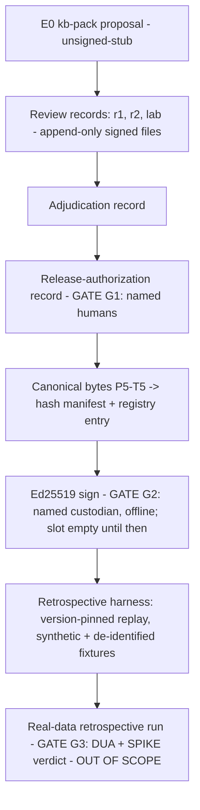

# Feature Brief & Metadata

**Feature Name:**

> Evidence Foundry E1 — clinical review workflow (ADR-0004 file model), signed preclinical
> release-candidate machinery (ADR-0005), retrospective validation harness (ADR-0006 boundary)

**Filepath Name:**

> `evidence-foundry-e1-v1`

**Date:**

> 2026-07-21

**Author:**

> Opus orchestrator (binding rulings R1–R6); PRD authored by `prd-writer` agent (sonnet)

**Related Epic(s)/PRD ID(s):**

> Evidence Foundry track. Successor to `evidence-foundry-buildout-v1` (E0, completed via PR #17).
> Covers design-spec §7.3 items 6, 10, 11 (plus item 5 as an upstream dependency — see Scope) of
> `docs/project_plans/expansion/02-evidence-foundry-on-research-foundry.md`.

**Related Documents:**

> See frontmatter `related_documents`. The planning brief
> (`.claude/worknotes/evidence-foundry-e1-v1/planning-brief.md`) is the condensed source record;
> the four ADRs cited above are the normative architecture inputs — **all currently
> `status: proposed`, none accepted** (see gate G0 below).

---

## 1. Executive Summary

This PRD scopes the E1 "operate" triad of the Evidence Foundry: (a) the **clinical review
workflow** as ADR-0004's append-only, git-tracked, signed review-record files with a CLI and a
minimal read-only rendering — explicitly *not* a portal; (b) the **signed preclinical
release-candidate machinery** per ADR-0005 — Ed25519 detached sign/verify tooling over E0's
proven canonical bytes plus a flat `releases/registry.json` — with signing itself a
human-executed, offline act by a named custodian who does not yet exist; and (c) the
**retrospective validation harness** per ADR-0006's de-identification boundary, running in E1
against synthetic and de-identified fixtures only. The human critical path — named credentialed
reviewers, adjudicator, release authorizer, signing custodian, data-partner DUA — is modeled
throughout as **external gates, never tasks**. Software delivers machinery plus synthetic
dry-runs; every gate stays fail-closed until real named humans clear it.

**Status honesty (binding, verbatim posture):** this project is an **unvalidated research
prototype**. Nothing this feature ships is, or may be described as, clinically validated, safe,
release-ready, or clinically activated. A "signed preclinical release candidate" is a
software-integrity artifact only; it stays inactive pending the silent-mode and human-factors
gates that are post-E1.

**Priority:** P1 — E0's converter output is an unreviewable dead end without a review workflow;
the retrospective rung (DF-E1-04's trigger) requires a release candidate to pin against; and the
data-source SPIKE (unrun) must be chartered now because its verdict gates all real-data work.

**Key Outcomes:**
- Outcome 1: A complete five-role review-record file workflow (reviewer 1, reviewer 2, lab,
  adjudication, release authorization) exists, schema-enforced, append-only, exercised end to end
  in a clearly-labeled synthetic dry-run — with `approvedBy[]`/`clinicalApprovers[]` still
  schema-forced empty because no qualifying human review exists.
- Outcome 2: Ed25519 sign/verify tooling and `releases/registry.json` exist and verify E0's
  canonical bytes deterministically; the signature slot on any real release candidate remains
  schema-forced empty until a named signing custodian exists (gate G2), mirroring the
  `clinicalApprovers[]` pattern. No agent- or CI-held signing keys, ever.
- Outcome 3: The retrospective validation harness replays a version-pinned release candidate
  against synthetic + de-identified fixtures deterministically, with the ADR-0006 data boundary
  structurally enforced; the retrospective **data-source SPIKE charter** is authored (the SPIKE
  run and any real-data validation are out of scope, gated on G3).

---

## 2. Context & Background

### Current State (what E0 delivered — the substrate)

- `tools/rf-bundle-to-kb-pack/` deterministic converter, proven against RF-CBC-001.
- `modules/cbc_suite_v1/` module package (4 rules; `module.json` `status: "unsigned-stub"`,
  `approvedBy: []` schema-forced empty), with `evidence-assertions.json`,
  `rule-provenance.json`, `authoring-decisions.yaml` sidecars and 4 new schemas wired into
  `scripts/validate-kb.mjs`.
- `release-manifest.unsigned.json` with the **P5-T5 canonical-serialization determinism proof —
  the exact bytes ADR-0005 signing composes over.** Signing MUST NOT diverge from this
  serialization (design spec §8.3 non-determinism risk).
- Slice test corpus (positive/negative/boundary/missingness/dangerous-miss); id-level semantic
  diff; evidence-registry unification.
- 8 proposed ADRs and 10 design-spec stubs.
- **Zero** review UI, roster, signing, registry, or retrospective artifacts.

### Problem Space

E0 produces schema-valid, traceable rule *proposals* that no human can formally review, no
release process can bind, and no validation rung can measure. Three gaps:

1. **No review workflow.** `CLAUDE.md` hard guardrails require "independent clinical review +
   executable tests + signed release" for any rule/KB change; today there is no artifact a
   reviewer could sign, no independence enforcement, no adjudication record, and two *competing
   paper models* (wave0's `schemas/review-record.schema.json` 5-state contract vs ADR-0004's
   five-role file model) that must be unified, not shipped in parallel.
2. **No release integrity.** `release-manifest.unsigned.json` proves byte-determinism but binds
   no identity. There is no registry, no verify tool, and no custody model — and SPIKE-006
   NO-GO'd cryptographic signing for the current single-maintainer deployment, a verdict this
   PRD reconciles rather than overrides (see §2a).
3. **No validation rung.** The E1 go gate requires retrospective dangerous-miss/utility metrics
   against a prespecified protocol; no harness, no adjudication model, no data source, and no
   DUA exist. The data-source SPIKE has not been run.

### 2a. SPIKE-006 reconciliation (binding ruling R3)

SPIKE-006's NO-GO on cryptographic signing **stands** for the anemia browser/static-Pages
deployment (same-origin circularity; signer = author under single-account custody, Amendment 2).
ADR-0005 recommends Ed25519 for the Evidence Foundry *preclinical release* path — a different
trust boundary, but the single-custodian objection carries. This PRD encodes the reconciliation:

- **NO agent- or CI-held signing keys, ever.** Signing is a human-executed, offline CLI act by a
  named custodian (gate G2). Key material never enters this repository, CI, or any agent
  context.
- **Until a custodian exists**, release candidates are hash-manifested with the `signature` slot
  **schema-forced empty** — the same fail-closed pattern as `clinicalApprovers[]`.
- E1 delivers the sign/verify **machinery** plus dry-runs using clearly-marked throwaway test
  keys only; the release-path validator must reject test-key identities on any real candidate.
- The signature ≠ author-self-attestation requirement is satisfied only when the named custodian
  is a distinct release authority; naming that custodian is a human act outside this plan.

### 2b. ADR posture (binding ruling R2)

All 8 pre-E1 ADRs are `status: proposed`; the E0 Phase-6 gate explicitly forbade acceptance.
**ADR acceptance is a named-human gate (G0), not a task of this plan.** Work not dependent on
acceptance proceeds (building machinery against the ADRs' recommended defaults is permitted —
the artifacts remain proposals); anything whose promotion trigger is literally "ADR accepted"
(e.g., DF-E1-06 promotion to production signing posture) stays gated at G0.

### Architectural Context

Not a layered web application: a deterministic content-build + governance pipeline around a
static/mirror clinical assessment engine (`docs/architecture.md` §2a module packages; §6/§7/§10
wave-0 safety substrate). All new tooling in this PRD is offline, build-time, fail-closed CLI
machinery; the deployed SPA/API are untouched. The only rendering surface added is **read-only**
(FR-7) — no server, no database, no authentication surface, no portal.

---

## 3. Problem Statement

> As the platform owner holding a verified, converter-produced rule-proposal pack, when I try to
> move it toward a reviewable, integrity-bound, retrospectively measurable state, I have no
> review-record workflow, no signing/verification machinery, and no validation harness —
> so the proposal is stuck at `unsigned-stub` with no auditable path forward, instead of a
> fail-closed pipeline where each advance is bound to a named human act.

**Technical Root Cause:**
- No `modules/<id>/reviews/` artifact type, CLI, or append-only enforcement exists.
- Two divergent review-record paper models exist (wave0 schema vs ADR-0004) with no mapping.
- No sign/verify tooling, no `releases/registry.json`, no verifier wired to the runtime or
  validators.
- No retrospective harness, no de-identification boundary enforcement, no data-source SPIKE.

---

## 4. Goals & Success Metrics

All goals are **software-behavior goals**. No goal is, or may be read as, a clinical-validity,
safety, or diagnostic-performance claim.

### Primary Goals

**Goal 1: Reviewable — five-role review-record workflow operates end to end**
- The full ADR-0004 sequence (reviewer 1 → reviewer 2 → lab → adjudication → release
  authorization) can be executed as append-only signed files with schema + CLI enforcement of
  independence and adjudicator-≠-author rules.
- Measurable: a synthetic dry-run produces all five record types; validators prove append-only,
  independence, and non-qualification (no approver field populated) properties.

**Goal 2: Integrity-bound — a release candidate verifies deterministically**
- `verify` over a hash-manifested (and, in dry-run, test-key-signed) release candidate passes
  against E0's canonical bytes and the registry entry, and fails closed on any byte drift,
  registry mismatch, or test-key leakage into a real candidate.
- Measurable: sign→verify roundtrip reproducible (byte-identical canonical input, stable
  verdict) across two independent runs; seeded tamper cases all fail verification.

**Goal 3: Measurable — the retrospective harness replays deterministically inside the boundary**
- The harness replays a version-pinned candidate against synthetic + de-identified fixtures,
  emits adjudication-ready discordance records and de-identified aggregate metrics with
  provenance, and structurally rejects any patient-identifiable input.
- Measurable: two harness runs over identical fixtures + pinned digest produce identical metric
  artifacts; seeded identifier-bearing fixtures are rejected fail-closed.

**Goal 4: Chartered — the human path is fully specified**
- Gates G0–G3 are documented with named-role requirements; the data-source SPIKE charter and the
  signing-ceremony runbook exist as reviewable documents.
- Measurable: charter + runbook exist; every gate has a documented owner-role, entry criteria,
  and the artifacts it unblocks.

### Success Metrics

| Metric | Baseline | Target | Measurement Method |
|--------|----------|--------|-------------------|
| Review-record role types executable via CLI + schema | 0 | 5/5 | Synthetic dry-run artifact set |
| Wave0 5-state ↔ ADR-0004 model mapping covered by test | none (2 parallel models) | 1 canonical model + migration test | `npm test` |
| Append-only / independence / adjudicator-≠-author violations caught | n/a | 100% of seeded violations rejected | Seeded-violation test suite |
| Sign→verify determinism (test keys, dry-run) | n/a | Byte-stable across 2 runs | Hash comparison test |
| Tamper/test-key-leak cases failing verification | n/a | 100% of seeded cases | `npm test` |
| Registry entries validating against registry schema | n/a | 100% (append-only enforced) | Validator + test |
| Harness determinism (2 runs, pinned digest) | n/a | Identical metric bytes | Hash comparison test |
| Identifier-bearing fixture rejection | n/a | 100% of seeded cases | `npm test` |
| Approver/signature fields populated by any E1 artifact | 0 | **0** (must stay 0) | Schema `maxItems: 0` / const-empty checks |
| Data-source SPIKE charter + ceremony runbook | 0 | 2 documents | File existence + review |

---

## 5. Personas & Journeys

**Primary persona — platform owner/engineer (the only user with real access in E1):** runs the
CLIs, executes synthetic dry-runs, maintains gates. Needs every tool fail-closed and every
synthetic artifact unmistakably labeled non-qualifying.

**Future personas (consumers, not E1 users):** named credentialed clinical reviewers, lab
reviewer, adjudicator, release authorizer (ADR-0004 roster); signing custodian (ADR-0005);
data-partner steward (ADR-0006). None exist yet; the workflow must be usable by them later
without redesign, which is why the review surface is plain files + CLI + read-only rendering.

### High-level Flow

---

## 6. Requirements

### 6.0 External human gates (binding ruling R4 — gates, never tasks)

| Gate | What it is | Cleared by | Blocks |
|---|---|---|---|
| **G0** | ADR acceptance (0001/0004/0005/0006 at minimum) | Named human (owner) edits ADR status after review | DF-E1-06 production-posture promotion; any "accepted"-triggered deferred item |
| **G1** | Reviewer roster real: 2 named credentialed clinical reviewers + lab reviewer + adjudicator + release authorizer, credentials verified out-of-band | Owner recruits + verifies; roster committed by human | Any non-synthetic review record; any population of `approvedBy[]`/`clinicalApprovers[]`; `unsigned-stub → release-ready` |
| **G2** | Signing custodian named; offline key ceremony executed per runbook | Owner designates custodian ≠ author-in-effect; human-run ceremony | Any real (non-test-key) signature; any registry entry with a production `keyId` |
| **G3** | Data-source SPIKE run to verdict + data-partner DUA executed | SPIKE (separately invoked) + human legal/partnership act | Real-data retrospective run (DF-E1-09); DF-E1-04 retention/deletion parameter fixing |

No task in the implementation plan may claim to clear a gate. Progress tracking must represent
gates as externally-blocked states, mirroring the P5 "owner-blocked" precedent.

### 6.1 Functional Requirements

**Workstream A — clinical review workflow (ADR-0004; §7.3 item 6; DF-E1-01 v1)**

| ID | Requirement | Priority | Notes |
| :-: | ----------- | :------: | ----- |
| FR-1 | Implement the ADR-0004 review-record file model: one append-only YAML file per review act at `modules/<module_id>/reviews/<review_id>.yaml`, covering exactly five record roles — clinical review 1, clinical review 2, laboratory review, adjudication, release authorization — each schema-validated. | Must | ADR-0004 recommended option; R1(a) |
| FR-2 | Unify the two review-record models (binding ruling R5): ADR-0004's five-role file model is canonical; produce an explicit documented mapping/migration of wave0's `schemas/review-record.schema.json` 5-state contract (`proposed/under-review/disputed/approved/rejected`, primary/secondary/conflict-arbiter, D-4 pins) onto it, preserving the D-4 structural guarantees (`reviewerType: "human"` const, `attestedHuman: true` const, approver arrays byte-compatible with `module-manifest`/`rule` schemas). Ship ONE canonical schema; the mapping is covered by ≥1 executable test. No parallel clinical-governance schemas may coexist unmapped. | Must | R5; wave0 EP7-T1/T2 |
| FR-3 | Reviewer identity in any record MUST reference a roster entry (name, credential reference, module-scope authorization). The roster file format and validator exist in E1; the roster itself ships **empty or synthetic-only** until G1. Synthetic entries are structurally marked (e.g., `synthetic: true` const) and can never satisfy a release-authorization validity check. | Must | ADR-0004; D-4; roster location per OQ-1 |
| FR-4 | Enforce reviewer-2 independence structurally: a reviewer-2 record must not reference reviewer-1's decision content, and CLI flows must not surface reviewer-1 output when scaffolding reviewer-2's record. Seeded-violation test required. | Must | ADR-0004 "no read dependency" |
| FR-5 | Adjudication is a distinct record; validators enforce adjudicator ≠ sole original author of the change under review, with the "author" identity for converter-produced rule sets defined per OQ-5's resolution. Seeded-violation test required. | Must | ADR-0004 |
| FR-6 | The release-authorization record is the ONLY artifact that can flip a module manifest `unsigned-stub → release-ready`, and only when every referenced record chain is valid, non-synthetic, and roster-verified (i.e., post-G1). Until then `scripts/validate-kb.mjs` (or successor) keeps the transition schema-impossible — `approvedBy[]`/`clinicalApprovers[]` stay `maxItems: 0`. E1 raises no ceiling. | Must | ADR-0004 terminal file; hard guardrails |
| FR-7 | Provide a review CLI (`tools/review-record/` or equivalent): scaffold a record for a given proposal + role, validate a record/chain, list review state per module. Offline, deterministic, no network, no generative model. | Must | R1(a) |
| FR-8 | Provide a **minimal read-only rendering** of the passage → decision → rule → test chain for a record under review (static HTML or CLI render from committed artifacts). Explicitly NOT a portal: no server, no database, no write path, no auth. Portal remains deferred (DF-E1-01, friction trigger per OQ-8). | Must | R1(a); DF-E1-01 boundary |
| FR-9 | Enforce append-only semantics: a validator (git-history- or hash-chain-based) rejects any mutation or deletion of an existing review record; corrections are new superseding records. Seeded-mutation test required. | Must | ADR-0004 |
| FR-10 | Review-record "signature" binds reviewer identity to the record's content hash using the ADR-0005 mechanism; in E1, only clearly-marked throwaway test keys are used (synthetic dry-run), and interim semantics before per-reviewer keys exist are resolved per OQ-2. Real reviewer keys are a G1/G2-adjacent human act. | Must | ADR-0004 ↔ ADR-0005 coupling |
| FR-11 | Execute one full synthetic dry-run of all five roles end to end with labeled synthetic personas; commit the artifact set as fixtures. Every synthetic artifact carries explicit non-qualifying language; the dry-run populates zero approver fields. | Must | R4 |

**Workstream B — signed preclinical release-candidate machinery (ADR-0005; §7.3 item 11; DF-E1-06 machinery only)**

| ID | Requirement | Priority | Notes |
| :-: | ----------- | :------: | ----- |
| FR-12 | Implement Ed25519 detached sign/verify tooling (`node:crypto` only — no new crypto dependency, no network) composing over **exactly** the P5-T5 canonical serialization E0 proved. A test asserts byte-identity between the signing preimage and E0's canonicalization for the same pack. | Must | ADR-0005; §8.3 divergence risk |
| FR-13 | `verify` is fail-closed with a documented exit-code taxonomy: any byte drift, digest mismatch, unknown `keyId`, registry inconsistency, or test-key identity on a non-dry-run candidate → non-zero exit, no partial output. | Must | ADR-0005 |
| FR-14 | Create flat, append-only, git-tracked `releases/registry.json` (version, digest, signer `keyId`, supersedes, withdrawal-state field) with schema + validator. E1 never sets withdrawal state (withdraw/rollback machinery is E2 — DF-E2-03); the registry is only the seed E2 extends. Registry location in-repo per ADR-0005 default, revisitable at G0 (OQ-3). | Must | ADR-0005; R1(b); E2 boundary |
| FR-15 | **No agent- or CI-held keys, ever** (binding ruling R3): no private-key material is committed, generated in CI, read by any agent tool, or required by any automated check. The signing verb is designed for human offline execution; automated tests exercise sign/verify only through fixture test keys whose `keyId`s carry a structural test marker that the release path rejects. | Must | R3; SPIKE-006 reconciliation |
| FR-16 | Until G2 clears, every real release candidate is hash-manifested with the `signature` slot **schema-forced empty** (const/maxItems pattern mirroring `clinicalApprovers[]`); a validator proves a populated signature slot on a real candidate fails validation pre-G2. | Must | R3 |
| FR-17 | Author the signing-ceremony runbook: human-executed offline key generation, custody, signing steps, rotation/compromise response ownership. A document deliverable — the ceremony itself is G2, out of scope. | Must | ADR-0005; DF-E1-06 spec OQs |
| FR-18 | Decide and implement the verifier surface per OQ-2's resolution (extend `scripts/validate-kb.mjs` vs a new `verify-release.mjs`), including where/whether the runtime or `npm run check` invokes verification. Verification must never soften the browser-deployment posture SPIKE-006 fixed (two-part digest, fail-closed, `unsigned-stub → integrity-recorded → superseded/revoked` enum untouched for the anemia browser path). | Must | SPIKE-006 stands for browser path |

**Workstream C — retrospective validation harness (ADR-0006; §7.3 item 10; DF-E1-04 machinery only)**

| ID | Requirement | Priority | Notes |
| :-: | ----------- | :------: | ----- |
| FR-19 | Implement a retrospective replay harness that runs a **version-pinned** release candidate (pinned by registry digest, never "current tree") against a fixture corpus, deterministically: two runs over identical inputs produce byte-identical metric artifacts. | Must | ADR-0006; DF-E1-04 |
| FR-20 | Enforce the ADR-0006 boundary structurally: **no patient-identifiable data ever enters this repo, its build outputs, or any `rf` run/writeback.** Fixture schemas forbid identifier fields; a validator rejects seeded identifier-bearing fixtures fail-closed. E1 fixtures are synthetic + de-identified only (binding ruling R6). | Must | ADR-0006 binding clause |
| FR-21 | Only de-identified aggregate metrics cross into the repo, each carrying a provenance record (source corpus id, harness version, candidate digest, run timestamp). | Must | ADR-0006 |
| FR-22 | Maintain a validation-data access log as an audit trail **distinct** from the review-record audit trail. | Must | ADR-0006 |
| FR-23 | Implement the discordance/adjudication data model: harness output vs reference-label disagreement produces adjudication-ready records consumable by the Workstream A review machinery; the adjudicator-≠-author mapping for rule-set "authorship" follows OQ-5's resolution. | Must | DF-E1-04 spec OQ |
| FR-24 | Define the prespecified-protocol *shape* (dangerous-miss rate, utility, subgroup/analyzer/site slots) as a schema with thresholds explicitly `null`/TBD-by-named-humans. The software never invents or defaults a clinical threshold; an unpopulated protocol renders any harness report "non-qualifying — protocol not prespecified by humans". | Must | No invented thresholds; E1 go gate shape |
| FR-25 | **Author the retrospective data-source SPIKE charter** (corpus/partner options, DUA requirements, retention + deletion trigger, replay pinning, Option-1 external-partner posture per ADR-0006). Charter authoring is IN scope (binding ruling R6); running the SPIKE and any real-data run are OUT (G3; DF-E1-09). | Must | R6 |
| FR-26 | Decide (per OQ-6) whether E0's dangerous-miss corpus is promoted as-is into the harness regression lane, and encode the decision as fixtures + test. | Should | DF-E1-04 spec OQ |

**Workstream D — cross-cutting**

| ID | Requirement | Priority | Notes |
| :-: | ----------- | :------: | ----- |
| FR-27 | Encode gates G0–G3 in the implementation plan and progress tracking as external human gates with owner-roles, entry criteria, and blocked artifacts — never as completable tasks. | Must | R2/R4 |
| FR-28 | Every new artifact, schema description, doc section, and rendered output produced by this feature carries the unvalidated-research-prototype posture; no artifact may state or imply clinical validity, safety, diagnostic performance, or regulatory status. Review-blocker. | Must | R4; CLAUDE.md |
| FR-29 | Update `docs/architecture.md` (review workflow, release signing/registry, retrospective harness sections) and add a `CHANGELOG.md` `[Unreleased]` entry. | Must | Conventions |
| FR-30 | For every item in §7 Deferred Items, ensure a named design-spec stub exists or is updated (existing stubs updated in place; new IDs get new stubs) so the implementation plan can create design-spec authoring tasks one-to-one. | Must | E0 FR-23 pattern |
| FR-31 | Rights posture carries forward: rights-restricted passages remain hash + selector references unless positively cleared (E0 OQ-2 precedent, ADR-0002); the review rendering (FR-8) must respect this and never inline a restricted passage. | Must | ADR-0002; R4 honesty items |

### 6.2 Non-Functional Requirements

**Determinism & offline posture:**
- Every CLI in this feature is offline, deterministic, and makes zero network calls and zero
  generative-model invocations. Byte-determinism is test-proven for signing preimages (FR-12)
  and harness outputs (FR-19).

**Security:**
- No private-key material in repo, CI, or agent context (FR-15). Test keys are fixtures with
  structurally-marked `keyId`s. No new cryptographic dependencies beyond `node:crypto`.
- No PHI anywhere (FR-20); the de-identification boundary is schema-enforced, not procedural.
- The read-only rendering adds no server, no auth surface, no write path.

**Reliability (fail-closed everywhere):**
- Every ambiguous condition — invalid record chain, mutated record, digest drift, unknown key,
  identifier-bearing fixture, unpopulated protocol — produces a non-zero exit and no partial
  output. No silent fallbacks.

**Compatibility:**
- `npm run check` stays green at every phase boundary; Node ≥ 20; new tests land as flat
  `tests/ef-*.test.mjs` files matching the existing `tests/*.test.mjs` glob (never modify the
  glob); committed goldens under `tests/fixtures/`.
- The anemia browser deployment's SPIKE-006 posture (two-part digest, status enum) is untouched.

**Observability:**
- Structured JSON/YAML audit artifacts (review chains, registry, access log, harness reports)
  are the audit surface. No OpenTelemetry requirement — offline CLI tooling, not services.

**Plan Generator Rule Compliance Notes** (for `implementation-planner`):
- **R-P1**: FRs enumerate bounded targets (5 record roles, named gates, named files) — no
  unbounded "all/across" phrasing.
- **R-P2**: no runtime API/patient-input fields added; not applicable.
- **R-P3**: applies where review-workflow and signing workstreams both touch
  `schemas/*` + `scripts/validate-kb.mjs` (FR-2/FR-6/FR-16/FR-18) — the plan must declare an
  `integration_owner` and a seam task for the validator/schema surface.
- **R-P4**: no `*.tsx`/SPA changes; the FR-8 rendering is static output — a smoke task should
  still verify it renders from committed artifacts.

---

## 7. Scope

### In Scope (binding ruling R1 — the triad only)

- **Clinical review workflow** (§7.3 item 6; ADR-0004): five-role append-only signed
  review-record files, canonical schema + wave0 mapping/migration, roster format (empty/
  synthetic until G1), CLI, append-only/independence/adjudication validators, minimal read-only
  rendering, one synthetic five-role dry-run. *No portal.*
- **Signed preclinical release machinery** (§7.3 item 11; ADR-0005 + R3): Ed25519 sign/verify
  over P5-T5 canonical bytes, `releases/registry.json` seed, schema-forced-empty signature slot
  until G2, test-key dry-runs, ceremony runbook, verifier-surface decision.
- **Retrospective validation harness** (§7.3 item 10; ADR-0006): version-pinned deterministic
  replay, structural de-identification boundary, discordance/adjudication data model, protocol
  shape with human-only thresholds, synthetic + de-identified fixtures, access log, **data-source
  SPIKE charter authoring**.
- Gates G0–G3 documentation; architecture/CHANGELOG updates; deferred-item spec stubs.
- §7.3 item 5 (methodologist/skeptic evidence council with consensus policy) is covered **only**
  as an upstream `rf` dependency (capability-ledger routing: upstream/RFUP) — no in-repo council
  build. See conflict note in §12.

### Out of Scope (each gets its own future plan or is externally owned)

- **Interactive review portal** — deferred DF-E1-01; trigger: demonstrated file-workflow
  friction (OQ-8), never pre-emptive build.
- **Real-data retrospective run** — DF-E1-09 (new); gated on G3 (DUA + SPIKE verdict).
- **Production signing ceremony / custodian onboarding** — G2 human act; machinery only here.
- **ADR acceptance** — G0 human act (R2).
- **Sibling E1 workstreams**: live discovery / Path-B parameterization and the 12-angle CBC run
  (§7.3 items 1–3, DF-E1-02); upstream `rf` validators (item 4, DF-E1-03 — `rf` repo, not
  here); full CBC Suite ontology/typed facts/rule authoring (item 7, DF-E1-08 new ID); property/
  mutation/conflict/semantic-diff test-CI expansion (item 8, DF-E1-07); FHIR/terminology
  mappings (item 9, DF-E1-05).
- **All E2 machinery** (§7.4): surveillance, impact graph, materiality, registry writeback,
  re-sign flow, production monitoring (DF-E2-02), withdraw/rollback (DF-E2-03) — E1 only ships
  the registry seed.
- **Design-spec §6.4 non-goals** (verbatim binding): second evidence crawler; generative rule
  writer; patient LLM path; guessed LOINC/UCUM; treating `rf verify`/council as clinical
  validation; single blended confidence score.
- Raising any `maxItems: 0` / schema-forced-empty ceiling (`approvedBy[]`,
  `clinicalApprovers[]`, signature slot) — human-gated, never this plan.

### Deferred Items (each named for one-to-one design-spec authoring tasks in the plan)

| Item ID | Category | Item | Reason Deferred | Trigger for Promotion | Target Spec Path |
|---|---|---|---|---|---|
| DF-E1-01 | prereq | Interactive clinical review portal | R1: v1 = files + CLI; portal only on demonstrated friction | Documented friction threshold met + reviewer roles named (OQ-8) | docs/project_plans/design-specs/clinical-review-portal-workflow.md |
| DF-E1-02 | prereq | CBC 12-angle live research op (Path-B hardening/adapters) | Sibling workstream; independent blockers (ADR-0008) | ADR-0008 resolved + own plan approved | docs/project_plans/design-specs/cbc-12-angle-research-operation.md |
| DF-E1-03 | prereq | Upstream `rf` validators (pediatric, exact-passage) | Lives in `rf` repo, not here | RFUP accepted upstream | docs/project_plans/design-specs/upstream-rf-validators-pediatric.md |
| DF-E1-05 | design | FHIR/terminology emitters | Sibling workstream | ADR-0003 accepted (G0-class) | docs/project_plans/design-specs/fhir-terminology-emitters.md |
| DF-E1-06 | design | Production signing posture promotion (custodian, HSM, real keys) | R3: machinery only until custodian + ADR-0005 acceptance | G0 (ADR-0005 accepted) + G2 (custodian + ceremony) | docs/project_plans/design-specs/signed-release-key-custody.md |
| DF-E1-07 | tech-debt | Property/mutation/semantic-diff CI expansion | Sibling workstream; coupled to rule-schema v2 | Rule-schema v2 migration begins (OQ-7) | docs/project_plans/design-specs/property-mutation-semantic-diff-ci.md |
| DF-E1-08 | design | Full CBC Suite ontology, typed facts, local profile contract, rule authoring (§7.3 item 7) | Sibling L workstream; may trip ADR-0001 v2 trigger | Own plan approved + OQ-7 trigger reading decided | *(new stub — plan authors it)* |
| DF-E1-09 | prereq | **Real-data retrospective validation run** | R6: gated on DUA + data-source SPIKE verdict | G3 cleared + prespecified protocol thresholds set by named humans | docs/project_plans/design-specs/retrospective-validation-harness.md |
| DF-E2-01/02/03 | prereq | Surveillance engine / production monitoring / withdraw-rollback | E2 (§7.4); E1 ships only the registry seed | E2 planning | docs/project_plans/design-specs/surveillance-update-registry-engine.md, production-monitoring-telemetry.md, withdraw-rollback-machinery.md |
| DF-EXT-01 | policy | 7 RFUP upstream `rf` enhancements | External repo (`agentic_meta_dev` routing via `op story`) | External — never tasks here | rf-handoff/README.md §6 |

---

## 8. Dependencies & Assumptions

### External Dependencies (human/organizational — see gates §6.0)

- **G0** ADR acceptance; **G1** reviewer roster; **G2** signing custodian + ceremony; **G3**
  data-source SPIKE verdict + DUA. All currently nonexistent; all non-delegable. Project memory:
  evidence grounding is already owner-blocked on attestation/licensing — the same human-gate
  pattern applies here.
- Upstream `rf` council/validator enhancements (§7.3 items 4–5 as consensus-policy machinery)
  — external RFUP dependency, modeled as dependency only.

### Internal Dependencies

- E0 substrate (all delivered): P5-T5 canonical serialization + `release-manifest.unsigned.json`;
  `modules/cbc_suite_v1/` proposal pack; `scripts/validate-kb.mjs` schema wiring; slice test
  corpus; `schemas/review-record.schema.json` (wave0 — FR-2 migration source).
- `npm run check` gate; Node ≥ 20; flat test-glob convention.

### Assumptions

- Building machinery against `proposed` ADR recommended-defaults is acceptable pre-G0 because
  all outputs remain proposals with fail-closed empty slots (R2); if G0 acceptance revises an
  ADR, affected machinery is reworked under a follow-up change, not silently patched.
- The synthetic dry-run corpus is sufficient to prove workflow mechanics; no claim about
  reviewer usability is made until real reviewers exist (that evidence feeds OQ-8).
- `releases/` at repo root is an acceptable new top-level path (ADR-0005 default; OQ-3 may
  relocate at G0).

### Feature Flags

None. Nothing this feature ships alters the deployed SPA/API; all artifacts are build-time /
governance files, inert until human gates clear.

---

## 9. Risks & Mitigations

| Risk | Impact | Likelihood | Mitigation |
| ----- | :----: | :--------: | ---------- |
| Signature slot or approver field accidentally becomes populatable pre-gate | High | Low | Schema-forced-empty (const/maxItems) + seeded-violation tests (FR-6, FR-16); review-blocker checks |
| Signing preimage diverges from P5-T5 canonical bytes | High | Medium | FR-12 byte-identity test against E0's proven serialization; no re-implementation of canonicalization |
| Test keys leak into a real candidate or registry entry | High | Low | Structural test-key `keyId` marker rejected by release-path validator (FR-13/FR-15) + tests |
| Parallel review-record schemas ship unmapped | Medium | Medium | FR-2 single-canonical-schema requirement + migration test; plan-level seam task (R-P3) |
| Synthetic dry-run artifacts mistaken for real clinical review (the known likely future-session mistake) | High | Medium | Explicit non-qualifying labels on every synthetic artifact (FR-11); `synthetic: true` const (FR-3); FR-28 honesty review-blocker |
| PHI enters fixtures via "de-identified" data that isn't | High | Low | Structural identifier-field prohibition + fail-closed scanner (FR-20); E1 = synthetic + de-identified fixtures only; real data gated at G3 |
| Human gates stall the whole feature | Medium | High | Gates modeled as external blocked states (FR-27); all software + dry-run work proceeds independently; SPIKE charter authored now so G3 can start early |
| Scope creep into portal, real-data runs, E2 machinery, or sibling workstreams | Medium | Medium | R1 boundary encoded in §7; deferred-item table with triggers; review-blockers on §6.4 non-goals |
| ADR revision at G0 invalidates built machinery | Medium | Medium | Machinery tracks ADR recommended-defaults, kept thin and file-based; registry/roster/records are all append-only plain files, cheap to migrate |

---

## 10. Target State (Post-Implementation)

**Owner experience:** the platform owner can scaffold and validate review records per role, run
the five-role synthetic dry-run, render a read-only review view of any proposal, hash-manifest a
release candidate, register it, verify it fail-closed, and replay it retrospectively against
synthetic fixtures — all offline, all deterministic. Every path that would confer real standing
(roster entry, approver field, real signature, real-data metrics, `release-ready`) is visibly
and structurally blocked pending its named human gate.

**Technical architecture:** `modules/<id>/reviews/` + roster (governance files) →
`releases/registry.json` (integrity seed) → retrospective harness (measurement machinery), all
validated in `npm run check`, with the wave0 review-record schema mapped into one canonical
model and the browser deployment's SPIKE-006 posture untouched.

**Observable outcomes:** all §4 success metrics green; the repository remains, and is documented
as remaining, an **unvalidated research prototype**; the only things standing between the
machinery and a genuine signed preclinical release candidate are the named human gates G0–G2 —
exactly as designed.

---

## 11. Overall Acceptance Criteria (Definition of Done)

### Functional Acceptance
- [ ] FR-1 through FR-31 implemented and independently verifiable.
- [ ] Five-role synthetic dry-run artifact set committed, every artifact labeled non-qualifying;
      zero approver/signature fields populated anywhere (verified by schema tests).
- [ ] Wave0 → ADR-0004 mapping documented, one canonical schema shipped, migration test passing.
- [ ] Seeded violations (record mutation, reviewer-2 dependence, adjudicator = author, tampered
      bytes, unknown/test keyId on real candidate, identifier-bearing fixture, populated
      signature pre-G2, populated protocol thresholds by software) — 100% rejected fail-closed.
- [ ] Sign→verify and harness replay determinism proven by hash comparison across two runs.
- [ ] `releases/registry.json` exists, schema-valid, append-only-enforced, withdrawal state unset.
- [ ] Data-source SPIKE charter and signing-ceremony runbook exist as reviewable documents.
- [ ] Deferred-items table mapped one-to-one to design-spec stubs (new stub for DF-E1-08/09
      content as needed).

### Technical Acceptance
- [ ] `npm run check` green at every phase boundary; no test-glob changes; Node ≥ 20.
- [ ] Zero network calls / zero generative-model invocations in any new tool (test-enforced).
- [ ] No private-key material in repo/CI/agent context; test keys structurally marked.
- [ ] Anemia browser path's SPIKE-006 digest/status posture byte-untouched.

### Quality & Governance Acceptance
- [ ] `task-completion-validator` per phase; `karen` milestone reviews at the plan's declared
      milestones; every hard guardrail and §7 non-goal explicitly checked at each milestone.
- [ ] Gates G0–G3 represented in progress tracking as external blocked states, never tasks.
- [ ] No artifact anywhere describes any output as clinically validated, safe, or release-ready.

### Documentation Acceptance
- [ ] `docs/architecture.md` sections + `CHANGELOG.md` `[Unreleased]` entry landed.
- [ ] Gates, runbook, and charter cross-referenced from the implementation plan.

---

## 12. Assumptions & Open Questions

### Ruling-vs-source tensions (flagged, not resolved here)

1. **§7.3 item 5 numbering vs capability ledger**: R1 includes item 5 (methodologist/skeptic
   council) in the triad's item numbering, but the §6.1 ledger routes evidence-council work
   upstream to `rf` (RFUP). This PRD treats item 5 as an external upstream dependency, not an
   in-repo deliverable; if an in-repo consensus-policy artifact was intended, that is a scope
   addition requiring an orchestrator ruling.
2. **SPIKE-006 vs ADR-0005 residual**: SPIKE-006's reopen trigger (second independent release
   authority OR deployed server-mode consumer) has not fired, and formal ARC re-review of the
   amended digest was never performed — yet ADR-0005 recommends Ed25519 for the EF release path.
   R3's reconciliation (machinery + human custodian, empty slot until G2) is encoded here, but
   G0's ADR-0005 acceptance review must record this reconciliation explicitly, including that
   the custodian must be a distinct release authority for signature ≠ self-attestation to hold.

### Open Questions

- [ ] **OQ-1**: Reviewer roster — file location, format ownership, and the out-of-band
      credential-verification procedure (ADR-0004 names the requirement, leaves mechanics open).
      Decide in the implementation plan; verification procedure itself is a G1 human act. — **TBD**
- [ ] **OQ-2**: Verifier surface — extend `scripts/validate-kb.mjs` vs new `verify-release.mjs`;
      whether/where `npm run check` or the runtime calls verification; and interim review-record
      signature semantics before per-reviewer keys exist (git signed commits vs detached
      test-key signatures for the dry-run). — **TBD (plan decision, FR-10/FR-18)**
- [ ] **OQ-3**: `releases/registry.json` in-repo vs separate repo, and the ownership boundary
      with DF-E2-01/DF-E2-03 extensions. Default: in-repo flat file per ADR-0005; revisit at G0.
      — **TBD**
- [ ] **OQ-4**: Retrospective data source — corpus/partner options, DUA shape, retention period
      + deletion trigger, replay-pinning obligations. **Resolved only by the data-source SPIKE**
      (charter authored under FR-25; SPIKE run is out of scope). — **TBD (G3)**
- [ ] **OQ-5**: Adjudicator-≠-author semantics when the "author" is a converter-produced rule
      set: who counts as the original author (authoring-decisions signer? converter operator?
      proposal committer?). Needed by FR-5 and FR-23. — **TBD (plan decision)**
- [ ] **OQ-6**: Promote E0's dangerous-miss corpus into the harness regression lane as-is, or
      re-derive under the harness fixture schema? — **TBD (plan decision, FR-26)**
- [ ] **OQ-7**: Rule-schema v2 trigger reading — does full CBC Suite authoring (DF-E1-08, out of
      this plan) constitute ADR-0001's "before multi-module E1 scale" trigger, thereby
      re-triggering DF-E1-07? Decide the reading now so sibling plans inherit it. — **TBD (G0/
      orchestrator)**
- [ ] **OQ-8**: Portal friction trigger — what measurable friction threshold promotes DF-E1-01,
      and who calls it? The synthetic dry-run (FR-11) should emit the first friction
      observations. — **TBD (human decision, post-dry-run)**

---

## 13. Appendices & References

- **Normative architecture inputs**: ADR-0004 (review model — canonical for the five-role file
  workflow), ADR-0005 (signing/registry), ADR-0006 (validation-data boundary), ADR-0001 (schema
  v2 trigger context). All `proposed`; acceptance = G0.
- **Design spec**: `docs/project_plans/expansion/02-evidence-foundry-on-research-foundry.md`
  §5.1/§5.3 (gate architecture), §6.1 (capability ledger), §7.3 (E1 scope + go gate), §7.4 (E2
  boundary), §8.3 (determinism risk).
- **SPIKE-006**: `docs/project_plans/SPIKEs/spike-006-kb-signing-key-custody-verification.md` —
  NO-GO stands for the browser path; reconciliation in §2a.
- **Design-spec stubs consumed**: `clinical-review-portal-workflow.md`, `review-portal-design.md`
  (paper data-contract input only), `signed-kb-manifest.md` (superseded in scope by
  `signed-release-key-custody.md`), `retrospective-validation-harness.md`,
  `withdraw-rollback-machinery.md` (E2 boundary reference only).
- **Wave0 migration source**: `schemas/review-record.schema.json` (5-state, D-4 pins) — FR-2.
- **E0 anchor**: `docs/project_plans/PRDs/infrastructure/evidence-foundry-buildout-v1.md` and
  its implementation plan (42 pts / 7 phases) — the H5 estimation anchor; the brief signals this
  triad is ≥ E0-sized (two L items), so the plan may propose a multi-plan split at gate review.

---

## Implementation

**This PRD does not sequence tasks or assign subagents** — the Implementation Plan
(`docs/project_plans/implementation_plans/infrastructure/evidence-foundry-e1-v1.md`, to be
authored) owns detail, phase files, batches, and agent routing. The sketch below is the binding
scope-to-phase map only.

**Phase 1 — Review-record foundation (Workstream A core)**
- Canonical review-record schema; wave0 mapping/migration + test (FR-2); roster format
  (synthetic-only); append-only/independence/adjudication validators (FR-1, FR-3–FR-6, FR-9).

**Phase 2 — Review CLI, rendering, synthetic dry-run**
- Review CLI (FR-7); read-only rendering (FR-8, rights-respecting per FR-31); five-role
  synthetic dry-run with test-key signatures (FR-10, FR-11). Milestone review.

**Phase 3 — Sign/verify machinery + registry (Workstream B)**
- Ed25519 sign/verify over P5-T5 bytes (FR-12, FR-13); `releases/registry.json` + schema
  (FR-14); no-agent-keys + schema-forced-empty enforcement (FR-15, FR-16); verifier-surface
  decision (FR-18, OQ-2); ceremony runbook (FR-17). Milestone review.

**Phase 4 — Retrospective harness (Workstream C)**
- Version-pinned deterministic replay (FR-19); de-identification boundary + access log (FR-20 –
  FR-22); discordance/adjudication model (FR-23); protocol shape (FR-24); fixture decisions
  (FR-26).

**Phase 5 — Charter, gates, docs, deferral closure (Workstream D)**
- Data-source SPIKE charter (FR-25); gates G0–G3 encoded in tracking (FR-27); honesty sweep
  (FR-28); architecture/CHANGELOG (FR-29); deferred-item spec stubs one-to-one (FR-30).
  Milestone review — feature end.

Natural sequencing (brief risk 8): review workflow → signing/registry → retrospective harness,
with the SPIKE charter and gate documentation in a parallel lane. Phases 3 and 4 depend on
Phase 1's schema surface; Phase 4 additionally consumes Phase 3's registry pinning.

---

**Progress Tracking:**

`.claude/progress/evidence-foundry-e1/` (created during execution, one file per phase; gates
G0–G3 tracked as external blocked states, mirroring the P5 owner-blocked precedent).

**Human Brief** (Tier 3, mandatory): `docs/project_plans/human-briefs/evidence-foundry-e1.md`
— must migrate §6.0's gate table and §12's tensions + open questions into its owner-action
ledger.
