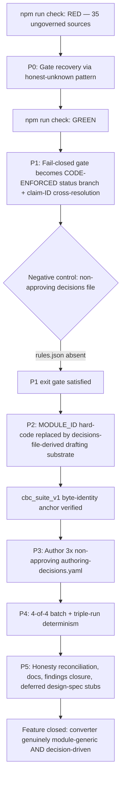

# Feature Brief & Metadata

**Feature Name:**

> Multi-Bundle Conversion E1 — Finish the Converter Pass

**Filepath Name:**

> `multi-bundle-conversion-e1-finish`

**Date:**

> 2026-07-23

**Author:**

> PRD authored by `prd-writer` agent (sonnet), from an Opus decisions block

**Related Epic(s)/PRD ID(s):**

> Evidence Foundry track (`docs/project_plans/expansion/00-expansion-plan.md`); direct follow-on to
> `multi-bundle-conversion-e1` (E1), which produced 2 new module scaffolds and evidence-layer
> projections for all 4 bundles but left three of them unable to complete `propose` through the real
> converter. IntentTree node `node_01KXRTYFZVCRCM5FHYPHRJJC3R` (EF-WP0 converter).

**Related Documents:**

> - `docs/project_plans/SPIKEs/spike-009-converter-module-genericity.md` — the evidence base for
>   every phase boundary below; disproves the originating request's premise and enumerates the two
>   code blockers this PRD exists to close.
> - `docs/project_plans/PRDs/infrastructure/multi-bundle-conversion-e1.md` — the prior PRD this one
>   follows on from. Its FR-9 ("no approved decision ⇒ no `rules.json`") is the property this PRD
>   makes real; its FR-22 ("no task authors a new `authoring-decisions.yaml`") is narrowly superseded
>   by this PRD's FR-F5 (see §7 Scope, non-negotiable boundary).
> - `docs/project_plans/implementation_plans/infrastructure/multi-bundle-conversion-e1.md` — the
>   prior implementation plan; its Phase 6 findings (shared-mutable-state test hazard,
>   unreproducible-provenance gap for kidney/growth) are retired by this PRD's phases.
> - `.claude/findings/multi-bundle-conversion-e1-findings.md` — findings #1 (test hazard), #3
>   (unreproducible provenance), #4 (P1-T7 AC overstatement), and the merge-blocker rights-schema
>   finding this PRD's Phase 0 retires.
> - `.claude/worknotes/multi-bundle-conversion-e1-finish/decisions-block.md` — the binding Opus
>   decisions block this PRD and its implementation plan expand.
> - `docs/project_plans/design-specs/df-e1-m1-rule-authoring-workflow.md` — deferred rule-authoring
>   workflow design spec, referenced by DF-E1-M1.

---

## 1. Executive Summary

**Premise correction, stated first because it governs everything below:** the request that
originated this PRD assumed the remaining blocker was purely the missing per-module
`authoring-decisions.yaml` files for `anemia`, `kidney_suite_v1`, and `growth_suite_v1` — write three
YAML files, and the real converter would run all four bundles the way it already runs
`cbc_suite_v1`. **SPIKE-009 disproved this empirically.** Two independent code-level blockers sit
behind the missing files and fire before either file's content is ever consulted: (1) a hard-coded
module-identity gate (`tools/rf-bundle-to-kb-pack/lib/rule-candidate-drafts.mjs:75`,
`lib/verbs/propose.mjs:568-575`) that refuses `propose` for any module whose id is not the literal
string `'cbc_suite_v1'`; and (2) `propose.mjs` never parses a decision's `status` at all — the rule
content it emits for the one module it does support is a hard-coded constant chain
(`RULE_PROPOSALS`→`PARTIAL_STRICT_RULES`→`STAGED_STRICT_RULES`) written **unconditionally** on every
successful run. Consequently the prior PRD's FR-9 — "no approved decision record ⇒ no `rules.json`"
— is documented and schema-modeled but **not enforced in code**. Authoring three YAML files alone
would accomplish nothing; worse, making the converter module-generic *before* arming this gate would
convert a latent guardrail hole into a live, armed exposure across three clinical modules.

This PRD scopes the corrected work: make `tools/rf-bundle-to-kb-pack` genuinely module-generic **and**
genuinely decision-driven, in that order, so all four verified `rf` evidence bundles
(`rf-ev-001`, `rf-cbc-002`, `rf-kid-001`, `rf-gro-002`) project into their target modules reproducibly
through the real, committed converter — while a newly code-enforced fail-closed gate guarantees the
three previously-bespoke modules emit **zero** new clinical rules. It also greens the repo's currently
red `npm run check` gate (35 sources across 3 modules lack rights-metadata fields required by a
since-merged PR; SPIKE-009 Leg B proved this is fully mechanical, requiring zero human legal or
clinical determination, via the already-committed EPR0-T4 honest-`unknown` pattern), retires three
findings from the prior pass (shared-mutable-state test hazard, unreproducible-provenance gap for
kidney/growth, a P1-T7 AC overstatement), and closes the loop the prior pass could not: a real,
reproducible, 4-of-4 batch conversion with proven determinism.

**Priority:** HIGH — this PRD closes the one remaining structural gap between "the converter exists
and is proven for 1 module" and "the converter is a genuinely reusable EF-WP0 capability." It also
unblocks a currently red main-line gate.

**Key Outcomes:**
- Outcome 1: `npm run check` is green from a clean tree, with every new rights-metadata record
  honestly marked `overall_status: "UNKNOWN"` / `review_status: "agent_triage_only"` — no human legal
  or clinical determination is asserted anywhere in this pass.
- Outcome 2: FR-9's fail-closed property becomes **code-enforced**: a decisions file with no
  `approved_for_rule_draft` decision cannot produce `rules.json`/`rule-provenance.json`, proven by a
  negative-control test, not by prose.
- Outcome 3: The converter runs `inspect → verify → propose` for all four bundles;
  `cbc_suite_v1`'s existing, already-verified output stays SHA-256 byte-identical throughout; the
  other three modules emit evidence-layer artifacts and an inert `rule-proposals.json` only — never
  `rules.json` or `rule-provenance.json`.

### SPIKE Reference (not a waiver — this PRD has a completed SPIKE)

Unlike the prior E1 PRD (which waived a SPIKE against 8 pre-existing ADRs), this PRD is grounded in a
freshly completed, targeted SPIKE (`SPIKE-009`) that empirically tested — against the real repo, via
mirrored read-only module directories — both the converter-genericity premise (disproved) and whether
`npm run check` can be greened without human legal input (confirmed: yes). Every phase boundary below
traces directly to a SPIKE-009 finding; no phase asserts a mechanism SPIKE-009 did not verify.

---

## 2. Context & Background

### Current State

- **E1 (the prior PRD) shipped 2 new module scaffolds and evidence-layer projections for all 4
  bundles, but zero of the 3 non-`cbc_suite_v1` bundles can complete `propose`.** `rf-kid-001` and
  `rf-gro-002`'s evidence-layer JSON files were produced by bespoke, uncommitted one-off generators
  (finding #3) rather than the real converter; `anemia`'s generator is committed
  (`scripts/evidence/oneoff/gen-anemia-evidence-assertions.py`) but carries zero automated-test
  coverage.
- **`propose.mjs` hard-codes `MODULE_ID = 'cbc_suite_v1'`** (`rule-candidate-drafts.mjs:75`) and
  throws `UsageError` for any other module id (`propose.mjs:568-575`), independent of anything in
  `authoring-decisions.yaml`. SPIKE-009 Leg A confirmed this empirically for all three target
  modules: `inspect`/`verify` pass (module content is structurally valid), `propose` fails closed
  with an identical `UsageError` for all three.
- **`authoring-decisions.yaml`'s `status` field is inert at runtime.** SPIKE-009 Leg A traced
  `propose.mjs`'s two reads of the decisions file — a path-equality check on the `--decisions` flag,
  and a raw-bytes traceability hash — and confirmed zero references to `pinned.decisions.parsed`
  anywhere in the file. `writeStagedRulesAndProvenance()` (`scripts/evidence/govern-staged-rules.mjs`)
  writes `rules.json`/`rule-provenance.json` unconditionally on every successful run, for the one
  module it currently supports.
- **`npm run check` is red.** 27 failing tests + `npm run validate` errors, all tracing to 4
  independent, purely mechanical root causes (SPIKE-009 Leg B): 35 sources across `cbc_suite_v1`,
  `kidney_suite_v1`, `growth_suite_v1` lack rights-metadata fields a since-merged PR (`origin/main`
  PR #20 "Rights-Aware Evidence Capture") now requires; a stale `p4-t1-pre-merge-snapshot.json.txt`
  fixture; a negation-regex false positive in a docs test; an unbuilt `dist/`.
- **Runtime `clm_*`/`evas_*` ID cross-resolution does not exist.** SPIKE-009 Leg A confirmed the
  schema pattern-checks `rf_claim_ids[]`/`exact_assertion_ids[]` format only — never against the real
  `claim_ledger.yaml` or `evidence-assertions.json` at runtime. Once decisions-file content drives
  output (this PRD's Phase 2), an invented claim ID becomes a fabrication vector.
- **Prior findings this PRD retires:** finding #1 (shared-mutable-state test hazard in
  `tests/ef-converter-rule-candidate-drafting.test.mjs` / `-rule-provenance-projection.test.mjs`),
  finding #3 (unreproducible-provenance gap for kidney/growth evidence layers), finding #4 (P1-T7
  rights-leakage-gate AC overstating byte-level coverage it does not provide), and the merge-blocker
  rights-schema finding (35 ungoverned sources red-lining `npm run check`).

### Problem Space

The converter is proven for exactly one module. Nothing today prevents a future engineer from
"finishing the job" the way the originating request assumed — authoring three YAML files — and
discovering, only after the fact, that doing so changes nothing (the hard-coded gate still refuses)
or, worse, that removing the hard-coded gate without first arming the `status` field turns an
accidental protection into an armed exposure: AI-drafted `rules.json` output for three clinical
modules with nothing but an inert documentation field standing in the way.

### Current Alternatives / Workarounds

Continue producing kidney/growth evidence layers via bespoke, uncommitted one-off scripts outside the
converter (the E1-era pattern) — which is not reproducible, not test-covered, and does not scale to
any future fifth module. This is the exact workaround finding #3 flags as unacceptable.

### Architectural Context

Same deterministic content-build pipeline the prior PRD and E0 established
(`docs/architecture.md` §2a): each module is a self-contained package at `modules/<id>/`; the
converter is a build-time producer; only a human-gated release-assembly step (out of scope for both
PRDs) merges an approved pack into runtime-loaded content. This PRD's central architectural
contribution is making the `status` field on `authoring-decisions.yaml` a **live runtime gate**
instead of validated-but-unread documentation — the single missing piece that makes "decision-driven"
true rather than aspirational.

---

## 3. Problem Statement

**User Story Format:**

> As a platform engineer who inherited a converter proven for exactly one module and three unused
> evidence bundles, I cannot simply author the missing `authoring-decisions.yaml` files to unlock
> them — SPIKE-009 proved that would accomplish nothing, because a hard-coded module gate refuses
> them regardless, and the `status` field that is supposed to prevent AI-drafted rule emission is
> never actually read by the converter. I need the converter to become both module-generic and
> genuinely decision-driven, in an order that never exposes a window where three clinical modules can
> emit AI-drafted rules with nothing but an inert documentation field standing in the way.

**Technical Root Cause:**

- `tools/rf-bundle-to-kb-pack/lib/rule-candidate-drafts.mjs:75` — `MODULE_ID` is a hard-coded literal,
  not a registry.
- `tools/rf-bundle-to-kb-pack/lib/verbs/propose.mjs:568-575` — the module-identity throw site,
  independent of decisions-file content.
- `tools/rf-bundle-to-kb-pack/lib/verbs/propose.mjs` — zero references to `pinned.decisions.parsed`;
  the `status` enum (`approved_for_rule_draft | rejected | withdrawn`) is validated for shape by JSON
  Schema and cross-checked by hand-written tests, but never branched on at runtime.
- `scripts/evidence/govern-staged-rules.mjs:73-89` — `writeStagedRulesAndProvenance()` writes
  `rules.json`/`rule-provenance.json` with no conditional logic of any kind.
- `schemas/authoring-decisions.schema.json` — `rf_claim_ids[]`/`exact_assertion_ids[]` are
  pattern-checked only; no runtime cross-resolution against `claim_ledger.yaml` /
  `evidence-assertions.json` exists.
- 35 sources across `cbc_suite_v1`, `kidney_suite_v1`, `growth_suite_v1` lack `license`,
  `access_basis`, `terms`, `terms_snapshot` (sources) and `evidence_item_type`, `judgment_basis`
  (passages) fields a since-merged PR now requires; no `rights/rights-records.json` /
  `rights-ledger.json` entries exist for any of them.

---

## 4. Goals & Success Metrics

All measurement methods below run on `node:test` only, in this zero-dependency, Node ≥20 repo — no
DOM tests, no snapshot libraries, no browser drivers. (A prior plan in this program was rejected for
exactly this class of AC; every metric here is directly executable in CI as it stands today.)

### Primary Goals

**Goal 1: Recover a green `npm run check` gate, honestly**
- Every failing test/validate error traces to a fix using the repo's own already-committed
  honest-`unknown` pattern (`RR-AAP2026_IDA` precedent) — never a fabricated rights/license
  determination.
- Measurable: `npm run check` exits 0 from a clean tree; a negative-control test asserts zero field
  minted by this pass moved off `overall_status: "UNKNOWN"` / `judgment_basis: "unassessed"`.

**Goal 2: Make FR-9's fail-closed property real, in code, before genericity lands**
- A decisions file with no `approved_for_rule_draft` decision cannot produce `rules.json` or
  `rule-provenance.json` — provable by file-absence assertion, not by inspecting prose.
- Measurable: a negative-control `node:test` case runs `propose` against a decisions file where every
  decision is `rejected`/`withdrawn`/non-approving, and asserts (a) `rules.json` does not exist in the
  output tree, (b) `conversion-report.json` records a non-zero, named refusal reason.

**Goal 3: Make the converter module-generic without regressing `cbc_suite_v1`**
- All three previously-bespoke modules reach the (now code-enforced) emission gate instead of a
  `UsageError`, and are refused by the *gate*, not by the mechanical module-identity check.
- Measurable: `cbc_suite_v1`'s `propose` output is SHA-256 byte-identical, file-by-file, to its
  pre-change manifest (captured as a P2 prerequisite task) — the regression anchor for this entire
  PRD.

**Goal 4: Reproducible 4-of-4 batch conversion with proven determinism**
- `batch` completes `inspect → verify → propose` for all four bundles; three independent runs produce
  SHA-256-identical bytes for every emitted file, across all four bundles and the aggregate
  `multi-bundle-conversion-report.json`.
- Measurable: a `node:test` determinism harness runs `batch` three times against byte-identical
  fixture inputs and diffs every output file's SHA-256.

### Success Metrics

| Metric | Baseline | Target | Measurement Method |
|--------|----------|--------|--------------------|
| `npm run check` exit code | 1 (red) | 0 (green) | CI run from clean tree |
| Rights-metadata fields backfilled honestly (`overall_status: "UNKNOWN"`) | 0/35 | 35/35 | `node:test` negative control over `rights/rights-records.json` |
| FR-9 fail-closed property | documented, not enforced | code-enforced | negative-control test: non-approving decisions file → `rules.json` absent |
| Runtime `clm_*`/`evas_*` cross-resolution | none | enforced, typed error | `node:test` seeding an invented claim ID → `UnresolvedClaimReferenceError` |
| Modules reaching `propose`'s emission gate (not `UsageError`) | 1 (`cbc_suite_v1`) | 4 | `node:test` per-module invocation, asserting refusal reason class |
| `cbc_suite_v1` output byte-identity across the genericity refactor | N/A | 100% (SHA-256) | pre/post manifest diff, `node:test` |
| Bundles completing `inspect → verify → propose` end-to-end | 1 (`cbc_suite_v1`) | 4 | batch run log / `multi-bundle-conversion-report.json` |
| Determinism (3 independent batch runs → identical bytes, all 4 bundles) | unverified for 3/4 | pass, all 4 bundles | `node:test` triple-run SHA-256 comparison |
| New clinical rules emitted (anemia, kidney_suite_v1, growth_suite_v1) | N/A | 0 | `git diff` of every `modules/{anemia,kidney_suite_v1,growth_suite_v1}/rules.json` |
| `authoring-decisions.yaml` files authored, all non-approving | 1 (`cbc_suite_v1`, approving) | +3 (all non-approving) | schema validation + `review.*` fields all `pending` |
| Committed generator scripts for kidney/growth evidence layers | 0 | 2 (or retired via converter path) | `node:test` regenerate-and-diff against committed output |
| Prior findings retired (#1 test hazard, #3 unreproducible provenance, #4 AC overstatement) | 0/3 | 3/3 | findings doc `status: accepted`, cross-referenced fix commits |

---

## 5. User Personas & Journeys

### Personas

**Primary Persona: Platform/backend engineer (this feature's direct user)**
- Role: closes the fail-closed gate hole, generalizes the converter, authors the three non-approving
  decisions files, proves 4-of-4 determinism.
- Needs: a converter that refuses the right things for the right reasons — a `UsageError` when a
  module truly isn't registered, a governed refusal when a decision isn't approved — never one
  standing in for the other.
- Pain Points today: the only thing preventing AI-drafted rule emission for 3 clinical modules is an
  accidental string-literal check; removing it without a real replacement is a guardrail regression
  waiting to happen.

**Secondary Persona: Future clinical reviewer (downstream consumer, not this feature's user)**
- Role: will eventually review the non-approving decisions files this PRD authors and decide whether
  to promote any decision to `approved_for_rule_draft` — an explicit, separate, human act this PRD
  does not perform and does not enable any agent to perform.
- Needs: a decisions file whose `reasoning` paraphrases only a cited claim, never invents a threshold;
  all four `review.*` roles left `pending`, never populated by this pass.

### High-level Flow

---

## 6. Requirements

### 6.1 Functional Requirements

Fresh numbering with an `F` prefix (finish) so these IDs never collide with the prior PRD's FR-1..FR-24.

| ID | Requirement | Priority | Notes |
| :-: | ----------- | :------: | ----- |
| FR-F1 | Backfill the 35 ungoverned sources (`cbc_suite_v1` 12, `kidney_suite_v1` 12, `growth_suite_v1` 11) with the schema's honest-`unknown` rights fields (`license`, `access_basis`, `terms`, `terms_snapshot` on sources; `evidence_item_type`, `judgment_basis`, `judgment_basis_attestation: null`, `rights_component_class`, `structured_locator`, typed `not_captured` on passages), mirroring the already-committed `RR-AAP2026_IDA` / EPR0-T4 pattern verbatim. Every new field asserts nothing beyond the schema's own `unknown`/`unassessed` enum members — no license status, access basis, or judgment-basis determination is ever asserted. | Must | SPIKE-009 Leg B; `RR-AAP2026_IDA` precedent |
| FR-F2 | Mint 35 new triage-only entries in `rights/rights-records.json` (`RR-<sourceId>`, `overall_status: "UNKNOWN"`) plus matching join entries in `rights/rights-ledger.json`; every new record's `review.assessed_by_agent` carries a marker naming this feature, `review.review_status: "agent_triage_only"`, `review.human_reviewer: null`, `review.counsel_reviewer: null` — never mistakable for a clearance. | Must | SPIKE-009 Leg B; Risk 3 (decisions block §3) |
| FR-F3 | Regenerate the stale `tests/fixtures/p4-t1-pre-merge-snapshot.json.txt` fixture (via `scripts/lib/p4-t1-snapshot.mjs`'s `computeSnapshot()`) against current HEAD; fix the `notice-architecture-no-clearance.test.mjs` negation-marker false positive (reword the `docs/architecture.md` sentence or extend the regex); ensure `npm run build` runs before `npm test` so the `dist/`-dependent assertions pass. | Must | SPIKE-009 Leg B residual failures |
| FR-F4 | `npm run check` (per `CLAUDE.md`'s authoritative script string) exits 0 from a clean tree once FR-F1–FR-F3 land, with zero field moved off the schema's own `unknown`/`unassessed`/`null` honest-triage vocabulary. | Must | Goal 1; `tests/claudemd-check-gate.test.mjs` |
| FR-F5 | **Prior PRD FR-22 is superseded, narrowly.** This pass DOES author new `authoring-decisions.yaml` files for `anemia`, `kidney_suite_v1`, and `growth_suite_v1` — the thing FR-22 said no task would do. The supersession is scoped exactly as follows and no further: every decision record in every file authored by this pass carries a **non-approving** `status` (see FR-F6/OQ-1 for the exact enum value); every one of the four `review.*` roles (`evidence_methodologist`, `clinician_1`, `clinician_2`, `laboratory_medicine`) is left `pending`; no task in this pass sets any decision's `status` to `approved_for_rule_draft`; human clinical approval of any decision remains an explicit, separate, out-of-scope human act this PRD does not perform and enables no agent to perform. This FR does not silently contradict FR-22 — it documents the scoped exception in place, in both PRDs. | Must | Decisions block §0, OQ-E; CLAUDE.md "No AI-published rule changes" |
| FR-F6 | Prior PRD **FR-9 becomes CODE-ENFORCED.** Add a new, visibly-non-approving `status` enum value to `schemas/authoring-decisions.schema.json` (exact name resolved per OQ-1 below); make `propose.mjs` read `pinned.decisions.parsed` and branch on each cited decision's `status` at runtime; `writeStagedRulesAndProvenance()` becomes conditional — it MUST NOT be invoked, and MUST NOT write `rules.json`/`rule-provenance.json`, unless at least one resolved, cross-validated decision for the claim(s) in question carries `status: approved_for_rule_draft`. `rejected` and `withdrawn` decisions block emission identically to the new non-approving status. A new `RuleEmissionRefusedError` taxonomy entry (or equivalent) names the specific refusal reason in `conversion-report.json`. | Must | SPIKE-009 verdict; decisions block §0/OQ-A |
| FR-F7 | Add runtime cross-resolution of every `rf_claim_ids[]` entry against the bundle's own `claims/claim_ledger.yaml` and every `exact_assertion_ids[]` entry against the module's `evidence-assertions.json`, invoked by `propose` (not left to hand-written tests alone). An ID that does not resolve throws a typed `UnresolvedClaimReferenceError` before any output is written. This ships alongside FR-F6, not deferred to Phase 2. | Must | SPIKE-009 Leg A "ID cross-resolution NOT enforced"; decisions block §7 OQ-C |
| FR-F8 | A negative-control `node:test` proves FR-F6/FR-F7 together: a decisions file where every decision is non-approving (or cites an unresolvable ID) MUST NOT result in `rules.json`/`rule-provenance.json` appearing anywhere in the `propose` output tree, and MUST result in a named, non-zero refusal captured in `conversion-report.json`. | Must | Goal 2; decisions block §1 P1 exit gate |
| FR-F9 | Capture a SHA-256 manifest of `cbc_suite_v1`'s current, real `propose` output (every emitted file) BEFORE any Phase 2 code change lands. This manifest is the hard regression anchor for FR-F10. | Must | Decisions block Risk 2; `tests/ef-converter-determinism.test.mjs` harness shape |
| FR-F10 | Replace the hard-coded `MODULE_ID = 'cbc_suite_v1'` single-module identity with a per-module drafting registry (or, per the decisions-block prior in OQ-2 below, content derived wholly from each module's own parsed decisions file). `propose` runs for any of the 4 registered modules without throwing the module-identity `UsageError`. `cbc_suite_v1`'s output MUST be byte-identical to the FR-F9 manifest, file-by-file, SHA-256, after this change. | Must | SPIKE-009 verdict; decisions block Risk 2, P2 exit gate |
| FR-F11 | For `anemia`, `kidney_suite_v1`, `growth_suite_v1` (all three lacking any `approved_for_rule_draft` decision by design, per FR-F5), `propose` MUST emit only: `evidence.json` source records, `evidence-assertions.json` exact-passage projections, conflict-visible objects, `unresolved.json` entries, `pack-provenance.json`, `conversion-report.json`, `semantic-diff.json`, and an **inert** `rule-proposals.json` (proposals recorded, never promoted, never schema-validated as a runtime `candidates.json`). It MUST NEVER emit `rules.json` or `rule-provenance.json` for any of these three modules. | Must | Decisions block §0 locked scope decision — binding |
| FR-F12 | Author non-approving `authoring-decisions.yaml` files for `anemia`, `kidney_suite_v1`, `growth_suite_v1`, each binding to real `clm_*`/`evas_*` IDs drawn from that module's own committed fixtures (`tests/fixtures/rf-*/claims/claim_ledger.yaml`, `modules/<id>/evidence-assertions.json`). Every `reasoning` field paraphrases only its cited claim's text — no invented threshold, no clinical judgment beyond what the cited claim supports. All four `review.*` roles are `pending` in every record, in every file. | Must | FR-F5; decisions block Risk 5; SPIKE-009 minimum-valid-content section |
| FR-F13 | Schema-validate and cross-resolve all three FR-F12 files at authoring time (reusing FR-F7's runtime resolver as the validation mechanism, not a bespoke one-off check) — every cited `clm_*`/`evas_*` ID must exist in its module's real fixtures. | Must | Risk 4 (decisions block); consistency with FR-F7 |
| FR-F14 | Extend `batch` to complete `inspect → verify → propose` for all four `BATCH_PAIRS` (adding `anemia`, `kidney_suite_v1`, `growth_suite_v1` to the existing `cbc_suite_v1` pair); `aggregate` emits a real 4-module `multi-bundle-conversion-report.json` with per-bundle claim/conflict/unresolved/rule counts (expected: 0 rules for 3 of 4 modules). | Must | Decisions block P4; prior PRD FR-5 (extends, does not replace) |
| FR-F15 | Three independent `batch` runs against byte-identical fixture inputs and the same converter version MUST produce byte-identical output (SHA-256) across every emitted file, for all four bundles independently and for the aggregate report. | Must | Decisions block P4 exit gate; Goal 4 |
| FR-F16 | Author and commit generator scripts for `kidney_suite_v1` and `growth_suite_v1` evidence-layer output (retiring the prior pass's bespoke, uncommitted one-off generators — finding #3), OR retire the need for them entirely by having the now-module-generic converter (FR-F10/FR-F11) produce that output directly going forward — whichever the implementation plan determines is the correct closure path for finding #3 (see OQ-6 below). Either path MUST leave kidney/growth evidence-layer output regenerable from committed code and covered by `npm run check`. | Must | Findings doc finding #3; decisions block §1 P4 |
| FR-F17 | Fix the pre-existing shared-mutable-state test hazard: `tests/ef-converter-rule-candidate-drafting.test.mjs` and `tests/ef-converter-rule-provenance-projection.test.mjs` currently write into a real, non-isolated, shared `build/kb-pack/cbc_suite_v1/0.1.0-proposal` directory; rewrite both to use `mkdtemp`-scratch directories, the pattern `tests/ef-multi-bundle-determinism.test.mjs` already proves works for this exact converter surface. | Must | Findings doc finding #1 |
| FR-F18 | Amend the P1-T7 rights-leakage-gate acceptance-criterion text (prior implementation plan, `phase-1-2-vendoring-batch-orchestration.md` row P1-T7) to describe the gate's real, verified property — quoted-span + structural placeholder verification — rather than the overstated "greps every committed byte" claim. Do not widen the gate's actual mechanism as part of this fix unless the implementation plan separately elects to; the AC text must not overstate coverage the code does not provide either way. | Must | Findings doc finding #4 (P1-T7 AC overstatement) |
| FR-F19 | Resync the prior plan's stale progress-tracking artifacts (per findings doc Risk 6 / decisions block Risk 6): mark completed phases' progress files accurately, or mark the tracker superseded by this PRD's own tracker, so no future agent misjudges state from a contradictory file. | Must | Decisions block Risk 6 |
| FR-F20 | Update `docs/architecture.md` §2a's module inventory table, the converter runbook, and (if `npm run check`'s script string changes — e.g., a new converter batch step) `CLAUDE.md`, in the same commit that changes the check-gate string, so `tests/claudemd-check-gate.test.mjs` stays green. | Must | Decisions block §7 OQ-F |
| FR-F21 | Add a `CHANGELOG.md` `[Unreleased]` entry describing: the code-enforced fail-closed gate, the module-generic converter, the 3 new non-approving decisions files, the 4-of-4 batch/determinism proof, and the explicit "zero new clinical rules" outcome — never described as a content release or a step toward one. | Must | `.claude/specs/changelog-spec.md`; `changelog_required: true` |
| FR-F22 | Author a design-spec authoring task, in the final phase, for every row in the Deferred Items table (§7 below) — one stub per row, no row left without a `Target Spec Path` or an explicit "N/A" rationale. | Must | `.claude/skills/planning/references/deferred-items-and-findings.md` |
| FR-F23 | Author or update a findings doc (`.claude/findings/multi-bundle-conversion-e1-finish-findings.md`, created lazily on first real finding per this program's lifecycle) that explicitly closes out prior findings #1, #3, #4 with cross-references to the commits that fixed them, and records any new findings surfaced during this pass's own execution. | Must | Findings-doc lifecycle; `findings_doc_ref: null` at PRD authoring time |
| FR-F24 | A repo-level invariant test asserts that no module other than `cbc_suite_v1` has a committed `rules.json` traceable to converter output, at every point after Phase 1 lands — this test must stay green through Phase 2, Phase 3, and Phase 4, proving the safety interlock survived the genericity refactor intact. | Must | Decisions block Risk 1 mitigation |

### 6.2 Non-Functional Requirements

**Performance:**
- The full 4-bundle batch pass (P4) and its triple-run determinism proof run fully offline, in well
  under a few minutes on a standard developer machine — build-time tooling, no request-serving
  latency budget.

**Security / Clinical Guardrails (non-negotiable — every requirement below is a review-blocker):**
- **Zero new clinical rules** land in `modules/anemia/rules.json`, `modules/kidney_suite_v1/rules.json`,
  or `modules/growth_suite_v1/rules.json` as a result of this pass. Verified by `git diff`, not
  claimed by prose.
- **`modules/cbc_suite_v1/**` output stays SHA-256 byte-identical** across the entire genericity
  refactor (FR-F9/FR-F10) — any drift here is a clinical content change, not a build break, and is
  treated as a hard blocking regression.
- **`approvedBy[]` / `clinicalApprovers[]` stay schema-forced empty.** No requirement in this PRD, no
  task in the downstream implementation plan, and no agent output may populate either field for any
  module, at any point in this pass.
- **No invented thresholds.** Every numeric value in any of the three FR-F12 decisions files must be
  traceable to a cited `clm_*` claim's own text; a decision's `reasoning` paraphrases the claim, it
  does not add clinical judgment beyond it.
- **No generative model in the clinical decision path.** The converter, the fail-closed gate, and the
  batch runner are deterministic code; no LLM/generative call exists anywhere in this pass's
  production code path (test-enforced: zero network calls, zero generative-model invocations).
- **No AI-published rule changes.** FR-F5/FR-F11 are the structural enforcement of this guardrail for
  this specific pass — they are not optional or "best effort."
- This product remains, and must continue to be documented as, an **UNVALIDATED RESEARCH
  PROTOTYPE.** Nothing produced by this pass — not the fail-closed gate, not the non-approving
  decisions files, not the 4-of-4 batch determinism proof — constitutes or implies clinical
  validation, safety review, or regulatory readiness of any kind.

**Reliability:**
- Fail-closed per bundle and per phase: a schema error, a collision, a missing extension, or an
  unresolved claim ID is a hard failure with a named reason — never a silent skip, a partial write, or
  a best-effort fallback.
- P1 must land before P2 in the downstream implementation plan, non-negotiably (see §7 In Scope). No
  phase re-ordering that lands genericity before the fail-closed gate is a valid expansion of this
  PRD.

**Observability:**
- `conversion-report.json` and the aggregate `multi-bundle-conversion-report.json` are the audit
  surface for every refusal reason (FR-F6/FR-F7/FR-F8) and every per-bundle claim/conflict/rule count
  — never a pass/fail summary alone.

---

## 7. Scope

### In Scope

- Gate recovery: honest-`unknown` rights-metadata backfill for 35 sources, stale-fixture
  regeneration, negation-regex fix, `dist/` build ordering (FR-F1–FR-F4).
- Fail-closed emission gate becomes code-enforced: new non-approving `status` value, live `status`
  branch in `propose`, conditional `writeStagedRulesAndProvenance()`, runtime `clm_*`/`evas_*`
  cross-resolution, negative-control tests (FR-F6–FR-F9, FR-F24). **This phase (P1) must land before
  the module-genericity phase (P2) — a hard, non-negotiable ordering, not a suggestion.**
- Module-generic drafting substrate replacing the hard-coded `MODULE_ID` gate, with the
  `cbc_suite_v1` byte-identity regression anchor as a hard exit gate (FR-F10).
- Authoring three non-approving `authoring-decisions.yaml` files for `anemia`, `kidney_suite_v1`,
  `growth_suite_v1` — **a scoped, narrow, explicitly documented supersession of prior PRD FR-22** (see
  FR-F5). Human approval of any decision remains explicitly out of scope.
- 4-of-4 batch conversion, triple-run determinism proof, committed (or converter-retired) generator
  scripts for kidney/growth (FR-F14–FR-F16).
- Retiring prior findings #1 (test hazard), #3 (unreproducible provenance), #4 (AC overstatement),
  and the merge-blocker rights-schema gap (FR-F1–FR-F3, FR-F17, FR-F18).
- Documentation/architecture/changelog/tracker reconciliation and deferred-item design-spec stubs
  (FR-F19–FR-F23).

### Out of Scope

- **Any decision reaching `status: approved_for_rule_draft` for `anemia`, `kidney_suite_v1`, or
  `growth_suite_v1`.** This is the central, non-negotiable boundary this PRD exists to preserve, not
  an oversight. Human clinical review and approval of any decision is an explicit, separate,
  out-of-scope human act.
- **`DF-E1-M2` — Clinical-review-portal intake** of this pass's proposals (conflict objects,
  `rule-proposals.json`, `unresolved.json`). Stays out of scope; a design-spec stub is authored in
  the final phase (per FR-F22), but no portal code is written here.
- **`DF-EXT-M1` — Legal sign-off routing** for any rights determination beyond the honest-`unknown`
  triage state. Populating `judgment_basis_attestation` with anything other than `null`, or moving any
  `overall_status`/`access_basis`/`license.status` off `"unknown"`/`"UNKNOWN"`, is an out-of-scope
  human/legal act. A design-spec stub is authored for the routing mechanism only, never for the
  determination itself.
- Rule-schema v2 migration, terminology/LOINC/UCUM/SNOMED mapping, KB signing/key custody,
  validation-data boundary implementation, surveillance/E2 machinery — unchanged from the prior PRD's
  scope boundary, all remain `proposed`/not implemented.
- Any release-assembly step that merges an approved pack (from any module) into runtime-loaded
  content — remains an out-of-scope, human-gated step regardless of anything this pass produces.

### Non-Goals (verbatim from `02 §6.4` of the design spec, carried from the prior PRD — violations are review-blockers)

> - A second evidence crawler or source-card database in the CDS repository.
> - A generative rule-writing service that publishes to `modules/<module_id>/rules.json`.
> - A patient-specific LLM inference path.
> - A universal pediatric threshold service that ignores local methods and intervals.
> - A converter that guesses LOINC/UCUM codes from labels.
> - A release shortcut that treats `rf verify` or council approval as clinical validation.
> - A single "confidence score" combining evidence confidence, rule points, and patient likelihood.

---

## Deferred Items

| Item | Category | Reason Deferred | Target Increment | Design-Spec Target Path |
|---|---|---|---|---|
| `DF-E1-M2` — Clinical-review-portal intake of conflict objects / `rule-proposals.json` / `unresolved.json` | design | Portal does not exist yet; this pass produces the artifacts a future portal would surface, not the portal itself | E1+ / E2 | `docs/project_plans/design-specs/df-e1-m2-clinical-review-portal-intake.md` |
| `DF-EXT-M1` — Legal sign-off routing for the 35 sources' rights determinations (and all pre-existing `UNKNOWN`-status sources) | policy | Requires named human/counsel judgment; `scripts/rights/build-decision-brief.mjs` already exists as the intended routing tool, but running it through an owner is an external, human act | External (legal/owner) | `docs/project_plans/design-specs/df-ext-m1-legal-signoff-routing.md` |
| `DF-E1-M3` — Anemia backfill reconciliation between the EP-3/EP-4 pipeline's `modules/anemia/evidence.json` content and the converter's `evidence-assertions.json` output | design / prereq | **Interacts directly with OQ-D below** — this pass's Phase 2 makes the converter capable of producing `anemia`'s `evidence.json` for the first time, which raises the reconciliation question the prior PRD's OQ-1 deferred, now with an added wrinkle: does the converter's output *replace* the bespoke EP-3/EP-4-derived file, and is that a reviewable semantic diff? This pass does not resolve it — it flags the interaction explicitly rather than letting Phase 2 silently decide it by default. | E1 (later iteration) | `docs/project_plans/design-specs/df-e1-m3-anemia-reconciliation.md` (create if not already existing under a different name — cross-check `df-e1-m1-rule-authoring-workflow.md`'s sibling naming first) |
| `DF-E1-M1` — Rule authoring workflow per module (how a decision's `status` actually gets promoted to `approved_for_rule_draft` for any of the 4 modules) | design | This pass makes the gate real and authors non-approving scaffolds; it deliberately does not build the human-approval promotion workflow itself | E1 (later iteration) / E2 | `docs/project_plans/design-specs/df-e1-m1-rule-authoring-workflow.md` (already exists — confirm current maturity state before re-authoring; update rather than duplicate) |

Each row gets one design-spec stub (or an update to an existing one) per FR-F22; no implementation of
any row's content is authorized by this PRD.

---

## 8. Dependencies & Assumptions

### External Dependencies

- **The 4 already-verified `rf` evidence bundles and their committed fixtures**
  (`tests/fixtures/rf-ev-001/`, `rf-cbc-002/`, `rf-kid-001/`, `rf-gro-002/`) — this pass reads them,
  it does not re-verify or re-fetch them.
- **`origin/main` PR #20 ("Rights-Aware Evidence Capture") and PR #21 ("Evidence Foundry E1")**,
  already merged into this branch's baseline per the findings doc's BLOCKER entry — the source of the
  35-source rights-metadata requirement this PRD's Phase 0 closes.

### Internal Dependencies

- **`tools/rf-bundle-to-kb-pack/`** (E0/E1-delivered) — `inspect`, `verify`, `propose`, `batch` and
  the 15 seam-invariant suite; this pass re-architects the drafting-content chain inside `propose`,
  not the verb surface itself.
- **`modules/cbc_suite_v1/`** — the one populated, already-approved module; its content is the
  immutability boundary FR-F9/FR-F10 protect.
- **`rights/rights-records.json` / `rights-ledger.json`** and the already-committed `RR-AAP2026_IDA`
  EPR0-T4 precedent — the honest-`unknown` pattern this pass's Phase 0 reuses verbatim.
- **`scripts/validate-rights.mjs`** (D7 control) — already permits `overall_status: "UNKNOWN"` to pass
  every gate; this pass adds 35 more records of that same shape, it does not modify the validator's
  own permitted-value logic.
- **`npm run check`** gate string in `CLAUDE.md`, guarded by `tests/claudemd-check-gate.test.mjs`.

### Assumptions

- Kidney (87 claims) and growth (92 claims) evidence bases are each larger than `cbc_suite_v1`'s
  fixture; FR-F12's authoring effort scales with the number of distinct rule/candidate slices a human
  author selects, not with raw claim count (per SPIKE-009's effort estimate).
- The three modules' `evidence-assertions.json` files are complete enough to satisfy FR-F7's runtime
  ID cross-resolution; SPIKE-009 confirmed `anemia`'s has real `evas_anemia_*` records — kidney/growth
  were not verified to the same depth and should be spiked-let-verified early in Phase 2 per the
  decisions block's estimation notes.
- Node.js ≥20 remains the pinned runtime; `package.json`'s `scripts.check` string remains the single
  source of truth for the check gate.

### Feature Flags

None. Every artifact this pass produces is either a committed fixture-derived JSON file, a
non-approving `authoring-decisions.yaml`, or a build-time staged proposal artifact. The deployed
clinician SPA and API are unmodified; no client-selectable module surface changes.

---

## 9. Risks & Mitigations

| Risk | Impact | Likelihood | Mitigation |
| ----- | :----: | :--------: | ---------- |
| **Making the converter module-generic arms rule emission across three clinical modules before the gate is real.** The defining risk of this PRD: today the hard-coded `MODULE_ID` gate is, by accident, the only thing preventing AI-drafted rule emission for 3 modules. | High | Medium (if phase order is violated) | Hard phase ordering: fail-closed gate (P1) ships and is tested BEFORE module genericity (P2) — non-negotiable, encoded as a plan dependency. FR-F24's repo-level invariant test stays green through every subsequent phase. |
| **Regressing `cbc_suite_v1`'s existing, verified conversion output.** Generalizing the single-module drafting-content chain risks silently changing the one module whose output is already committed into the KB. | High | Medium | FR-F9's pre-change SHA-256 manifest + FR-F10's post-change byte-identity check is a hard exit gate, not a spot-check. |
| **Honest-`unknown` rights placeholders mistaken for rights determinations.** 35 new records mint with every field `unknown`/`unassessed`; a future reader (human or automated consumer) could misread a populated-but-unknown record as cleared. | Medium | Medium | Every new record carries `review.assessed_by_agent` naming this feature + `review_status: "agent_triage_only"`; a negative-control test asserts no record minted by this pass has `overall_status !== "UNKNOWN"`. |
| **Decisions-file ID resolution enforced only by hand-written tests, not schema/runtime.** An invented `clm_*`/`evas_*` ID could validate today and, once Phase 2 makes decisions content drive output, become a fabrication vector. | Medium | Medium | FR-F7 ships a runtime `UnresolvedClaimReferenceError`, in P1 alongside the emission gate, not deferred to "tests will catch it." |
| **Scope creep into actual clinical authoring during FR-F12.** ~85% of P3's effort is clinical/evidentiary judgment (per SPIKE-009); an agent could drift into inventing clinical intent beyond a cited claim. | Medium | Medium | Every decision traceable to a cited `clm_*`; no numeric threshold not present in a cited claim; all decisions non-approving, all `review.*` `pending`; an adversarial review pass specifically hunts for invented thresholds. |
| **Prior plan's progress artifacts are stale and mislead a future agent.** Known repeat pattern in this repo. | Low | Medium | FR-F19 resyncs or explicitly supersedes the prior tracker. |
| **`RF-KID-001`/`RF-GRO-002` evidence-assertions completeness for FR-F7's cross-resolution is unverified to the same depth as anemia's.** Could inflate Phase 2's effort if incomplete. | Medium | Low | Front-load a spike-let on this specific question at the start of Phase 2 (per decisions block estimation notes), before committing to the full genericity refactor. |

---

## 10. Target State (Post-Implementation)

**Engineer Experience:**
- A platform engineer can point the batch runner at any of the 4 registered modules and get either a
  real conversion (with a decision-driven rule-emission gate that means what it says) or a specific,
  named refusal reason — never an accidental `UsageError` standing in for a governance decision.
- Authoring a new module's non-approving `authoring-decisions.yaml` is a schema-valid,
  runtime-cross-resolved artifact from the moment it's written — invented claim IDs are caught before
  any output is produced.

**Technical Architecture:**
- `propose.mjs` reads and branches on `pinned.decisions.parsed[].status` at runtime; the emission gate
  is code, not documentation.
- `MODULE_ID` is no longer a single hard-coded literal; the drafting-content chain is derived from
  each module's own parsed decisions file (or a per-module registry, per OQ-2's resolution).
- All four modules are reachable through `batch`; `cbc_suite_v1` remains the sole module with
  `rules.json` content, byte-identical to its pre-this-pass state.

**Observable Outcomes:**
- `npm run check` is green.
- Every `rules.json` in the repository except `cbc_suite_v1`'s is `[]`, demonstrated by diff.
- The product remains, and is documented as remaining, an **UNVALIDATED research prototype** — no
  artifact from this pass is described anywhere as clinically validated, release-ready, or
  rule-authored beyond `cbc_suite_v1`'s pre-existing 4 approved rules.

---

## 11. Overall Acceptance Criteria (Definition of Done)

### Functional Acceptance

- [ ] FR-F1 through FR-F24 are implemented and independently verifiable.
- [ ] `npm run check` is green from a clean tree; a negative-control test proves no field moved off
      the honest-`unknown`/`unassessed` vocabulary.
- [ ] A negative-control test proves a non-approving (or unresolvable-ID) decisions file cannot
      produce `rules.json`/`rule-provenance.json`.
- [ ] `cbc_suite_v1`'s `propose` output is SHA-256 byte-identical, file-by-file, to its
      pre-genericity-refactor manifest.
- [ ] All four bundles complete `inspect → verify → propose` through the real converter; three
      independent batch runs produce byte-identical output for all four.
- [ ] `anemia`, `kidney_suite_v1`, `growth_suite_v1` each have a non-approving
      `authoring-decisions.yaml`, schema-valid, cross-resolved, all `review.*` `pending`.
- [ ] Zero new entries appear in `modules/{anemia,kidney_suite_v1,growth_suite_v1}/rules.json` — by
      diff, not by claim.
- [ ] `approvedBy[]`/`clinicalApprovers[]` remain schema-forced empty on every module.
- [ ] Findings #1, #3, #4 from the prior findings doc are explicitly retired, cross-referenced to
      fixing commits.
- [ ] A design-spec stub (or updated existing stub) exists for every row in the Deferred Items table.
- [ ] `CHANGELOG.md` has an `[Unreleased]` entry; `docs/architecture.md` §2a is updated.

### Technical Acceptance

- [ ] `npm run check` (test + validate + build + coverage:rules + verify:d4 + check:imports +
      smoke:browser + smoke) is green at every implementation-plan phase boundary — no phase leaves it
      red.
- [ ] The fail-closed gate (P1) ships and is tested before module genericity (P2) — verified by
      commit/PR ordering, not merely asserted.
- [ ] FR-F24's repo-level invariant test (no non-`cbc_suite_v1` module has a committed `rules.json`
      traceable to converter output) is green at every phase boundary from P1 onward.
- [ ] Every hard guardrail in `CLAUDE.md` and every §7 non-goal is explicitly checked against this
      pass's actual diff before the feature is considered closed, not assumed compliant.

### Quality Acceptance

- [ ] The "zero new rules" outcome and every non-approving decisions file's `status`/`review.*` fields
      are independently spot-checked by a reviewer reading the emitted content, not only the test
      suite.
- [ ] No numeric threshold in any FR-F12 decisions file is untraceable to a cited `clm_*` claim's own
      text — adversarially reviewed, not merely test-checked.

### Documentation Acceptance

- [ ] `docs/architecture.md` §2a inventory table reflects the converter's actual, current genericity.
- [ ] The converter runbook documents the new fail-closed gate and the module-generic drafting path.
- [ ] `CHANGELOG.md` `[Unreleased]` entry is present.
- [ ] If `npm run check`'s script string changed, `CLAUDE.md` was updated in the same commit
      (`tests/claudemd-check-gate.test.mjs` stays green).

---

## 12. Assumptions & Open Questions

### Open Questions

Carried forward verbatim in substance from the decisions block §7 (OQ-A..OQ-F); renumbered here per
this PRD's house style. **Mapping note:** OQ-1 below = decisions-block OQ-A; OQ-2 = OQ-B; OQ-3 = OQ-C;
OQ-4 = OQ-D; OQ-5 = OQ-E; OQ-6 = OQ-F. Use the decisions-block IDs when cross-referencing the
decisions block itself; use these IDs (OQ-1..OQ-6) when cross-referencing this PRD.

- [ ] **OQ-1** *(= decisions-block OQ-A)*: What exact non-approving `status` enum value name is
      added to `schemas/authoring-decisions.schema.json`? Candidates: `drafted_pending_human_approval`,
      `proposed`, `agent_drafted`. It must be visibly distinct from `approved_for_rule_draft` and must
      sort as clearly *not* an approval to a human skimming the YAML. Confirm no existing consumer of
      the schema breaks. The implementation plan must also decide explicitly whether `rejected`/
      `withdrawn` equally block emission (strong prior: yes, identically).
  - **A**: TBD — resolved by the implementation plan / Phase 1 execution.
- [ ] **OQ-2** *(= decisions-block OQ-B)*: Does the per-module drafting registry live as code (a
      `lib/drafting-registry.mjs` keyed by `moduleId`) or as data derived wholly from the parsed
      decisions file? Strong prior: **derive from the decisions file** — a code registry recreates the
      hard-coding problem one level up and keeps drafting content unreviewable. The implementation plan
      must justify any deviation from this prior.
  - **A**: TBD — strong prior stated; final decision belongs to the implementation plan.
- [ ] **OQ-3** *(= decisions-block OQ-C)*: Does runtime `clm_*`/`evas_*` ID cross-resolution (FR-F7)
      belong in Phase 1 (with the gate) or Phase 2 (with genericity)? This PRD's FR-F7 already resolves
      this to **Phase 1**, as a fabrication guard shipping with the other guards — restated here as an
      open question only because the decisions block frames it as one; the PRD's own requirement
      already answers it.
  - **A**: Phase 1 (per FR-F7) — resolved in this PRD, not deferred.
- [ ] **OQ-4** *(= decisions-block OQ-D)*: How do the previously-bespoke evidence projections for
      kidney/growth (and, per this PRD's `DF-E1-M3` row, anemia) reconcile with converter-produced
      output once the converter becomes module-generic? Does the converter's output *replace* the
      committed bespoke projections, and is that a semantic diff requiring review? **This directly
      interacts with `DF-E1-M3`** (flagged explicitly in the Deferred Items table above) — this PRD
      does not resolve the reconciliation, only flags that Phase 2/4 must not silently decide it by
      default (e.g., by silently overwriting a bespoke file with converter output without a documented
      semantic-diff review step).
  - **A**: TBD — resolved by the implementation plan; must not default silently per FR-F16/OQ-6
        interaction.
- [ ] **OQ-5** *(= decisions-block OQ-E)*: Prior PRD FR-22 states no task authors a new
      `authoring-decisions.yaml`. This PRD's FR-F5 records the explicit, scoped supersession. Is the
      supersession language in FR-F5 sufficient, or does the prior PRD itself also need an in-place
      amendment noting the supersession (mirroring how the prior plan amended its own P6-T3 AC in
      place per its findings doc)?
  - **A**: This PRD documents the supersession in FR-F5; whether the prior PRD file itself needs an
        in-place amendment is left to the implementation plan's Phase 5 documentation-reconciliation
        task to decide and execute if warranted.
- [ ] **OQ-6** *(= decisions-block OQ-F)*: Does `npm run check`'s script string change (e.g., a new
      converter batch step for the 4th/5th/Nth module)? If so, `CLAUDE.md` must be updated in the same
      commit or `tests/claudemd-check-gate.test.mjs` fails on drift. **This also interacts with
      FR-F16**: if the kidney/growth generator scripts are retired in favor of the converter path, does
      that change the check-gate invocation surface?
  - **A**: TBD — resolved when Phase 4/5 determine the final batch-runner invocation shape.

### Assumptions

- SPIKE-009's Leg A and Leg B findings are the accepted evidentiary basis for this PRD's phase
  boundaries; no phase in the downstream implementation plan may re-litigate the premise SPIKE-009
  already disproved (that authoring three YAML files alone suffices).
- A module package with a non-approving `authoring-decisions.yaml` and zero `rules.json` content is a
  legitimate, shippable state for this PRD's closure — not a defect to be silently worked around by
  fabricating an approval.

---

## 13. Appendices & References

### Related Documentation

- **Evidence base**: `docs/project_plans/SPIKEs/spike-009-converter-module-genericity.md` — every FR
  above traces to a specific SPIKE-009 finding; normative source for the empirical claims restated
  here.
- **Binding decisions block**: `.claude/worknotes/multi-bundle-conversion-e1-finish/decisions-block.md`
  — §0's premise correction and locked scope decision are non-negotiable; this PRD does not
  contradict it anywhere.
- **Prior PRD (binding pattern, narrowly superseded only at FR-F5)**:
  `docs/project_plans/PRDs/infrastructure/multi-bundle-conversion-e1.md` and its implementation plan.
- **Findings retired by this pass**: `.claude/findings/multi-bundle-conversion-e1-findings.md`.
- **Converter tool**: `tools/rf-bundle-to-kb-pack/README.md` — verbs, seam invariants, error taxonomy.

### Symbol References

Not applicable — this repository does not maintain `ai/symbols-*.json` artifacts. The relevant
contracts are `schemas/rule.schema.json`, `schemas/candidate.schema.json`,
`schemas/authoring-decisions.schema.json`, and `schemas/evidence.schema.json`.

### Prior Art

- `modules/cbc_suite_v1/authoring-decisions.yaml` — the one existing, approving decisions file; its
  own header documents a genuine clinical re-scoping correction (FR-16(c), prior PRD) that is the
  precedent for the judgment-heavy nature of FR-F12's authoring work.
- `rights/rights-records.json`'s `RR-AAP2026_IDA` record — the exact honest-`unknown` shape FR-F1/
  FR-F2 mirror verbatim.
- `tests/ef-multi-bundle-determinism.test.mjs` — the `mkdtemp`-scratch-dir pattern FR-F17 applies to
  the two hazardous test files.

---

## Implementation Phases

**This PRD does not sequence tasks or assign subagents** — that is the Implementation Plan's job,
authored separately from this document, and bound by the decisions block's phase boundaries. The
scope-to-phase mapping below mirrors the decisions block's own §1 phase table and is a rough map only,
not binding task boundaries:

- **P0 — Gate recovery**: FR-F1, FR-F2, FR-F3, FR-F4 (35-source honest-`unknown` backfill, fixture
  regeneration, regex fix, green `npm run check`).
- **P1 — Fail-closed emission gate**: FR-F5, FR-F6, FR-F7, FR-F8, FR-F24 (non-approving `status`
  value, live runtime branch, conditional emission, claim-ID cross-resolution, negative-control tests,
  repo-level invariant). **Must complete and be green before P2 begins — non-negotiable.**
- **P2 — Module-generic drafting substrate**: FR-F9, FR-F10 (byte-identity manifest, hard-coded
  `MODULE_ID` replaced, `cbc_suite_v1` regression anchor verified).
- **P3 — Author 3× non-approving decisions files**: FR-F11, FR-F12, FR-F13 (locked emission scope,
  three files authored and cross-resolved).
- **P4 — 4-of-4 batch + determinism**: FR-F14, FR-F15, FR-F16 (batch extension, triple-run
  determinism, generator-script closure for kidney/growth).
- **P5 — Honesty reconciliation, docs, findings closure**: FR-F17, FR-F18, FR-F19, FR-F20, FR-F21,
  FR-F22, FR-F23 (test-hazard fix, AC-overstatement fix, tracker resync, docs/architecture update,
  CHANGELOG, deferred-item design-spec stubs, findings doc closure).

The dependency ordering, per-phase estimates, subagent assignments, and exit gates belong entirely to
the Implementation Plan this PRD hands off to — none of that is decided here, except the one
non-negotiable ordering constraint (P1 before P2) that this PRD and the decisions block both bind.

---

**Progress Tracking:**

See progress tracking (created during execution, one file per phase):
`.claude/progress/multi-bundle-conversion-e1-finish/`
