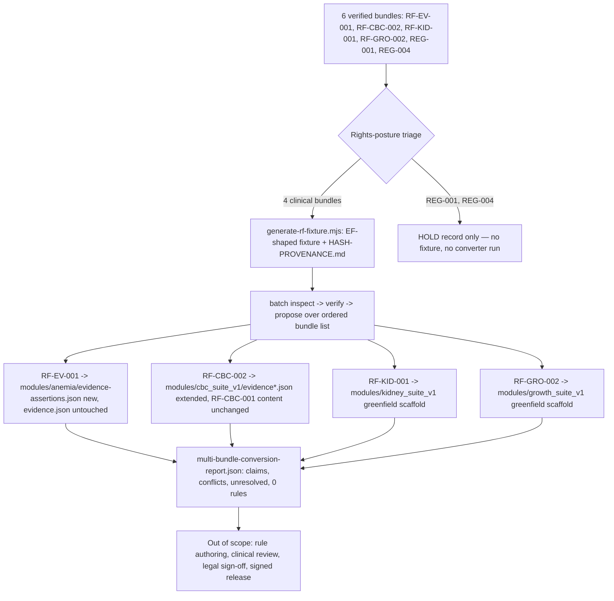

# Feature Brief & Metadata

**Feature Name:**

> E1 Multi-Bundle `rf-bundle-to-kb-pack` Conversion Pass

**Filepath Name:**

> `multi-bundle-conversion-e1`

**Date:**

> 2026-07-21

**Author:**

> PRD authored by `prd-writer` agent (sonnet)

**Related Epic(s)/PRD ID(s):**

> Evidence Foundry track (`docs/project_plans/expansion/00-expansion-plan.md`); E1 "operate"
> increment of `02-evidence-foundry-on-research-foundry.md` §7.3. Direct follow-on to
> `evidence-foundry-buildout-v1` (E0, completed: converter core + `cbc_suite_v1` vertical slice +
> 8 pre-E1 ADRs).

**Related Documents:**

> - `docs/project_plans/expansion/02-evidence-foundry-on-research-foundry.md` — the seam design
>   spec; every functional requirement below cites a section anchor.
> - `docs/project_plans/expansion/rf-handoff/RESULTS.md` — completion record: all 7 `rf` evidence
>   runs verified; this PRD converts 6 of the 7 (all but `RF-CBC-001`, already done in E0).
> - `docs/project_plans/expansion/rf-handoff/README.md` — run registry, `run_id`s, converter-
>   eligibility contract.
> - `docs/project_plans/PRDs/infrastructure/evidence-foundry-buildout-v1.md` — the E0 precedent this
>   PRD extends: converter verbs, module-package shape, `rf-cbc-001` fixture pattern.
> - `docs/adr/0001..0008-*.md` — the 8 pre-E1 ADRs (all `status: proposed`), standing in for a SPIKE
>   per this PRD's tier waiver (below).
> - `CLAUDE.md` "Hard guardrails" — restated in §2; every guardrail is a review-blocker.

---

## 1. Executive Summary

This PRD scopes **E1's mechanical conversion pass**: running the now-proven `tools/rf-bundle-to-kb-pack/`
converter (built in E0) across the 6 remaining verified `rf` evidence bundles — `RF-EV-001`,
`RF-CBC-002`, `RF-KID-001`, `RF-GRO-002` as CDS-module conversion targets, and `REG-001`/`REG-004` as
an explicit rights-posture **hold**, never a conversion target. The work generalizes the
`RF-EV-001`-specific vendoring script into a reusable, converter-shaped fixture generator; produces 4
committed, rights-audited fixtures; batches `inspect → verify → propose` across them; extends the
already-populated `modules/cbc_suite_v1/` with `RF-CBC-002`'s pancytopenia-branch evidence; scaffolds
two new greenfield module packages (kidney, growth); and enforces the `pediatric_cds` extension gate
(`EF-WP1`) structurally. **The central, load-bearing constraint this PRD exists to state plainly: this
pass produces essentially zero new clinical rules.** `propose` still refuses to infer Boolean logic
from prose (`02 §4.5`); only `cbc_suite_v1` has an approved `authoring-decisions.yaml`, and none of
this pass's new claims — including `RF-CBC-002`'s own — have one. What this pass *does* produce is the
evidence layer: per-bundle `evidence.json`/`evidence-assertions.json` projections, conflict-visible
objects for every contested claim (WHO vs. CDC growth, differing ANC cutoffs, pediatric vs. adult
proteinuria), candidate *scaffolds* (unapproved, non-runtime), `unresolved.json`, and a multi-bundle
conversion report. Rule authoring, clinical review, and legal sign-off remain explicit, deferred human
gates — never silently skipped, never implied by this pass's completion.

**Priority:** HIGH — this is the only remaining increment whose inputs already exist (6 verified
bundles, unused since 2026-07-18) and whose converter is already built and proven (E0); it directly
exercises two structural risks E0's single-bundle, single-fresh-module slice never touched: merging a
second bundle into an *already-populated* module, and standing up a module package with no prior
content at all.

**Key Outcomes:**
- Outcome 1: A reusable, rights-aware fixture generator exists and has produced 4 committed,
  hash-provenanced fixtures (`RF-EV-001`, `RF-CBC-002`, `RF-KID-001`, `RF-GRO-002`), mirroring
  `tests/fixtures/rf-cbc-001/`'s shape exactly.
- Outcome 2: `modules/cbc_suite_v1/` carries `RF-CBC-002`'s evidence additively, with zero collision
  against or mutation of the E0-landed `RF-CBC-001` content; two new module scaffolds
  (`modules/kidney_suite_v1/`, `modules/growth_suite_v1/`) exist, registered, empty-but-valid.
- Outcome 3: Every contested claim across the 4 bundles stays visibly contested; zero new rules land
  in any `rules.json` anywhere in the repository as a side effect of this pass; `REG-001`/`REG-004`
  are formally on hold, never touched by any converter verb.

### SPIKE Waiver Rationale

No separate SPIKE is authored. The 8 pre-E1 ADRs (`docs/adr/0001..0008`, all `status: proposed`,
drafted in E0's Phase 6) collectively constitute the architectural research a SPIKE would otherwise
produce for exactly this increment: rule-schema v2 posture (ADR-0001), exact-passage storage/rights
(ADR-0002, already proven against one bundle and directly reusable), terminology ownership (ADR-0003),
clinical-approval identity (ADR-0004), KB signing (ADR-0005), validation-data boundary (ADR-0006),
surveillance cadence (ADR-0007), and Path-B/discovery hardening (ADR-0008, moot for this pass — all 6
bundles are already discovered and verified). The E0 converter's own build (seam invariants, phases,
error taxonomy) is the executable research substrate; this pass's test scenarios are enumerable
directly from `02 §2.3`'s 15 invariants and `02 §4.11`'s claim-eligibility table, applied to new
inputs rather than new mechanism — the same H3 "algorithmic service" condition E0's own waiver relied
on.

---

## 2. Context & Background

### Current State

- **E0 is complete.** `tools/rf-bundle-to-kb-pack/` implements `inspect`, `verify`, and `propose`
  against a single fixture (`tests/fixtures/rf-cbc-001/`), enforcing all 15 seam invariants (`02
  §2.3`) and the claim-eligibility routing table (`02 §4.11`). `modules/cbc_suite_v1/` exists with 4
  slice rules, evidence/evidence-assertions/rule-provenance/traceability-index projections, and one
  `authoring-decisions.yaml` with exactly 4 approved decision records.
- **6 verified bundles sit unused.** Per `rf-handoff/RESULTS.md` §1, `RF-EV-001`, `RF-CBC-002`,
  `RF-KID-001`, `RF-GRO-002`, `REG-001`, and `REG-004` are all `rf verify` exit 0, 0 unsupported
  claims, cross-model fidelity-audited — verified since 2026-07-18. None has a committed fixture or a
  converter run against it.
- **A second, earlier, and separate evidence pipeline already touched `RF-EV-001`.** Before the
  Evidence Foundry converter existed, an EP-3/EP-4 pipeline (`wave0-safety-foundation`, commit
  `28c1487`) ran `scripts/evidence/vendor-rf-bundle.mjs` against `RF-EV-001`'s upstream run directory,
  producing `evidence-packs/rf-ev-001/pack.json`, and **hand-integrated that output into
  `modules/anemia/evidence.json`** — every one of the 20 sources in that file already carries a
  `runId: rf_run_20260717_rf_ev_001_pediatric_cds_backfill` citation. `modules/anemia/rules.json`'s 91
  rules and `evidence-packs/passage-attestations.json` (a rights-attestation record) are downstream of
  that same pipeline. **This PRD's `RF-EV-001` work is not a first backfill — it is a second,
  differently-shaped pipeline (the EF converter, fixture → `evidence-assertions.json`) touching the
  same upstream bundle a legacy pipeline already landed content from.** §12 OQ-1 governs how these two
  do not silently diverge.
- **`vendor-rf-bundle.mjs` exists but emits the wrong shape for this pass.** It hand-rolls a YAML
  subset parser and SHA-256 hashing, and produces a flattened `evidence-packs/<bundle>/pack.json` —
  not an `evidence_bundle.yaml` / `claims/` / `sources/` / `extractions/` tree the converter's
  read-only loader (`tools/rf-bundle-to-kb-pack/lib/loader.mjs`) actually reads. Its YAML-parsing and
  hashing internals are reusable; its output shape is not.
- **`RF-CBC-002` has never been converted, but `cbc_suite_v1` is not empty.** Unlike E0's
  single-bundle slice, converting `RF-CBC-002` means merging into a module package that already has
  4 approved decisions, 4 rules, and RF-CBC-001-derived evidence/assertion records — a path E0 never
  exercised (§9 risk R-1).
- **`RF-KID-001` and `RF-GRO-002` have no module package at all.** No `modules/kidney_suite_v1/` or
  `modules/growth_suite_v1/` (or equivalent) directory exists; `src/modules/registry.js` and
  `src/facts/registry.js` list exactly `anemia` and `cbc_suite_v1`.
- **`REG-001`/`REG-004` remain legally unresolved.** Per `rf-handoff/RESULTS.md` §5, both regulatory
  runs are "research input only — flagged for legal review; not legal advice," `status:
  not_executed_owner_held` as of 2026-07-21. No owner legal sign-off exists anywhere in this
  program's trackers.

### Problem Space

Without this pass, 6 of 7 verified evidence bundles remain inert — no fixture, no conversion, no
evidence projection — while the converter that can process them sits idle after proving itself on
exactly one bundle. Two structural gaps E0 never had to solve block scaling past that one bundle: (a)
merging a second bundle's evidence into an already-populated module without collision or silent
overwrite, and (b) standing up a module package from nothing. Both must be solved before any future
module (renal, growth, or beyond) can be converted routinely.

### Current Alternatives / Workarounds

The only alternative is continued single-bundle, hand-verified conversion the way E0 built
`cbc_suite_v1` — which does not scale to 6 bundles and, more importantly, has never been proven safe
against an already-populated module (the exact scenario `RF-CBC-002` forces).

### Architectural Context

Same deterministic content-build pipeline E0 established (`docs/architecture.md` §2a, §2b): each
module is a self-contained package at `modules/<id>/`; the converter is a build-time producer staging
proposal content under `build/kb-pack/<module_id>/<pack_version>/` (`02 §4.4`); only an out-of-scope,
human-gated release-assembly step merges an approved pack into runtime-loaded content. This pass
follows E0's own precedent of landing evidence-layer projections (not rules) directly into
`modules/<id>/*.json` — the same pattern `cbc_suite_v1/evidence.json` etc. already use — while §12
OQ-3 names the tension between that precedent and `02 §4.4`'s staging-only design explicitly.

---

## 3. Problem Statement

**User Story Format:**

> As a platform engineer with 6 unused verified `rf` bundles and a converter proven against exactly
> one, I currently have no repeatable way to process the remaining bundles — including one that must
> merge into an already-populated module and two that need a module package built from nothing —
> without either hand-authoring content that carries no claim lineage or silently letting a second
> pipeline collide with the first bundle's already-landed backfill.

**Technical Root Cause:**

- No fixture-generation tooling emits the converter's expected input shape for any bundle but
  `RF-CBC-001` (hand-built in E0's Phase 1).
- No merge-safety mechanism exists for `propose` output landing on top of already-committed module
  content — E0's `propose` was only ever exercised against an empty target.
- No module scaffold exists for `kidney_suite_v1`/`growth_suite_v1`; the registries have no slot for
  either.
- No structural enforcement exists yet that a bundle's `pediatric_cds` extension is present per source
  card before it is treated as converter-eligible (`EF-WP1`, named "not started" in
  `rf-handoff/RESULTS.md` §7 as of 2026-07-19).
- `modules/anemia/evidence.json` already carries `RF-EV-001` content from a different pipeline with no
  documented reconciliation contract against a second pipeline's output.

---

## 4. Goals & Success Metrics

### Primary Goals

**Goal 1: Prove the converter scales to N bundles, including the two structural cases E0 never covered**
- Convert all 4 clinical bundles through the same `inspect → propose → verify` path E0 proved,
  including one merge-into-populated-module (`RF-CBC-002`) and two greenfield-module cases
  (`RF-KID-001`, `RF-GRO-002`).
- Measurable: batch `propose` run twice against byte-identical fixture inputs produces byte-identical
  output across all 4 bundles (SHA-256 equality).

**Goal 2: Keep the "zero new rules" outcome honest and structurally enforced, not merely claimed**
- No claim from any of the 4 bundles reaches `rules.json`, `rule-provenance.json`, or the strict
  `candidates.json` without a matching, approved `authoring-decisions.yaml` record — and none of this
  pass's new claims has one.
- Measurable: `git diff` against every `modules/**/rules.json` and `modules/**/candidates.json` shows
  zero additions attributable to this pass's 4 bundles (the only non-empty `rules.json` remains
  `cbc_suite_v1`'s 4 E0-era rules, byte-unchanged).

**Goal 3: Preserve every conflict, visibly, across all 4 bundles**
- WHO vs. CDC growth-standard claims, differing ANC cutoffs, and pediatric vs. adult proteinuria
  cutoffs are each represented as an explicit conflict-visible object, never averaged or silently
  resolved to one source.
- Measurable: a trace query over each conflicted claim ID resolves to a named conflict object with
  both/all contributing sources listed, in every module's output.

### Success Metrics

| Metric | Baseline | Target | Measurement Method |
|--------|----------|--------|-------------------|
| Committed, rights-audited fixtures | 1 (`rf-cbc-001`) | 5 (+4 this pass) | `tests/fixtures/rf-*/HASH-PROVENANCE.md` file count |
| Bundles processed through `inspect`/`verify`/`propose` | 1 | 5 (cumulative) | Batch run log / `multi-bundle-conversion-report.json` |
| Registered module packages | 2 (`anemia`, `cbc_suite_v1`) | 4 (+kidney, +growth) | `src/modules/registry.js` `MODULE_IDS` |
| New rules emitted by this pass | N/A | 0 | Diff of every `modules/**/rules.json` |
| Conflict-visible objects preserved (WHO/CDC growth, ANC cutoffs, proteinuria) | 0 | ≥3 named conflict classes, 100% preserved | Trace query per conflicted claim ID |
| `EF-WP1` (`pediatric_cds` extension presence) enforced structurally | Not started | Enforced, test-covered | Seeded fixture missing the extension fails closed |
| Determinism (two batch runs → identical bytes, per bundle) | N/A | Pass, all 4 bundles | Double-run SHA-256 comparison |
| `REG-001`/`REG-004` converter touches | N/A | 0 | No fixture, no `runs/` reference, no `propose` invocation for either |

---

## 5. User Personas & Journeys

### Personas

**Primary Persona: Platform/backend engineer (this feature's direct user)**
- Role: builds the fixture generator, runs the batch conversion, resolves merge-safety and
  registry-wiring mechanics.
- Needs: a fail-closed batch runner that names exactly which bundle failed and why, never a partial or
  silently-degraded multi-bundle output; a merge path into `cbc_suite_v1` that cannot corrupt E0's
  already-approved content.
- Pain Points today: no fixture tooling beyond one hand-built example; no precedent for merging into a
  populated module; two evidence pipelines already touch `modules/anemia/` with no documented seam.

**Secondary Persona: Future clinical reviewer (E1+, this feature's downstream consumer, not its user)**
- Role: will eventually review `unresolved.json`, conflict objects, and candidate scaffolds this pass
  produces, once the clinical-review-portal (`DF-E1-01`, ADR-0004) exists.
- Needs: every conflict and every unresolved claim visibly enumerated with its reason, never buried in
  a pass/fail summary; a clean line between "evidence projected" and "rule proposed" — this pass
  produces almost none of the latter, and that must be obvious from the output shape itself, not
  inferred.

### High-level Flow

---

## 6. Requirements

### 6.1 Functional Requirements

| ID | Requirement | Priority | Notes |
| :-: | ----------- | :------: | ----- |
| FR-1 | Generalize `scripts/evidence/vendor-rf-bundle.mjs`'s reusable mechanics (hand-rolled YAML-subset parser, SHA-256 hashing, `usage`-block rights reading) into a new, converter-shaped fixture generator (`scripts/evidence/generate-rf-fixture.mjs` or equivalent) that reads a local `rf` run directory and emits an EF-shaped `tests/fixtures/rf-<bundle-slug>/` tree — `evidence_bundle.yaml`, `claims/claim_ledger.yaml`, `extractions/ext_*.yaml`, `sources/src_*.md`, `reviews/verification.yaml`, `reports/report_draft.md`, `swarm_plan.yaml`, `writebacks/*` — mirroring `tests/fixtures/rf-cbc-001/`'s shape exactly, not `evidence-packs/`'s legacy flattened shape. | Must | tools README "Directory layout"; OQ-6 (E0 PRD) precedent |
| FR-2 | Apply FR-1's generator against the 4 clinical bundles' `run_id`s (`rf_run_20260717_rf_ev_001_pediatric_cds_backfill`, `rf_run_20260717_rf_cbc_002_pediatric_cds_establish`, `rf_run_20260717_rf_kid_001_pediatric_cds_evidence`, `rf_run_20260717_rf_gro_002_pediatric_cds_evidence`) and commit the resulting `tests/fixtures/rf-ev-001/`, `tests/fixtures/rf-cbc-002/`, `tests/fixtures/rf-kid-001/`, `tests/fixtures/rf-gro-002/`. | Must | `rf-handoff/README.md` §2 |
| FR-3 | Every fixture's `HASH-PROVENANCE.md` MUST mirror `tests/fixtures/rf-cbc-001/HASH-PROVENANCE.md`'s structure: source `run_id`, bundle SHA-256, per-source-card rights-disposition table, and a passage-count summary (restricted vs. positively-confirmed-rights-clear). Default every passage to the ADR-0002 hash+selector-only disposition unless a source's `usage` block positively confirms `allowed_for_public_output: true`; absence of a `usage` block is never read as permission. | Must | ADR-0002 (accepted policy for this pass, still `status: proposed`) |
| FR-4 | `REG-001` and `REG-004` receive **no fixture and no converter invocation of any kind**. Author a single rights-posture HOLD record documenting both remain `status: not_executed_owner_held` (`rf-handoff/RESULTS.md` §5), are legal-review memos — not CDS-module evidence — and are excluded from every fixture/converter/clinical-drafting pathway in this and every future pass until legal sign-off lands. | Must | `rf-handoff/RESULTS.md` §5; CLAUDE.md AOS-asset-index (ARC ≠ clinical sign-off, by analogy: a legal memo ≠ legal sign-off) |
| FR-5 | Extend the converter's invocation surface with an explicit, ordered batch mode running `inspect → verify → propose` sequentially over an explicit, named list of `{fixture, module}` pairs (never a directory glob) — producing one `build/kb-pack/<module_id>/<pack_version>/` tree and one `conversion-report.json` per bundle, plus a single top-level `multi-bundle-conversion-report.json` aggregating per-bundle claim/conflict/unresolved/rule counts. | Must | design spec §4.4, §4.6 (per-bundle phases apply unchanged); tools README |
| FR-6 | `RF-EV-001`'s `propose` run projects evidence into a **new** `modules/anemia/evidence-assertions.json` (matching `modules/cbc_suite_v1/evidence-assertions.json`'s schema) without modifying `modules/anemia/evidence.json`'s existing EP-3/EP-4-derived content or any of `modules/anemia/rules.json`'s 91 rules. This pipeline is additive and parallel to the already-landed EP-3 backfill, never a silent replacement (OQ-1 governs eventual reconciliation). | Must | §2 "Current State"; OQ-1 |
| FR-7 | `RF-CBC-002`'s `propose` run **extends** the existing `modules/cbc_suite_v1/evidence.json` and `evidence-assertions.json` (never creates new files) by appending `RF-CBC-002`-derived source/assertion records, including the pancytopenia-branch claims. Every new ID (`sourceId`, `assertionId`, `rfSourceCardId`, `rfClaimId`) MUST be collision-checked against the RF-CBC-001-derived content already present; a collision fails the batch closed for that bundle, never silently overwrites. | Must | §9 R-1 (first-class risk); 02 §4.7 stable-ID rules |
| FR-8 | The converter (or a merge-safety wrapper around it) MUST be additive and idempotent against a module package that already carries prior-bundle content: re-running `propose` for `RF-CBC-002` twice produces no duplicate records, and every RF-CBC-001-derived record in `modules/cbc_suite_v1/**` stays byte-identical before and after the `RF-CBC-002` merge. | Must | §9 R-1; FR-17 (determinism) |
| FR-9 | For every claim in this pass lacking a matching, approved `authoring-decisions.yaml` record — which is every claim in `RF-EV-001`, `RF-KID-001`, `RF-GRO-002`, and every `RF-CBC-002`-specific claim (`cbc_suite_v1`'s existing 4 decisions cover only `RF-CBC-001` claims) — `propose` MUST emit only: (a) `evidence.json` source records, (b) `evidence-assertions.json` exact-passage projections, (c) conflict-visible objects for `mixed`/`contradicted` claims, (d) `unresolved.json` entries. It MUST NOT emit any entry into `rules.json`, `rule-provenance.json`, or the strict `candidates.json` for those claims. | Must | 02 §4.5, §4.11, §4.12; central honesty framing (§1) |
| FR-10 | A "candidate scaffold" — an unapproved, non-schema-validated draft pattern name plus its supporting claim IDs, for a claim set that plausibly warrants a future candidate but has no authoring decision — MAY be emitted, but only to a new, clearly out-of-band artifact (`candidate-scaffolds.json`, staged under `build/kb-pack/<module_id>/<pack_version>/` only). It MUST NEVER be merged into any module's runtime `candidates.json`, which stays strict-schema, rule-backed-only, per `02 §4.14`. | Must | 02 §4.14; guardrail-adjacent |
| FR-11 | Every `mixed`/`contradicted` claim across the 4 bundles — including WHO vs. CDC growth-standard cutoffs (`RF-GRO-002`), differing ANC cutoffs across CBC sources, and pediatric vs. adult proteinuria cutoffs (`RF-KID-001`) — MUST be preserved as an explicit, named conflict-visible object in the owning module's evidence-assertions output, listing every contributing source. No conflict may be averaged, silently resolved to one source, or dropped. | Must | 02 §2.3 invariant 8; §4.17; `rf-handoff/RESULTS.md` §3 |
| FR-12 | Every claim that is eligible-but-unrouted for any reason (an `inference` claim with no matching decision record; a `mixed`/`contradicted` claim pending adjudication; a claim failing the `02 §3.7` field-completeness table) is enumerated in the owning module's `unresolved.json`, joined by `claim_id` back to its source fixture, with the specific rejection/deferral reason — never silently dropped from the conversion report. | Must | 02 §3.7; decisions-block-equivalent honesty framing |
| FR-13 | Scaffold two new greenfield module packages — `modules/kidney_suite_v1/` (`RF-KID-001`) and `modules/growth_suite_v1/` (`RF-GRO-002`), final IDs confirmed by the implementation plan — each with a `module.json` (unsigned-stub shape + `02 §3.2` envelope fields, `status: "unsigned-stub"`, `approvedBy: []`, `clinicalContentHash: null`), an `index.js` exporting a minimal, explicitly-labeled `deriveFacts`/`summarize`/`limitations` hook that performs **no invented clinical fact derivation** — it must return a clearly-labeled "not yet implemented for this module" posture, satisfying the module-package contract's shape requirement without fabricating clinical logic — a schema-valid empty `rules.json` (`[]`), a schema-valid empty `candidates.json` (`[]`), and the `propose`-generated `evidence.json`/`evidence-assertions.json`/`unresolved.json`. | Must | `docs/architecture.md` §2a; `modules/cbc_suite_v1/index.js`'s delegation precedent does not apply here — kidney/growth have no sibling fact-derivation module to delegate to |
| FR-14 | Register both new modules in `src/modules/registry.js` and `src/facts/registry.js`, following the `cbc_suite_v1` precedent exactly: literal, enumerated `MODULE_CODE_LOADERS`/registry-map entries (never a template-string specifier), `MODULE_IDS` derived from the registry map (never hand-duplicated). `DEFAULT_MODULE_ID` stays `'anemia'`; this pass adds no client-selectable `moduleId` surface (no UI/API change). | Must | `src/modules/registry.js` comments (R-P4 precedent from E0) |
| FR-15 | `scripts/validate-kb.mjs` and the JSON-Schema validation E0 added MUST accept a module whose `rules.json` is a valid empty array `[]` as **valid**, not an error — a scaffold module with zero rules is an expected, legitimate E1 state for `kidney_suite_v1`/`growth_suite_v1`, not a validator failure. | Must | E0 PRD FR-3 (schema validation this pass must not regress) |
| FR-16 | Implement `EF-WP1` enforcement structurally: a pre-flight eligibility check (in the converter's eligibility module or a standalone pre-check invoked by the batch runner) verifies every source card in a bundle carries the `pediatric_cds` evidence-card extension block before the bundle is treated as converter-eligible at all. A bundle missing the extension on any source card is rejected, non-zero exit, before any `propose` output is written for it. | Must | `rf-handoff/README.md` §3; `rf-handoff/RESULTS.md` §7 ("not started" as of 2026-07-19) |
| FR-17 | Determinism: running the FR-5 batch pass twice against byte-identical fixture inputs and the same converter version MUST produce byte-identical output across every emitted file, independently for each of the 4 bundles and for the aggregate `multi-bundle-conversion-report.json`. | Must | 02 §2.3 invariant 13 |
| FR-18 | `npm run check` (test + validate + build + check:imports + smoke) stays green at every implementation-plan phase boundary this feature's downstream plan defines — no phase may leave it red, including the two greenfield-module phases. | Must | CLAUDE.md gate |
| FR-19 | Author a rights-posture HOLD record for `REG-001`/`REG-004` (FR-4's deliverable) cross-referencing `rf-handoff/RESULTS.md` §5 and stating explicitly: neither run is a converter target now or in any future pass until legal sign-off is recorded; neither may seed a fixture, a module, or any clinical evidence artifact. | Must | FR-4; CLAUDE.md hard guardrails |
| FR-20 | FR-1's fixture generator MUST itself be covered by ≥1 automated test proving it produces a valid, deterministic EF fixture shape from a small local sample run directory (not the live agentic node) — the generator is new tooling, not merely a one-off script run by hand. | Must | reliability of a reusable tool, not a throwaway migration script |
| FR-21 | `modules/anemia/evidence-assertions.json` (new, FR-6) and both new modules' `evidence-assertions.json` files use the identical schema shape `modules/cbc_suite_v1/evidence-assertions.json` already established (`schemaVersion`, `moduleId`, `rfProvenance`, `assertions[]`) — no bundle-specific schema drift across the 4 outputs. | Must | consistency with E0's already-shipped shape |
| FR-22 | No task in this pass authors, approves, or stages a new `authoring-decisions.yaml` record for any claim in `RF-EV-001`, `RF-KID-001`, `RF-GRO-002`, or any `RF-CBC-002`-specific claim. Authoring decisions remain an explicit human clinical-authorship act (`02 §4.12`), out of scope here; `propose` continues enforcing "no matching decision record → no rule," now proven against 4 bundles that structurally cannot satisfy it. | Must | 02 §4.12; central honesty framing |
| FR-23 | Add a `CHANGELOG.md` `[Unreleased]` entry and a `docs/architecture.md` note describing the batch pass, the two new module scaffolds, and the explicit "zero new rules produced" outcome — never described as a content release or a step toward one. | Must | `.claude/specs/changelog-spec.md`; changelog_required: true |
| FR-24 | Author a design-spec stub (per `.claude/skills/planning/references/deferred-items-and-findings.md`) for every item in the §7 Deferred Items table below, one stub per item, before this feature is considered closed. | Must | E0 precedent (FR-23 of the E0 PRD) |

### 6.2 Non-Functional Requirements

**Performance:**
- The full 4-bundle batch pass runs fully offline in well under a few minutes on a standard developer
  machine — build-time tooling, no request-serving latency budget.

**Security:**
- Zero network calls, zero LLM/generative-model invocations, in the fixture generator or any converter
  verb, matching E0's posture exactly.
- Rights-restriction defaults (FR-3) are enforced structurally by the fixture generator and by
  `evidence-assertions.json` schema validation (an `exactPassage: null` record requires
  `exactPassageSha256` populated) — never left to author discipline.
- `REG-001`/`REG-004` upstream `runs/` directories are never read by any script this pass adds (FR-4).

**Reliability:**
- Fail-closed per bundle: if one bundle in the batch fails (schema error, collision, missing
  `pediatric_cds` extension), the batch runner MUST name exactly which bundle and why, and MUST NOT
  silently skip it, partially write its output, or corrupt any other bundle's already-written output
  in the same run.
- No silent fallback anywhere in the merge path (FR-7/FR-8): an ID collision, a schema mismatch, or an
  unresolved reference against the pre-existing `cbc_suite_v1` content is a hard failure, not a
  best-effort merge.

**Observability:**
- `multi-bundle-conversion-report.json` (FR-5) is the audit surface: structured, per-bundle and
  aggregate counts of claims processed, conflicts preserved, unresolved items, candidate scaffolds,
  and rules emitted (expected: 0 across all 4 bundles) — never a pass/fail summary alone.

---

## 7. Scope

### In Scope

- Generalized, tested fixture generator (FR-1, FR-20) and 4 committed fixtures with hash-provenance
  notes (FR-2, FR-3).
- Batch `inspect → verify → propose` orchestration across the 4 clinical bundles (FR-5).
- `RF-EV-001` → new `modules/anemia/evidence-assertions.json`, additive to the existing EP-3-derived
  `evidence.json` (FR-6).
- `RF-CBC-002` → extension of the existing, populated `modules/cbc_suite_v1/` with collision-safe,
  idempotent merge (FR-7, FR-8).
- Two greenfield module scaffolds — kidney (`RF-KID-001`), growth (`RF-GRO-002`) — plus registry
  wiring in `src/modules/registry.js` and `src/facts/registry.js` (FR-13, FR-14).
- `EF-WP1` structural enforcement of the `pediatric_cds` extension gate (FR-16).
- Conflict-visible preservation across all 4 bundles (FR-11), `unresolved.json` per module (FR-12),
  candidate scaffolds as a non-runtime artifact only (FR-10).
- `REG-001`/`REG-004` rights-posture HOLD record — the *only* artifact this pass produces for either
  run (FR-4, FR-19).
- Determinism proof across all 4 bundles (FR-17); `npm run check` green throughout (FR-18).
- Deferred-item design-spec stubs (FR-24); CHANGELOG/architecture-doc updates (FR-23).

### Out of Scope

- Any new clinical rule, candidate, or authoring-decisions.yaml record for any bundle in this pass
  (FR-9, FR-22) — this is the central non-negotiable boundary, not an oversight.
- Any converter run, fixture, or module content for `REG-001`/`REG-004` beyond the HOLD record (FR-4).
- Rule-schema v2 migration (ADR-0001) — remains `proposed`, not implemented.
- Exact-passage reviewer-retrieval tooling (ADR-0002's named E1 gap, `DF-E1-01`).
- Clinical-review-portal build (`DF-E1-01`, ADR-0004) — this pass produces the artifacts a future
  portal would surface; it does not build the portal.
- Terminology/LOINC/UCUM/SNOMED mapping (ADR-0003), KB signing/key custody (ADR-0005), validation-data
  boundary implementation (ADR-0006), surveillance/E2 machinery (ADR-0007), Path-B hardening
  (ADR-0008, moot — no new discovery needed for already-verified bundles).
- Legal review or sign-off routing for `REG-001`/`REG-004` (owner/legal-team action, not an engineering
  task).
- Reconciliation *implementation* between the EP-3/EP-4 `RF-EV-001` pipeline and this pass's new
  `evidence-assertions.json` output — this pass documents the seam (FR-6) and stubs the design
  question (OQ-1); it does not resolve it.

### Non-Goals (verbatim from `02 §6.4` — violations are review-blockers)

> - A second evidence crawler or source-card database in the CDS repository.
> - A generative rule-writing service that publishes to `modules/<module_id>/rules.json`.
> - A patient-specific LLM inference path.
> - A universal pediatric threshold service that ignores local methods and intervals.
> - A converter that guesses LOINC/UCUM codes from labels.
> - A release shortcut that treats `rf verify` or council approval as clinical validation.
> - A single "confidence score" combining evidence confidence, rule points, and patient likelihood.

---

## Deferred Items

| Item | Target increment | Design-spec anchor |
|---|---|---|
| Rule authoring workflow per module (how an approved `authoring-decisions.yaml` record actually gets written for `RF-EV-001`/`RF-CBC-002`/`RF-KID-001`/`RF-GRO-002` claims) | E1 (later iteration) / E2 | `02 §6.1` "Rule compiler/DSL v1 bridge"; ADR-0001 |
| Clinical-review-portal intake of this pass's proposals (conflict objects, candidate scaffolds, `unresolved.json`) | E1 | `DF-E1-01`; ADR-0004 |
| `REG-001`/`REG-004` legal sign-off routing | External (legal/owner) | `rf-handoff/RESULTS.md` §5 |
| Anemia backfill reconciliation between the EP-3/EP-4 pipeline's `modules/anemia/evidence.json` content and this pass's new `modules/anemia/evidence-assertions.json` | E1 (later iteration) | OQ-1 below |

Each row gets one design-spec stub per FR-24; no implementation is authorized by this PRD for any row.

---

## 8. Dependencies & Assumptions

### External Dependencies

- **6 verified `rf` evidence bundles** (`RF-EV-001`, `RF-CBC-002`, `RF-KID-001`, `RF-GRO-002`,
  `REG-001`, `REG-004`) — hosted on the agentic node (`10.42.10.76`) and a local `research-foundry`
  mirror. Only the 4 clinical bundles' sanitized fixtures cross into this repository (FR-2); the
  converter never reads the node or the mirror at runtime.
- **Legal review of `REG-001`/`REG-004`** — remains `not_executed_owner_held`; blocks nothing in this
  pass's in-scope work, since neither run is a conversion target (FR-4).

### Internal Dependencies

- **`tools/rf-bundle-to-kb-pack/`** (E0-delivered) — `inspect`, `verify`, `propose` and the 15
  seam-invariant suite; this pass adds batch orchestration on top, not new verbs.
- **`modules/cbc_suite_v1/`** (E0-delivered) — the populated module `RF-CBC-002` extends; its 4
  E0-era rules and decisions are the immutability boundary FR-7/FR-8 protect.
- **Module package contract** (`docs/architecture.md` §2a) — both greenfield scaffolds must conform.
- **`scripts/validate-kb.mjs`** and the `npm run check` gate.
- **`scripts/evidence/vendor-rf-bundle.mjs`** — the source of FR-1's reusable YAML/hashing internals.

### Assumptions

- The 4 clinical bundles' source cards carry `usage` blocks with the same or similar restrictive
  disposition as `RF-CBC-001`'s (12/12 `allowed_for_public_output: false`); FR-3's default therefore
  expects most or all new fixtures to land in the hash+selector-only disposition, not full-text.
- `kidney_suite_v1`/`growth_suite_v1` are working identifiers for this PRD, consistent with the
  `cbc_suite_v1` naming convention; final IDs are confirmed by the implementation plan.
- Node.js ≥20 remains the pinned runtime, matching E0 and the root `package.json` `engines`
  constraint.
- `build/kb-pack/` remains `.gitignore`d (set in E0); only fixtures (`tests/fixtures/rf-*/`) and
  landed module content (`modules/**/*.json`) are committed from this pass's output, per OQ-3's
  eventual resolution.

### Feature Flags

None. This pass's entire output is either a committed fixture, a landed evidence-layer projection, or
a build-time staged proposal artifact under `build/kb-pack/`. The deployed clinician SPA and API are
unmodified until an out-of-scope, human-gated release-assembly step merges an approved pack — and this
pass approves nothing.

---

## 9. Risks & Mitigations

| Risk | Impact | Likelihood | Mitigation |
| ----- | :----: | :--------: | ---------- |
| **R-1 — `RF-CBC-002` merge corrupts or collides with E0's already-approved `cbc_suite_v1` content.** This is the first bundle-into-a-populated-module path the converter has ever exercised; a naive re-run of `propose` could silently overwrite or duplicate the 4 E0 rules/decisions/assertions. | High | Medium | FR-7/FR-8 mandate collision-checked, additive-only, idempotent merge; a pre-merge snapshot hash of the existing `cbc_suite_v1/**` content, re-verified byte-identical post-merge, is a hard test gate before this risk is considered closed. |
| **R-2 — Dual evidence-pipeline drift for `modules/anemia/`.** The EP-3/EP-4 pipeline already backfilled `RF-EV-001` content into `evidence.json`; this pass's EF pipeline produces a second, differently-shaped artifact (`evidence-assertions.json`) from the same upstream bundle. Without a documented seam, a future reader could reasonably (and wrongly) assume the two are redundant, contradictory, or that one supersedes the other. | High | Medium | FR-6 keeps the two pipelines' outputs in separate files with no field overwritten; OQ-1 names the reconciliation question explicitly rather than silently resolving or ignoring it; the Deferred Items table schedules the actual reconciliation as its own future item. |
| **R-3 — Candidate scaffold leaks into the strict, runtime `candidates.json`.** A scaffold pattern with no approved rule backing landing in the schema-validated runtime file would silently violate `02 §4.14`'s "at least one approved rule must emit the candidate" rule and this repo's "no invented threshold/pattern" guardrail. | High | Low | FR-10 confines scaffolds to a distinct, out-of-band artifact under `build/kb-pack/` only; a schema/CI check asserting no module's `candidates.json` byte-diff correlates with a claim lacking a rule backing it closes this. |
| **R-4 — Greenfield module's placeholder `deriveFacts` is mistaken for real clinical logic.** An empty-but-schema-valid module package could be misread by a future contributor as "kidney/growth assessment works," when it is a scaffold with zero clinical behavior. | Medium | Medium | FR-13 mandates an explicit, labeled "not yet implemented" posture in the hook descriptor and its `limitations()` output; `module.json.status` stays `unsigned-stub`; the target-state acceptance criteria (§11) require this labeling be checked, not assumed. |
| **R-5 — Batch partial-failure ordering produces an inconsistent multi-bundle state.** If bundle 3 of 4 fails mid-batch, an ambiguous runner could leave bundles 1–2's output committed alongside a corrupted or half-written bundle 3, with bundle 4 never attempted. | Medium | Medium | FR-5/reliability NFR require the batch runner to name the failing bundle explicitly and halt without partially writing that bundle's output; already-succeeded bundles' output is unaffected (per-bundle isolation, no shared mutable state between bundles). |
| **R-6 — Content-rights exposure across 4 new fixtures.** Same class of risk E0's single fixture already resolved via ADR-0002, but at 4× the surface area. | Medium | Low | FR-3 reuses the same, now-proven hash+selector-only default; `HASH-PROVENANCE.md` per fixture makes the disposition auditable at a glance, matching the `rf-cbc-001` precedent exactly. |
| **R-7 — `REG-001`/`REG-004` accidentally become a converter target.** A batch-runner bug or an over-broad glob could pull a `REG-*` run into the pipeline meant only for the 4 clinical bundles. | High | Low | FR-4/FR-5 require an explicit, named `{fixture, module}` list — never a directory glob or a "process everything under `runs/`" pattern; a test asserts no `REG-001`/`REG-004` artifact is ever read by any script this pass adds. |
| **R-8 — Registry wiring silently changes selectable-module surface.** Registering 2 new modules could tempt an implicit `DEFAULT_MODULE_ID` change or a new client-facing `moduleId` parameter, ahead of any UI/API decision to support it. | Medium | Low | FR-14 explicitly freezes `DEFAULT_MODULE_ID` at `'anemia'` and forbids any new client-selectable surface, mirroring the E0 `cbc_suite_v1` registration's own R-P4 precedent. |

---

## 10. Target State (Post-Implementation)

**Engineer Experience:**
- A platform engineer can point the fixture generator at any newly verified `rf` run directory and
  get a committed, rights-audited, converter-ready fixture without hand-building the tree.
- The batch runner processes an explicit list of bundles and reports, per bundle, exactly what was
  projected, what was preserved as conflict, what remains unresolved, and — expected, every time in
  this pass — that zero rules were emitted.

**Technical Architecture:**
- `modules/anemia/` carries both its EP-3/EP-4-derived `evidence.json` and a new, additive
  `evidence-assertions.json`, with the seam between them named in OQ-1, not silently merged.
- `modules/cbc_suite_v1/` carries `RF-CBC-001` and `RF-CBC-002` evidence side by side, collision-free,
  with its 4 E0-era rules untouched.
- `modules/kidney_suite_v1/` and `modules/growth_suite_v1/` exist as valid, registered, explicitly
  unimplemented module packages alongside `anemia` and `cbc_suite_v1`.
- `REG-001`/`REG-004` remain wholly outside any module, fixture, or converter artifact — represented
  only by a standalone HOLD record.

**Observable Outcomes:**
- `npm run check` remains green throughout.
- Every `rules.json` and strict `candidates.json` in the repository is byte-identical to its
  pre-this-pass state, except for whitespace-neutral formatting if any — this pass's defining,
  verifiable outcome.
- The product remains, and is documented as remaining, an **UNVALIDATED research prototype** — no
  artifact from this pass is described anywhere as clinically validated, release-ready, or
  rule-authored.

---

## 11. Overall Acceptance Criteria (Definition of Done)

### Functional Acceptance

- [ ] FR-1 through FR-24 are implemented and independently verifiable.
- [ ] 4 fixtures (`rf-ev-001`, `rf-cbc-002`, `rf-kid-001`, `rf-gro-002`) are committed, each with a
      `HASH-PROVENANCE.md` matching `rf-cbc-001`'s structure.
- [ ] The batch runner executes `inspect → verify → propose` over all 4 clinical bundles and produces
      a `multi-bundle-conversion-report.json` aggregating per-bundle counts.
- [ ] `modules/anemia/evidence-assertions.json` exists, new, additive; `modules/anemia/evidence.json`
      and `modules/anemia/rules.json` are byte-unchanged by this pass.
- [ ] `modules/cbc_suite_v1/evidence.json` and `evidence-assertions.json` carry `RF-CBC-002` content
      appended to, never overwriting, the E0-era `RF-CBC-001` content; `modules/cbc_suite_v1/rules.json`
      and `authoring-decisions.yaml` are byte-unchanged.
- [ ] `modules/kidney_suite_v1/` and `modules/growth_suite_v1/` exist, are registered in
      `src/modules/registry.js` and `src/facts/registry.js`, and each has a schema-valid empty
      `rules.json` and `candidates.json`.
- [ ] Every conflicted claim named in §1/§4 (WHO vs. CDC growth, ANC cutoffs, pediatric vs. adult
      proteinuria) resolves to a named, multi-source conflict object — demonstrated, not assumed.
- [ ] `unresolved.json` exists per converted module and enumerates every eligible-but-unrouted claim
      with a specific reason.
- [ ] `REG-001`/`REG-004`'s HOLD record exists; no fixture, module content, or converter artifact
      references either run.
- [ ] Zero new entries appear in any `rules.json` or strict `candidates.json` anywhere in the
      repository as a result of this pass — demonstrated by diff, not claimed.
- [ ] `CHANGELOG.md` has an `[Unreleased]` entry; `docs/architecture.md` documents the batch pass.
- [ ] A design-spec stub exists for every row in the Deferred Items table (one-to-one).

### Technical Acceptance

- [ ] `npm run check` is green at every phase boundary the downstream implementation plan defines.
- [ ] The fixture generator (FR-1) and the batch runner both make zero network calls and zero
      generative-model calls — test-enforced.
- [ ] `EF-WP1`'s `pediatric_cds` extension gate is enforced structurally, with a seeded-missing-
      extension fixture failing closed before any `propose` output is written.
- [ ] A pre-merge/post-merge hash comparison of `modules/cbc_suite_v1/`'s E0-era content (rules,
      decisions, RF-CBC-001-derived evidence/assertions) proves byte-identity across the `RF-CBC-002`
      merge.
- [ ] Two independent batch runs against identical fixture inputs and converter version produce
      byte-identical output for all 4 bundles (SHA-256 equality).

### Quality Acceptance

- [ ] Every hard guardrail in CLAUDE.md and every §7 non-goal is explicitly checked against this
      pass's actual diff before the feature is considered closed, not assumed compliant.
- [ ] The "zero new rules" outcome and the greenfield modules' "not yet implemented" labeling are both
      independently spot-checked by a reviewer reading the emitted content, not only the test suite.

### Documentation Acceptance

- [ ] All 4 `HASH-PROVENANCE.md` files are discoverable and follow the `rf-cbc-001` structure.
- [ ] The REG HOLD record is discoverable and cross-references `rf-handoff/RESULTS.md` §5.
- [ ] `CHANGELOG.md` and `docs/architecture.md` updates are present.

---

## 12. Assumptions & Open Questions

### Assumptions

- The 4 clinical bundles' claim shapes (source-supported, mixed, contradicted, inference,
  speculation) are structurally identical in kind to `RF-CBC-001`'s, so the E0 converter's existing
  eligibility/claim-routing logic (`02 §4.11`) applies unchanged — this pass exercises it against new
  data, not new mechanism.
- A module package with zero rules and a placeholder `deriveFacts` is a legitimate, shippable E1
  intermediate state, not a defect to be silently worked around by inventing minimal clinical logic to
  "make the module do something."

### Open Questions

- [ ] **OQ-1**: How does this pass's new `modules/anemia/evidence-assertions.json` (FR-6) reconcile
      with the already-landed EP-3/EP-4 backfill inside `modules/anemia/evidence.json` — same upstream
      bundle (`RF-EV-001`), two differently-shaped pipelines, no documented seam today? Options include
      (a) leave both permanently separate, documented as parallel provenance views; (b) a future pass
      generates `evidence.json`'s `runId` citations *from* `evidence-assertions.json` rather than
      independently; (c) deprecate the EP-3/EP-4 pipeline's role for this bundle going forward. This
      PRD does not resolve it — FR-6 only guarantees neither pipeline clobbers the other; the Deferred
      Items table schedules the actual reconciliation.
- [ ] **OQ-2**: Does `modules/cbc_suite_v1/module.json.knowledgeBaseVersion` bump when `RF-CBC-002`
      evidence merges in, even though zero new rules are added? A version bump with no rule change
      could mislead a reader into thinking clinical content changed; leaving it unchanged could hide
      that new evidence now backs the module. The implementation plan must decide explicitly and state
      the rationale, not default silently.
- [ ] **OQ-3**: What is the committed-vs-gitignored boundary for a bundle's evidence-projection output
      that carries zero rules (all 4 bundles in this pass)? E0 landed `cbc_suite_v1`'s evidence content
      directly into `modules/cbc_suite_v1/*.json` (committed), which sits in tension with `02 §4.4`'s
      staging-only design (`build/kb-pack/` as the only pre-approval home). Does this pass's
      evidence-only output (no rules, still real conflict-bearing clinical claims) get the same
      direct-landing treatment E0 used, or does the absence of any rule backing argue for keeping it
      staged under `build/kb-pack/` until a first human review event occurs? Resolve before
      implementation begins — this determines whether `modules/kidney_suite_v1/evidence.json` etc. are
      committed or generated-and-discarded.
- [ ] **OQ-4**: Final module IDs — `kidney_suite_v1`/`growth_suite_v1` (this PRD's working names) versus
      an alternative naming convention (e.g. `renal_suite_v1`, `growth_v1`). Confirm against any
      existing naming-convention precedent before FR-13/FR-14 execute.
- [ ] **OQ-5**: Where does the FR-10 candidate-scaffold artifact's schema live — a new
      `schemas/candidate-scaffold.schema.json`, or a hand-written structural check only, matching E0
      PRD's own still-open OQ-7 pattern for new artifact types? Decide explicitly rather than defaulting
      to whichever is faster to code.

---

## 13. Appendices & References

### Related Documentation

- **Design spec**: `docs/project_plans/expansion/02-evidence-foundry-on-research-foundry.md` — every
  FR above cites a section anchor; normative source for anything not restated here.
- **E0 precedent (binding pattern, not to be contradicted without reason)**:
  `docs/project_plans/PRDs/infrastructure/evidence-foundry-buildout-v1.md` and its implementation
  plan — converter build, `cbc_suite_v1` vertical slice, module-package contract usage.
- **Upstream completion record**: `docs/project_plans/expansion/rf-handoff/RESULTS.md`.
- **Run registry**: `docs/project_plans/expansion/rf-handoff/README.md`.
- **8 pre-E1 ADRs**: `docs/adr/0001..0008-*.md` — standing in for this feature's SPIKE.
- **Converter tool**: `tools/rf-bundle-to-kb-pack/README.md` — verbs, seam invariants, error taxonomy.

### Symbol References

Not applicable — this repository does not maintain `ai/symbols-*.json` artifacts. The relevant
contracts are `schemas/rule.schema.json`, `schemas/candidate.schema.json`, and the
`evidence-assertions.json` shape `modules/cbc_suite_v1/evidence-assertions.json` already establishes.

### Prior Art

- `modules/cbc_suite_v1/` (E0) — the single-bundle, greenfield-module precedent this pass extends to
  N bundles, one merge-into-populated-module case, and two greenfield cases.
- `tests/fixtures/rf-cbc-001/` + its `HASH-PROVENANCE.md` — the exact fixture shape and rights-
  disposition documentation pattern FR-1/FR-3 generalize.
- `scripts/evidence/vendor-rf-bundle.mjs` + `evidence-packs/rf-ev-001/pack.json` — the legacy,
  pre-converter `RF-EV-001` pipeline this pass's FR-6/OQ-1 must not silently clobber.

---

## Implementation Phases

**This PRD does not sequence tasks or assign subagents** — that is the Implementation Plan's job,
authored separately from this document. The scope-to-phase groupings below are a rough map only, not
binding task boundaries:

- **Fixture & rights foundation**: FR-1, FR-2, FR-3, FR-4, FR-19, FR-20 (generalize the vendoring
  script, produce and commit 4 fixtures, author the REG HOLD record).
- **Batch orchestration & `EF-WP1`**: FR-5, FR-16 (batch runner, structural extension-gate check).
- **Evidence projection & merge safety**: FR-6, FR-7, FR-8, FR-9, FR-10, FR-11, FR-12, FR-21, FR-22
  (the `RF-EV-001` additive projection and the `RF-CBC-002` collision-safe merge — the two riskiest
  cells in this pass, per R-1/R-2).
- **Greenfield module scaffolds**: FR-13, FR-14, FR-15 (kidney, growth packages + registry wiring).
- **Determinism, docs, and deferral closure**: FR-17, FR-18, FR-23, FR-24.

The dependency ordering, per-phase estimates, subagent assignments, and exit gates belong entirely to
the Implementation Plan this PRD hands off to — none of that is decided here.

---

**Progress Tracking:**

See progress tracking (created during execution, one file per phase):
`.claude/progress/multi-bundle-conversion-e1/`
