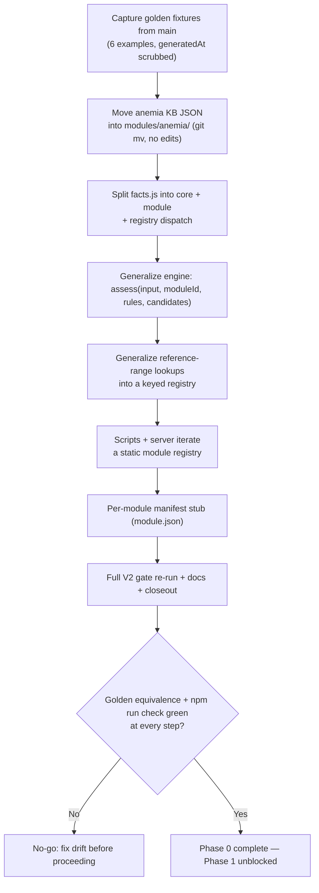

# Feature Brief & Metadata

**Feature Name:**

> Platform Foundation Refactor (Phase 0)

**Filepath Name:**

> `platform-foundation-p0-v1`

**Date:**

> 2026-07-17

**Author:**

> Nick Miethe (Opus decisions-block arbitration; PRD authored by prd-writer agent)

**Related Epic(s)/PRD ID(s):**

> Roadmap Phase 0 — `docs/project_plans/expansion/01-platform-expansion-roadmap.md` (Phase 0 section,
> lines ~121–146; machine-readable seed §E, lines ~486–500). IntentTree tree
> `tree_01KXQ7WC1HQE2GKZSCNDVXA9G7`, work_area `platform-foundation`, work packages P0-WP1…WP6.

**Related Documents:**

> - `docs/project_plans/SPIKEs/spike-001-module-package-boundary.md` — module-package layout, fact
>   registry, engine signature, range registry, equivalence strategy.
> - `docs/project_plans/SPIKEs/spike-002-multi-module-loader.md` — script/server module iteration,
>   cache-busting preservation, API surface, module-load test.
> - `.claude/worknotes/platform-foundation-p0/decisions-block.md` — phase boundaries, risk hotspots,
>   estimation anchors; §7 Open Question resolutions are binding.
> - `CLAUDE.md` — hard guardrails (no AI-published rule changes, no invented thresholds, no PHI).

---

## 1. Executive Summary

This PRD scopes a **structural refactor with zero clinical behavior change**: extracting the
anemia-specific rules runtime into a module-agnostic platform (`modules/anemia/` as the first
registered module) so that Phase 1+ modules (CBC suite, kidney, growth) can be added without
re-deriving the rule engine, fact-derivation pipeline, or reference-range logic. No clinical content
is added, removed, or edited — every knowledge-base JSON file is **relocated, never edited** — and no
public API surface changes. Success is measured entirely in equivalence: identical `assess()` output
for all six worked examples and a green `npm run check` at every phase boundary.

**Priority:** P0 (blocks Phase 1 and every subsequent roadmap phase — "nothing else can start until
this lands," per the roadmap's dependency table).

**Key Outcomes:**
- Outcome 1: A `modules/<id>/` package contract exists and `modules/anemia/` is the first (and, for
  P0, only) registered module — proving the contract against real content instead of a hypothetical.
- Outcome 2: `assess(input, moduleId, rules, candidates)` replaces the anemia-hard-coded
  `assessPediatricAnemia`, with a permanent golden-fixture equivalence test guarding every future
  change to the engine, fact derivation, or range logic.
- Outcome 3: `scripts/validate-kb.mjs`, `scripts/build-static.mjs`, `scripts/smoke-test.mjs`, and
  `server.mjs` iterate a static module registry instead of hard-coding `data/*.json`, so registering
  a second module in Phase 2+ is a bounded, reviewable diff to one file (`src/modules/registry.js`).

---

## 2. Context & Background

### Current State

The codebase is a single-module pediatric anemia CDS prototype (v0.3.1). `src/facts.js` (365 lines)
derives CBC/ferritin/retic/hemolysis/lead/smear/marrow facts from raw patient input; `src/engine.js`
exports `assessPediatricAnemia(input, rules, catalog)`, which calls `deriveFacts`, runs
`src/ruleEngine.js` (already module-agnostic — no anemia literals in the DSL interpreter), and returns
classification/alerts/ranked differential/limitations/provenance. `src/referenceRanges.js` hardcodes a
`RANGES` array and a separate `getFerritinThreshold()` lookup. `data/rules.json` (91 rules),
`data/candidates.json` (26 patterns), and `data/evidence.json` sit at the repo root and are read
directly by `server.mjs`, `scripts/build-static.mjs`, `scripts/validate-kb.mjs`, and fetched by the
browser (`src/app.js`). `src/evidence.js` is a **second, hand-authored** source for the same 6 evidence
records plus the version constants (`KNOWLEDGE_BASE_VERSION`, `REVIEWED_THROUGH`) actually used at
runtime — `data/evidence.json` is a parallel, currently-unverified mirror. `data/reference-ranges.json`
is dead data today: nothing imports it; `src/referenceRanges.js` hardcodes an identical array instead.

Crucially, `src/facts.js`, `src/engine.js`, `src/evidence.js`, and `src/referenceRanges.js` are not
only Node-side modules — they are imported **directly by the unbundled browser** (`index.html` loads
`<script type="module" src="./src/app.js">`; `src/app.js` and `src/algorithmExplorer.js` import from
them by exact path and name, with no build-time bundling). `scripts/build-static.mjs` copies `src/`,
`data/`, and `examples/` verbatim into `dist/` and stamps `?v=<hash>` cache-busting suffixes onto
`.js` imports and `fetch(...)` calls via regex (added in commit `240e314` to fix a stale-cache class of
bug). `npm run check` (`test` + `validate` + `build` + `smoke`) never executes browser JS — a broken
import path in `app.js`/`algorithmExplorer.js` would not fail the gate.

### Problem Space

The roadmap's next five phases (CBC suite, longitudinal/referral, kidney, growth, and beyond) all
require a second, third, and fourth clinical module. Every one of those phases would otherwise have to
either (a) fork the anemia engine/fact/range code per module, multiplying the review and drift-risk
surface, or (b) hard-code module-specific literals deeper into shared files, making the "which module
does this fact/rule/range belong to" question progressively harder to answer. Today there is no
`moduleId` concept anywhere in the runtime — `deriveFacts`, `assessPediatricAnemia`, and the reference
range lookups are single-purpose anemia functions with anemia baked into their names and bodies.

### Current Alternatives / Workarounds

None exist today because only one module (anemia) has ever been built. The "workaround" the roadmap
explicitly forbids is copy-pasting the anemia engine/fact/range files per module — that would violate
the no-random-calculator-expansion guardrail's spirit (uncontrolled duplication of clinical logic) and
make a future rule-engine bug fix a per-module chore instead of a single-file fix.

### Architectural Context

This is a deterministic, evidence-linked pediatric CDS pipeline, not a client-server web app with
routers/services/repositories/DTOs. The relevant architecture (see `CLAUDE.md` and
`docs/architecture.md`) is:

```
patient JSON → deriveFacts(input, module) → JSON rule engine (ruleEngine.js over modules/<id>/rules.json)
            → merge/rank candidates (modules/<id>/candidates.json) → evidence-linked output + audit
```

- `src/ruleEngine.js` is the generic DSL interpreter (`all`/`any`/`not`, equality/numeric/existence
  checks) — confirmed anemia-agnostic by schema inspection (`schemas/rule.schema.json`,
  `schemas/candidate.schema.json` contain zero anemia-specific literals) and **out of scope for this
  refactor** (no changes).
- API: `GET /health`, `GET /api/v1/knowledge-base`, `POST /api/v1/assess` (`server.mjs`,
  `openapi.yaml`) — **request/response shapes and `openapi.yaml` are untouched in this refactor**
  (binding decision, §7 below).
- No generative model anywhere in this call path; this refactor does not introduce one.

---

## 3. Problem Statement

**Technical Root Cause:**
- `deriveFacts`, `assessPediatricAnemia`, and the reference-range functions are anemia-specific by
  name and body, with no `moduleId` concept, no module registry, and no per-module package boundary —
  `src/facts.js`, `src/engine.js`, `src/referenceRanges.js`.
- `scripts/validate-kb.mjs`, `scripts/build-static.mjs`, `scripts/smoke-test.mjs`, and `server.mjs`
  each hard-code `data/rules.json` / `data/candidates.json` / `data/evidence.json` paths — adding a
  second module today would require editing all four call sites plus every place that imports
  `assessPediatricAnemia`/`EVIDENCE`/`KNOWLEDGE_BASE_VERSION` by name.
- `data/evidence.json` (JSON) and `src/evidence.js` (hand-authored JS) are two independently
  maintained copies of the same 6 evidence records and two version constants — a dual-source problem
  that predates this refactor and is only partially mitigated here (see §14 Deferred Items, OQ-7).

**Engineering Statement:**
> As the engineer building Phase 2's CBC suite, when I need to add a second clinical module, I
> currently have to fork or hand-edit anemia-specific engine/fact/range code instead of registering a
> new module against a stable contract — this refactor removes that blocker before any Phase-2 work
> starts.

---

## 4. Goals & Success Metrics

### Primary Goals

**Goal 1: Zero clinical behavior change, provably.**
- Every `assess()` output for the 6 worked examples in `examples/` is byte-for-byte identical (modulo
  `meta.generatedAt`) before and after every phase of this refactor.
- Measurable: `tests/module-equivalence.test.mjs` (permanent, added to `npm test`'s
  `node --test tests/*.test.mjs` glob) diffs live output against `tests/golden/*.json` fixtures
  captured from `main` before any code moves.

**Goal 2: A reusable module-package contract, proven against real content.**
- `modules/anemia/{rules.json, candidates.json, evidence.json, reference-ranges.json, facts.anemia.js,
  ranges.js, module.json, index.js}` exists and is what every consumer (engine, scripts, server)
  actually reads — not a documented-but-unused convention.
- Measurable: `tests/module-registry.test.mjs` asserts registry completeness, manifest shape, per-module
  file parseability, and code-loader resolution (SPIKE-002 §Q5).

**Goal 3: `npm run check` stays green at every phase boundary, with no clinical content edits.**
- Each of the 7 execution phases (§15) ends with a green `npm run check` (`test` + `validate` + `build`
  + `smoke`) and an empty `git diff` on the content of every relocated KB JSON file.
- Measurable: `diff <(git show main:data/rules.json) modules/anemia/rules.json` (and the equivalent for
  `candidates.json`, `evidence.json`, `reference-ranges.json`) reports no differences, checked once at
  the WP1 relocation commit.

### Success Metrics

| Metric | Baseline | Target | Measurement Method |
|--------|----------|--------|-------------------|
| `assess()` output equivalence (6 examples, modulo `generatedAt`) | N/A (pre-refactor is the baseline) | 100% byte-identical at every phase boundary | `tests/module-equivalence.test.mjs` vs. `tests/golden/*.json` |
| `npm run check` pass rate | Green on `main` today | Green at every phase boundary (P1–P7) | CI / local `npm run check` exit code |
| Relocated KB JSON content diff | N/A | 0 bytes changed (path-only diff) | `diff <(git show main:data/<file>) modules/anemia/<file>` for `rules.json`, `candidates.json`, `evidence.json`, `reference-ranges.json` |
| Module-load test coverage | 0 (does not exist) | `tests/module-registry.test.mjs` passing, asserting registry/manifest/loader per SPIKE-002 §Q5 | `npm test` |
| Public API surface diff | N/A | 0 changes to `GET /api/v1/knowledge-base` / `POST /api/v1/assess` request/response shapes or `openapi.yaml` | Manual diff of `openapi.yaml` + `scripts/smoke-test.mjs` legacy assertions unmodified and passing |
| Static build asset payload bytes (`dist/src`, `dist/modules`, `dist/data`, `dist/examples`) | Pre-refactor build output | Byte-identical served payloads (stamp *value* may change once, at the WP1 relocation commit, per SPIKE-002 §Q3) | Content-hash comparison of un-stamped file bytes pre/post |

---

## 5. User Personas & Journeys

This is an internal, developer-facing refactor with no clinician- or patient-visible surface change.
"Personas" here are the engineering roles this refactor serves.

**Primary Persona: Phase 1+ module author (near-term: self, on the CBC suite)**
- Role: Engineer implementing the next clinical module (kidney, growth, CBC) after this phase lands.
- Needs: A stable `modules/<id>/` contract to register against, without touching `src/engine.js`,
  `src/ruleEngine.js`, or the anemia module's files.
- Pain Points (pre-refactor): every prior module's logic is hard-coded by name in shared files;
  registering a new module means editing engine/fact/range/script/server internals instead of adding
  one directory and one registry-file line.

**Secondary Persona: Clinical/architecture reviewer (council-review gate)**
- Role: Reviews the refactor design before coding (roadmap-mandated architecture-pre-code gate) and
  the diffs after, to confirm zero clinical content changed.
- Needs: A clear, auditable signal that KB JSON was relocated and not edited, and that the equivalence
  harness actually proves behavioral identity rather than merely asserting it.
- Pain Points (pre-refactor): "trust me, nothing clinical changed" is not independently verifiable
  without a byte-diff/golden-output harness.

### High-level Flow



---

## 6. Requirements

### 6.1 Functional Requirements

| ID | Requirement | Priority | Notes |
| :-: | ----------- | :------: | ----- |
| FR-1 | Define the `modules/<id>/{rules.json, candidates.json, evidence.json, reference-ranges.json, facts.<id>.js, module.json}` package contract; `git mv` the four anemia KB JSON files from `data/` into `modules/anemia/` with empty content diff. Capture `tests/golden/*.json` fixtures from `assessPediatricAnemia()` output for all 6 `examples/*.json` **before any code moves**, and add the permanent `tests/module-equivalence.test.mjs`. | Must | Maps to P0-WP1. Per SPIKE-001 RQ5/RQ1. `data/algorithm-explainers.json` stays at `data/` (OQ-4, binding — not KB content, not in WP1 scope). |
| FR-2 | Split `src/facts.js` into `src/facts/core.js` (six generic primitives: `finite`, `num`, `isTrue`, `statusIs`, `includes`, `countTrue`) and `modules/anemia/facts.anemia.js` (today's `deriveFacts` body, moved verbatim). Add `src/facts/registry.js` exporting `deriveFacts(input, moduleId)` via an explicit static `Map` dispatch that throws `Unknown module: <id>` for unregistered ids. `src/facts.js` becomes a 1-line re-export shim so `import { deriveFacts } from './facts.js'` (used by `src/app.js`, `src/algorithmExplorer.js`, `tests/engine.test.mjs`) needs zero edits. | Must | Maps to P0-WP2. Per SPIKE-001 RQ2. No new shared "core" beyond the six primitives — inventing broader shared shape now is scope creep (SPIKE-001 explicit warning). |
| FR-3 | Generalize `src/engine.js` to export `assess(input, moduleId, rules, candidates)` (4-arg — not the roadmap's literal 2-arg shorthand, per SPIKE-001 RQ3's caller-loaded-JSON finding). Move `classificationSummary`/`globalLimitations` into `modules/anemia/index.js` hooks (`summarize(facts)`, `limitations(facts)`); keep the 4 module-agnostic boilerplate limitation strings as `CORE_LIMITATIONS` inside `engine.js`. `assessPediatricAnemia(input, rules, catalog)` becomes a 1-line shim calling `assess(input, 'anemia', rules, catalog)`. `src/ruleEngine.js` is **read-only** — confirmed module-agnostic by schema inspection, no changes needed or permitted. | Must | Maps to P0-WP3. Per SPIKE-001 RQ3. `server.mjs`, `src/app.js`, `src/algorithmExplorer.js`, `tests/engine.test.mjs` require zero edits because of the shim. |
| FR-4 | Add `src/ranges/registry.js` exposing `registerAnalyteBands(moduleId, analyte, bands)`, `registerThresholdRule(moduleId, analyte, rule)`, `getBuiltInAnalyteValue(moduleId, analyte, ageMonths, sexAtBirth)`, `getThreshold(moduleId, analyte, context)`. `modules/anemia/ranges.js` registers `hb`/`mcv`/`rdw` bands and the ferritin threshold rule from `modules/anemia/reference-ranges.json`, and exports a composition wrapper reproducing today's `getEffectiveRanges()`/`getFerritinThreshold()` shape verbatim, including the `provenance` field. `src/referenceRanges.js` becomes a shim re-exporting `getBuiltInRange`/`getEffectiveRanges`/`getFerritinThreshold`/`REFERENCE_RANGE_SOURCE`/`BUILT_IN_RANGES` bound to `'anemia'`. | Must | Maps to P0-WP4. Per SPIKE-001 RQ4. Ferritin threshold is a flat cutoff gated on `menstruating`, not a banded `(age, sex)` lookup — kept as a separate primitive rather than distorted into the band shape. |
| FR-5 | Add `src/modules/registry.js` (`MODULE_IDS`, `DEFAULT_MODULE_ID`, `MODULE_CODE_LOADERS` as literal enumerated `import()` specifiers, `loadModuleCode(id)`, `isRegisteredModule(id)`) as the single source of truth for module enumeration. `scripts/validate-kb.mjs`, `scripts/build-static.mjs`, `scripts/smoke-test.mjs`, and `server.mjs` iterate `MODULE_IDS` instead of hard-coding `data/*.json` paths. `src/app.js` fetch literals move from `./data/{rules,candidates}.json` to `./modules/anemia/{rules,candidates}.json` — the only permitted edit to `src/app.js`/`src/algorithmExplorer.js` in this refactor. **No public `moduleId` field is added to `GET /api/v1/knowledge-base` or `POST /api/v1/assess` in P0** (binding decision, §7 OQ-2) — module iteration is internal only; existing request/response shapes and `openapi.yaml` are untouched. | Must | Maps to P0-WP5. Per SPIKE-002 (all RQs). Directory-scan and dynamic-`import()`-by-variable designs are explicitly rejected (SPIKE-002 §Alternatives) in favor of the static, literal registry. |
| FR-6 | Add `modules/anemia/module.json` (unsigned manifest stub) per the SPIKE-001 shape (`id`, `title`, `schemaVersion`, `status: "unsigned-stub"`, `knowledgeBaseVersion`, `evidenceReviewedThrough`, `engineLabel`, `supportedAgeMonths`, `clinicalContentHash: null`, `approvedBy: []`, `validationRunId: null`, `supersedes: null`, `releasedAt: null`). `src/evidence.js` keeps its two exported version constants (`KNOWLEDGE_BASE_VERSION`, `REVIEWED_THROUGH`) unchanged (browser synchronous-access requirement). `scripts/validate-kb.mjs` gains a drift check asserting `module.json`'s `knowledgeBaseVersion`/`evidenceReviewedThrough` byte-match `src/evidence.js`'s exported consts. | Must | Maps to P0-WP6. Per SPIKE-001 RQ1/OQ-3. This is a mitigation, not a resolution, of the evidence dual-source problem — full unification is deferred (§14, OQ-7). |

### 6.2 Non-Functional Requirements

**Performance:**
- No measurable regression in `npm run build` wall-clock time or static build output size beyond the
  unavoidable one-time cache-bust stamp value change at the WP1 relocation commit (SPIKE-002 §Q3).
- `assess()` call latency is unaffected — the same rule/candidate arrays are evaluated by the same
  unmodified `src/ruleEngine.js`; only the call-site indirection (module lookup) is new, and it is a
  single `Map.get()`.

**Security:**
- No new network-reachable surface. No PHI handling changes — the browser assessment still sends no
  patient data anywhere (`CLAUDE.md` hard guardrail, unaffected by this refactor).
- `server.mjs`'s startup module-load loop fails fast (process exits with an error) if any registered
  module's JSON is missing or fails to parse — a broken module must never come up silently and serve
  empty or partial results.

**Reliability:**
- `MODULE_CODE_LOADERS` uses literal, enumerated `import()` specifiers only — no dynamic
  `import()`-by-variable and no directory scanning — so a typo'd module id fails loudly at the call
  site (`Unknown module: <id>`) instead of silently resolving to nothing or activating an unfinished
  module directory mid-branch.
- Determinism is structurally unchanged: `Array.prototype.sort` (stable, ES2019) and `Map` iteration
  (insertion order) already guarantee no nondeterminism in `ruleEngine.js`, and this refactor touches
  neither.

**Observability:**
- `GET /api/v1/knowledge-base`'s unscoped response gains an additive `modules: { anemia: {...} }` key
  (SPIKE-002 §Q4) so a future multi-module client can discover registered modules without hard-coding
  ids — existing top-level fields are unchanged.
- No structured-logging framework exists in this codebase today; this refactor does not introduce one
  (out of scope — no OpenTelemetry/trace_id requirement applies to this project).

---

## 7. Scope

### In Scope

- `modules/<id>/` package contract definition and `modules/anemia/` as its first, real instantiation
  (FR-1).
- Fact-derivation core/module split and registry dispatch (FR-2).
- Engine generalization to `assess(input, moduleId, rules, candidates)` plus per-module `summarize`/
  `limitations` hooks (FR-3). `src/ruleEngine.js` is explicitly **not** modified.
- Reference-range registry keyed by `(module, analyte, age, sex)`, plus a separate threshold-rule
  primitive for non-banded lookups like ferritin (FR-4).
- Static module registry (`src/modules/registry.js`) and its consumption by
  `scripts/validate-kb.mjs`, `scripts/build-static.mjs`, `scripts/smoke-test.mjs`, `server.mjs` (FR-5).
- Per-module unsigned manifest stub (`module.json`) and the version-const drift check (FR-6).
- Permanent golden-fixture equivalence test (`tests/golden/*.json` + `tests/module-equivalence.test.mjs`)
  and module-load test (`tests/module-registry.test.mjs`).
- The pre-code `council-review` architecture gate the roadmap mandates for Phase 0 (roadmap line 146).

### Out of Scope

- **Tri-state fact model** — deferred to Phase 1 per the roadmap; not touched here (§14).
- **Exact-passage evidence schema / evidence locator work** — deferred to Phase 1 (roadmap: "P1-WP3
  exact-passage schema"); `src/evidence.js`'s `EVIDENCE` object is untouched in content and shape
  (§14).
- **Signed KB manifest** — `module.json` is an explicit **unsigned stub** in P0
  (`status: "unsigned-stub"`, `clinicalContentHash: null`, `approvedBy: []`); real signing is Phase 1+
  (§14).
- **Any new clinical content or threshold change** — every KB JSON file is relocated, never edited;
  no rule, candidate, evidence record, or reference range is added, removed, or modified in value.
- **Public API surface changes** — no `moduleId` field on `GET /api/v1/knowledge-base` or
  `POST /api/v1/assess`; `openapi.yaml` is untouched in P0 (binding, §7-OQ-2 below; revisit Phase 1+).
- **A second clinical module** (CBC, kidney, growth) — this PRD proves the contract against anemia
  only; building another module against it is Phase 2+ scope.
- **Evidence dual-source unification** (`src/evidence.js` vs. `modules/anemia/evidence.json` /
  `module.json`) — mitigated with a drift check (FR-6) but not eliminated; full unification waits for
  Phase 1's signed-manifest loading mechanism (§14, OQ-7).
- **A directory-scan or dynamic-`import()`-by-variable module loader** — both explicitly rejected in
  favor of the static, literal registry (SPIKE-002 §Alternatives).
- **A headless-browser / real runtime smoke check for `src/app.js`/`src/algorithmExplorer.js`** — the
  shim strategy (FR-2/FR-3) is chosen specifically so no edit to those files is required (beyond the
  two fetch-literal path changes in FR-5), but no new browser-execution test is added in P0; this is a
  flagged risk (§9, Risk 4/related) rather than a P0 deliverable.

---

## 8. Dependencies & Assumptions

### External Dependencies

- None. No new npm packages, no new runtime dependency. Node ≥ 20 (existing floor) is assumed for
  `Array.prototype.sort` stability and `node --test`.

### Internal Dependencies

- **SPIKE-001** (module-package boundary + fact-registry design) — completed; its findings are the
  literal spec for FR-1/FR-2/FR-3/FR-4/FR-6.
- **SPIKE-002** (multi-module loader) — completed; its findings are the literal spec for FR-5, and
  depend on SPIKE-001's `modules/<id>/` layout (does not re-litigate it).
- **`council-review` architecture-pre-code gate** — the roadmap requires this before coding starts on
  Phase 0 (roadmap line 146); the moduleId API-surface decision (query param vs. body field vs. none)
  is explicitly called out by SPIKE-002 as worth a second look before it ships, and was resolved by
  Opus arbitration as "none" (§7-OQ-2) — the council-review gate confirms this design, it does not
  reopen it.
- **Golden-fixture harness (FR-1)** must exist and be committed **before** any WP2–WP6 code move — it
  is the safety net every later phase's exit gate depends on (decisions block §1 Boundary Rationale).

### Assumptions

- The repo remains a single-builder execution context for this phase (decisions block §2) — phases are
  sequenced, not parallel-team, except where explicitly marked (P4 ∥ P5 after P3).
- `npm run check`'s current composition (`test && validate && build && smoke`) remains the gate
  definition; no new top-level `package.json` script is required (new test files are auto-discovered by
  the existing `node --test tests/*.test.mjs` glob).
- No bundler is introduced — the browser continues to load unbundled ES modules via `<script
  type="module">`, which is why the shim strategy (re-export files at the old paths) is load-bearing
  rather than optional.
- `data/algorithm-explainers.json` and `examples/` are UI/static-asset concerns, not KB content, and
  correctly stay outside this refactor's file-move scope (OQ-4, binding).

### Feature Flags

- None. This is a structural refactor with no toggleable behavior; the module registry itself is not a
  feature flag (it has exactly one entry, `anemia`, throughout P0).

---

## 9. Risks & Mitigations

| Risk | Impact | Likelihood | Mitigation |
| ----- | :----: | :--------: | ---------- |
| **Silent clinical-output drift during refactor** — a subtle re-ordering of rule evaluation, fact derivation, or candidate merge changes ranked output without failing any *existing* test, since the current 10 `engine.test.mjs` assertions were written against the pre-refactor code shape. | High | Medium | FR-1 builds the golden-output equivalence harness **before any move**; every subsequent phase's exit gate re-runs `tests/module-equivalence.test.mjs`; the six-`examples/` byte-compare (modulo `generatedAt`) is the go/no-go per the roadmap's V2 gate. |
| **Content-hash cache-busting breakage in the static build** — commit `240e314` stamps built asset URLs with content hashes; restructuring what feeds the bundle (moving KB JSON under `modules/`) can silently change hash inputs or break stamping, causing stale-cache mismatches for deployed users. | Medium | Medium | SPIKE-002 governs the design (`directories` += `'modules'`; `stampTargets` walks `dist/modules`); the FR-5 exit gate byte-compares served asset payloads for the single-module case and confirms stamping still varies when content varies. The one-time stamp *value* change at the relocation commit is expected and documented, not a regression (§4 Success Metrics). |
| **Clinical scope creep disguised as refactor** — "while we're in here" edits to `data/*.json`/`modules/anemia/*.json` content or thresholds would violate the no-AI-published-rule-changes guardrail and invalidate the zero-behavior-change claim. | High (low likelihood, high impact) | Low | Hard rule in every task/phase prompt: KB JSON files may be **relocated, never edited** (content diff must be empty — measured, §4). Reviewer/gate step runs `diff <(git show main:data/<file>) modules/anemia/<file>` on all four relocated files at the WP1 commit. |
| **API surface drift on `server.mjs` generalization** — introducing internal module iteration to `server.mjs` risks accidentally leaking a `moduleId` field or altering the mirror-API contract / `openapi.yaml` sync even though none is intended. | Medium | Low | Default module = `anemia`; existing request/response shapes are explicitly unchanged (binding, §7-OQ-2); `scripts/smoke-test.mjs`'s existing legacy-shape assertions run unmodified as the anti-regression backbone; `openapi.yaml` is touched only in the P7 docs phase if at all, and only if a genuine surface change is later approved outside this PRD's scope. |

---

## 10. Target State (Post-Implementation)

**Developer Experience:**
- Registering a Phase 2+ module is a bounded diff: add `modules/<newId>/{rules,candidates,evidence,
  reference-ranges}.json` + `facts.<newId>.js` + `ranges.js` + `module.json` + `index.js`, then add one
  entry to `MODULE_IDS` and one entry to `MODULE_CODE_LOADERS` in `src/modules/registry.js`. No edit to
  `src/engine.js`, `src/ruleEngine.js`, `scripts/validate-kb.mjs`, `scripts/build-static.mjs`,
  `scripts/smoke-test.mjs`, or `server.mjs` internals is required to add a module — only the registry
  file.
- `assess(input, moduleId, rules, candidates)` is the one engine entry point; `assessPediatricAnemia`
  remains callable (as a shim) for any code path that has not migrated.

**Technical Architecture:**
- `modules/anemia/` holds all anemia-specific code and content: `module.json` (manifest stub),
  `index.js` (hook descriptor: `id`, `manifest`, `deriveFacts`, `summarize`, `limitations`),
  `facts.anemia.js`, `ranges.js`, and the four relocated KB JSON files.
- `src/facts/core.js`, `src/facts/registry.js`, `src/ranges/registry.js`, `src/modules/registry.js` are
  new, module-agnostic infrastructure files with zero anemia-specific literals.
- `src/facts.js`, `src/referenceRanges.js`, and `assessPediatricAnemia` (in `src/engine.js`) are thin
  re-export/wrapper shims — every currently-imported path and exported name keeps working unchanged,
  so `src/app.js`, `src/algorithmExplorer.js`, and `tests/engine.test.mjs` need zero edits.

**Observable Outcomes:**
- `tests/golden/*.json` and `tests/module-equivalence.test.mjs` are a permanent, standing regression
  net — every future engine/fact/range change (this phase and beyond) is caught by the same fixtures.
- `GET /api/v1/knowledge-base`'s unscoped response includes an additive `modules: {...}` map.
- Build output's `build-info.json` includes a per-module `modules` breakdown alongside the existing
  flat, anemia-echoing top-level fields.

---

## 11. Overall Acceptance Criteria (Definition of Done)

Structured per the planning skill's AC schema (R-P1: no "all/every/across/throughout" without an
explicit `target_surfaces` list).

#### AC-1: Golden output equivalence holds at every phase boundary
- target_surfaces:
    - examples/anemia-inflammation.json
    - examples/beta-thalassemia-trait.json
    - examples/hemolysis-hs.json
    - examples/ida-toddler.json
    - examples/lead-capillary.json
    - examples/marrow-red-flags.json
- propagation_contract: `tests/module-equivalence.test.mjs` runs each example through the current call
  path (`assessPediatricAnemia` pre-FR-3, `assess(input, 'anemia', rules, candidates)` from FR-3
  onward), scrubs `meta.generatedAt`, and `assert.deepEqual`s against the matching
  `tests/golden/<example>.json` fixture captured under FR-1 before any code moved.
- resilience: n/a (test-only artifact; no runtime resilience requirement).
- visual_evidence_required: false.
- verified_by: FR-1 (fixture capture), FR-2, FR-3, FR-4, FR-5, FR-6 (each phase's exit-gate re-run).

#### AC-2: `npm run check` is green at every phase boundary
- target_surfaces:
    - package.json (`test`, `validate`, `build`, `smoke`, `check` scripts, unchanged composition)
- propagation_contract: each of the 7 execution phases (§15) ends with `npm test && npm run validate &&
  npm run build && npm run smoke` (i.e., `npm run check`) exiting 0, including the two new test files
  (`tests/module-registry.test.mjs`, `tests/module-equivalence.test.mjs`) once each lands.
- resilience: if any phase's `npm run check` is red, that phase is not considered complete regardless
  of other progress — no phase may be marked done on a red gate.
- visual_evidence_required: false.
- verified_by: task-completion-validator per phase (decisions block §2).

#### AC-3: Relocated KB JSON content is byte-identical to its pre-move state
- target_surfaces:
    - modules/anemia/rules.json (vs. `git show main:data/rules.json`)
    - modules/anemia/candidates.json (vs. `git show main:data/candidates.json`)
    - modules/anemia/evidence.json (vs. `git show main:data/evidence.json`)
    - modules/anemia/reference-ranges.json (vs. `git show main:data/reference-ranges.json`)
- propagation_contract: each relocated file's `git mv` diff shows a rename with zero content-line
  changes; independently confirmed via `diff <(git show main:data/<file>) modules/anemia/<file>`
  reporting no output.
- resilience: n/a.
- visual_evidence_required: false.
- verified_by: FR-1 (relocation commit), council-review/reviewer gate.

#### AC-4: Module-load test proves the registry is real, not documentation
- target_surfaces:
    - tests/module-registry.test.mjs
    - src/modules/registry.js
    - modules/anemia/module.json
    - modules/anemia/facts.anemia.js
- propagation_contract: the test asserts (1) `MODULE_IDS` is a non-empty array of unique strings
  including `DEFAULT_MODULE_ID`; (2) `modules/anemia/module.json` exists, parses, and `manifest.id ===
  'anemia'`; (3) all four KB JSON files under `modules/anemia/` parse without throwing; (4)
  `await loadModuleCode('anemia')` resolves and exports a `deriveFacts` function — per SPIKE-002 §Q5.
- resilience: an unregistered or malformed module id throws `Unknown module: <id>` at the call site
  (`src/modules/registry.js`, `src/facts/registry.js`), never silently resolves to nothing.
- visual_evidence_required: false.
- verified_by: FR-5, FR-6.

#### AC-5: Public API surface is unchanged
- target_surfaces:
    - server.mjs (`GET /api/v1/knowledge-base`, `POST /api/v1/assess` handlers)
    - openapi.yaml
    - scripts/smoke-test.mjs (existing legacy assertions)
- propagation_contract: no `moduleId` field is added to either endpoint's request or response schema in
  P0; `openapi.yaml` has zero diff; `scripts/smoke-test.mjs`'s pre-existing assertions run unmodified
  and pass, proving the default (no-module-param) call path is byte-identical to today's behavior.
- resilience: n/a — this AC asserts absence of change.
- visual_evidence_required: false.
- verified_by: FR-5.

#### AC-6: Build output payload bytes are unchanged; cache-busting still fires on real change
- target_surfaces:
    - scripts/build-static.mjs
    - dist/src, dist/modules, dist/data, dist/examples (build output)
- propagation_contract: served asset byte content for every KB/source file is identical pre/post
  refactor (the file *paths* change, the *bytes* do not); the `?v=<hash>` stamp is a deterministic pure
  function of current content post-refactor (re-running the build against unchanged source reproduces
  the same hash); a subsequent edit to any file under the four stamped directories still changes the
  stamp.
- resilience: n/a.
- visual_evidence_required: false.
- verified_by: FR-5, SPIKE-002 §Q3/§Q6.

---

## 12. Assumptions & Open Questions

### Assumptions

- Node ≥ 20 remains the floor (existing project assumption, unaffected by this refactor).
- The anemia module is the sole registered module for the entire duration of P0 — every "loop over
  `MODULE_IDS`" construct in FR-5/FR-6 executes exactly once, which is intentional: it proves the
  plumbing now, while there is still only one module to prove it against.
- No headless-browser test is added in P0 (see §7 Out of Scope) — the shim strategy is chosen
  specifically to make that acceptable for this phase; a real browser-execution smoke check is flagged
  as future work for whichever phase next edits `src/app.js`/`src/algorithmExplorer.js` beyond the two
  fetch-literal changes in FR-5.

### Open Questions (binding resolutions — do not reopen; carried from decisions block §7)

- [x] **OQ-1**: How do consumers discover registered modules?
  - **A**: Static registry at `src/modules/registry.js` — literal `MODULE_IDS`/`DEFAULT_MODULE_ID` +
    explicit `MODULE_CODE_LOADERS` map. Resolved per SPIKE-002; directory-scan rejected.
- [x] **OQ-2**: Does the public REST API expose `moduleId` in P0?
  - **A**: No. SPIKE-001 and SPIKE-002 conflicted (SPIKE-002 sketched a query-param/body-field surface);
    Opus arbitration resolved in favor of SPIKE-001's no-surface-change position (zero-behavior-change
    guardrail wins). Scripts/server iterate modules internally; public shapes and `openapi.yaml` are
    untouched until Phase 1.
- [x] **OQ-3**: On-the-fly regeneration vs. committed golden fixtures for the equivalence gate?
  - **A**: Committed fixtures at `tests/golden/*.json`, captured pre-refactor in FR-1; permanent
    `tests/module-equivalence.test.mjs` — the harness is a lasting regression net, not P0-only tooling.
- [x] **OQ-4**: Do `examples/` and `data/algorithm-explainers.json` move into `modules/anemia/`?
  - **A**: No — both stay top-level in P0; relocation deferred (revisit at Phase 2 when a second
    module's examples/UI content would otherwise collide).
- [x] **OQ-6**: What is the actual `assess()` signature?
  - **A**: `assess(input, moduleId, rules, candidates)` — 4-arg, superseding the roadmap's literal 2-arg
    sketch, because KB JSON is always caller-loaded (the browser has no `fs`). `assessPediatricAnemia`
    and `src/facts.js`/`src/referenceRanges.js` become 1-line re-export shims.

Open questions **not yet resolved** and explicitly deferred (not silently dropped) are tracked in §14
Deferred Items below (OQ-5, OQ-7).

---

## 13. Appendices & References

### Related Documentation

- **Spikes**: `docs/project_plans/SPIKEs/spike-001-module-package-boundary.md`,
  `docs/project_plans/SPIKEs/spike-002-multi-module-loader.md`.
- **Roadmap**: `docs/project_plans/expansion/01-platform-expansion-roadmap.md` — Phase 0 section
  (lines ~90–150) and machine-readable seed (lines ~460–500).
- **Decisions Block**: `.claude/worknotes/platform-foundation-p0/decisions-block.md` — phase
  boundaries, agent routing, risk hotspots, estimation anchors; expanded by the `implementation-planner`
  into the full Implementation Plan at
  `docs/project_plans/implementation_plans/refactors/platform-foundation-p0-v1.md`.
- **Guardrails**: `CLAUDE.md` "Hard guardrails" section — no generative model in the decision path, no
  invented thresholds, no AI-published rule changes, no PHI in the public microsite.

### Symbol References

- `assessPediatricAnemia` (`src/engine.js`) → becomes a shim over `assess(input, 'anemia', rules,
  candidates)`.
- `deriveFacts` (`src/facts.js`) → becomes a shim over `src/facts/registry.js`'s
  `deriveFacts(input, 'anemia')`.
- `getEffectiveRanges`, `getFerritinThreshold`, `getBuiltInRange` (`src/referenceRanges.js`) → become
  shims over `src/ranges/registry.js` primitives bound to `'anemia'`.

### Prior Art

- Commit `240e314` — content-hash cache-busting for built asset URLs; the pattern this refactor must
  not break (SPIKE-002 Risk 2).
- Commit `98f7ce5` — the stale-cache-behind-fresh-UI bug class that motivated `240e314`; referenced by
  both spikes as the failure mode a JSON-import shortcut would reopen.

---

## 14. Deferred Items (carried forward for Phase 1 design-spec authoring, DOC-006 rows)

These are explicitly **not** in scope for this PRD or its implementation plan. Each is flagged here so
the P7 execution phase's deferred-items sweep produces a design-spec authoring task (DOC-006 row) rather
than a silent omission.

| Item | Source | Why deferred | Where it lands |
|---|---|---|---|
| **Evidence dual-source unification** — `src/evidence.js` (hand-authored JS, browser-synchronous) vs. `modules/anemia/evidence.json` (JSON mirror) remain two independently maintained copies of the same 6 records and 2 version constants. | Decisions block OQ-7; SPIKE-001 OQ-3; SPIKE-002 OQ-001 | Full unification requires a signed/loaded-manifest mechanism that doesn't yet exist; browser code needs synchronous access to version constants, which a JSON-import-based unification would jeopardize (portability risk flagged by SPIKE-001's cross-cutting finding). P0 only adds a drift check (FR-6) confirming the two stay byte-consistent — it does not eliminate the duplication. | Phase 1 signed-manifest work (roadmap Phase 1 KB manifest/signing track). |
| **Tri-state fact model** | Roadmap Phase 1 scope (referenced by decisions block OQ-5) | Not part of the zero-behavior-change refactor; changes fact semantics, which this PRD explicitly excludes. | Phase 1 design spec. |
| **Exact-passage evidence schema / locators** | Roadmap Phase 1-WP3; `docs/architecture.md` §7 | Requires new evidence content shape work, out of scope for a pure structural refactor. | Phase 1 design spec. |
| **Signed KB manifest** | Roadmap Phase 1; SPIKE-001 RQ1 (`module.json`'s null fields are deliberately forward-compatible placeholders) | P0 ships an explicit **unsigned stub** (`status: "unsigned-stub"`, `clinicalContentHash: null`, `approvedBy: []`, `validationRunId: null`) so Phase 1 can fill the fields without a shape migration. | Phase 1 design spec. |
| **Module-manifest JSON Schema** (`schemas/module-manifest.schema.json`) | SPIKE-002 OQ-003 | P0's module-load test (`tests/module-registry.test.mjs`) checks `module.json` field-presence only, by hand-written shape assertion — no formal schema exists yet. | P0-WP6 executor decides whether to add the formal schema now or confirm field-presence suffices; if not resolved in P0, becomes a Phase 1 row. |
| **Public `moduleId` API surface** (`GET /api/v1/knowledge-base?moduleId=`, `POST /api/v1/assess` body/query `moduleId`) | Decisions block OQ-2 (SPIKE-002's original proposal, overridden) | Explicitly excluded from P0 per the zero-behavior-change guardrail; SPIKE-002's design remains available as a starting point once Phase 1 decides to expose it. | Phase 1+, if/when a second module needs client-selectable module targeting. |
| **`data/algorithm-explainers.json` and `examples/` relocation into `modules/anemia/`** | Decisions block OQ-4 (SPIKE-001) | Not KB content; not in the WP1 file list; moving now risks colliding with a not-yet-designed per-module UI-content convention. | Revisit at Phase 2 (CBC suite) when a second module's examples/explainer content would otherwise collide with anemia's. |
| **Real headless-browser / runtime smoke check for `src/app.js` / `src/algorithmExplorer.js`** | SPIKE-001 cross-cutting finding; SPIKE-002 Risk | `npm run check` never executes browser JS today; the shim strategy makes this acceptable for P0 (no edits beyond FR-5's two fetch literals), but any future phase that edits those files further should add this check. | Whichever phase (likely Phase 2, `modules/cbc/` client wiring) next substantively edits `app.js`/`algorithmExplorer.js`. |

---

## 15. Phased Implementation Summary

Detail lives in the Implementation Plan (`implementation-planner` output, per §8 Internal Dependencies);
this table is summary-only, matching the decisions block's P1–P7 execution-phase boundaries (distinct
from the roadmap's program-level "Phase 0–6+" numbering).

| Exec Phase | Name | Scope (→ WP) | Points | Exit Gate |
|---|---|---|---|---|
| P1 | Equivalence harness + module package contract | Golden-fixture capture (all 6 examples) + `modules/<id>/` contract + anemia KB relocation, unchanged content (→ P0-WP1) | 3 | `npm run check` green + golden outputs byte-identical |
| P2 | Fact-derivation registry | `src/facts.js` → `src/facts/core.js` + module facts + `deriveFacts(input, module)` registry (→ P0-WP2) | 3 | check green + golden outputs identical |
| P3 | Engine generalization | `assess(input, moduleId, rules, candidates)`; per-module `summarize`/`limitations` hooks; `ruleEngine.js` untouched (→ P0-WP3) | 3 | check green + golden outputs identical |
| P4 | Reference-range registry | Registry keyed by `(module, analyte, age, sex)`; AAP-fallback + local-override semantics preserved (→ P0-WP4) | 2 | check green + golden outputs identical |
| P5 | Multi-module scripts/server + load test | `validate-kb`/`build-static`/`smoke-test`/`server.mjs` iterate registered modules; new module-load test; cache-busting preserved (→ P0-WP5) | 3 | check (incl. new test) green + built asset byte-compare |
| P6 | Module manifest stub | Per-module unsigned KB manifest; version-const drift check (→ P0-WP6) | 1 | check green + golden outputs identical |
| P7 | Verification, docs & closeout | Full V2 gate re-run; `docs/architecture.md` + `CLAUDE.md` orientation updates; CHANGELOG (internal-only, no user-facing entry expected); deferred-items design-spec tasks (§14, DOC-006 rows) | 2 | milestone review + full `npm run check` gate |

**Critical path:** P1 → P2 → P3 → P5 → P7. **Parallelizable:** P4 ∥ P5 after P3 (disjoint file
ownership: `src/ranges/*` vs. `scripts/*` + `server.mjs`); P6 may slot anywhere after P1, scheduled
after P5 to keep version-metadata churn out of earlier diffs. Total estimated effort: **17 points**.

---

**Progress Tracking:**

See progress tracking once the implementation plan is authored:
`.claude/progress/platform-foundation-p0/all-phases-progress.md`
