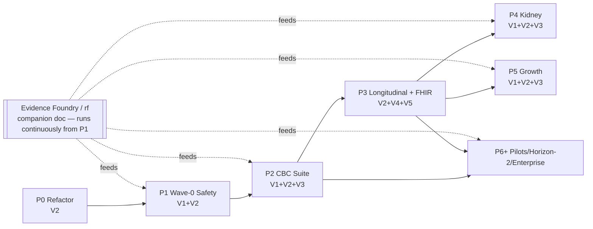

# Pediatric CDS Platform — Master Phased Expansion Roadmap

**Deliverable:** 01 of 2 deep-dive inputs to the pediatric-CDS expansion plan (product / clinical / engineering / validation phasing).
**Companion:** 02 — *Evidence Foundry powered by Research Foundry* (the evidence-to-executable pipeline). This document **references** that track and names where it plugs in; it does **not** design it in depth.
**Date:** 2026-07-17 (authored); **phase-status corrected 2026-07-19 during P0 truth reconciliation — see below.**
**Status of the product being planned:** UNVALIDATED research prototype (v0.3.1). Every phase below preserves that honesty until the validation gates in §B are actually passed. Software tests prove behavior, not clinical validity.
**Phase-ladder status as of 2026-07-19 (this line is authoritative; §A.1 and §B.0 below describe the pre-P0 starting state and are historical framing, not current status):** **P0 (platform foundation refactor) is complete**, merged to `main` as `ff4b519a160cbfa2a4d19337130cd031c9a7c12b`, V2 gate AC-1..AC-6 passed (`.claude/worknotes/platform-foundation-p0/v2-gate-results.md`). **P1 (Wave-0 safety & defensibility foundation) is in planning only** — PRD + Tier-3 implementation plan exist on unmerged branch `worktree-wave0-safety-foundation`; no Phase-1 code has landed on `main`. P2–P6+ have not started. See `00-expansion-plan.md` §5 for the current next-action list.
**Source docs this roadmap executes against:**
- `docs/project_plans/pediatric-cds-expansion-dr.md` (the deep-research strategy — hereafter **DR**)
- `docs/project_plans/pediatric-cds-commercialization-package-2026-07-16/Pediatric_CDS_Commercialization_Strategy.md` (**COMM**)
- `docs/project_plans/pediatric-cds-commercialization-package-2026-07-16/Pediatric_Anemia_CDS_Current_App_Specification.md` (**SPEC**)
- `docs/project_plans/pediatric-cds-commercialization-package-2026-07-16/Pediatric_CDS_Module_Research_Foundry_Prompt.md` (**RF-PROMPT**)
- `docs/architecture.md` (**ARCH**)

---

## A. Framing

### A.1 Where the product is today (honest current-state)

The repository is a **single-module (anemia) deterministic research prototype**: a browser-local SPA plus a mirror API that is not called by the UI (ARCH §2). The engine pipeline is `patient JSON → deriveFacts() → JSON rule engine → merge/rank → evidence-linked output + rule audit` (SPEC "Runtime").

**What the 91-rule anemia engine actually proves:**

| Proven today | Evidence in repo |
|---|---|
| A generic, inspectable JSON rule DSL works for pediatric lab interpretation (all/any/not, 13 operators, candidate/alert/question/note outputs, `{{fact}}` interpolation) | `src/ruleEngine.js` (`evaluateCondition`, `runRules`) — **already module-agnostic** |
| Deterministic, reproducible output for identical input | `tests/engine.test.mjs` "rule execution is deterministic for identical input" |
| Ordinal ranking (5-level `LEVEL_RANK`, `ALERT_RANK`) with a full matched-rule audit trail | `ruleEngine.js` `LEVEL_RANK`/`ALERT_RANK`; `engine.js` `provenance.ruleAudit` |
| Local reference ranges override built-in AAP fallbacks, with per-value provenance | `src/referenceRanges.js` `getEffectiveRanges` (`source: 'LOCAL_LAB'` vs `'AAP2026_IDA'`) |
| Safety exits / abstention for out-of-scope age and missing ranges | `facts.js` `scope.*`; rules `SCOPE-001/002/003`; test "young infant is not forced through built-in thresholds" |
| Evidence linkage from rule → source registry | `data/rules.json` `evidence[]` → `src/evidence.js` `EVIDENCE`; `scripts/validate-kb.mjs` enforces referential integrity |
| A repeatable quality gate | `package.json` `check = test && validate && build && smoke` (10 tests, KB validate, static build, HTTP smoke) |

**What it does NOT prove (the gap the phases close):**

| Not proven / not present today | Why it blocks a second module |
|---|---|
| **Multi-module structure.** The domain logic is welded to anemia: `facts.js::deriveFacts()` hard-codes ~350 lines of anemia facts; `engine.js::assessPediatricAnemia()` + `classificationSummary()` + `globalLimitations()` are anemia-specific; `referenceRanges.js` hard-codes CBC/ferritin; `data/rules.json` is one flat array. | Adding neutropenia today means editing anemia files — no isolation, no per-module release, no shared runtime contract. |
| **Tri-state data.** `schemas/patient-input.schema.json` models history/symptoms/exam as `booleanMap` — **absent, unknown, and not-assessed collapse to `false`**. `facts.js` treats `=== true` as present and everything else as absent. | COMM no-go and RF-PROMPT §4 both require present / absent / unknown / not-assessed. Missingness must not read as normal (RF-PROMPT §10). |
| **Exact-passage provenance.** `evidence.js` stores a `supports[]` array of *claim summaries*, not exact passages with page/section/table locators. | DR "Evidence extraction"; COMM highest-priority #7; RF-PROMPT §2. Defensibility requires the exact passage per rule. |
| **Signed KB manifest + semantic diff.** `KNOWLEDGE_BASE_VERSION` is a string constant in `evidence.js`; no hash, no signature, no supersession, no rule-to-rule diff. | ARCH §6 manifest and §10 fail-closed-on-invalid-signature are unmet. No governed release is possible. |
| **Rule metadata for governance.** `rule.schema.json` requires only `id/category/when/evidence/output`. No effective/retire dates, owner, clinical approvers, safety class, required test-case IDs, change rationale (ARCH §7 "production additions"). | No change control, no dual clinical review, no per-rule audit. |
| **Clinical validity.** SPEC "Production blockers": clinical review, tri-state, multi-site retrospective, silent mode, human factors, intended-use/regulatory, security, quality system, content rights, signed release. | The whole validation ladder (§B gates) is unrun. |
| **Longitudinal state / EHR interop.** No timeline, work queue, repeat-interval logic, referral packet, SMART launch, or CDS Hooks. The API is single-shot stateless (`/api/v1/assess`). | DR product thesis ("calculator + pathway + longitudinal state + governance"); COMM Waves 2–3. |

### A.2 The three load-bearing architectural shifts (and why this order)

Before **any** second clinical module is safe to add, three shifts must land. They are ordered by *irreversibility of the mistake they prevent*.

1. **Shift 1 — Multi-module KB structure + shared rules runtime (Phase 0).**
   Extract a module-agnostic runtime and per-module KB packages out of the anemia-specific code. The rule *evaluator* (`ruleEngine.js`) is already generic; the coupling is in fact-derivation, reference ranges, evidence, engine assembly, and the flat rules file. **This is first because doing Shift 2 or 3 on top of anemia-welded code would bake the anemia assumptions into the tri-state model, the manifest, and the provenance schema** — you would pay the extraction cost anyway, plus a migration. Refactor the substrate while there is exactly one module and a green test suite to protect the behavior.

2. **Shift 2 — Wave-0 safety & defensibility foundation (Phase 1).**
   Tri-state fact model, local reference-range registry + unit service, exact-passage evidence records, signed KB manifest + semantic diff, expanded validation corpus, clinical-review portal concept. **This is second because it is the safety contract every future rule must satisfy.** If tri-state and exact-passage provenance arrive *after* the CBC suite, every CBC rule is authored against a boolean model and un-sourced evidence and must be reworked. COMM sequences this as **Wave 0** explicitly ("Safety and defensibility foundation") *ahead of* the Wave 1 CBC suite. Get the guardrail in before pouring content through it.

3. **Shift 3 — Evidence Foundry pipeline (cross-cutting, first exercised at Phase 2; see companion doc).**
   The governed loop `research question → discovery → extraction → conflict adjudication → candidate rule → clinician review → machine-readable encoding → automated testing → retrospective validation → signed release → surveillance` (DR "Research Foundry operating model"; RF-PROMPT). **It plugs in at three seams that Phases 0–1 create:** (a) it *emits* into the per-module KB package format from Shift 1; (b) it *populates* the exact-passage evidence records and rule metadata from Shift 2; (c) its `signed release` step *is* the manifest+diff gate from Shift 2. It is third in *dependency* order but runs *continuously* from Phase 2 onward — every new module's clinical content is an Evidence Foundry output, never hand-authored. Depth is deferred to the companion doc.

**One-line justification of the ordering:** *Structure before safety before content* — refactor the substrate while there is one module to protect, install the safety/provenance contract before authoring rules against it, and let the Evidence Foundry (which produces content into that contract) run continuously once both are in place.

### A.3 Hard guardrails (apply to every phase — from COMM "Key risks / no-go")

- No autonomous diagnosis. No patient-facing CDS. No unsupported confidence %. No treatment/dosing/transfusion directives.
- No PHI in the public microsite (the browser-only invariant, ARCH §4).
- No random calculator expansion. No AI-published rule changes (generative AI never makes the final patient-specific decision — RF-PROMPT §10).
- No compliance/clinical claim based on architecture or disclaimers alone.
- Ranking points are **priority, not probability** (`engine.js` `globalLimitations`). This invariant survives every phase.

---

## B. The phase ladder

**Validation ladder reference (DR "Validation roadmap"), used as the gate vocabulary below:**

| Stage | Goal | Advance criterion (DR) |
|---|---|---|
| **V1 Content** | Verify source truth + rule interpretations | dual-source verification, expert adjudication, dangerous-miss review |
| **V2 Technical** | Verify deterministic behavior | unit, schema, mutation, property-based, reproducibility, diff tests |
| **V3 Retrospective** | Verify chart-level behavior | multisite structured data + chart adjudication + subgroup analysis |
| **V4 Silent mode** | Verify workflow fit + hidden safety | live data, no display, missing-data + override simulation |
| **V5 Human factors** | Verify comprehension + cognitive load | time-on-task, interpretation accuracy, trust calibration, alert fatigue |
| **V6 Interventional** | Verify outcome + business value | stepped-wedge / cluster-RCT / interrupted time series |

**Effort key:** S ≤ ~1 wk · M ~2–4 wk · L ~1–2 mo · XL ~3+ mo (single-builder-equivalent; parallelizable where noted).
**Wave mapping (COMM "Recommended product sequence"):** Wave 0 → Phases 0–1 · Wave 1 → Phase 2 · Wave 2 → Phase 3 · Wave 3 → Phases 4–5 · Wave 4 → Phase 6+.

### B.0 Sequencing overview

| Phase | Title | Wave | Depends on | Gate(s) | Effort | Can parallelize with | Blocks |
|---|---|---|---|---|---|---|---|
| **P0** | Platform foundation refactor | 0 | — | V2 | L | (nothing — must go first) | everything |
| **P1** | Wave-0 safety & defensibility foundation | 0 | P0 | V1+V2 | XL | — | P2+ |
| **P2** | CBC Suite (build-first #1) | 1 | P1 | V1+V2+V3 | XL | P4/P5 evidence runs | P3 |
| **P3** | Longitudinal + referral + SMART-on-FHIR | 2 | P2 | V2+V4+V5 | XL | P4/P5 evidence runs | P4, P5, P6 |
| **P4** | Kidney / Urinalysis (build-first #2) | 3 | P3 | V1+V2+V3 | L–XL | **P5** (both build after P3) | P6-C |
| **P5** | Growth Faltering (build-first #3) | 3 | P3 | V1+V2+V3 | L | **P4** | — |
| **P6+** | Pilots + Horizon-2 + enterprise | 4 | P2, P3 | track-specific (V4/V6) | XL, ongoing | internally (A–F) | — |

**Critical path (build):** `P0 → P1 → P2 → P3 → {P4 ∥ P5} → P6`. **Off-critical-path work that should start early:** all Evidence-Foundry `rf` runs for a module have *no code dependency* and should be launched ~one phase ahead of the build that consumes them (e.g. RF-KID-* and RF-GRO-* runs kick off during P3). The schedule drivers are **retrospective validation (V3)** for the clinical modules and a **data partner + silent mode (V4)** for P3 — both gate *release*, not *build*, so build can continue while validation runs.



**Rough calendar anchoring to the DR roadmap horizons** (DR "Roadmap" 90d/12mo/36mo): **90 days** ≈ P0 + most of P1 (shared runtime, threshold profiles, rule-trace, content+technical validation, design-partner LOIs). **12 months** ≈ P2 + P3 (CBC + kidney beta with longitudinal workspace; retrospective + silent mode; PEDSnet/CALIPER partnerships). **36 months** ≈ P4/P5 + P6 (growth/thyroid/monitoring; interventional studies; enterprise/API licensing). These are directional, not commitments.

---

### Phase 0 — Platform foundation refactor

**Goal & scope.** Extract a module-agnostic rules runtime + per-module KB package structure out of the anemia-specific code, with **zero clinical behavior change**. Make the current thing multi-module-ready. The anemia module stays green through the entire refactor.

**Deliverables / workstreams (tied to repo artifacts):**

| WP | Change | Files |
|---|---|---|
| P0-WP1 | Define the **module package contract**: `modules/<id>/{rules.json, candidates.json, evidence.json, reference-ranges.json, facts.<id>.js, module.json}`. Move anemia content into `modules/anemia/` unchanged. | new `modules/anemia/*`; move `data/rules.json`, `data/candidates.json`, `data/evidence.json`, `data/reference-ranges.json` |
| P0-WP2 | Extract a **fact-derivation registry**: `deriveFacts(input, module)` dispatches to a per-module derivation function. Split `facts.js` into a shared numeric/tri-state helper core + `facts.anemia.js`. | `src/facts.js` → `src/facts/core.js` + `modules/anemia/facts.anemia.js` |
| P0-WP3 | Generalize the engine: `assess(input, moduleId)` replaces `assessPediatricAnemia`. Move `classificationSummary`/`globalLimitations` into per-module hooks (`module.summarize`, `module.limitations`). Keep `ruleEngine.js` **as-is** (already generic). | `src/engine.js`; `src/ruleEngine.js` (unchanged) |
| P0-WP4 | Generalize reference ranges into a **registry keyed by (module, analyte, age, sex)**; anemia CBC/ferritin becomes the first registered profile. | `src/referenceRanges.js` → `src/ranges/registry.js` + `modules/anemia/ranges.json` |
| P0-WP5 | Make `validate-kb.mjs`, `build-static.mjs`, `smoke-test.mjs`, and `server.mjs` **iterate over registered modules** instead of hard-coding `data/*.json`. Add a module-load unit test. | `scripts/*.mjs`, `server.mjs`, `tests/` |
| P0-WP6 | Version bump + KB manifest **stub** (unsigned) per module: move `KNOWLEDGE_BASE_VERSION`/`REVIEWED_THROUGH` from `evidence.js` into `module.json`. | `src/evidence.js`, `modules/anemia/module.json` |

**Research required.**
- *Clinical/evidence:* **none.** This is a pure refactor; no new clinical claims. (Explicitly: do not let scope creep add rules here.)
- *Technical spikes:* **SPIKE-001** module-package boundary + fact-registry design (does a per-module `deriveFacts` cleanly separate shared numeric helpers from domain facts?); **SPIKE-002** multi-module loader in `server.mjs`/`build-static.mjs` without breaking the content-hash cache-busting already in `build-static.mjs`.
- *Product/regulatory:* none.

**Validation stage gate.** **V2 Technical only.** Go criterion: **all existing tests still pass unchanged** (the 10 `engine.test.mjs` assertions, `validate`, `build`, `smoke` — i.e. `npm run check` green) **plus** new module-loader tests, **plus** a byte-for-byte (modulo `generatedAt`) output-equivalence test: anemia assessment output is identical pre- and post-refactor for all 6 worked examples in `examples/`. No-go if any anemia output changes.

**Dependencies.** None (starting phase).
**Effort.** **L.** **Sequencing:** must precede all others; internally P0-WP1→WP2→WP3 serial, WP4/WP5/WP6 parallel after WP1.

**AOS wiring.** IntentTree **work_area** `platform-foundation` with work_packages P0-WP1…WP6. Author the impl-plan with the **`planning`** skill (PRD not needed — no product surface change). Gate the refactor design with **`council-review`** (architecture council) *before* coding, since it constrains every later phase. No `rf` runs (no evidence work). Run via `op` at Tier 2–3 (execution).

---

### Phase 1 — Wave-0 safety & defensibility foundation

**Goal & scope.** Install the safety/provenance contract every future rule must satisfy: tri-state data, local range + unit service, exact-passage evidence, signed KB manifest + semantic diff, expanded validation corpus, clinical-review portal concept. Anemia is the guinea pig; no new clinical modules yet. This is COMM **Wave 0**.

**Deliverables / workstreams:**

| WP | Change | Files / artifacts |
|---|---|---|
| P1-WP1 | **Tri-state fact model.** Replace `booleanMap` with `present / absent / unknown / not-assessed` per field. Add operators `is-present`/`is-absent`/`is-unknown`/`is-not-assessed` to `ruleEngine.js`; migrate `facts.anemia.js` `countTrue`/`=== true` logic; missingness must produce *narrowed differential + next tests*, never a clear. | `schemas/patient-input.schema.json` ($defs `booleanMap`→`triState`), `src/ruleEngine.js`, `modules/anemia/facts.anemia.js`, `data/rules.json` migration |
| P1-WP2 | **Local reference-range registry + unit service.** Formalize `ranges/registry.js` (P0-WP4) into a service with UCUM units, per-analyte age/sex partitions, and a **fail-closed unit-mismatch rejection** (ARCH §8, §10). CALIPER-compatible partition shape (DR "local range engine is mandatory"). | `src/ranges/registry.js`, new `src/units.js`, `schemas/reference-range.schema.json` |
| P1-WP3 | **Exact-passage evidence records.** Extend evidence schema: `sourceLocator` (page/section/table/figure), `exactPassage`, `evidenceGrade`, `applicability` (age/sex/assay), `reviewDate`, `supersedes`, `surveillanceQuery` (RF-PROMPT §2). Backfill anemia's 6 sources. | `src/evidence.js`→`data/*/evidence.json` + `schemas/evidence.schema.json` |
| P1-WP4 | **Rule metadata for governance.** Extend `rule.schema.json` (ARCH §7 additions): `version`, `effectiveDate`, `retireDate`, `owner`, `clinicalApprovers[]`, `safetyClass`, `requiredTestCaseIds[]`, `changeRationale`, `sourcePassageId`. | `schemas/rule.schema.json`, `data/*/rules.json` |
| P1-WP5 | **Signed KB manifest + semantic diff.** Implement ARCH §6 manifest (`clinicalContentHash`, `engineCompatibility`, `evidenceReviewedThrough`, `approvedBy[]`, `validationRunId`, `supersedes`, signature). New `scripts/sign-kb.mjs` + `scripts/kb-diff.mjs` (rule-add/remove/threshold-change/evidence-change classes). Server rejects unverifiable/expired KB (ARCH §10 fail-closed). | new `scripts/sign-kb.mjs`, `scripts/kb-diff.mjs`, `server.mjs`, `schemas/kb-manifest.schema.json` |
| P1-WP6 | **Expanded validation corpus.** Add property-based, boundary, mutation, and **dangerous-miss** test suites (DR "Execution layer": mutation/property/boundary/version-diff; RF-PROMPT §6). Dangerous-miss set for anemia = marrow failure, hemolysis, severe cytopenia (already partially in `examples/marrow-red-flags`). | `tests/property.test.mjs`, `tests/boundary.test.mjs`, `tests/mutation.test.mjs`, `tests/dangerous-miss.test.mjs`; new `scripts/mutation-run.mjs` |
| P1-WP7 | **Clinical-review portal — concept + data contract only** (not the full app). Define the change-proposal → dual-review → conflict-resolution → approval record shape (ARCH "Clinical governance portal"). Emits `approvedBy[]` into the manifest (P1-WP5). | `docs/` design + `schemas/review-record.schema.json` |

**Concrete contract shapes (illustrative — these are what P1 must produce, grounded in current repo shapes):**

*Tri-state field (P1-WP1): replaces the current `booleanMap` collapse.* Today `history.pica === true` is the only "present" signal; `false`/absent/never-touched are indistinguishable. After:

```json
// patient-input: history.pica  (was: boolean)
{ "state": "present" }        // clinician asserted present
{ "state": "absent" }         // clinician asserted absent  (≠ unknown)
{ "state": "unknown" }        // asked, patient/parent unsure
{ "state": "not-assessed" }   // never asked  (default; must narrow, not clear)
```
New `ruleEngine.js` operators `is-present`/`is-absent`/`is-unknown`/`is-not-assessed`; a differential-clearing rule requires `is-absent`, **not** the old falsy check — so `not-assessed` can never satisfy a "rule out" branch (RF-PROMPT §10 "missingness is not treated as normal").

*Exact-passage evidence record (P1-WP3): extends `evidence.js` `supports[]` (claim summaries) into locatable passages.*

```json
{
  "id": "AAP2026_IDA#ferritin-threshold",
  "sourceId": "AAP2026_IDA",
  "sourceLocator": { "section": "Diagnosis", "table": "Table 2", "page": "e2026077414-7" },
  "exactPassage": "Ferritin ≤20 ng/mL in children and ≤30 ng/mL in adolescents and menstruating individuals…",
  "evidenceGrade": "guideline-clinical-report",
  "applicability": { "ageMonthsMin": 6, "ageMonthsMax": 216, "assay": "immunoturbidimetric" },
  "reviewDate": "2027-01-15", "supersedes": null,
  "surveillanceQuery": "AAP pediatric iron deficiency ferritin threshold update",
  "status": "source-supported"   // vs. "implementation-proposal"
}
```

*Rule governance metadata (P1-WP4): the ARCH §7 additions layered onto the current `id/category/when/evidence/output` shape.*

```json
{ "id": "ID-001", "version": "1.1.0", "effectiveDate": "2027-01-15", "retireDate": null,
  "owner": "pediatric-hematology", "clinicalApprovers": ["heme-lead","genped-lead"],
  "safetyClass": "differential", "sourcePassageId": "AAP2026_IDA#ferritin-threshold",
  "requiredTestCaseIds": ["ida-toddler","boundary-ferritin-20"],
  "changeRationale": "align threshold wording to exact AAP passage" }
```

*Signed KB manifest (P1-WP5): implements ARCH §6, enforced fail-closed by `server.mjs` (ARCH §10).*

```json
{ "moduleId": "anemia", "knowledgeBaseVersion": "1.0.0-2027-01-15",
  "clinicalContentHash": "sha256:…", "engineCompatibility": ">=1.0.0 <2.0.0",
  "evidenceReviewedThrough": "2027-01-15",
  "approvedBy": [ {"role":"pediatric hematologist","approvalId":"…"},
                  {"role":"general pediatrician","approvalId":"…"},
                  {"role":"laboratory medicine","approvalId":"…"} ],
  "validationRunId": "…", "supersedes": "0.9.4-2026-11-01", "signature": "…" }
```

**Research required.**
- *Clinical/evidence (→ Evidence Foundry / `rf`):* **RF-EV-001** exact-passage backfill for the 6 anemia sources — locate page/section/table for each `supports[]` claim (AAP2026_IDA, WHO2024_HB, BLOOD2022, CDC2025_LEAD, FDA2026_CDS, BSH2020_G6PD). **RF-EV-002** CALIPER (and Bohn 2023) pediatric CBC reference-interval partitions to seed the range registry with a real second profile (DR evidence matrix row "CALIPER database and Bohn 2023").
- *Technical spikes:* **SPIKE-003** tri-state fact-model migration (does the new model preserve all 6 example outputs? what is the default for a field the clinician never touched — `not-assessed`, and does that suppress or narrow?). **SPIKE-004** FHIR/UCUM unit-mismatch rejection semantics (reject vs. convert — ARCH §8 "reject unit mismatches rather than silently convert"). **SPIKE-005** semantic-diff classification (what rule change classes exist, which are "safety-relevant" and force re-review?). **SPIKE-006** KB signing key custody + verification in a static/browser deploy (where does the public key live; how does the browser-only mode verify?).
- *Product/market/regulatory:* **MKT-001** 20–30 structured customer/buyer interviews (COMM 90-day). **REG-001** intended-use + non-device-CDS mapping memo against FDA Jan-2026 CDS guidance (DR "Regulatory position"; evidence `FDA2026_CDS`) — establishes the abstention/transparency posture the tri-state + exact-passage work is defending. **REG-002** content-rights / licensing review for reused guideline tables (RF-PROMPT §1.6).

**Validation stage gate.** **V1 Content + V2 Technical.**
- V1 go criterion: every anemia rule has an exact source passage or is explicitly flagged `implementation-proposal`; dangerous-miss review by a clinical advisor signs off (COMM 90-day "clinical advisory board").
- V2 go criterion: property/boundary/mutation/dangerous-miss suites green; mutation score ≥ target (define baseline this phase); manifest verifies + fail-closed paths tested; semantic diff produces a correct change report on a seeded change.
- **No-go:** any rule without a passage or proposal flag; any dangerous-miss test regression; unsigned/expired KB not rejected by the server.

**Dependencies.** Phase 0 green (module structure + generic runtime).
**Effort.** **XL.** **Sequencing:** P1-WP1 (tri-state) and P1-WP2 (ranges/units) are the long poles and can parallelize; P1-WP3/WP4 (schemas) parallel; P1-WP5 depends on WP3+WP4; P1-WP6 depends on WP1; P1-WP7 is a paper design that can run throughout.

**AOS wiring.** IntentTree **work_area** `wave0-safety-foundation`. Evidence work (RF-EV-001/002) → **`rf`** runs via the Evidence Foundry (companion doc owns depth). Tri-state and unit-rejection designs → **`council-review`** (safety council) before merge — these are the invariants the whole platform leans on. **REG-001** intended-use memo → `rf` (regulatory research) + human legal review flagged (RF-PROMPT §7 "distinguish legal analysis from conclusions requiring counsel"). PRDs for the review-portal concept → **`planning`**. Route through `op` at Tier 3.

---

### Phase 2 — CBC Suite expansion (build-first module #1)

**Goal & scope.** Extend anemia into the coherent **CBC / cytopenia suite** — neutropenia, leukocytosis/lymphocytosis, eosinophilia, platelet disorders, pancytopenia, and smear-driven branches — per the DR **"Pediatric CBC Suite"** spec. This is the first NEW clinical content that exercises the platform substrate and the Evidence Foundry end-to-end. DR portfolio rank **#1 (4.8)**; COMM **Wave 1**.

**Deliverables / workstreams:**

| WP | Change | Files / artifacts |
|---|---|---|
| P2-WP1 | **Neutropenia branch** — deterministic severity gate (mild/moderate/severe by ANC), scope exits for febrile neutropenia / suspected leukemia (DR CBC "Exclusions"), referral-readiness. | new `modules/cbc/` package; `rules.cbc.json`, `candidates.cbc.json`, `facts.cbc.js` |
| P2-WP2 | **Leukocytosis / lymphocytosis + eosinophilia branches** — reactive vs. red-flag (blasts on smear, hyperleukocytosis exit). | `modules/cbc/*` |
| P2-WP3 | **Platelet-disorder branch** — thrombocytopenia (ITP-pattern vs. red-flag), thrombocytosis (reactive vs. persistent). Reuse `facts.js` `thrombocytopenia`/`thrombocytosis` flags already present. | `modules/cbc/*`, reuse anemia cytopenia facts |
| P2-WP4 | **Pancytopenia / multilineage branch** — urgent marrow-failure exit (DR: "explicit marrow-failure safety flags"). Reuse `facts.js` `multilineageCytopenia`. | `modules/cbc/*` |
| P2-WP5 | **Smear-integration layer** — extend the existing `smear[]` enum + branches (blasts, teardrops, schistocytes already modeled in `facts.js`) into cytopenia logic. | `schemas/patient-input.schema.json`, `modules/cbc/*` |
| P2-WP6 | **Shared CBC gate** — a common severity/urgency + missing-data gate that anemia and the new branches both consume (extract from anemia `SCOPE-*`/`ALERT-*`). Iron branch + Ret-He hook stays **optional + locally profiled** (DR: "Ret-He optional and locally profiled"). | `modules/cbc/gate.json`, range registry (Ret-He profile, disabled by default) |

**Research required.**
- *Clinical/evidence (→ Evidence Foundry / `rf`, one run per branch, using RF-PROMPT template):*
  - **RF-CBC-001** pediatric **neutropenia** scope-exit thresholds + severity bands + red-flags (DR evidence "Katsaras 2024 neutropenia review"; source class: society guidance + narrative reviews).
  - **RF-CBC-002** pediatric **pancytopenia** etiologies + marrow-failure safety exits (DR "2026 pancytopenia systematic review, n=3,768").
  - **RF-CBC-003** pediatric **thrombocytopenia/thrombocytosis** branch logic (ITP-pattern vs. red-flag; reactive thrombocytosis).
  - **RF-CBC-004** **leukocytosis/lymphocytosis/eosinophilia** reactive-vs-referral logic + hyperleukocytosis exit.
  - **RF-CBC-005** pediatric CBC **age/sex reference partitions** for WBC/ANC/platelets/eos (CALIPER/Bohn) to extend the P1 range registry beyond Hb/MCV/RDW.
  - **RF-CBC-006** (optional/pilot-adjacent) **Ret-He** iron-deficiency confirmation thresholds — analyzer-dependent (DR "Poventud-Fuentes 2024, n=3,158; threshold portability uncertain"). Kept behind a local-profile flag.
- *Technical spikes:* **SPIKE-007** cross-module fact sharing (anemia and CBC both need cytopenia facts — one shared `facts/hematology.js` vs. duplicated?). **SPIKE-008** candidate-ranking across a larger differential (does `LEVEL_RANK` ordinal ranking still read sensibly at ~15 candidates?). **SPIKE-009** referral-readiness output shape (what fields does a "complete CBC referral packet" need — feeds Phase 3).
- *Product/market/regulatory:* **MKT-002** design-partner interest in cytopenia workflow (COMM "design-partner LOIs"). **REG-003** confirm each CBC branch stays inside the non-device CDS envelope (abstention-capable, non-time-critical, options-not-directives — DR "Regulatory position"); neutropenia/pancytopenia are the highest-liability branches — extra silent-mode evidence flagged per DR "Risk note".

**Validation stage gate.** **V1 Content → V2 Technical → V3 Retrospective.**
- V1: each branch's rules have exact passages + pediatric-heme + lab-medicine advisory sign-off; dangerous-miss review specifically for marrow failure, severe neutropenia, hyperleukocytosis (DR CBC "Validation requirements").
- V2: full property/boundary/mutation/dangerous-miss corpus per branch; deterministic reproducibility; semantic diff clean vs. prior release.
- V3: **retrospective multisite chart-adjudicated** validation with subgroup checks by age band, sex, site, analyzer platform (DR `validation_result` schema: `dangerous_miss_rate`, `referral_completeness_delta`). **Go criterion:** dangerous-miss rate ≤ preset threshold (DR uses `0.008` as an illustrative target) **and** specialist-adjudicated pattern-match acceptable; **no-go** without acceptable dangerous-miss analysis (DR `roadmap_item.go_no_go`).

**Dependencies.** Phase 1 green (tri-state, ranges/units, exact-passage evidence, manifest, corpus) — CBC rules are authored *against* those contracts. Evidence Foundry operational (companion doc).
**Effort.** **XL.** **Sequencing:** P2-WP6 (shared gate) first; then WP1–WP5 branches parallelize (one `rf` run + one branch each). Retrospective validation (V3) is the long pole and gates release, not build.

**AOS wiring.** IntentTree **work_area** `cbc-suite` with a work_package per branch (WP1–WP6); each branch's clinical content is an **Evidence Foundry `rf` run** (RF-CBC-00x), never hand-authored (guardrail: no AI-published rules — the `rf` output is a *proposal* that goes through the P1-WP7 review portal). **`council-review`** (clinical-safety council) gates each branch's dangerous-miss set before V3. **`planning`** produces the module PRD + impl-plan. This phase is where the full `op`-orchestrated Evidence→Executable loop first runs end to end.

---

### Phase 3 — Longitudinal workspace + referral-readiness + SMART-on-FHIR

**Goal & scope.** Add the recurring-workflow layer (patient timeline, unresolved-abnormality work queue, repeat-interval logic, referral packet) and standards-based EHR integration (SMART App Launch, CDS Hooks, FHIR Questionnaire/Observation/PlanDefinition). This is the DR product thesis's "longitudinal workspace + work queue + referral-readiness" and COMM **Wave 2**. It is what makes the platform *monetizable* (COMM: paid value is EHR context + longitudinal state + referral outputs, not facts).

**Deliverables / workstreams:**

| WP | Change | Files / artifacts |
|---|---|---|
| P3-WP1 | **Longitudinal state model** — a server-side (governed) patient timeline of prior assessments + labs; repeat-interval + "expected response to iron" follow-up logic (already sketched in anemia `prior_treatment_response`). Introduces **server/PHI mode** → HIPAA scope begins (ARCH §4 "Server mode", cross-cutting track C.2). | new persistence layer; `schemas/timeline.schema.json` |
| P3-WP2 | **Unresolved-abnormality work queue** — pending labs, repeat intervals, non-response escalation (DR "work queue layer"). | server API; `schemas/work-queue.schema.json` |
| P3-WP3 | **Referral-readiness packet generator** — assembles evidence, rule trace, missing items for the specialist (DR "referral-readiness layer"; consumes P2-WP9 output shape). Clinician-reviewed, non-authoritative. | new `src/referral.js`; `schemas/referral-packet.schema.json` |
| P3-WP4 | **SMART App Launch** — OAuth2/FHIR launch + provenance-aware autofill of Observation/Patient (COMM highest-priority #3; ARCH §8; evidence `R3` SMART v2.2.0). | new `src/fhir/launch.js`, adapter |
| P3-WP5 | **CDS Hooks** — workflow-triggered card / app-launch (evidence `R4` CDS Hooks v2.0.1; JSON over HTTPS). Card is transient, non-directive, source-linked (ARCH §8). | `src/fhir/hooks.js` |
| P3-WP6 | **FHIR resource mapping** — Questionnaire/QuestionnaireResponse for the tri-state adaptive questionnaire, Observation/DiagnosticReport ingestion, PlanDefinition/GuidanceResponse output (RF-PROMPT §5; ARCH §8). **Reject unit mismatches** (uses P1-WP2 unit service). | `src/fhir/mapping.js`; LOINC/SNOMED/UCUM code tables |
| P3-WP7 | **Tri-state adaptive questionnaire UI** — surface present/absent/unknown/not-assessed in the SPA (COMM highest-priority #4), ordered by information value (RF-PROMPT §4). | `src/app.js`, `src/algorithmExplorer.js` |

**Research required.**
- *Clinical/evidence (→ `rf`):* **RF-LONG-001** pediatric **repeat-interval / expected-response** evidence for iron therapy + unresolved-abnormality follow-up timing (DR CBC "Follow-up branch"; anemia AAP source). **RF-LONG-002** **referral-completeness** criteria — what a pediatric heme referral packet must contain to be "complete at first specialist visit" (DR original-research table "referral completeness"). **RF-LONG-003** pediatric **delta-check / personalized-baseline caveat** review — *not* to build surveillance yet, but to bound P3's repeat-interval logic away from naive delta checks (DR Horizon-2: "pediatric delta checks remain problematic… poor-to-moderate performance").
- *Technical spikes:* **SPIKE-010** SMART App Launch against a public sandbox (SMART Health IT / a vendor sandbox). **SPIKE-011** CDS Hooks card round-trip + `Idempotency-Key` semantics (ARCH §5 headers). **SPIKE-012** FHIR unit-mismatch **rejection** end-to-end (Observation UCUM vs. local range units). **SPIKE-013** longitudinal persistence with **minimal-PHI** design (ARCH §4 "age in months + local encounter correlation ID only"). **SPIKE-014** how longitudinal timeline stays reproducible/versioned across KB releases (a re-assessment under a new KB must show the version delta, not silently reclassify).
- *Product/market/regulatory:* **MKT-003** enterprise buyer discovery (children's hospital / pediatric network — DR "most plausible buyer"). **MKT-004** pricing validation against COMM monetization tiers (Practice / Enterprise / API). **REG-004** HIPAA Security Rule posture for server/PHI mode (BAA, risk analysis — ARCH §9; evidence `R7`). **REG-005** FTC Health Breach Notification Rule applicability (evidence `R8`). **REG-006** re-map intended use now that output enters EHR workflow via CDS Hooks (time-criticality + directive-vs-options re-assessment under FDA CDS guidance).

**Validation stage gate.** **V2 Technical + V4 Silent mode + V5 Human factors begin.**
- V2: FHIR mapping conformance tests; unit-mismatch rejection tests; longitudinal reproducibility tests.
- V4: **prospective silent mode** — live EHR data, no clinician-facing display, measure missing-data behavior + would-be alerts + override simulation (DR V4). Go criterion: no hidden dangerous behavior; missingness never silently clears.
- V5: **human-factors** on the referral packet + tri-state questionnaire — time-on-task, interpretation accuracy, trust calibration, alert fatigue (DR V5; DR original-research "Explanation and trust calibration"). Go: comprehension + appropriate-override metrics meet preset thresholds (DR 12-month gate).

**Dependencies.** Phase 2 green (a real multi-branch module to make longitudinal + referral meaningful). Server/PHI mode triggers cross-cutting tracks C.2 (privacy/security) and C.1 (quality system) in earnest.
**Effort.** **XL.** **Sequencing:** P3-WP1/WP2/WP3 (workspace) parallel to P3-WP4/WP5/WP6 (interop); P3-WP7 (UI) integrates both. Silent mode requires a data partner (cross-cutting C.4) and is the schedule driver.

**AOS wiring.** IntentTree **work_area** `longitudinal-and-interop`, two work_packages (`workspace`, `smart-fhir`). SMART/FHIR spikes → IntentTree atomic tasks; evidence (RF-LONG-00x) → `rf`. **`council-review`** gates the PHI/server-mode threat model (this is where the no-PHI-microsite invariant meets a new PHI-bearing server — adversarial review is warranted). **`planning`** produces the enterprise product PRD. REG-004/005/006 → `rf` + flagged legal review. `op` Tier 3–4 (new subsystem + external integration).

---

### Phase 4 — Kidney / Urinalysis pathway (build-first module #2)

**Goal & scope.** Add the pediatric renal pathway — CKiD U25 eGFR, creatinine trend interpretation, proteinuria/albuminuria, hematuria, BP context, nephrology referral-readiness — reusing the platform + Evidence Foundry + longitudinal workspace. DR portfolio rank **#2 (4.4)**; COMM **Wave 3**. Proves the platform generalizes beyond hematology.

**Deliverables / workstreams:**

| WP | Change | Files |
|---|---|---|
| P4-WP1 | New `modules/kidney/` package; CKiD U25 creatinine eGFR as a **reviewed, unit-tested calculated fact** (ARCH §7: "calculated facts = small, reviewed, unit-tested library" — never executable code in rules). | `modules/kidney/*`, `src/calc/ckid-u25.js` |
| P4-WP2 | Combined creatinine+cystatin-C eGFR (prefer average when both present — DR `rule.kidney_u25_combo_preferred`). Missing-cystatin → compute cr-only **with labeled limitation** (DR "Missing-data behavior"). | `src/calc/ckid-u25.js` |
| P4-WP3 | Hematuria + proteinuria + BP integration branch (separate isolated microscopic hematuria from probable glomerular disease — DR Kidney "Deterministic logic"). | `modules/kidney/*` |
| P4-WP4 | Trend-aware interpretation (reuse Phase 3 longitudinal state — "trends often more informative than single estimate", DR/NIDDK). | uses P3-WP1 timeline |
| P4-WP5 | Scope exits: dialysis, transplant, nephrology-led, unstable AKI (DR Kidney "Exclusions"). | `modules/kidney/gate.json` |

**Research required.**
- *Clinical/evidence (→ `rf`):* **RF-KID-001** CKiD U25 equations + κ constants by age/sex + assay caveats (DR evidence "NIDDK CKiD U25"; source: NIDDK official equations). **RF-KID-002** hematuria/proteinuria/BP referral logic (DR "KSPN 2024 recommendations", "persistent microscopic hematuria reviews"). **RF-KID-003** pediatric BP classification profile (2017 AAP categories — DR "older but foundational"). **RF-KID-004** creatinine assay-method reference-interval dependence (feeds range registry; DR "creatinine assay method must be set correctly").
- *Technical spikes:* **SPIKE-015** calculated-fact library pattern (eGFR is the first real *formula* — validate the "no executable code in rules, calc is a reviewed library" boundary from ARCH §7 holds). **SPIKE-016** assay-method as a first-class range-profile dimension.
- *Product/regulatory:* **REG-007** eGFR output classification under FDA CDS guidance (a calculated eGFR + trend is closer to a "calculator" — confirm it stays non-device with transparent basis). **MKT-005** nephrology-referral-reduction value hypothesis with a design partner.

**Validation stage gate.** **V1 → V2 → V3.** V1: pediatric nephrology + lab-medicine sign-off; assay-specific validation (DR Kidney "Validation requirements"). V3: retrospective vs. nephrology chart review; subgroup by age, CKD stage, hematuria phenotype. Go: eGFR + referral logic concordant with specialist review (DR prioritized-action gate). Reuses V4/V5 machinery from Phase 3.

**Dependencies.** Phases 0–3 green. Reuses tri-state, ranges/units, manifest, longitudinal workspace, FHIR interop.
**Effort.** **L–XL.** **Sequencing:** can **start its `rf` evidence runs in parallel with Phase 3** (evidence has no code dependency); code build waits on Phase 3 workspace/interop. Kidney and Growth (Phase 5) can parallelize once the platform is stable.

**AOS wiring.** IntentTree **work_area** `kidney-pathway`. Evidence → `rf` (RF-KID-00x). Calculated-fact library → `council-review` (numerical-safety focus — a wrong κ constant is a silent dangerous miss). `planning` for the module PRD. `op` Tier 3.

---

### Phase 5 — Growth Faltering / Nutritional Deficiency pathway (build-first module #3)

**Goal & scope.** Add the anthropometric-trend + nutrition/social-risk pathway with adaptive staged testing, cross-linked to the CBC/iron suite. DR portfolio rank **#3 (4.1)**; COMM **Wave 3**. Exercises the **adaptive-questionnaire + z-score-trajectory** capabilities most heavily (DR: this is the best adaptive-questionnaire candidate).

**Deliverables / workstreams:**

| WP | Change | Files |
|---|---|---|
| P5-WP1 | New `modules/growth/`; anthropometric **z-score trajectory** calc (WHO <2y, CDC 2–20y — DR Growth "Thresholds"), as a reviewed calc library. | `modules/growth/*`, `src/calc/anthro-z.js` |
| P5-WP2 | Adaptive staged-testing questionnaire (history-first; broaden only on severity/failed intervention — DR `questionnaire.growth_faltering_adaptive_v1` `stopping_rules`). Heavy use of tri-state (P1) + FHIR Questionnaire (P3). | `modules/growth/*` |
| P5-WP3 | Cross-module link: low weight + microcytosis → CBC suite (DR: "Link low weight and microcytosis to CBC suite logic"). First **inter-module referral** — validates SPIKE-007 shared facts. | `modules/growth/*` + cross-ref to `modules/cbc` |
| P5-WP4 | Severity gate: never classify severity without ≥2 valid anthropometric observations unless already severe (DR "Missing-data behavior") — reuses longitudinal state. | `modules/growth/gate.json` |

**Research required.**
- *Clinical/evidence (→ `rf`):* **RF-GRO-001** z-score-based staged evaluation + selective-testing thresholds (DR evidence "Goodwin et al. 2023"; note: consensus-heavy → lower deterministic fit, so more `implementation-proposal` flags expected). **RF-GRO-002** WHO/CDC growth-chart z-score computation references. **RF-GRO-003** celiac/lead/UA/iron **conditional-testing** triggers (avoid blanket panels — DR Growth logic).
- *Technical spikes:* **SPIKE-017** two-observation-minimum trajectory logic on the longitudinal store. **SPIKE-018** inter-module hand-off contract (growth → CBC) generalized for future cross-links.
- *Product/regulatory:* **MKT-006** "reduces unnecessary lab ordering" value hypothesis + baseline (DR prioritized-action gate: "reduced unnecessary testing without missed serious disease"). **REG-008** confirm nutritional/social-risk prompts stay support-not-directive.

**Validation stage gate.** **V1 → V2 → V3.** V1: primary-care + GI/nutrition review. V3: retrospective on growth-triggered referrals; **human-factors specifically to ensure the tool *reduces* not increases lab ordering** (DR Growth "Validation requirements"). Go: reduced unnecessary testing without missed serious disease.

**Dependencies.** Phases 0–3 green; SPIKE-007 (shared facts) resolved in Phase 2. Parallelizable with Phase 4.
**Effort.** **L.** **Sequencing:** evidence runs can start during Phase 3/4; build after Phase 3 workspace + questionnaire UI land.

**AOS wiring.** IntentTree **work_area** `growth-pathway`. Evidence → `rf` (RF-GRO-00x). The heavy consensus/implementation-proposal ratio makes **`council-review`** important here (more judgment, thinner evidence). `planning` for PRD. `op` Tier 3.

---

### Phase 6+ — Pilots & Horizon-2 research + enterprise/commercial layer

**Goal & scope.** Advance the DR **pilot-first** concepts and Horizon-2 research, and build the commercial/enterprise layer. These are **pilots and research programs, not straight product builds** — each carries higher safety exposure, analyzer dependence, or a need for prospective validation before any claim (DR "Pilot first" / "Emerging research radar Horizon 2"). COMM **Wave 4**.

**Sub-tracks (each is its own IntentTree work_area; run as capacity allows, gated independently):**

| Track | Scope | Why pilot / defer | Gate before any product claim |
|---|---|---|---|
| **P6-A Neonatal bilirubin orchestration** | Workflow orchestration + discharge communication + follow-up handoff around the 2022 AAP hour-specific thresholds (DR "Neonatal Hyperbilirubinemia Workflow"). **Value is the orchestration, not the calculator** (PediTools already covers the calc). | Higher acuity + liability; policy translation must be exact (DR "Risk note"). | **Zero critical translation defects** in silent mode + acceptable follow-up capture (DR prioritized-action gate). V4 silent mode mandatory before display. |
| **P6-B Analyzer-augmented hematology** | Ret-He / IPF / cell-population-data confirmation branches, behind local analyzer profiles (DR Horizon-2). Builds on the P2-WP6 optional Ret-He hook. | Threshold portability uncertain; analyzer-config dependent (DR "Ret-He optional and locally profiled"). | Analyzer-specific retrospective validation shows marker adds value beyond standard CBC/iron (DR prioritized-action). |
| **P6-C Longitudinal personalized-baseline surveillance** | Pediatric personalized-baseline + trajectory change-detection for unresolved abnormalities — **explicitly NOT a naive adult delta check** (DR Horizon-2; DR `research_study.trajectory_vs_static_thresholds_001`). | Pediatric delta checks perform poorly; needs prospective validation (DR). | DR go/no-go: earlier detection **without >20% increase in low-value escalations** (DR `research_study.go_no_go`). Retrospective-multisite → silent-mode. |
| **P6-D Adjacent Wave-3 modules** | Thyroid/newborn-screen follow-up, liver/inflammatory markers, selected coagulation, obesity/MASLD bundle (DR portfolio rows; COMM Wave 3). Each is a standard Evidence-Foundry module build once the platform is proven. | Standard build, deprioritized behind the top-3 build-first modules. | Same V1→V3 ladder as Phases 2/4/5. |
| **P6-E Enterprise / commercial layer** | Practice & system analytics (adoption, workup, referral, test use, outcomes — COMM highest-priority #10); validation services; API / content licensing; white-label (COMM monetization tiers; DR commercialization "monetize the enterprise layer"). | Requires design-partner outcomes + governance maturity. | 2+ paying design partners (DR prioritized-action "enterprise validation services"). |
| **P6-F Horizon-3/4 research partnerships** | Host-response biomarker panels, digital morphology / AI hematopathology, genomic newborn screening (DR Horizon-3). Research partnerships, **not** near-term product claims (DR). Smear-image AI is COMM Wave 4. | Regulatory + pathology-workflow burden far higher; evidence immature. | Research-partnership + prospective evidence only; **no product claim** until validated. Explicitly a `council-review` + `rf` research posture, not a build. |

**Research required (representative — full list in §D):** each track opens its own `rf` evidence runs (**RF-NB-001** AAP-2022 bilirubin threshold-table translation + verification; **RF-AH-001** analyzer-specific Ret-He/IPF pediatric thresholds; **RF-SURV-001** pediatric personalized-baseline methods + false-positive burden; **RF-THY-001**/**RF-LIV-001** etc. for P6-D). Technical spikes: **SPIKE-019** threshold-table-as-data with exact-passage verification (bilirubin); **SPIKE-020** analyzer-profile plug-in model; **SPIKE-021** trajectory change-detection engine + false-positive tuning.

**Validation stage gate.** Track-specific. **P6-A and P6-C require V4 silent mode before any display; the trajectory study (P6-C) and CBC-referral / trust-calibration studies advance to V6 interventional** (stepped-wedge / cluster-RCT / interrupted time series — DR "Original research opportunities" + 36-month roadmap "interventional studies and health-economics").

**Dependencies.** Platform (Phases 0–3) + at least one validated build-first module (Phase 2) at V3+. P6-E depends on design-partner outcomes from Phase 3+.
**Effort.** **XL, ongoing.** **Sequencing:** pilots (P6-A/B/C) and P6-D modules parallelize against capacity; P6-E follows first enterprise pilots; P6-F is continuous research.

**AOS wiring.** Each track = its own IntentTree **work_area** under a `horizon-2-and-commercial` **pillar**. Every clinical/biomarker question → **`rf`**; every "should we productize this yet" decision → **`council-review`** (the DR's own "pilot vs. build vs. defer" call is exactly an adversarial-review question). `op story` captures AARs from each pilot back into the system. `op` Tier 4 (spanning research + product + regulatory).

---

## C. Cross-cutting tracks (run alongside all phases)

| Track | What it is | Activates hard at | Evidence / references | Tripwire → escalate |
|---|---|---|---|---|
| **C.1 Regulatory / quality** | FDA non-device CDS posture (transparent, abstention-capable, options-not-directives, HCP-reviewable basis); IEC 62304 / ISO 14971 / IEC 62366-1 / ISO 13485 as modules approach clinical use (RF-PROMPT §7). Intended-use memo per module. | Phase 1 (REG-001 memo); re-run per module | DR "Regulatory position"; evidence `FDA2026_CDS`; RF-PROMPT §7 | Any output drifts toward directive/time-critical/probabilistic → re-classify before ship. FDA interpretation narrows non-device space (DR "what evidence would change the strategy"). |
| **C.2 Privacy / security** | Browser-only **no-PHI microsite invariant** stays true for the public app (ARCH §4). Server/PHI mode (Phase 3) triggers HIPAA: BAA, risk analysis, RBAC, TLS, no request-body logging, KB signature verification, threat model (ARCH §4, §9; evidence `R7`,`R8`). | Phase 1 (KB signing) + Phase 3 (server/PHI) | ARCH §4/§9; HHS Security Rule `R7`; FTC HBNR `R8` | Any PHI in the public microsite = stop-ship (COMM no-go). KB package substitution / stale-KB threat unhandled. |
| **C.3 Clinical governance** | Advisory board (heme, nephro, nutrition, lab medicine, informatics — DR partnerships); content SOP; dual clinical review; signed release; change control. The P1-WP7 review portal is its tooling. **No AI-published rule changes** (COMM no-go). | Phase 1 (advisory board, COMM 90-day) | ARCH "Clinical governance portal"; DR "Research Foundry operating model" | Rule shipped without dual sign-off or exact passage → block release. |
| **C.4 Commercialization** | 20–30 buyer interviews (Phase 1); design-partner LOIs / paid discovery (Phase 2); pricing validation vs. COMM tiers (Phase 3); enterprise pilots (Phase 3+). Data partner for retrospective + silent mode (COMM 90-day). | Phase 1 → continuous | COMM 90-day plan, monetization tiers, market scenarios; DR commercialization roadmap | No design-partner LOI by end of Phase 2 → reassess sequencing. Local-range variability proves too small to create enterprise value (DR tripwire). |
| **C.5 Strategy tripwires** | The DR "what evidence would change the strategy" set, monitored continuously. | Continuous | DR "What evidence would change the strategy" | A competitor ships true pediatric local-range longitudinal CDS with multisite validation; prospective trials show no referral/efficiency gain for CBC/renal; host-response biomarker panels become standard/reimbursable → **re-rank the portfolio**. |

---

## D. Research agenda rollup (master backlog)

**Type:** CE = clinical-evidence (→ Evidence Foundry / `rf` run) · TS = technical-spike · MK = market · RG = regulatory.
**Route:** `rf` (Research Foundry run) · `spike` (engineering spike / IntentTree atomic task) · `council` (adversarial review) · `interview` (customer/buyer) · `legal` (flagged for counsel).
**Priority:** P0 gates the next phase start · P1 gates that phase's exit · P2 improves/derisks.

| ID | Type | Title | Gates phase(s) | Route | Priority |
|---|---|---|---|---|---|
| SPIKE-001 | TS | Module-package boundary + fact-registry design | P0 | spike | P0 |
| SPIKE-002 | TS | Multi-module loader without breaking content-hash cache-busting | P0 | spike | P0 |
| SPIKE-003 | TS | Tri-state fact-model migration (preserve 6 example outputs) | P1 | spike | P0 |
| SPIKE-004 | TS | FHIR/UCUM unit-mismatch rejection semantics | P1, P3, P4 | spike | P1 |
| SPIKE-005 | TS | Semantic-diff change classification (safety-relevant classes) | P1 | spike | P1 |
| SPIKE-006 | TS | KB signing key custody + browser-mode verification | P1 | spike | P1 |
| RF-EV-001 | CE | Exact-passage backfill for 6 anemia sources | P1 | rf | P0 |
| RF-EV-002 | CE | CALIPER / Bohn 2023 CBC reference-interval partitions | P1, P2 | rf | P1 |
| MKT-001 | MK | 20–30 structured customer/buyer interviews | P1 (C.4) | interview | P1 |
| REG-001 | RG | Intended-use + non-device-CDS mapping memo | P1 (C.1) | rf+legal | P0 |
| REG-002 | RG | Content-rights / licensing review for reused tables | P1 (C.1) | rf+legal | P1 |
| RF-CBC-001 | CE | Pediatric neutropenia scope-exits + severity + red-flags | P2 | rf | P0 |
| RF-CBC-002 | CE | Pediatric pancytopenia etiologies + marrow-failure exits | P2 | rf | P0 |
| RF-CBC-003 | CE | Thrombocytopenia/thrombocytosis branch logic | P2 | rf | P1 |
| RF-CBC-004 | CE | Leukocytosis/lymphocytosis/eosinophilia logic | P2 | rf | P1 |
| RF-CBC-005 | CE | Pediatric WBC/ANC/platelet/eos reference partitions | P2 | rf | P1 |
| RF-CBC-006 | CE | Ret-He iron-deficiency thresholds (analyzer-dependent, optional) | P2, P6-B | rf | P2 |
| SPIKE-007 | TS | Cross-module shared hematology facts | P2, P5 | spike | P1 |
| SPIKE-008 | TS | Candidate ranking at ~15-candidate scale | P2 | spike | P2 |
| SPIKE-009 | TS | Referral-readiness output shape | P2, P3 | spike | P1 |
| MKT-002 | MK | Design-partner interest in cytopenia workflow | P2 (C.4) | interview | P1 |
| REG-003 | RG | CBC branches inside non-device CDS envelope | P2 (C.1) | rf+council | P1 |
| RF-LONG-001 | CE | Pediatric repeat-interval / expected iron response | P3 | rf | P1 |
| RF-LONG-002 | CE | Referral-completeness criteria (heme) | P3 | rf | P1 |
| RF-LONG-003 | CE | Pediatric delta-check / personalized-baseline caveat | P3, P6-C | rf | P1 |
| SPIKE-010 | TS | SMART App Launch against public sandbox | P3 | spike | P0 |
| SPIKE-011 | TS | CDS Hooks card round-trip + idempotency | P3 | spike | P1 |
| SPIKE-012 | TS | FHIR unit-mismatch rejection end-to-end | P3 | spike | P1 |
| SPIKE-013 | TS | Longitudinal persistence, minimal-PHI design | P3 | spike | P0 |
| SPIKE-014 | TS | Timeline reproducibility across KB releases | P3 | spike | P1 |
| MKT-003 | MK | Enterprise buyer discovery (children's hospital) | P3 (C.4) | interview | P1 |
| MKT-004 | MK | Pricing validation vs. monetization tiers | P3 (C.4) | interview | P2 |
| REG-004 | RG | HIPAA Security Rule posture for server/PHI mode | P3 (C.2) | rf+legal | P0 |
| REG-005 | RG | FTC Health Breach Notification Rule applicability | P3 (C.2) | rf+legal | P1 |
| REG-006 | RG | Intended-use re-map for EHR/CDS-Hooks workflow | P3 (C.1) | rf+legal | P1 |
| RF-KID-001 | CE | CKiD U25 equations + κ constants + assay caveats | P4 | rf | P0 |
| RF-KID-002 | CE | Hematuria/proteinuria/BP referral logic | P4 | rf | P1 |
| RF-KID-003 | CE | Pediatric BP classification profile (2017 AAP) | P4 | rf | P1 |
| RF-KID-004 | CE | Creatinine assay-method reference-interval dependence | P4 | rf | P1 |
| SPIKE-015 | TS | Calculated-fact library pattern (eGFR) | P4 | spike+council | P0 |
| SPIKE-016 | TS | Assay-method as first-class range-profile dimension | P4 | spike | P1 |
| REG-007 | RG | eGFR output classification under FDA CDS guidance | P4 (C.1) | rf | P1 |
| MKT-005 | MK | Nephrology-referral-reduction value hypothesis | P4 (C.4) | interview | P2 |
| RF-GRO-001 | CE | Z-score staged-evaluation + selective-testing thresholds | P5 | rf | P1 |
| RF-GRO-002 | CE | WHO/CDC growth-chart z-score computation | P5 | rf | P0 |
| RF-GRO-003 | CE | Celiac/lead/UA/iron conditional-testing triggers | P5 | rf | P1 |
| SPIKE-017 | TS | Two-observation-minimum trajectory logic | P5 | spike | P1 |
| SPIKE-018 | TS | Inter-module hand-off contract (growth→CBC) | P5 | spike | P1 |
| MKT-006 | MK | "Reduces unnecessary lab ordering" value + baseline | P5 (C.4) | interview | P2 |
| REG-008 | RG | Nutrition/social-risk prompts stay support-not-directive | P5 (C.1) | rf | P2 |
| RF-NB-001 | CE | AAP-2022 bilirubin threshold-table translation + verify | P6-A | rf | P1 |
| RF-AH-001 | CE | Analyzer-specific Ret-He/IPF pediatric thresholds | P6-B | rf | P2 |
| RF-SURV-001 | CE | Pediatric personalized-baseline methods + FP burden | P6-C | rf | P1 |
| RF-THY-001 | CE | Thyroid/newborn-screen follow-up evidence | P6-D | rf | P2 |
| RF-LIV-001 | CE | Liver/inflammatory/MASLD bundle evidence | P6-D | rf | P2 |
| SPIKE-019 | TS | Threshold-table-as-data with exact-passage verify | P6-A | spike+council | P1 |
| SPIKE-020 | TS | Analyzer-profile plug-in model | P6-B | spike | P2 |
| SPIKE-021 | TS | Trajectory change-detection + false-positive tuning | P6-C | spike | P1 |
| MKT-007 | MK | Enterprise analytics + validation-services packaging | P6-E (C.4) | interview | P2 |

**Highest-value prospective research programs (DR "Original research opportunities" — become V6 interventional studies, mostly Phase 6+):** static-thresholds-vs-trajectories (P6-C), CBC-suite referral-completeness (cluster-RCT), explanation/trust-calibration (human-factors RCT, Phase 3), local-vs-default-ranges replay study (Phase 1–2), formal-verification/mutation-testing benchmark (Phase 1).

---

## E. Machine-readable roadmap seed (IntentTree import)

```json
{
  "roadmap_id": "pediatric_cds_platform_expansion_v1",
  "id_conventions": {
    "phase": "P<n>", "work_package": "P<n>-WP<k>",
    "research": "RF-<domain>-NNN | SPIKE-NNN | MKT-NNN | REG-NNN",
    "gate": "V1..V6 (DR validation ladder)"
  },
  "guardrails": [
    "no_autonomous_diagnosis", "no_patient_facing_cds", "no_unsupported_confidence_pct",
    "no_treatment_dosing_transfusion_directive", "no_phi_in_public_microsite",
    "no_random_calculator_expansion", "no_ai_published_rule_changes",
    "ranking_is_priority_not_probability", "unvalidated_until_gates_pass"
  ],
  "phases": [
    {
      "id": "P0", "title": "Platform foundation refactor",
      "wave": "0", "depends_on": [], "effort": "L", "gate": "V2",
      "go_no_go": "npm run check green + module-loader tests + anemia output byte-equivalent for all 6 examples",
      "aos": { "work_area": "platform-foundation", "council": "architecture-pre-code", "rf_runs": [] },
      "work_packages": [
        { "id": "P0-WP1", "title": "Module package contract + move anemia into modules/anemia", "depends_on": [], "effort": "M", "research_ids": ["SPIKE-001"] },
        { "id": "P0-WP2", "title": "Fact-derivation registry (deriveFacts by module)", "depends_on": ["P0-WP1"], "effort": "M", "research_ids": ["SPIKE-001"] },
        { "id": "P0-WP3", "title": "Generalize engine assess(input, moduleId)", "depends_on": ["P0-WP2"], "effort": "M", "research_ids": [] },
        { "id": "P0-WP4", "title": "Reference-range registry (module, analyte, age, sex)", "depends_on": ["P0-WP1"], "effort": "M", "research_ids": [] },
        { "id": "P0-WP5", "title": "Scripts + server iterate over modules", "depends_on": ["P0-WP1"], "effort": "M", "research_ids": ["SPIKE-002"] },
        { "id": "P0-WP6", "title": "Per-module unsigned manifest stub", "depends_on": ["P0-WP1"], "effort": "S", "research_ids": [] }
      ]
    },
    {
      "id": "P1", "title": "Wave-0 safety & defensibility foundation",
      "wave": "0", "depends_on": ["P0"], "effort": "XL", "gate": "V1+V2",
      "go_no_go": "every rule has exact passage or implementation-proposal flag; property/boundary/mutation/dangerous-miss suites green; signed manifest verifies + fail-closed; semantic diff correct",
      "aos": { "work_area": "wave0-safety-foundation", "council": "safety-invariants", "rf_runs": ["RF-EV-001","RF-EV-002","REG-001"] },
      "work_packages": [
        { "id": "P1-WP1", "title": "Tri-state fact model (present/absent/unknown/not-assessed)", "depends_on": ["P0"], "effort": "L", "research_ids": ["SPIKE-003"] },
        { "id": "P1-WP2", "title": "Local range registry + UCUM unit service (fail-closed)", "depends_on": ["P0"], "effort": "L", "research_ids": ["SPIKE-004","RF-EV-002"] },
        { "id": "P1-WP3", "title": "Exact-passage evidence records", "depends_on": ["P0"], "effort": "M", "research_ids": ["RF-EV-001"] },
        { "id": "P1-WP4", "title": "Rule metadata for governance", "depends_on": ["P0"], "effort": "M", "research_ids": [] },
        { "id": "P1-WP5", "title": "Signed KB manifest + semantic diff", "depends_on": ["P1-WP3","P1-WP4"], "effort": "L", "research_ids": ["SPIKE-005","SPIKE-006"] },
        { "id": "P1-WP6", "title": "Expanded validation corpus (property/boundary/mutation/dangerous-miss)", "depends_on": ["P1-WP1"], "effort": "M", "research_ids": [] },
        { "id": "P1-WP7", "title": "Clinical-review portal concept + data contract", "depends_on": ["P1-WP4"], "effort": "M", "research_ids": ["REG-002"] }
      ]
    },
    {
      "id": "P2", "title": "CBC Suite expansion (build-first module #1)",
      "wave": "1", "depends_on": ["P1"], "effort": "XL", "gate": "V1+V2+V3",
      "go_no_go": "dangerous-miss rate <= preset (DR ~0.008) + specialist-adjudicated pattern-match acceptable + heme/lab advisory sign-off",
      "aos": { "work_area": "cbc-suite", "council": "clinical-safety-per-branch", "rf_runs": ["RF-CBC-001","RF-CBC-002","RF-CBC-003","RF-CBC-004","RF-CBC-005","RF-CBC-006"] },
      "work_packages": [
        { "id": "P2-WP6", "title": "Shared CBC severity/urgency + missing-data gate", "depends_on": ["P1"], "effort": "M", "research_ids": ["RF-CBC-005"] },
        { "id": "P2-WP1", "title": "Neutropenia branch", "depends_on": ["P2-WP6"], "effort": "M", "research_ids": ["RF-CBC-001"] },
        { "id": "P2-WP2", "title": "Leukocytosis/lymphocytosis + eosinophilia", "depends_on": ["P2-WP6"], "effort": "M", "research_ids": ["RF-CBC-004"] },
        { "id": "P2-WP3", "title": "Platelet-disorder branch", "depends_on": ["P2-WP6"], "effort": "M", "research_ids": ["RF-CBC-003"] },
        { "id": "P2-WP4", "title": "Pancytopenia / multilineage branch", "depends_on": ["P2-WP6"], "effort": "M", "research_ids": ["RF-CBC-002"] },
        { "id": "P2-WP5", "title": "Smear-integration layer", "depends_on": ["P2-WP6"], "effort": "S", "research_ids": [] },
        { "id": "P2-WP9", "title": "Referral-readiness output for CBC", "depends_on": ["P2-WP1","P2-WP4"], "effort": "S", "research_ids": ["SPIKE-009"] }
      ]
    },
    {
      "id": "P3", "title": "Longitudinal workspace + referral-readiness + SMART-on-FHIR",
      "wave": "2", "depends_on": ["P2"], "effort": "XL", "gate": "V2+V4+V5",
      "go_no_go": "silent-mode shows no hidden dangerous behavior + missingness never clears; human-factors comprehension/appropriate-override meet preset thresholds",
      "aos": { "work_area": "longitudinal-and-interop", "council": "phi-server-threat-model", "rf_runs": ["RF-LONG-001","RF-LONG-002","RF-LONG-003","REG-004","REG-005","REG-006"] },
      "work_packages": [
        { "id": "P3-WP1", "title": "Longitudinal state model (server/PHI mode)", "depends_on": ["P2"], "effort": "L", "research_ids": ["SPIKE-013","RF-LONG-001"] },
        { "id": "P3-WP2", "title": "Unresolved-abnormality work queue", "depends_on": ["P3-WP1"], "effort": "M", "research_ids": [] },
        { "id": "P3-WP3", "title": "Referral-readiness packet generator", "depends_on": ["P2-WP9"], "effort": "M", "research_ids": ["RF-LONG-002"] },
        { "id": "P3-WP4", "title": "SMART App Launch + autofill", "depends_on": ["P2"], "effort": "L", "research_ids": ["SPIKE-010"] },
        { "id": "P3-WP5", "title": "CDS Hooks card", "depends_on": ["P3-WP4"], "effort": "M", "research_ids": ["SPIKE-011"] },
        { "id": "P3-WP6", "title": "FHIR resource mapping + unit rejection", "depends_on": ["P3-WP4"], "effort": "L", "research_ids": ["SPIKE-012"] },
        { "id": "P3-WP7", "title": "Tri-state adaptive questionnaire UI", "depends_on": ["P3-WP6","P1-WP1"], "effort": "M", "research_ids": [] }
      ]
    },
    {
      "id": "P4", "title": "Kidney / Urinalysis pathway (build-first module #2)",
      "wave": "3", "depends_on": ["P3"], "effort": "L-XL", "gate": "V1+V2+V3",
      "go_no_go": "eGFR + referral logic concordant with nephrology chart review across age/CKD-stage/hematuria subgroups",
      "aos": { "work_area": "kidney-pathway", "council": "numerical-safety-calc-lib", "rf_runs": ["RF-KID-001","RF-KID-002","RF-KID-003","RF-KID-004","REG-007"] },
      "work_packages": [
        { "id": "P4-WP1", "title": "CKiD U25 creatinine eGFR (reviewed calc lib)", "depends_on": ["P3"], "effort": "M", "research_ids": ["RF-KID-001","SPIKE-015"] },
        { "id": "P4-WP2", "title": "Combined cr+cystatin eGFR + missing-data labeling", "depends_on": ["P4-WP1"], "effort": "S", "research_ids": ["RF-KID-001"] },
        { "id": "P4-WP3", "title": "Hematuria/proteinuria/BP integration branch", "depends_on": ["P4-WP1"], "effort": "M", "research_ids": ["RF-KID-002","RF-KID-003"] },
        { "id": "P4-WP4", "title": "Trend-aware interpretation (reuse P3 timeline)", "depends_on": ["P4-WP1","P3-WP1"], "effort": "S", "research_ids": [] },
        { "id": "P4-WP5", "title": "Scope exits (dialysis/transplant/AKI)", "depends_on": ["P4-WP1"], "effort": "S", "research_ids": ["RF-KID-004"] }
      ]
    },
    {
      "id": "P5", "title": "Growth Faltering / Nutritional Deficiency pathway (build-first module #3)",
      "wave": "3", "depends_on": ["P3"], "effort": "L", "gate": "V1+V2+V3",
      "go_no_go": "reduced unnecessary testing without missed serious disease; human-factors confirms lab-ordering does not increase",
      "aos": { "work_area": "growth-pathway", "council": "consensus-evidence-judgment", "rf_runs": ["RF-GRO-001","RF-GRO-002","RF-GRO-003"] },
      "work_packages": [
        { "id": "P5-WP1", "title": "Anthropometric z-score trajectory calc lib (WHO/CDC)", "depends_on": ["P3"], "effort": "M", "research_ids": ["RF-GRO-002"] },
        { "id": "P5-WP2", "title": "Adaptive staged-testing questionnaire", "depends_on": ["P5-WP1","P3-WP7"], "effort": "M", "research_ids": ["RF-GRO-001","RF-GRO-003"] },
        { "id": "P5-WP3", "title": "Cross-module link growth->CBC", "depends_on": ["P5-WP1","P2"], "effort": "S", "research_ids": ["SPIKE-018"] },
        { "id": "P5-WP4", "title": "Two-observation severity gate", "depends_on": ["P5-WP1","P3-WP1"], "effort": "S", "research_ids": ["SPIKE-017"] }
      ]
    },
    {
      "id": "P6", "title": "Pilots + Horizon-2 research + enterprise/commercial layer",
      "wave": "4", "depends_on": ["P2","P3"], "effort": "XL-ongoing", "gate": "track-specific (V4 silent-mode required for P6-A/P6-C; V6 interventional for trajectory/referral studies)",
      "go_no_go": "per track (e.g. P6-C: earlier detection with <20% increase in low-value escalations)",
      "aos": { "work_area_pillar": "horizon-2-and-commercial", "council": "pilot-vs-build-vs-defer", "rf_runs": ["RF-NB-001","RF-AH-001","RF-SURV-001","RF-THY-001","RF-LIV-001"] },
      "work_packages": [
        { "id": "P6-A", "title": "Neonatal bilirubin orchestration (pilot)", "depends_on": ["P3"], "effort": "L", "gate": "V4", "research_ids": ["RF-NB-001","SPIKE-019"] },
        { "id": "P6-B", "title": "Analyzer-augmented hematology (pilot)", "depends_on": ["P2"], "effort": "M", "research_ids": ["RF-AH-001","SPIKE-020"] },
        { "id": "P6-C", "title": "Longitudinal personalized-baseline surveillance (pilot)", "depends_on": ["P3","P4"], "effort": "L", "gate": "V6", "research_ids": ["RF-SURV-001","SPIKE-021","RF-LONG-003"] },
        { "id": "P6-D", "title": "Adjacent Wave-3 modules (thyroid/liver/MASLD/coag)", "depends_on": ["P3"], "effort": "XL", "research_ids": ["RF-THY-001","RF-LIV-001"] },
        { "id": "P6-E", "title": "Enterprise/commercial layer (analytics/validation-services/API)", "depends_on": ["P3"], "effort": "XL", "research_ids": ["MKT-007"] },
        { "id": "P6-F", "title": "Horizon-3/4 research partnerships (biomarker/AI-morphology/genomics)", "depends_on": ["P2"], "effort": "ongoing", "research_ids": [] }
      ]
    }
  ]
}
```

---

## Appendix — Repo-artifact change map (quick index for executors)

| Artifact today | Phase(s) that touch it | Nature of change |
|---|---|---|
| `src/ruleEngine.js` | P0 (unchanged), P1-WP1 (add tri-state ops) | Generic evaluator; only new operators added |
| `src/facts.js` | P0-WP2 (split), P1-WP1 (tri-state) | → `src/facts/core.js` + per-module `facts.<id>.js` |
| `src/engine.js` | P0-WP3 | `assessPediatricAnemia` → generic `assess(input, moduleId)` |
| `src/referenceRanges.js` | P0-WP4, P1-WP2 | → range registry + unit service |
| `src/evidence.js` | P0-WP6, P1-WP3 | → per-module `evidence.json` + exact-passage schema |
| `data/rules.json` | P0-WP1 (move), P1-WP1/WP4 (tri-state + metadata) | → `modules/anemia/rules.json` + metadata fields |
| `data/candidates.json`, `data/evidence.json`, `data/reference-ranges.json` | P0-WP1 | → `modules/anemia/*` |
| `schemas/patient-input.schema.json` | P1-WP1 (`booleanMap`→`triState`), P2-WP5, P3-WP7 | Tri-state + CBC/smear fields |
| `schemas/rule.schema.json` | P1-WP4 | Governance metadata (ARCH §7) |
| new `schemas/{evidence,reference-range,kb-manifest,review-record,timeline,work-queue,referral-packet}.schema.json` | P1, P3 | New contracts |
| `scripts/validate-kb.mjs`, `build-static.mjs`, `smoke-test.mjs` | P0-WP5, P1-WP6 | Iterate modules; add corpus + manifest checks |
| new `scripts/{sign-kb,kb-diff,mutation-run}.mjs` | P1 | Signing, semantic diff, mutation testing |
| `server.mjs` | P0-WP5, P1-WP5, P3 | Multi-module load; reject unverifiable/expired KB; server/PHI mode |
| `tests/engine.test.mjs` + new suites | P0 (equivalence), P1-WP6 | Property/boundary/mutation/dangerous-miss |
| new `src/{fhir,calc,referral,units}/` | P3, P4, P5 | Interop, calc libraries, referral, units |
| new `modules/{cbc,kidney,growth}/` | P2, P4, P5 | New clinical modules |

**Reminder for every executor:** the app remains an **unvalidated research prototype** until the V1–V6 gates for a given module are actually passed. `npm run check` proves software behavior, not clinical validity (SPEC "Verification"). No rule ships without an exact source passage and dual clinical sign-off (RF-PROMPT §10; COMM no-go list).
