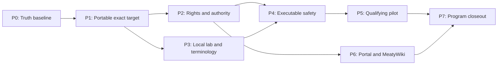

# Implementation Plan: ARC Clinical Council Adoption v1

**Plan ID:** `IMPL-2026-07-19-ARC-CLINICAL-COUNCIL-ADOPTION-V1`
**Binding decisions:** `.claude/worknotes/arc-clinical-council-adoption-v1/decisions-block.md`
**Agent handoff:** `docs/project_plans/expansion/03-arc-clinical-council-handoff.md`
**Pinned baseline:** ARC `72ab6f69bcfd31f5221ff598f4649b21e2f0e06a`; AOS `99d7ee03d2a8c8e584115cf44106b195c3222210`

## 1. Outcome and boundary

This plan owns the remaining work required to use the completed pediatric anemia clinical council as
a repeatable, qualifying project capability. It does not duplicate the product roadmap in
`00-expansion-plan.md` and `01-platform-expansion-roadmap.md`. Instead, it supplies the review,
evidence, authority, applicability, and certification seams those product phases consume.

The target state is an exact-candidate council workflow that:

- accepts only an immutable `repository_artifact` or `synthetic_scenario_specification`;
- binds the target, evidence manifest, reviewer contracts, receipts, profiles, outputs, and approvals
  by digest;
- preserves independent specialty findings, dissent, abstention, and dangerous-miss evidence;
- fails closed on prohibited data, unresolved rights, missing authority, or local incompatibility;
- distinguishes repository readiness, runtime qualification, credentialed review, clinical
  validation, certification, release authorization, and production activation.

ARC remains decision-support review infrastructure. It cannot diagnose, prescribe, establish clinical
validity, impersonate credentialed authorities, or authorize a patient-affecting release.

## 2. State taxonomy

| State | Evidence required | Can ARC alone set it? |
|---|---|---:|
| `repository_ready` | Implemented schemas/runtime/content plus green repository gates and exact-tree technical review | Yes, for ARC implementation scope only |
| `readiness_audit_complete` | Populated and schema-valid synthetic audit bundle with adjudication | Yes |
| `qualifying_runtime_pilot` | Policy-clean target resolution, rights, dispatch receipts, executed reviewers, and valid outputs | Yes, only from executed runtime evidence |
| `credentialed_review_complete` | Named independent human approvals bound to the exact candidate and scope | No |
| `clinical_validation_complete` | Applicable V1-V6 protocol execution and independent adjudication | No |
| `certified_for_defined_scope` | All required machine and owner-held gates for one declared scope and digest | ARC may record; external authority must supply the gates |
| `released` / `activated` | Separate organizational release and deployment authorization | No |

Unknown, unavailable, absent, unexecuted, stale, revoked, or wrong-digest evidence never upgrades to
an affirmative state. Structural validation never implies clinical execution.

## 3. Strategy and dependency model

Critical path:

`P0 -> P1 -> {P2 + P3} -> P4 -> P5 -> P7`

P6 depends on P2 and may run beside later P3/P4 work. It must not block the qualifying pilot because
raw YAML and the repository evidence manifest remain authoritative. P4 may author synthetic scenario
specifications before P3 is complete, but local-profile execution cannot pass without P3 authority.

### Phase summary and routing

| Phase | Scope | Points | Primary owner | Independent gates |
|---|---|---:|---|---|
| P0 | Truth reconciliation and adoption baseline | 3 | program integration owner | evidence scribe, correctness reviewer |
| P1 | Portable target and evidence consumption | 5 | ARC platform engineer | architecture, security, correctness, tests |
| P2 | Authenticated authority and rights attachments | 6 | security/governance engineer | clinical governance, evidence rights, red team |
| P3 | Signed local laboratory and terminology profiles | 7 | lab/informatics engineer | laboratory director, terminology, privacy/security |
| P4 | Executable dangerous-miss and V3-V5 dependencies | 7 | safety/test engineer | eight council lenses plus methods and human factors |
| P5 | Qualifying pilot and certification | 5 | council coordinator | exact-tree correctness, clinical safety, credentialed owners |
| P6 | Governed Portal authoring and MeatyWiki metadata adapter | 6 | Portal/integration engineers | security, UX workflow, source-rights owner |
| P7 | Program integration and closeout | 2 | integration owner | task completion, clinical adjudication, release governance |
| **Total** | — | **41** | — | Tier 3 |

### Cross-repository ownership

- The pediatric repo owns intended use, target artifacts, synthetic scenario specifications, local
  profiles, validation protocols, project tracking, and release truth.
- ARC owns generic target resolution, attachment/profile schemas, policy enforcement, reviewer
  execution, run artifacts, Portal round trips, knowledge adapters, and certification recording.
- AOS owns identifier-only correlation and operator dispatch. It must not carry target, evidence,
  clinical finding, PHI, or approval bodies.
- Owner-held credential, rights, laboratory, legal, privacy, methods, safety, equity, study, and release
  systems remain authoritative for their records.

Only one integration owner may edit shared ARC runtime/schema files at a time. Parallel writers must
own disjoint fixtures, profiles, documentation, or sibling adapter tests and hand back exact files,
tree IDs, commands, and unresolved states.

## 4. Phase execution contracts

### P0 — Truth reconciliation and adoption baseline (3 points)

**Entry:** completed ARC/AOS implementation and non-qualifying readiness audit.

| ID | Task | Owner | Exit evidence |
|---|---|---|---|
| P0-T1 | Reconcile `00`, RF README/RESULTS, current git state, authoritative RF/node state, IntentTree, and AOS records. | program owner | One reviewed status commit with no planned/verified or P0-state contradiction. |
| P0-T2 | Pin the ARC/AOS revisions, council version, evidence-manifest digest, project target policy, and canonical run locations in the handoff. | integration owner | Project agents can identify the exact baseline without absolute runtime inputs. |
| P0-T3 | Define recurring council gates for product phases P1-P6 and the owner for each accepted pilot finding. | program owner | Every gate has trigger, inputs, outputs, disposition, and owner. |
| P0-V1 | Run planning-artifact validation, link checks, and independent truth review. | correctness reviewer | No contradictions, broken local references, or fabricated completion states. |

#### AC P0.1: Program truth is coherent

- target_surfaces:
  - `docs/project_plans/expansion/00-expansion-plan.md`
  - `docs/project_plans/expansion/rf-handoff/README.md`
  - `docs/project_plans/expansion/rf-handoff/RESULTS.md`
  - `docs/project_plans/expansion/03-arc-clinical-council-handoff.md`
- propagation_contract: One authoritative phase/run state and provenance identity reaches every human and machine tracker.
- resilience: An unavailable node, untracked result, or unresolved branch state remains explicit and blocks reconciliation closeout.
- visual_evidence_required: false
- verified_by: [P0-V1]

### P1 — Portable target and evidence consumption (5 points)

**Entry:** P0 exact baseline. **Integration owner:** ARC platform engineer.

| ID | Task | Owner | Exit evidence |
|---|---|---|---|
| P1-T1 | SPIKE managed-workspace registration, immutable import, and AOS-resolved snapshot options; select one approved-root design. | architecture reviewer | ADR/design decision includes threat model and negative cases. |
| P1-T2 | Implement content-addressed target materialization with repository root, commit/tree/path/digest, artifact class, and source locator. | ARC platform engineer | Resolver rejects escape, symlink, mutation, missing target, and unsupported class before dispatch. |
| P1-T3 | Bind target identity through run manifest, evidence pack, SkillBOM, trace, receipts, and certification. | ARC platform engineer | Every retained artifact resolves the same immutable target without copying prohibited bodies. |
| P1-T4 | Add pediatric repo RunSpec fixtures and an AOS invocation contract using identifiers only. | project integration owner | Dry-run is reproducible from the handoff and no absolute path appears in qualifying inputs. |
| P1-V1 | Run focused resolver/policy tests, full ARC validation, AOS adapter tests, and exact-tree security/correctness review. | test reviewer | All positive/negative cases pass on recorded ARC/AOS trees. |

#### AC P1.1: Exact external targets resolve without widening trust

- target_surfaces:
  - `repo:agentic-research/arc_cli/`
  - `repo:agentic-research/schemas/council-run-spec.schema.json`
  - `repo:agentic-research/schemas/council-run.schema.json`
  - `repo:agentic_meta_dev/src/operator_core/adapters/arc.py`
  - `docs/project_plans/expansion/03-arc-clinical-council-handoff.md`
- propagation_contract: An approved repository registration resolves one commit/tree/path/digest into isolated read-only reviewer input and identifier-only AOS correlation.
- resilience: Unregistered, mutable, escaping, symlinked, wrong-digest, `unclassified`, or `clinical_record_body` targets fail before a partial run or model call.
- visual_evidence_required: false
- verified_by: [P1-V1]

### P2 — Authenticated authority and rights attachments (6 points)

**Entry:** P1 target identity. **Integration owner:** security/governance engineer.

| ID | Task | Owner | Exit evidence |
|---|---|---|---|
| P2-T1 | Approve identity provider, credential authority, signature, conflict, independence, expiry, and revocation contracts. | clinical governance owner | Owner-signed governance decision; ARC does not invent identities. |
| P2-T2 | Add evidence-rights receipts bound to source IDs, manifest digest, permitted operation/provider/storage, signer, expiry, and revocation. | evidence-rights owner | Policy compiler can distinguish local metadata use from permitted provider upload. |
| P2-T3 | Add credentialed-human approval attachments bound to candidate digest, scope, role, institution, independence, conflicts, and decision. | ARC governance engineer | Approval evaluation is deterministic and separately records clinical versus release authority. |
| P2-T4 | Add negative tests for missing, duplicated, stale, conflicted, unauthorized, revoked, wrong-scope, and wrong-digest records. | security test owner | Every invalid record fails closed without echoing credentials or restricted text. |
| P2-V1 | Run security red team, clinical-governance review, rights review, full ARC validation, and exact-tree rereview. | security reviewer | No ARC-only or synthetic record can mint owner-held authority. |

#### AC P2.1: Rights and human authority are authenticated and digest-bound

- target_surfaces:
  - `repo:agentic-research/schemas/`
  - `repo:agentic-research/arc_cli/`
  - `repo:agentic-research/knowledge-packs/pediatric-anemia/source-manifest.yaml`
  - approved owner-held identity and rights stores
- propagation_contract: Trusted receipts are resolved, verified, and summarized by ID/status in run policy, provenance, adjudication, and certification without retaining secrets or source bodies.
- resilience: Unknown permission or authority remains denied or human-review-pending; structural integrity never becomes permission or clinical truth.
- visual_evidence_required: false
- verified_by: [P2-V1]

### P3 — Signed local laboratory and terminology profiles (7 points)

**Entry:** P1 target identity plus selected first site. **Integration owner:** lab/informatics engineer.

| ID | Task | Owner | Exit evidence |
|---|---|---|---|
| P3-T1 | Select the first institution and freeze population, specimen, analyzer/method, unit, interval, critical-value, and ownership requirements. | local laboratory director | Signed local-profile charter. |
| P3-T2 | Create `schemas/reference-range.schema.json` and signed tenant/site profile schemas with source, effective dates, supersession, signer, verification, and rollback. | lab-profile engineer | Profiles are configuration/authority artifacts, never inferred guideline defaults. |
| P3-T3 | Define FHIR/terminology profile contracts for code system/version, status, effective/issued time, specimen, unit, local mapping, corrected/amended state, and provenance. | informatics owner | Versioned mapping and lifecycle fixtures cover failure states. |
| P3-T4 | Implement import/validation and fail-closed applicability matching in ARC and the pediatric test lane. | integration engineer | Unknown/incompatible dimensions force abstention or activation block. |
| P3-V1 | Run local laboratory, terminology, privacy/security, correctness, and negative compatibility gates. | lab/informatics reviewers | First profile passes only with real owner approval; synthetic lanes remain labeled. |

#### AC P3.1: Local applicability cannot be inferred

- target_surfaces:
  - `schemas/reference-range.schema.json`
  - project local-profile fixtures and validation tests
  - `repo:agentic-research/schemas/`
  - `repo:agentic-research/schemas/pediatric-clinical-review.schema.json`
- propagation_contract: One signed site profile binds each applicable laboratory and terminology decision to population, specimen, method, units, interval, status, mapping, owner, version, and candidate digest.
- resilience: Missing, conflicting, expired, superseded, unmapped, preliminary, stale, corrected, or amended states fail closed and remain visible.
- visual_evidence_required: false
- verified_by: [P3-V1]

### P4 — Executable safety and V3-V5 dependencies (7 points)

**Entry:** P2 authority plus P3 applicability contracts.

| ID | Task | Owner | Exit evidence |
|---|---|---|---|
| P4-T1 | Convert `DM-CBC-001` through `DM-WORKFLOW-010` into non-patient synthetic scenario specifications. | safety test engineer | Ten versioned fixtures with expected alert/abstention, trace, owner, and rollback signal. |
| P4-T2 | Bind every dangerous-miss family to rules/controls, required tests, candidate version, evidence, and release gate. | pediatric safety owner | Hazard-to-control matrix has no unowned gap. |
| P4-T3 | Freeze V3 intended use, dataset/reference standard, endpoints, uncertainty, subgroup, analysis, and adjudication artifacts. | diagnostic methods owner | Only approved protocol-bound results can satisfy V3. |
| P4-T4 | Add V4 silent-mode and V5 human-factors protocol-through-adjudication contracts, including alert lifecycle, override, downtime, handoff, recovery, and equity. | implementation/human-factors owners | Build state cannot satisfy study state. |
| P4-V1 | Execute synthetic suites and obtain the eight specialty lenses plus methods, safety, human-factors, and equity review. | council coordinator | Authored scenarios and executed results are reported separately. |

#### AC P4.1: Dangerous misses and study gates are executable dependencies

- target_surfaces:
  - project synthetic scenario specifications
  - project test harness and release-dependency manifest
  - `repo:agentic-research/runs/<qualifying-run>/validation_plan.md`
  - `repo:agentic-research/runs/<qualifying-run>/pediatric_clinical_review.json`
- propagation_contract: Each hazard and V3-V5 protocol maps from exact input/version through expected behavior, execution receipt, result, adjudication, owner decision, and release state.
- resilience: Missing protocol, execution, result, uncertainty, adjudication, or owner approval remains `not_executed`/pending and blocks the applicable release state.
- visual_evidence_required: false
- verified_by: [P4-V1]

### P5 — Qualifying pilot and certification (5 points)

**Entry:** P1-P4 exact trees and available owner-held records.

| ID | Task | Owner | Exit evidence |
|---|---|---|---|
| P5-T1 | Freeze one non-patient candidate, registered target, evidence manifest, council/role schemas, profiles, receipts, protocols, and AOS identifiers by digest. | council coordinator | Immutable pilot input manifest and clean data-boundary scan. |
| P5-T2 | Execute independent SDK reviewer passes and separate adjudication through the trusted-writer path. | ARC runtime owner | Execution receipts bind every reviewer output and exclude stale artifacts. |
| P5-T3 | Validate all base/custom outputs, provenance, trace, source contracts, dangerous-miss results, certification, and recommendation liveness. | test reviewer | `arc validate` clean and scorecard is not a skeleton placeholder. |
| P5-T4 | Attach available credentialed clinical, laboratory, rights, legal, privacy, methods, safety, equity, and release decisions to the exact digest. | governance owner | Each unavailable gate remains explicitly owner-held or not executed. |
| P5-V1 | Run exact-tree clinical-safety and correctness/release review; rerun after every material edit. | independent reviewers | Explicit approval of the exact current ARC/AOS/project trees. |

#### AC P5.1: The pilot qualifies without overclaiming release

- target_surfaces:
  - `repo:agentic-research/runs/<qualifying-run>/run_manifest.yaml`
  - `repo:agentic-research/runs/<qualifying-run>/scorecard.json`
  - `repo:agentic-research/runs/<qualifying-run>/pediatric_clinical_review.json`
  - `repo:agentic-research/runs/<qualifying-run>/arc_certification.yaml`
  - `repo:agentic-research/runs/<qualifying-run>/provenance.skillbom.yaml`
- propagation_contract: Target, evidence, reviewer, receipt, profile, test, adjudication, human-decision, and certification identities resolve to one immutable candidate and truthful execution state.
- resilience: Runtime qualification may be true while credentialed review, clinical validation, certification, release, or activation remains pending/blocked.
- visual_evidence_required: false
- verified_by: [P5-V1]

### P6 — Governed Portal authoring and MeatyWiki metadata adapter (6 points)

**Entry:** P2 rights and authority contracts. **Not on the P5 critical path.**

| ID | Task | Owner | Exit evidence |
|---|---|---|---|
| P6-T1 | Add structured Portal authoring for every clinical RunSpec, source, safety, applicability, authority, and target-class field. | Portal engineer | YAML/JSON round trips are byte/semantic exact with no flattening or silent defaults. |
| P6-T2 | Add preview warnings for prohibited targets, missing receipts, owner-held gates, stale digests, and non-qualifying state. | UX workflow owner | UI never presents repository validation as clinical approval. |
| P6-T3 | Implement a read-only, metadata-only MeatyWiki adapter with ACL, vault allowlist, rights, freshness/retraction, and deterministic projection hashes. | knowledge integration owner | No raw body is retrieved or sent to a provider; repository manifest stays runtime truth. |
| P6-T4 | Add access-denied, stale, retracted, rights-mismatch, projection-change, injection, and round-trip negative tests. | security/test owners | Failures are bounded and do not echo protected content. |
| P6-V1 | Run security, rights, UX workflow, schema round-trip, and exact-tree review. | independent reviewers | Raw YAML remains a safe fallback and adapter disablement does not block P5. |

#### AC P6.1: Governed authoring cannot weaken source or safety policy

- target_surfaces:
  - `repo:agentic-research/portal/`
  - `repo:agentic-research/schemas/council-run-spec.schema.json`
  - `repo:agentic-research/schemas/evidence-source-manifest.schema.json`
  - `repo:agentic-research/knowledge-packs/pediatric-anemia/`
- propagation_contract: Structured edits round-trip to authoritative contracts; MeatyWiki projects approved metadata into the same manifest identity with deterministic hashes.
- resilience: Missing/unknown fields, access denial, stale/retracted sources, rights mismatch, or adapter outage fails closed without changing the repository manifest or qualifying state.
- visual_evidence_required: "Portal desktop review of warnings, owner-held gates, and exact preview diff"
- verified_by: [P6-V1]

### P7 — Program integration and closeout (2 points)

| ID | Task | Owner | Exit evidence |
|---|---|---|---|
| P7-T1 | Wire the appropriate council gate into each product phase and Evidence Foundry promotion boundary. | program owner | Trigger/input/output/owner matrix covers P1-P6 without duplicate authority. |
| P7-T2 | Update the handoff, operator contract, trackers, ADRs, source/rights refresh schedule, rollback/runbook, and accepted-finding owners. | documentation/integration owner | Project agents have one maintained entry point and no stale invocation guidance. |
| P7-T3 | Run affected-repository suites, artifact validation, package/build gates, exact-tree reviewers, and final state reconciliation. | integration owner | Every committed claim has command, artifact, tree, or owner evidence. |
| P7-V1 | Obtain technical closeout and separate owner release disposition. | task validator + governance owner | Implementation completion and release authorization remain separate records. |

#### AC P7.1: Adoption is operable and state-truthful

- target_surfaces:
  - `CLAUDE.md`
  - `docs/project_plans/expansion/03-arc-clinical-council-handoff.md`
  - this plan and its progress trackers
  - AOS/IntentTree program records
- propagation_contract: One agent entry point routes every material review to the pinned council workflow and records the resulting work, evidence, and state in authoritative trackers.
- resilience: Unavailable owner systems, providers, data partners, or reviewers remain explicit blockers and never prevent safe repository-only progress.
- visual_evidence_required: false
- verified_by: [P7-V1]

## 5. Validation and reviewer gates

Every phase requires focused tests, full validation for each affected repository, `git diff --check`,
artifact validation, and a task-completion review against the exact current trees. P1, P2, P3, P5,
and P6 also require security/governance review. P3-P5 require applicable credentialed owners; absence
is recorded as `not_executed_owner_held`, not synthetic approval.

| Gate | Minimum evidence |
|---|---|
| Planning | strict artifact validation, valid local links, phase/AC coverage, under-800-line plan |
| Pediatric repo | `npm run check` for code-affecting phases plus focused scenario/profile tests |
| ARC repo | focused schema/runtime/policy/custom-output tests, full test suite, `arc validate .`, package build |
| AOS repo | adapter/correlation/orchestration focused tests plus full suite when dispatch changes |
| Clinical safety | independent eight-lens council output, dissent/abstention preservation, dangerous-miss execution |
| Owner authority | verified identity/signature/scope/digest receipts from the authoritative owner systems |
| Exact-tree closeout | reviewers record project, ARC, and AOS commit/tree IDs; any material edit invalidates approval |

## 6. Owner-held decisions and external gates

The following cannot be completed by repository agents:

- named credentialed pediatric clinical reviewers, alternates, independence, conflicts, and scope;
- first-site laboratory director, analyzers/methods, specimens, units, ranges, critical values, and mappings;
- identity provider, credential authority, signature mechanism, revocation source, and approval store;
- per-source rights, permitted excerpts/metadata, provider/storage/upload route, and legal interpretation;
- exact intended use and regulatory classification;
- V3 datasets/reference standard/statistical protocol and data partner;
- V4 silent-mode operations and V5 summative human-factors participation;
- patient/family and equity governance protocols;
- privacy/security approval for any server/PHI/FHIR boundary;
- organizational release and production activation.

Plans and tests may specify these inputs, but only authenticated owner evidence may satisfy them.

## 7. Deferred and open-question policy

| ID | Question | Phase | Disposition |
|---|---|---|---|
| OQ-1 | Managed workspace, immutable import, or AOS snapshot for P1? | P1 | SPIKE and ADR before implementation. |
| OQ-2 | Which identity/credential/signing/revocation systems back P2? | P2 | Owner-held; blocks affirmative authority. |
| OQ-3 | Which institution and exact laboratory/terminology profile is first? | P3 | Owner-held; blocks local applicability. |
| OQ-4 | Which intended use, candidate, dataset, endpoints, and analysis bind V3? | P4 | Methods/data-partner decision. |
| OQ-5 | Which MeatyWiki vault and ACL/rights policy are approved? | P6 | Adapter remains disabled and metadata-only until resolved. |
| OQ-6 | Which system is authoritative for approvals and study adjudication? | P2/P4 | Governance ADR; ARC stores references/status only. |

Create a project design spec before implementing any selected option whose security, identity, data,
or clinical-authority contract is not already approved. Create `.claude/findings/arc-clinical-council-adoption-v1-findings.md`
only on the first genuine in-flight finding; set `findings_doc_ref` then. Do not create speculative
finding files or mark deferred owner decisions complete.

## 8. Ordered first execution slice

1. Execute P0 truth reconciliation and commit one coherent status update.
2. Open P1 target-resolution SPIKE/ADR and choose the fail-closed portable-target design.
3. In parallel, convene P2 governance/rights owners and P3 first-site laboratory/informatics owners.
4. Implement and exact-tree review P1 before attempting another SDK pilot.
5. Implement P2 and P3 under separate file ownership, then integrate serially through their shared policy/schema seams.
6. Convert and execute the ten P4 dangerous-miss scenarios; freeze V3-V5 dependency contracts.
7. Run P5 against one immutable, non-patient, policy-clean candidate and preserve every unavailable owner gate.
8. Productize P6 without changing raw YAML/manifest authority or delaying P5.
9. Complete P7 only after exact-tree technical review and separate owner release disposition.

The next implementation command should target **P0 only**. No later phase is authorized merely because
this plan is approved.
