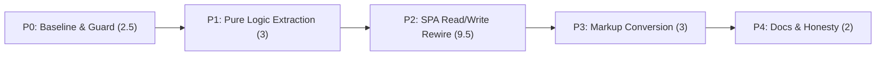

# Implementation Plan: Four-State Questionnaire UI

**Plan ID**: `IMPL-2026-07-23-four-state-questionnaire-ui` · **Date**: 2026-07-23 · **Author**:
`implementation-planner`, expanding the Opus-authored decisions block
**Human Brief**: none authored separately for this Tier 3 feature — the decisions block
(`.claude/worknotes/four-state-questionnaire-ui/decisions-block.md`) carries the estimation basis
inline (§8) and is treated as authoritative in its place.
**Related Documents**:
- **PRD** (FR-1..FR-17, AC-1..AC-9, §8 verification ceiling, R1–R10, OQ-1..OQ-5):
  `docs/project_plans/PRDs/features/four-state-questionnaire-ui-v1.md`
- **Cross-family review findings** (binding adjudication; F-1..F-5, K-1..K-4, the reason this plan was
  revised): `.claude/findings/four-state-questionnaire-ui-cross-family-review.md`
- **Decisions Block** (authoritative for the original decisions, scope, R1–R7; superseded on estimate
  and on F-1/F-3/F-4 scope by the findings doc above): `.claude/worknotes/four-state-questionnaire-ui/decisions-block.md`
- **SPIKE-010** (RQ-1..RQ-6, legs A–D): `docs/project_plans/SPIKEs/spike-010-four-state-questionnaire-ui.md`
- **Gate baseline** (the 8 pre-existing failures + the build-before-test trap):
  `.claude/worknotes/four-state-questionnaire-ui/gate-baseline.md`
- **Prior decision this plan does not reopen**:
  `docs/project_plans/SPIKEs/spike-003-tri-state-fact-model-migration.md:579-584`

**Complexity**: Medium (Tier 3 floor, 13+) · **Total Estimated Effort**: **20 pts** (re-estimated
bottom-up after cross-family review; see Review History below and the Estimation Sanity Check — the
decisions block's original 14-pt figure excluded the F-1/F-3/F-4 fixes)
**Provider**: mixed — `ica` (Claude Sonnet 5, 1M context) for P0/P1/P3/P4; **`claude` primary for P2**,
the highest-risk seam (R1/R2), deliberately not delegated. Cross-family adversarial review on every
phase via `codex`/`gpt-5.6-terra`. Gates via `karen`/`task-completion-validator` on `claude` (primary,
non-negotiable).

## Executive Summary

The 59 booleanMap questionnaire fields (symptoms 14, history 40, exam 5 —
`src/app.js:111-131`) render today as two-state checkboxes mapped onto the SPA's existing
three-value wire model (`'true'|'false'|'unknown'`, `src/facts/tristate.js:4`). The mapping is lossy:
`setSimpleField()` (`src/app.js:1462-1468`) collapses `'false'` and `'unknown'` to the same unchecked
visual state on repopulation — an existing round-trip data-loss defect, independent of this feature.
This plan replaces each checkbox with a 4-option `<select>` (present/absent/unknown/not-assessed),
fixes that defect as a direct consequence, and changes the payload so an unanswered field is **omitted**
rather than defaulted to `false`. **The engine is empirically unchanged** — but per the cross-family
review's F-3 finding (Review History below), that conclusion is carried by the corpus-derived
28-rule-condition structural proof (SPIKE-010 leg D), not by the "6 golden fixtures byte-identical"
fixture run: only 1 of the 6 `examples/*.json` fixtures contains an explicit `false` inside
`symptoms`/`history`/`exam`, so 5 of 6 exercise no transformation at all. A new executed transform test
(P2-08) closes that gap directly. This is a capture-fidelity improvement, not a diagnostic, safety, or
inference improvement, and no part of this plan claims otherwise. This revision also fixes a previously
unaddressed defect where the existing checkbox-consumer rewrite left several live `.checked` call sites
broken (F-1) and a safety-review auto-assertion whose premise this feature invalidates (F-4) — see
Review History.

**The premise this plan does not reopen.** The engine is tri-state, not four-state, and stays that way
(`src/ruleEngine.js:44-48`: `is-not-assessed` is a declared synonym of `is-unknown`). A four-state fact
type was explicitly considered and rejected on the record four days before this feature's evidence base
was assembled (`spike-003-tri-state-fact-model-migration.md:579-584`, status `completed`,
2026-07-19). This plan's architecture — four clinician-visible states over three wire values, with
"not assessed" represented by **key omission**, never a fourth stored literal — is the mechanism that
delivers the clinician-visible distinction without reopening that decision (decisions block §1).

Five phases run strictly sequentially — **P0 → P1 → P2 → P3 → P4**, 2.5+3+9.5+3+2 = **20 pts**
(re-estimated bottom-up post-review; see Review History and Estimation Sanity Check), no parallel
wave — because each phase's output gates the next: the neutrality guard (P0) must exist before any
behavior change; the pure logic module (P1) must exist before `src/app.js` is rewired to call it (P2);
the rewired read/write functions (P2) must exist before the markup that exercises them lands (P3); and
the scope-honesty corrections (P4) close out the feature once behavior is settled. P2 absorbed the bulk
of the re-estimate (5 → 9.5 pts): it is where F-1's broken workflow/depth/safety consumers, F-3's
executed transform test, and F-4's safety-attestation fix all land.

## Implementation Strategy

### Architecture Sequence

This is a browser-local, zero-dependency, no-build-step static SPA (`index.html` → native ESM
`src/app.js`, no bundler). The MeatyPrompts layered-architecture checklist (routers/services/
repositories/API) does not apply — there is no backend call anywhere in this feature's path (PRD §2).
The sequence that does apply:

1. **Guard first** (P0) — the FR-9 neutrality regression test must exist before anything it guards changes.
2. **Pure logic** (P1) — a DOM-free module holding the actual four-state mapping, the only part of this
   feature a Node test can execute directly (SPIKE-010 leg B).
3. **Seam rewire** (P2) — the five originally-scoped DOM-coupled `src/app.js` functions, **plus the
   workflow/depth/safety-count consumers added per cross-family review F-1**, delegate to P1's module.
4. **Surface** (P3) — 59 hand-edited markup conversions, gated on P2's rewired read/write path existing.
5. **Honesty close-out** (P4) — docs, roadmap-framing correction, deferred items, human-verification
   checklist finalization.

### Ordering Constraints (binding — do not reorder or parallelize around these)

- **P0 before P1 is deliberate** (decisions block §6): the neutrality guard must exist *before* the
  payload-omission behavior it guards against ships, converting a future silent clinical-behavior
  change (a rule authored against **any discriminating operator — `eq`/`neq`, `missing`/`exists`,
  `truthy`/`falsy`, or any of the four `is-*` spellings, broadened per cross-family review F-3, not
  only `is-absent`/`is-unknown`/`is-not-assessed`** — on one of the 14 `triAny`/`triAll`/`triNone`-
  derived aggregates in `modules/anemia/facts.anemia.js`) into a loud, authoring-time test failure
  instead of a silent one. This is R3 (High) and the single highest-value deliverable identified across
  all four SPIKE legs.
- **P1 lands before P2 rewires `src/app.js`.** P2's rewritten call sites all delegate their
  state-mapping decision to `src/facts/fieldState.js` (FR-8, FR-16) rather than inlining it — mirroring
  how `setSimpleField:1466` already delegates to `toTri()` today. Writing P2 first would repeat the
  mistake the `tristate.js` extraction was created specifically to avoid (SPIKE-010 leg B §3).
- **P3 depends on P2's rewritten read/write path existing** — the FR-11 parity test and the seam test
  (P3-05) assert against the option-value vocabulary `fieldState.js` expects, which P2 establishes.
- **OQ-1/OQ-2 (option ordering/wording) are a phase-entry precondition for P3, not an engineering task.**
  A named human must resolve both before any of the 59 hand-edits begin (phase-3 detail, P3-00) — these
  are clinical-usability calls the guardrails reserve for a human, not an agent-invented default.
- **OQ-5 (the F-2 provenance-honesty decision) is also a precondition for P3.** A named human must
  choose among OQ-5's three options (PRD §12) before any of the 59 hand-edits begin — the markup and
  copy P3 produces must not imply a stronger provenance guarantee than whatever OQ-5 resolves to.

### Critical Path

No parallel wave exists in this plan — 20 pts run as a single sequential chain, matching the
decisions block's own phase-boundary table (§6), which does not identify a legal parallel slice at
this scale (contrast `spa-module-switcher-v1`'s 41-pt plan, which had a genuine P0∥P1 wave). Splitting
P3's markup work from P2's rewire would violate the ordering constraint above; splitting P4 out early
would violate "P4 closes the loop after behavior is settled." The re-estimate (14 → 20 pts, Review
History below) added work strictly within existing phases — it did not change the sequencing.

### Phase Summary

Canonical orchestration index — the decisions block §7 routing table, **re-estimated post-cross-family-
review** (Review History below); routing (subagent/model/provider) is carried through unchanged, only
estimates and scope grew.

| Phase | Title | Estimate | Target Subagent(s) | Model(s) | Provider | Effort | Notes |
|-------|-------|---------:|--------------------|----------|----------|--------|-------|
| P0 | Baseline & Guard | 2.5 pts | general-purpose | sonnet-5[1m] | ica | adaptive/extended | FR-9 neutrality guard test **must** exist before any behavior change, **broadened per F-3 to all discriminating operators** (+0.5 pt over the original scope). Bounded test authoring. |
| P1 | Pure Logic Extraction | 3 pts | general-purpose | sonnet-5[1m] | ica | adaptive | New DOM-free `src/facts/fieldState.js`; `tristate.js` is a direct template — well-precedented. **+1 pt for the new `isPresent`/`isAssessed` predicates (F-1) with direct `node --test` coverage.** |
| P2 | SPA Read/Write Rewire | 9.5 pts | general-purpose | **sonnet** | **claude (primary)** | adaptive/extended | **Highest-risk seam (R1/R2) — kept on primary, not delegated.** The plan's genuine risk concentration, now larger: **+2.0 pt** rewiring the workflow/depth/safety-count `checked()`/`anyChecked()` consumers (F-1, P2-07), **+0.25 pt** extending the P2-06 source-shape pin to cover them, **+1.5 pt** for the executed transform test (F-3, P2-08), **+0.75 pt** for the safety-review attestation fix (F-4, P2-09). |
| P3 | Markup Conversion | 3 pts | general-purpose | sonnet-5[1m] | ica | adaptive | 59 mechanical, uniform edits. `integration_owner` for the seam task is the P2 (primary) executor. Unchanged by the re-estimate — F-1/F-3/F-4 are logic-layer fixes, not markup. |
| P4 | Docs & Honesty | 2 pts | general-purpose (documentation) | haiku / sonnet-5[1m] | ica | adaptive | Doc-only; also applies the OQ-3 roadmap-framing correction and, per K-1, the `SPIKE-010` `research_ids` miscategorization fix. Unchanged in points — the added scope (OQ-5 recording, K-1) fits within existing task headroom. |
| **Total** | — | **20 pts** | — | — | — | — | 2.5+3+9.5+3+2 = **20**, derived bottom-up from the task tables below, not back-fitted to a target (per project memory: `karen-as-planning-gate-catches-unbuildable-verification`). Up from the original 14-pt estimate, which excluded the F-1/F-3/F-4 fixes (F-5, HIGH — accepted). |

Every phase additionally carries: a **`codex`/`gpt-5.6-terra` cross-family adversarial diff review**
(per-wave, `claude`-independent — project memory records this catches real fail-closed gaps
validators approve) and a **`task-completion-validator` exit gate** on `claude`/`sonnet`. P2 and P4
additionally carry a **`karen` milestone review** — P2 for the risk concentration, P4 as the
end-of-feature review. Gates and reviewers are **MUST-stay-primary** (`claude`) regardless of which
provider executes the phase's build tasks.

**Known trap (decisions block §7)**: `execute-plan` silently skips review when reviewer agents are
unregistered — probe before launching. **Every prompt-embedded shell command dispatched to an
executor must use the absolute worktree path**
(`/Users/miethe/dev/homelab/development/pediatric-anemia-site/.claude/worktrees/plan-four-state-questionnaire-ui`)
— workflow agents otherwise resolve "repo root" to the main checkout (project memory:
`workflow-agents-resolve-repo-root-to-main-checkout`).

### Phase Detail Files

Full task tables, per-task Model/Effort/Provider assignments, and phase-specific rationale live in the
phase files (this parent stays under the house-style line guideline):

- **[Phase 0-1: Baseline & Guard, Pure Logic Extraction](./four-state-questionnaire-ui-v1/phase-0-1-baseline-and-pure-module.md)**
- **[Phase 2: SPA Read/Write Rewire](./four-state-questionnaire-ui-v1/phase-2-spa-rewire.md)** — the risk-concentration phase
- **[Phase 3: Markup Conversion](./four-state-questionnaire-ui-v1/phase-3-markup-conversion.md)** — includes the OQ-1/OQ-2 phase-entry precondition
- **[Phase 4: Docs & Honesty Corrections](./four-state-questionnaire-ui-v1/phase-4-docs-and-honesty.md)** — includes the OQ-3/OQ-4 close-out and the human-verification checklist

## Gate Criterion — binding on every phase (do not soften)

Per PRD §11 AC-7 and the gate-baseline record: **the gate is RED on `main` before this feature starts.**
`.claude/worknotes/four-state-questionnaire-ui/gate-baseline.md` records **8 pre-existing failures**
(six byte-identity/baseline pins — test IDs 336, 789, 814, 2132, 2133, 2138 — and two D1
rights-governance checks — 2363, 2364), measured at commit `8c59db1`, unrelated to this feature and
not owned by it (R7, High/process severity). **Every phase's exit criterion, stated once here and
repeated in each phase file, is:**

> `npm run check` (= `npm run build && npm test && npm run validate && npm run coverage:rules && npm
> run verify:d4 && npm run check:imports && npm run smoke:browser && npm run smoke`) shows **exactly
> these 8 failures and no others.** A run showing more, fewer, or different failures is a FAIL for this
> work package.

**⚠ Build-before-test trap.** Running bare `npm test` in a **fresh worktree** reports **10** failures,
not 8 — two extra (test IDs 2029, 2125 in the baseline doc's numbering) are `dist/`-dependent artifacts
of `dist/` not existing yet. **Always run `npm run build` before `npm test`**, exactly as `npm run
check` does. An executor who runs bare `npm test` first will believe they broke two tests they did not
touch — do not "fix" them; they are not real, and they disappear once `dist/` exists. P0-01 re-verifies
this baseline against the live tree before any other work begins.

## Verification Honesty — what this feature can and cannot prove

This repository has no browser automation and no DOM test runner (`package.json` declares zero
dependencies, by design). Reproducing SPIKE-010 leg B's split and PRD §8, stated plainly so no later
report overclaims what a green `npm run check` means.

### CAN be automatically verified (executed, real logic)

| What | How | Executes real logic? |
|---|---|---|
| The pure `src/facts/fieldState.js` mapping, incl. omitted-key↔not-assessed, the `'false'`≠`'unknown'` round-trip fix, and the `isPresent`/`isAssessed` predicates (F-1) | `tests/field-state.test.mjs` — direct `node --test` import, no DOM | Yes — same pattern as `tests/tristate-operators.test.mjs` against `src/facts/tristate.js` |
| The neutrality precondition (FR-9, broadened per F-3): no rule condition over the 14 derived aggregates uses any discriminating operator (`eq`/`neq`, `missing`/`exists`, `truthy`/`falsy`, all four `is-*` spellings) | `tests/tristate-neutrality-guard.test.mjs` — scans the live `modules/*/rules.json`, all four modules | Yes — reads and evaluates the actual rule JSON, not a cached count |
| **Executed transform test (F-3 fix, P2-08):** for every booleanMap field and every all-negative aggregate group, an explicit-`false`-vs-key-omitted input fixture pair produces identical derived facts and `assess()` results | New test built directly from fixture pairs, not from `examples/*.json` | Yes — executes the real `deriveFacts()`/engine path against fixtures purpose-built to exercise the omission |
| Golden-fixture identity: the payload change does not alter `assess()` output for the 6 `examples/*.json` fixtures | `tests/module-equivalence.test.mjs` (existing, unmodified) | Yes — executes the real engine, **but per F-3 this alone is weak evidence**: only 1 of the 6 fixtures contains an explicit `false` inside `symptoms`/`history`/`exam`, so 5 of 6 exercise no transformation. The executed transform test above (P2-08), not this fixture run, is what actually detects the change; the structural 28-condition proof (§4 Verification Honesty context, SPIKE-010 leg D) is what supports the "engine unchanged" conclusion. |
| That `checked`/`buildInput`/`setSimpleField`/`populateFromInput`/the safety listener delegate to `fieldState.js` rather than inlining the mapping, and no booleanMap field still writes a plain `element.checked` boolean | Static source-shape pin — the `functionBody()`/regex brace-scan technique from `scripts/smoke-browser-unit-rejection.mjs:45-104` | No — proves the right identifiers appear at the right call sites; does not execute `src/app.js` (DOM-dependent, unimportable under Node — leg B §2) |
| **(F-1 fix, P2-07/P2-06 extension)** That `anyChecked()`, `updateWorkflowState()`'s three call sites, and `updateCaseUi()`'s two call sites no longer call `checked()`/`anyChecked()` against any booleanMap field name, and instead delegate to `isPresent`/`isAssessed`/`anyPresent()` | Same static source-shape pin technique, extended to these five additional call sites | No — same ceiling as above; proves identifier delegation, not runtime banner/workflow-step correctness (see CANNOT list) |
| Registry↔markup parity (FR-11) and the markup↔registry↔serialization option-value seam | `tests/questionnaire-registry-parity.test.mjs` — raw-text read + set/string equality (precedent: `tests/module-switcher-eligibility.test.mjs:29-34`) | Partially — real set/string-equality checks over extracted text, not a DOM parse |
| Schema acceptance: `booleanMap` still accepts the omit-key and three string-value shapes | Existing schema suite, unmodified (no schema change, FR-13) | Yes |

### CANNOT be automatically verified — manually verified only

- **Rendering** — the four-option `<select>` actually paints correctly in any browser (layout,
  spacing inside `.check-grid`, focus ring, contrast).
- **Click/keyboard state transitions** — selecting an option via mouse or keyboard actually updates the
  control's value and the form submits the expected wire value. No test can dispatch a real DOM event
  against `src/app.js` (`src/app.js:40`'s top-level `$('#assessment-form')` call throws
  `ReferenceError: document is not defined` outside a browser — leg B §2).
- **Accessibility / screen-reader behavior** — announcement of the fourth state, keyboard-only
  operability, focus order across 59 fields.
- **Visual layout integrity** — that 59 checkbox→select conversions don't break `index.html`'s existing
  `.check-grid` density, wrapping, or mobile breakpoints.
- **Cross-browser behavior** — any Safari/Chrome/Firefox rendering or interaction difference.
- **`form.reset()` / browser autofill / paste interaction** with the new control type.
- **(F-1 addition) The safety banner and workflow-step behavior** — that the safety-findings banner's
  count (`safetyCount`) accurately reflects fields marked Present, and that `step-safety`/
  `step-history`/`step-smear` actually complete when a clinician enters corresponding data at runtime.
  No test can execute `updateCaseUi()`/`updateWorkflowState()` against a real DOM (same import-time
  constraint as above); the source-shape pin proves the code *calls* the right predicate, not that the
  banner *renders* the right count in a browser.

These seven items must be captured by a named person exercising the running SPA — the same discipline
`spa-module-switcher-v1.md`'s P6-011 established. This plan assigns them concretely: P3-06 (visual
layout, the first item) and P4-05 (keyboard, safety-reviewed runtime, `form.reset`, **and now the
safety-banner/workflow-step item above**) — each requires a named signer and date, not a checkbox
ticked without one.

### Explicitly forbidden verification approach

**A hand-rolled `document`/DOM shim inside a test file must not be written or presented as DOM
verification.** Per leg B §4: a fake `{ querySelector, querySelectorAll, getElementById }` object can
satisfy `src/app.js`'s import-time syntax but cannot reproduce real `HTMLFormElement.elements`
semantics, `RadioNodeList` identity checks, or `element.value`/`.checked` getter/setter behavior — it
can only encode the test author's own assumptions about DOM behavior, which is exactly the class of
defect a real browser test exists to catch. If any such shim is ever written for local author
sanity-checking, it must be excluded from `npm run check` and labeled in its own file header as
"tests internal consistency with this shim's model of the DOM, not browser behavior" — never
represented as proof the control works in a browser. No task in this plan authors one.

## Deferred Items & In-Flight Findings Policy

### Deferred Items Triage Table

Every one of decisions block §9's OQ-1..OQ-4, plus OQ-5 (added by the cross-family review's F-2 finding)
and K-4 (karen's polish item on `APP_SURFACE_FILES`), appears below, per the plan-generator rule that no
open question may be silently lost.

| Item ID | Category | Reason Deferred | Trigger for Promotion | Target Spec Path |
|---------|----------|-----------------|-----------------------|-----------------|
| OQ-1 | dependency-blocked | 4-`<select>`-option ordering is a clinical-usability call, not an engineering one. **Not deferred past this feature** — it is a blocking phase-entry precondition for P3 (P3-00), resolved by a named human before any markup edit lands. | Resolved at P3-00, before P3-01 | N/A — resolution recorded inline (P3-00) and durably captured at P4-05, not a design spec |
| OQ-2 | dependency-blocked | Exact clinician-facing wording, same reasoning as OQ-1; must not imply the choice changes inference (honesty caveat, PRD §3). | Resolved at P3-00, before P3-01 | N/A — same as OQ-1 |
| OQ-3 | scope-cut, resolved-in-plan | Roadmap/IntentTree title overstates this work as "adaptive" and lists a non-dependency (P3-WP6/FHIR). **Not deferred** — corrected directly by P4-02 (roadmap file) with the IntentTree title correction flagged as a separate human/orchestrator follow-up (this plan edits repository files only). | Applied at P4-02 | N/A — applied directly, not deferred; see P4-02 |
| OQ-4 | research-needed | Whether the 13 non-booleanMap booleans (4 `cbc.localFlags`, 6 lab-result, 3 `patient`) eventually need the same four-state treatment. Genuinely deferred — no decision made by this feature. | A future feature proposes extending four-state capture beyond the 59 booleanMap fields | `docs/project_plans/design-specs/non-booleanmap-four-state-treatment.md` (authored at P4-04, `maturity: idea`) |
| OQ-5 | dependency-blocked, human-decision-required | Cross-family review F-2: "durable" is not "unambiguous" — a reader of the exported JSON cannot distinguish deliberate not-assessed from an omitting client/serializer/API caller (PRD §3, §12). **Not deferred past this feature and not an agent's call** — a named human must choose among the three PRD-§12 options (version stamp / separate capture envelope / drop the claim) **before any P3 markup edit lands**, same phase-entry gate as OQ-1/OQ-2. | Resolved at P3-00, before P3-01, alongside OQ-1/OQ-2 | N/A — resolution recorded at P3-00 and referenced at P4-01/P4-05; no separate design-spec file unless the "separate capture envelope" option is chosen, in which case that becomes its own future feature, not this one |
| K-4 | resolved-by-precedent, no task required | karen's polish item: PRD §6.2 asks whether `src/facts/fieldState.js` needs an entry in `scripts/check-app-imports.mjs`'s `APP_SURFACE_FILES`. Resolved by direct precedent — `src/facts/tristate.js`, the exact structural analog (a DOM-free pure module alongside `src/app.js`), has no entry there today. No task in this plan adds one. Recorded here so the question is not silently dropped, per karen's finding. | None — resolved now, by precedent, not deferred | N/A |

**Rule applied**: every row above either has a `Target Spec Path` (OQ-4) or is marked N/A with an
explicit rationale (OQ-1/OQ-2/OQ-3/OQ-5/K-4) — none is silently dropped.

### In-Flight Findings

`findings_doc_ref` is now populated — the pre-execution cross-family review already surfaced a real,
load-bearing finding (F-1), which is why this revision exists at all:
`.claude/findings/four-state-questionnaire-ui-cross-family-review.md` (`status: accepted`). That
finding's fixes are folded directly into this plan's phase task tables (P1-03, P2-06 extension, P2-07,
P2-08, P2-09) rather than tracked as a separate open finding — they are now ordinary scoped work, not a
pending question. If P2's rewrite (still the risk-concentration phase) surfaces a further unexpected
coupling during execution — e.g., a call site to `checked()`/`setSimpleField()` this plan's file-reading
still did not find — record it as a new dated entry in the same findings doc (or a fresh one if this
one is sealed) and, if load-bearing, add a design-spec task to P4 and append the path to
`deferred_items_spec_refs`.

### Quality Gate

P4 cannot close until: OQ-4's design spec exists at its target path and is appended to
`deferred_items_spec_refs`; OQ-1/OQ-2/OQ-3/OQ-5 are each recorded as resolved/applied per the table
above; and the findings doc referenced by `findings_doc_ref` is finalized (already `accepted`; any new
execution-time addendum must also close out before P4-GATE).

## Risk Mitigation

Carried from decisions block §5 / PRD §9 (R1–R7), plus R8–R10 added by the cross-family review
adjudication (F-1/F-4/F-2), each mapped to the phase that owns its mitigation.

| # | Risk | Severity | Owning Phase | Mitigation |
|---|---|:---:|:---:|---|
| R1 | `RadioNodeList` guards (`value()`:90/91, `checked()`:102-105, `setSimpleField()`:1465) all bail out on `RadioNodeList`. A radio-group approach would silently break read+write. | High | P2, P3 | `<select>` chosen over radio groups specifically because it is always a single element, never a `RadioNodeList` (decisions block §4). P2 explicitly retains all three guards as defense in depth (P2-01/03/05); P2-GATE rejects if any guard is dropped. |
| R2 | Safety-reviewed mutual exclusion (`src/app.js:1637-1650`) force-writes `.checked = false` across every `immediateSafetyNames` field. | High | P2 | Rewritten as its own reviewed unit of work (P2-05), not folded into the general read/write rewrite; forward direction sets explicit Absent, reverse direction detects Present-or-Unknown. `karen` P2 milestone review specifically checks the reverse-direction Unknown case. |
| R3 | Neutrality precondition erodes silently the moment a future rule uses a discriminating operator against one of the 14 aggregates — **broadened per F-3** to every operator that can distinguish `'false'` from `'unknown'` (`eq`/`neq`, `missing`/`exists`, `truthy`/`falsy`, all four `is-*` spellings), not only the three `is-*` spellings originally scoped. | High | P0 | The FR-9 guard test (P0-02), written **before** any behavior change, deriving its aggregate-fact list from source rather than hardcoding it, and now checking the full broadened operator set. Non-negotiable — this is why P0 precedes P1. |
| R4 | `tests/tristate-safety-invariant.test.mjs:35`'s `TRI_VALUES` is hardcoded to 3 values. | Medium | P2 (monitoring), all phases (non-action) | No 4th wire value is added anywhere in this plan, so this test should stay green unmodified. **If it goes red, that is a signal the design drifted from decisions block §1 — do not edit the test to match the code; stop and escalate.** No task in this plan touches this test. |
| R5 | Verification-ceiling overclaim — presenting a source-shape pin or a hand-rolled DOM shim as proof of rendering/click/keyboard/a11y correctness. | Medium | All phases | The Verification Honesty section above enumerates the ceiling explicitly and forbids the DOM-shim pattern outright; every phase file repeats the CAN/CANNOT split so no phase executor can plausibly miss it. |
| R6 | Survey fatigue — 59 dropdowns defaulting to "not assessed" may increase clinician abandonment versus 59 checkboxes. | Medium | Out of this plan's power | Not measurable by any task here. Recorded as a human-factors validation item in the PRD (§9) and not claimed as a UX improvement anywhere in this plan's documentation tasks (P4-03's CHANGENLOG entry explicitly avoids this claim). |
| R7 | Gate is RED on `main` for 8 pre-existing, unrelated failures. | High (process) | P0 (baseline recorded), all phases (gate criterion) | P0-01 re-verifies the baseline before work begins; every phase's exit gate is "exactly 8 failures, no others" — see Gate Criterion section above. This plan does not absorb ownership of the 8. |
| R8 | **(F-1, BLOCKER, cross-family review.)** `<select>` has no `.checked`, so `anyChecked()`, `updateWorkflowState()`'s three call sites, and `updateCaseUi()`'s two call sites (including `safetyCount`) all silently return `false`/0 for every converted booleanMap field. Would ship a safety banner that can falsely report zero immediate findings, workflow steps that never complete from field input, and a depth score missing its 13% history/exam contribution. | High (silently wrong safety banner) | P2 | New task P2-07: introduce `isPresent`/`isAssessed` predicates and a booleanMap-aware `anyPresent(names)`; replace every booleanMap use of `checked()`/`anyChecked()` in workflow/depth/count/safety logic (leaving the 13 non-booleanMap checkbox call sites untouched). P2-06's source-shape pin extended to assert no booleanMap name reaches `checked()`/`anyChecked()` post-rewire. Safety banner and workflow-step behavior added to the human-verification checklist (P4-05) since neither can be proven by an executed test. Missed by the same-family (`karen`) review pass; caught by cross-family review — see Review History. |
| R9 | **(F-4, HIGH, cross-family review, reframed.)** `populateFromInput()`'s safety-review auto-assertion (`src/app.js:1503-1506`) infers "reviewed, no flags" from the absence of a `'true'` `immediateSafetyNames` value. Pre-existing code (today's `false` behaves identically), but this feature's omitted-key default invalidates the premise (`false` = asserted-absent) that made the existing behavior defensible — an omitted key now means "never assessed," so the same code would auto-assert "reviewed" over fields nobody looked at. | Medium-High | P2 | New task P2-09: never infer the review attestation from missing data; require every `immediateSafetyNames` field to read explicitly Absent (or require an explicit reviewed action) before auto-setting `#safety-reviewed-no-flags`. Characterized as pre-existing-but-newly-incorrect, not as a defect this feature introduces. |
| R10 | **(F-2, human decision required, cross-family review adjudicated.)** "Provenance preserved" (an earlier framing) is durable — it survives into exported JSON (`currentAudit`/`downloadJson()`/clipboard, `src/app.js:1357,1558,1686,1579-1587,1720-1721`) — but not unambiguous: a reader cannot tell deliberate not-assessed apart from an omitting client/serializer/API caller. | Medium (audit-trail honesty) | P4 (recording), P3-00 (gate) | Recorded as OQ-5, a blocking phase-entry precondition for P3, requiring a named human to choose among three PRD-§12 options. Not resolved by this plan or by any agent — see the Deferred Items Triage Table and Review History. |

## Estimation Sanity Check

**Anchor**: `spa-module-switcher-v1` (`docs/project_plans/implementation_plans/features/spa-module-switcher-v1.md`)
— same repo, same SPA surface, same Tier 3 shape, also SPIKE-backed, and the house-style reference for
this plan's format. That plan landed at 41 pts after a `karen`-gate re-estimation from a back-fitted 34;
its own lesson (project memory: `karen-as-planning-gate-catches-unbuildable-verification`) is why this
plan's phase estimates are, again, derived **bottom-up from the task tables**, not fitted to a target
total.

**Re-estimate history (cross-family review F-5, accepted — 14 pts was optimistic).** The original 14-pt
estimate (P0=2, P1=2, P2=5, P3=3, P4=2) excluded four things the review found: the F-1 workflow/depth/
safety-consumer rewrite (a whole task category, not a line fix), the F-2 provenance design decision
(process cost, not build cost — captured as OQ-5, no points added for a human decision, but P4's
recording of it is within existing headroom), the F-3 executed transform test (a new test-authoring
task the original gate could not substitute for), and the F-4 attestation fix (a small but real task).
Adding these bottom-up, per-task (full breakdown in the phase files):

| Phase | Original | Added | New Total | What was added |
|---|---:|---:|---:|---|
| P0 | 2 | +0.5 | **2.5** | P0-02 broadened to the full discriminating-operator set (F-3) |
| P1 | 2 | +1.0 | **3.0** | New P1-03: `isPresent`/`isAssessed` predicates + direct `node --test` coverage (F-1) |
| P2 | 5 | +4.5 | **9.5** | New P2-07 (+2.0, F-1 workflow/depth/safety-count rewire), P2-06 extension (+0.25, source-shape pin coverage), P2-08 (+1.5, F-3 executed transform test), P2-09 (+0.75, F-4 attestation fix) |
| P3 | 3 | +0 | **3** | Unchanged — F-1/F-3/F-4 are logic-layer fixes, not markup; F-2/OQ-5 is a phase-entry gate, not new build work |
| P4 | 2 | +0 | **2** | Unchanged — OQ-5 recording and K-1's roadmap `research_ids` move fit within existing task headroom |
| **Total** | **14** | **+6.0** | **20** | Derived bottom-up; not back-fitted to any target number |

This feature's re-estimated bottom-up total (**20 pts**) sits comfortably above the Tier 3 floor (13+),
remains materially smaller in scope than the 41-pt module-switcher plan (one new pure module + a rewrite
of 8 existing functions/consumers + 59 mechanical markup edits + 2 new executed test suites, versus a new
selector UI, a fail-closed refusal state, and a governance ADR), and is trusted over the roadmap's prior
top-down "effort: M" estimate, which predates both the discovery that the engine is tri-state, not
four-state, and the cross-family review that found the F-1 gap.

## Model, Provider & Profile Assignment

Per decisions block §7 (`delegation-router` resolved). All tasks carry Model/Effort/Provider columns in
the phase files.

- **Model/Provider**: `sonnet-5[1m]` on `ica` for P0, P1, P3, P4 (bounded, well-precedented, or
  mechanical work); **`sonnet` on `claude` (primary) for P2** — the highest-risk seam (R1/R2) is
  deliberately kept off the free-tier delegate.
- **Effort**: `adaptive` by default; **`extended`** on P0-02 (the single highest-value guard test,
  now broadened per F-3), on P2's R1/R2-adjacent tasks (P2-05), and on the new P2-07 (F-1's
  workflow/depth/safety-count rewire — the plan's other genuine risk concentration alongside R1/R2) and
  P2-08 (the F-3 executed transform test).
- **Review**: `codex`/`gpt-5.6-terra` cross-family adversarial diff review on every phase, `effort`
  scaled to risk — `high` on P2, `medium` on P0/P3, `low`/`medium` on P1/P4.
- **Gates**: `karen`/`task-completion-validator`, always `claude`/`sonnet`, **MUST-stay-primary**
  regardless of which provider executed the phase's build tasks. `karen` milestone reviews land at the
  end of P2 (risk concentration) and P4 (end-of-feature).

## Hard Constraints Carried Through (do not violate in execution)

- **No task modifies `src/ruleEngine.js`, `src/facts/tristate.js`, `modules/*/rules.json`, or
  `modules/anemia/facts.anemia.js`** (PRD FR-14). P2-GATE and P2-KAREN both check this explicitly. This
  constraint also bounds F-1's fix: P2-07 adds predicates and rewires `src/app.js` call sites only — it
  does not touch `src/facts/tristate.js`.
- **No clinical claim.** This is an unvalidated research prototype. No task populates
  `approvedBy[]`/`clinicalApprovers[]`. No documentation task (P4-01, P4-03) may state or imply improved
  diagnostic accuracy, safety, or clinical validity — only capture fidelity.
- **No invented thresholds or rankings.** The information-value/adaptive-ordering half of the original
  work-package title is explicitly out of scope (decisions block §3, PRD §5.2) — no task in this plan
  authors it.
- **Absolute worktree paths only** in any prompt-embedded shell command dispatched to an executor —
  `/Users/miethe/dev/homelab/development/pediatric-anemia-site/.claude/worktrees/plan-four-state-questionnaire-ui`.

## Review History

This plan was reviewed twice, independently and in parallel, before execution began:

- **`karen` (same-family, Claude)** — verdict **SHIP IT**, 4 minor findings (K-1..K-4), "nothing
  structural."
- **`gpt-5.6-terra` (cross-family, `codex`)** — verdict **DO NOT EXECUTE AS WRITTEN**, 2 blockers (F-1,
  F-2) plus 2 high findings (F-3, F-4) and 1 medium (F-5).

Both verdicts were checked against source rather than accepted or dismissed on authority. **Adjudicated
verdict: FIX FIRST, then ship** — neither "do not execute" (F-1 is fixable, not fatal to the design) nor
"ship it" (a real blocker, F-1, was missed by the same-family reviewer and confirmed by direct line
inspection). F-2 was split and downgraded from a blocker to a human design decision (OQ-5): karen was
right that the omitted-key distinction is durable in exported JSON; `gpt-5.6-terra` was right that
durability is not the same as being unambiguous to a reader. Both properties hold simultaneously.

**Notably, F-1 — the most serious finding (a safety banner that can silently report zero immediate
findings) — was missed by the same-family (`karen`) reviewer and caught only by the cross-family
(`gpt-5.6-terra`) pass**, even though karen correctly ran the real gate, verified its own line-number
citations, and independently discovered the export mechanism that resolved F-2. This is the second
recorded instance of that pattern in this repository (project memory:
`codex-second-opinion-catches-real-gaps`). All five findings, karen's four polish items, and the full
adjudication are recorded at
`.claude/findings/four-state-questionnaire-ui-cross-family-review.md` (`status: accepted`) — this plan's
changes (new tasks P1-03/P2-07/P2-08/P2-09, the P2-06/P0-02 extensions, OQ-5, the R8-R10 risk rows, and
the 14→20 pt re-estimate) are the direct result of that adjudication and should not be read as
independent scope growth.

## Wrap-Up: Feature Guide & PR

Once P4 is sealed and FEATURE-KAREN passes, delegate to a documentation writer (`general-purpose`,
`sonnet-5[1m]`/`ica`) to create `.claude/worknotes/four-state-questionnaire-ui/feature-guide.md`
(≤200 lines). Its **Known Limitations** section must state plainly: this feature changes capture
fidelity only, engine output is empirically unchanged (supported by the structural 28-rule-condition
proof — SPIKE-010 leg D — not by the near-vacuous "6/6 fixtures identical" claim, per F-3), the
information-value/adaptive-ordering half of the original work-package title was never in scope, and
the four human-verification items were verified by a named person, not by any executed browser test.
Commit the feature guide before opening the PR; the PR title should name the honesty outcome
("capture-fidelity control," not "adaptive questionnaire").

**Progress Tracking**: `.claude/progress/four-state-questionnaire-ui/` — `context.md` + one file per
phase (`phase-0-progress.md` .. `phase-4-progress.md`).

**Plan Version**: 1.0 · **Last Updated**: 2026-07-23
