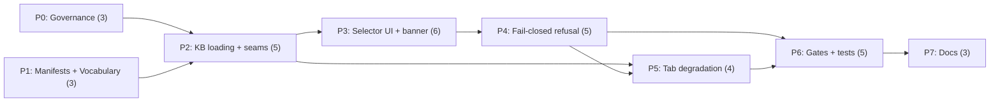

# Implementation Plan: SPA Module Switcher

**Plan ID**: `IMPL-2026-07-22-spa-module-switcher`
**Date**: 2026-07-22
**Author**: `implementation-planner`, expanding the Opus-authored decisions block
**Human Brief**: `docs/project_plans/human-briefs/spa-module-switcher.md` (Tier 3, required — **not yet authored**; this pointer is load-bearing. Its §2 Estimation Sanity Check content is pre-staged in `.claude/worknotes/spa-module-switcher/decisions-block.md` §4 (H1–H6 + anchors) — migrate that content verbatim when the brief is created. **H1–H6 are deliberately not inlined here.**)
**Related Documents**:
- **PRD** (FR-1..FR-36, AC-1..AC-10, R-1..R-8, OQ-1..OQ-4): `docs/project_plans/PRDs/features/spa-module-switcher-v1.md`
- **Decisions Block** (binding; D-1..D-5 settled, not reopened below): `.claude/worknotes/spa-module-switcher/decisions-block.md`
- **SPIKE legs** (the file:line evidence base every task cites): `spike-leg-sq{1,2,3,4}-*.md`
- **ADR**: `docs/adr/0009-module-eligibility-policy-for-clinician-facing-surfaces.md` (authored in P0, `status: proposed`)

**Complexity**: Large (first new SPA panel since v0.1; a safety-critical third UI state; gate surgery on a source-grepping smoke test)
**Total Estimated Effort**: 34 pts
**Provider**: `claude` for every task — browser-local static SPA, no external-model tasks. The design mockups were already generated out-of-band (`gpt-5.6-terra`, operator override) and are **non-binding** (PRD §14); no phase re-generates them.

## Executive Summary

The rule engine has been module-agnostic since P0 — `assess(input, moduleId, rules, candidates)`
(`src/engine.js:19`) over moduleId-keyed registries — and the browser has never used any of it.
This plan wires `src/app.js` to that registry and, in doing so, makes the platform's module
inventory **and its non-parity** perceivable to a clinician for the first time: four modules listed,
each carrying its verbatim `module.json.status`, exactly one of them runnable.

The load-bearing outcome is not "a switcher exists" — it is that **the switcher cannot lie**. Three
properties carry that weight and are proven, not asserted: (1) eligibility is a single `READY_STATUS`
comparison decided from the manifest *before* `assess()` is reachable, so a scaffold can never throw
`UnitRejectionError` and render **"Check the entered units"** (SQ-3 F1/F2 — the current, live
`docs/architecture.md:391` violation); (2) the browser surfaces no hash, no "integrity verified", no
approval badge and **no green state**, because `scripts/sign-kb.mjs:58-73` computes every module's
`clinicalContentHash` over anemia's files and surfacing it would be a false attestation (R-5, out of
scope, recorded as a finding); (3) every clinician-facing status string lives in one constant module
pinned by a doc-truth test. Eight phases run P0∥P1 → P2 → P3 → P4 → P5 → P6 → P7; **P0 lands first
and is not negotiable** — it records the authority lifting E1's FR-14/R-8 prohibition.

## Implementation Strategy

### Architecture Sequence

This is a browser-local static SPA with no bundler, no backend call and no telemetry. The template's
MeatyPrompts layered checklist (repositories / routers / cursor pagination / OpenTelemetry) **does not
apply** (PRD §2 "Architectural Context"). The sequence follows the decisions block's boundary rationale:
**governance** (P0 — the paperwork that authorizes the UI, before the UI) → **truth sources** (P1 —
manifests in, vocabulary out; no behavior yet) → **seams** (P2 — literal-specifier KB loading,
`assessModule`, the eligibility predicate) → **presentation** (P3) → **refusal** (P4, built on P3's
selection surface) → **degradation** (P5 — the four tabs and page copy that still assume anemia) →
**verification** (P6, owns every `verified_by` ID in PRD §11) → **docs** (P7, closes only once
behavior is frozen).

### Parallel Work Opportunities

- **P0 ∥ P1** (wave 1) — disjoint file sets: P0 writes only `docs/adr/**` and
  `docs/project_plans/design-specs/public-moduleid-api-surface.md`; P1 writes only `src/module*.js`,
  `scripts/check-app-imports.mjs` and one new test. Confirmed disjoint against both `files_affected`.
- **P3 ∥ P5** is **dependency-legal** per decisions block §5 but **not schedulable as one wave**: both
  write `src/app.js` and `index.html`, declared serialization barriers, so the two-pass wave algorithm
  splits P5 later. §5's parallel slice survives as **scheduling slack** (P5 carries 4 pts of float
  against the P4→P6 critical path), not concurrent execution — an expansion of §5, not a contradiction.

### Critical Path

**P0∥P1 → P2 → P3 → P4 → P6 → P7** = 3 + 5 + 6 + 5 + 5 + 3 = **27 of 34 pts**. P5 (4 pts) carries
float; P0 (3 pts) is absorbed by P1's concurrent 3 pts, adding zero duration while remaining a hard
predecessor of P2.

### Phase Summary

| Phase | Title | Estimate | Target Subagent(s) | Model(s) | Provider | Effort | Notes |
|-------|-------|---------:|--------------------|----------|----------|--------|-------|
| P0 | Governance & paperwork prerequisites | 3 pts | documentation writer (general-purpose)¹; `task-completion-validator` gate | sonnet | claude | adaptive | **Must land first.** Records the FR-14/R-8 lifting authority. No status flipped anywhere. |
| P1 | Manifest surface + status vocabulary | 3 pts | frontend engineer (general-purpose)¹; `task-completion-validator` gate | sonnet | claude | adaptive | Two new app-surface files; both must be registered in `APP_SURFACE_FILES` |
| P2 | Generic KB loading + engine seam | 5 pts | frontend engineer + registry/seam engineer (general-purpose)¹; `task-completion-validator` gate; **`karen` milestone review** | sonnet | claude | adaptive | Seam correctness matters — do not downgrade. Literal-specifier map is the whole ballgame (R-4). |
| P3 | Selector UI + status banner + `?module=` | 6 pts | UI engineer + UI designer (general-purpose)¹; `task-completion-validator` gate | sonnet | claude | adaptive | `integration_owner: phase-owner`¹ (shared with P4). Seam task: **P4-06**. |
| P4 | Fail-closed refusal state + capability gating | 5 pts | frontend engineer (general-purpose)¹; `task-completion-validator` gate; **`karen` milestone review** | sonnet | claude | **extended** | Safety-critical slice. `integration_owner: phase-owner`¹ (shared with P3). Seam task **P4-06**. |
| P5 | Module-scoped tab degradation & copy | 4 pts | frontend engineer (general-purpose)¹; `task-completion-validator` gate | sonnet | claude | adaptive | Degrade only — **no** `algorithmExplorer` generalization (R-8) |
| P6 | Gates & test harness | 5 pts | frontend engineer (general-purpose)¹ implements, `task-completion-validator` drives; **`karen` milestone review** | sonnet | claude | **extended** | Gate surgery on a source-grepping smoke test (R-3): **extend, never rewrite** |
| P7 | Docs finalization | 3 pts | documentation writer (general-purpose)¹; `task-completion-validator` gate; **`karen` end-of-feature review** | haiku | claude | adaptive | **Pin `provider: claude` explicitly** — see Model Routing note below |
| **Total** | — | **34 pts** | — | — | — | — | Matches decisions block §4 bottom-up total exactly (±0%) |

¹ **Agent-name substitutions.** The decisions block §2 names `documentation-writer`,
`frontend-developer`, `backend-architect`, `ui-engineer-enhanced` and `ui-designer`. **None of these
is registered in this project** — the registered roster is `.claude/agents/dev/`
(`artifact-tracker`, `artifact-validator`, `phase-owner`) plus the user-level `karen`,
`task-completion-validator`, `pr-workflow`, `gemini-orchestrator`. Per the house convention already
used in `multi-bundle-conversion-e1`, every implementer role is dispatched as **`general-purpose`**
with the role descriptor retained for routing intent, phase orchestration is **`phase-owner`**, and
`integration_owner` is **`phase-owner`** (the decisions block said `frontend-developer`). Reviewer
gates use the two genuinely registered reviewer agents, `task-completion-validator` and `karen`.

### Estimation Sanity Check (pointer)

Full H1–H6 application lives in `docs/project_plans/human-briefs/spa-module-switcher.md` §2 (to be
authored; content pre-staged in decisions block §4). Summary only: **bottom-up total 34 pts**, Tier 3
confirmed; H4 per-area sum matches at 34 with no compression; H2 is **N/A** (browser-only, no server
change — D-5). Do not re-derive the anchors here. This plan retains per-task point estimates only.

### Phase Detail Files

Full task tables, acceptance criteria and per-task Model/Effort assignments live in the phase files
(this parent stays under the 300-line guideline):

- **[Phase 0-2: Governance, Truth Sources & Seams](./spa-module-switcher-v1/phase-0-2-foundation.md)**
- **[Phase 3-5: Selector UI, Fail-Closed Refusal & Degradation](./spa-module-switcher-v1/phase-3-5-ui.md)**
- **[Phase 6-7: Gates, Test Harness & Docs](./spa-module-switcher-v1/phase-6-7-gates-docs.md)**

## Reviewer Gate Schedule (Tier 3)

| Gate ID | Where | Reviewer | Trigger |
|---|---|---|---|
| P0-GATE .. P7-GATE | every phase exit | `task-completion-validator` | Phase exit gate criteria met and recorded in the phase progress note |
| P2-KAREN | end of P2 | `karen` | Milestone 1 — the seams (literal specifiers, `assessModule`, eligibility predicate) are the load-bearing foundation of every later phase |
| P4-KAREN | end of P4 | `karen` | Milestone 2 — the fail-closed refusal state is the safety-critical slice; verifies no path reaches `assess()` for an ineligible module and no refusal reuses `showInputRejection` |
| P6-KAREN | end of P6 | `karen` | Milestone 3 — verification phase; verifies the smoke gate was **extended, not rewritten**, and that the `DEFAULT_MODULE_ID` tripwire was flipped deliberately |
| FEATURE-KAREN | end of P7 | `karen` | End of feature — verifies no artifact in the delivered feature is described as validated, verified, reviewed, approved or released |

## Decisions & OQ Resolutions

Binding. Phase executors must not reopen these without a new decisions-block entry.

**OQ-1 — Selector form factor.** Resolved: **persistent sidebar rail** (mockup variant A). A
one-time interstitial gate (variant C) leaves no in-session reminder of which module is active, and
the active module's identity is exactly what FR-30 and AC-7 exist to keep visible. Both mockups render
CBC Suite as *selectable*; that is **superseded by D-1 / FR-4** — CBC Suite is `unsigned-stub` and
ships inert. The mockups are non-binding for behavior (PRD §14).

**OQ-2 — `#evidence` tab.** Resolved: **degrade** (FR-26). `src/evidence/registry.js:39-50` holds
loaders for `anemia` and `cbc_suite_v1` only; growth/kidney have an `evidence.json` but no loader. A
per-module evidence view is Deferred Item **DF-SMS-02**.

**OQ-3 — `#rules` empty-state copy.** Resolved here so P5 does not author prose ad hoc. The string
lands in `src/moduleStatusVocabulary.js` (P1-02) and is pinned by P6-004:
`This module contains no rules. No assessment can be produced from it.` It must state that the module
**contains** no rules — never that rules "are not yet loaded", which implies a loading failure, and
never "not yet available", which implies a pipeline toward release that `gates-registry.md:130-132`
makes schema-impossible.

**OQ-4 — ADR-0009 ratification.** Resolved: **`status: proposed` suffices to merge**, matching
ADR-0004/0005/0006 (SQ-4 §4). No G0–G4 gate blocks shipping the switcher: it flips no status, signs
nothing, and touches no reviewer roster. G0 ratification follows later and is not on this plan's path.

## Deferred Items & In-Flight Findings Policy

### Deferred Items Triage Table

The 5 rows below are decisions block §9 verbatim in substance. Every row gets exactly one **DOC-006**
task in P7 authoring its `Target Spec Path` (full task table in the Phase 6-7 file). Categories per
this repo's `deferred-items-and-findings.md` set: `research` | `prereq` | `design` | `tech-debt` | `policy`.

| Item ID | Category | Reason Deferred | Trigger for Promotion | Target Spec Path |
|---------|----------|-----------------|-----------------------|-----------------|
| DF-SMS-01 | prereq | `scripts/sign-kb.mjs:58-73` hardcodes anemia's file list and `build-static.mjs:54-55` calls it per-module with no module id, so every module's `clinicalContentHash` is computed over **anemia's** files. Fixing it is a prerequisite for any integrity-hash UI, not for this switcher; FR-31 keeps the defect off-screen. | Anyone proposes surfacing a hash, `hashes.recomputed`, or per-module integrity status in a clinician-facing surface | `docs/project_plans/design-specs/sign-kb-per-module-content-hashing.md` |
| DF-SMS-02 | design | A per-module `#evidence` view needs new growth/kidney loaders registered in `src/evidence/registry.js:39-50`; every module has an `evidence.json` (cbc 20, growth 11, kidney 12 sources) but only 2 of 4 have loaders. | A second module becomes `integrity-recorded`, or the evidence registry gains growth/kidney loaders | `docs/project_plans/design-specs/per-module-evidence-view.md` |
| DF-SMS-03 | design | `src/algorithmExplorer.js` is anemia-shaped end to end (`anemiaWalkthrough` `:290-303`, `facts.cbc.hb`/`facts.retic.*` `:257-366`); generalizing it is large and is an explicit non-goal (R-8). P5 degrades the tab only. | A second module becomes selectable and needs a walkthrough | `docs/project_plans/design-specs/algorithm-explorer-module-generalization.md` |
| DF-SMS-04 | policy | Server `moduleId` API param stays deferred for a **corrected** reason: the promotion trigger's "second module registered" clause fired (commit `263120b`), but its "a client needs to choose via the HTTP API" clause has **not** — this switcher makes zero `/api/` calls (SQ-4 §1-2). | An HTTP client, not the browser SPA, needs to select a module | `docs/project_plans/design-specs/public-moduleid-api-surface.md` (**update the existing spec**; the dated re-confirmation section lands in P0-02, DOC-006 verifies it) |
| DF-SMS-05 | tech-debt | `cbc_suite_v1`'s 7 rule evidence IDs all resolve to nothing against `src/evidence.js:9,22` (anemia's 6 only) — citations silently vanish (SQ-3 F9). Unreachable while CBC is inert under D-1; a live guardrail breach the moment it becomes selectable. | `cbc_suite_v1` is proposed for `integrity-recorded` / selectability | **Finding**, not a spec — `.claude/findings/spa-module-switcher-findings.md` (created by P7-DOC-007) |

### In-Flight Findings

Not pre-created. `findings_doc_ref` stays `null` until the first execution-time finding. **Two are
already known and must be recorded at P7-DOC-007 regardless**: DF-SMS-01 (`sign-kb.mjs` anemia
hardcode, R-5) and DF-SMS-05 (SQ-3 F9 evidence-ID resolution gap). On creation the executing agent
sets `findings_doc_ref`, appends the path to `related_documents`, and — if any new finding is
load-bearing — adds a further DOC-006 row and appends its spec path to `deferred_items_spec_refs`.

### Quality Gate

P7 cannot close until: DF-SMS-01..04 each have their `Target Spec Path` authored (or updated, for
DF-SMS-04); `deferred_items_spec_refs` lists all four paths; `findings_doc_ref` is populated and its
doc finalized at `status: accepted` with DF-SMS-05 recorded.

## Plan Generator Rule Compliance (R-P1..R-P4)

- **R-P1** (no vague "all/across"): every task table enumerates concrete file paths and line anchors,
  bounded lists (4 modules, 8 fetch specifiers, 4 refusal cases, 4 status enum values, 5 deferred
  items). No unbounded "across the UI" phrasing appears.
- **R-P2** (new artifact field ⇒ "consumer handles missing/empty X" AC): applied to every new surface —
  a manifest missing an optional envelope field (P3-03), a `status` absent or outside the closed enum
  (P2-03), a status with no vocabulary entry (P1-02), a module in `MODULE_IDS` absent from the manifest
  map (P3-03), zero rules (P5-03). Each fails to the refusal path, never to friendlier text.
- **R-P3** (≥2 owner specialties + overlapping `files_affected` ⇒ `integration_owner` + seam task):
  applied to **P3 + P4**, which share `src/app.js` and `index.html`. `integration_owner: phase-owner`
  is declared on both phases; the seam task is **P4-06** — selecting an ineligible module must swap
  the banner **and** clear results atomically, with no interleaving in which the previous module's
  result is visible beneath the new module's banner.
- **R-P4** (UI-touching phases need a runtime-smoke task): **applicable and satisfied**. This repo has
  no `*.tsx`; R-P4's trigger is read as "any UI-touching file" — `index.html`, `styles.css`,
  `src/app.js` — which P3, P4 and P5 all write. The runtime-smoke task is **P6-009-smoke**
  (`scripts/smoke-browser-unit-rejection.mjs`, extended not rewritten), which exercises default load,
  switch to an ineligible module, refusal render, and tab switch with `?module=` present.

## Risk Mitigation

Expanded from decisions block §3; per-phase mitigations also appear in each phase's Quality Gates.

| Risk | Impact | Likelihood | Mitigation Strategy |
|------|:------:|:----------:|---------------------|
| R-1 — switcher presents 4 modules as peers → E1 R-4 realized (`multi-bundle-conversion-e1.md:523`) | High | Med | P3-01 renders two **labelled structural groups**, not a footnote; the verbatim panel header `These modules are not peers. Read each row.` is a pinned constant (P1-02) and asserted by P6-001/P6-004 |
| R-2 — banner implies verification the browser never performed | High | Med | P1-02 pins the FR-13 honesty-boundary sentence as a constant rendered **in the panel, not a tooltip** (P3-04); P6-008 is a negative-assertion test over source **and** built `dist/` HTML for hash/approval/release tokens |
| R-3 — `smoke-browser-unit-rejection.mjs` greps `src/app.js` source text (`:132,:134,:179,:188,:216-223`) — a refactor silently breaks the gate | High | **High** | P2-02 **retains** the `assessPediatricAnemia` export (`src/engine.js:98-100`) and its `assessPediatricAnemia(input, rules, candidates)` call shape; P6-009-smoke **extends** `:179`/`:188` with sibling assertions and adds a refusal-UI block mirroring `:167-173` — the phase file forbids rewriting the script |
| R-4 — template-literal fetch specifiers defeat `?v=` stamping → stale KB served (`build-static.mjs:100-106`) | High | Med | P2-01 uses the literal-keyed `MODULE_KB_LOADERS` thunk map (SQ-3 §6, verified against all three regexes); P2-06 is a negative test asserting no template-literal fetch specifier exists in any `APP_SURFACE_FILES` entry; P2-05 verifies all 8 specifiers resolve dev **and** dist and are `?v=`-stamped |
| R-5 — `sign-kb.mjs` anemia hardcode becomes a user-visible false attestation | Med | Low | Out of scope (PRD §7) + FR-31 hash-surfacing prohibition enforced by P6-008; recorded as **DF-SMS-01** and as a finding at P7-DOC-007 |
| R-6 — `DEFAULT_MODULE_ID` tripwire (`tests/module-registry.test.mjs:24`) flipped mechanically instead of deliberately | Med | Med | P6-010 requires E1 FR-14/R-8 **and** ADR-0009 cited in both the test comment and the commit message; P6-KAREN verifies the citation exists rather than the assertion merely passing |
| R-7 — `history.replaceState` in `switchTab` (`src/app.js:457`) drops `?module=` | Med | **High** | P3-06 is a standalone task for exactly this edit, with P6-006 asserting a tab switch preserves the query string |
| R-8 — scope creep into `src/algorithmExplorer.js` generalization | Med | Med | Explicit non-goal (PRD §7); P5-01 degrades the tab and its AC forbids any change to `anemiaWalkthrough` or the `facts.cbc.*` accessors; DF-SMS-03 holds the generalization |

## Model, Provider & Profile Assignment

Per decisions block §6 and `.claude/worknotes/spa-module-switcher/routing-records.md`. All tasks
carry Model / Effort / Provider columns in the phase files. Effort vocabulary is claude-only here:
`adaptive` | `extended` — **story points never appear in Effort**.

- **Model**: `sonnet` for P0–P6; `haiku` for P7 (mechanical doc edits). **Effort**: `adaptive` by
  default; **`extended` on P4** (fail-closed logic is the safety-critical slice) and **P6** (gate
  surgery on a source-grepping smoke test). **Provider**: `claude` for all 34 pts — no external-model
  tasks; the mockups were generated out-of-band before planning and are non-binding.
- **Routing finding, carried forward from decisions block §6 — load-bearing for P0 and P7**:
  `task_class: documentation` resolves to **free-tier Haiku regardless of the requested model**. Both
  phases must pin `provider: claude` explicitly on every task or they silently land on a free-tier
  route. P0 is additionally pinned `sonnet` — its tasks are documentation-shaped but are governance
  artifacts, not mechanical edits.

## Wrap-Up: Feature Guide & PR

Triggered once P7 is sealed and FEATURE-KAREN passes. Delegate to a documentation writer
(`general-purpose`, sonnet) to create `.claude/worknotes/spa-module-switcher/feature-guide.md` per the
standard template (≤200 lines). Its **Known Limitations** section must state plainly that one module
is selectable, three are inert, and the browser verifies nothing. Commit it before opening the PR; the
PR title should name the honesty outcome, not just the control.

**Progress Tracking**: `.claude/progress/spa-module-switcher/` (one file per phase, created via the
`artifact-tracking` skill during execution — `progress_init: auto`). **Plan Version**: 1.0 ·
**Last Updated**: 2026-07-22
