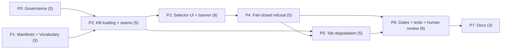

# Implementation Plan: SPA Module Switcher

**Plan ID**: `IMPL-2026-07-22-spa-module-switcher` · **Date**: 2026-07-22 · **Author**: `implementation-planner`, expanding the Opus-authored decisions block
**Human Brief**: `docs/project_plans/human-briefs/spa-module-switcher.md` — **authored**; it carries the H1–H6 Estimation Sanity Check (deliberately not inlined here) and the revised estimate.
**Verification ceiling (D-6)**: read PRD §11a before executing any phase. This repo has no browser automation and no test dependencies; behavioral fail-closure, banner rendering and refusal-state transitions are established by **source inspection plus one human review pass (P6-011)**, not by executed browser tests.
**Related Documents**:
- **PRD** (FR-1..FR-37, AC-1..AC-11, **§11a verification ceiling**, R-1..R-9, OQ-1..OQ-4): `docs/project_plans/PRDs/features/spa-module-switcher-v1.md`
- **Decisions Block** (binding; D-1..D-6 settled, not reopened below): `.claude/worknotes/spa-module-switcher/decisions-block.md`; **SPIKE legs** `spike-leg-sq{1,2,3,4}-*.md`
- **ADRs**: `0009-module-eligibility-policy-for-clinician-facing-surfaces.md` (P0, `proposed`); `0010-browser-test-capability-for-the-spa.md` (P7 deferred spec, `proposed`, per D-6)

**Complexity**: Large (first new SPA panel since v0.1; a safety-critical third UI state; gate surgery on a source-grepping smoke test) · **Total Estimated Effort**: 41 pts (revised from 34 at the `karen` planning gate — see Phase Summary)
**Provider**: `claude` for every task — browser-local static SPA, no external-model tasks. The design mockups were already generated out-of-band (`gpt-5.6-terra`, operator override) and are **non-binding** (PRD §14); no phase re-generates them.

## Executive Summary

The rule engine has been module-agnostic since P0 — `assess(input, moduleId, rules, candidates)`
(`src/engine.js:19`) over moduleId-keyed registries — and the browser has never used any of it. This
plan wires `src/app.js` to that registry, making the module inventory **and its non-parity**
perceivable for the first time: four modules listed with verbatim `module.json.status`, one runnable.

The load-bearing outcome is not "a switcher exists" — it is that **the switcher cannot lie**. Three
properties carry that weight: (1) eligibility is a single `READY_STATUS` comparison decided from the
manifest *before* `assess()` is reachable, so a scaffold can never throw `UnitRejectionError` and
render **"Check the entered units"** (SQ-3 F1/F2 — the live `docs/architecture.md:391` violation);
(2) the browser surfaces no hash, no "integrity verified", no approval badge and **no green state**,
because `scripts/sign-kb.mjs:58-73` computes every module's `clinicalContentHash` over anemia's files
(R-5, out of scope, recorded as a finding); (3) every clinician-facing status string lives in one
constant pinned by a doc-truth test. **How far those are proven is bounded by D-6**: source assertion
plus one human pass, never an executed browser test — PRD §11a, and this plan must not soften it.
Eight phases run P0∥P1 → P2 → P3 → P4 → P5 → P6 → P7; **P0 lands first and is not negotiable** — it
records the authority lifting E1's FR-14/R-8 prohibition.

## Implementation Strategy

### Architecture Sequence

A browser-local static SPA — no bundler, no backend call, no telemetry — so the MeatyPrompts layered
checklist does not apply (PRD §2). Sequence: **governance** (P0 — the paperwork authorizing the UI,
before the UI) → **truth sources** (P1) → **seams** (P2 — literal-specifier KB loading, `assessModule`,
the eligibility predicate) → **presentation** (P3) → **refusal** (P4) → **degradation** (P5) →
**verification** (P6, owning every `verified_by` ID in PRD §11 incl. the human step P6-011) → **docs**
(P7).

### Parallel Work Opportunities

- **P0 ∥ P1** (wave 1) — disjoint file sets (P0: `docs/adr/**` + the design spec; P1: `src/module*.js`,
  `scripts/check-app-imports.mjs`, one test), confirmed against both `files_affected`.
- **P3 ∥ P5** is **dependency-legal** (decisions block §5) but **not one wave**: both write
  `src/app.js` and `index.html`, declared serialization barriers, so P5 splits later. §5's parallel
  slice survives as **scheduling slack** (5 pts of float against the P4→P6 critical path).

### Critical Path

**P0∥P1 → P2 → P3 → P4 → P6 → P7** = 3 + 5 + 8 + 5 + 9 + 3 = **33 of 41 pts**. P5 (5 pts) carries
float; P0's 3 pts are absorbed by P1's concurrent 3 — zero added duration, still a hard predecessor.

### Phase Summary

| Phase | Title | Estimate | Target Subagent(s) | Model(s) | Provider | Effort | Notes |
|-------|-------|---------:|--------------------|----------|----------|--------|-------|
| P0 | Governance & paperwork prerequisites | 3 pts | documentation writer (general-purpose)¹; `task-completion-validator` gate | sonnet | claude | adaptive | **Must land first.** Records the FR-14/R-8 lifting authority. No status flipped anywhere. |
| P1 | Manifest surface + status vocabulary | 3 pts | frontend engineer (general-purpose)¹; `task-completion-validator` gate | sonnet | claude | adaptive | Two new app-surface files; both must be registered in `APP_SURFACE_FILES` |
| P2 | Generic KB loading + engine seam | 5 pts | frontend engineer + registry/seam engineer (general-purpose)¹; `task-completion-validator` gate; **`karen` milestone review** | sonnet | claude | adaptive | Seam correctness matters — do not downgrade. Literal-specifier map is the whole ballgame (R-4). |
| P3 | Selector UI + status banner + `?module=` | **8 pts** | UI engineer + UI designer (general-purpose)¹; `task-completion-validator` gate | sonnet | claude | adaptive | `integration_owner: phase-owner`¹ (shared with P4). Seam task: **P4-06**. Was 6; +2 for FR-37 (programmatic inertness + reason-in-accessible-name), previously NFR prose with no AC. |
| P4 | Fail-closed refusal state + capability gating | 5 pts | frontend engineer (general-purpose)¹; `task-completion-validator` gate; **`karen` milestone review** | sonnet | claude | **extended** | Safety-critical slice. `integration_owner: phase-owner`¹ (shared with P3). Seam task **P4-06**. |
| P5 | Module-scoped tab degradation & copy | **5 pts** | frontend engineer (general-purpose)¹; `task-completion-validator` gate | sonnet | claude | adaptive | Degrade only — **no** `algorithmExplorer` generalization (R-8). Was 4; +1 (6 surfaces across 8 `index.html` sites was under-counted). |
| P6 | Gates & test harness **+ human verification** | **9 pts** | frontend engineer (general-purpose)¹ implements, `task-completion-validator` drives; **`karen` milestone review**; **a named human for P6-011** | sonnet | claude | **extended** | Gate surgery on a source-grepping smoke test (R-3): **extend, never rewrite**. Was 5; +4 for two new tasks (**P6-011** human visual evidence, **P6-012** forced-activation source assertion) and for rewriting every behavioral AC to the D-6 ceiling. |
| P7 | Docs finalization | 3 pts | documentation writer (general-purpose)¹; `task-completion-validator` gate; **`karen` end-of-feature review** | haiku | claude | adaptive | **Pin `provider: claude` explicitly** — see Model Routing note below. Now also authors ADR-0010 (DF-SMS-06). |
| **Total** | — | **41 pts** | — | — | — | — | 3+3+5+8+5+5+9+3 = 41. **Arithmetic sum of the rows above** — see the re-estimation note. |

**Re-estimation note (2026-07-22, `karen` planning gate).** The prior 34 pts was a **top-down anchor**
(E1's 30 + ~13%) that every phase was then fitted to — each phase summed to exactly its pre-set anchor,
zero residual across 52 tasks. That is back-fitting; the human brief's H4 "per-area sum = 34, matches"
was circular and has been deleted, not restated. **41 is the corrected figure**: the three under-scoped
phases re-estimated on their own task content (P3 6→8, P5 4→5, P6 5→9), the other five unchanged
(P0 3, P1 3, P2 5, P4 5, P7 3). 34 + 2 + 1 + 4 = **41**. On any later revision, re-add the column —
the total must be the sum of the rows, never a target the rows are made to hit.

¹ **Agent-name substitutions.** The decisions block §2 names `documentation-writer`,
`frontend-developer`, `backend-architect`, `ui-engineer-enhanced`, `ui-designer` — **none registered
here** (roster: `.claude/agents/dev/` `artifact-tracker`, `artifact-validator`, `phase-owner`, plus
user-level `karen`, `task-completion-validator`, `pr-workflow`, `gemini-orchestrator`). Per the
`multi-bundle-conversion-e1` convention, implementer roles dispatch as **`general-purpose`** with the
descriptor kept for routing intent; orchestration and `integration_owner` are **`phase-owner`**.
**P6-011 has no agent at all** — it is a human task and must not be dispatched.

### Estimation Sanity Check (pointer)

Full H1–H6 lives in the human brief §2 (**authored**). Summary: **41 pts**, Tier 3; H2 **N/A**
(browser-only, no server change — D-5); **H4 no longer claims a matching per-area sum**.

### Phase Detail Files

Full task tables, per-task Model/Effort assignments, and the AC-1..AC-11 propagation/resilience
contracts live in the phase files (this parent stays under the 300-line guideline):

- **[Phase 0-2: Governance, Truth Sources & Seams](./spa-module-switcher-v1/phase-0-2-foundation.md)**
- **[Phase 3-5: Selector UI, Fail-Closed Refusal & Degradation](./spa-module-switcher-v1/phase-3-5-ui.md)**
- **[Phase 6-7: Gates, Test Harness & Docs](./spa-module-switcher-v1/phase-6-7-gates-docs.md)** — also
  hosts the AC contracts and the P6-011 human-verification record

## Reviewer Gate Schedule (Tier 3)

| Gate ID | Where | Reviewer | Trigger |
|---|---|---|---|
| P0-GATE .. P7-GATE | every phase exit | `task-completion-validator` | Phase exit gate criteria met and recorded in the phase progress note |
| P2-KAREN | end of P2 | `karen` | Milestone 1 — the seams (literal specifiers, `assessModule`, eligibility predicate) are the load-bearing foundation of every later phase |
| P4-KAREN | end of P4 | `karen` | Milestone 2 — the fail-closed refusal state is the safety-critical slice; verifies no path reaches `assess()` for an ineligible module and no refusal reuses `showInputRejection` |
| P6-KAREN | end of P6 | `karen` | Milestone 3 — verification phase; verifies the smoke gate was **extended, not rewritten**, that **both** tripwire comments (`tests/module-registry.test.mjs:20-24` — already overdue — and `src/modules/registry.js:39-50`) were actioned deliberately and separately, and that **P6-011's human review actually happened and is signed** rather than assumed |
| FEATURE-KAREN | end of P7 | `karen` | End of feature — verifies no artifact in the delivered feature is described as validated, verified, reviewed, approved or released |

## Decisions & OQ Resolutions

Binding. Phase executors must not reopen these without a new decisions-block entry.

**OQ-1 — Selector form factor.** **REVISED by decisions block §11 (D-7, operator override,
2026-07-22): header dropdown (mockup B)**, superseding the prior "persistent sidebar rail (mockup A)"
resolution. The collapsed control keeps the active module's title + verbatim status chip persistently
visible in the header, which satisfies the in-session-reminder requirement (FR-30/AC-7) that ruled
out interstitial C. The expanded panel keeps the two labelled structural groups and the verbatim
panel header. Mockup B's CBC-row-without-lock divergence must not be copied — all three
non-`integrity-recorded` modules ship inert (D-1/FR-4). Mockups remain non-binding for behavior
(PRD §14).

**OQ-2 — `#evidence` tab.** **Degrade** (FR-26). `src/evidence/registry.js:39-50` holds loaders for
`anemia` and `cbc_suite_v1` only; growth/kidney have an `evidence.json` but no loader. A per-module
evidence view is **DF-SMS-02**.

**OQ-3 — `#rules` empty-state copy.** Resolved here so P5 authors no prose ad hoc. The string lands in
`src/moduleStatusVocabulary.js` (P1-02), pinned by P6-004: `This module contains no rules. No
assessment can be produced from it.` It must say the module **contains** no rules — never "not yet
loaded" (implies a load failure) or "not yet available" (implies a pipeline toward release that
`gates-registry.md:130-132` makes schema-impossible).

**OQ-4 — ADR-0009 ratification.** **`status: proposed` suffices to merge**, matching ADR-0004/0005/0006
(SQ-4 §4). No G0–G4 gate blocks the switcher: it flips no status, signs nothing, touches no roster.

**D-6 — verification ceiling (added at the `karen` planning gate; binding on P6).** No jsdom, no
headless browser, no new test dependency. Every P6 acceptance criterion is written to what a source
assertion or an executed non-DOM unit can actually prove, and each states what it does *not* prove.
The remainder is **P6-011, a human task**. PRD §11a is the disclosure; do not weaken it, and do not
let a green `npm run check` be reported as behavioral coverage.

## Deferred Items & In-Flight Findings Policy

### Deferred Items Triage Table

Decisions block §9 in substance plus DF-SMS-06 (from D-6). Every row gets one **DOC-006** task in P7
authoring its `Target Spec Path`.

| Item ID | Category | Reason Deferred | Trigger for Promotion | Target Spec Path |
|---------|----------|-----------------|-----------------------|-----------------|
| DF-SMS-01 | prereq | `scripts/sign-kb.mjs:58-73` hardcodes anemia's file list and `build-static.mjs:54-55` calls it per-module with no module id, so every module's `clinicalContentHash` is computed over **anemia's** files. Fixing it is a prerequisite for any integrity-hash UI, not for this switcher; FR-31 keeps the defect off-screen. | Anyone proposes surfacing a hash, `hashes.recomputed`, or per-module integrity status in a clinician-facing surface | `docs/project_plans/design-specs/sign-kb-per-module-content-hashing.md` |
| DF-SMS-02 | design | A per-module `#evidence` view needs new growth/kidney loaders registered in `src/evidence/registry.js:39-50`; every module has an `evidence.json` (cbc 20, growth 11, kidney 12 sources) but only 2 of 4 have loaders. | A second module becomes `integrity-recorded`, or the evidence registry gains growth/kidney loaders | `docs/project_plans/design-specs/per-module-evidence-view.md` |
| DF-SMS-03 | design | `src/algorithmExplorer.js` is anemia-shaped end to end (`anemiaWalkthrough` `:290-303`, `facts.cbc.hb`/`facts.retic.*` `:257-366`); generalizing it is large and is an explicit non-goal (R-8). P5 degrades the tab only. | A second module becomes selectable and needs a walkthrough | `docs/project_plans/design-specs/algorithm-explorer-module-generalization.md` |
| DF-SMS-04 | policy | Server `moduleId` API param stays deferred for a **corrected** reason: the promotion trigger's "second module registered" clause fired (commit `263120b`), but its "a client needs to choose via the HTTP API" clause has **not** — this switcher makes zero `/api/` calls (SQ-4 §1-2). **Prior art to mine when the trigger fires**: PR #26 (closed unmerged, branch `worktree-plan-module-switcher`, PRD `docs/project_plans/PRDs/features/module-switcher-v1.md` on that branch) authored a full Tier-2 API-surface plan — body-field `moduleId`, `400 UNKNOWN_MODULE` on the existing `{error, code?, details?}` envelope, validate-before-any-lookup path-injection guard, and the registration gap (`kidney_suite_v1`/`growth_suite_v1` absent from `src/units.js`/`src/evidence/registry.js`, its FR-0). Its "all registered modules assessable" premise is **superseded** — any API surface must gate on ADR-0009 eligibility, not `isRegisteredModule()`, or it re-opens the DF-SMS-05 mislabeled-output hazard over HTTP. | An HTTP client, not the browser SPA, needs to select a module | `docs/project_plans/design-specs/public-moduleid-api-surface.md` (**update the existing spec**; the dated re-confirmation section lands in P0-02, DOC-006 verifies it) |
| DF-SMS-05 | tech-debt | `cbc_suite_v1`'s 7 rule evidence IDs all resolve to nothing against `src/evidence.js:9,22` (anemia's 6 only) — citations silently vanish (SQ-3 F9). Unreachable while CBC is inert under D-1; a live guardrail breach the moment it becomes selectable. | `cbc_suite_v1` is proposed for `integrity-recorded` / selectability | **Finding**, not a spec — `.claude/findings/spa-module-switcher-findings.md` (created by P7-DOC-007) |
| DF-SMS-06 | prereq | **Browser test capability for the SPA (D-6).** This repo has no browser automation and no test dependencies, so behavioral fail-closure, banner rendering and refusal transitions are source-asserted plus human-reviewed, never executed (PRD §11a). Adding jsdom or a headless browser as a side effect of a UI feature is refused; the zero-dependency posture is load-bearing for a prototype that promises no third-party code. | The SPA gains further safety-critical UI, or a second module becomes selectable — i.e. when the cost of an unexecuted behavioral assertion exceeds the cost of the dependency | `docs/adr/0010-browser-test-capability-for-the-spa.md` (**ADR, `status: proposed`**, authored at P7-DOC-006) |

### In-Flight Findings

Not pre-created; `findings_doc_ref` stays `null` until the first execution-time finding. **Three are
already known and must be recorded at P7-DOC-007 regardless**: DF-SMS-01 (`sign-kb.mjs` anemia
hardcode, R-5); DF-SMS-05 (SQ-3 F9 evidence-ID gap); and **the stale tripwire comment** at
`tests/module-registry.test.mjs:20-24` — its trigger ("the day a second module registers") fired at
commit `263120b`, was never actioned, and the comment still asserts "today there is exactly one
registered module" while four are registered.

### Quality Gate

P7 cannot close until DF-SMS-01..04 and DF-SMS-06 each have their `Target Spec Path` authored (or
updated, for DF-SMS-04), `deferred_items_spec_refs` lists all five, and `findings_doc_ref` is populated
with its doc at `status: accepted` recording DF-SMS-05 and the stale-tripwire finding.

## Plan Generator Rule Compliance (R-P1..R-P4)

- **R-P1** (no vague "all/across"): every task table enumerates concrete file paths and line anchors,
  bounded lists (4 modules, 8 fetch specifiers, 4 refusal cases, 4 enum values, 6 deferred items).
- **R-P2** (new field ⇒ "consumer handles missing/empty X" AC): applied to a manifest missing an
  optional envelope field (P3-03), an absent/out-of-enum `status` (P2-03), a status with no vocabulary
  entry (P1-02), a `MODULE_IDS` entry absent from the manifest map (P3-03), zero rules (P5-03). Each
  fails to the refusal path, never to friendlier text.
- **R-P3** (≥2 owner specialties + overlapping `files_affected` ⇒ `integration_owner` + seam task):
  applied to **P3 + P4**, which share `src/app.js` and `index.html`. `integration_owner: phase-owner`
  on both; seam task **P4-06** — selecting an ineligible module must swap the banner **and** clear
  results atomically. Its assertion is a source-order one (D-6), not an observed interleaving.
- **R-P4** (UI-touching phases need a runtime-smoke task): **satisfied within the D-6 ceiling**. No
  `*.tsx` here, so R-P4's trigger reads as "any UI-touching file" (`index.html`, `styles.css`,
  `src/app.js`), which P3–P5 all write. The task is **P6-009-smoke** (extend, never rewrite). **What
  it actually does**: source assertions over the app surfaces plus *executed* checks against the built
  non-DOM graph (`assessModule`, `isModuleSelectable`). It does **not** load a page, dispatch an event,
  switch a tab or render a refusal — nothing here can. The behavioral half is discharged by **P6-011,
  a human task**; PRD §11a says so in the product's own words.

## Risk Mitigation

Expanded from decisions block §3; per-phase mitigations also appear in each phase's Quality Gates.
**R-9 (new, from the `karen` gate)** — §11a's ceiling is forgotten and a green `npm run check` is later
reported as behavioral fail-closure coverage. Mitigation: every P6 AC states what it does not prove;
P6-011 is a human task with a named signer; P6-KAREN checks that it was actually done.

| Risk | Impact | Likelihood | Mitigation Strategy |
|------|:------:|:----------:|---------------------|
| R-1 — switcher presents 4 modules as peers → E1 R-4 realized (`multi-bundle-conversion-e1.md:523`) | High | Med | P3-01 renders two **labelled structural groups**, not a footnote; the verbatim panel header `These modules are not peers. Read each row.` is a pinned constant (P1-02) and asserted by P6-001/P6-004 |
| R-2 — banner implies verification the browser never performed | High | Med | P1-02 pins the FR-13 honesty-boundary sentence as a constant rendered **in the panel, not a tooltip** (P3-04); P6-008 is a negative-assertion test over source **and** built `dist/` HTML for hash/approval/release tokens |
| R-3 — `smoke-browser-unit-rejection.mjs` greps `src/app.js` source text (`:132,:134,:179,:188,:216-223`) — a refactor silently breaks the gate | High | **High** | P2-02 **retains** the `assessPediatricAnemia` export (`src/engine.js:98-100`) and its `assessPediatricAnemia(input, rules, candidates)` call shape; P6-009-smoke **extends** `:179`/`:188` with sibling assertions and adds a refusal-UI block mirroring `:167-173` — the phase file forbids rewriting the script |
| R-4 — template-literal fetch specifiers defeat `?v=` stamping → stale KB served (`build-static.mjs:100-106`) | High | Med | P2-01 uses the literal-keyed `MODULE_KB_LOADERS` thunk map (SQ-3 §6, verified against all three regexes); P2-06 is a negative test asserting no template-literal fetch specifier exists in any `APP_SURFACE_FILES` entry; P2-05 verifies all 8 specifiers resolve dev **and** dist and are `?v=`-stamped |
| R-5 — `sign-kb.mjs` anemia hardcode becomes a user-visible false attestation | Med | Low | Out of scope (PRD §7) + FR-31 hash-surfacing prohibition enforced by P6-008; recorded as **DF-SMS-01** and as a finding at P7-DOC-007 |
| R-6 — `DEFAULT_MODULE_ID` tripwire (`tests/module-registry.test.mjs:24`) flipped mechanically instead of deliberately | Med | Med | P6-010 requires E1 FR-14/R-8 **and** ADR-0009 cited in both the test comment and the commit message; P6-KAREN verifies the citation exists rather than the assertion merely passing |
| R-7 — `history.replaceState` in `switchTab` (`src/app.js:457`) drops `?module=` | Med | **High** | P3-06 is a standalone task for exactly this edit, with P6-006 asserting a tab switch preserves the query string |
| R-8 — scope creep into `src/algorithmExplorer.js` generalization | Med | Med | Explicit non-goal (PRD §7); P5-01 degrades the tab and its AC forbids any change to `anemiaWalkthrough` or the `facts.cbc.*` accessors; DF-SMS-03 holds the generalization |

## Model, Provider & Profile Assignment

Per decisions block §6 and `routing-records.md`. All tasks carry Model / Effort / Provider columns in
the phase files. Effort vocabulary is claude-only: `adaptive` | `extended` — **story points never
appear in Effort**.

- **Model**: `sonnet` P0–P6; `haiku` P7. **Effort**: `adaptive` by default; **`extended` on P4**
  (safety-critical slice) and **P6** (gate surgery on a source-grepping smoke test). **Provider**:
  `claude` for all 41 pts. **P6-011 has no model** — it is a human task and must not be dispatched.
- **Routing finding (decisions block §6) — load-bearing for P0 and P7**: `task_class: documentation`
  resolves to **free-tier Haiku regardless of requested model**. Both phases must pin
  `provider: claude` on every task. P0 is additionally pinned `sonnet` — governance artifacts, not
  mechanical edits.

## Wrap-Up: Feature Guide & PR

Once P7 is sealed and FEATURE-KAREN passes, delegate to a documentation writer (`general-purpose`,
sonnet) to create `.claude/worknotes/spa-module-switcher/feature-guide.md` (≤200 lines). Its **Known
Limitations** must state plainly that one module is selectable, three are inert, the browser verifies
nothing, **and that the UI's behavior was verified by source inspection plus one human review pass,
not by executed browser tests** (PRD §11a). Commit before the PR; the PR title should name the honesty
outcome, not just the control.

**Progress Tracking**: `.claude/progress/spa-module-switcher/` — `context.md` + one file per phase
(`phase-0-progress.md` .. `phase-7-progress.md`). **Plan Version**: 1.1 (karen-gate revision) ·
**Last Updated**: 2026-07-22
