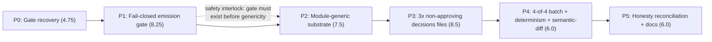

# Implementation Plan: Multi-Bundle Conversion E1 — Finish the Converter Pass

**Plan ID**: `IMPL-2026-07-23-multi-bundle-conversion-e1-finish`
**Date**: 2026-07-23
**Author**: `implementation-planner` agent (sonnet), expanding an Opus-authored decisions block
**Related Documents**:
- **PRD**: `docs/project_plans/PRDs/infrastructure/multi-bundle-conversion-e1-finish.md` (FR-F1..FR-F24)
- **Decisions Block** (binding, not contradicted below — §0 Premise Correction and §7a Opus
  Resolutions R-1/R-2/R-3 are non-negotiable):
  `.claude/worknotes/multi-bundle-conversion-e1-finish/decisions-block.md`
- **SPIKE-009** (evidence base; every phase boundary traces to a finding here):
  `docs/project_plans/SPIKEs/spike-009-converter-module-genericity.md`
- **Prior plan (binding house style + task-ID convention; do not regress its output)**:
  `docs/project_plans/implementation_plans/infrastructure/multi-bundle-conversion-e1.md` and
  `modules/cbc_suite_v1/`

**Complexity**: Large (a safety-interlocked, 6-phase re-architecture of the one clinical emission
gate this repository has; zero tolerance for a window where the gate is disarmed)
**Total Estimated Effort**: **41.0 pts** (honest bottom-up; the decisions-block anchor was 32 —
see §Estimation Sanity Check for the reconciliation; amended from an earlier 38.5-pt draft to price
in P1-T8 and P2-T7, added to close 2 BLOCKING findings from a planning-gate review — see those
tasks' own phase files)
**Provider**: mixed — `claude` (native, MUST-stay-primary, no fallback) for P1/P2/P3 and all
adjudication; `ica-executor`/`codex-executor` only for mechanical, spec-bounded, non-adjudicating
work in P0/P4/P5.

## Executive Summary

This plan closes the one remaining structural gap SPIKE-009 found: `tools/rf-bundle-to-kb-pack`'s
`propose` verb is hard-coded to a single module (`cbc_suite_v1`) and its `authoring-decisions.yaml`
`status` field — the thing that is supposed to gate AI-drafted rule emission — is validated for
shape but never read at runtime. Six phases run **strictly serially**, P0 → P1 → P2 → P3 → P4 → P5,
with one non-negotiable safety interlock: **P1 (the fail-closed emission gate becomes code, as an
allowlist) must land, tested, before P2 (removing the hard-coded module-identity check) begins.**
Removing the accidental protection (the `MODULE_ID` string check) before installing the intentional
one (a live `status === 'approved_for_rule_draft'` branch) would arm AI-draftable rule emission
across three clinical modules with nothing but an inert documentation field standing in the way —
this is the single most important ordering decision in this plan and it is enforced as a hard
`depends_on` edge in the frontmatter `wave_plan`, not merely stated in prose. P0 first greens the
currently-red `npm run check` gate honestly (35 sources backfilled with the schema's own
`unknown`/`unassessed` vocabulary, mirroring the already-committed `RR-AAP2026_IDA` precedent — no
license, access-basis, or judgment-basis determination is asserted anywhere). P3 authors three
non-approving `authoring-decisions.yaml` files (a narrow, explicitly-documented supersession of the
prior PRD's FR-22) with all `review.*` roles `pending` and zero decisions ever set to
`approved_for_rule_draft`. P4 proves 4-of-4 batch determinism and produces (never resolves) a
committed `semantic-diff.json` per non-`cbc` module documenting how converter output compares to the
already-committed bespoke evidence projections — it does not overwrite committed evidence. P5 closes
the honesty ledger: docs, runbook, CHANGELOG, four **newly-created** (not updated — R-1) deferred-item
design specs, and a findings doc retiring the prior pass's three tracked findings.

## Implementation Strategy

### Architecture Sequence

This is a content-build-pipeline / safety-substrate feature (same class as the prior E1 pass), not a
layered CRUD feature. The six phases are exactly the decisions block's own §1 table, unmodified:

1. **P0 — Gate recovery.** Data/fixture-only; zero converter code touched. Must be green and alone
   before anything else — building on a red gate makes every later "tests pass" claim unverifiable.
2. **P1 — Fail-closed emission gate becomes code.** The allowlist branch, the cross-resolution guard,
   and the repo-level invariant test all land and go green here, before P2 exists.
3. **P2 — Module-generic drafting substrate.** The hard-coded `MODULE_ID` check is replaced; the
   `cbc_suite_v1` byte-identity anchor (captured as this phase's own first task) is the hard exit
   gate.
4. **P3 — Author 3× non-approving decisions files.** Only meaningfully testable once P2 makes parsed
   decisions-file content actually drive behavior.
5. **P4 — 4-of-4 batch + determinism + semantic-diff.** Cannot complete without P3's three files.
6. **P5 — Honesty reconciliation + docs.** Can only be written once the code's actual behavior is
   known and pinned by tests from P0–P4.

### Parallel Work Opportunities

- **Inside P0 only**: two file-disjoint task batches — batch (a) `{scripts/evidence/lib/cbc-002-projection.mjs,
  modules/kidney_suite_v1/evidence.json, modules/growth_suite_v1/evidence.json}` and batch (b)
  `{rights/rights-records.json, rights/rights-ledger.json, tests/fixtures/p4-t1-pre-merge-snapshot.json.txt,
  docs/architecture.md}`. Intersection is the empty set — verified directly against both batches'
  file lists in the Phase 0-1 file's disjointness table. Per project memory (wave-plan batches have
  collided in this repo before, CRW batch_2), this intersection is checked explicitly, not assumed.
- **Inside P5 only**: doc/design-spec slices are mutually file-disjoint (each of the 4 design specs is
  its own new file; `docs/architecture.md`, the runbook, `CHANGELOG.md`, and the findings doc are 4
  more distinct files) — see the Phase 4-5 file's disjointness table.
- **P1 and P2 explicitly do NOT parallelize** — this is a safety interlock, not a scheduling
  convenience. Both phases also physically collide on `tools/rf-bundle-to-kb-pack/lib/verbs/propose.mjs`,
  so even absent the safety rationale they could not run concurrently.
- **No other phase pair parallelizes.** P3 depends on P2's decisions-file-driven behavior being real;
  P4 depends on P3's three files existing; P5 depends on P0–P4's actual, tested behavior.

### Critical Path

**P0 → P1 → P2 → P3 → P4 → P5 (fully serial, 41.0 of 41.0 pts on the critical path)** — there is no
phase with schedule slack in this plan; every phase gates the next.

### Phase Summary

| Phase | Title | Estimate | Target Subagent(s) | Model(s) | Provider | Profile | Notes |
|-------|-------|---------:|---------------------|----------|----------|---------|-------|
| P0 | Gate recovery — green `npm run check` honestly | 4.75 pts | ica-executor (rights-field plumbing); codex-executor (fixture regen, regex fix, build-order) | claude-haiku-4-5 / gpt-5.6-luna | ICA free-tier / codex | — | Zero converter code touched; two file-disjoint parallel batches inside the phase |
| P1 | Fail-closed emission gate becomes code (**MUST-stay-primary**) | 8.25 pts | native Claude; gpt-5.6-terra adversarial read-only review | claude-sonnet-5 (+ gpt-5.6-terra review) | claude (+codex review) | — | No fallback chain by design — blocks rather than downgrades if primary unavailable. Includes P1-T8 (+1.5 pts, planning-gate BLOCKING-finding fix): a governance refusal must be a caught, non-fatal signal, never an exception escaping `propose.mjs`'s `run()` |
| P2 | Module-generic drafting substrate (**MUST-stay-primary**) | 7.5 pts | native Claude | claude-sonnet-5 | claude | — | `cbc_suite_v1` byte-identity anchor is the hard exit gate. Includes P2-T7 (+1.0 pt, planning-gate BLOCKING-finding fix): `writeDraftPack()`/`CANDIDATES` genericized by `moduleId`, not just the gate's own `RULE_PROPOSALS` consumption |
| P3 | Author 3× non-approving decisions files (**MUST-stay-primary, zero delegation of authorship**) | 8.5 pts | native Claude (draft); claude-opus-4-8 (verdict); gpt-5.6-terra (adversarial review, flags only) | claude-sonnet-5 → claude-opus-4-8 (+ gpt-5.6-terra review) | claude (+codex review) | — | Opus sign-off pass is mandatory before the phase closes |
| P4 | 4-of-4 batch + determinism + semantic-diff (R-3) | 6.0 pts | codex-executor (determinism/report harness, P4-T1..T3); native Claude (semantic-diff extension, P4-T4/T5; adjudication of the diff result, P4-T6) | gpt-5.6-terra (P4-T1..T3) / claude-sonnet-5 (P4-T4..T6) | mixed (codex P4-T1..T3; claude native P4-T4..T6) | — | P4-T4/T5 and P4-T6 are all MUST-stay-primary — judgment-bearing content/adjudication work, not mechanical harness code |
| P5 | Honesty reconciliation, docs, findings closure | 6.0 pts | ica-executor (docs/runbook/CHANGELOG); native Claude (design specs, findings doc) | claude-haiku-4-5 / claude-sonnet-5 | ICA free-tier / claude | — | 4 design specs are **created**, not updated (R-1) |
| **Total** | — | **41.0 pts** | — | — | — | — | Differs from the decisions-block 32-pt anchor by +9.0 (~28%) — see below |

### Estimation Sanity Check (H1–H6, bottom-up)

Full per-task point estimates live in the phase files. Bottom-up phase subtotals: P0 4.75, P1 8.25,
P2 7.5, P3 8.5, P4 6.0, P5 6.0 = **41.0 pts**. This **differs from the decisions-block's 32-pt anchor
by +9.0 (~28% higher)** — reported honestly per this plan's binding instructions, not back-fitted.
Four concrete drivers, each traced to a specific scope decision made *during* this plan's expansion
that the anchor's flatter per-phase numbers could not have priced in:

- **P1 (+1.5) / P2 (+1.0) — planning-gate BLOCKING-finding fixes, amended into this plan after an
  earlier 38.5-pt draft**: a planning-gate review found two BLOCKING correctness gaps the original
  P1/P2 task breakdown left un-costed. (1) **P1-T3's own conditional-write change, taken alone, makes
  `propose.mjs` crash** for any refused module: `writeStagedRulesAndProvenance()` becomes conditional,
  but the unconditional `readFile(rulesPath)`/`readFile(ruleProvenancePath)` calls immediately after it
  (feeding the release-manifest traceability hash and `semantic-diff.json`'s `headRules`) then throw
  `ENOENT`, escaping `run()` uncaught — so `conversion-report.json` (FR-F8's own named-refusal
  carrier) and `semantic-diff.json` are never written, and `batch` halts at `BATCH_PAIRS[0]`
  (`rf-ev-001` → `modules/anemia`, itself a refused module) before ever reaching `cbc_suite_v1`.
  **P1-T8** fixes this: the refusal becomes a caught, non-fatal signal, never an exception escaping
  `run()`. (2) **P2-T3 only genericizes the gate's *consumption* of `MODULE_ID`/`RULE_PROPOSALS`,
  never `writeDraftPack()`/`CANDIDATES`** (`rule-candidate-drafts.mjs`) — left as-is, a post-P2-T3
  `propose` run for e.g. `kidney_suite_v1` would write `cbc_suite_v1`'s own 4 neutropenia proposals
  and its `benign-ethnic-neutropenia-differential-pattern` candidate, under `kidney_suite_v1`'s
  identity, into `kidney_suite_v1`'s own output tree. **P2-T7** fixes this. Both are now priced in,
  not absorbed silently.

- **P3 (+2.5 vs. anchor's 6)**: SPIKE-009's own 5–8 pt estimate for authoring the three files alone
  (~2 pts/module, ~85% judgment) already consumes the entire anchor; this plan additionally prices
  in the scope-lock test (P3-T1), the schema/cross-resolution validation pass (P3-T5, reusing P1's
  resolver rather than a bespoke check per FR-F13), the mandatory adversarial review (P3-T6), and the
  mandatory Opus verdict pass (P3-T7) — none optional per the decisions-block's own model routing.
- **P5 (+3.0 vs. anchor's 3)**: R-1 (Opus Resolution) established that `df-e1-m1-rule-authoring-workflow.md`
  and `df-e1-m3-anemia-reconciliation.md` **do not exist** — they must be **created**, not updated as
  the decisions block's original anchor assumed. Creating a design spec from scratch (problem
  statement, explored alternatives, open questions) costs more than updating an existing one; the
  same applies to the other two deferred-item specs (DF-E1-M2, DF-EXT-M1), whose target paths also do
  not exist under those names today (confirmed by directory listing — only differently-named,
  pre-`df-e1-*` artifacts exist).
- **P1/P4 (+3.25/+1.0 vs. anchor's 5/5)**: FR-F7's runtime `clm_*`/`evas_*` cross-resolution guard
  ships in P1 (not deferred), per this PRD's own binding resolution of OQ-C — a real, separately
  estimated task (P1-T4), not absorbed into the gate task; P1's total also carries P1-T8's +1.5 pts
  (see the planning-gate driver above). P4's semantic-diff evidence-projection extension (R-3) is
  **new tooling** (an evidence-layer diff mode) — `lib/semantic-diff.mjs` today only supports a
  rule-`id`-level comparison (OQ-4's E0-era scope); extending it to compare `evidence-assertions.json`
  documents is not reuse of existing code, it is new capability.

No phase came in under its anchor. This is consistent with the decisions-block's own estimation
notes ("P2 is the schedule risk... do not let it silently absorb it") and with H5 (anchor reference):
the anchor was itself an estimate made before SPIKE-009 and the R-1/R-2/R-3 resolutions existed;
trusting the bottom-up total per this plan's own binding instructions.

## Deferred Items & In-Flight Findings Policy

### Deferred Items Triage Table

Every row gets exactly one Phase 5 task **creating** its design spec (R-1 — none of these four paths
exists today under this name; do not update a differently-named prior artifact in place of creating
these). Full task detail in the Phase 4-5 file.

| Item ID | Category | Reason Deferred | Trigger for Promotion | Target Spec Path |
|---------|----------|------------------|------------------------|-------------------|
| DF-E1-M1 | design | Per-module rule-authoring workflow (how a decision's `status` gets promoted to `approved_for_rule_draft`) is deliberately not built by this pass — it authors non-approving scaffolds only | A future E1/E2 iteration prioritizes the human-approval promotion workflow | `docs/project_plans/design-specs/df-e1-m1-rule-authoring-workflow.md` (**create** — cross-reference the differently-named `rule-authoring-workflow-per-module.md`, do not duplicate its content) |
| DF-E1-M2 | prereq | Clinical-review-portal intake of this pass's conflict objects / `rule-proposals.json` / `unresolved.json` needs named credentialed reviewers and a review-state model (ADR-0004, still `proposed`) that don't exist yet | ADR-0004 accepted + reviewer roles named | `docs/project_plans/design-specs/df-e1-m2-clinical-review-portal-intake.md` (**create** — cross-reference `clinical-review-portal-intake-e1-artifacts.md`) |
| DF-E1-M3 | design / prereq | Anemia reconciliation between the EP-3/EP-4 pipeline's `evidence.json` and the converter's (now, post-P2, real) `evidence-assertions.json`/`semantic-diff.json` output — P4 documents the seam via `semantic-diff.json`, this pass does not resolve it | A future iteration prioritizes the reconciliation procedure | `docs/project_plans/design-specs/df-e1-m3-anemia-reconciliation.md` (**create** — cross-reference `anemia-backfill-reconciliation-procedure.md`; update with P4's actual empirical semantic-diff result) |
| DF-EXT-M1 | policy | Legal sign-off routing for the 35 P0-backfilled sources' rights determinations (and every pre-existing `UNKNOWN`-status source) is an owner/counsel act, not engineering work | Legal review completed and recorded | `docs/project_plans/design-specs/df-ext-m1-legal-signoff-routing.md` (**create** — cross-reference `reg-001-004-legal-signoff-routing.md`) |

### In-Flight Findings

`findings_doc_ref: null` at authoring time, per the lazy-creation rule — this is a hard requirement
for this plan (not merely the default), independent of FR-F23's own separately-scheduled task. FR-F23
schedules a **planned** findings-doc authoring task in P5 (P5-T11) that explicitly closes out the
**prior** pass's three tracked findings (#1 test hazard, #3 unreproducible provenance, #4 P1-T7 AC
overstatement) with cross-references to this plan's fixing commits — that is distinct from, and does
not pre-empt, the lazy in-flight-findings rule for any *new* finding this plan's own execution
surfaces. If a new finding occurs during P0–P4, the executing agent creates
`.claude/findings/multi-bundle-conversion-e1-finish-findings.md` at that point (not before), sets this
plan's `findings_doc_ref`, and — if load-bearing — adds a new P5 design-spec task.

### Quality Gate

P5 (P5-GATE, `karen` end-of-feature review) cannot close until: all 4 Deferred Items rows have their
`Target Spec Path` created; `deferred_items_spec_refs` frontmatter (already populated above) matches;
`findings_doc_ref` is either still `null` (no new in-flight finding) or finalized at `status: accepted`;
P5-T11's planned findings-doc task has explicitly retired findings #1/#3/#4 from the prior pass.

## Decisions & OQ Resolutions

The PRD's §12 leaves OQ-1 through OQ-6 (mapping to decisions-block OQ-A..OQ-F) for this plan to
resolve, alongside R-1/R-2/R-3 (Opus Resolutions, binding, already settled). All resolutions below
are **binding** — phase executors must not reopen them without a new decisions-block entry.

**R-1 (binding, decisions block §7a) — DF-E1-M1 and DF-E1-M3 design specs are CREATED, not updated.**
Confirmed by direct directory listing: `docs/project_plans/design-specs/` holds no `df-e1-m1-*`,
`df-e1-m2-*`, `df-e1-m3-*`, or `df-ext-m1-*` file — only differently-named prior artifacts
(`rule-authoring-workflow-per-module.md`, `clinical-review-portal-intake-e1-artifacts.md`,
`anemia-backfill-reconciliation-procedure.md`, `reg-001-004-legal-signoff-routing.md`) and
`df-e1-04-retrospective-validation-linkage.md` (an unrelated, differently-numbered spec). P5-T7..T10
create all four new files, cross-referencing (never duplicating) the older, differently-named ones.

**R-2 (binding, decisions block §7a) — the emission gate is an ALLOWLIST, never a denylist.** The
non-approving status value is `drafted_pending_human_approval`. `propose.mjs`'s runtime branch reads
`status === 'approved_for_rule_draft'` as the ONLY permitting condition; `rejected`, `withdrawn`,
`drafted_pending_human_approval`, and any future enum value added to the schema all refuse emission
identically, by falling through the same single `if` — there is no enumerated `if (status === 'rejected'
|| status === 'withdrawn') throw` branch anywhere in the implementation. This is P1-T2's explicit,
tested acceptance criterion (Phase 0-1 file) and is the single most load-bearing implementation
detail in this entire plan: an allowlist fails closed when a future status value is added; a denylist
fails open.

**R-3 (binding, decisions block §7a) — converter output does NOT overwrite committed bespoke
evidence.** P4-T4/T5 extend `lib/semantic-diff.mjs` with an evidence-projection diff mode and commit
its output (`modules/<id>/semantic-diff.json`) for `anemia`, `kidney_suite_v1`, and `growth_suite_v1`.
Whatever the diff result — empty or non-empty — the converter's freshly-produced `evidence.json`/
`evidence-assertions.json` for these three modules stay in `build/` only (gitignored, as `propose`
already does today); the committed `modules/<id>/evidence.json`/`evidence-assertions.json` files are
never overwritten by this pass. P4 blocks on **producing and committing** the diff, not on resolving
it. An empty diff is documented as the strongest possible confirmation the bespoke generator and the
real converter agree; a non-empty diff is documented as a flagged divergence deferred to a follow-on
increment (DF-E1-M3 for anemia; a new finding for kidney/growth if load-bearing).

**OQ-1 (= decisions-block OQ-A) — exact non-approving status value.** Resolved by R-2:
`drafted_pending_human_approval`. Sorts alphabetically adjacent to `approved_for_rule_draft` in a
diff; names the missing party (a human) rather than a process stage; cannot be misread as an
approval when skimming YAML. `rejected`/`withdrawn` block emission identically (R-2).

**OQ-2 (= decisions-block OQ-B) — drafting-content registry: code or decisions-file-derived?**
Resolved as a hybrid that honors the "derive from decisions file" prior functionally: the hand-authored
rule-body content (`RULE_PROPOSALS`, `cbc_suite_v1`-only today) cannot itself be regenerated purely
from decisions-file prose — the schema's own `basis.reasoning` field is explicitly "never itself
parsed as executable logic" (FR-14, prior PRD). What genericity requires is that **which** proposals
ever reach `writeStagedRulesAndProvenance()` is determined *wholly* by the decisions file's
`approved_for_rule_draft` set, joined by `decisionId`, against a per-module registry that **defaults
to empty** for any module without hand-authored content. Since this pass's own locked scope (decisions
block §0) guarantees `anemia`/`kidney_suite_v1`/`growth_suite_v1` have **zero** approved decisions,
their registry entries stay empty and nothing needs to be authored there in this pass at all — the
registry is vestigial for 3 of 4 modules; the real gating signal is 100% decisions-file-driven, which
is the substance of the "derive from decisions file" prior. See P2-T3 (Phase 2-3 file).

**OQ-3 (= decisions-block OQ-C) — does ID cross-resolution belong in P1 or P2?** Resolved: **P1**
(FR-F7 already answers this in the PRD; restated here as settled, not reopened). It ships as P1-T4,
alongside the status-branch gate, as a fabrication guard — not deferred to "tests will catch it."

**OQ-4 (= decisions-block OQ-D) — does converter output replace the bespoke evidence projections?**
Resolved by R-3: **no, not in this pass.** P4 produces and commits the comparison
(`semantic-diff.json`); replacement is explicitly out of scope and named as DF-E1-M3's trigger
condition for anemia (kidney/growth get the same treatment via P4-T4/T5, with a new finding recorded
if either diff is load-bearing-non-empty).

**OQ-5 (= decisions-block OQ-E) — is FR-F5's supersession language sufficient, or does the prior
PRD need an in-place amendment too?** Resolved: **FR-F5's documentation in this PRD is sufficient.**
The prior PRD (`multi-bundle-conversion-e1.md`) is not amended in place by this plan — amending a
`status: completed` (or equivalent) prior PRD to reference a not-yet-existing successor would itself
be a doc-truth risk; this plan's own P5-T3 (docs/architecture.md update) is the single place forward
readers land, and it cross-references both PRDs' FR-22/FR-F5 relationship explicitly.

**OQ-6 (= decisions-block OQ-F) — does `npm run check`'s script string change?** Resolved: **yes.**
P0-T8 reorders `package.json`'s `scripts.check` to run `npm run build` before `npm test` (SPIKE-009
Leg B's own residual-failure fix: `module-registry.test.mjs`'s `dist/`-dependent assertions fail from
a genuinely clean/fresh clone because `build` currently runs *after* `test` in the composed script —
this is a real ordering defect independent of any prior local `npm run build` a developer's worktree
happened to have already run). `CLAUDE.md`'s copied check-gate string is updated in the same commit
per `tests/claudemd-check-gate.test.mjs`'s doc-truth requirement (P0-T8's own acceptance criterion).
No further check-gate string change is needed later in this plan — `batch`'s `BATCH_PAIRS` array
already lists all 4 module pairs (committed by the prior E1 pass); P4 makes them *succeed*, it does
not add a new invocation surface to `npm run check`.

## Plan Generator Rule Compliance (R-P1..R-P4)

- **R-P1** (no vague "all/across"): every phase task table enumerates concrete file paths, module IDs
  (exactly `modules/anemia/`, `modules/cbc_suite_v1/`, `modules/kidney_suite_v1/`,
  `modules/growth_suite_v1/`), and bounded lists (35 sources, 3 decisions files, 4 batch pairs, 4
  design specs) — no unbounded "all rules"/"across the KB" phrasing appears anywhere in this plan.
- **R-P2** (every new artifact field ⇒ "consumer handles missing/empty X" AC): applied throughout —
  every task introducing a `conversion-report.json` refusal-reason field, a `semantic-diff.json`
  added/removed/changed array, or a `multi-bundle-conversion-report.json` per-bundle count carries an
  explicit AC that a consumer sees an explicit `0`/`[]`, never a missing key. See P1-T4/T5, P4-T2/T4
  in particular.
- **R-P3** (≥2 owner specialties + overlapping `files_affected` ⇒ `integration_owner` + seam task):
  **applied to P1** (integration owner: native Claude; seam task P1-T3, proving the conditional
  `writeStagedRulesAndProvenance()` change does not silently regress `cbc_suite_v1`'s existing
  approved-emission path — and, per a planning-gate amendment, a SECOND P1 seam task, P1-T8, proving
  a governance refusal is a caught, non-fatal signal that neither crashes `propose` nor halts `batch`
  before `cbc_suite_v1`'s own pair is even attempted) and **P4** (integration owner: native Claude for
  adjudication; seam task P4-T6, the FR-F16 closure-path decision that must read P4-T4's actual
  empirical diff result before documenting either closure branch).
- **R-P4** (UI-touching phases need a runtime-smoke task): **not applicable, stated explicitly**. No
  `*.tsx`/`*.jsx`/HTML-template file, `src/app.js`, `server.mjs`, or `openapi.yaml` appears in any
  phase's `files_affected` — this feature is a build-time content/tooling pipeline touching only
  `tools/rf-bundle-to-kb-pack/**`, `schemas/**`, `modules/**` evidence-layer artifacts, `scripts/**`,
  `rights/**`, `tests/**`, and docs. The clinician SPA and mirror API are untouched by every task in
  this plan.

## FR Coverage Matrix (every FR-F1..FR-F24 mapped to ≥1 task; every task maps to ≥1 FR-F*)

| FR-F ID | Covering Task(s) | Phase |
|---|---|---|
| FR-F1 | P0-T1, P0-T2, P0-T3 | P0 |
| FR-F2 | P0-T4, P0-T5 | P0 |
| FR-F3 | P0-T6, P0-T7, P0-T8 | P0 |
| FR-F4 | P0-T9, P0-GATE | P0 |
| FR-F5 | P3-T2, P3-T3, P3-T4, P3-T7 | P3 |
| FR-F6 | P1-T1, P1-T2, P1-T3, P1-T8 | P1 |
| FR-F7 | P1-T4 | P1 |
| FR-F8 | P1-T5, P1-T8 | P1 |
| FR-F9 | P2-T1 | P2 |
| FR-F10 | P2-T3, P2-T4, P2-T7 | P2 |
| FR-F11 | P1-T8, P2-T7, P3-T1 | P1 (+P2/P3) |
| FR-F12 | P3-T2, P3-T3, P3-T4 | P3 |
| FR-F13 | P3-T5 | P3 |
| FR-F14 | P4-T1, P4-T2 | P4 |
| FR-F15 | P4-T3 | P4 |
| FR-F16 | P4-T4, P4-T6 | P4 |
| FR-F17 | P2-T5 *(re-sequenced from the PRD's rough P5 mapping — see note below)* | P2 |
| FR-F18 | P5-T1 | P5 |
| FR-F19 | P5-T2 | P5 |
| FR-F20 | P5-T3, P5-T4 (+ P0-T8's same-commit `CLAUDE.md` sync) | P5 (+P0) |
| FR-F21 | P5-T5 | P5 |
| FR-F22 | P5-T7, P5-T8, P5-T9, P5-T10 | P5 |
| FR-F23 | P5-T11 | P5 |
| FR-F24 | P1-T6 (lands), verified green at P2-GATE/P3-GATE/P4-GATE (stays green) | P1 (+P2/P3/P4) |

**Result: zero FR-F* uncovered; zero task without an FR-F* mapping.**

**Note on P1-T8/P2-T7 (added post-planning-gate review, closing 2 BLOCKING findings)**: P1-T8 makes
a governance refusal a caught, non-fatal signal inside `propose.mjs` — without it, FR-F8's own
negative-control test (P1-T5) is unreachable (the process crashes before `conversion-report.json` is
ever written) and `batch` cannot complete 4-of-4 (it halts at `BATCH_PAIRS[0]`, itself a refused
module, before ever reaching `cbc_suite_v1`'s pair). P2-T7 genericizes `writeDraftPack()`/`CANDIDATES`
by `moduleId` — without it, P2-T3's registry replacement is only half-generic, and a post-P2 `propose`
run for any non-`cbc_suite_v1` module would silently write `cbc_suite_v1`'s own proposal/candidate
content under the wrong module's identity. Both tasks are dependencies of the tasks whose ACs they
make actually testable — see each phase file's own per-task `Dependencies` column.

**Note on FR-F17's re-sequencing**: the PRD's own "Implementation Phases" section (§ rough map, not
binding — stated explicitly in the PRD) places FR-F17 (the shared-mutable-state test-hazard fix) in
P5. This plan moves it to **P2** instead, because P2 already touches
`tests/ef-converter-rule-candidate-drafting.test.mjs` and
`tests/ef-converter-rule-provenance-projection.test.mjs` directly (P2-T6, updating both suites for the
new per-module registry shape) — fixing the `mkdtemp` hazard in the same pass that already has both
files open avoids touching them twice and carries strictly lower regression risk than deferring the
fix to a later phase that would have to re-open already-closed files. This is an explicit,
documented deviation from the PRD's own "rough map, not binding task boundaries" language, not a
silent one.

## Risk Mitigation

Expanded from the decisions block's §3 Risk Hotspots; per-phase mitigations also appear in each
phase's Quality Gates.

| Risk | Impact | Likelihood | Mitigation Strategy |
|------|:------:|:----------:|----------------------|
| R-1 — module genericity arms rule emission across 3 clinical modules before the gate is real | High | Medium (if phase order is violated) | Hard `depends_on` edge P1→P2 in this plan's own `wave_plan` frontmatter, not merely prose; P1-T6's FR-F24 invariant test is verified green at every subsequent phase's GATE (P2/P3/P4); P1-T8 ensures a governance refusal is caught and non-fatal, so `batch` can actually reach and re-verify every subsequent pair instead of halting at the first refused module before the invariant is ever exercised end-to-end |
| R-2 — regressing `cbc_suite_v1`'s existing, already-committed converter output | High | Medium | P2-T1's pre-change SHA-256 manifest + P2-T4's post-change byte-identity test is a hard exit gate, not a spot-check |
| R-3 — honest-`unknown` rights placeholders mistaken for rights determinations | Medium | Medium | Every P0-minted record carries `review.assessed_by_agent` naming this feature + `review_status: "agent_triage_only"`; P0-T9's negative-control test asserts zero record minted by this pass has `overall_status !== "UNKNOWN"` |
| R-4 — decisions-file ID resolution enforced only by hand-written tests, not schema/runtime | Medium | Medium | P1-T4 ships `UnresolvedClaimReferenceError` in P1 (not deferred); P3-T5 reuses the same resolver to validate all 3 new files at authoring time |
| R-5 — scope creep into actual clinical authoring during P3 | Medium | Medium | Every decision traceable to a cited `clm_*`; every numeric threshold traceable to that claim's own text; all decisions non-approving, all `review.*` `pending`; P3-T6's adversarial review (gpt-5.6-terra) and P3-T7's Opus verdict pass both specifically hunt for invented thresholds |
| R-6 — prior plan's progress artifacts are stale and mislead a future agent | Low | Medium | P5-T2 resyncs or explicitly supersedes the prior tracker |
| R-7 — kidney/growth `evidence-assertions.json` completeness for P1-T4's cross-resolution is unverified to the same depth as anemia's | Medium | Low (largely resolved — see below) | P2-T2's front-loaded spike-let empirically confirms shape parity before P3's authoring effort begins; SPIKE-009 already found 73/79 real assertion records for kidney/growth respectively (vs. anemia's 35), non-zero and shaped like anemia's — P2-T2 formalizes this as a test, not a re-investigation |
| R-8 — `npm run check`'s script-string reorder (OQ-6) silently drifts `CLAUDE.md` out of sync | Low | Low | P0-T8 updates both files in the same commit; `tests/claudemd-check-gate.test.mjs` (already committed) fails the build on any drift |

## Model, Provider & Profile Assignment

All tasks in the phase files carry **Model**, **Effort**, **Provider**, and **Profile** columns.
Reference: `.claude/skills/planning/references/multi-model-guidance.md`,
`.claude/specs/provider-routing-spec.md §3`, and this feature's own decisions block §6.

- **MUST-stay-primary, no fallback chain**: every task in **P1**, every task in **P2**, and every
  authorship task in **P3** (P3-T1..T5, P3-T7) runs on `claude-sonnet-5` (native), with P3-T7
  escalating to `claude-opus-4-8` for the mandatory verdict pass. These rows carry **no fallback**
  by design — if primary is unavailable, the phase blocks; it does not downgrade to ICA or a
  secondary provider. This is a repeated, explicit marker per this plan's own hard requirements, not
  an oversight of omission elsewhere in this plan.
- **Adjudication and judgment-bearing content work are always MUST-stay-primary**, even in phases
  otherwise routed off-primary: P4-T4/T5 (extending `lib/semantic-diff.mjs` with new evidence-
  projection diff capability and committing its output — content/architecture work, not mechanical
  harness code) and P4-T6 (interpreting the semantic-diff result to decide FR-F16's closure path) are
  all native `claude-sonnet-5`, even though P4-T1..T3 route to `codex-executor` (the mechanical
  determinism/report-harness work only). **This corrects an internal discrepancy this plan previously
  carried** (the Phase Summary/this section's own prose once said "P4-T1..T5 route to codex-executor;
  native Claude only for P4-T6" — the Phase 4-5 detail file's per-task table was always correct;
  this section's prose is now reconciled to match it, not the other way around).
- **Second-opinion / adversarial review never approves, only flags**: P1-T7, P3-T6 route to
  `gpt-5.6-terra` (read-only diff review) per the decisions block's mandatory P1–P3 adversarial-review
  row (project memory: per-wave codex diff reviews have caught real fail-closed gaps validators
  approved in this repo before). Findings from these rows are adjudicated by the native Claude task
  in the same phase, never auto-applied.
- **Mechanical, spec-bounded, non-adjudicating work routes off-primary**: P0's rights-field plumbing
  (`ica-executor`, `claude-haiku-4-5`, free-tier) and fixture/regex/build-order fixes
  (`codex-executor`, `gpt-5.6-luna`); P4-T1..T3's determinism/report harness (`codex-executor`,
  `gpt-5.6-terra`, escalating to `gpt-5.6-sol` on the two-failure rule — P4-T4/T5's semantic-diff
  extension work is NOT part of this off-primary group, see above); P5's docs/runbook/CHANGELOG
  tasks (`ica-executor`, `claude-haiku-4-5`) — but **not** P5's design-spec authoring or findings-doc
  tasks, which stay native `claude-sonnet-5` (architectural judgment content, matching this program's
  own DOC-006 precedent).
- Per project memory: ICA delegates need `bypassPermissions` to actually execute (not just
  `acceptEdits`), or gates go unverified — encoded in P0's and P5's off-primary task dispatch.
- Per project memory: workflow/subagent prompts must anchor shell commands with **absolute worktree
  paths** — this worktree's root
  (`/Users/miethe/dev/homelab/development/pediatric-anemia-site/.claude/worktrees/plan-multi-bundle-conversion-e1-finish`)
  must be used verbatim in every dispatched task prompt, never a bare "repo root" reference.

## Phase Detail Files

Full task tables, acceptance criteria, and per-task Model/Effort/Provider assignments live in the
phase files (this parent stays under the ~800-line guideline):

- **[Phase 0-1: Gate Recovery & Fail-Closed Emission Gate](./multi-bundle-conversion-e1-finish/phase-0-1-gate-recovery-emission-gate.md)**
- **[Phase 2-3: Module-Generic Substrate & Decisions Authoring](./multi-bundle-conversion-e1-finish/phase-2-3-genericity-decisions-authoring.md)**
- **[Phase 4-5: Batch Determinism, Semantic-Diff & Docs](./multi-bundle-conversion-e1-finish/phase-4-5-batch-determinism-docs.md)**

## LOAD-BEARING Honesty Acceptance Criteria (repeated here, not only per-phase)

- **P1-T2/P2-T3 (allowlist, R-2)**: the emission gate is coded as `status === 'approved_for_rule_draft'`
  — a positive membership check — never as an enumerated denylist of disallowed values. A test
  asserts adding a hypothetical new, unrecognized `status` value to a decisions file still refuses
  emission (proving fail-closed-on-unknown-value, the property a denylist cannot guarantee).
- **P1-T8 (non-fatal refusal, FR-F6/FR-F8/FR-F11)**: a governance refusal is a caught, non-fatal
  signal inside `propose.mjs` — never an exception escaping `run()`. On refusal, `evidence.json`,
  `evidence-assertions.json`, `pack-provenance.json`, `conversion-report.json` (carrying the named
  refusal reason), `semantic-diff.json` (with `headRules: []`), and empty `rule-proposals.json`/
  `candidates.json` are ALL still written; `rules.json`/`rule-provenance.json` stay absent; `batch`
  completes all 4 `BATCH_PAIRS` instead of halting at the first refused pair.
- **P2-T7 (writeDraftPack/CANDIDATES genericity, FR-F10/FR-F11)**: `writeDraftPack()` and `CANDIDATES`
  are genericized by `moduleId` the same way P2-T3 genericizes `RULE_PROPOSALS` — a post-P2 `propose`
  run for any non-`cbc_suite_v1` module never emits `cbc_suite_v1`'s own proposal/candidate content
  under the wrong module's identity, proven by a cross-module-leak negative-control test, not merely
  by file-presence.
- **P3 (FR-F5/FR-F11)**: every task authoring `modules/{anemia,kidney_suite_v1,growth_suite_v1}/authoring-decisions.yaml`
  carries an explicit AC that every decision's `status` is `drafted_pending_human_approval` (never
  `approved_for_rule_draft`) and every `review.*` role is `pending` — verified by a test reading the
  committed YAML, not only asserted in the task description.
  **No task in this plan populates `approvedBy[]` or `clinicalApprovers[]`.**
- **P3-T1 (FR-F11 scope lock — substance, not existence, per the planning-gate amendment)**: for each
  of `anemia`/`kidney_suite_v1`/`growth_suite_v1`, every emitted artifact's `moduleId` equals the
  target module, `candidates.json` is the bare empty `{}`, and neither file contains any `dec_cbc_*`
  decision id, any `cbc_suite_v1`-sourced claim/candidate identity, or `cbc_suite_v1`'s own
  `RF_PROVENANCE` — a bounded file-set check alone (the pre-amendment AC) would pass even with
  wrong-module content copied in verbatim.
- **P4 (R-3)**: `semantic-diff.json` is committed for all 3 non-`cbc` modules regardless of the diff
  result; the converter's freshly-produced `evidence.json`/`evidence-assertions.json` for those 3
  modules is proven, by test, to never touch the committed `modules/<id>/evidence.json`/
  `evidence-assertions.json` files.
- **Every phase's GATE row** (Phase files) re-verifies FR-F24's invariant: no module other than
  `cbc_suite_v1` has a committed `rules.json` traceable to converter output.

## Wrap-Up: Feature Guide & PR

Triggered automatically after P5 is sealed (all quality gates pass, `karen` end-of-feature review
passed). Delegate to `documentation-writer` (sonnet) to create
`.claude/worknotes/multi-bundle-conversion-e1-finish/feature-guide.md` per the standard template
(What Was Built / Architecture Overview / How to Test / Test Coverage Summary / Known Limitations,
≤200 lines). Commit the feature guide before opening the PR. PR title should name both outcomes
explicitly (e.g., "Finish the converter pass: code-enforced fail-closed emission gate, module-generic
`propose`, 4-of-4 batch determinism — zero new clinical rules"); derive the PR summary from this
plan's Executive Summary and the CHANGELOG entry authored in P5-T5.

---

**Progress Tracking**: `.claude/progress/multi-bundle-conversion-e1-finish/` (one file per phase,
created via the `artifact-tracking` skill during execution — `progress_init: auto`).

---

**Implementation Plan Version**: 1.0
**Last Updated**: 2026-07-23
