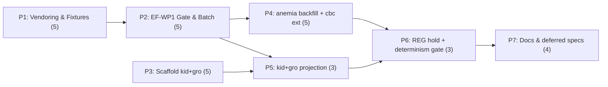

# Implementation Plan: E1 Multi-Bundle Conversion Pass

**Plan ID**: `IMPL-2026-07-21-multi-bundle-conversion-e1`
**Date**: 2026-07-21
**Author**: `implementation-planner` agent (sonnet), expanding an Opus-authored decisions block
**Human Brief**: `docs/project_plans/human-briefs/multi-bundle-conversion-e1.md`
**Related Documents**:
- **PRD**: `docs/project_plans/PRDs/infrastructure/multi-bundle-conversion-e1.md` (FR-1..FR-24, R-1..R-8, OQ-1..OQ-5)
- **Decisions Block** (binding, not contradicted below): `.claude/worknotes/multi-bundle-conversion-e1/decisions-block.md`
- **Design spec**: `docs/project_plans/expansion/02-evidence-foundry-on-research-foundry.md` — every task below cites a section anchor (`02 §N.N`) where applicable
- **E0 precedent (binding pattern)**: `docs/project_plans/implementation_plans/infrastructure/evidence-foundry-buildout-v1.md` and `modules/cbc_suite_v1/`

**Complexity**: Large (4-bundle batch conversion; two structural cases E0 never proved — merge-into-populated-module, greenfield-from-nothing)
**Total Estimated Effort**: 30 pts
**Provider**: `claude` for every task — offline deterministic build tooling, no UI, no generative-model calls (matches E0's posture exactly).

## Executive Summary

This plan runs the E0-proven `tools/rf-bundle-to-kb-pack/` converter across the 4 remaining clinical
`rf` evidence bundles, generalizing E0's one-off vendoring script into a reusable fixture generator,
adding a structural `EF-WP1` eligibility gate and a named-list batch runner, and then exercising the
two structural paths E0's single-bundle slice never touched: an additive backfill into `modules/anemia/`
(91 hand-authored rules, untouched) and a collision-safe merge into the already-populated
`modules/cbc_suite_v1/`. Two brand-new, greenfield module packages (`kidney_suite_v1`, `growth_suite_v1`)
are scaffolded and populated with evidence-only projections. `REG-001`/`REG-004` never enter any fixture,
module, or converter pathway — they get a standalone rights-posture HOLD record instead. **The load-bearing
outcome this plan exists to prove, not merely claim**: `npm run check` stays green throughout, and a diff
of every `modules/**/rules.json` and strict `candidates.json` in the repository shows zero additions
attributable to this pass. Seven phases run P1→P2→{P4,P5}→P6→P7 on the critical path, with P3
(greenfield scaffolding) parallel to P1→P2 and rejoining before P5.

## Implementation Strategy

### Architecture Sequence

This is a content-build-pipeline feature (same class as E0), not a layered CRUD feature. The sequence
follows the decisions block's boundary rationale (§1):

1. **Vendoring & fixtures** (P1) — generalize the input side; 4 committed, rights-audited fixtures.
2. **EF-WP1 gate & batch orchestration** (P2) — the drive side, bundle-agnostic, built once fixtures exist.
3. **Greenfield scaffolds** (P3) — target-specific, no file overlap with P1/P2; runs in parallel.
4. **Existing-module projections** (P4) — anemia backfill + cbc extension, the highest-risk work, isolated
   so a regression here cannot masquerade as P5 greenfield noise.
5. **Greenfield projections** (P5) — evidence lands in P3's fresh scaffolds only.
6. **REG hold, determinism & validation gate** (P6) — closes the report once all projections land.
7. **Docs & deferred-items design specs** (P7) — closes only after the mechanical output is frozen.

### Parallel Work Opportunities

- **P3 ∥ (P1→P2)** — scaffolding (`modules/kidney_suite_v1/**`, `modules/growth_suite_v1/**`,
  registries) shares zero files with vendoring/orchestration (`scripts/evidence/**`,
  `tools/rf-bundle-to-kb-pack/**`, `tests/fixtures/**`). Confirmed disjoint against both phases'
  `files_affected`.
- **P4 ∥ P5** (after P2, and P3 for P5) — P4 touches `modules/anemia/**` + `modules/cbc_suite_v1/**`;
  P5 touches `modules/kidney_suite_v1/**` + `modules/growth_suite_v1/**` — disjoint module ownership.
  P4 gets first-attention priority per the decisions block's risk framing even though both can run in
  the same wave.

### Critical Path

**P1 → P2 → P4 → P6 → P7** (5 + 5 + 5 + 3 + 4 = 22 of 30 pts). P5 (3 pts) and P3 (5 pts) carry slack —
P3 has the full P1+P2 duration (10 pts) of slack before P5 needs it; P5 has P4's duration of slack
before P6 needs it.

### Phase Summary

| Phase | Title | Estimate | Target Subagent(s) | Model(s) | Provider | Profile | Notes |
|-------|-------|---------:|---------------------|----------|----------|---------|-------|
| P1 | Rights-aware vendoring & fixtures | 5 pts | node-tooling engineer (general-purpose); task-completion-validator gate | sonnet | claude | — | Fail-closed rights handling — extended effort |
| P2 | EF-WP1 eligibility gate & batch orchestration | 5 pts | node-tooling engineer (general-purpose); task-completion-validator gate | sonnet | claude | — | Bounded new surface over the existing E0 converter |
| P3 | Greenfield module scaffolds (kidney, growth) | 5 pts | module engineer (general-purpose); task-completion-validator gate; **karen mid-milestone review** | sonnet | claude | — | Integration owner: module engineer. Seam task: P3-T3 (dual registry wiring) |
| P4 | Existing-module projections (anemia backfill, cbc extension) | 5 pts | module engineer (general-purpose); task-completion-validator gate | sonnet | claude | — | **Highest risk** — integration owner: module engineer. Seam tasks: P4-T4 (anemia ref-integrity), P4-T7 (cbc byte-identity) |
| P5 | Greenfield projections (kidney, growth) | 3 pts | module engineer (general-purpose); task-completion-validator gate | sonnet | claude | — | Conflict-object correctness |
| P6 | REG hold, determinism & validation gate | 3 pts | validation engineer (general-purpose); task-completion-validator gate; **karen milestone review** | sonnet | claude | — | Multi-bundle conversion report closes here |
| P7 | Docs & deferred-items design specs | 4 pts | documentation writer (general-purpose); task-completion-validator gate; **karen end-of-feature review** | sonnet | claude | — | 4 deferred-item design specs (DOC-006 style) |
| **Total** | — | **30 pts** | — | — | — | — | Matches decisions block §4 bottom-up total exactly (±0%) |

**No `*.tsx`-touching phase exists in this plan** — R-P4's runtime-smoke requirement is explicitly
inapplicable: the clinician SPA (`src/app.js`) and `server.mjs`/`openapi.yaml` are not in any phase's
`files_affected`, confirmed against the PRD's own NFR framing ("the deployed clinician SPA and API are
unmodified until an out-of-scope, human-gated release-assembly step").

> Estimation rationale (H1-H6, bottom-up sums, anchor comparison) lives in
> `docs/project_plans/human-briefs/multi-bundle-conversion-e1.md` §2 — this plan retains only per-task
> point estimates.

### Estimation Sanity Check (pointer)

Full H1–H6 application lives in the Human Brief §2. Summary: **bottom-up total 30 pts**, anchored to
E0's 42 pts (converter-reuse justifies the ~29% reduction — the converter's own build, E0's most
expensive line item, is a sunk, proven asset here). H4 bundle-vs-sum over 4 capability areas
(vendoring/fixtures, orchestration, scaffolding, projection) sums to exactly 30 with no compression.

### Phase Detail Files

Full task tables, acceptance criteria, and per-task Model/Effort assignments live in the phase files
(this parent stays under the 800-line guideline per `file-structure.md`):

- **[Phase 1-2: Vendoring & Batch Orchestration](./multi-bundle-conversion-e1/phase-1-2-vendoring-batch-orchestration.md)**
- **[Phase 3-4: Greenfield Scaffolds & Existing-Module Projections](./multi-bundle-conversion-e1/phase-3-4-scaffolds-and-backfill.md)**
- **[Phase 5-6-7: Greenfield Projections, Determinism Gate & Docs](./multi-bundle-conversion-e1/phase-5-6-7-projection-determinism-docs.md)**

## Decisions & OQ Resolutions

The decisions block (§7) leaves OQ-1 through OQ-4 for this plan to resolve; the PRD (§12) additionally
names OQ-5, resolved here for scope-boundedness. All five resolutions below are **binding** — phase
executors must not reopen them without a new decisions-block entry.

**OQ-1 (decisions block §7 / PRD §12) — Anemia backfill reconciliation.** Resolved as: **leave both
pipelines permanently separate, documented as parallel provenance views** (PRD's option (a)), not
merged. `modules/anemia/evidence-assertions.json` (this pass, P4-T2) is new and additive;
`modules/anemia/evidence.json` (the EP-3/EP-4 pipeline's prior output) is byte-unchanged. P4-T3 writes
a short reconciliation note (not a design spec — that is Deferred Item 4 / P7-T4's job) documenting
this seam explicitly at the point of creation, so no future reader has to infer it. The actual
reconciliation *procedure* — whether a future pass generates `evidence.json`'s `runId` citations from
`evidence-assertions.json`, or deprecates the EP-3/EP-4 pipeline's role for this bundle — is out of
scope here and is Deferred Item 4 (§ below), promoted to a full design-spec stub in P7-T4.

**OQ-2 (decisions block §7) — `cbc_suite_v1.knowledgeBaseVersion` bump policy.** Resolved: **no bump**.
`knowledgeBaseVersion` gates clinical-content release readiness (it is read alongside `status`,
`approvedBy`, and `clinicalContentHash` as a release-posture field per `docs/architecture.md` §2a); a
version bump with zero rule changes would misleadingly suggest clinical content changed. New evidence
is instead made auditable through the *already-present* per-`rfRunId` provenance in
`evidence-assertions.json` (`rfProvenance.rfRunId`, `rfSourceCardId` on every assertion — see
`modules/cbc_suite_v1/evidence-assertions.json`'s existing shape) — a reader who needs "what evidence
landed and when" reads the provenance array and the conversion report, not the version field. P4-T5's
acceptance criteria assert `cbc_suite_v1/module.json.knowledgeBaseVersion` is byte-identical before and
after the `RF-CBC-002` merge.

**OQ-3 (decisions block §7) — Committed-vs-gitignored boundary for rule-less projections.** Resolved
per the user's explicit instruction: rule-less evidence-layer output — `evidence.json`,
`evidence-assertions.json`, and `unresolved.json` — is **committed directly into `modules/<id>/`**,
mirroring E0's `cbc_suite_v1` precedent exactly. This applies to all 4 bundles' output, not only
`cbc_suite_v1`'s. `candidate-scaffolds.json` (FR-10's out-of-band, unapproved artifact) is the one
exception — it stays **staged under `build/kb-pack/<module_id>/<pack_version>/` only**, which remains
`.gitignore`d per E0's `.gitignore` entry; it is never committed and never merged into any module's
runtime `candidates.json`.

**OQ-4 (decisions block §7 / PRD §12) — Final module IDs.** Resolved: **`kidney_suite_v1` /
`growth_suite_v1`** — matches the PRD's own `files_affected` frontmatter and the `cbc_suite_v1` naming
convention exactly (`<clinical-area>_suite_v1`). No alternative naming is introduced.

**OQ-5 (PRD §12 only, not in the decisions block — resolved here for scope-boundedness) — Candidate-
scaffold schema.** Resolved: **hand-written structural check only**, no new
`schemas/candidate-scaffold.schema.json` file — mirrors E0's own OQ-7 ruling (decisions block for E0
named exactly 4 new schema types and declined to expand that set). `candidate-scaffolds.json`'s
structural check (fields present: `scaffoldId`, `supportingClaimIds[]`, `moduleId`, `rationale`) lands
in P5-T3 as a hand-written assertion, not a JSON-Schema file.

## Deferred Items & In-Flight Findings Policy

### Deferred Items Triage Table

Every row below gets exactly one Phase 7 task authoring its `Target Spec Path` (full task table in the
Phase 5-6-7 file). Categories per `deferred-items-and-findings.md`: `research` \| `prereq` \| `design`
\| `tech-debt` \| `policy`.

| Item ID | Category | Reason Deferred | Trigger for Promotion | Target Spec Path |
|---------|----------|------------------|------------------------|-------------------|
| DF-E1-M1 | design | Rule-authoring workflow per module (how an approved `authoring-decisions.yaml` record actually gets written for `RF-EV-001`/`RF-CBC-002`/`RF-KID-001`/`RF-GRO-002` claims) needs rule-schema v2 (ADR-0001, still `proposed`) resolved first | ADR-0001 accepted + E1 rule-authoring iteration approved | `docs/project_plans/design-specs/rule-authoring-workflow-per-module.md` |
| DF-E1-M2 | prereq | Clinical-review-portal intake of this pass's conflict objects / candidate scaffolds / `unresolved.json` needs named credentialed reviewers and a review-state model (ADR-0004, still `proposed`) that don't exist yet | ADR-0004 accepted + reviewer roles named | `docs/project_plans/design-specs/clinical-review-portal-intake-e1-artifacts.md` |
| DF-EXT-M1 | policy | `REG-001`/`REG-004` legal sign-off routing is an owner/legal-team action, not engineering work this repository can perform | Legal review completed and recorded | `docs/project_plans/design-specs/reg-001-004-legal-signoff-routing.md` |
| DF-E1-M3 | research | Anemia backfill reconciliation *procedure* between the EP-3/EP-4 `evidence.json` content and this pass's new `evidence-assertions.json` (OQ-1 names the seam; this pass documents it, does not resolve it) | Reconciliation procedure prioritized in a later E1 iteration | `docs/project_plans/design-specs/anemia-backfill-reconciliation-procedure.md` |

### In-Flight Findings

Not pre-created. `findings_doc_ref` stays `null` until the first real execution-time finding, per the
lazy-creation rule. If one occurs, the executing agent creates
`.claude/findings/multi-bundle-conversion-e1-findings.md`, sets this plan's `findings_doc_ref`, and —
if load-bearing — adds a new Phase 7 design-spec task and appends the resulting path to
`deferred_items_spec_refs`.

### Quality Gate

Phase 7 (Phase 5-6-7 file, P7-GATE `karen` end-of-feature review) cannot close until: all 4 rows above
have their `Target Spec Path` authored; `deferred_items_spec_refs` frontmatter lists all 4 paths;
`findings_doc_ref` is either `null` (no findings) or finalized at `status: accepted`.

## Plan Generator Rule Compliance (R-P1..R-P4)

- **R-P1** (no vague "all/across"): every phase task table (phase files) enumerates concrete file
  paths, module IDs (the 4 bundles map to exactly `modules/anemia/`, `modules/cbc_suite_v1/`,
  `modules/kidney_suite_v1/`, `modules/growth_suite_v1/`), and bounded lists (4 fixtures, 4 conflict
  classes, 4 deferred-item specs) — no unbounded "all rules"/"across the KB" phrasing appears anywhere
  in this plan, matching the PRD.
- **R-P2** (every new artifact field ⇒ "consumer handles missing/empty X" AC): applied throughout —
  every task introducing `unresolved.json` entries, `multi-bundle-conversion-report.json` fields, or
  per-`rfRunId` provenance fields carries an explicit AC that a consumer (validator, batch runner,
  downstream reader) handles the missing/empty case without silent fallback. See per-task ACs in the
  phase files, in particular P2-T4, P5-T1/T2/T3, and P6-T4.
- **R-P3** (≥2 owner specialties + overlapping `files_affected` ⇒ `integration_owner` + seam task):
  applied to **Phase 3** (integration owner: module engineer; seam task P3-T3, the dual
  `src/modules/registry.js` + `src/facts/registry.js` wiring, is the join point between the
  independently-scaffolded `kidney_suite_v1` and `growth_suite_v1` packages) and **Phase 4**
  (integration owner: module engineer; seam tasks P4-T4 — anemia rule→evidence reference integrity
  survives the backfill — and P4-T7 — `cbc_suite_v1`'s E0-era content proven byte-identical
  post-merge). See the Phase 3-4 file for both.
- **R-P4** (UI-touching phases need a runtime-smoke task): **not applicable, stated explicitly per the
  task instructions**. No `*.tsx`/`*.jsx`/HTML-template file, `src/app.js`, `server.mjs`, or
  `openapi.yaml` appears in any phase's `files_affected` — this feature is a build-time content
  pipeline touching only `modules/**`, `tools/rf-bundle-to-kb-pack/**`, `scripts/**`, `tests/**`, and
  docs. The clinician SPA and mirror API are untouched by every task in this plan.

## LOAD-BEARING Honesty Acceptance Criteria (repeated here, not only per-phase)

Per the decisions block's Notes for implementation-planner: **P4 and P5 each carry an explicit AC
asserting zero new clinical rules emitted** and that every module touched or created stays
`status: "unsigned-stub"`, `approvedBy: []`, `clinicalContentHash: null`. These ACs are load-bearing —
"module complete" or "conversion succeeded" must never be read as implying clinical readiness anywhere
in this plan's output. See P4-T8 and P5-T4 in the phase files for the exact, testable AC text; P6-T4's
`multi-bundle-conversion-report.json` is the single aggregate surface where the "0 rules across all 4
bundles" claim is demonstrated by diff, not asserted by prose.

## Risk Mitigation

Expanded from decisions block §3 (Risk Hotspots); per-phase mitigations also appear in each phase's
Quality Gates.

| Risk | Impact | Likelihood | Mitigation Strategy |
|------|:------:|:----------:|----------------------|
| R-1 — anemia backfill clobbers the hand-authored 91-rule KB | High | Medium | P4-T2 additive-only (new file); P4-T4 seam task asserts rule→evidence reference integrity + full anemia test suite green before/after; P4-T1 pre-merge snapshot hash |
| R-2 — `cbc_suite_v1` merge (second-bundle-into-populated-module) is unproven | High | Medium | P4-T5 collision-checked, additive-only, idempotent merge (stable IDs, never array position); P4-T6 double-run idempotency test; P4-T7 post-merge byte-identity proof against P4-T1's snapshot |
| R-3 — silent rule fabrication under "make progress" pressure | High | Medium | P4-T8/P5-T4 explicit zero-new-rules ACs; `approvedBy: []`/null `clinicalContentHash` schema-enforced; P6-T4 conversion report shows rule-count deltas by diff; karen checks no artifact is described as validated/approved |
| R-4 — rights leakage from REG / restricted-quote bundles | Medium | Low | P1-T7 grep-gate over all 4 committed fixtures; REG bundles get P6-T1's HOLD record only, never a fixture or converter run (P6-T2 regression test) |
| R-5 — non-determinism across the 6-bundle batch | Medium | Low | P6-T3 double-run determinism suite over every bundle; canonical sort/serialize; stable batch-runner iteration order (P2-T3) |
| R-6 — batch partial-failure ordering produces inconsistent state | Medium | Medium | P2-T5 fail-closed test: a mid-batch bundle failure names the failing bundle, halts, does not partially write its output, does not corrupt already-succeeded bundles |
| R-7 — `REG-001`/`REG-004` accidentally become a converter target | High | Low | P2-T6/P6-T2 assert an explicit, named `{fixture, module}` list is used — never a directory glob; test confirms neither `REG-*` run is ever read by any script this pass adds |
| R-8 — registry wiring silently changes selectable-module surface | Medium | Low | P3-T3 explicitly freezes `DEFAULT_MODULE_ID` at `'anemia'`, forbids any new client-selectable `moduleId` surface, mirroring E0's own `cbc_suite_v1` registration precedent |

## Model, Provider & Profile Assignment

All tasks in the phase files carry **Model**, **Effort**, **Provider**, and **Profile** columns.
Reference: `.claude/skills/planning/references/multi-model-guidance.md` and
`.claude/specs/provider-routing-spec.md §3`.

- **Model defaults**: `sonnet` for every task in this plan — no haiku, no external model routing. This
  matches the decisions block §6 "no external-model tasks... matching E0's `provider: claude`
  convention" ruling, extended to P7's docs/design-spec tasks (architectural judgment, not routed to
  haiku, matching E0's own P6/P7 precedent).
- **Effort**: `adaptive` by default; `extended` on P1 (rights-aware, fail-closed byte handling — the
  same class of reasoning-heavy work E0's Phase 1 fixture task used) and P4 (existing-module mutation +
  reconciliation — the plan's single highest-risk phase).
- **Provider**: `claude` for all 30 pts. No UI design, no image generation, no web-research component.

## Wrap-Up: Feature Guide & PR

Triggered automatically after Phase 7 is sealed (all quality gates pass, `karen` end-of-feature review
passed). Delegate to `documentation-writer` (sonnet) to create
`.claude/worknotes/multi-bundle-conversion-e1/feature-guide.md` per the standard template (What Was
Built / Architecture Overview / How to Test / Test Coverage Summary / Known Limitations, ≤200 lines).
Commit the feature guide before opening the PR. PR title should name the conversion pass and its
"zero new rules" outcome explicitly (e.g., "Convert 4 remaining rf bundles to evidence projections —
zero new clinical rules (E1)"); derive the PR summary from this plan's Executive Summary and the
CHANGELOG entry authored in P7-T5.

---

**Progress Tracking**: `.claude/progress/multi-bundle-conversion-e1/` (one file per phase, created via
the `artifact-tracking` skill during execution — `progress_init: auto`).

---

**Implementation Plan Version**: 1.0
**Last Updated**: 2026-07-21
